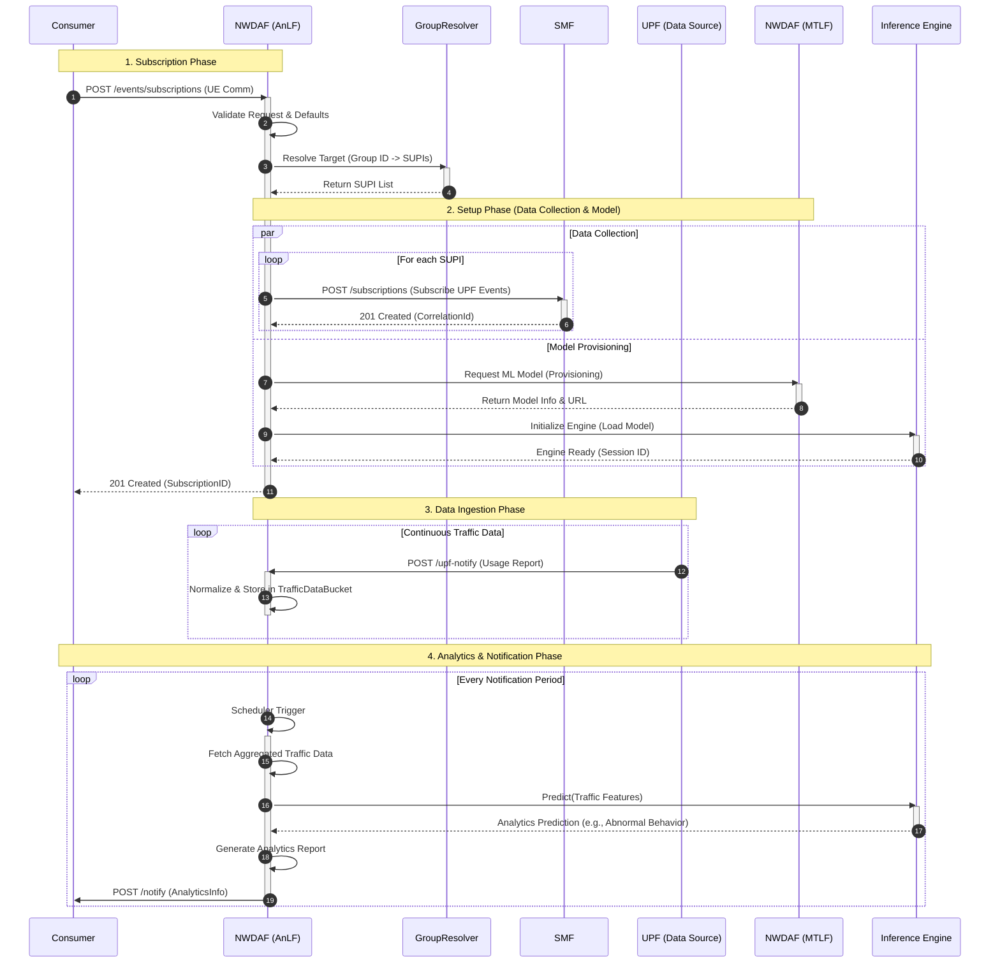

# UE Communication Analytics Workflow

This document illustrates the high-level workflow of the NWDAF (AnLF) for UE Communication Analytics (`UE_COMM`), including subscription handling, data collection triggering, ML model provisioning, and periodic notification.

## Workflow Diagram

## Detailed Steps

1.  **Subscription**: Consumer sends a subscription request for `UE_COMMUNICATION` analytics. AnLF validates the request and uses `GroupResolver` to translate any Group IDs into a list of individual SUPIs.
2.  **Setup**:
    *   **Data Collection**: AnLF subscribes to the SMF for UPF events (Using `Supi` and `CorrelationId`) for each target UE.
    *   **Model Provisioning**: AnLF requests an ML model from the MTLF. Upon receiving the Model URL, it initializes the internal Inference Engine for future predictions.
3.  **Data Ingestion**: The UPF (simulated via SMF configuration or directly) sends periodic usage reports (`USER_DATA_USAGE_MEASURES`) to AnLF. AnLF stores this raw data, enriched with identifiers.
4.  **Notification**: When the reporting period defined in the consumer subscription expires, AnLF:
    *   Retrieves accumulated data.
    *   Calls the Inference Engine to `Predict`.
    *   Formats the result into an `AnalyticsInfo` notification.
    *   Sends the notification back to the Consumer.
