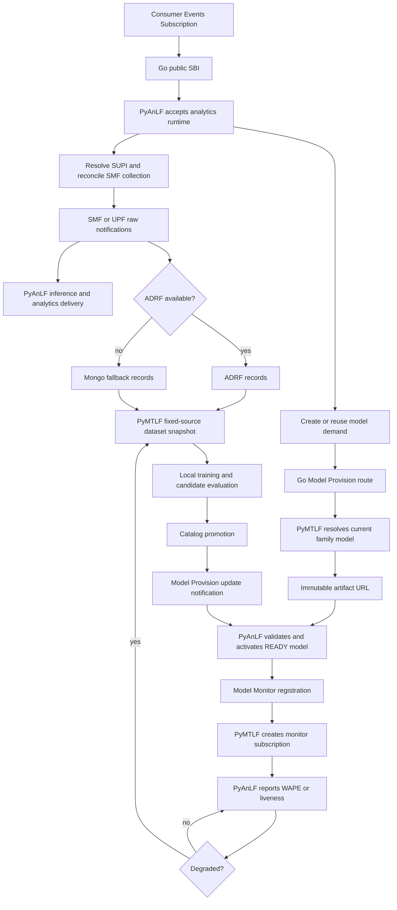
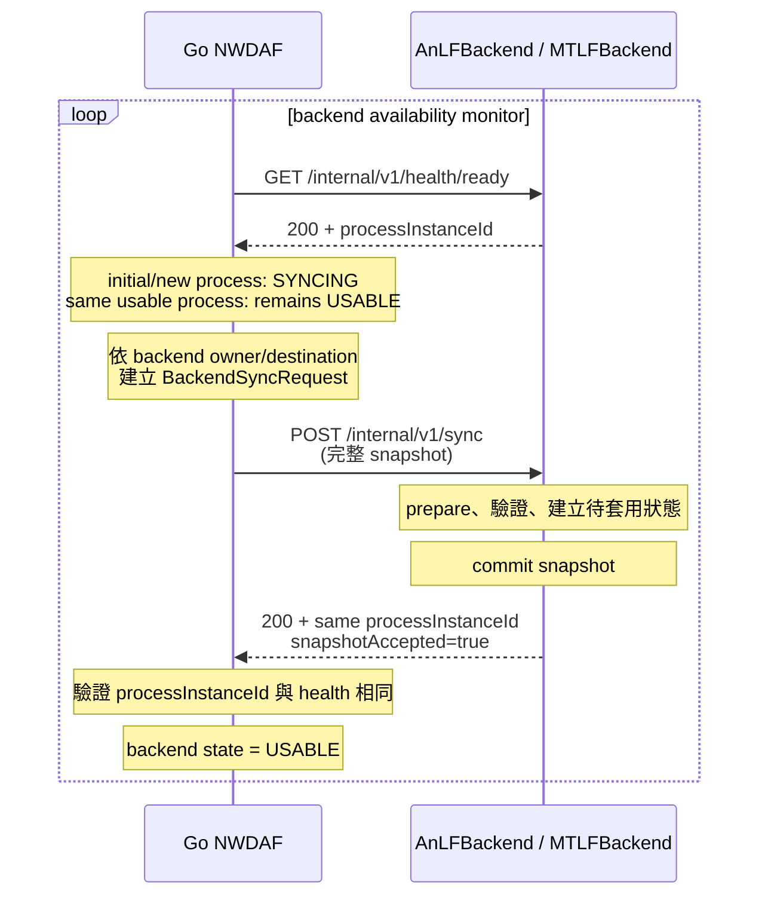
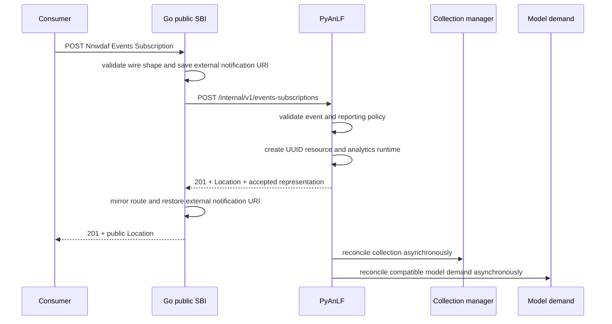
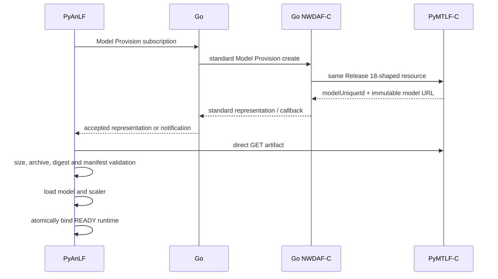
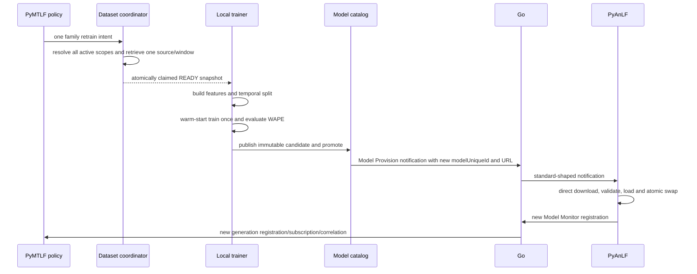
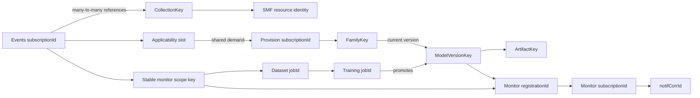

# NWDAF AnLF／MTLF Current Feature Architecture

Date: 2026-08-10

Status: Implemented through backend process failure and stateless reconnection

Implementation repositories:

- Go NWDAF, PyAnLF, PyMTLF and nwdaf-resources follow the Phase 1 through Phase 8 design recorded below.
- team SMF uses the Release 18 federated-learning experiment branch.
- team go-upf uses `dev/federated-learning` at `c69051b`, including standalone EES replay, Release 18 Event Exposure fields and configured GTP interface handling.

Related documents:

- `../plans/mtlf-backend-transition/MTLF Backend Transition Plan.md`
- `../plans/mtlf-backend-transition/Phase 3 Analytics Subscription Routing.md`
- `../plans/mtlf-backend-transition/Phase 4 ML Model Monitoring And Accuracy Policy.md`
- `../plans/mtlf-backend-transition/Phase 5 Dataset Selection And Direct Retrieval.md`
- `../plans/mtlf-backend-transition/Phase 6 Local Training And Model Update Reprovision.md`
- `../plans/mtlf-backend-transition/Phase 7 Deployment Integration And Legacy Closure.md`
- `../plans/mtlf-backend-transition/Phase 8 Backend Process Failure And Stateless Reconnection.md`
- `../plans/anlf-backend-transition/AnLF Backend Transition Plan.md`
- `../development_policy.md`

---

## 1. 文件目的

這份文件描述baseline revisions所對應之NWDAF、PyAnLF與PyMTLF實際架構，包括：

1. component責任與部署邊界。
2. 各feature的完整HTTP與background worker行為路徑。
3. public SBI、standard-shaped private boundary及private lifecycle contract。
4. request／response schema、header、status與resource correlation。
5. Go process-local route ledger、backend process generation及stateless context。
6. subscription、collection、model、monitor、dataset與training的identity關係。
7. acknowledgement、failure、concurrency與restart語意。

本文以runtime code與tests為實作依據；各backend逐一endpoint的HTTP參考另見`PyAnLF/docs/api.md`及
`PyMTLF/docs/api.md`。

---

## 2. 系統邊界

### 2.1 部署角色

```text
External consumer
        |
        | public 3GPP SBI
        v
+------------------------- Go NWDAF --------------------------+
| NF identity / NRF registration / public SBI                 |
| shared NRF discovery cache / SMF and ADRF clients           |
| external callback routing / process-local resource mirrors  |
|                                                              |
| :8090 AnLF auxiliary edge       :8091 MTLF auxiliary edge   |
+---------------+----------------------------+-----------------+
                |                            |
                v                            v
         PyAnLF :9093                  PyMTLF :9092
   analytics and collection       accuracy, dataset, training
                ^                            |
                |                            +----> ADRF direct GET
                |
       SMF/UPF direct callback
```

PyAnLF與PyMTLF都是同一個NWDAF的internal backend：

- 不獨立向NRF註冊。
- 不擁有自己的標準NF identity。
- Go code與config只使用`anlfBackend`、`mtlfBackend`命名，不出現Python implementation name。
- backend可使用普通HTTP；目前沒有把TLS、OAuth或certificate delegation延伸到Python process。

### 2.2 責任總表

| Component | Authoritative responsibility |
|---|---|
| Go NWDAF | public SBI、OpenAPI transport validation、NF identity、NRF註冊與discovery、shared discovery cache、SMF／ADRF標準client、external callback routing、backend polling與process-local resource mirror |
| PyAnLF | Events Subscription business acceptance、analytics runtime、Group ID expansion、SMF selection與collection refcount、UPF／SMF notification ingestion、inference、analytics report、ADRF-first storage policy、Mongo fallback、model download／activation、WAPE measurement |
| PyMTLF | model family與artifact catalog、Model Provision producer、Model Monitor producer/policy、dataset scope與window、ADRF／Mongo retrieval、local training、candidate evaluation、promotion與updated model notification |
| ADRF | 標準raw data record storage、retrieval subscription、fetch instruction及record retrieval |
| MongoDB | ADRF不可用時的本地raw notification fallback；不是Go state store，也不保存control-plane subscription truth |

Go不決定SMF選擇、ADRF選擇、storage sink、accuracy threshold、dataset window、training eligibility或model
promotion。Python backend也不繞過Go，以獨立NF身分呼叫NRF、SMF或標準Model Provision／Monitor service。

### 2.3 完整功能閉環

下圖把後續各feature章節串成同一條current runtime閉環。上半部是consumer訂閱後的analytics與initial model
準備；下半部是資料保存、accuracy degradation、retraining及model replacement。



這條閉環不是單一同步transaction：

- Events Subscription acceptance不等待collection或model ready。
- raw notification acknowledgement不等待storage、inference或analytics delivery。
- Model Provision notification acknowledgement不等待artifact activation。
- retraining completion不等待PyAnLF採用new model；new Model Monitor registration才是current activation evidence。
- 各段透過resource identity、route mirror、revision及background reconciliation最終收斂。

---

## 3. HTTP Contract Architecture

### 3.1 Listener與direction

| Listener | Default base URI | Caller | Function |
|---|---|---|---|
| Go public SBI | `http://127.0.0.1:8080` | external NF／consumer、ADRF callback | NWDAF public standard services與ADRF retrieval callback |
| Go AnLF auxiliary edge | `http://127.0.0.1:8090` | PyAnLF | NRF／SMF／ADRF／Model／analytics outbound gateway |
| Go MTLF auxiliary edge | `http://127.0.0.1:8091` | PyMTLF | NRF／ADRF retrieval／Model outbound gateway |
| PyAnLF backend | `http://127.0.0.1:9093` | Go、SMF、UPF | analytics resources、model consumer、monitor measurement、data callbacks |
| PyMTLF backend | `http://127.0.0.1:9092` | Go、PyAnLF artifact client | model producer、monitor policy、dataset、training與artifact |

Go auxiliary edge與Python backend都使用plain HTTP。Public SBI可依Go config使用HTTP或HTTPS。Python backend不
使用獨立NF identity、NRF registration或OAuth credential。

### 3.2 Go public SBI

| Service and path | Method | Request schema | Success contract | Backend owner |
|---|---|---|---|---|
| `/nnwdaf-eventssubscription/v1/subscriptions` | `POST` | `NnwdafEventsSubscription` | `201`、`Location`、accepted representation | PyAnLF |
| `/nnwdaf-eventssubscription/v1/subscriptions/{subscriptionId}` | `PUT` | `NnwdafEventsSubscription` | `200`、accepted representation | PyAnLF |
| same resource | `DELETE` | none | `204` | PyAnLF |
| `/nnwdaf-mlmodelprovision/v1/subscriptions` | `POST` | `NwdafMLModelProvSubsc` | `201`、`Location`、accepted representation | PyMTLF |
| `/nnwdaf-mlmodelprovision/v1/subscriptions/{subscriptionId}` | `PUT` | `NwdafMLModelProvSubsc` | `200`、accepted representation | PyMTLF |
| same resource | `DELETE` | none | `204` | PyMTLF |
| `/nnwdaf-mlmodelmonitor/v1/registrations` | `POST` | `MLModelMonitorRegistration` | `201`、`Location`、accepted representation | PyMTLF |
| `/nnwdaf-mlmodelmonitor/v1/registrations/{registrationId}` | `DELETE` | none | `204` | PyMTLF |
| `/nnwdaf-mlmodelmonitor/v1/subscriptions` | `POST` | `MLModelMonitorSub` | `201`、`Location`、accepted representation | PyAnLF |
| `/nnwdaf-mlmodelmonitor/v1/subscriptions/{subscriptionId}` | `PUT` | `MLModelMonitorSub` | `200`、accepted representation | PyAnLF |
| same resource | `DELETE` | none | `204` | PyAnLF |
| `/collector/retrieval-notify` | `POST` | `NadrfDataRetrievalNotification` | PyMTLF接受完整notification後`204` | PyMTLF |

Go在public boundary驗證media type、body size、standard schema及operation-specific required fields。JSON error
response使用`application/problem+json`與`ProblemDetails`。backend unavailable且operation依賴該backend時，
Go回`503`；unknown local resource回operation對應的`404`。

### 3.3 Go → PyAnLF

| Method and path on `:9093` | Body／metadata | Success | Behavior |
|---|---|---|---|
| `GET /health/ready` | none | `200`或`503`，含`status`與`processInstanceId` | backend readiness |
| `POST /internal/v1/events-subscriptions` | `NnwdafEventsSubscription` | `201`、`Location`、accepted representation | create analytics resource |
| `PUT /internal/v1/events-subscriptions/{id}` | same | `200` representation | replace analytics resource |
| `DELETE /internal/v1/events-subscriptions/{id}` | none | `204` | release analytics resource |
| `POST /internal/v1/ml-model-provision/subscriptions/{id}/notifications` | non-empty `NwdafMLModelProvNotif[]` | `204` | correlate and enqueue model update |
| `POST /internal/v1/ml-model-monitor/subscriptions` | `MLModelMonitorSub` | `201`、`Location`、representation | create measurement resource |
| `PUT /internal/v1/ml-model-monitor/subscriptions/{id}` | same | `200` representation | replace measurement resource |
| `DELETE /internal/v1/ml-model-monitor/subscriptions/{id}` | none | `204` | delete measurement resource |

Events Subscription body與Model bodies保留Release 18 JSON field name。Go將external Events
`notificationURI`替換為自己的AnLF auxiliary callback，再保存external URI於route mirror。

Model Provision notification的path ID必須與每一個notification的`subscriptionId`相同。Model Monitor
subscription必須能對應READY runtime的model、event、filter、target、callback URI與correlation。

### 3.4 Go → PyMTLF

| Method and path on `:9092` | Body／metadata | Success | Behavior |
|---|---|---|---|
| `GET /health/ready` | none | `200`或`503`，含`processInstanceId` | catalog／artifact readiness |
| `POST /internal/v1/ml-model-provision/subscriptions` | `NwdafMLModelProvSubsc` | `201`、`Location`、representation | create model demand resource |
| `PUT /internal/v1/ml-model-provision/subscriptions/{id}` | same | `200` representation | replace model demand |
| `DELETE /internal/v1/ml-model-provision/subscriptions/{id}` | none | `204` | delete model demand |
| `POST /internal/v1/ml-model-monitor/registrations` | `MLModelMonitorRegistration` | `201`、`Location`、representation | register READY model-use scope |
| `DELETE /internal/v1/ml-model-monitor/registrations/{id}` | none | `204` | remove scope registration |
| `POST /internal/v1/ml-model-monitor/notifications` | `MLModelMonitorNotify` | `204` | correlate WAPE/liveness report and run policy |
| `POST /internal/v1/adrf-data-management/retrieval-notifications` | `NadrfDataRetrievalNotification` | `204` | deliver ADRF fetch instruction |

Monitor notification由`notifCorrId`找到Go與PyMTLF保存的subscription projection；Go在建立Monitor
subscription時以private `X-NWDAF-Monitor-Registration-Id` header關聯active registration owner。這個private
metadata不加入standard wire body。

### 3.5 PyAnLF → Go AnLF auxiliary edge

| Method and path on `:8090` | Request | Required metadata | Success |
|---|---|---|---|
| `GET /internal/v1/nwdaf-context` | none | none | containing NWDAF `nfInstanceId`、public `apiRoot`及AnLF `internalApiRoot` |
| `GET /internal/v1/nrf/nf-instances` | standard NF Discovery query | `target-nf-type`、`requester-nf-type`、`service-names` | `200 SearchResult` |
| `POST /internal/v1/smf-event-exposure/subscriptions` | `NsmfEventExposure` | `Target-Api-Root` | peer `201`、`Location`、representation |
| `GET /internal/v1/smf-event-exposure/subscriptions/{id}` | none | `Target-Api-Root` | peer `200` representation |
| `PUT /internal/v1/smf-event-exposure/subscriptions/{id}` | `NsmfEventExposure` | `Target-Api-Root` | peer `200` representation或`204` |
| `DELETE /internal/v1/smf-event-exposure/subscriptions/{id}` | none | `Target-Api-Root` | peer `204` |
| `PUT /internal/v1/anlf/training-data-descriptors/{descriptorId}` | incremental descriptor | standard-shaped `smfDataSub`、scope、source及window | `204` |
| `DELETE /internal/v1/anlf/training-data-descriptors/{descriptorId}` | none | descriptor identity | `204` |
| `POST /internal/v1/adrf-data-management/data-store-records` | `NadrfDataStoreRecord` | `Target-Api-Root` | peer `201`及`Location` |
| `POST /internal/v1/events-subscription-notifications` | `NnwdafEventsSubscriptionNotification[]` | subscription/correlation在body | external consumer接受後`204` |
| `POST /internal/v1/ml-model-provision/subscriptions` | `NwdafMLModelProvSubsc` | none | PyMTLF `201`、`Location`、representation |
| `PUT /internal/v1/ml-model-provision/subscriptions/{id}` | same | none | PyMTLF `200` representation |
| `DELETE /internal/v1/ml-model-provision/subscriptions/{id}` | none | none | PyMTLF `204` |
| `POST /internal/v1/ml-model-monitor/registrations` | `MLModelMonitorRegistration` | none | PyMTLF `201`、`Location`、representation |
| `DELETE /internal/v1/ml-model-monitor/registrations/{id}` | none | none | PyMTLF `204` |
| `POST /internal/v1/ml-model-monitor/notifications` | `MLModelMonitorNotify` | `notifCorrId`在body | PyMTLF `204` |
| `POST /internal/v1/ml-model-monitor/subscriptions/{id}/notifications` | same | path ID加上body correlation | PyMTLF `204` |

`Target-Api-Root`是backend選定的SMF或ADRF HTTP(S) origin。Go不替backend選candidate；Go驗證origin、執行
standard request、保留peer status／`Location`／`ProblemDetails`，並維護必要的process-local route。

### 3.6 PyMTLF → Go MTLF auxiliary edge

| Method and path on `:8091` | Request | Required metadata | Success |
|---|---|---|---|
| `GET /internal/v1/nwdaf-context` | none | none | containing NWDAF `nfInstanceId`、public `apiRoot`及MTLF `internalApiRoot` |
| `GET /internal/v1/nrf/nf-instances` | standard NF Discovery query | `target-nf-type`、`requester-nf-type`、`service-names` | `200 SearchResult` |
| `POST /internal/v1/adrf-data-management/data-retrieval-subscriptions` | `NadrfDataRetrievalSubscription` | `Target-Api-Root` | peer `201`、`Location`、representation |
| `DELETE /internal/v1/adrf-data-management/data-retrieval-subscriptions/{id}` | none | route由Go create時保存 | peer `204` |
| `POST /internal/v1/ml-model-provision/notifications` | `NwdafMLModelProvNotif[]` | destination由Go route mirror決定 | destination接受後`204` |
| `POST /internal/v1/ml-model-provision/subscriptions/{id}/notifications` | same | path ID加上body correlation | destination接受後`204` |
| `POST /internal/v1/ml-model-monitor/subscriptions` | `MLModelMonitorSub` | `X-NWDAF-Monitor-Registration-Id` | PyAnLF `201`、`Location`、representation |
| `PUT /internal/v1/ml-model-monitor/subscriptions/{id}` | same | owner route已存在 | PyAnLF `200` representation |
| `DELETE /internal/v1/ml-model-monitor/subscriptions/{id}` | none | owner route已存在 | PyAnLF `204` |

ADRF retrieval create body的`notificationURI`固定指向containing NWDAF
`/collector/retrieval-notify`；`notifCorrId`由PyMTLF dataset job建立。Go只接受同origin的peer
`Location`並以該Location執行後續delete。

### 3.7 Direct data與artifact edges

| Direction | Method and endpoint | Contract |
|---|---|---|
| SMF → PyAnLF | `POST /callbacks/smf-event-exposure` | `NsmfEventExposureNotification`；active `notifId`；accepted to buffer後`204` |
| UPF → PyAnLF | `POST /callbacks/upf-event-exposure` | `UpfNotificationData`；active `correlationId`；accepted to buffer後`204` |
| PyMTLF → ADRF | `GET` fetch instruction URI | `fetch-correlation-ids`所指向的`NadrfDataStoreRecord`；`200` data或`204` no data |
| PyAnLF → PyMTLF | `GET /internal/v1/artifacts/{sha256}` | `application/gzip`、exact length、strong ETag、SHA-256 header、immutable cache |

除上述artifact download與ADRF direct fetch外，PyAnLF與PyMTLF之間沒有direct business RPC。Model
Provision、Model Monitor及accuracy notification都經Go resource mirror與standard-shaped route。

### 3.8 Go route mirrors

| Mirror key | Stored values | Used by |
|---|---|---|
| analytics `subscriptionId` | accepted representation、external notification URI、AnLF process generation | external analytics callback、failure notification與reset cleanup |
| `(SMF Target-Api-Root, peer subscription ID)` | peer Location、accepted Nsmf resource、correlation、NWDAF references、cleanup state | SMF CRUD與AnLF-loss one-shot cleanup |
| Model Provision `subscriptionId` | accepted/backend representation、initiator、destination、callback URI、correlation、backend generations | notification routing、lease refresh與reset cleanup |
| Model Monitor `registrationId` | accepted/backend representation、initiator、backend generations | subscription ownership與reset cleanup |
| Model Monitor `subscriptionId` | accepted/backend representation、destination、owner registration、callback correlation、backend generations | accuracy routing、watchdog與reset cleanup |
| ADRF retrieval `subscriptionId` | same-origin peer Location | terminal delete |

這些ledger只存在Go memory，不是可重播snapshot。backend loss後active entry被移除；需要接受consumer late
DELETE的resource只保留最小deletion record，不保留完整representation或Python runtime。

### 3.9 Transport與error contract

| Condition | Current response behavior |
|---|---|
| missing／unsupported JSON media type | `415` |
| request超過operation transport limit | `413` |
| malformed JSON或schema mismatch | `400 ProblemDetails` |
| mandatory standard field缺失 | `400 ProblemDetails`，cause依operation為`MANDATORY_IE_MISSING`或`INVALID_REQUEST` |
| local resource／correlation不存在 | `404 ProblemDetails` |
| backend尚未ready、NOT_READY或RESETTING | `503 ProblemDetails` |
| peer NF回declared standard error | 保留status與`ProblemDetails`跨Go boundary傳遞 |
| peer transport failure或invalid success contract | Go回`502`或對應的`503` availability response |

standard-shaped create只有在response符合operation成功contract時才建立Go mirror。例如Model Provision、Model
Monitor、SMF與ADRF create都要求`201`與可解析的`Location`；缺少resource identity的成功response視為invalid
peer success，不成為active accepted resource。SMF create若已由peer建立resource但representation不合法，
Location-derived identity只用於provisional cleanup。

### 3.10 Generic NRF Discovery Gateway與共用Cache

AnLF與MTLF auxiliary edge暴露相同的private discovery operation；兩條route最後進入同一個Go
`NrfService`。backend送入的query目前只接受：

```text
target-nf-type=SMF
requester-nf-type=NWDAF
service-names=nsmf-event-exposure
```

或：

```text
target-nf-type=ADRF
requester-nf-type=NWDAF
service-names=nadrf-datamanagement
```

Go補上自己的requester NF instance ID及必要OAuth context後呼叫NRF。cache key由NRF URI、requester NF
instance ID、target NF type、requester NF type及排序後的service names共同形成；只有完全相同的query才共用
entry。

current cache行為：

- `SearchResult.validityPeriod`必須存在且不可為負值。
- `validityPeriod > 0`才cache；explicit zero每次都重新查NRF。
- cache hit回傳剩餘validity，並以`Cache-Control: max-age=<remaining>`提供給backend。
- 同一cache key的concurrent miss只向NRF發出一次request。
- cache最多256 entries；先移除expired entry，滿額時移除最久未使用的entry。
- 保留NRF完整JSON envelope與Go generated model未識別的欄位，cache hit不會因重新marshal typed model而丟欄位。
- cache只存在Go process memory，不傳給backend，也不跨Go restart保留。

backend仍有自己的candidate cache：PyAnLF與PyMTLF依回傳的剩餘`validityPeriod`保存已解析endpoint。這層cache
避免backend重複解析與選擇candidate；Go cache則讓兩個backend的identical query共用同一次NRF結果。

Go不替backend挑選endpoint。PyAnLF的SMF流程保留所有registered
`nsmf-event-exposure` candidates；PyAnLF與PyMTLF的ADRF流程都將matching candidates依
`nfInstanceId`、service identity及API root作deterministic排序，選第一個distinct origin。current版本刻意不
實作priority、capacity或load-based selection。

規格對照：query、`SearchResult`與`validityPeriod`來自
`TS29510_Nnrf_NFDiscovery.yaml`及TS 29.510 clauses 5.3.2.2.1、5.3.2.2.2、6.2.6.2.2。256-entry bound、
singleflight、raw-envelope preservation及deterministic candidate selection是current implementation policy。

### 3.11 Callback Relay語意

Go的callback route是同步relay，不是message broker：

```text
source callback sender
    -> Go validates correlation and route
    -> Go calls current destination
    -> destination response
    -> Go returns corresponding result to source
```

Go不在memory或disk排隊等待destination恢復，也不先回`204`再背景傳送。因此：

- PyAnLF analytics delivery失敗時，由PyAnLF report delivery worker決定retry。
- PyMTLF Model Provision notification失敗時，由PyMTLF desired-state dispatcher決定retry／coalesce。
- ADRF retrieval notification只有在PyMTLF接受完整instruction後，Go才向ADRF回`204`。
- external callback的declared standard error可穿過Go回到sender；transport failure或invalid success response
  由Go轉成`502`／`503`類結果。

route mirror只解決destination及correlation，不提供durable delivery guarantee。

---

## 4. 共用 Lifecycle：Ready、Generation Reset與Stateless Reconnection

### 4.1 Current state machine

Go對AnLFBackend與MTLFBackend各自維護獨立狀態：

```text
DISABLED

WAITING -> USABLE(G1) -> NOT_READY -> USABLE(G1)
                    \-> RESETTING -> WAITING -> USABLE(G2)
```

- `GET /health/ready`是唯一probe；200與503都帶本次Python process產生的UUID `processInstanceId`。
- 200且ID相同維持USABLE；503且ID相同只進NOT_READY並保留old route。
- ID改變立即確認replacement；第一次純transport failure只進NOT_READY，連續第二次才確認loss。
- RESETTING先關閉new admission並等待舊generation in-flight request退出，再清理舊route。
- cleanup完成後回WAITING；G2 ready後只接受new POST，不接收G1 snapshot或重播舊resource。
- AnLF與MTLF彼此獨立；其中一邊未啟用或失效不會把另一邊一起停止。

business operation的一次5xx或transport error只把backend標成suspect並喚醒ready probe，不單憑該次request立即
宣告process loss。NOT_READY與RESETTING期間，需要該backend的新operation回503。

### 4.2 Generation cleanup

每筆analytics/model route記錄其所依賴的backend generation。Model Provision與Monitor的本地relationship可能
同時依賴AnLF consumer與MTLF provider，因此Go另記related backend generation，不能只從notification destination
推測owner。

backend loss後：

1. AnLF loss對已協商`EneNA`與`StatisticsFailure`的Events resource各嘗試一次
   `UNAVAILABLE_DATA` notification，然後清除analytics runtime route與SMF collection ledger。
2. MTLF loss不停止AnLF已載入模型與analytics，但清除provision、registration、monitor、training與FL control
   route。
3. backend作為standard consumer建立的peer relationship只送一次best-effort DELETE／Deregister；不建立
   process-loss retry queue。
4. provider resource沒有標準termination callback時不發明private termination message。
5. 清掉的public model／analytics resource保留最小memory deletion record；第一次late DELETE回204並消耗record，
   從未存在或已消耗的ID回404。

### 4.3 Stateless context與incremental descriptor

兩個backend按需讀取各自Go auxiliary edge的：

```http
GET /internal/v1/nwdaf-context
```

response只含containing NWDAF `nfInstanceId`、public `apiRoot`及該edge的`internalApiRoot`。它是immutable context
lookup，不含subscription、model、datasource或runtime snapshot，也不控制backend readiness。

PyAnLF只有在raw notification成功寫入current sink後，才以
`PUT /internal/v1/anlf/training-data-descriptors/{descriptorId}`增量發布可訓練scope/window/source；retention結束時
以DELETE移除。Go只轉送給當下可用的PyMTLF，失敗不做restart replay。PyMTLF依每筆descriptor的source與availability
直接從ADRF或Mongo取得資料。

### 4.4 Provider lease與monitor watchdog

- PyAnLF Model Provision request帶finite `monDur`，在到期前PUT refresh。200／204延長lease；404、503或transport
  failure清除舊provision identity及monitor registration identity，但保留已載入模型。同一批既有analytics demand
  不會隱式重新POST；之後新的或實質改變的model demand才可建立新relationship。
- PyMTLF對periodic Model Monitor使用`repPeriod * missed_report_threshold + grace` watchdog。任何合法report，即使
  不含deviation，也重設watchdog但不更新WAPE policy；timeout後只做一次DELETE並清除local monitor/policy state。

### 4.5 Restart與state inventory

| Restart | Current behavior |
|---|---|
| PyAnLF restart | 舊analytics、collection、model consumer及monitor provider runtime清空；Go清理G1，G2只接受new resource |
| PyMTLF restart | active provision/monitor/training/FL state清空；AnLF繼續使用已載入模型；completed model artifacts/catalog可從其durable repository重新載入 |
| Go restart | 所有route、deletion record及NRF cache消失；目前實驗視為new run，不接管peer orphan |

ADRF與Mongo資料依各自persistence保留，但本階段不做Mongo history回填ADRF或跨source合併。NRF profile仍依configured
capability廣告，不因backend瞬時NOT_READY反覆更新；public request會再以current backend availability決定是否回503。

---

## Appendix A. Superseded Phase 7 Sync Lifecycle

以下內容只保存Phase 7 full-state sync的歷史設計理由；Phase 8已移除`/health/live`、`/internal/v1/sync`、
`SYNCING`、snapshot replay及restart reconciliation，不得依本附錄實作current runtime。

### A.1 狀態機

Go分別追蹤AnLF backend與MTLF backend：

```text
UNKNOWN
   |
   v
POLLING --ready probe failed--> UNAVAILABLE
   |                              |
   | ready + processInstanceId    | bounded backoff / wake-up
   v                              |
SYNCING --------------------------+
   |
   | complete snapshot accepted by the same process
   v
USABLE --probe/transport failure or new processInstanceId--> UNAVAILABLE
```

`GET /health/live`只代表process存在；`GET /health/ready`代表backend內部manager已可接收snapshot，並回傳
該次process incarnation的UUID `processInstanceId`。只有sync成功後，Go才把backend標為`USABLE`。

Go在`USABLE`後仍會持續polling。backend crash、restart或live operation transport failure都會重新走完整
polling與sync，而不是只在Go啟動時做一次handshake。

### A.2 Sync內容

`BackendSyncRequest` top-level shape：

| JSON field | Content |
|---|---|
| `containingNwdaf` | `nfInstanceId`、public `apiBaseUri`、該backend專用`internalCallbackBaseUri` |
| `eventsSubscriptions` | `subscriptionId`、accepted `NnwdafEventsSubscription`、`externalNotificationUri` |
| `smfResources` | collection `correlationId`、peer `resourceLocation`、`targetApiRoot`、NWDAF references、cleanup flag、accepted Nsmf representation |
| `trainingDataSource` | `adrf`、`mongodb`或`unavailable`；只在MTLF sync使用 |
| `mlModelProvisionSubscriptions` | `subscriptionId`、representation、initiator、destination |
| `mlModelMonitorRegistrations` | `registrationId`、representation、initiator |
| `mlModelMonitorSubscriptions` | `subscriptionId`、representation、destination、private `ownerRegistrationId` |

AnLF sync與MTLF sync使用相同top-level schema，但Go依local／remote
resource及control initiator投影不同resource：

- AnLF收到自己initiated的Model Provision與Monitor registration；只有
  `selectedTarget`不存在、實際承載於local PyAnLF的Monitor
  subscription才進入AnLF snapshot。
- MTLF只收到`selectedTarget`不存在、實際承載於local PyMTLF的Model
  Provision與Monitor registration；另外收到destination為MTLF的local
  或remote Monitor subscription control intent。
- remote AnLF Provision／registration不會進入local PyMTLF snapshot；
  remote MTLF Monitor不會進入local PyAnLF snapshot。
- Events Subscription與SMF resource snapshots同時提供給兩者：PyAnLF用來恢復analytics/collection；
  PyMTLF用來把monitor scope解析成training data subscription。
- `internalCallbackBaseUri`對PyAnLF為Go `:8090` edge，對PyMTLF為Go `:8091` edge。

兩個backend成功response都包含：

```json
{
  "processInstanceId": "<same UUID returned by /health/ready>",
  "snapshotAccepted": true
}
```

PyAnLF response另外包含`trainingDataSource`，反映current active write sink。Go保存後喚醒PyMTLF sync。
PyMTLF在request中接受該source，response不重新宣告或選擇source。

不進sync的內容：

- ADRF endpoint或backend-specific discovery mode。
- MongoDB credentials。
- raw notification、dataset bytes或fetch instruction。
- model artifact bytes。
- PyMTLF accuracy reference baseline。
- training job queue與candidate state。

PyAnLF與PyMTLF各自從config或NRF重新選擇ADRF。`trainingDataSource`只表示目前raw data實際寫在哪個
storage，讓PyMTLF選擇相同source；它不代表兩個backend必須共用同一套ADRF discovery config。

### A.3 完整 Sync 流程

Go 對兩個 backend 都執行相同的可用性流程。這不是一次性的啟動
handshake；backend 維持可連線時，Go 目前仍會每 30 秒重新 probe 並送出
一次 snapshot。相同 snapshot 應可重複套用，因此 sync handler 必須具備
冪等性。



每一輪的實際步驟如下：

1. Go 呼叫 backend readiness endpoint，取得該 process 的
   `processInstanceId`。
2. readiness 成功後，如果是初次連線、先前不可用或
   `processInstanceId`已改變，Go將backend標記為`SYNCING`；同一個已
   `USABLE` process的週期性refresh在sync期間仍保持`USABLE`。
3. Go 從自己目前的記憶體狀態建立 snapshot，並依 AnLFBackend 或
   MTLFBackend 的 owner/destination 投影出該 backend 應接收的內容。
4. Go 呼叫 backend 的 `POST /internal/v1/sync`。
5. backend 先驗證並準備 snapshot；必要狀態可被一致套用後才 commit。
6. backend 回傳 `snapshotAccepted=true`，並回傳相同的
   `processInstanceId`。
7. Go 驗證 health 與 sync response 所指向的是同一個 process，通過後才
   將 backend 標記為 `USABLE`。
8. 若任何步驟失敗、response 拒絕 snapshot，或兩次取得的
   `processInstanceId` 不一致，該 backend 不會進入 `USABLE`。Go 會依
   1、2、5、10、30 秒的退避間隔加上 jitter 繼續重試。

PyAnLF 的 sync response 另外帶回它目前採用的
`trainingDataSource`。若此值使 Go 的共識狀態發生變化，Go 會立即喚醒
MTLFBackend availability monitor，使新的 datasource 共識透過下一次
MTLF sync 傳入 PyMTLF，不必等待一般 30 秒週期。

初次連線或new process sync完成前，Go拒絕依賴該backend的新public operation。同一process的週期性refresh則不
暫停既有service；backend以transaction／state lock讓snapshot replacement與同時發生的CRUD不會形成partial
state。PyAnLF若prepare期間subscription state token已改變便拒絕該次snapshot，交由Go下一輪重試。

### A.4 Backend 如何套用 Snapshot

#### PyAnLF

PyAnLF 將 sync 分成 prepare、commit 與 post-commit 三個部分：

1. prepare subscription projection、SMF collection restore、analytics
   runtime reconciliation、model demand、monitor registration 與 monitor
   subscription。
2. 在同一個狀態交易邊界內 commit subscription、runtime、projection 與
   collection 狀態，避免只套用部分核心 snapshot。
3. commit model demand 與 monitor 狀態。
4. 核心 snapshot 接受後，執行 runtime cleanup，並排入 collection
   reconcile/release、model demand reconcile 與 monitor reconcile。

prepare 或核心 commit 無法完成時，PyAnLF 回傳衝突或暫時不可用，不接受
該 snapshot。post-commit reconciliation 的外部工作失敗時則記錄錯誤並由
後續流程收斂，不回滾已接受的 snapshot。

#### PyMTLF

PyMTLF 先 prepare provision subscription、accuracy registration、
monitor subscription 與相關 projection，再於同一個 state lock 下：

1. 保留或 tombstone snapshot 中的 model identity。
2. commit provision、registration、subscription projection 與 monitor
   狀態。
3. 記錄目前有效的 accuracy registration。
4. 排入 model provision notification，並完成 monitor reconciliation。

Accuracy monitor 的即時 WAPE baseline 不在 snapshot 內；backend process
重啟後會由新的 accuracy reports 重新建立。訓練中的模型工作也不由 Go
持久化或恢復。

### A.5 Restart語意

| Restart | Current behavior |
|---|---|
| PyAnLF restart | Go只sync AnLF initiated control intent及local AnLF resources；PyAnLF重建runtime並背景收斂collection／monitor state，不重新建立既有remote relationship |
| PyMTLF restart | Go只sync local MTLF resources及MTLF monitor control intent；WAPE baseline、dataset job與training job從空狀態開始，不重新建立既有remote relationship |
| Go restart | process-local mirrors消失；目前實驗環境視為重新開始一次run，不承諾durable recovery |

### A.6 Go Startup、NRF Advertisement與Backend Availability

Go startup順序是：

1. 依config建立NWDAF profile與三個listener。
2. NRF registration enabled時，先向NRF註冊。
3. 啟動public SBI、AnLF auxiliary edge與MTLF auxiliary edge。
4. 啟動兩個backend availability monitors。

NRF profile依「backend是否enabled」廣告能力，而不是等待backend已sync：

| Enabled backend | Advertised capability |
|---|---|
| AnLFBackend | `nnwdaf-eventssubscription`與`UE_COMMUNICATION` |
| MTLFBackend | `nnwdaf-mlmodelprovision`與`MlAnalyticsList` |
| both | 額外廣告`nnwdaf-mlmodelmonitor` |

因此NF在NRF中已可被發現，不代表private backend當下可用。public request到達時，Go會再檢查對應backend是否
`USABLE`；尚未完成sync、正在重連或operation transport失敗時回`503`，不建立半套resource。

NRF registration disabled時，Go仍可用configured endpoints啟動；generic NRF discovery proxy不掛入processor，
backend以NRF mode呼叫private discovery route會收到`503`。shutdown時Go先向NRF deregister，再停止MTLF
auxiliary、AnLF auxiliary及public SBI listener。

### A.7 Volatile與Durable State Inventory

| State | Storage | Restart behavior |
|---|---|---|
| Go analytics/model/SMF/ADRF route mirrors | Go memory | Go restart後消失 |
| Go NRF discovery cache與current datasource | Go memory | Go restart後消失 |
| PyAnLF subscription/runtime/model binding/collection refcount | PyAnLF memory | PyAnLF restart後由Go snapshot與background reconciliation重建 |
| PyAnLF downloaded artifact cache | local filesystem | bytes可保留，但active binding仍由Model Provision state重建 |
| PyMTLF provision/monitor projection | PyMTLF memory | PyMTLF restart後由Go snapshot重建 |
| PyMTLF WAPE baseline、dataset及training jobs | PyMTLF memory | restart後捨棄並重新累積 |
| PyMTLF seed catalog | config加artifact filesystem | restart時重新載入及驗證 |
| promoted catalog generation與allocator | PyMTLF memory | 不承諾跨restart恢復；orphan artifact bytes可能仍存在 |
| ADRF records | external ADRF | 由ADRF persistence決定 |
| Mongo fallback records | MongoDB | 可跨Python／Go restart保留 |

若只重啟Python backend，Go尚有mirror可協助恢復。若Go本身重啟，既有peer SMF／ADRF resource可能仍在peer端，
但Go沒有durable route可重新接管；current experiment以整體run重啟處理，不做orphan adoption。

---

## 5. Feature A：Analytics Subscription Admission

### 5.1 完整路徑



### 5.2 Admission與後續資源建立分離

目前支援periodic `UE_COMMUNICATION`。PyAnLF只要能建立subscription resource與runtime，就能回覆create；
它不等待以下動作完成：

- NRF discovery。
- SMF／UPF data collection subscription。
- initial model download與activation。
- Model Monitor registration。

這個分離讓consumer不必等待多個NF的連鎖操作。後續collection或model preparation失敗會由各自worker重試；
若runtime本身無法建立，create才回`503`。

current reporting acceptance更精確的語意如下：

- `eventSubscriptions`至少包含一筆。
- `UE_COMMUNICATION`必須帶`supis`或`intGroupIds` target；`anyUe=true`不是current
  `UE_COMMUNICATION` production path。
- notification method必須是`PERIODIC`，且effective repetition period大於零。
- 同一request中accepted events的repetition period不可互相衝突。
- 同時包含supported與unsupported event時，可建立resource並在`failEventReports`列出未接受event。
- 全部event unsupported，或沒有任何supported reporting method時，整筆request以`400`拒絕。
- `immRep`、`maxReportNbr`與`monDur`進入PyAnLF scheduler；report count或monitoring duration到期時停止該
  reporting runtime的後續collection，不等同consumer已DELETE subscription resource。

### 5.3 Notification URI routing

Go保存consumer原始`notificationURI`，再把送給PyAnLF的subscription改成Go AnLF auxiliary callback：

```text
consumer notificationURI
    -> stored in Go AnalyticsSubscriptionRoute

backend notificationURI
    -> http://<go-anlf-edge>/internal/v1/events-subscription-notifications
```

PyAnLF產生analytics後送到Go internal callback；Go以`subscriptionId`及`notifCorrId`驗證route，再把相同
standard notification送到consumer原始URI。

### 5.4 Owner boundary

- PyAnLF擁有analytics ID support policy、runtime與output shaping。
- Go SBI擁有public path、status、header與OpenAPI parsing。
- PyAnLF delivery worker擁有對Go internal callback的retry。
- Go notifier擁有subscription/correlation驗證及對external consumer的HTTP delivery。
- Go不保存analytics scheduling或supported-event business policy。

### 5.5 Replace、Delete與Revision

`PUT`是完整resource replacement，不是partial patch：

1. Go確認public resource mirror存在，將新的external callback URI替換成internal callback URI。
2. PyAnLF重新驗證完整subscription，建立new runtime revision，再reconcile collection及model demand。
3. backend成功後，Go才以new accepted representation及external URI替換route mirror。
4. 已排隊但屬於old runtime revision的collection、report或activation工作不能覆寫new runtime。

`DELETE`同樣先要求PyAnLF成功刪除authoritative resource，Go才刪mirror。consumer-facing delete之後，
collection refcount release、SMF DELETE、Model Provision demand縮減及Monitor cleanup可以繼續在背景收斂。

規格對照：Events Subscription method、resource與response contract來自
`TS29520_Nnwdaf_EventsSubscription.yaml`及TS 29.520 clauses 4.2.2.2、4.2.2.3；上述async admission、
revision及background cleanup是containing NWDAF的current internal implementation語意。

---

## 6. Feature B：Group Expansion、SMF Discovery與Collection

### 6.1 Target expansion

PyAnLF將`TargetUeInformation`轉成collection target：

- `supis`：直接使用各SUPI。
- `intGroupIds`：從`collection.group_memberships`展開成SUPI list，同時保留原Group ID provenance。
- collection abstraction可以表示特殊`any-ue`target，但current `UE_COMMUNICATION` admission要求SUPI或
  Internal Group ID，因此這不是目前可達的production flow。

目前Group ID mapping是實驗用static config。完整UDM discovery與`Nudm_SDM_Get`不在當前實作。

### 6.2 SMF candidate來源

`collection.mode`有兩種：

- `configured`：使用PyAnLF config的`configured_smf_endpoints`。
- `nrf`：PyAnLF向Go generic discovery edge送標準query；Go查NRF／shared cache，再由PyAnLF篩出所有
  registered `nsmf-event-exposure` endpoints。

NRF mode同時受到Go shared cache及PyAnLF local candidate cache保護，兩者都使用NRF剩餘validity。PyAnLF保留
所有matching registered SMF API roots；同一Events Subscription建立collection resources時固定使用當次選到的
candidate set，不因下一次相同query出現新SMF而遷移。

PyAnLF第一次替某個NWDAF subscription選到candidate後，會把API roots綁在該subscription。後續NRF查詢結果
改變不會自動遷移既有subscription；新的NWDAF subscription可以使用新的discovery結果。只有找不到可用資源時
才invalidate並重試，不做無目的的持續rediscovery。

### 6.3 Collection resource identity與共享

可共享的collection key是：

```text
CollectionKey =
  target SUPI/any-ue
  + SMF target API root
  + sampling interval
  + required measurements
```

相同key的多個NWDAF subscriptions共用一個SMF resource，PyAnLF以reference set管理。這避免相同SUPI與相同
collection profile重複向同一SMF訂閱。

每個新resource由PyAnLF產生：

- `correlationId`／Nsmf `notifId`：UUID。
- `notifUri`：PyAnLF `/callbacks/upf-event-exposure`。
- `nfId`：按需從Go `GET /internal/v1/nwdaf-context`取得的containing NWDAF `nfInstanceId`。

PyAnLF經Go AnLF edge發出`Nsmf_EventExposure` create。Go保存：

```text
(Target-Api-Root, peer subscription ID)
    -> peer Location
    -> accepted Nsmf subscription
    -> correlation ID
    -> referring NWDAF subscription IDs
```

peer subscription ID不能單獨作全域key，因為不同SMF可能回傳相同ID。

### 6.4 Go SMF cleanup ledger

PyAnLF仍是collection refcount與active association的authoritative owner。Go不接收association snapshot；它在自己
轉送standard SMF POST時保存peer `Location`、target API root、accepted representation、correlation及引用該
resource的NWDAF subscription IDs，後續PUT／DELETE直接更新同一ledger。

AnLF generation失效時，Go從ledger移除該generation已失效的NWDAF references；若resource已沒有其他reference，
只送一次best-effort standard SMF DELETE，無論結果都移除該Go ledger entry。新PyAnLF process不會取得或接管
舊SMF resource，必須由new Events Subscription重新建立collection。

### 6.5 Delete語意

consumer delete先刪除NWDAF subscription與analytics runtime。PyAnLF在背景減少collection reference：

- 尚有其他reference：保留SMF resource。
- 最後一個reference消失：經Go送standard SMF DELETE。
- cleanup暫時失敗：resource標記pending cleanup並重試。

因此consumer-facing delete成功不等於SMF peer delete已同步完成。

規格對照：SMF Event Exposure resource使用`TS29508_Nsmf_EventExposure.yaml`；current direct UPF notification
選擇依TS 29.508 clause 4.2.3.2 Note 2及TS 23.502 clauses 4.15.4.5.1、4.15.4.5.2。Internal Group ID的static
membership expansion及refcount sharing是current internal implementation，不宣稱是完整UDM procedure。

---

## 7. Feature C：UPF／SMF Notification、Inference與Analytics Delivery

### 7.1 Callback acknowledgement boundary

SMF或UPF直接POST到PyAnLF。PyAnLF先驗證notification correlation屬於active collection resource，再把raw
payload放入bounded ingestion buffer。

current collection create將`notifUri`設為`/callbacks/upf-event-exposure`，所以portable E2E primary path是
SMF完成UPF subscription後，由UPF直接通知PyAnLF。`/callbacks/smf-event-exposure`同時存在，可接受以Nsmf
notification envelope回傳且`notifId`仍對應active collection的資料，但不是current create request所指定的
主要callback。

成功放入buffer後立即回`204`；下列工作不在callback request內完成：

- observation conversion。
- analytics inference。
- ADRF write。
- Mongo write。
- consumer analytics notification。

buffer滿時丟棄最舊item並接受最新item，不因buffer滿而讓SMF／UPF request失敗。

### 7.2 Raw與derived data分離

同一notification在PyAnLF內走兩種用途：

1. 保存原始standard-shaped `dataSub + dataNotif`，供training retrieval。
2. 轉成analytics observation，供runtime inference及WAPE ground-truth alignment。

storage record不保存模型輸入的預先normalized dataset。PyMTLF在training時才從raw record建立固定feature。
單一measurement欄位格式錯誤時只降級該欄位，其他可用measurement仍進入後續路徑。

ADRF/Mongo envelope可保存`smfEventNotifs`或`upfEventNotifs`，但current PyMTLF training profile只把非空
`upfEventNotifs`轉為十個training features；SMF notification目前不是local trainer的資料來源。

### 7.3 Analytics output

PyAnLF依subscription reporting policy產生`UE_COMMUNICATION` report，並送到Go保存於accepted subscription內的
internal notification URI。Go驗證subscription及correlation後轉送external consumer。

PyAnLF對Go callback transport failure以及`502`／`503`做bounded retry；consumer的最終standard response由
Go notifier轉換成PyAnLF可處理的結果。

規格對照：Nsmf與Nupf notification wire分別對應`TS29508_Nsmf_EventExposure.yaml`與
`TS29564_Nupf_EventExposure.yaml`。callback接受後的buffer、drop-oldest、inference及delivery retry屬於
PyAnLF internal behavior。

---

## 8. Feature D：Training Data Storage Selection

### 8.1 Single-active-sink政策

PyAnLF對每一筆新raw record使用：

```text
try ADRF
  |
  +-- 201 --> commit only to ADRF
  |
  `-- unavailable / timeout / 429 / 5xx
          |
          `--> write the same ADRF-aligned envelope to MongoDB
```

ADRF可用時不dual-write MongoDB。Mongo fallback成功後，該筆record對應的incremental training descriptor標示
`source=mongodb`；後續eligible records以bounded backoff探測ADRF。真正有一筆新資料成功寫入ADRF後，新descriptor
才重新標示`source=adrf`。

不做：

- ADRF恢復後回填Mongo gap。
- ADRF與Mongo跨source merge。
- 針對同一時間窗自動從另一source補資料。

### 8.2 ADRF discovery與storage

PyAnLF的`adrf.mode`可為：

- `configured`：使用`configured_endpoint`。
- `nrf`：經Go generic discovery edge查詢ADRF Data Management profile，再由PyAnLF選candidate。

選到的origin放入`Target-Api-Root`，standard `NadrfDataStoreRecord`經Go送ADRF。ADRF endpoint不寫入Go route ledger
或stateless context。

current pinned free5GC NRF可接受ADRF registration，但其discovery schema拒絕`target-nf-type=ADRF`；在該版本
環境必須使用configured mode。

### 8.3 Mongo document

Mongo保存：

- 與ADRF相同的`dataSub`。
- 與ADRF相同的`dataNotif`。
- top-level `supi`。
- `receivedAt`與`measurementTime`。
- local `source` provenance。

主要index是`receivedAt`以及`(supi, measurementTime)`。PyMTLF不用correlation ID當dataset key，也不查早期
legacy correlation-only documents。

同一筆UPF資料在ADRF的core envelope及Mongo extension大致如下：

```json
{
  "source": "upf",
  "receivedAt": "2026-07-26T10:00:01Z",
  "measurementTime": "2026-07-26T10:00:00Z",
  "supi": "imsi-123456789012345",
  "dataSub": [
    {
      "smfDataSub": {
        "supi": "imsi-123456789012345",
        "notifId": "<collection-correlation-uuid>",
        "eventSubs": [
          {
            "event": "UPF_EVENT",
            "upfEvents": ["<accepted UPF event subscription fields>"]
          }
        ]
      }
    }
  ],
  "dataNotif": {
    "upfEventNotifs": ["<raw UpfNotificationData>"]
  }
}
```

送往ADRF時只包含standard `dataSub`與`dataNotif`；`source`、timestamps及top-level `supi`是Mongo local query
extension。真正將dataset scope對回資料的control identity仍是descriptor所帶standard-shaped `smfDataSub`及其SUPI；
Mongo top-level `supi`只是讓相同time-window query能有效率執行。

### 8.4 Per-descriptor datasource

PyAnLF擁有實際write sink。每次成功storage後，它以incremental descriptor發布該批資料的source、retention、
time window、scope與standard-shaped `smfDataSub`：

```text
PyAnLF storage outcome
    -> PUT Go /internal/v1/anlf/training-data-descriptors/{descriptorId}
    -> Go forwards current descriptor to usable PyMTLF
    -> PyMTLF records descriptor source and direct retrieval information
```

這不是全環境單一`trainingDataSource`共識，也不需要sync。PyMTLF依觸發retrain時符合scope/window的descriptor選擇
ADRF或Mongo；同一dataset snapshot固定使用選定descriptor的source，不因單次fetch失敗跨source補資料。PyMTLF
unavailable時Go回503且不重播舊descriptor；之後只有新的成功storage會發布新的descriptor。

規格對照：ADRF store record使用`TS29575_Nadrf_DataManagement.yaml`。ADRF-first、single-active-sink、
Mongo fallback及per-descriptor source是current deployment policy，不是3GPP欄位。

---

## 9. Feature E：Initial Model Provision

### 9.1 初始owner與identity

PyMTLF是seed model與artifact的owner。PyAnLF repo不保存初始模型，只保存下載cache。

PyMTLF model catalog使用：

```text
FamilyKey       = familyId
ModelVersionKey = modelUniqueId
ArtifactKey     = SHA-256(content)
```

- `family_id`在PyMTLF seed config明確指定，不從event/filter/target hash推導。
- FamilyKey跨retrain保持穩定。
- 每次promotion取得新的`modelUniqueId`。
- 同一model artifact服務多個scope時，這些scope共用相同ModelVersionKey。

`family_id`是PyMTLF private catalog key，不出現在Model Provision
subscription。正式completed model與seed bundle只以numeric
`modelUniqueId`作model identity；artifact hash只識別immutable bytes，不是
標準model ID。round-local FL exchange bundle不是正式模型，因此不配置
`modelUniqueId`。

分散式部署以NRF選出的`nfInstanceId`、NF service instance與API root
識別remote provider；Go另存peer subscription `Location`。這些資訊是
private route metadata，不加入標準Model Provision body，也不依賴
非標準`modelProviderId`欄位。PyAnLF將selected target另存於provision
binding與applicability slot，但不讓provider route參與model equality、artifact
cache、accuracy worker或cutover identity。configured provider模式必須提供
同樣完整且穩定的route identity。

### 9.2 Demand與reuse

Events Subscription建立後，PyAnLF根據provider、analytics event、filter、target與use-case context形成
applicability slot：

- slot已有compatible READY model：直接reuse。
- slot沒有READY model：透過Go建立standard Model Provision subscription。
- 多個compatible analytics demands共用一個provision resource，需求集合改變時replace該resource。

provision event帶finite `monDur`。PyAnLF在到期前PUT同一resource；200／204更新lease，404／503或transport
failure則忘記舊provision與monitor registration identity，但保留已載入model。同一批既有demands不會觸發替代POST；
後續新的或實質改變的model demand才可建立新resource。

PyMTLF以seed catalog的applicability descriptor解析demand。`immRep=true`且有matching model時，create response
直接帶`mLEventNotifs`及artifact URL；否則以standard notification非同步送達。

### 9.3 Artifact activation



Go不proxy artifact bytes、不解析bundle、不理解generation。

PyAnLF callback只在驗證correlation並enqueue update後回`204`，不等待download。worker以slot coalesce最新
desired update，prepare candidate後一次切換所有使用該slot的runtime。任一download、validation、load或stale
revision失敗時，所有runtime繼續使用old model。

### 9.4 Artifact Bundle Contract

PyMTLF published artifact是content-addressed gzip tar，恰好包含：

| Entry | Purpose |
|---|---|
| `config.json` | manifest、runtime compatibility、feature/output layout、generation、parent artifact及file digests |
| `model.py` | runtime model definition |
| `model.npy` | model weights |
| `scaler.pkl` | fitted feature scaler |

artifact endpoint以SHA-256作path key，回傳`application/gzip`、`Content-Length`、
`ETag: "sha256:<digest>"`、`X-Artifact-SHA256`及immutable cache policy。PyAnLF只接受allowlist origin，並限制
compressed size、extracted size、single-file size及archive entry count；它拒絕symlink、非regular file、
duplicate／unexpected entry、path traversal、digest／length mismatch及manifest file digest mismatch。

下載cache保留bundle bytes的驗證結果，但不等於model已經active。每次replacement仍需load model與scaler，並
在runtime revision仍current時才commit。

規格對照：Model Provision resource與notification使用`TS29520_Nnwdaf_MLModelProvision.yaml`及TS 29.520
clause 4.5；bundle檔名、digest headers、content-addressed URL及Python runtime compatibility是current
implementation contract。

---

## 10. Feature F：Model Monitor與WAPE Degradation

### 10.1 Resource chain

只有READY model-use scope才進入monitoring：

```text
PyAnLF READY runtime
  -> Model Monitor registration through Go
  -> PyMTLF accepts registration
  -> PyMTLF creates Model Monitor subscription through Go
  -> PyAnLF accepts subscription and starts measurement
  -> PyAnLF MLModelMonitorNotify through Go
  -> PyMTLF policy
```

registration ID、subscription ID及`notifCorrId`共同證明一筆report屬於目前active model-use scope。PyMTLF不以
單純liveness notification推測新模型已activation。

### 10.2 Scope sharing與隔離

- canonically identical analytics subscriptions共用一個monitor scope與representative runtime，避免duplicate
  consumer subscriptions重複產生WAPE sample。
- 不同group/filter/target是不同scope，即使共用相同model。
- stable policy scope key不包含model ID，因此新一代model可以對應同一業務scope。
- 每代registration／subscription／correlation仍綁定當代ModelVersionKey，舊model report不能更新新model
  baseline。

### 10.3 PyAnLF measurement

預設行為：

- 每30秒檢查ground truth。
- prediction與truth依target slot對齊。
- 每90秒形成一個report window。
- 至少兩組matched pairs才計算WAPE。

有足夠資料時：

```text
MLModelAccuracyInfo.deviation = WAPE error ratio
```

資料不足仍送合法periodic liveness notification，但省略`deviation`。不把WAPE偽裝成percentage
`mlModelAcc`。

若有效WAPE在該monitor resource的`repPeriod`尚未到時形成，PyAnLF會
暫存最新有效measurement；下一個due period優先送出該WAPE，再考慮
no-`deviation` liveness。這可維持periodic限制，同時避免liveness與
有效window交錯時讓WAPE持續被略過。

### 10.4 PyMTLF policy

PyMTLF只使用`deviation`，只保留degradation path：

- per-family/per-scope reference state。
- healthy reference buffer。
- population standard deviation與`min_std`。
- fixed WAPE floor。
- strict z-score threshold。
- N-in-M decision。
- scope TTL。
- model-level single retrain-in-flight。

missing `deviation`只代表liveness，不更新baseline、不觸發retrain。

任一scope degraded時，PyMTLF取得一次family-level retrain intent，記錄triggering scope與當下所有active scopes。
training進行期間同family的新degradation不重複建立另一個job。

### 10.5 Public Consumer與Containing-NWDAF Route

相同public Model APIs也接受external standard consumer：

- external Model Provision subscription仍由PyMTLF catalog滿足；Go將PyMTLF callback改送external
  `notifUri`，external consumer直接使用notification中的artifact URL。
- external Model Monitor subscription由PyAnLF執行measurement；Go將accuracy notification送到external
  `notificationUri`。
- PyAnLF內部發起的Model Provision與registration，以及PyMTLF內部發起的monitor subscription，使用相同Go
  processors與route mirrors，只是initiator／destination標為backend。

正常CRUD的結果由目的backend先建立或拒絕resource，再由各層Go保留status、`Location`與representation逐級
回傳發起端。backend restart不恢復route或resource；old relationship依finite lease、periodic watchdog、標準DELETE
及Go deletion record收斂，new process只由new POST建立state。

在分散式部署中，A、B的PyAnLF於模型啟用後，以各自containing
NWDAF的`nfInstanceId`作registration `consumerId`並送到provider C。
C的PyMTLF分別讀取`consumerId`，經C Go對NRF做exact instance
discovery，驗證目標的registered `nnwdaf-mlmodelmonitor` service，再向
A、B各建立一條標準Model Monitor subscription。C保存兩條獨立
registration、peer `Location`、callback correlation與WAPE scope；刪除
A的analytics demand不會移除B的monitor relationship。

規格對照：Model Monitor registration、subscription與notification使用
`TS29520_Nnwdaf_MLModelMonitor.yaml`及TS 29.520 clause 4.7。private owner header、stable scope key、WAPE-only
degradation及local-AnLF reconciliation是current internal design。

---

## 11. Feature G：Dataset Snapshot與Direct Retrieval

### 11.1 Scope resolution

dataset coordinator收到retrain intent後，使用PyAnLF先前增量發布、目前仍在retention window內的training-data
descriptors。每筆descriptor包含standard-shaped `smfDataSub`、analytics/model scope、source、time window及
retention metadata。它把每個active monitor scope解析到符合的descriptor，固定：

- triggering scope。
- required active scopes。
- 一個historical time window。
- 一個source。

`READY`不是「資料可能可以拿」，而是所需raw records已完成取得、通過基本完整性檢查，且snapshot可交給local
trainer claim。

### 11.2 ADRF path

```text
PyMTLF selects ADRF
  -> Go MTLF edge creates Nadrf retrieval subscription
  -> ADRF returns 201 + Location
  -> ADRF sends fetch instruction to Go public callback
  -> Go validates and forwards complete notification to PyMTLF
  -> PyMTLF performs direct GET against ADRF fetch URI
  -> PyMTLF deletes retrieval subscription through Go
```

Go保存retrieval subscription ID到peer Location的process-local route，但不代理dataset bytes。PyMTLF直接遵循
fetch instruction取回record。

### 11.3 Mongo path

PyMTLF以read-only client直接查Mongo，query語意與ADRF一致：

- 從descriptor的standard-shaped SMF data subscription取得SUPI。
- 使用snapshot time range。
- 讀取`dataNotif.upfEventNotifs`。

它不以Go correlation ID、NWDAF consumer subscription ID或Mongo top-level `source`作主要dataset key。

### 11.4 Source與completeness

- job開始後source固定，不cross-source fallback。
- 每個required scope至少要有一筆valid UPF record才發布`READY`。
- retrieval retry、record count及concurrent job都有上限。
- `READY`只能被training coordinator原子claim一次。
- retrieval失敗會release model-level in-flight；training claim成功後則一直保留到training terminal outcome。

### 11.5 Dataset Job State與ADRF Completion

```text
PENDING -> RESOLVING -> RETRIEVING -> READY -> CLAIMED
                    \                         |
                     \-> FAILED               +-> COMPLETED
                                               +-> FAILED
                                               `-> CANCELLED
```

- `RESOLVING`把policy scope對回eligible incremental training-data descriptors。
- ADRF mode會為每個resolved SMF data subscription建立一個retrieval subscription；因此一個group展開成三個
  SUPI時，通常建立三個ADRF retrieval resources。
- fetch instruction中的`fetchCorrIds`去重並受`max_records_per_job`限制。
- 每個retrieval route必須收到`terminationReq=true`，且所有pending fetch IDs已處理，ADRF job才算retrieval
  complete；沒有只依「目前沒有新record」猜測完成。
- direct fetch只接受selected ADRF same-origin URI及same-origin `307`／`308` redirect；跨origin redirect拒絕。
- fetch回`204`表示該fetch ID沒有data，不當成整個retrieval resource結束。
- 不論成功或失敗，都嘗試DELETE各ADRF retrieval resource；cleanup failure記錄在job，但不把已取得且完整的
  dataset bytes交給Go。

規格對照：retrieval subscription、notification、fetch instruction及GET使用
`TS29575_Nadrf_DataManagement.yaml`與TS 29.575 clauses 4.2.2.5、4.2.2.6、4.2.2.8。job state、required-scope
completeness及single claim是PyMTLF internal lifecycle。

---

## 12. Feature H：Local Training、Promotion與Reprovision

### 12.1 完整路徑



### 12.2 Training data與evaluation

PyMTLF從raw UPF notification建立bundle定義的十個features：

- volume與packet類欄位在同timestamp/scope加總。
- throughput類欄位取平均。
- 較早20%作reference validation。
- 較晚80%作training。
- 兩段之間保留purge gap，避免sliding window overlap。

candidate從current model weights warm start，對training-period data重新fit scaler。CPU training使用固定seed、
Adam及Huber loss；同一candidate只訓練一次，接著直接用相同weights評估與打包。

### 12.3 Candidate gate

evaluation永遠計算並寫入log與manifest：

- triggering scope current/candidate WAPE。
- 其他eligible scopes current/candidate WAPE。
- aggregate WAPE。
- scope exclusion reason。

`training.enforce_performance_gate=true`時，退步可阻擋promotion；設為`false`時仍記錄相同metrics，但只要
candidate技術上有效即可promotion。

triggering scope必須同時具備training及evaluation資格。其他scope若資料不足，可以被排除並告警，不拖垮整個
job。

### 12.4 Promotion invariants

promotion前必須仍滿足：

- 相同FamilyKey仍存在。
- base generation未改變。
- base artifact仍是snapshot時的artifact。
- triggering scope仍屬於該family。
- 至少有一個active Model Provision demand。

scope在training期間新增或刪除只記錄drift warning，不浪費已完成candidate。base stale或model demand完全消失
才阻擋promotion。

成功promotion：

1. 配發provider-wide、process-local monotonic的新`modelUniqueId`。
2. 產生四檔bundle並重新load驗證。
3. 以SHA-256 content-addressed URL publish。
4. 原子更新FamilyKey的current ModelVersionKey。
5. 讓所有既有provision resources在送出時resolve到新version。

PyMTLF job在promotion並建立notification desired state後完成，不等待PyAnLF activation。PyAnLF成功切換後，透過
新model ID的Model Monitor registration表達activation；這是目前標準resource chain中的切換證據。

### 12.5 Training Job State

```text
PENDING
  -> RUNNING / BUILDING_DATASET
  -> RUNNING / FITTING
  -> RUNNING / PACKAGING
  -> REPROVISIONING / PROMOTING
  -> COMPLETED
```

任一stage可以進入`FAILED`；shutdown、model family消失或active provision demand消失可進入`CANCELLED`。
dataset snapshot在建立training job時原子變成`CLAIMED`，所以不會被第二個worker重複訓練。training queue有明確
上限；queue滿時該job失敗並釋放family retrain-in-flight，不會無界累積。

candidate artifact可以在promotion前已publish到content-addressed repository。若後續stale check或promotion
失敗，該bytes可能成為unreferenced artifact，但不會成為catalog current version，也不會送Model Provision
notification。

---

## 13. Feature I：Model Replacement與Old-report Isolation

new artifact notification到達PyAnLF時，不直接覆寫每個runtime：

1. 以applicability slot辨識它是同family的新version。
2. coalesce同slot連續到達的updates，只準備最新desired candidate。
3. download、validate及load一次。
4. candidate-first地準備所有相關runtime。
5. 同一commit切換model identity、artifact、model、scaler與accuracy state。
6. reset prediction、ground-truth及report windows。
7. 建立new model registration，再背景刪除old registration。

PyMTLF在promotion後忽略retired model ID的reports。只有new registration被PyMTLF接受、其對應monitor
subscription建立且correlation active後，新model WAPE才進入新baseline。

這個設計不需要custom generation CAS、`ModelReady`或private activation ack。

---

## 14. 重要 ID 與 Key

主要identity不是一條一對一鏈。collection與model可以被多個analytics subscriptions共享，但monitor scope仍依
target/filter隔離：



| Name | Owner | Lifetime and purpose |
|---|---|---|
| NWDAF `nfInstanceId` | Go | containing NWDAF identity；backend透過stateless `nwdaf-context` lookup取得 |
| backend `processInstanceId` | each Python backend | 一次process incarnation；Go用來偵測replacement並界定route generation |
| NWDAF Events `subscriptionId` | PyAnLF | analytics resource UUID；Go保存external route mirror |
| SMF peer subscription ID | SMF | 只在同一SMF origin內唯一 |
| `(Target-Api-Root, peer subscription ID)` | Go/PyAnLF | SMF peer resource的完整identity |
| collection `correlationId` | PyAnLF | 對應SMF／UPF callback與collection resource |
| Model Provision subscription ID | PyMTLF | model demand resource；Go保存routing mirror |
| Model Monitor registration ID | PyMTLF | 一個READY AnLF model-use scope |
| Model Monitor subscription ID | PyAnLF | PyMTLF建立的measurement request |
| monitor `notifCorrId` | PyMTLF | accuracy notification到active subscription的correlation |
| FamilyKey | PyMTLF | `familyId`；跨version的private logical model |
| ModelVersionKey | PyMTLF | numeric `modelUniqueId`；單一promoted artifact version |
| ArtifactKey | PyMTLF | bundle content SHA-256；immutable download identity |
| applicability slot | PyAnLF | provider/event/filter/target/use-case context；決定runtime model reuse/replacement |
| stable monitor scope key | both backends | event/filter/target/consumer context；不包含model ID |
| dataset job ID | PyMTLF | 一次fixed source/window/scope retrieval |
| training job ID | PyMTLF | 一次READY snapshot claim與local training lifecycle |

下列identity彼此不等價：

| Identity | Not equivalent to |
|---|---|
| collection `correlationId` | Mongo dataset key |
| consumer subscription ID | SMF peer subscription ID |
| `modelUniqueId` | logical FamilyKey |
| Artifact SHA-256 | standard model ID |
| backend `processInstanceId` | NWDAF `nfInstanceId` |

---

## 15. Configuration Ownership

| Configuration | Repository | Meaning |
|---|---|---|
| public SBI、NRF URI／registration、AnLF／MTLF auxiliary listener | NWDAF | NF與Go transport lifecycle |
| backend enabled、endpoint、request timeout | NWDAF | Go如何連private backend |
| SMF configured／NRF mode、SMF endpoints、Group ID memberships | PyAnLF | analytics collection policy |
| PyAnLF ADRF configured／NRF mode | PyAnLF | raw record write target |
| MongoDB writer settings與ingestion buffers | PyAnLF | fallback storage與callback ingestion |
| model download allowlist／limits | PyAnLF | runtime artifact acceptance |
| seed catalog、family ID、artifact root／URL | PyMTLF | initial model與family ownership |
| PyMTLF ADRF configured／NRF mode | PyMTLF | dataset retrieval target |
| MongoDB reader settings | PyMTLF | direct fallback dataset retrieval |
| WAPE degradation thresholds | PyMTLF | retrain policy |
| dataset window／retry／bounds | PyMTLF | snapshot與retrieval policy |
| trainer／performance gate | PyMTLF | local training與candidate acceptance |

同一ADRF環境下PyAnLF與PyMTLF config可以各自使用configured或NRF mode。兩者選到不同endpoint屬於實驗設定
錯誤，不由Go強制協調。

---

## 16. Cross-repository Code Map

### 16.1 Go NWDAF

| Concern | Location |
|---|---|
| public SBI handlers／processors／consumers | `NWDAF/internal/sbi/` |
| AnLF-originated auxiliary edge | `NWDAF/internal/anlf/` |
| MTLF-originated auxiliary edge | `NWDAF/internal/mtlf/` |
| shared backend readiness、generation admission與reset state machine | `NWDAF/internal/backend/` |
| availability polling、generation cleanup與stateless context wiring | `NWDAF/pkg/service/init.go` |
| NRF registration、generic discovery與shared cache | `NWDAF/internal/context/context.go`, `NWDAF/internal/sbi/consumer/nrf_service.go` |
| process-local route ledger與deletion records | `NWDAF/internal/context/` |
| generated-schema gaps | `NWDAF/internal/compat/<service>/` |
| listener/backend config | `NWDAF/pkg/factory/` and `NWDAF/config/` |

### 16.2 PyAnLF

| Concern | Location |
|---|---|
| FastAPI routes／server | `PyAnLF/src/py_anlf/sbi/` |
| containing NWDAF stateless context | `core/nwdaf_context.py` |
| Events Subscription policy | `core/subscription_service.py` |
| analytics runtime／inference | `core/analytics_runtime.py`, `runtime_manager.py`, `predictor.py` |
| SMF discovery／collection | `core/discovery.py`, `collection.py` |
| callback ingestion／storage | `core/ingestion.py` |
| incremental training-data descriptor delivery | `core/ingestion.py`, `core/collection.py` |
| model demand／download／activation | `core/model_demand.py`, `model_manager.py`, `provision_events.py` |
| monitor registration／subscription | `core/monitor_registration.py`, `monitor_subscription.py` |
| WAPE measurement | `core/accuracy/` |
| public backend API reference | `PyAnLF/docs/api.md` |

### 16.3 PyMTLF

| Concern | Location |
|---|---|
| FastAPI routes／application wiring | `PyMTLF/src/py_mtlf/api/`, `app.py` |
| containing NWDAF stateless context | `core/nwdaf_context.py` |
| model family／seed catalog | `core/seed_catalog.py` |
| provision resources／delivery | `core/provision_store.py`, `notification_delivery.py` |
| monitor resources／policy | `core/monitor_store.py`, `monitor_reconciler.py`, `accuracy_policy.py` |
| dataset resolution／retrieval | `core/dataset.py`, `adrf_discovery.py` |
| incremental training-data descriptor API | `api/training_data.py`, `core/dataset.py` |
| feature conversion／eligibility | `core/training_data.py` |
| local training／job lifecycle | `core/trainer.py`, `training_jobs.py` |
| candidate bundle／artifact | `core/bundle_builder.py`, `artifacts.py` |
| standard compatibility wire models | `PyMTLF/src/py_mtlf/wire/` |
| public backend API reference | `PyMTLF/docs/api.md` |

---

## 17. Contract與State Invariants

### 17.1 Standard-shaped boundaries

- 有Release 18 OpenAPI operation的body保留standard JSON field name與required/optional semantics。
- create使用POST；resource replacement使用PUT；delete使用DELETE。
- create成功包含owner產生的resource ID與`Location`。
- standard error使用`ProblemDetails`。
- private path可以不同於public standard path，但不建立平行business DTO。

### 17.2 Private contracts

非標準contract目前限於：

- readiness與per-process `processInstanceId`。
- stateless containing-NWDAF context lookup。
- incremental training-data descriptor delivery；descriptor內嵌standard-shaped `smfDataSub`，但descriptor envelope
  本身是project-private control metadata。
- `Target-Api-Root`指定backend已選定的SMF／ADRF。
- `X-NWDAF-Monitor-Registration-Id`傳遞無法由standard monitor subscription body表達的owner correlation。
- `X-NWDAF-Target-Nf-Instance-Id`、
  `X-NWDAF-Target-Nf-Service-Instance-Id`、
  `X-NWDAF-Target-Api-Root`及
  `X-NWDAF-Target-Selection-Source`傳遞backend已選定的remote peer；
  Go在NRF模式對照尚未過期的discovery cache，且不把這些headers轉送
  external peer。

### 17.3 State ownership

- Go mirror不取代PyAnLF/PyMTLF authoritative business state。
- PyAnLF的SMF refcount不由Go重新計算。
- PyAnLF的每筆storage outcome決定descriptor source；Go只轉送當次incremental descriptor。
- PyMTLF的accuracy state、dataset state、training state與catalog state不由Go解析。
- raw storage schema與training feature conversion是不同state boundary。
- model FamilyKey、version、artifact與monitor scope各自保存不同identity層次。

### 17.4 Temporal與generation isolation

- subscription/runtime revision阻止舊reconcile覆寫新subscription。
- backend process ID與generation admission fence阻止舊process operation在reset後保留route。
- provision resource revision阻止已刪除或已replace resource送出stale notification。
- dataset snapshot固定source、scope inventory與time window。
- catalog promotion驗證expected generation及base artifact。
- new model registration/subscription/correlation建立前，new model WAPE不進入policy。
- retired model report不更新current generation baseline。

---

## 18. Failure、Concurrency與Async Boundaries

| Boundary | Acknowledgement means | Does not mean |
|---|---|---|
| Events Subscription `201` | backend resource/runtime accepted | SMF collection或model已ready |
| SMF／UPF callback `204` | raw notification accepted into local buffer | ADRF/Mongo write、inference或consumer delivery完成 |
| Model Provision callback `204` | notification correlated and enqueued | artifact downloaded or activated |
| Model Monitor notification `204` | report correlated and policy observation processed | retraining or promotion completed |
| ADRF retrieval callback `204` | complete instruction accepted by PyMTLF | direct fetch and dataset READY completed |
| PyMTLF provision callback delivery `204` | PyAnLF accepted update | new model activated |
| consumer delete `204` | NWDAF subscription removed | SMF/Nupf downstream cleanup completed |

Concurrency guards目前包括：

- per-backend generation admission、in-flight drain與RESETTING gate。
- Events Subscription CRUD與AnLF generation reset serialization。
- subscription/runtime revision防止stale reconcile覆寫新狀態。
- per-CollectionKey lock與reference set。
- backend `processInstanceId`界定route generation；model relationship另記cross-backend related generation。
- provision resource revision與latest desired notification coalescing。
- PyAnLF candidate-first multi-runtime atomic swap。
- family-level retrain-in-flight。
- dataset READY single claim。
- catalog expected generation／artifact compare-before-promote。
- current registration/subscription/correlation ownership validation。

---

## 19. Standard Evidence Traceability

本文的標準boundary以以下local Release 18 sources為準：

| Feature | OpenAPI | TS procedure evidence |
|---|---|---|
| Events Subscription | `specs/openapi/TS29520_Nnwdaf_EventsSubscription.yaml` | TS 29.520 clauses 4.2.2.2、4.2.2.3 |
| NRF discovery/cache | `specs/openapi/TS29510_Nnrf_NFDiscovery.yaml` | TS 29.510 clauses 5.3.2.2.1、5.3.2.2.2、6.2.6.2.2 |
| SMF Event Exposure | `specs/openapi/TS29508_Nsmf_EventExposure.yaml` | TS 29.508 clause 4.2.3 |
| UPF direct notification | `specs/openapi/TS29564_Nupf_EventExposure.yaml` | TS 29.508 clause 4.2.3.2 Note 2；TS 23.502 clauses 4.15.4.5.1、4.15.4.5.2 |
| ADRF storage/retrieval | `specs/openapi/TS29575_Nadrf_DataManagement.yaml` | TS 29.575 clauses 4.2.2.2、4.2.2.5、4.2.2.6、4.2.2.8 |
| Model Provision | `specs/openapi/TS29520_Nnwdaf_MLModelProvision.yaml` | TS 29.520 clause 4.5；TS 23.288 clauses 6.2A、6.2E.2 |
| Model Monitor | `specs/openapi/TS29520_Nnwdaf_MLModelMonitor.yaml` | TS 29.520 clause 4.7 |

OpenAPI決定path、method、field、required/optional、status與header；TS用來確認procedure intent與role
boundary。Go/backend private path只保留active plan明列的standard-shaped properties，不代表backend是獨立NF。

---

## 20. Verified Scope與Known Limits

已由portable application E2E驗證：

```text
Consumer
  -> Go NWDAF
  -> PyAnLF
  -> team SMF
  -> team go-upf direct notification
  -> ADRF storage/retrieval
  -> PyMTLF local training
  -> updated model activation
  -> Mongo fallback training
  -> ADRF future-write recovery
  -> terminal Nsmf/Nupf delete
```

另由cross-process lifecycle scenario驗證：Go先啟動而backend延後連線、PyAnLF與PyMTLF各自kill、changed
`processInstanceId` reset、一次Events failure notification、old SMF/model route cleanup、late DELETE 204、new process
不接收old state，以及new Events Subscription重新建立完整model/monitor/collection chain。runtime與support tooling均
不呼叫`/health/live`或`/internal/v1/sync`。

目前限制：

- portable E2E使用SMF static session resolution與go-upf standalone dataset replay，不等於真實PDU session、
  PFCP、gtp5g或UE connectivity。
- optional NRF SMF discovery scenario尚未作為final portable acceptance的一部分。
- pinned NRF不能完成ADRF target discovery，configured ADRF仍是該環境的必要選項。
- Group ID member retrieval是PyAnLF static config，不是UDM procedure。
- public Model Monitor registration尚未依`consumerId`發現remote AnLF；current reconciliation固定使用containing
  NWDAF的PyAnLF。
- Go callback relay沒有durable queue；normal-path sender retry與feature-specific desired-state worker仍是delivery
  guarantee的一部分，但backend crash cleanup只嘗試一次且不重播舊resource。
- 尚未實作AoI-based candidate selection、multiple NWDAF、AGG或federated learning。
- Go state、model catalog allocator與training job都沒有跨整體實驗restart的durable persistence保證。
- ADRF／Mongo historical gap不backfill、不merge。
- current deployment的Python direct／private edges使用plain HTTP，未整合free5GC OAuth、certificate identity或
  credential delegation。

這些限制是current implemented scope boundary。
