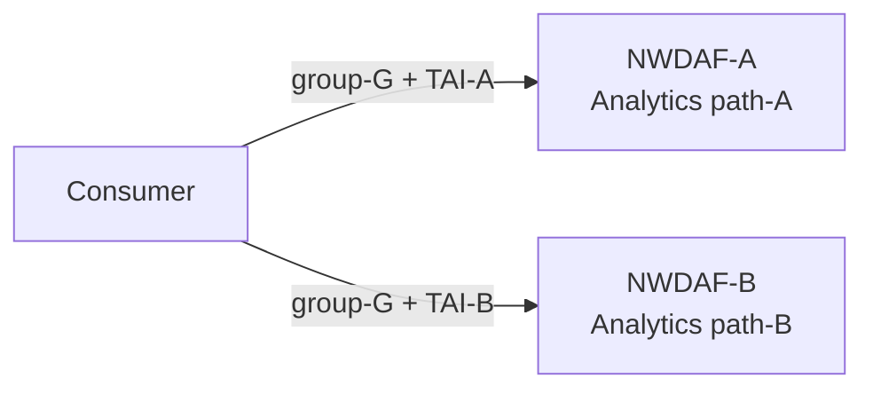
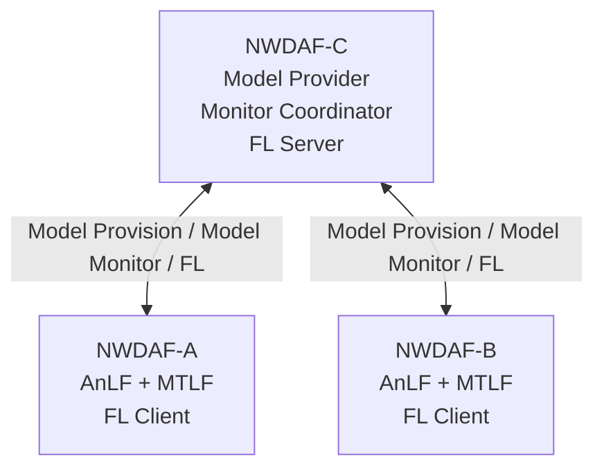
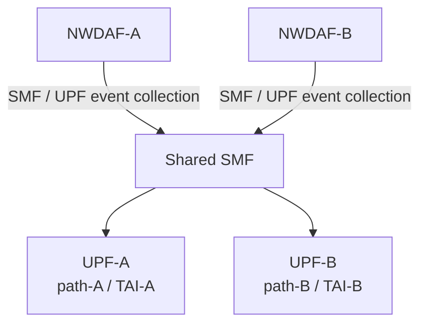
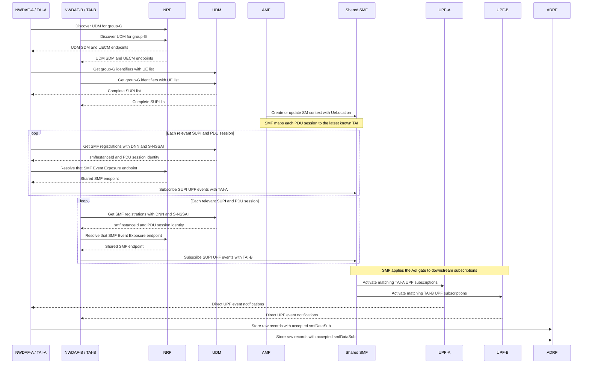
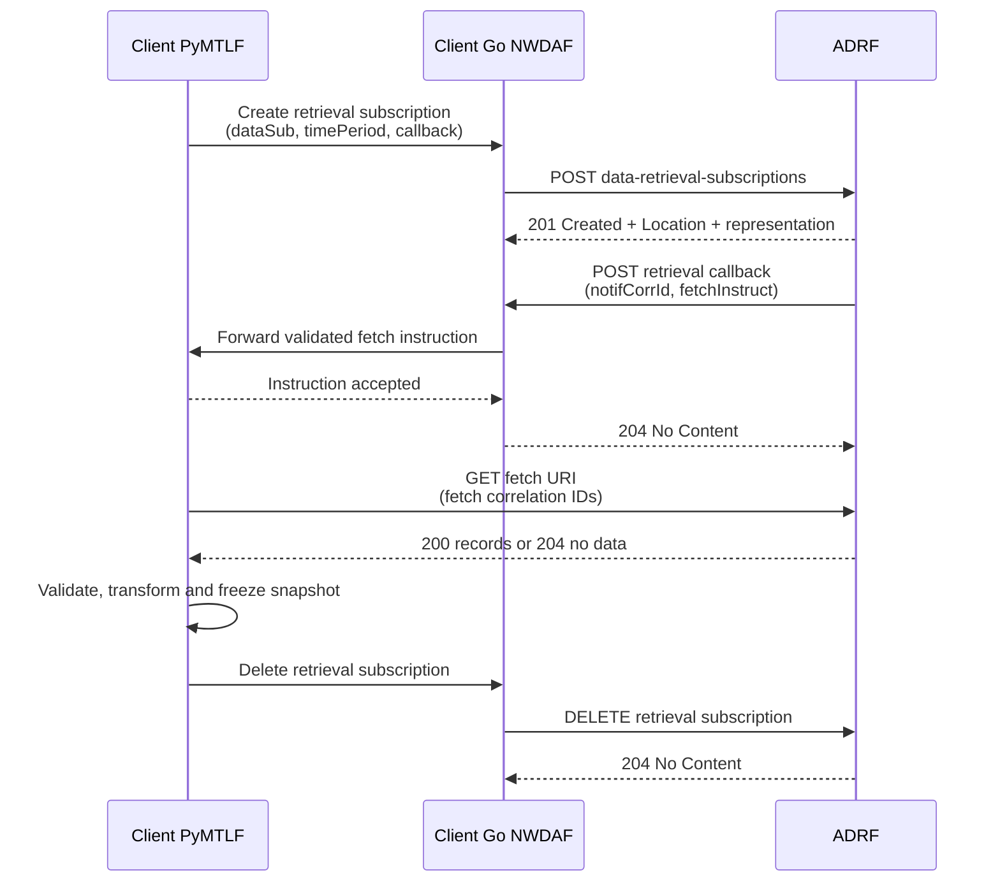
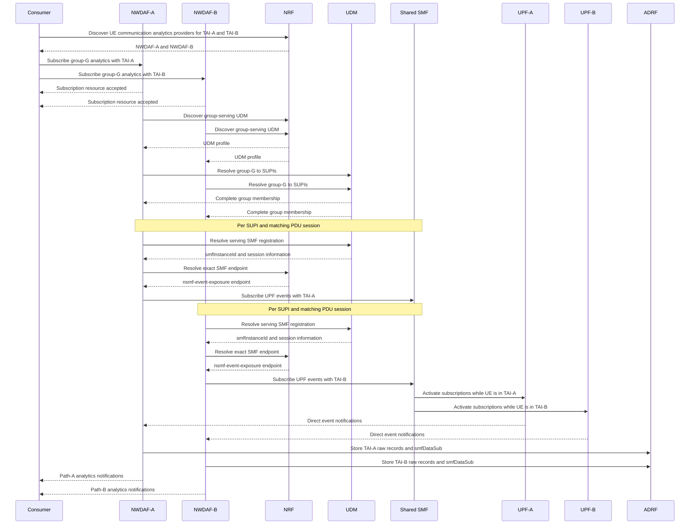
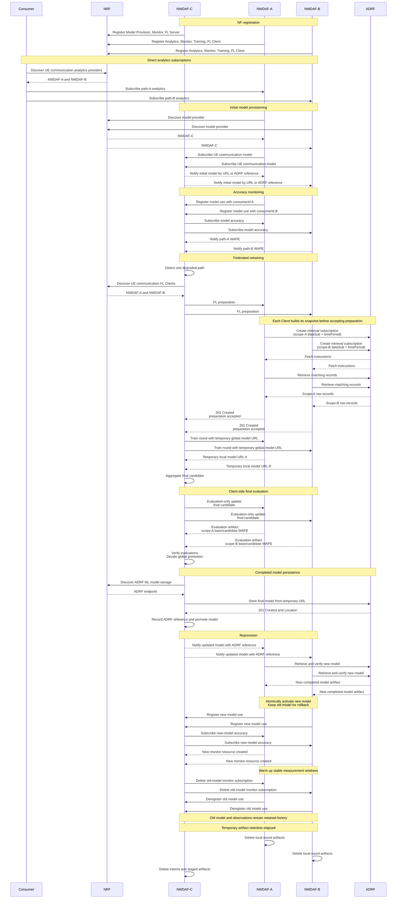

# Distributed NWDAF Model Monitoring and Federated Retraining Architecture

Date: 2026-07-27

Status: Architecture draft for discussion

Related documents:

- [NWDAF Federated Learning Release 18 規格解讀](../specification-guides/NWDAF%20Federated%20Learning%20Release%2018%20規格解讀.md)
- [NWDAF AnLF／MTLF Current Feature Architecture](./Current%20AnLF%20MTLF%20Feature%20Architecture.md)
- [AoI aggregation routing exploration](../notes/distributed/aggregation_routing/agg_routing_with_aoi.md)

---

## 1. 文件目的

本文描述一個由三個 NWDAF 組成的分散式分析、模型監控與聯邦再訓練情境：

- NWDAF-C 集中持有並提供初始／更新模型，收集模型 accuracy monitoring
  結果，並在需要時擔任 FL Server；
- NWDAF-A 與 NWDAF-B 各自對 Consumer 提供一條 path 的 analytics，
  使用本地模型執行推論，並擔任 FL Client；
- A、B 的 analytics target 是同一個 Internal Group，並以不同 AoI
  形成兩個 area-specific scopes；
- Consumer 分別向 A、B 訂閱 analytics，不經過 C，也不要求 C 擔任
  Analytics Aggregator；
- 當任一路徑的模型表現下降，C 可讓 A、B 各自從 ADRF 取得符合自身
  scope 的訓練資料並參與 FL，聚合出新模型後再提供給 A、B。

本文先固定高階工作流程、標準服務邊界、NRF capability、主要 identity
關係，以及第一版 FL execution profile。第一版由 NRF discovery 與
Model Training preparation 選出 eligible participants，在每次 process
正式 training rounds 開始前固定 participant set，並使用同步、
sample-count-weighted FedAvg；
完整 dataset schema、程式 package 與 private backend API 不在目前版本中
定案。

---

## 2. 情境與網路拓撲

### 2.1 初始部署假設

目前實驗拓撲有兩條流量 path，但分析 target 是同一個 Internal Group：

- monitored target 為同一個 `group-G`；
- path-A 由 UPF-A 處理，對應 AoI-A／TAI-A；
- path-B 由 UPF-B 處理，對應 AoI-B／TAI-B；
- UPF-A 與 UPF-B 可由同一個 SMF 管理；
- NWDAF-A 專責 path-A 的資料蒐集與 analytics；
- NWDAF-B 專責 path-B 的資料蒐集與 analytics。

兩個 analytics scopes 分別是：

```text
scope-A = group-G intersect AoI-A
scope-B = group-G intersect AoI-B
```

因此文件中的 A、B 是目前兩個 area-specific NWDAF instances，不表示架構
把 group 數量或 AoI 數量固定為二。本情境只有一個 group；未來可依相同
方式加入更多 AoI 與對應 NWDAF，並繼續使用同一個 group target。

為避免把三種不同的關係混在同一張圖，拓撲分成以下三個視圖。

Consumer 分別向兩個 Analytics NWDAFs 建立訂閱：



NWDAF-C 負責模型提供、accuracy monitoring 協調與 FL Server：



NWDAF-A、B 經同一個 SMF 蒐集不同 path 的 UPF data：



### 2.2 不使用 Analytics Aggregator

本情境不要求單一 NWDAF 作為 analytics 對外門面：

- Consumer 透過 NRF 找到可提供目標 Analytics ID 與服務區域的 A、B；
- Consumer 分別建立兩個 analytics subscriptions；
- A、B 各自將 analytics notification 直接送回 Consumer；
- C 不接收、relay 或聚合 A、B 的 analytics 結果。

先前的 AGG routing 文件仍可作為另一種拓撲的研究筆記，但不是本情境的
前置條件。這裡的「集中」只發生在模型 lifecycle、accuracy observation
與 FL aggregation，不發生在 analytics exposure。

---

## 3. NWDAF 角色與責任

| 角色 | Analytics | Model Provision | Model Monitor | Federated Learning | Training data |
| --- | --- | --- | --- | --- | --- |
| NWDAF-A | 提供 path-A analytics | 作為 model consumer | 量測並回報 path-A accuracy | FL Client | 從 ADRF 取得 path-A 資料 |
| NWDAF-B | 提供 path-B analytics | 作為 model consumer | 量測並回報 path-B accuracy | FL Client | 從 ADRF 取得 path-B 資料 |
| NWDAF-C | 不對 Consumer 提供本情境的 analytics | 初始／更新模型的 owner 與 provider | 接受 A、B registration，訂閱 A、B accuracy | FL Server | 不集中收取 A、B raw data |

### 3.1 NWDAF-C

NWDAF-C 包含 MTLF，負責：

- 維護模型 family、各代模型 identity 與 artifact；
- 作為 A、B 的 `Nnwdaf_MLModelProvision` provider；
- 接受 A、B 的 Model Monitor registrations；
- 根據 registration 與 NRF discovery，向 A、B 建立 Model Monitor
  subscriptions；
- 分別保存 A、B 對同一模型的 accuracy observation；
- 根據本地 degradation policy 決定是否更新模型；
- 擔任 FL Server，選擇 FL Clients、協調 rounds、聚合 local models；
- 將新 global model 透過既有 Model Provision subscriptions 通知 A、B。

NWDAF-C 不需要提供 `Nnwdaf_EventsSubscription`。它是否支援
`UE_COMMUNICATION` 模型，由 `mlAnalyticsIds` 和
`nnwdaf-mlmodelprovision` service 表達，不應因為能提供模型就被視為能
提供該 analytics。

### 3.2 NWDAF-A 與 NWDAF-B

A、B 都包含 AnLF 與 MTLF，負責：

- 對 Consumer 提供 `UE_COMMUNICATION` analytics；
- 根據各自的 target、AoI、group 與資料來源進行 collection；
- 發現並訂閱 C 的 Model Provision service；
- 下載、驗證並啟用 C 提供的模型；
- 以自身 `nfInstanceId` 向 C 登錄模型使用與 monitoring capability；
- 接受 C 建立的 Model Monitor subscription；
- 在能形成有效 prediction／ground-truth window 時回報 accuracy；
- 將各自蒐集到的標準形狀 raw records 保存至 ADRF；
- 根據 local training scope 向 ADRF 取得資料並建立固定 dataset
  snapshot；
- 接受 C 的 Model Training request，執行 local training 並回傳 local
  model information。

A、B 對 Consumer 的 analytics subscriptions 彼此獨立；它們使用相同
group target 與相同 global model，但不同 AoI 仍形成不同的 analytics
subscription、monitor scope 與 local dataset。

在資料蒐集責任上，A、B 內部的 AnLF 決定 group、DNN、S-NSSAI、AoI
與需要蒐集的 UPF events；NWDAF 的標準 SBI 層負責和 NRF、UDM、SMF
交換標準 request／response。MTLF 不另外解析 Internal Group ID，而是從
NWDAF runtime sync 取得已建立的 per-SUPI SMF data-subscription
associations，之後用這些 associations 描述要向 ADRF 取回的訓練資料。

---

## 4. NRF capability registration

### 4.1 能力與 service endpoint 必須一起判斷

NRF profile 的兩層資訊分別回答：

- `nfServiceList`：有哪些可呼叫的標準服務與 endpoint；
- `nwdafInfo`：服務支援哪些 analytics、模型適用範圍與 FL role。

本情境最重要的欄位區分是：

- `nwdafEvents`：`Nnwdaf_EventsSubscription` 支援的 analytics event；
- `mlAnalyticsIds`：Model Provision 支援的 analytics 類型，也是同一個
  `MlAnalyticsInfo` 中 FL capability 的適用 analytics 類型；
- `flCapabilityType`：`FL_SERVER`、`FL_CLIENT` 或
  `FL_SERVER_AND_CLIENT`。

`nwdafEvents=["UE_COMMUNICATION"]` 不會推導出模型能力；
`mlAnalyticsIds=["UE_COMMUNICATION"]` 也不會推導出 analytics provider
能力。

### 4.2 NWDAF-C capability

NWDAF-C 的概念性能力宣告：

```json
{
  "nfInstanceId": "nwdaf-c-uuid",
  "nfType": "NWDAF",
  "nfStatus": "REGISTERED",
  "nwdafInfo": {
    "mlAnalyticsList": [
      {
        "mlAnalyticsIds": ["UE_COMMUNICATION"],
        "flCapabilityType": "FL_SERVER",
        "mlModelInterInfo": {
          "vendorList": ["experiment-vendor"]
        }
      }
    ]
  },
  "nfServiceList": {
    "model-provision": {
      "serviceName": "nnwdaf-mlmodelprovision",
      "nfServiceStatus": "REGISTERED"
    },
    "model-monitor": {
      "serviceName": "nnwdaf-mlmodelmonitor",
      "nfServiceStatus": "REGISTERED"
    }
  }
}
```

這是能力片段，不是完整合法 NF Profile。C 不註冊
`nnwdaf-eventssubscription`，因此 Consumer 不會把它選作 analytics
provider。不能只靠省略 `nwdafEvents` 表達「不提供 analytics」，因為該
欄位在相應服務存在時具有 wildcard 缺省語意。

### 4.3 NWDAF-A／B capability

A、B 的概念性能力宣告：

```json
{
  "nfInstanceId": "nwdaf-a-uuid",
  "nfType": "NWDAF",
  "nfStatus": "REGISTERED",
  "nwdafInfo": {
    "nwdafEvents": ["UE_COMMUNICATION"],
    "taiList": [
      {
        "plmnId": {
          "mcc": "001",
          "mnc": "01"
        },
        "tac": "00000a"
      }
    ],
    "mlAnalyticsList": [
      {
        "mlAnalyticsIds": ["UE_COMMUNICATION"],
        "flCapabilityType": "FL_CLIENT",
        "trackingAreaList": [
          {
            "plmnId": {
              "mcc": "001",
              "mnc": "01"
            },
            "tac": "00000a"
          }
        ],
        "nfTypeList": ["SMF", "UPF"],
        "mlModelInterInfo": {
          "vendorList": ["experiment-vendor"]
        }
      }
    ]
  },
  "nfServiceList": {
    "analytics-subscription": {
      "serviceName": "nnwdaf-eventssubscription",
      "nfServiceStatus": "REGISTERED"
    },
    "model-monitor": {
      "serviceName": "nnwdaf-mlmodelmonitor",
      "nfServiceStatus": "REGISTERED"
    },
    "model-training": {
      "serviceName": "nnwdaf-mlmodeltraining",
      "nfServiceStatus": "REGISTERED"
    }
  }
}
```

NWDAF-B 使用自己的 `nfInstanceId` 與 TAI-B。A、B 是否也對外提供
Model Provision 是獨立選項；本情境不要求它們註冊
`nnwdaf-mlmodelprovision`。

---

## 5. End-to-end workflow

### 5.1 Stage 0：NF registration

1. A、B、C 各自以獨立 `nfInstanceId` 向 NRF 註冊；
2. C 宣告 Model Provision、Model Monitor 與 `FL_SERVER`；
3. A、B 宣告 Events Subscription、Model Monitor、Model Training 與
   `FL_CLIENT`；
4. NRF 保存能力與服務 endpoint，並以 heartbeat／status 維持
   availability。

NRF 知道的是 capability 與 endpoint，不知道：

- A、B 目前是否正在使用 C 的某個模型；
- 哪個 consumer subscription 對應哪個模型；
- 哪條 path 已 degraded；
- A、B 是否已接受本輪 FL；
- local dataset 目前是否足夠。

上述 runtime 關係分別由 Model Provision、Model Monitor、FL preparation
與各 NWDAF 本地狀態維護。

### 5.2 Stage 1：Consumer 分別訂閱 A、B analytics

Consumer 可依 Analytics ID 與 service area 查詢 A、B：

```http
GET {nrfApiRoot}/nnrf-disc/v1/nf-instances
    ?target-nf-type=NWDAF
    &requester-nf-type={consumerNfType}
    &service-names=nnwdaf-eventssubscription
    &nwdaf-event-list=UE_COMMUNICATION
```

若 Consumer 提供 AoI，NRF discovery 與後續 subscription 可再帶入相應
區域條件。Consumer 選出 A、B 後分別建立：

```text
subscription-A = UE_COMMUNICATION + group-G + AoI-A
subscription-B = UE_COMMUNICATION + group-G + AoI-B
```

`UE_COMMUNICATION` 不支援把 `anyUe=true` 當成 Target of Analytics
Reporting。TS 23.288 §6.7.3 將 target 限定為單一 SUPI 或一組 Internal
Group IDs；TS 29.520 對應的 Stage 3 validation 也要求
`tgtUe.supis` 或 `tgtUe.intGroupIds`。本情境選擇同一個
`intGroupIds=["group-G"]`，再以 analytics filter 中不同的
`networkArea`／AoI 區分 path。

AoI 不是另一個 UE target。每個 NWDAF 實際處理的是 group 成員與其 AoI
的交集，因此同一 UE group 可以在不同區域形成獨立資料蒐集、推論和
accuracy monitoring scope。

A、B 可以在接受 analytics subscription 後立即建立資源，不必等到模型
下載與資料蒐集全部完成；analytics 何時能實際產生，仍取決於各自的 model
與 collection readiness。

下列 collection resolution 與 5.3 的 initial model provisioning 可在
subscription 接受後並行啟動；章節順序不表示必須先完成所有 SMF
subscriptions 才能向 C 要模型。

#### 5.2.1 Group、serving SMF 與 AoI collection resolution

Consumer 不需要先把 Internal Group ID 展開成 SUPI，也不需要知道各 UE
由哪一個 SMF 服務。這些是收到 subscription 的 NWDAF-A／B 各自執行的
資料蒐集準備：

1. 以 `internal-group-identity` 向 NRF 發現服務該 group、且提供
   `nudm-sdm` 的 UDM；
2. 呼叫 UDM 的
   `GET /nudm-sdm/v2/group-data/group-identifiers`，帶
   `int-group-id={group-G}` 與 `ue-id-ind=true`，取得
   `GroupIdentifiers.ueIdList[].supi`；
3. 對每個 SUPI 呼叫
   `GET /nudm-uecm/v1/{supi}/registrations/smf-registrations`，並以
   analytics subscription 的 DNN／S-NSSAI 篩選相關 PDU session；
4. 從每筆 `SmfRegistration` 取得 `smfInstanceId`、`pduSessionId`、
   `singleNssai` 與可選的 `dnn`；
5. 以 `target-nf-instance-id={smfInstanceId}` 向 NRF 解析該 SMF 的
   `nsmf-event-exposure` endpoint；
6. 對每筆相關 registration 建立 per-SUPI
   `Nsmf_EventExposure` subscription，帶入 `supi`、`pduSeId`、DNN、
   S-NSSAI，並把原 analytics request 的 `networkArea` 放入
   `eventSubs[].networkArea`；
7. SMF 只在 UE 位於該 AoI 時啟用下游 UPF subscription，UE 離開 AoI
   時停止。因此 A、B 即使找到同一個 SMF，分別帶 TAI-A、TAI-B 後仍可
   收到不同 path 的資料。

SMF 判斷 UE 所在 TAI 不以額外的 AMF Event Exposure subscription
作為唯一前提。TS 23.288 §6.2.2.1 明確區分下列情況：

1. SMF 若支援在 AMF–SMF 的
   `Nsmf_PDUSession_Create`／`Update`／`CreateSMContext`／
   `UpdateSMContext` 交互中取得 UE Location，可直接把 PDU sessions
   對應到 TA-granularity AoI；
2. SMF 若不支援上述 UE Location exchange，但支援 per-TA PDU session
   mapping，可訂閱 AMF 的 `UE moving in or out of Area of Interest`
   event；
3. 兩種 mapping 能力都不支援時，SMF 拒絕相關 NWDAF request，再由
   NWDAF 採用 AMF-assisted mapping。

因此，AMF subscription 是標準允許的替代機制，不是每個 SMF 都必須執行
的固定步驟。TS 23.502 §4.15.4.5.1 對 UPF Event Exposure 的要求是 SMF
必須依 UE 是否位於 requested AoI 啟停下游 subscription，並以 `may`
描述 SMF 為此訂閱 AMF。

第一個實驗 profile 採用直接 UE Location exchange：

```text
AMF learns the current UE location from NG-RAN
  -> Create/Update SM Context carries UeLocation to SMF
  -> SMF stores the latest TAI for the PDU session
  -> SMF compares that TAI with eventSubs[].networkArea
  -> matching: activate the downstream UPF subscription
  -> not matching: do not activate, or stop an active subscription
```

SMF 必須在收到含新 `UeLocation` 的 SM Context update 後重新評估相關
AoI subscriptions。此 profile 假設實驗中的 UE 固定於其 TAI，或 TAI
變化會伴隨 Service Request、handover 或其他 PDU Session context
update。若 UE 在 CM-IDLE 改變 TAI、AMF 已更新位置但尚未與 SMF
交互，SMF 可能暫時只持有 last-known TAI；需要嚴格即時追蹤 AoI
進出時，再啟用 SMF-to-AMF event subscription 或本節後述的
AMF-assisted alternative。



同一 SUPI 可能同時有多個 PDU sessions，甚至由不同 SMF instances
服務。A、B 不能任意取第一個 SMF，也不能把 group 中每個 SUPI 和 NRF
找到的所有 SMFs 做 Cartesian product；必須以 UDM 回傳的 registrations
及 DNN／S-NSSAI 選出相關資源。相同 collection identity 可由本地
reference count 共用，但其 identity 至少需要保留 SUPI、PDU session、
SMF instance、DNN／S-NSSAI、AoI 與 requested events。

兩邊必須取得同一份完整 group membership。TAI 分流來自
`eventSubs[].networkArea` 與 SMF 的 AoI gating，而不是把同一個 group
在 A、B 的 config 中各自寫成不同的部分 SUPI 清單。UDM SDM response
提供 `Cache-Control`、`ETag` 與 `Last-Modified`，因此 membership 可被
快取及條件式更新；NRF 所解析的 UDM／SMF endpoints 則沿用 NWDAF 的
通用 NRF discovery cache。TS 23.502 在此程序中假設同一 Group ID 的
成員由同一個 UDM 服務；若首次 discovery 結果只解析 `nudm-sdm`，
NWDAF 可用相同 UDM instance identity 再解析其 `nudm-uecm` endpoint。

SMF 接受後的 subscription representation 會成為 ADRF record 的
`dataSub.smfDataSub`。因此後續 FL preparation 不必重新從 group 猜測
資料：各 Client 直接以自身保存的 accepted data-subscription
associations 加上 `timePeriod` 建立 ADRF retrieval request。

TS 23.502 §4.15.4.5.4 另定義一條 AoI-specific alternative：NWDAF 先向
AMF 訂閱 AoI 內 UE list，計算「group SUPIs 與 AoI UE list 的交集」，
再依 UE 進出動態建立或刪除 per-SUPI SMF subscriptions。本情境第一個
profile 採用前述「每筆 SMF subscription 帶 AoI，由 SMF gating」流程；
AMF-assisted intersection 保留為後續可替換的 collection profile，不與
第一個 profile 同時執行。

目前實驗環境若 UDM／UECM 尚未可用，可以暫時以完整
`group_memberships` fixture 與 configured SMF endpoint 代替上述查詢，
但這是過渡測試資料，不是標準 group resolution。fixture 必須使用合法
的 3GPP `GroupId` wire format，且不能藉由給 A、B 不同的 membership
內容來模擬 TAI 分流。圖中的 `group-G` 只是易讀標籤；實際 wire value
可使用符合 TS 29.571 pattern 的值，例如 `00000001-001-01-01`。

### 5.3 Stage 2：A、B 取得初始模型

A、B 發現手上沒有適用模型時，分別發現 C：

```http
GET {nrfApiRoot}/nnrf-disc/v1/nf-instances
    ?target-nf-type=NWDAF
    &requester-nf-type=NWDAF
    &requester-nf-instance-id={aOrBInstanceId}
    &service-names=nnwdaf-mlmodelprovision
    &ml-analytics-info-list=[{"mlAnalyticsIds":["UE_COMMUNICATION"]}]
```

接著 A、B 各自向 C 建立 Model Provision subscription，帶入：

- `mLEvent=UE_COMMUNICATION`；
- model filter；
- target UE／group；
- model interoperability；
- callback URI 與 correlation；
- 需要時可帶 accuracy interest、model-needed time 或 monitoring
  information。

C 檢查目前唯一 model family 的 `latestModelId`：

- 已有 latest model 時，向 A、B 提供相同版本；
- 尚無 latest model 時，保留 model demand，並依本地政策產生 seed
  model；
- subscription 保持存在時，後續模型更新沿用同一條通知關係。

A、B 下載、驗證並成功啟用模型後，才把該模型視為目前 active model。
目前情境只支援一組預先確認相容的 `UE_COMMUNICATION` model contract：
相同 target semantics、non-spatial filters 與 interoperability。AoI-A、
AoI-B 仍建立兩個獨立 use／monitor scopes，但不再用 AoI 選擇不同模型；
兩邊對外永遠取得 C 的同一個 latest model。

### 5.4 Stage 3：建立分路徑 Model Monitor

A、B 開始使用模型後，分別向 C 發送
`Nnwdaf_MLModelMonitor_Register`。每筆 registration 至少表達：

- `consumerId`：A 或 B 自己的 `nfInstanceId`；
- `modelId`：目前使用的 model unique identifier；
- 可選的 `mLEvent`、event filter 與 target UE。

`consumerId` 讓 C 知道是哪個 NWDAF 正在使用模型，但它不是 endpoint。
C 可經由 NRF discovery 找到該 `nfInstanceId` 所提供的
`nnwdaf-mlmodelmonitor` service，再向 A 或 B 建立
`Nnwdaf_MLModelMonitor_Subscribe`：

- `modelIds`；
- C 維護的 notification URI；
- `notifCorrId`；
- desired metric／threshold／reporting information；
- Analytics ID、filter 與 target。

A、B 在有足夠 prediction 與 ground truth 形成穩定 measurement window
後，將 accuracy information 通知 C。本情境沿用目前的 WAPE-only
degradation policy：

- `deviation` 承載 WAPE；
- 資料不足時不產生虛假的 accuracy observation；
- A、B 的 observation 依 monitor scope 分開保存；
- 相同 group 與 global model 在不同 AoI 上可以有不同表現。

WAPE、window size、minimum samples、threshold 與 degradation 判斷方式是
本地實作政策，不是 3GPP 固定演算法。

### 5.5 Stage 4：任一路徑 degradation 觸發 eligible Clients FL

本情境採用以下策略：

```text
scope-A degraded OR scope-B degraded
  -> latest model requires retraining
  -> discover and prepare all eligible Clients for this intent
```

這表示觸發來源與 training dataset 範圍是兩件事。即使只有 path-A
degraded，也可讓同一 training intent 下的 A、B 與後續新增的 eligible
Clients 各自使用可用的本地資料參與訓練，不把未 degraded 的 path 固定
當成 validation-only dataset。

C 向 NRF 查詢候選 FL Clients：

```http
GET {nrfApiRoot}/nnrf-disc/v1/nf-instances
    ?target-nf-type=NWDAF
    &requester-nf-type=NWDAF
    &requester-nf-instance-id={nwdafCInstanceId}
    &service-names=nnwdaf-mlmodeltraining
    &ml-analytics-info-list=[
      {
        "mlAnalyticsIds":["UE_COMMUNICATION"],
        "flCapabilityType":"FL_CLIENT"
      }
    ]
```

C 先用發生 degradation 的 Model Monitor relationship 決定需要 retrain，
並固定以當時的 latest model 作為 base，再另外選擇 FL participants：

- Model Monitor registration 證明某個正在使用的模型 scope 發生
  degradation，負責觸發 retraining；
- NRF 證明候選 NWDAF 目前宣告 FL Client capability，並提供 Training
  endpoint；
- training scope 與 model interoperability 證明候選者和本次 retraining
  intent 相容；
- Model Training preparation 最後確認其 ADRF dataset snapshot
  availability、availability time、能力與參與意願。

本情境假設 ADRF 永遠存在且可被各 Client 使用。這裡的 local data
availability 表示 Client 能從 ADRF 取得符合自己 training scope 與時間
範圍的 records，不要求 raw data 已經保存在 Client process 的本地磁碟，
也不表示 C 可以集中讀取所有 Clients 的 raw data。

第一版只有在 Client 已成功取回 required records、完成基本驗證並凍結
dataset snapshot 後，preparation POST 才回覆 `201 Created`。標準
Training notification 沒有自訂 `READY` 欄位；因此 C 以成功的 preparation
response 判斷可參與，固定 participant set 時已經知道所有被選 Clients
都有一份可供本次 process 使用的固定 snapshot。

候選 FL Client 不需要先有 Consumer analytics subscription、正在執行
inference、取得 C 的正式模型或建立 Model Monitor registration。latest
base model 也不必已經是該 Client 的 inference model。

目前的初始實驗拓撲只會發現 A、B，但 participants 不硬編碼為這兩個
identity。C 先從 NRF candidates 與 training scope compatibility 篩選同一
training intent 的候選者，再使用 Model Training preparation 確認：

- model interoperability；
- ADRF dataset snapshot availability；
- FL availability time；
- 計算與通訊能力；
- 是否願意加入本輪 FL。

第一版將所有通過上述條件的 eligible clients 納入 process，並在正式
rounds 開始前固定 participant set。已被選入者只要任一方 preparation
失敗或後續離開，本次 process 就保持未啟動或標記失敗；不在執行中縮小、
擴大或替換 participant set。後續可再擴充 minimum participant、client
sampling、replacement 與每 round 重新 preparation policy。

### 5.6 Stage 5：Client ADRF retrieval、local training 與 C aggregation

第一版固定採用同步、sample-count-weighted FedAvg。初始拓撲的
participants 是 A、B；若後續有 TAI3 等 eligible Client，流程相同：

1. 各 Client 在 preparation 期間將 training scope 解析成 ADRF
   `dataSub` 與固定 `timePeriod`，從 ADRF 建立 dataset snapshot，沿既有
   temporal split／purge gap 凍結 training 與 validation subsets；
2. 所有 required Clients 都回覆 preparation `201 Created` 後，C 固定
   participant set，並更新既有 Model Training resources；
3. C 提供 initial／current global model、round identity、training
   requirement 與 maximum response time；
4. 各 Client 在所有 rounds 使用自己的同一份固定 snapshot 進行 local
   training，不向 C 傳 raw training data；
5. 各 Client 將完整 local model information、status、標準 training input
   data information 與含實際 training sample count 的 local model
   artifact reference 回傳 C；
6. C 等待同一 `roundInd` 的所有 selected Client 結果都到齊；
7. C 驗證所有 artifact 與 sample count，再做 sample-count-weighted
   FedAvg，形成下一版 global model；
8. 若尚未達到設定的固定 round 數，C 發送下一 round 的 global model；
9. 達到固定 round 數後，C 先保留各 Client 的 Model Training resource，
   並以同一 resource 發出 final-candidate evaluation update；
10. A、B 使用各自在 preparation 時凍結的 validation subset，同時評估
    base latest 與同一 final candidate，回傳帶有 base／candidate
    digest、WAPE sums、scope digest、evaluation sample count 與 data
    window 的暫存 evaluation artifact；
11. C 驗證所有 participating scopes 的 evaluation evidence，對整個
    candidate 做一次 global promotion gate；
12. C 將 gate result 與 candidate durable handoff 給 publication job 後，
    bounded delete 各 Client 的 Model Training resources；ADRF publication
    不再依賴 Training subscription。

若將第 `i` 個 Client 回傳的完整模型參數記為 `weights[i, r]`，實際
training sample count 記為 `sampleCount[i, r]`，第一版聚合為：

```text
globalWeights[r + 1] =
  sum(sampleCount[i, r] * weights[i, r] for i in participants)
  / sum(sampleCount[i, r] for i in participants)
```

第一版不交換 gradient、parameter delta 或 optimizer state。所有 Client 必須
使用相容的 model bundle、相同參數結構，以及 base/global bundle 內同一
份 scaler 與 preprocessing contract；不得各自重新 fit scaler。C
不集中取得 raw training／validation data。WAPE 也不是 Release 18
`MLModelMetric` 的 `ACCURACY`；因此 Client 不得把 WAPE 假裝成標準
`mlModelAcc`，而是透過 evaluation artifact metadata 回傳，標準 callback
仍只承載該 artifact 的 `mLFileAddr` 與 training status。
`CLIENT_EVALUATION` 仍是包含被評估 final candidate 的 model bundle；
WAPE evidence 是其 sidecar metadata，不是借模型 URL 傳送獨立報表。
C 必須在聚合前驗證 artifact identity、tensor shape、dtype、parameter
ordering 與 sample count。

#### 5.6.1 Client ADRF dataset snapshot

ADRF 是本情境唯一的 training data source，不設計 MongoDB fallback。
PyAnLF 在正常 collection 過程中，已將原始標準形狀 `dataSub` 與
`dataNotif` records 保存至 ADRF。Client 的 PyMTLF 在 preparation
期間、回覆 `201 Created` 以前執行：

```text
training scope
  -> resolve matching stored dataSub records
  -> fix one historical timePeriod
  -> create ADRF data retrieval subscription
  -> receive fetch instructions
  -> retrieve records directly from ADRF
  -> validate and transform records
  -> freeze training and validation subsets for the FL process
```

對 raw NF event data，Client 使用
`NadrfDataRetrievalSubscription.dataSub` 表達所需資料，並帶入：

- `notificationURI`：該 containing NWDAF 的 ADRF retrieval callback；
- `notifCorrId`：由 Client 為本次 dataset job 建立的 correlation；
- `timePeriod`：本次 FL process 固定的歷史資料時間範圍；
- `consTrigNotif=true`：要求 ADRF buffer matching records，並以 fetch
  instructions 通知 Client 主動取回。

標準互動如下：



Go 負責標準 SBI request、callback validation 與 retrieval resource
routing，不代理 dataset bytes。PyMTLF 直接依 ADRF fetch instruction
取得 records，並負責 scope resolution、資料完整性、feature conversion
與 snapshot lifecycle。

一個 group 若展開成多個 SUPI／`dataSub`，Client 可以建立多個 ADRF
retrieval resources，再合成一份 scope-local snapshot。snapshot 在本次
FL process 建立後固定，所有 rounds 重複使用同一份資料；不因每輪更新
global model 而重新 retrieval。若 required records 不存在、取回失敗或
無法形成有效 snapshot，Client 不得宣告 training data ready。依目前固定
participant policy，該 process 應在開始前停止，或在已開始後標記失敗，
不得把缺資料的 Client 靜默排除。

#### 5.6.2 Training sample count contract

`TrainDataInfo.samplRatio` 表示實際選取資料相對於 available data 的抽樣
比例；`DataAvReq.minNumSamples` 表示 Server 對資料量提出的最低需求。兩者
都不是 Client 本輪實際用於 FedAvg 的精確樣本數，不得拿來直接計算聚合
權重。

Release 18 Training callback 沒有 exact `numSamples` 或
`aggregationWeight` 欄位。第一版因此保持標準 Training JSON 不變，並把
精確樣本數放在 implementation-specific local model bundle manifest。
這不需要新增內部 API：C 本來就必須透過 callback 中的暫存 URL 下載
local model artifact，下載後一併讀取及驗證 manifest。

現有 PyMTLF candidate bundle 已在
`training.scope_eligibility[].training_sample_count` 保存每個實際
training scope 的樣本數。FL local model bundle 沿用此語意；一個 Client
在該 round 的 FedAvg 權重為：

```text
clientSampleCount =
  sum(scope.training_sample_count
      for each scope actually included in local training)
```

本模型的單一 training sample 定義為一組實際送入 trainer 的
`input sequence window + prediction target window`。它不是：

- 原始 UPF notification 數；
- timestamp observation 數；
- UE／SUPI 數；
- batch 數；
- epoch 展開後的累計處理次數；
- validation／testing window 數。

同一 training sample 即使跨多個 epochs 被重複使用，也只計算一次。只有
實際加入本輪 local fitting 的 scopes 與 training windows 才能計入。

C 對 sample count 的第一版驗證規則為：

- 每個 Client 都必須提供可解析的正整數；
- count 必須可由 manifest 中實際 included scopes 的
  `training_sample_count` 加總得到；
- validation samples 不得納入；
- 缺少、為零、為負或與 scope summary 不一致時，該 Client result 無效；
- 因第一版要求 selected participants 全員成功，任一 result 無效時整個
  round 不聚合。

實驗環境第一版信任各 Client 自行產生的 manifest。跨 trust domain 時的
簽章、attestation 或 sample-count fraud protection 留待安全設計處理。

每一 round 設定 maximum response time。若任一 Client 沒有在期限內提供
有效結果，C 不使用單一 Client 結果做部分聚合，也不臨時替換
participant；本次 FL process 標記失敗並保留可觀察的錯誤狀態。Client
仍可使用標準 Training notification 表達 delay 或 termination，但第一版
Server policy 不因此自動延長 round、降低 quorum 或更換 Client。

第一版使用固定 round 數作為 termination condition，不使用 training
metric early stopping。Model promotion 仍是 aggregation 完成後的獨立
步驟；完成所有 rounds 不等於模型已自動成為 active model。final bundle
還必須通過驗證、成功建立 ADRF durable reference，並通過 stale-base
檢查後才能 promotion。

後續可在相同標準 SBI resource model 上逐步擴充：

- 設定 quorum，在部分 Client 成功時仍進行聚合；
- timeout 後延長 deadline、retry、skip 或 replacement；
- 每輪 participant sampling；
- 依 evaluation metric early stopping；
- 非同步 aggregation 與 stale-result weighting。

其中 secure aggregation 還需要額外的 key-share／masked-update 協議，
不屬於第一版標準 SBI 可以直接表達的功能。

標準提供兩種 model artifact reference：

- `mLFileAddr`：由 model owner 維護 URL 或 FQDN，接收者再下載 artifact；
- `mLModelAdrf`：提供 ADRF reference，由接收者向 ADRF 取回 artifact。

第一版不把兩者設計成整個 FL process 二選一的 transport mode，而是依
artifact lifecycle 固定用途：

- 初始 global model 若已經持久化在 ADRF，可以用 `mLModelAdrf` 作為
  FL process 的起點；若仍由 C 本地持有，也可以使用 `mLFileAddr`；
- round 執行期間，Clients 與 C 之間交換的 local model 與 interim global
  model 一律使用各自 PyMTLF 維護的暫存 `mLFileAddr`；
- 固定 rounds 成功完成後，只有 C 產生的最終 global model 需要存入
  ADRF，並取得 durable `mLModelAdrf`；
- final model 後續透過 Model Provision 提供給相關 Clients 時，可以使用
  該 ADRF reference，不必繼續依賴 C 的暫存下載位址。

這避免每輪都建立 ADRF record、下載、再清除所造成的額外 storage 與
control-plane 成本。ADRF 是 completed model artifact repository，不是
FL round exchange bus。

雖然 TS 23.288 Stage 2 將直接提供 `ML Model file` 列為可選輸入，
TS 29.520 Release 18 的 Training OpenAPI 並未定義可單獨使用的 inline
binary transport。`mLModelInfos` 重用的 `MLEventNotif` 仍要求
`mLFileAddr` 或 `mLModelAdrf`，而 API 也沒有 multipart／octet-stream
body。因此本架構不在 Training JSON 中直接夾帶模型 binary。

#### 5.6.3 Round artifact lifecycle

各 PyMTLF 為 round artifacts 維護本地暫存目錄與可下載 URL：

1. C 建立 interim global artifact，各 Client 建立自己的 local result
   artifact；
2. artifact URL 在對應 FL process 仍為 active 時不得過期或被清除；
3. C 必須先下載並驗證所有 selected Clients 的 local artifacts，才把該
   round 標記為完成；
4. FL process 進入成功、失敗或取消等 terminal state 後，各節點才開始
   計算 configurable retention period；
5. retention period 到期後，各 Client 清除 local results，C 清除
   interim globals 與不再需要的下載副本；
6. final global artifact 在 ADRF storage 確認成功前不得被暫存清理機制
   刪除。

固定保留時間是 crash recovery 與 log／artifact inspection 的 grace
period，不是模型版本管理機制。PyMTLF 必須以 process、round 與
participant 建立清楚的 Training Workspace 暫存索引，避免單純依檔案
建立時間誤刪仍在執行中的模型。

#### 5.6.4 第一版 ADRF completed-model flow

最終模型使用 `Nadrf_MLModelManagement` 保存：

1. C 透過 NRF discovery 尋找宣告 `nadrf-mlmodelmanagement` 且
   `ml-model-storage-ind=true` 的 ADRF；
2. C 的 PyMTLF 讓 final artifact 可由暫存 `mlFileAddr` 下載；
3. C 以自己的 `nfInstanceId`、標準 numeric `modelUniqueId`、
   `mlFileAddr` 與 `mlStorageSize` 建立 ADRF ML model store record；
4. ADRF 下載並保存 artifact，回覆 `201 Created`、record representation
   與指向 individual store record 的 `Location`；C 仍須檢查
   `modelStoreResult`，必要時再 retrieval probe；
5. C 以 `modelUniqueId` 作為模型管理主識別，從 `Location` 解析並記錄
   `storeTransId`，將 ADRF NF identity 與 transaction ID 視為該模型的
   storage reference；
6. C 將 final model 的 durable reference 更新為 `mLModelAdrf`，再透過
   既有 Model Provision subscriptions 提供給 A、B；
7. A、B 使用已知的 `storeTransId` 向同一 ADRF retrieval，再依 record
   中的 `mlFileAddr` 下載 final artifact；
8. final model 不是 current latest、沒有 Model Provision consumer 仍在
   使用，且不再被 retained revision／rollback policy 保留時，才由 C
   決定是否要求 ADRF 刪除。

若 aggregation 已完成但 ADRF storage 暫時失敗，C 保留本地 final
artifact 與可重試狀態；不得把尚未 durable 的模型當成 ADRF-published，
也不得因暫存 TTL 將它刪除。ADRF 恢復後可重試相同 completed-model
publication。

此時的 publication 已經在 final evaluation 後從 FL execution durable
handoff：Client Training resources 可被刪除，optimizer／round 不會跨
restart resume；只有由 journal 保存的 model ID reservation、candidate／
final bundle digest、previous revision、validation summary、ADRF target
與 store state 可以在 C restart 後 retry／reconcile。

同一個 `modelUniqueId` 因 publication retry、ADRF relocation 或重新保存，
可以先後對應不同的 `storeTransId`。這不建立新的 completed model，也不
改變 `modelUniqueId`。C 必須記錄目前有效的 ADRF reference；對外提供
`mLModelAdrf` 時附上該 reference 的 `storTransId`，讓接收端定位精確
record。若只以 `model-unique-ids` retrieval，ADRF 中同一 model ID 的多筆
record 可能造成選擇歧義，因此不作為 Model Provision 的主要定位方式。

第一版 ADRF profile 以 `MLModelInfo` 的 URL-backed storage 為必要能力。
ADRF API 雖也定義 inline `MLModel.mlModel` binary，該形式不是本情境的
必要 transport，且不會被錯誤映射成 Training JSON inline binary。

現有團隊 ADRF `with-mlmodelmanagement` branch 已具備 URL 拉取、MongoDB
record、`Location`、artifact download、PUT 與 transaction DELETE 的基礎
實作及 handler／repository tests，但在納入 FL E2E 前仍須完成以下 contract
alignment：

- NRF profile 應以 Release 18 `adrfInfoList[].mlModelStorageInd` 表達能力；
  目前放在 `customInfo` 的值只能視為相容性暫存；
- collection GET 必須要求 `store-trans-id` 或 `model-unique-ids` 恰好一種，
  並實際支援依 `store-trans-id` retrieval；
- GET response 必須符合單一 `NadrfMLModelStoreRecord` schema，不依賴
  非標準的 individual-record GET；
- `modelUniqueId` 使用 OpenAPI 定義的 `Uinteger`，不得以 UUID 字串代替；
- `MLModelInfo.mlStorageSize` 必填，並以 A、B、C 的 `nfInstanceId`
  補齊 `allowConsumerList`；
- storage result 使用標準 `modelStoreResult` 結構；
- record 中的 `mlModelInfo`／`mlModels` 是可包含多個模型的陣列；目前只
  處理第一個元素的限制不得被當成完整標準行為；
- PUT 除了更新 MongoDB metadata，也必須正確處理更新後 artifact 的保存，
  不能讓 record 指向未實際保存的新來源；
- 若宣告 inline storage 支援，`MLModel` 必須承載 `mlModel` binary，而非
  另一個 `mLFileAddr`；
- 補上 `/remove-stored-mlmodel`，或明確將第一版清理限制為已實作的
  transaction DELETE；
- ADRF 自訂的 `/{storeTransId}/model` 可以作為 record 所回傳的
  `mLFileAddr`，但不得當成標準 Nadrf resource operation；
- 加入 NWDAF、PyMTLF、NRF、ADRF 與 MongoDB 的跨 process E2E，驗證的不只
  是 stub repository handler。

Training data 可以：

- 已存在 A、B 本地；
- 由 A、B 向其 data source NFs 蒐集；
- 由 A、B 透過 ADRF retrieval 取得。

ADRF 只負責保存與取回資料／completed model artifact，不決定 completed
revision list、`latestModelId`、FL membership、degradation 或 model
promotion。這些 model-management relationships 仍由 C 的 PyMTLF 保存。
C 不需要為 FL 把各 Client 的 raw dataset 集中取回。

### 5.7 Stage 6：新模型提供與監控世代切換

C 完成 aggregation 後：

1. 透過尚未刪除的 Model Training resources，要求各 participating Client
   以本地凍結的 validation snapshot 同時評估 base latest 與同一 final
   candidate；
2. 接收並驗證各 Client 回傳的 evaluation artifact，不集中取得其 raw
   validation data；
3. 以各 scope 的 base／candidate WAPE、absolute-error sum、
   actual-value sum、sample count 與 evaluation data window 重現既有
   triggering-scope／aggregate／non-triggering-scope gate，並寫入 final
   model description，作為觀察證據而非分 scope 選模依據；
4. 對整個 candidate 做一次 global promotion gate；不建立
   per-TAI applicability gate 或候選排名；
5. 通過 gate 後建立新的 model unique identifier 與 final artifact；
6. 將 final artifact 保存至 ADRF 並記錄 durable reference；
7. ADRF storage 成功後，把新版本加入 completed revision list，原子更新
   `latestModelId`；
8. 透過既有 Model Provision subscriptions，把同一個 latest model 發送
   給 A、B；
9. Clients 下載並驗證新 artifact；下載或驗證失敗時繼續使用舊模型，
   不變更任何舊 monitoring relationship；
10. 驗證成功後，Clients 原子切換 active model，並立即以新 `modelId`
   向 C 建立新的 Model Monitor registration；
11. C 為新模型建立新的 monitor subscriptions／correlations；新模型在
    累積到足夠 prediction／ground-truth window 前保持 warm-up，不送出
    虛假的 WAPE；
12. 新 registration 與 monitor subscription 都建立成功後，C 才刪除位於
    Clients 的舊模型 monitor subscriptions，Clients 再向 C deregister
    舊模型 usage registrations；
13. 若新 monitoring relationship 無法在 cutover timeout 內建立，Client
    保留舊模型與舊監控，並可依本地政策 rollback，而不是先清除舊世代。

Consumer 不需重新建立原 analytics subscription。各 Client 仍以原本的
analytics resource 對 Consumer 提供結果，只替換內部使用的模型。

舊模型也不因停止監控而立即刪除：

- C 將舊模型保留在 completed revision history，作為歷史 validation
  comparison 與 rollback candidate；
- 正常 Model Provision 只讀取 `latestModelId`；monitor deletion 不等同
  模型 artifact 立即退役；
- A、B 可在本地保留舊 artifact 一段 configurable rollback grace period，
  確認新模型穩定後再清除未被使用的副本；
- ADRF 中的 completed model 依獨立 retention policy 保存。只有不是
  latest、沒有 Consumer 仍在使用，且不再受 retained revision／rollback
  policy 保護時，C 才能要求刪除；
- 舊世代已保存的 accuracy observations 保留為歷史紀錄。遲到的舊
  `modelId` notification 只能歸入已關閉的舊 relationship，不得更新新模型
  的 degradation state。

標準定義了 AnLF 開始使用模型時的 Register、不再使用時的 Deregister，
以及 MTLF 對 monitor subscription 的 Subscribe／Delete；上述
「new-before-old」切換順序、timeout 與 rollback grace period 是本情境
為避免監控空窗所採用的本地政策。

---

## 6. Complete sequence

### 6.1 Analytics collection 與 raw-data persistence

完整的 analytics 前置流程是：



Consumer subscription acceptance 與 collection readiness 是分開的狀態。
若 UDM、SMF 或資料暫時不可用，A／B 已建立的 analytics resource 不因此
變成另一個 target；NWDAF 繼續依本地 retry／reconciliation policy 建立
必要 collection resources，並只在資料與模型足以產生有效 analytics 時
通知 Consumer。

### 6.2 Model monitoring、FL 與 reprovision



Analytics collection 已在 6.1 展開；multiple FL rounds 在此圖中省略，只
為保持可讀性。

---

## 7. PyMTLF model management

### 7.1 第一階段管理模型

目前情境只管理一個預先確認相容的 `UE_COMMUNICATION` model family，
並採用線性版本：

```text
M1 seed -> M2 -> M3 -> ...
                       ^
                       latestModelId
```

每次成功的 retraining 都以前一個 latest model 為 base，產生下一個完成
版本。第一階段不建立 model tree、branch、per-TAI Scope Assignment 或
候選模型排名。A、B 即使監控不同 TAI，Model Provision 對外也只提供同一
個 `latestModelId`。

若未來出現不同 Analytics ID、target semantics、non-spatial filters 或
不相容 model format，應拆成不同 model families，且每個 family 各自維護
latest；但這不是目前實作範圍。

### 7.2 Completed revisions 與 latest pointer

只有 seed model，以及通過完整性檢查、global promotion gate 並成功
保存至 ADRF 的 final models，才進入 completed revision list。每筆至少
保存：

| Field | Meaning |
| --- | --- |
| `modelUniqueId` | model owner 配置、不得重用的標準模型識別 |
| previous revision | 前一個 latest model；只記錄線性迭代來源，不允許分支 |
| analytics contract | 固定的 Analytics ID、target／filter 與 interoperability 摘要 |
| training summary | 本次 FL process、participants、各 scope sample count |
| validation summary | 各 scope 的 WAPE、evaluation sample count 與資料區段 |
| artifact reference | 本地 artifact reference 與 durable ADRF reference |
| creation time | 模型完成及發布時間 |

PyMTLF 另保存一個 `latestModelId`。標準 Model Provision request 不用執行
歷史模型搜尋或排名，只處理：

```text
model demand compatible with the configured contract
  -> return latestModelId and its artifact reference
```

Per-scope validation summary 仍保留在 bundle metadata，供 log、實驗分析與
global promotion policy 參考，但不會讓 TAI-A、TAI-B 選到不同版本。
`storeTransId` 仍只是 ADRF locator，不是模型版本或 latest identity。

Global promotion gate 只有一次 yes／no decision。設定可以選擇「技術檢查通過
就發布」或「aggregate validation 未達門檻／劣於舊版時拒絕發布」；即使
採用後者，也只產生一個全域結果，不做 per-TAI promotion。

更新 latest 必須是原子操作：

1. final candidate 完成 aggregation 與 bundle validation；
2. 執行一次 global promotion gate；
3. reserve 不得重用的新 `modelUniqueId`，建立 final bundle；
4. 成功保存至 ADRF；
5. 加入 completed revision list；
6. 最後才把 `latestModelId` 從舊版切到新版。

任何步驟失敗都維持原 latest，不向 A、B 發布半完成版本。舊 completed
revisions 可依 retention policy 保存作歷史與 rollback，但不再透過一般
Model Provision 對外提供。

### 7.3 訓練期間的暫存模型（Training Workspace）

每次 FL process 建立獨立工作區，暫存索引使用：

```text
mlCorreId + artifactRole + roundInd + participant
```

`mlCorreId` 是標準 FL correlation，也就是本文所稱的 FL process
identity。

工作區保存 Client local models 與 Server interim global models。這些模型：

- 只透過 PyMTLF 暫存 `mLFileAddr` 交換；
- 不需要正式 `modelUniqueId`；
- 第一版不使用 `addModelInfo`；每次只交換一個由 process、round 與
  participant 關聯的暫存模型；
- 不進入 completed revision list，也不影響 `latestModelId`；
- bundle 以 `ROUND_LOCAL` 或 `ROUND_GLOBAL`、process、round、participant
  或 aggregated participants 與 sample count 表明它是訓練中的過渡產物；
- FL process terminal 且 retention period 到期後即可清除。

最後一輪聚合結果離開 Training Workspace 前，仍只是 final candidate。
它通過 bundle、aggregation、validation 與 stale-base 檢查後，才配置新的
`modelUniqueId`，以 `PROCESS_FINAL` 打包並保存至 ADRF，最後更新
`latestModelId`。

### 7.4 Retraining、promotion 與 provision

任一 scope degradation 觸發 retraining 時：

1. 讀取當時的 `latestModelId` 作為本次共同 base model；
2. C 透過 NRF discovery 取得宣告相容 FL Client capability 的候選
   NWDAFs；
3. C 再以 Model Training preparation 確認各候選者的 model
   interoperability、local data、availability 與參與意願；
4. 本次 process 納入所有符合本次訓練目的的 eligible clients，並在
   preparation 成功、正式 training rounds 開始前固定 participant set；
5. 所有 participants 都取得同一個 base/global model，使用自己的本地
   資料訓練；
6. C 使用各 Client 實際 training sample count 做 weighted FedAvg；
7. C 要求各 Client 以本地凍結的 validation snapshot 同時評估 base
   latest 與 final aggregate，並回傳可驗證的 per-scope evaluation
   artifact；
8. C 驗證所有 participating scopes 的 evidence，再對整個 candidate
   做一次 global promotion gate；通過後配置新
   `modelUniqueId`、保存 ADRF reference，並原子更新 `latestModelId`；
9. C 透過現有 Model Provision subscriptions 向 A、B 發送相同新版本。

NRF discovery 只提供候選者及 endpoint；completed revision list、
`latestModelId`、validation summary 與參與者選擇都是 C 的 PyMTLF 本地
責任。process 啟動後才出現的新 Client 留到下一次 retraining，不在執行
中替換 participant。

### 7.5 M1–M3 線性範例

目前實驗只有 Client-1／TAI1 與 Client-2／TAI2：

```text
Initial:
  completed = [M1]
  latestModelId = M1

TAI1 or TAI2 reports M1 degradation:
  Client-1 + Client-2 train from M1
  -> validate and publish M2
  completed = [M1, M2]
  latestModelId = M2
  -> A and B both switch to M2

TAI1 or TAI2 later reports M2 degradation:
  Client-1 + Client-2 train from M2
  -> validate and publish M3
  completed = [M1, M2, M3]
  latestModelId = M3
  -> A and B both switch to M3
```

M1、M2 仍可保留於 ADRF 作為歷史與 rollback artifacts，但不會因為某個
TAI 上曾有較好的離線 WAPE 而重新成為一般 Model Provision 的輸出。若
未來加入 Client-3／TAI3，它可以加入下一次 participant set 並提供更多
training data，但結果仍只會產生 `M3 -> M4` 的下一個線性版本，不建立
TAI-specific branch。

### 7.6 與現有 PyMTLF 行為的銜接

第一版繼續沿用現有 immutable bundle、component digest、archive safety、
model contract validation、stale-base protection、notification coalescing
與 WAPE monitoring 行為。Catalog 只需收斂成 ordered completed revisions、
單一 `latestModelId` 與獨立 Training Workspace。

Completed revisions、latest pointer、ADRF reference 與 restart recovery
要使用哪種持久化格式，留到 implementation plan 決定；本架構文件不預先
綁定單一 JSON 檔、資料庫 schema 或 lifecycle enum。NRF 也不保存上述
application-level relationship。

---

## 8. Standard behavior and scenario policy

### 8.1 由 Release 18 標準支持的行為

- NWDAF 透過 NRF 註冊／發現 analytics、model 與 FL capability；
- NWDAF 可透過 NRF 找到服務 Internal Group 的 UDM，再以
  `Nudm_SDM_Get` 將 group 展開為 SUPIs；
- NWDAF 可透過 `Nudm_UECM_Get` 取得每個 SUPI 的 SMF registrations，
  再透過 NRF 解析特定 `smfInstanceId` 的 Event Exposure endpoint；
- 支援 AMF–SMF UE Location exchange 的 SMF，可直接把 PDU sessions
  對應到 TA-granularity AoI；不支援此 exchange 時，SMF 可改為訂閱 AMF
  的 UE moving in/out of AoI event；
- `Nsmf_EventExposure` 可攜帶 AoI，SMF 依 UE 是否位於 AoI 啟停下游
  UPF subscription；
- AnLF NWDAF 向 MTLF NWDAF 訂閱模型；
- MTLF NWDAF 提供初始模型與後續 retrained model；
- AnLF NWDAF 使用模型後向 responsible MTLF NWDAF 登錄 monitoring；
- MTLF NWDAF 向 AnLF NWDAF 訂閱 accuracy／feedback；
- MTLF 可根據一個或多個 AnLF NWDAFs 的 accuracy information 判斷
  degradation；
- FL Server 透過 NRF 發現 FL Clients，再以 preparation 決定參與者；
- FL Clients 以本地資料訓練並回傳 local model information；
- FL Server 聚合 local models 並將最終模型交付 model consumer。

### 8.2 本情境的設計政策

- C 不提供 analytics，也不是 Analytics Aggregator；
- Consumer 分別向 A、B 訂閱；
- A、B 解析相同的完整 group membership，並以不同 AoI 建立 per-SUPI
  SMF subscriptions；不以不同的 partial group fixtures 模擬 path；
- A、B 保存 SMF 接受的 data-subscription association，寫入 ADRF 時一併
  保存，讓 FL Client 後續能以 `dataSub + timePeriod` 精確取回資料；
- 第一個 collection profile 由 SMF 執行 AoI gating；AMF-assisted UE-list
  intersection 是後續替代 profile；
- C 是初始模型 owner、Model Provision provider 與 FL Server；
- A、B 是 analytics providers、model consumers、accuracy providers 與
  FL Clients；
- A、B 以同一 group target、不同 AoI 對相同模型建立分開的 monitoring
  scopes；
- 目前只管理一個預先確認相容的 `UE_COMMUNICATION` model family，對外
  Model Provision 永遠提供同一個 `latestModelId`；
- accuracy policy 第一版只使用 WAPE degradation；
- 任一 scope degraded 就以當時 latest model 作為共同 retraining base；
- C 以 Model Monitor relationship 決定 degradation trigger，再經 NRF
  discovery、training scope compatibility 與 preparation 選出 eligible
  Clients，並在 preparation 成功、正式 rounds 開始前固定 participant
  set；
- Client eligibility 不要求 Consumer analytics subscription、現行
  inference model 或 active Model Monitor registration；NRF capability、
  training scope compatibility 與 preparation 成功即可參與；
- 初始情境通常會選到 A、B；未來 TAI3 等符合條件的 Client 也可在下一個
  process 一併參與；
- 各 Client 使用自己的全部符合條件資料，不固定將其中一條 path 當
  validation-only dataset；
- ADRF 在本情境中永遠存在，所有 Clients 在 preparation 期間、回覆可
  參與以前，以 `dataSub + timePeriod` 取得資料並固定一份 process
  dataset snapshot；不設計 MongoDB fallback；
- 第一版使用同步、sample-count-weighted FedAvg，固定 round 數；
- sample count 是本輪實際 local training windows 數，由 local model
  bundle manifest 提供，不使用 `samplRatio` 代替；
- 每輪必須收到所有 selected Clients 的有效結果才聚合；
- 任一 Client preparation 失敗、拒絕、終止或 round timeout 時，不進行
  partial aggregation，也不動態替換 Client；
- C 聚合模型，不集中收取 raw data；
- initial model 可由 URL 或 ADRF 提供；round local／interim models 固定
  使用 PyMTLF 暫存 URL；completed final model 由 C 保存至 ADRF；
- A、B、C 的 round 暫存 artifacts 在 FL process terminal state 經過
  configurable retention period 後清除；
- PyMTLF 只維護 ordered completed revisions、單一 `latestModelId` 與
  Training Workspace；
- final candidate 與 base latest 的 per-scope WAPE 由各 Client 使用
  preparation 時凍結的 validation snapshot 計算，再以暫存 evaluation
  artifact 回傳 C；C
  不集中取得 raw validation data，且不得把 WAPE 寫成標準
  `mlModelAcc=ACCURACY`；
- final model description 保存各 participating scope 的 validation
  metric、sample count 與 evaluation data window，作為實驗觀察與 global
  promotion evidence，不做 per-scope 選模；
- PyMTLF 管理 completed model metadata 與 ADRF references，ADRF 不承擔
  model selection／policy 責任；
- `modelUniqueId` 是正式模型的主識別，必須在 5GC scope 內唯一；
  `storeTransId` 只是一筆 ADRF storage locator；
- round local／interim models 不配置正式 `modelUniqueId`，只有通過驗證
  與 global promotion 的 final model 才加入 completed revision list；
- 更新模型沿用既有 Model Provision subscriptions；
- 新模型切換採 new-before-old：先驗證與啟用新 artifact，再建立新
  registration／monitor subscription，確認成功後才刪除舊 monitor 並
  deregister 舊 model usage；
- 新 monitor 在穩定 measurement window 形成前不回報 WAPE；舊世代的遲到
  notification 不得影響新模型；
- 舊 completed model、validation evidence 與 accuracy history 不因停止
  監控立即刪除，並依 revision、rollback 與 ADRF retention policy 保存。

這些政策符合標準允許的本地決策空間，但不是 3GPP 強制的唯一做法。

### 8.3 Daisy 參考範圍

本架構只採用 Daisy 中可獨立於 transport 的 FL engine 概念：

- process、round 與 per-client result state 分離；
- strategy、local trainer、aggregation 與 metrics 分離；
- Server 可設定 participant 數、等待條件與 termination policy；
- model、preprocessing 與 metadata 作為完整 artifact 管理。

跨 NWDAF 的 runtime 不依賴 Daisy。Daisy 的 gRPC、靜態 node topology、
Master 動態啟動 Client、集中上傳 MongoDB dataset 與自訂 task API，不
取代 NRF、Model Training、Model Provision 或 ADRF 標準流程。程式命名與
對外 contract 也不出現 Daisy-specific identity。

第一版只對應 Daisy 的 flat synchronous aggregation 概念，不採用 Zone、
proximal transmission、FedAsync 或 secure aggregation。後續若加入：

- client sampling、quorum、timeout 與 asynchronous aggregation，可作為
  C 的 FL Server policy 擴充，繼續沿用相同 Model Training resources；
- hierarchical aggregation，必須設計成多個相互關聯的標準 FL
  processes，不能直接把 Daisy 的 `Master -> Zone -> Client` 視為單一
  Release 18 FL process；
- secure aggregation，必須先定義標準 schema 未涵蓋的 key exchange 與
  masked model agreement。

---

## 9. 尚待後續討論

以下項目不阻擋目前高階架構成立，但需要在後續版本逐步決定：

1. Group membership 與 serving-SMF registration 的 refresh／invalidating
   policy，以及是否在後續 profile 加入 AMF-assisted AoI UE-list 動態
   reconciliation；
2. 未來出現不同 Analytics ID、target／filter semantics 或不相容 model
   formats 時，何時從單一 model family 擴充為多個各自維護 latest 的
   families；
3. 後續是否加入 dynamic quorum、partial participation、early stopping
   或 asynchronous aggregation；
4. local training dataset 的時間範圍、資料品質與最小樣本要求；
5. 後續面對 Client 暫時離線、拒絕 preparation 或 round timeout 時，
   deadline extension、retry、skip 與 replacement policy；
6. 未來擴充為更多 NWDAFs、不同 vendors 或不同 model interoperability
   formats 時的 selection policy；
7. round artifact retention period 的預設值、磁碟上限與啟動時清理
    threshold；
8. retired final models 在 ADRF 的最小保留時間，以及依 transaction
    刪除或依 `modelUniqueId` 刪除的 policy；
9. 標準安全機制與憑證部署。第一版實驗仍可先使用普通 HTTP，此項不在
    目前實作計畫內。

---

## 10. Specification evidence

| Topic | Release 18 evidence |
| --- | --- |
| NWDAF capability registration | [TS 29.510 `NwdafInfo`](../../specs/TS%2029.510/6%20API%20Definitions/6.1%20Nnrf_NFManagement%20Service%20API/6.1.6%20Data%20Model/6.1.6.2%20Structured%20data%20types/6.1.6.2.45%20Type%20NwdafInfo.md) |
| Model／FL capability fields | [TS 29.510 `MlAnalyticsInfo`](../../specs/TS%2029.510/6%20API%20Definitions/6.1%20Nnrf_NFManagement%20Service%20API/6.1.6%20Data%20Model/6.1.6.2%20Structured%20data%20types/6.1.6.2.84%20Type%20MlAnalyticsInfo.md) |
| Service endpoint profile | [TS 29.510 `NFService`](../../specs/TS%2029.510/6%20API%20Definitions/6.1%20Nnrf_NFManagement%20Service%20API/6.1.6%20Data%20Model/6.1.6.2%20Structured%20data%20types/6.1.6.2.3%20Type%20NFService.md) |
| NRF discovery query | [TS 29.510 Nnrf_NFDiscovery OpenAPI](../../specs/openapi/TS29510_Nnrf_NFDiscovery.yaml) |
| `UE_COMMUNICATION` target 與 AoI | [TS 23.288 §6.7.3](../../specs/TS%2023.288/6%20Procedures%20to%20Support%20Network%20Data%20Analytics/6.7%20UE%20related%20analytics/6.7.3%20UE%20Communication%20Analytics.md) |
| `UE_COMMUNICATION` Stage 3 target validation | [TS 29.520 Events Subscription](../../specs/TS%2029.520/4%20Services%20offered%20by%20the%20NWDAF/4.2%20Nnwdaf_EventsSubscription%20Service/4.2.2%20Service%20Operations/4.2.2.2%20Nnwdaf_EventsSubscription_Subscribe%20service%20operation/4.2.2.2.2%20Subscription%20for%20event%20notifications.md) |
| Group-to-SUPI and per-SUPI serving-SMF procedure | [TS 23.502 §4.15.4.5](../../specs/TS%2023.502/4%20System%20procedures/4.15%20Network%20Exposure/4.15.4%20Core%20Network%20Internal%20Event%20Exposure/4.15.4.5%20Exposure%20of%20Events%20from%20UPF%20for%20UPF%20Data%20Collection.md) |
| Group identifier mapping API | [TS 29.503 Nudm_SDM OpenAPI](../../specs/openapi/TS29503_Nudm_SDM.yaml) |
| Internal Group ID wire format | [TS 29.571 Common Data OpenAPI](../../specs/openapi/TS29571_CommonData.yaml) |
| SMF registration lookup API | [TS 29.503 Nudm_UECM OpenAPI](../../specs/openapi/TS29503_Nudm_UECM.yaml) |
| SMF direct PDU-session-to-AoI mapping and AMF-assisted fallback | [TS 23.288 §6.2.2.1](../../specs/TS%2023.288/6%20Procedures%20to%20Support%20Network%20Data%20Analytics/6.2%20Procedures%20for%20Data%20Collection/6.2.2%20Data%20Collection%20from%20NFs/6.2.2.1%20General.md) |
| AMF–SMF UE Location exchange | [TS 23.502 §5.2.8.2](../../specs/TS%2023.502/5%20Network%20Function%20Service%20procedures/5.2%20Network%20Function%20services/5.2.8%20SMF%20Services/5.2.8.2%20Nsmf_PDUSession%20Service/README.md) |
| Service Request carrying UE location to SMF | [TS 23.502 §4.2.3.2](../../specs/TS%2023.502/4%20System%20procedures/4.2%20Connection%2C%20Registration%20and%20Mobility%20Management%20procedures/4.2.3%20Service%20Request%20procedures/4.2.3.2%20UE%20Triggered%20Service%20Request.md) |
| SMF Event Exposure and `networkArea` | [TS 29.508 Nsmf_EventExposure OpenAPI](../../specs/openapi/TS29508_Nsmf_EventExposure.yaml) |
| `NetworkAreaInfo.tais` schema | [TS 29.554 Npcf_BDTPolicyControl OpenAPI](../../specs/openapi/TS29554_Npcf_BDTPolicyControl.yaml) |
| AMF-assisted AoI UE-list alternative | [TS 29.518 Namf_EventExposure OpenAPI](../../specs/openapi/TS29518_Namf_EventExposure.yaml) |
| Model provisioning procedure | [TS 23.288 §6.2A](../../specs/TS%2023.288/6%20Procedures%20to%20Support%20Network%20Data%20Analytics/6.2A%20Procedure%20for%20ML%20Model%20Provisioning.md) |
| Model provisioning API | [TS 29.520 Nnwdaf_MLModelProvision OpenAPI](../../specs/openapi/TS29520_Nnwdaf_MLModelProvision.yaml) |
| Accuracy monitoring procedure | [TS 23.288 §6.2E](../../specs/TS%2023.288/6%20Procedures%20to%20Support%20Network%20Data%20Analytics/6.2E%20MTLF-based%20ML%20Model%20Accuracy%20Monitoring.md) |
| Model monitoring API | [TS 29.520 Nnwdaf_MLModelMonitor OpenAPI](../../specs/openapi/TS29520_Nnwdaf_MLModelMonitor.yaml) |
| Federated Learning procedure | [TS 23.288 §6.2C](../../specs/TS%2023.288/6%20Procedures%20to%20Support%20Network%20Data%20Analytics/6.2C%20Federated%20Learning%20among%20Multiple%20NWDAFs.md) |
| Model training API | [TS 29.520 Nnwdaf_MLModelTraining OpenAPI](../../specs/openapi/TS29520_Nnwdaf_MLModelTraining.yaml) |
| ADRF data retrieval procedure | [TS 29.575 §4.2](../../specs/TS%2029.575/4%20Services%20offered%20by%20the%20ADRF/4.2%20Nadrf_DataManagement%20Service/README.md) |
| ADRF data retrieval API | [TS 29.575 Nadrf_DataManagement OpenAPI](../../specs/openapi/TS29575_Nadrf_DataManagement.yaml) |
| ADRF ML model management procedure | [TS 29.575 §4.3](../../specs/TS%2029.575/4%20Services%20offered%20by%20the%20ADRF/4.3%20Nadrf%20_%20MLModelManagement%20Service.md) |
| ADRF ML model management API | [TS 29.575 Nadrf_MLModelManagement OpenAPI](../../specs/openapi/TS29575_Nadrf_MLModelManagement.yaml) |
