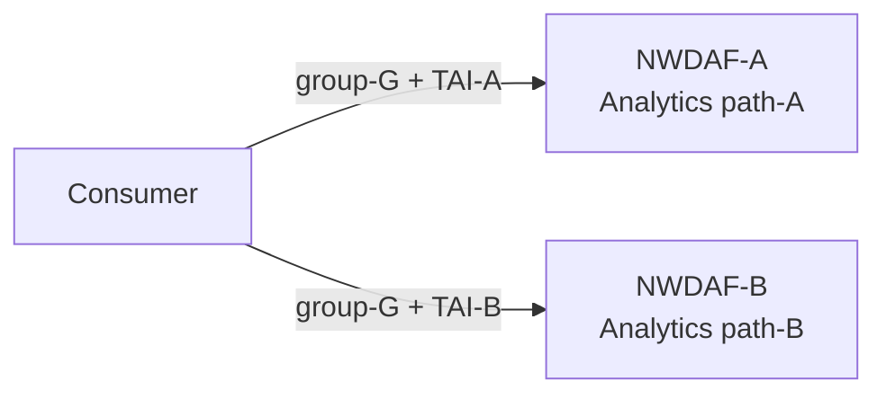
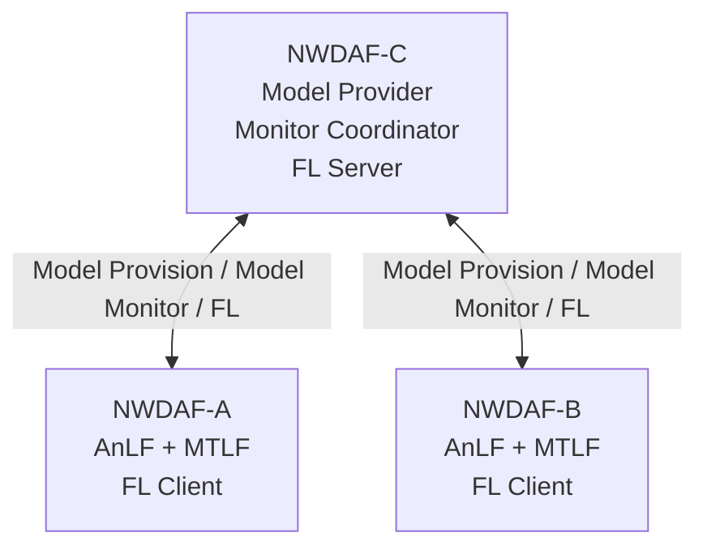
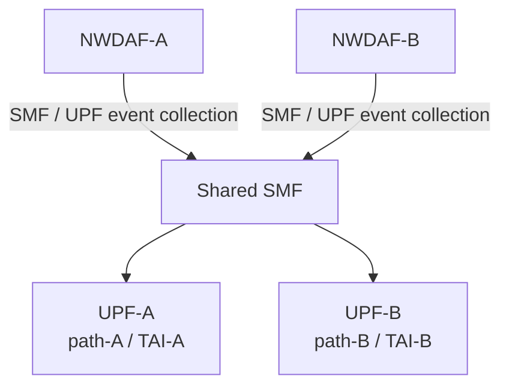
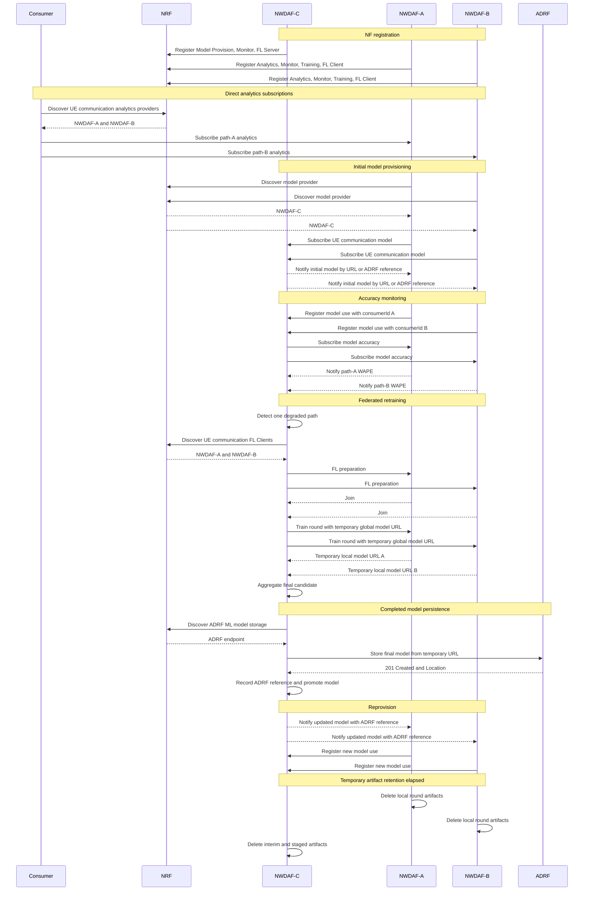

# Distributed NWDAF Model Monitoring and Federated Retraining Architecture

Date: 2026-07-26

Status: Architecture draft for discussion

Related documents:

- [NWDAF Federated Learning Release 18 規格解讀](../specification-guides/NWDAF%20Federated%20Learning%20Release%2018%20規格解讀.md)
- [NWDAF AnLF／MTLF Current Feature Architecture](./Current%20AnLF%20MTLF%20Feature%20Architecture.md)
- [AoI aggregation routing exploration](../notes/distributed/aggregation_routing/agg_routing_with_aoi.md)

---

## 1. 文件目的

本文描述一個由三個 NWDAF 組成的分散式分析、模型監控與聯邦再訓練情境：

- NWDAF-C 集中持有並提供初始／更新模型，收集模型 accuracy monitoring
  結果，並在需要時擔任 FL Server；
- NWDAF-A 與 NWDAF-B 各自對 Consumer 提供一條 path 的 analytics，
  使用本地模型執行推論，並擔任 FL Client；
- A、B 的 analytics target 是同一個 Internal Group，並以不同 AoI
  形成兩個 area-specific scopes；
- Consumer 分別向 A、B 訂閱 analytics，不經過 C，也不要求 C 擔任
  Analytics Aggregator；
- 當任一路徑的模型表現下降，C 可讓 A、B 都以各自持有或可取得的資料參與
  FL，聚合出新模型後再提供給 A、B。

本文先固定高階工作流程、標準服務邊界、NRF capability、主要 identity
關係，以及第一版 FL execution profile。第一版由 NRF discovery 與
Model Training preparation 選出 eligible participants，在每次 process
啟動時固定 participant set，並使用同步、sample-count-weighted FedAvg；
完整 dataset schema、程式 package 與 private backend API 不在目前版本中
定案。

---

## 2. 情境與網路拓撲

### 2.1 初始部署假設

目前實驗拓撲有兩條流量 path，但分析 target 是同一個 Internal Group：

- monitored target 為同一個 `group-G`；
- path-A 由 UPF-A 處理，對應 AoI-A／TAI-A；
- path-B 由 UPF-B 處理，對應 AoI-B／TAI-B；
- UPF-A 與 UPF-B 可由同一個 SMF 管理；
- NWDAF-A 專責 path-A 的資料蒐集與 analytics；
- NWDAF-B 專責 path-B 的資料蒐集與 analytics。

兩個 analytics scopes 分別是：

```text
scope-A = group-G intersect AoI-A
scope-B = group-G intersect AoI-B
```

因此文件中的 A、B 是目前兩個 area-specific NWDAF instances，不表示架構
把 group 數量或 AoI 數量固定為二。本情境只有一個 group；未來可依相同
方式加入更多 AoI 與對應 NWDAF，並繼續使用同一個 group target。

為避免把三種不同的關係混在同一張圖，拓撲分成以下三個視圖。

Consumer 分別向兩個 Analytics NWDAFs 建立訂閱：



NWDAF-C 負責模型提供、accuracy monitoring 協調與 FL Server：



NWDAF-A、B 經同一個 SMF 蒐集不同 path 的 UPF data：



### 2.2 不使用 Analytics Aggregator

本情境不要求單一 NWDAF 作為 analytics 對外門面：

- Consumer 透過 NRF 找到可提供目標 Analytics ID 與服務區域的 A、B；
- Consumer 分別建立兩個 analytics subscriptions；
- A、B 各自將 analytics notification 直接送回 Consumer；
- C 不接收、relay 或聚合 A、B 的 analytics 結果。

先前的 AGG routing 文件仍可作為另一種拓撲的研究筆記，但不是本情境的
前置條件。這裡的「集中」只發生在模型 lifecycle、accuracy observation
與 FL aggregation，不發生在 analytics exposure。

---

## 3. NWDAF 角色與責任

| 角色 | Analytics | Model Provision | Model Monitor | Federated Learning | Training data |
| --- | --- | --- | --- | --- | --- |
| NWDAF-A | 提供 path-A analytics | 作為 model consumer | 量測並回報 path-A accuracy | FL Client | 使用 path-A 本地資料或 ADRF 資料 |
| NWDAF-B | 提供 path-B analytics | 作為 model consumer | 量測並回報 path-B accuracy | FL Client | 使用 path-B 本地資料或 ADRF 資料 |
| NWDAF-C | 不對 Consumer 提供本情境的 analytics | 初始／更新模型的 owner 與 provider | 接受 A、B registration，訂閱 A、B accuracy | FL Server | 不集中收取 A、B raw data |

### 3.1 NWDAF-C

NWDAF-C 包含 MTLF，負責：

- 維護模型 family、各代模型 identity 與 artifact；
- 作為 A、B 的 `Nnwdaf_MLModelProvision` provider；
- 接受 A、B 的 Model Monitor registrations；
- 根據 registration 與 NRF discovery，向 A、B 建立 Model Monitor
  subscriptions；
- 分別保存 A、B 對同一模型的 accuracy observation；
- 根據本地 degradation policy 決定是否更新模型；
- 擔任 FL Server，選擇 FL Clients、協調 rounds、聚合 local models；
- 將新 global model 透過既有 Model Provision subscriptions 通知 A、B。

NWDAF-C 不需要提供 `Nnwdaf_EventsSubscription`。它是否支援
`UE_COMMUNICATION` 模型，由 `mlAnalyticsIds` 和
`nnwdaf-mlmodelprovision` service 表達，不應因為能提供模型就被視為能
提供該 analytics。

### 3.2 NWDAF-A 與 NWDAF-B

A、B 都包含 AnLF 與 MTLF，負責：

- 對 Consumer 提供 `UE_COMMUNICATION` analytics；
- 根據各自的 target、AoI、group 與資料來源進行 collection；
- 發現並訂閱 C 的 Model Provision service；
- 下載、驗證並啟用 C 提供的模型；
- 以自身 `nfInstanceId` 向 C 登錄模型使用與 monitoring capability；
- 接受 C 建立的 Model Monitor subscription；
- 在能形成有效 prediction／ground-truth window 時回報 accuracy；
- 保留各自的 local training data，或知道如何向 ADRF 取得資料；
- 接受 C 的 Model Training request，執行 local training 並回傳 local
  model information。

A、B 對 Consumer 的 analytics subscriptions 彼此獨立；它們使用相同
group target 與相同 global model，但不同 AoI 仍形成不同的 analytics
subscription、monitor scope 與 local dataset。

---

## 4. NRF capability registration

### 4.1 能力與 service endpoint 必須一起判斷

NRF profile 的兩層資訊分別回答：

- `nfServiceList`：有哪些可呼叫的標準服務與 endpoint；
- `nwdafInfo`：服務支援哪些 analytics、模型適用範圍與 FL role。

本情境最重要的欄位區分是：

- `nwdafEvents`：`Nnwdaf_EventsSubscription` 支援的 analytics event；
- `mlAnalyticsIds`：Model Provision 支援的 analytics 類型，也是同一個
  `MlAnalyticsInfo` 中 FL capability 的適用 analytics 類型；
- `flCapabilityType`：`FL_SERVER`、`FL_CLIENT` 或
  `FL_SERVER_AND_CLIENT`。

`nwdafEvents=["UE_COMMUNICATION"]` 不會推導出模型能力；
`mlAnalyticsIds=["UE_COMMUNICATION"]` 也不會推導出 analytics provider
能力。

### 4.2 NWDAF-C capability

NWDAF-C 的概念性能力宣告：

```json
{
  "nfInstanceId": "nwdaf-c-uuid",
  "nfType": "NWDAF",
  "nfStatus": "REGISTERED",
  "nwdafInfo": {
    "mlAnalyticsList": [
      {
        "mlAnalyticsIds": ["UE_COMMUNICATION"],
        "flCapabilityType": "FL_SERVER",
        "mlModelInterInfo": {
          "vendorList": ["experiment-vendor"]
        }
      }
    ]
  },
  "nfServiceList": {
    "model-provision": {
      "serviceName": "nnwdaf-mlmodelprovision",
      "nfServiceStatus": "REGISTERED"
    },
    "model-monitor": {
      "serviceName": "nnwdaf-mlmodelmonitor",
      "nfServiceStatus": "REGISTERED"
    }
  }
}
```

這是能力片段，不是完整合法 NF Profile。C 不註冊
`nnwdaf-eventssubscription`，因此 Consumer 不會把它選作 analytics
provider。不能只靠省略 `nwdafEvents` 表達「不提供 analytics」，因為該
欄位在相應服務存在時具有 wildcard 缺省語意。

### 4.3 NWDAF-A／B capability

A、B 的概念性能力宣告：

```json
{
  "nfInstanceId": "nwdaf-a-uuid",
  "nfType": "NWDAF",
  "nfStatus": "REGISTERED",
  "nwdafInfo": {
    "nwdafEvents": ["UE_COMMUNICATION"],
    "taiList": [
      {
        "plmnId": {
          "mcc": "001",
          "mnc": "01"
        },
        "tac": "00000a"
      }
    ],
    "mlAnalyticsList": [
      {
        "mlAnalyticsIds": ["UE_COMMUNICATION"],
        "flCapabilityType": "FL_CLIENT",
        "trackingAreaList": [
          {
            "plmnId": {
              "mcc": "001",
              "mnc": "01"
            },
            "tac": "00000a"
          }
        ],
        "nfTypeList": ["SMF", "UPF"],
        "mlModelInterInfo": {
          "vendorList": ["experiment-vendor"]
        }
      }
    ]
  },
  "nfServiceList": {
    "analytics-subscription": {
      "serviceName": "nnwdaf-eventssubscription",
      "nfServiceStatus": "REGISTERED"
    },
    "model-monitor": {
      "serviceName": "nnwdaf-mlmodelmonitor",
      "nfServiceStatus": "REGISTERED"
    },
    "model-training": {
      "serviceName": "nnwdaf-mlmodeltraining",
      "nfServiceStatus": "REGISTERED"
    }
  }
}
```

NWDAF-B 使用自己的 `nfInstanceId` 與 TAI-B。A、B 是否也對外提供
Model Provision 是獨立選項；本情境不要求它們註冊
`nnwdaf-mlmodelprovision`。

---

## 5. End-to-end workflow

### 5.1 Stage 0：NF registration

1. A、B、C 各自以獨立 `nfInstanceId` 向 NRF 註冊；
2. C 宣告 Model Provision、Model Monitor 與 `FL_SERVER`；
3. A、B 宣告 Events Subscription、Model Monitor、Model Training 與
   `FL_CLIENT`；
4. NRF 保存能力與服務 endpoint，並以 heartbeat／status 維持
   availability。

NRF 知道的是 capability 與 endpoint，不知道：

- A、B 目前是否正在使用 C 的某個模型；
- 哪個 consumer subscription 對應哪個模型；
- 哪條 path 已 degraded；
- A、B 是否已接受本輪 FL；
- local dataset 目前是否足夠。

上述 runtime 關係分別由 Model Provision、Model Monitor、FL preparation
與各 NWDAF 本地狀態維護。

### 5.2 Stage 1：Consumer 分別訂閱 A、B analytics

Consumer 可依 Analytics ID 與 service area 查詢 A、B：

```http
GET {nrfApiRoot}/nnrf-disc/v1/nf-instances
    ?target-nf-type=NWDAF
    &requester-nf-type={consumerNfType}
    &service-names=nnwdaf-eventssubscription
    &nwdaf-event-list=UE_COMMUNICATION
```

若 Consumer 提供 AoI，NRF discovery 與後續 subscription 可再帶入相應
區域條件。Consumer 選出 A、B 後分別建立：

```text
subscription-A = UE_COMMUNICATION + group-G + AoI-A
subscription-B = UE_COMMUNICATION + group-G + AoI-B
```

`UE_COMMUNICATION` 不支援把 `anyUe=true` 當成 Target of Analytics
Reporting。TS 23.288 §6.7.3 將 target 限定為單一 SUPI 或一組 Internal
Group IDs；TS 29.520 對應的 Stage 3 validation 也要求
`tgtUe.supis` 或 `tgtUe.intGroupIds`。本情境選擇同一個
`intGroupIds=["group-G"]`，再以 analytics filter 中不同的
`networkArea`／AoI 區分 path。

AoI 不是另一個 UE target。每個 NWDAF 實際處理的是 group 成員與其 AoI
的交集，因此同一 UE group 可以在不同區域形成獨立資料蒐集、推論和
accuracy monitoring scope。

A、B 可以在接受 analytics subscription 後立即建立資源，不必等到模型
下載與資料蒐集全部完成；analytics 何時能實際產生，仍取決於各自的 model
與 collection readiness。

### 5.3 Stage 2：A、B 取得初始模型

A、B 發現手上沒有適用模型時，分別發現 C：

```http
GET {nrfApiRoot}/nnrf-disc/v1/nf-instances
    ?target-nf-type=NWDAF
    &requester-nf-type=NWDAF
    &requester-nf-instance-id={aOrBInstanceId}
    &service-names=nnwdaf-mlmodelprovision
    &ml-analytics-info-list=[{"mlAnalyticsIds":["UE_COMMUNICATION"]}]
```

接著 A、B 各自向 C 建立 Model Provision subscription，帶入：

- `mLEvent=UE_COMMUNICATION`；
- model filter；
- target UE／group；
- model interoperability；
- callback URI 與 correlation；
- 需要時可帶 accuracy interest、model-needed time 或 monitoring
  information。

C 檢查現有 catalog：

- 有適用模型時，提供該模型；
- 尚無適用模型時，保留 model demand，並依本地政策產生模型；
- subscription 保持存在時，後續模型更新沿用同一條通知關係。

A、B 下載、驗證並成功啟用模型後，才把該模型視為目前 active model。
模型複用不能只比較 Analytics ID；仍需考慮 model filter、target、
interoperability 與既有 applicability identity。

本情境預期 C 能把「同一 group、AoI-A」與「同一 group、AoI-B」關聯到
同一個可共同再訓練的 model family，同時保留兩個獨立 use／monitor
scopes。初始 artifact 可以相同，但其 spatial applicability 必須涵蓋相應
AoI；確切的 family canonicalization rule 留在第 9 章繼續討論。

### 5.4 Stage 3：建立分路徑 Model Monitor

A、B 開始使用模型後，分別向 C 發送
`Nnwdaf_MLModelMonitor_Register`。每筆 registration 至少表達：

- `consumerId`：A 或 B 自己的 `nfInstanceId`；
- `modelId`：目前使用的 model unique identifier；
- 可選的 `mLEvent`、event filter 與 target UE。

`consumerId` 讓 C 知道是哪個 NWDAF 正在使用模型，但它不是 endpoint。
C 可經由 NRF discovery 找到該 `nfInstanceId` 所提供的
`nnwdaf-mlmodelmonitor` service，再向 A 或 B 建立
`Nnwdaf_MLModelMonitor_Subscribe`：

- `modelIds`；
- C 維護的 notification URI；
- `notifCorrId`；
- desired metric／threshold／reporting information；
- Analytics ID、filter 與 target。

A、B 在有足夠 prediction 與 ground truth 形成穩定 measurement window
後，將 accuracy information 通知 C。本情境沿用目前的 WAPE-only
degradation policy：

- `deviation` 承載 WAPE；
- 資料不足時不產生虛假的 accuracy observation；
- A、B 的 observation 依 monitor scope 分開保存；
- 相同 group 與 global model 在不同 AoI 上可以有不同表現。

WAPE、window size、minimum samples、threshold 與 degradation 判斷方式是
本地實作政策，不是 3GPP 固定演算法。

### 5.5 Stage 4：任一路徑 degradation 觸發 eligible Clients FL

本情境採用以下策略：

```text
scope-A degraded OR scope-B degraded
  -> current assigned model requires retraining
  -> discover and prepare all eligible Clients for this intent
```

這表示觸發來源與 training dataset 範圍是兩件事。即使只有 path-A
degraded，也可讓同一 training intent 下的 A、B 與後續新增的 eligible
Clients 各自使用可用的本地資料參與訓練，不把未 degraded 的 path 固定
當成 validation-only dataset。

C 向 NRF 查詢候選 FL Clients：

```http
GET {nrfApiRoot}/nnrf-disc/v1/nf-instances
    ?target-nf-type=NWDAF
    &requester-nf-type=NWDAF
    &requester-nf-instance-id={nwdafCInstanceId}
    &service-names=nnwdaf-mlmodeltraining
    &ml-analytics-info-list=[
      {
        "mlAnalyticsIds":["UE_COMMUNICATION"],
        "flCapabilityType":"FL_CLIENT"
      }
    ]
```

C 先用發生 degradation 的 Model Monitor relationship 決定 retraining
base 與 training intent，再另外選擇 FL participants。兩者不是同一份
清單：

- Model Monitor registration 證明某個正在使用的模型 scope 發生
  degradation，負責觸發 retraining；
- NRF 證明候選 NWDAF 目前宣告 FL Client capability，並提供 Training
  endpoint；
- lineage root、training scope 與 model interoperability 證明候選者和
  本次 retraining intent 相容；
- Model Training preparation 最後確認其 local data availability、
  availability time、能力與參與意願。

候選 FL Client 不需要先有 Consumer analytics subscription、正在執行
inference、取得 C 的正式模型或建立 Model Monitor registration。base
model 也不必已經是該 Client 的 inference model，且不必在訓練前就把新
AoI 列為 `applicableTo`。

目前的初始實驗拓撲只會發現 A、B，但 participants 不硬編碼為這兩個
identity。C 先從 NRF candidates、lineage root 與 training scope
compatibility 篩選同一 training intent 的候選者，再使用 Model Training
preparation 確認：

- model interoperability；
- local data availability；
- FL availability time；
- 計算與通訊能力；
- 是否願意加入本輪 FL。

第一版將所有通過上述條件的 eligible clients 納入 process，並在正式
rounds 開始前固定 participant set。已被選入者只要任一方 preparation
失敗或後續離開，本次 process 就保持未啟動或標記失敗；不在執行中縮小、
擴大或替換 participant set。後續可再擴充 minimum participant、client
sampling、replacement 與每 round 重新 preparation policy。

### 5.6 Stage 5：Client local training 與 C aggregation

第一版固定採用同步、sample-count-weighted FedAvg。初始拓撲的
participants 是 A、B；若後續有 TAI3 等 eligible Client，流程相同：

1. C 建立或更新 Model Training subscription；
2. C 提供 initial／current global model、round identity、training
   requirement 與 maximum response time；
3. 各 Client 在本地選擇 dataset；
4. 各 Client 使用本地資料訓練，不向 C 傳 raw training data；
5. 各 Client 將完整 local model information、status、標準 training input
   data information 與含實際 training sample count 的 local model
   artifact reference 回傳 C；
6. C 等待同一 `roundInd` 的所有 selected Client 結果都到齊；
7. C 驗證所有 artifact 與 sample count，再做 sample-count-weighted
   FedAvg，形成下一版 global model；
8. 若尚未達到設定的固定 round 數，C 發送下一 round 的 global model；
9. 達到固定 round 數後，C 結束各 Client 的 FL training resources。

若將第 `i` 個 Client 回傳的完整模型參數記為 `weights[i, r]`，實際
training sample count 記為 `sampleCount[i, r]`，第一版聚合為：

```text
globalWeights[r + 1] =
  sum(sampleCount[i, r] * weights[i, r] for i in participants)
  / sum(sampleCount[i, r] for i in participants)
```

第一版不交換 gradient、parameter delta 或 optimizer state。所有 Client 必須
使用相容的 model bundle、相同參數結構與 preprocessing contract，C
必須在聚合前驗證 artifact identity、tensor shape、dtype、parameter
ordering 與 sample count。

#### 5.6.1 Training sample count contract

`TrainDataInfo.samplRatio` 表示實際選取資料相對於 available data 的抽樣
比例；`DataAvReq.minNumSamples` 表示 Server 對資料量提出的最低需求。兩者
都不是 Client 本輪實際用於 FedAvg 的精確樣本數，不得拿來直接計算聚合
權重。

Release 18 Training callback 沒有 exact `numSamples` 或
`aggregationWeight` 欄位。第一版因此保持標準 Training JSON 不變，並把
精確樣本數放在 implementation-specific local model bundle manifest。
這不需要新增內部 API：C 本來就必須透過 callback 中的暫存 URL 下載
local model artifact，下載後一併讀取及驗證 manifest。

現有 PyMTLF candidate bundle 已在
`training.scope_eligibility[].training_sample_count` 保存每個實際
training scope 的樣本數。FL local model bundle 沿用此語意；一個 Client
在該 round 的 FedAvg 權重為：

```text
clientSampleCount =
  sum(scope.training_sample_count
      for each scope actually included in local training)
```

本模型的單一 training sample 定義為一組實際送入 trainer 的
`input sequence window + prediction target window`。它不是：

- 原始 UPF notification 數；
- timestamp observation 數；
- UE／SUPI 數；
- batch 數；
- epoch 展開後的累計處理次數；
- validation／testing window 數。

同一 training sample 即使跨多個 epochs 被重複使用，也只計算一次。只有
實際加入本輪 local fitting 的 scopes 與 training windows 才能計入。

C 對 sample count 的第一版驗證規則為：

- 每個 Client 都必須提供可解析的正整數；
- count 必須可由 manifest 中實際 included scopes 的
  `training_sample_count` 加總得到；
- validation samples 不得納入；
- 缺少、為零、為負或與 scope summary 不一致時，該 Client result 無效；
- 因第一版要求 selected participants 全員成功，任一 result 無效時整個
  round 不聚合。

實驗環境第一版信任各 Client 自行產生的 manifest。跨 trust domain 時的
簽章、attestation 或 sample-count fraud protection 留待安全設計處理。

每一 round 設定 maximum response time。若任一 Client 沒有在期限內提供
有效結果，C 不使用單一 Client 結果做部分聚合，也不臨時替換
participant；本次 FL process 標記失敗並保留可觀察的錯誤狀態。Client
仍可使用標準 Training notification 表達 delay 或 termination，但第一版
Server policy 不因此自動延長 round、降低 quorum 或更換 Client。

第一版使用固定 round 數作為 termination condition，不使用 training
metric early stopping。Model promotion 仍是 aggregation 完成後的獨立
步驟；完成所有 rounds 不等於模型已自動成為 active model。final bundle
還必須通過驗證、成功建立 ADRF durable reference，並通過 stale-base
檢查後才能 promotion。

後續可在相同標準 SBI resource model 上逐步擴充：

- 設定 quorum，在部分 Client 成功時仍進行聚合；
- timeout 後延長 deadline、retry、skip 或 replacement；
- 每輪 participant sampling；
- 依 evaluation metric early stopping；
- 非同步 aggregation 與 stale-result weighting。

其中 secure aggregation 還需要額外的 key-share／masked-update 協議，
不屬於第一版標準 SBI 可以直接表達的功能。

標準提供兩種 model artifact reference：

- `mLFileAddr`：由 model owner 維護 URL 或 FQDN，接收者再下載 artifact；
- `mLModelAdrf`：提供 ADRF reference，由接收者向 ADRF 取回 artifact。

第一版不把兩者設計成整個 FL process 二選一的 transport mode，而是依
artifact lifecycle 固定用途：

- 初始 global model 若已經持久化在 ADRF，可以用 `mLModelAdrf` 作為
  FL process 的起點；若仍由 C 本地持有，也可以使用 `mLFileAddr`；
- round 執行期間，Clients 與 C 之間交換的 local model 與 interim global
  model 一律使用各自 PyMTLF 維護的暫存 `mLFileAddr`；
- 固定 rounds 成功完成後，只有 C 產生的最終 global model 需要存入
  ADRF，並取得 durable `mLModelAdrf`；
- final model 後續透過 Model Provision 提供給相關 Clients 時，可以使用
  該 ADRF reference，不必繼續依賴 C 的暫存下載位址。

這避免每輪都建立 ADRF record、下載、再清除所造成的額外 storage 與
control-plane 成本。ADRF 是 completed model artifact repository，不是
FL round exchange bus。

雖然 TS 23.288 Stage 2 將直接提供 `ML Model file` 列為可選輸入，
TS 29.520 Release 18 的 Training OpenAPI 並未定義可單獨使用的 inline
binary transport。`mLModelInfos` 重用的 `MLEventNotif` 仍要求
`mLFileAddr` 或 `mLModelAdrf`，而 API 也沒有 multipart／octet-stream
body。因此本架構不在 Training JSON 中直接夾帶模型 binary。

#### 5.6.2 Round artifact lifecycle

各 PyMTLF 為 round artifacts 維護本地暫存目錄與可下載 URL：

1. C 建立 interim global artifact，各 Client 建立自己的 local result
   artifact；
2. artifact URL 在對應 FL process 仍為 active 時不得過期或被清除；
3. C 必須先下載並驗證所有 selected Clients 的 local artifacts，才把該
   round 標記為完成；
4. FL process 進入成功、失敗或取消等 terminal state 後，各節點才開始
   計算 configurable retention period；
5. retention period 到期後，各 Client 清除 local results，C 清除
   interim globals 與不再需要的下載副本；
6. final global artifact 在 ADRF storage 確認成功前不得被暫存清理機制
   刪除。

固定保留時間是 crash recovery 與 log／artifact inspection 的 grace
period，不是模型版本管理機制。PyMTLF 必須以 process、round 與
participant 建立清楚的 Training Workspace 暫存索引，避免單純依檔案
建立時間誤刪仍在執行中的模型。

#### 5.6.3 第一版 ADRF completed-model flow

最終模型使用 `Nadrf_MLModelManagement` 保存：

1. C 透過 NRF discovery 尋找宣告 `nadrf-mlmodelmanagement` 且
   `ml-model-storage-ind=true` 的 ADRF；
2. C 的 PyMTLF 讓 final artifact 可由暫存 `mlFileAddr` 下載；
3. C 以自己的 `nfInstanceId`、標準 numeric `modelUniqueId`、
   `mlFileAddr` 與 `mlStorageSize` 建立 ADRF ML model store record；
4. ADRF 下載並保存 artifact，回覆 `201 Created`、record representation
   與指向 individual store record 的 `Location`；
5. C 以 `modelUniqueId` 作為模型管理主識別，從 `Location` 解析並記錄
   `storeTransId`，將 ADRF NF identity 與 transaction ID 視為該模型的
   storage reference；
6. C 將 final model 的 durable reference 更新為 `mLModelAdrf`，再透過
   既有 Model Provision subscriptions 提供給 A、B；
7. A、B 使用已知的 `storeTransId` 向同一 ADRF retrieval，再依 record
   中的 `mlFileAddr` 下載 final artifact；
8. final model 不再被任何 Scope Assignment、Model Provision subscriber
   或 retained completed model policy 引用時，才由 C 決定是否要求 ADRF
   刪除。

若 aggregation 已完成但 ADRF storage 暫時失敗，C 保留本地 final
artifact 與可重試狀態；不得把尚未 durable 的模型當成 ADRF-published，
也不得因暫存 TTL 將它刪除。ADRF 恢復後可重試相同 completed-model
publication。

同一個 `modelUniqueId` 因 publication retry、ADRF relocation 或重新保存，
可以先後對應不同的 `storeTransId`。這不建立新的 completed model，也不
改變 `modelUniqueId`。C 必須記錄目前有效的 ADRF reference；對外提供
`mLModelAdrf` 時附上該 reference 的 `storTransId`，讓接收端定位精確
record。若只以 `model-unique-ids` retrieval，ADRF 中同一 model ID 的多筆
record 可能造成選擇歧義，因此不作為 Model Provision 的主要定位方式。

第一版 ADRF profile 以 `MLModelInfo` 的 URL-backed storage 為必要能力。
ADRF API 雖也定義 inline `MLModel.mlModel` binary，該形式不是本情境的
必要 transport，且不會被錯誤映射成 Training JSON inline binary。

現有團隊 ADRF `with-mlmodelmanagement` branch 已具備 URL 拉取、MongoDB
record、`Location`、artifact download、PUT 與 transaction DELETE 的基礎
實作及 handler／repository tests，但在納入 FL E2E 前仍須完成以下 contract
alignment：

- NRF profile 應以 Release 18 `adrfInfoList[].mlModelStorageInd` 表達能力；
  目前放在 `customInfo` 的值只能視為相容性暫存；
- collection GET 必須要求 `store-trans-id` 或 `model-unique-ids` 恰好一種，
  並實際支援依 `store-trans-id` retrieval；
- GET response 必須符合單一 `NadrfMLModelStoreRecord` schema，不依賴
  非標準的 individual-record GET；
- `modelUniqueId` 使用 OpenAPI 定義的 `Uinteger`，不得以 UUID 字串代替；
- `MLModelInfo.mlStorageSize` 必填，並補齊 `allowConsumerList`；
- storage result 使用標準 `modelStoreResult` 結構；
- record 中的 `mlModelInfo`／`mlModels` 是可包含多個模型的陣列；目前只
  處理第一個元素的限制不得被當成完整標準行為；
- PUT 除了更新 MongoDB metadata，也必須正確處理更新後 artifact 的保存，
  不能讓 record 指向未實際保存的新來源；
- 若宣告 inline storage 支援，`MLModel` 必須承載 `mlModel` binary，而非
  另一個 `mLFileAddr`；
- 補上 `/remove-stored-mlmodel`，或明確將第一版清理限制為已實作的
  transaction DELETE；
- ADRF 自訂的 `/{storeTransId}/model` 可以作為 record 所回傳的
  `mLFileAddr`，但不得當成標準 Nadrf resource operation；
- 加入 NWDAF、PyMTLF、NRF、ADRF 與 MongoDB 的跨 process E2E，驗證的不只
  是 stub repository handler。

Training data 可以：

- 已存在 A、B 本地；
- 由 A、B 向其 data source NFs 蒐集；
- 由 A、B 透過 ADRF retrieval 取得。

ADRF 只負責保存與取回資料／completed model artifact，不決定 model
tree、Scope Assignments、FL membership、degradation 或 model promotion。
這些 model-management relationships 仍由 C 的 PyMTLF 保存。C 不需要為
FL 把各 Client 的 raw dataset 集中取回。

### 5.7 Stage 6：新模型提供與監控世代切換

C 完成 aggregation 後：

1. 以各 participating scope 的 validation dataset 評估 final candidate；
2. 將 per-scope metric、sample count 與 evaluation data window 寫入 final
   model description；
3. 分別決定 candidate 通過哪些 scopes 的 validation gate，並以此形成
   `applicableTo`；若沒有任何 scope 通過則不發布；
4. 建立新的 model unique identifier 與 final model artifact；
5. 將 final artifact 保存至 ADRF 並記錄 durable reference；
6. ADRF storage 成功後，把新節點加入 Completed Model Tree，並依每個
   scope 的 validation evidence 更新其模型優先集；
7. 只對 selected model 發生變更的 Clients，透過既有 Model Provision
   subscriptions 發送 updated model；
8. Clients 下載、驗證並原子切換 active model；
9. Clients 以新 `modelId` 建立新的 Model Monitor registration；
10. C 為新模型建立新的 monitor subscriptions／correlations；
11. 舊模型的 monitoring relationship 在不再使用後
    deregister／delete。

Consumer 不需重新建立原 analytics subscription。各 Client 仍以原本的
analytics resource 對 Consumer 提供結果，只替換內部使用的模型。

---

## 6. Complete sequence



Analytics notifications from A／B to Consumer and multiple FL rounds are omitted
from the diagram only to keep it readable.

---

## 7. PyMTLF model management

### 7.1 模型從訓練到使用的流程

PyMTLF 依照模型所在階段處理資料：

```text
FL training
  -> 暫存每一 round 的 local／global model
  -> 產生 final candidate
  -> 驗證通過並配置 modelUniqueId
  -> 加入正式模型的訓練血緣
  -> 指定哪些 analytics scopes 改用這個模型
  -> 透過 Model Provision 通知正在使用相關 scopes 的 NWDAFs
```

因此只需要分清楚三件事：

1. 訓練還沒完成的模型只是暫存檔，不是正式模型；
2. 訓練完成的模型會記錄它是從哪個 base model 訓練而來；
3. 另外記錄每個 analytics scope 現在實際使用哪個正式模型。

後續段落使用 Completed Model Tree 表示第 2 項的訓練血緣，使用 Scope
Assignments 表示第 3 項的實際使用關係。兩者用途不同：模型在樹中的深度
或建立時間，不會直接決定 Model Provision 應提供哪一個模型。

### 7.2 正式模型與訓練血緣（Completed Model Tree）

模型樹只保存 seed model 與完成訓練、通過驗證並可被正式提供的 final
model。Client local result 與中間 round global model 不進入樹中。
所有進入模型樹的正式模型都必須配置 `modelUniqueId`，供 ADRF storage、
Model Provision 與 Model Monitor 共同引用。

同一棵模型樹的根必須先具有相容的分析目的，不能只因 Analytics ID 相同
就放在一起。概念上的 lineage root 至少由以下資訊決定：

```text
Analytics ID
+ target UE semantics
+ non-spatial analytics filters
+ use-case／model interoperability context
```

例如 `tgtUe` 的 Internal Group、S-NSSAI、DNN 或 Application ID 不同時，
第一版不應自動假設它們能共用模型血緣。只有經過明確 compatibility policy
確認後，才可跨這些條件共同訓練。

AoI／TAI 仍然是完整 analytics scope 的一部分，但在本情境中被視為特別的
spatial specialization dimension：當 Analytics ID、`tgtUe` 與其他 filters
都相同時，可以由通用模型往下建立適用於不同 TAI 集合的分支。子模型可只
涵蓋單一 TAI，也可像後面的 M3、M4 一樣涵蓋逐步擴大的 TAI 集合。

每個完成模型節點至少保存：

| Field | Meaning |
| --- | --- |
| `modelUniqueId` | model owner 配置、不得重用，且須在 5GC scope 內唯一的標準模型識別 |
| `parentModelUniqueId` | 本次訓練實際使用的 base model；seed 無 parent |
| analytics event | 例如 `UE_COMMUNICATION` |
| `trainedWith` | 本次訓練實際使用過的 scopes 與 sample count |
| `applicableTo` | 經驗證後允許提供及使用此模型的 scopes |
| validation summary | final model 在各驗證 scope 的 metric、sample count 與資料區段 |
| artifact reference | 本地 artifact reference，以及可選的 ADRF reference |

`trainedWith` 與 `applicableTo` 必須分開：

- `trainedWith` 是模型訓練來源的 provenance；
- `applicableTo` 是後續選模的硬性適用範圍；
- final model 對每個 participant scope 分別驗證；通過該 scope 的
  validation gate，才將該 scope 加入 `applicableTo`；
- 某個 scope 未通過不會自動取消模型對其他已通過 scopes 的適用性。

validation summary 會放進 final model bundle 的描述檔，至少分 scope
記錄：

- metric 名稱與數值，例如 WAPE；
- evaluation sample count；
- evaluation data window 或 dataset snapshot identity；
- evaluation time 與必要的 evaluator／config revision。

這是 PyMTLF bundle manifest 的內部 metadata，不新增 3GPP Model
Provision 欄位。Model Provision 仍只投影標準模型識別、applicability 與
artifact reference。

這些數值只代表模型建立時的離線證據，不保證未來線上表現。選模時必須先
通過 `applicableTo`，才可用歷史 validation summary 比較同樣適用的候選
模型；線上 Model Monitor observation 仍是後續 degradation 判斷依據。

`storeTransId` 不是模型 identity。它只是 final model 保存至 ADRF 後附加
在該節點的 storage locator；模型管理與選模資訊仍由 PyMTLF 維護。

### 7.3 分析範圍與目前模型（Scope Assignments）

PyMTLF 將 Model Provision demand 正規化成 analytics scope，例如：

```text
Analytics ID
+ tgtUe
+ complete analytics filter, including AoI
+ use-case／interoperability context
```

Scope Assignments 對每個 scope 保存依序排列的模型候選集：

```text
canonical analytics scope -> ordered modelUniqueIds
selected model             -> first currently usable candidate
```

收到模型需求時依下列順序決定：

1. 若有完全相符的 scope assignment，提供優先集中第一個仍有效且可取得的
   模型；
2. 否則從 `applicableTo` 涵蓋該 scope 的 completed models 中選擇；
3. 多個模型都適用時，使用該 scope 自己的 validation summary 排序；
   WAPE 較低者優先，evaluation protocol 相容性、data window 新舊與
   sample count 作為 evidence 品質及 tie-breaker，不因模型較新就必然優先；
4. 若沒有專用模型，回退到 applicability 涵蓋相同 lineage root 與該
   spatial scope 的通用 seed model；
5. 若連通用 seed 都不適用，才表示目前沒有可提供模型。

「selected／active」因此是 scope 與該 scope 優先集第一個模型之間的
關係，不是模型本身只能擁有一個全域 active／retired 狀態。同一個模型
可以同時被多個 AoI 使用，也可以在不再被某個 AoI 優先選用後，繼續作為
其他 scope 的模型、fallback candidate 或後續 retraining base。

### 7.4 訓練期間的暫存模型（Training Workspace）

每次 FL process 建立獨立工作區，暫存索引使用：

```text
flProcessId + roundInd + participant
```

工作區保存 Client local models 與 Server interim global models。這些模型：

- 只透過 PyMTLF 暫存 `mLFileAddr` 交換；
- 不需要正式 `modelUniqueId`；
- 第一版不使用 `addModelInfo`；每次只交換一個由 process、round 與
  participant 關聯的暫存模型；
- 不進入 Completed Model Tree 或 Model Provision selection；
- bundle 描述以 `ROUND_INTERMEDIATE`、process、round、participant 與
  sample count 表明它是訓練中的過渡產物；
- FL process terminal 且 retention period 到期後即可清除。

最後一輪聚合結果離開 Training Workspace 前，仍只是 final candidate。
它通過 bundle、aggregation、validation 與 stale-base 檢查後，才配置新的
`modelUniqueId`，以 `PROCESS_FINAL` 打包、保存至 ADRF、加入 Completed
Model Tree，最後更新 Scope Assignments。

### 7.5 Retraining 與 client selection

任一 scope degradation 觸發 retraining 時：

1. 由該 scope assignment 找到本次共同訓練的 base model；
2. C 透過 NRF discovery 取得宣告相容 FL Client capability 的候選
   NWDAFs；
3. C 再以 Model Training preparation 確認各候選者的 model
   interoperability、local data、availability 與參與意願；
4. 本次 process 納入所有符合本次訓練目的的 eligible clients，並在
   process 啟動時固定 participant set；
5. 所有 participants 都取得同一個 base/global model，使用自己的本地
   資料訓練；不會把各 Client 目前用於推論的不同模型直接混在一起聚合；
6. C 使用各 Client 實際 training sample count 做 weighted FedAvg；
7. final aggregate 在每個 participating scope 上分別執行 validation；
8. 只要至少一個 scope 通過 validation gate，即可建立 completed model
   node、保存 ADRF reference，並將新模型加入各已通過 scope 的優先集；
9. 各 scope 以自己的 validation evidence 重新排序候選模型；只有 selected
   model 發生變更的 scopes，才透過既有 Model Provision subscriptions
   通知。

NRF discovery 只提供候選者及 endpoint；Completed Model Tree、Scope
Assignments、validation summary 與參與者選擇都是 C 的 PyMTLF 本地責任。
process 啟動後才出現的新 Client 留到下一次 retraining，不在執行中替換
participant。

### 7.6 TAI1–TAI4 範例

本例中的 TAI1、TAI2、TAI3、TAI4 是完整 scope 的簡稱。四者具有相同的：

- Analytics ID：`UE_COMMUNICATION`；
- `tgtUe`：同一個 Internal Group；
- S-NSSAI、DNN、Application ID 等其他 filters；
- use-case 與 model interoperability requirements。

四個 scopes 唯一刻意不同的條件是 AoI／TAI。若上述其他條件不同，不能
直接套用本例的同一模型樹與共同 FL participant selection。

本例中的 FL Clients 與本地資料範圍如下：

| FL Client | Training scope | 可用於 local training 的資料 |
| --- | --- | --- |
| Client-1 | TAI1 | TAI1 的本地或 ADRF training data |
| Client-2 | TAI2 | TAI2 的本地或 ADRF training data |
| Client-3 | TAI3 | 後續加入，提供 TAI3 training data |
| Client-4 | TAI4 | 更晚加入，提供 TAI4 training data |

Client 編號只是此例的簡稱。每個 Client 實際上都是向 NRF 註冊 FL Client
capability 的 NWDAF，C 仍須經過 NRF discovery 與 Model Training
preparation 才能把它加入某次 FL process。

初始狀態只有一個對本例的固定 event、target 與 non-spatial filters
通用，但尚未針對特定 TAI 專門化的 seed model：

```text
M1: UE_COMMUNICATION + group-G + common filters
    spatial applicability = generic
```

Client-1 與 Client-2 最初分別使用 M1 服務 TAI1、TAI2。兩者各自使用
TAI1、TAI2 的資料完成一次 FL 後建立 M2：

```text
M1
└── M2: trainedWith={TAI1, TAI2}
        applicableTo={TAI1, TAI2}
```

之後 NRF 可以發現 Client-3 宣告相同 training intent 的 FL Client
capability，且 Model Training preparation 確認它能提供 TAI3 training
data。Client-3 不需要先接受 Consumer analytics subscription、執行
inference 或使用任何正式模型。

Client-1 與 Client-2 分別回報 M2 在 TAI1、TAI2 的線上表現。當其中任一
scope 的 WAPE degradation policy 成立時，C 才觸發 retraining，並由該
scope 的 current assignment 決定使用 M2 作為 base model。C 接著透過
NRF discovery 與 preparation 選到 Client-1、Client-2、Client-3；三者都
取得 M2 作為共同 training base model，分別用 TAI1、TAI2、TAI3 資料
訓練並產生 M3。假設 M3 在三個 scope 都通過 validation gate，且分別
成為該 scope 驗證表現最好的模型：

```text
M1
└── M2: TAI1, TAI2
    └── M3: TAI1, TAI2, TAI3

Scope model priorities:
  TAI1: M3 > M2 > M1
  TAI2: M3 > M2 > M1
  TAI3: M3 > M1
  same lineage root, other supported AoI -> M1
```

此後新的 TAI3 模型需求可直接取得 M3。更晚加入的 Client-4 服務 TAI4；
它第一次請求模型時，PyMTLF 沒有 TAI4 專用 assignment 或 applicability，
因此先提供通用 M1。

假設 Client-4 使用 M1 後，TAI4 的監控表現下降，C 以 TAI4 的 current
assignment 決定本次 base 是 M1。NRF discovery 與 preparation 發現
Client-1、Client-2、Client-3、Client-4 皆可參與，於是四個 Client 都
取得 **M1** 作為本次共同 global model，並分別使用 TAI1、TAI2、TAI3、
TAI4 的本地資料訓練。部分 Clients 當時可能用 M3 推論，另一些可能沒有
analytics inference responsibility；兩者都不會把 M3 混入這次 FedAvg。

訓練完成後產生 M4：

```text
M1
├── M2: trainedWith={TAI1, TAI2}
│   └── M3: trainedWith={TAI1, TAI2, TAI3}
└── M4: trainedWith={TAI1, TAI2, TAI3, TAI4}
```

M4 bundle 會分別保存 TAI1–TAI4 的 validation WAPE、evaluation sample
count 與資料區段。概念上的描述如下；這不是預先鎖定的實作 schema：

```yaml
modelUniqueId: 4
parentModelUniqueId: 1
trainedWith: [TAI1, TAI2, TAI3, TAI4]
applicableTo: [TAI1, TAI2, TAI3, TAI4]
validation:
  - scope: TAI1
    metric: WAPE
    value: 0.08
    sampleCount: 420
    dataWindow: evaluation-window-TAI1
  - scope: TAI2
    metric: WAPE
    value: 0.07
    sampleCount: 390
    dataWindow: evaluation-window-TAI2
  - scope: TAI3
    metric: WAPE
    value: 0.09
    sampleCount: 405
    dataWindow: evaluation-window-TAI3
  - scope: TAI4
    metric: WAPE
    value: 0.11
    sampleCount: 360
    dataWindow: evaluation-window-TAI4
```

假設 M4 在四個 scope 都通過 validation gate，便會加入模型樹；但每個
scope 會使用自己的 validation 結果排序，不會因為 M4 是最新模型就全部
切換。以下是一個具體例子：M3 在 TAI1、TAI3 的 WAPE 較好，M4 則在
TAI2、TAI4 較好：

```text
Scope model priorities after M4 validation:
  TAI1: M3 > M4 > M2 > M1
  TAI2: M4 > M3 > M2 > M1
  TAI3: M3 > M4 > M1
  TAI4: M4 > M1
  same lineage root, other supported AoI -> M1
```

若 M4 在某個 participating scope 未通過 validation gate，該 scope 不加入
M4 的 `applicableTo`，也不把 M4 放入該 scope 的優先集；其他已通過的
scopes 仍可各自排序及使用 M4。若所有 scopes 都未通過，M4 才不進入
completed model 管理。

這個例子同時說明：

- 模型樹只描述訓練血緣，M4 從 M1 分支並不表示它比 M3 舊或優先級較低；
- Client selection 可以讓新 scope 與既有 scopes 一起訓練；
- 各 scope 的模型優先集才決定實際提供哪個模型；
- validation summary 用來分 scope 排列已通過 applicability gate 的候選
  模型，但不取代持續的線上 accuracy monitoring。

### 7.7 與現有 PyMTLF 行為的銜接

第一版繼續沿用現有 immutable bundle、component digest、archive safety、
applicability canonicalization、stale-base protection、notification
coalescing 與 WAPE monitoring 行為。需要調整的是將現有 catalog 語意
收斂成上述模型樹與 assignments，並讓 FL round artifacts 留在獨立
Training Workspace。

模型樹、assignments、ADRF reference 與 restart recovery 要使用哪種
持久化格式，留到 implementation plan 決定；本架構文件不預先綁定單一
JSON 檔、資料庫 schema 或 lifecycle enum。NRF 也不保存上述任何
application-level relationship。

---

## 8. Standard behavior and scenario policy

### 8.1 由 Release 18 標準支持的行為

- NWDAF 透過 NRF 註冊／發現 analytics、model 與 FL capability；
- AnLF NWDAF 向 MTLF NWDAF 訂閱模型；
- MTLF NWDAF 提供初始模型與後續 retrained model；
- AnLF NWDAF 使用模型後向 responsible MTLF NWDAF 登錄 monitoring；
- MTLF NWDAF 向 AnLF NWDAF 訂閱 accuracy／feedback；
- MTLF 可根據一個或多個 AnLF NWDAFs 的 accuracy information 判斷
  degradation；
- FL Server 透過 NRF 發現 FL Clients，再以 preparation 決定參與者；
- FL Clients 以本地資料訓練並回傳 local model information；
- FL Server 聚合 local models 並將最終模型交付 model consumer。

### 8.2 本情境的設計政策

- C 不提供 analytics，也不是 Analytics Aggregator；
- Consumer 分別向 A、B 訂閱；
- C 是初始模型 owner、Model Provision provider 與 FL Server；
- A、B 是 analytics providers、model consumers、accuracy providers 與
  FL Clients；
- A、B 以同一 group target、不同 AoI 對相同模型建立分開的 monitoring
  scopes；
- accuracy policy 第一版只使用 WAPE degradation；
- 任一 scope degraded 就以該 scope 的 current assignment 所指模型作為
  retraining base；
- C 以 Model Monitor relationship 決定 degradation trigger 與 base
  model，再經 NRF discovery、training scope compatibility 與 preparation
  選出 eligible Clients，並在 process 啟動時固定 participant set；
- Client eligibility 不要求 Consumer analytics subscription、現行
  inference model 或 active Model Monitor registration；NRF capability、
  training scope compatibility 與 preparation 成功即可參與；
- 初始情境通常會選到 A、B；未來 TAI3 等符合條件的 Client 也可在下一個
  process 一併參與；
- 各 Client 使用自己的全部符合條件資料，不固定將其中一條 path 當
  validation-only dataset；
- 第一版使用同步、sample-count-weighted FedAvg，固定 round 數；
- sample count 是本輪實際 local training windows 數，由 local model
  bundle manifest 提供，不使用 `samplRatio` 代替；
- 每輪必須收到所有 selected Clients 的有效結果才聚合；
- 任一 Client preparation 失敗、拒絕、終止或 round timeout 時，不進行
  partial aggregation，也不動態替換 Client；
- C 聚合模型，不集中收取 raw data；
- initial model 可由 URL 或 ADRF 提供；round local／interim models 固定
  使用 PyMTLF 暫存 URL；completed final model 由 C 保存至 ADRF；
- A、B、C 的 round 暫存 artifacts 在 FL process terminal state 經過
  configurable retention period 後清除；
- PyMTLF 以 Completed Model Tree、Scope Assignments 與 Training
  Workspace 分離完成模型血緣、實際選模及 round 暫存資料；
- final model description 保存各 participating scope 的 validation
  metric、sample count 與 evaluation data window，作為後續選模證據；
- PyMTLF 管理 completed model metadata 與 ADRF references，ADRF 不承擔
  model selection／policy 責任；
- `modelUniqueId` 是正式模型的主識別，必須在 5GC scope 內唯一；
  `storeTransId` 只是一筆 ADRF storage locator；
- round local／interim models 不配置正式 `modelUniqueId`，只有通過驗證
  的 final model 才加入 Completed Model Tree；
- 更新模型沿用既有 Model Provision subscriptions。

這些政策符合標準允許的本地決策空間，但不是 3GPP 強制的唯一做法。

### 8.3 Daisy 參考範圍

本架構只採用 Daisy 中可獨立於 transport 的 FL engine 概念：

- process、round 與 per-client result state 分離；
- strategy、local trainer、aggregation 與 metrics 分離；
- Server 可設定 participant 數、等待條件與 termination policy；
- model、preprocessing 與 metadata 作為完整 artifact 管理。

跨 NWDAF 的 runtime 不依賴 Daisy。Daisy 的 gRPC、靜態 node topology、
Master 動態啟動 Client、集中上傳 MongoDB dataset 與自訂 task API，不
取代 NRF、Model Training、Model Provision 或 ADRF 標準流程。程式命名與
對外 contract 也不出現 Daisy-specific identity。

第一版只對應 Daisy 的 flat synchronous aggregation 概念，不採用 Zone、
proximal transmission、FedAsync 或 secure aggregation。後續若加入：

- client sampling、quorum、timeout 與 asynchronous aggregation，可作為
  C 的 FL Server policy 擴充，繼續沿用相同 Model Training resources；
- hierarchical aggregation，必須設計成多個相互關聯的標準 FL
  processes，不能直接把 Daisy 的 `Master -> Zone -> Client` 視為單一
  Release 18 FL process；
- secure aggregation，必須先定義標準 schema 未涵蓋的 key exchange 與
  masked model agreement。

---

## 9. 尚待後續討論

以下項目不阻擋目前高階架構成立，但需要在後續版本逐步決定：

1. 同一個 Internal Group ID、各 NWDAF service area 與各 AoI／TAI
   如何在實驗 config 中表達，以及 group membership 跨區域變動時如何
   更新 local scope；
2. 同一 group、不同 AoI 的 scopes 在什麼條件下共用同一個 training
   intent／model-tree root，以及何時應拆成獨立模型集合；
3. 後續是否加入 dynamic quorum、partial participation、early stopping
   或 asynchronous aggregation；
4. local training dataset 的時間範圍、資料品質與最小樣本要求；
5. A、B 如何把 analytics scope 對應到本地 MongoDB 或 ADRF
   `DataSetTag`／retrieval criteria；
6. 新模型 promotion 後，舊 monitor resources 的切換與清理時序；
7. 後續面對 Client 暫時離線、拒絕 preparation 或 round timeout 時，
   deadline extension、retry、skip 與 replacement policy；
8. 未來擴充為更多 NWDAFs、不同 vendors 或不同 model interoperability
   formats 時的 selection policy；
9. round artifact retention period 的預設值、磁碟上限與啟動時清理
    threshold；
10. retired final models 在 ADRF 的最小保留時間，以及依 transaction
    刪除或依 `modelUniqueId` 刪除的 policy；
11. 標準安全機制與憑證部署。第一版實驗仍可先使用普通 HTTP，此項不在
    目前實作計畫內。

---

## 10. Specification evidence

| Topic | Release 18 evidence |
| --- | --- |
| NWDAF capability registration | [TS 29.510 `NwdafInfo`](../../specs/TS%2029.510/6%20API%20Definitions/6.1%20Nnrf_NFManagement%20Service%20API/6.1.6%20Data%20Model/6.1.6.2%20Structured%20data%20types/6.1.6.2.45%20Type%20NwdafInfo.md) |
| Model／FL capability fields | [TS 29.510 `MlAnalyticsInfo`](../../specs/TS%2029.510/6%20API%20Definitions/6.1%20Nnrf_NFManagement%20Service%20API/6.1.6%20Data%20Model/6.1.6.2%20Structured%20data%20types/6.1.6.2.84%20Type%20MlAnalyticsInfo.md) |
| Service endpoint profile | [TS 29.510 `NFService`](../../specs/TS%2029.510/6%20API%20Definitions/6.1%20Nnrf_NFManagement%20Service%20API/6.1.6%20Data%20Model/6.1.6.2%20Structured%20data%20types/6.1.6.2.3%20Type%20NFService.md) |
| NRF discovery query | [TS 29.510 Nnrf_NFDiscovery OpenAPI](../../specs/openapi/TS29510_Nnrf_NFDiscovery.yaml) |
| `UE_COMMUNICATION` target 與 AoI | [TS 23.288 §6.7.3](../../specs/TS%2023.288/6%20Procedures%20to%20Support%20Network%20Data%20Analytics/6.7%20UE%20related%20analytics/6.7.3%20UE%20Communication%20Analytics.md) |
| `UE_COMMUNICATION` Stage 3 target validation | [TS 29.520 Events Subscription](../../specs/TS%2029.520/4%20Services%20offered%20by%20the%20NWDAF/4.2%20Nnwdaf_EventsSubscription%20Service/4.2.2%20Service%20Operations/4.2.2.2%20Nnwdaf_EventsSubscription_Subscribe%20service%20operation/4.2.2.2.2%20Subscription%20for%20event%20notifications.md) |
| Model provisioning procedure | [TS 23.288 §6.2A](../../specs/TS%2023.288/6%20Procedures%20to%20Support%20Network%20Data%20Analytics/6.2A%20Procedure%20for%20ML%20Model%20Provisioning.md) |
| Model provisioning API | [TS 29.520 Nnwdaf_MLModelProvision OpenAPI](../../specs/openapi/TS29520_Nnwdaf_MLModelProvision.yaml) |
| Accuracy monitoring procedure | [TS 23.288 §6.2E](../../specs/TS%2023.288/6%20Procedures%20to%20Support%20Network%20Data%20Analytics/6.2E%20MTLF-based%20ML%20Model%20Accuracy%20Monitoring.md) |
| Model monitoring API | [TS 29.520 Nnwdaf_MLModelMonitor OpenAPI](../../specs/openapi/TS29520_Nnwdaf_MLModelMonitor.yaml) |
| Federated Learning procedure | [TS 23.288 §6.2C](../../specs/TS%2023.288/6%20Procedures%20to%20Support%20Network%20Data%20Analytics/6.2C%20Federated%20Learning%20among%20Multiple%20NWDAFs.md) |
| Model training API | [TS 29.520 Nnwdaf_MLModelTraining OpenAPI](../../specs/openapi/TS29520_Nnwdaf_MLModelTraining.yaml) |
| ADRF ML model management procedure | [TS 29.575 §4.3](../../specs/TS%2029.575/4%20Services%20offered%20by%20the%20ADRF/4.3%20Nadrf%20_%20MLModelManagement%20Service.md) |
| ADRF ML model management API | [TS 29.575 Nadrf_MLModelManagement OpenAPI](../../specs/openapi/TS29575_Nadrf_MLModelManagement.yaml) |
