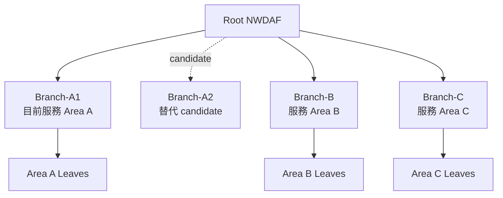
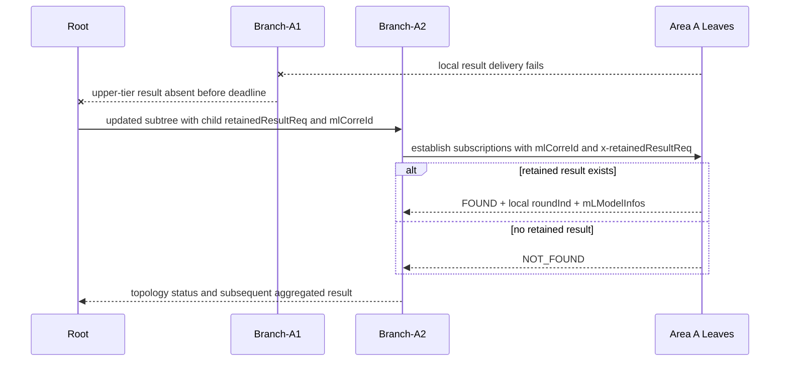

# Hierarchical NWDAF FL Branch 故障替換情境

日期：2026-09-02

狀態：情境與協定責任邊界已記錄；完整恢復機制不在目前 schema
設計範圍

相關文件：

- [Hierarchical NWDAF Federated Learning 協定設計](./protocol_design.md)
- [Topology、policy 與 strategy 細節設計](./topology_policy_design.md)
- [標準欄位與 Extension 邊界](./standard_field_extension_boundary.md)

---

## 1. 文件目的

本文記錄會議提出的 Branch failure／replacement 情境，說明既有
`Nnwdaf_MLModelTraining` mechanism 與目前 proposed extension 如何重新建立
Leaf 到新 Branch 的回報路徑，以及哪些恢復行為仍由 implementation 負責。

本文不是完整的 Branch recovery protocol，也不新增 failure detection、state
transfer、fencing 或 retained-result aggregation rule。

本文描述後續 protocol／schema 設計情境，不回頭修改目前 implementation
plan 已固定的 per-tier correlation 與不支援 restart recovery 等第一版範圍。

---

## 2. 情境設定

部署中有三個區域：

- Area A 有兩個可作為 Intermediate 的 NWDAFs：Branch-A1 與 Branch-A2。
- Area B 與 Area C 各有一個 Branch。
- 每個區域的 Branch 都服務多個 Leaf NWDAFs。

訓練開始時，Root 選擇 Branch-A1 服務 Area A；Branch-A2 是可被後續選擇的
替代 candidate，不表示一開始便同時管理同一批 Leaves。



此情境關注的是 Area A 的 active Branch 在 training 途中失效。其他兩個區域
仍可正常執行，不是本情境的 recovery 對象。

---

## 3. 故障如何被觀察

1. Area A Leaves 已完成或正在完成 local calculation，但向 Branch-A1 回報時
   無法送達。經 local retry 或 timeout 後，原本的 lower-tier subscription
   path 不再可用。
2. Root 在原本要求的 response deadline 內沒有收到 Branch-A1 的 upper-tier
   result，因此可把 Branch-A1 視為本次 local FL process 的失效 participant。
3. Root 依自己的 participant policy、可用候選資訊與 implementation state
   選擇 Branch-A2 接手 Area A。

`maxResTime`、delay notification 與 participant reselection 是既有 Model
Training procedure 可利用的資訊或能力；具體 retry 次數、health detection
條件與 Branch replacement decision 仍由 implementation／operator policy 決定。

---

## 4. 替換與保留結果取回流程



流程分成以下步驟：

1. Root 對 Branch-A2 建立新的 Model Training subscription，並以
   `x-flTopology` 提供 Area A 的 replacement subtree instruction。Root 在每個
   需要查詢舊結果的 Leaf child node 加入 `retainedResultReq: true`：

   ```json
   {
     "x-flTopology": {
       "nfInstanceId": "branch-a2",
       "children": [
         {
           "nfInstanceId": "leaf-a1",
           "retainedResultReq": true
         },
         {
           "nfInstanceId": "leaf-a2",
           "retainedResultReq": true
         }
       ]
     }
   }
   ```
2. Root 在該 subscription 傳遞同一 hierarchical FL procedure 使用的
   `mlCorreId`。新的 subscription resource 與 `notifCorreId` 仍有自己的
   local lifecycle identity。整個 hierarchy 共用 `mlCorreId` 是目前的
   proposed correlation semantics，不是 3GPP 已定義的 hierarchical binding。
3. Branch-A2 依 subtree instruction 與 policy，向原本的 Area A Leaves 建立
   新的 direct-client subscriptions。Branch-A2 不需要自行判斷自己是不是
   replacement Branch；child node 的 `retainedResultReq` 已明確指定它要對
   哪些 direct children 執行 lookup。這些 subscriptions 提供 Branch-A2 的
   `notifUri`，所以 Leaves 不需要另外取得 re-parent callback address。
4. Branch-A2 將每個 child node 的 `retainedResultReq: true` 映射為對該 Leaf
   subscription 的 message-level `x-retainedResultReq: true`，要求 Leaf 查找
   同一 `mlCorreId` 的最新已完成 local result。
5. Leaf 以 immediate report 或後續 Notify 回傳
   `x-retainedResultStatus`：
   - `FOUND` 時使用既有 `roundInd` 與 `mLModelInfos` 回傳 local result。
   - `NOT_FOUND` 時明確表示本地沒有可回傳的已完成結果。
6. Branch-A2 取得結果後，是否接受、去重、等待其他 Leaves 或開始新的
   lower-tier work，由它所執行的 policy、strategy 與 recovery implementation
   決定。後續對 Root 的 aggregated result 仍使用正常的 Model Training result
   path。

Retained-result lookup 本身不開始新的 local training。若 Root／Branch-A2
決定繼續訓練，應在 lookup 完成後另外更新 subscriptions，送出正常的
model／round instructions。

---

## 5. 協定與實作邊界

### 5.1 協定需要表達的資訊

| 方向 | 資訊 |
| --- | --- |
| Root → Branch-A2 | 既有 training task／model／deadline fields、共用的 `mlCorreId`，以及 replacement subtree 的 `x-flTopology`；需要取回結果的 child nodes 帶有 `retainedResultReq` |
| Branch-A2 → Leaves | 新 subscription 的 `notifUri`／`notifCorreId`、`mlCorreId`，以及 `x-retainedResultReq` |
| Leaves → Branch-A2 | `x-retainedResultStatus`；`FOUND` 時搭配 local `roundInd` 與 `mLModelInfos` |
| Branch-A2 → Root | `x-flTopologyReport` 所表示的 realized subtree，以及後續正常 aggregated model result |

這些訊息可以重新建立 Leaf 到 Branch-A2 的 communication path，並明確詢問
是否存在先前已完成的 local result。

### 5.2 實作仍須負責的事項

- Root 如何判定 Branch-A1 已失效，以及何時觸發 replacement。
- Root 如何選擇 Branch-A2，以及是否接受部分 Area A Leaves。
- Leaf 保留結果的期限、儲存位置與 cleanup。
- Branch-A2 如何驗證 retained result 是否仍適用於目前 model state。
- duplicate result、late result、old Branch 恢復、ownership 與 fencing。
- retained result 如何計入 aggregation，以及無結果時是否重新訓練。

因此目前提出的欄位能支援「重新建立訂閱並取回既有結果」的訊息交換，
但不單獨保證 seamless resume。是否能安全延續 training，仍取決於上述
implementation state 與 recovery policy。

---

## 6. 本情境要驗證的核心問題

此情境用來確認兩件事：

1. Root 選出新 Branch 後，能否透過新的 subscriptions 自然建立 Leaves 對新
   Branch 的回報路徑。
2. Leaves 已完成但尚未成功送達舊 Branch 的結果，能否使用同一 `mlCorreId`
   被新 Branch 明確查詢並取回，而不把「沒有舊結果」誤判成 subscription
   failure。

目前 `x-flTopology`、`x-retainedResultReq` 與
`x-retainedResultStatus` 已提供這兩項需求所需的協定資訊。
完整 Branch 恢復正確性則維持在後續實作設計範圍。
