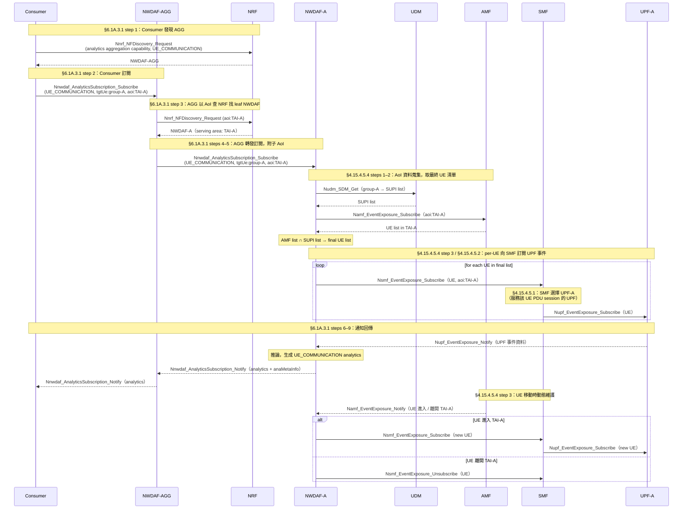

# AGG NWDAF 訂閱轉發：有 AoI Routing 規格分析（§6.1A.3.1）

**規格來源**：TS 23.288 §6.1A.3.1、§6.7.3.1；TS 23.502 §4.15.4.5.1、§4.15.4.5.4

---

## 背景與動機

### 目前的部署情境

目前環境中只有一個 NWDAF 實例，5G 網路有兩條流量 path，各由一個 UPF 負責，共用同一個 SMF。Consumer 直接對這個唯一的 NWDAF 訂閱兩次——每次針對一個 path 的 group（Internal Group ID）請求 `UE_COMMUNICATION` 分析。AnLF 推論與 MTLF 訓練管線都在這個 NWDAF 內部完成，Daisy FL 也只和這一個 NWDAF 互動。

```
Consumer ──→ NWDAF（唯一實例）
               └── SMF（單一，管理兩個 UPF）
                     ├── UPF-A（path-1）
                     └── UPF-B（path-2）  
```

### 想改造的目標情境

將 NWDAF 以分散式形式部署，讓兩個 leaf NWDAF 各自專責一條 path，由 AGG 統一對外服務 Consumer。本文件探討的拓撲是：**兩個 UPF 部署在不同的地理區域（不同 TAI），由同一個 SMF 管理**。TAI（Tracking Area Identity）是 5G 網路表示地理服務範圍的單位，NWDAF 在 NRF 登錄自己負責哪些 TAI。

```
Consumer ──→ NWDAF-AGG（對外門面）
               ├──→ NWDAF-A（專責 path-1 / UPF-A，serving area: TAI-A）
               └──→ NWDAF-B（專責 path-2 / UPF-B，serving area: TAI-B）

SMF（service area: TAI-A + TAI-B）
  ├── UPF-A（TAI-A，path-1）
  └── UPF-B（TAI-B，path-2）
```

單一 SMF 管理兩個 UPF、service area 跨兩個 TAI，是完全正常的多區域覆蓋部署。

這個架構同時服務兩個目的：

- **分攤運算資源**：資料蒐集、推論、模型訓練的工作量由各 leaf NWDAF 分擔，而非集中在單一實例。每個 leaf 只需處理自己 path 的資料量，有利於水平擴展。
- **為 FL 合規做準備**：各 leaf NWDAF 在資料層面天然隔離，符合 HFL 中每個 FL client 持有本地資料的前提。AGG 日後可作為 FL server 協調各 leaf 的訓練，同時各 leaf 各自負責監控自己 path 的 model accuracy，當效能下降時觸發 retrain 決策（MTLF）。

### 為什麼需要提前釐清規格

核心動機是為了在分散式部署下讓每個 path 的 NWDAF 各自握有自己 path 的資料，作為後續 FL 訓練的獨立資料節點，同時確保整體架構符合 3GPP 規格的精神，包括：

- **Model Provisioning**（TS 23.288 §6.1B）：跨 NWDAF 的 analytics context transfer
- **Accuracy Monitoring**：各 leaf 各自監控自己 path 的模型效能，效能下降時觸發 retrain
- **Subscription Cascade**：Consumer → AGG → leaf 的訂閱鏈，各層 `TargetUeInformation`、`Analytics Filter` 的傳遞語意

本文件的目的是釐清 AGG 在 Consumer **提供 AoI** 的情況下如何轉發訂閱，作為後續功能設計的基礎。

---

## 規格前提：UE_COMMUNICATION 支援 AoI

**TS 23.288 §6.7.3.1 原文：**

> The consumer of these analytics may indicate in the request:
> - `Analytics ID` = "UE Communication"
> - `Analytics Filter Information` optionally including: `S-NSSAI`; `DNN`; `Application ID`; **`Area of Interest`**.

AoI 是 `UE_COMMUNICATION` 的**選填**參數。Consumer 可以帶、也可以不帶。

TS 23.288 §6.1A 依 Consumer 是否提供 AoI，分成兩條平行程序：

| Consumer request | AGG 走的程序 |
|-----------------|-------------|
| **有 AoI** | **§6.1A.3.1**（本文件） |
| 無 AoI | §6.1A.3.2（見 [agg_routing_without_aoi.md](agg_routing_without_aoi.md)） |

---

## AGG 的核心任務

Consumer 送來：

```
POST /nwdaf-eventssubscription/v1/subscriptions
{
  event: UE_COMMUNICATION,
  tgtUe: { intGroupIds: ["group-A"] },
  analyticsFilter: { aoi: TAI-A },
  notificationURI: "http://consumer/cb"
}
```

AGG 要做的事：**用 Consumer 提供的 AoI（TAI-A）直接找到對應的 leaf NWDAF，把訂閱轉發過去。**

---

## 前提確認：AoI 可直接用於 Routing

§6.1A.3.1 的標題是「Procedure for analytics aggregation **with Provision of Area of Interest**」，適用條件是 Consumer 有提供 AoI。在這條程序下，AGG **不需要**推導 NF serving area，直接用 AoI 查 NRF 即可。

這和無 AoI 時（§6.1A.3.2 step 3b）需要透過 group → SUPI → SMF → TAI 推導鏈的做法完全不同。

---

## 推導 Leaf NWDAF：AoI → NWDAF

Consumer 已提供 AoI = TAI-A，AGG 直接查 NRF：

```
AoI = TAI-A
  │
  ▼ [Nnrf_NFDiscovery，用 TAI-A 過濾找 leaf NWDAF]  ← TS 23.288 §6.1A.3.1 step 3
  NWDAF-A（serving area 涵蓋 TAI-A 的 NWDAF）
```

**TS 23.288 §6.1A.3.1 step 3 原文：**

> "Aggregator NWDAF determines the other NWDAF instances that **collectively can cover the area of interest** indicated in the request (e.g. TAI-1, TAI-2, TAI-n)."

整條 group → SUPI → SMF → TAI 的推導鏈完全省略。**AGG 不需要接觸任何 NF 的 profile，直接用 AoI 查 NRF。**

---

## 轉發目標數量：單一 NWDAF vs 多個 NWDAF

若 Consumer 的 AoI 跨越多個 leaf NWDAF 的服務範圍（如 AoI = {TAI-A, TAI-B}），會有兩種情形：

### 情形 A：AoI 只對應一個 NWDAF

**→ TS 23.288 §6.1A.3.2 step 5a：single-target redirect**

AGG 把訂閱轉發給 NWDAF-A，收到通知後直接轉給 Consumer。AGG 退化成 proxy。

### 情形 B：AoI 跨越多個 NWDAF 的服務範圍

**→ TS 23.288 §6.1A.3.2 step 5b → §6.1A.3.1 steps 4–9**

AGG 將 AoI 切分為子 AoI，分別轉發給各 leaf NWDAF，等各 leaf 回傳後聚合再通知 Consumer。

**TS 23.288 §6.1A.2 原文：**

> "Is able to divide the area of interest, if received from the consumer, into **sub area of interest** based on the serving area of each NWDAF to be requested for analytics."

---

## 轉發訂閱的 Target 設計

AGG 向 leaf NWDAF 轉發時，`tgtUe` 可帶：

**做法 A：帶原始 group ID**
```json
{ "tgtUe": { "intGroupIds": ["group-A"] }, "analyticsFilter": { "aoi": TAI-A } }
```

**做法 B：帶 SUPI 子集（若 AGG 已有對應資訊）**
```json
{ "tgtUe": { "supis": ["supi-1", "supi-2"] }, "analyticsFilter": { "aoi": TAI-A } }
```

`TargetUeInformation` schema 同時支援 `supis` 和 `intGroupIds`，兩種做法在 API 層面都合法。子 AoI 一併附在轉發的訂閱中。

---

## Leaf NWDAF 的資料蒐集

Leaf NWDAF 收到含 AoI 的訂閱後，需要蒐集特定地理範圍（TAI-A）內 UE 的 UPF 資料。規格在 **TS 23.502 §4.15.4.5.4** 為此定義了 AoI 專屬的訂閱程序：

**步驟一：向 AMF 取得 AoI 內的 UE list**

> "The UPF event consumer (e.g. NWDAF) determines the AMF(s) based on the `AOI`, i.e. TAIs and possibly on the target `S-NSSAI` and obtains the UE list which includes the UE(s) located in the `AoI` from AMF(s) by invoking `Namf_EventExposure_Subscribe` service operation to get the presence of UE(s) and moving in or out status in `Area of Interest`."

**步驟二：計算最終 UE 清單**

> "The UPF event consumer (e.g. NWDAF) locally computes the final UE list by comparing the UE list from AMF(s) and its own target UE list if it exists."

Leaf NWDAF 將 AMF 回傳的 UE list 與自己的 target UE list（group-A 的 SUPI list）取交集。

**步驟三：per-UE 向 SMF 訂閱 UPF 事件，並動態維護**

> "For each UE in the final UE list, the UPF event consumer (e.g. NWDAF) issues a subscription to UPF event exposure service via the SMF serving the UE (`Nsmf_EventExposure Subscription`) to get UPF data as described in clause 4.15.4.5.2. When an AMF reports a change of the list of UE(s) in the `AoI` (`Namf_EventExposure_Notify`), the UPF event consumer (e.g. NWDAF) may need to cancel the `Nsmf_EventExposure Subscription` or to issue a new `Nsmf_EventExposure Subscription`."

**AoI 在 SMF 這一層的行為（TS 23.502 §4.15.4.5.1）：**

> "If a consumer subscribes to an UPF event via the SMF including an `AoI`, the SMF **starts** the subscription to the UPF only when the UE is located in the requested `AoI`. When the UE **leaves** the `AoI`, the SMF **stops** the subscription on the UPF."

`AoI` 只能送給 SMF，不能直接送到 UPF（Table 4.15.4.5.1-1：AOI → SMF: Y，UPF: N）。SMF 作為 AoI 的守門員，根據 UE 的實際位置動態開關 UPF 訂閱。NWDAF-A 與 NWDAF-B 可以向同一個 SMF 分別帶 `AoI=TAI-A` 和 `AoI=TAI-B` 訂閱，SMF 自動確保兩個 Leaf 只收到各自 TAI 的 UPF 資料。

> **Note：Group ID 與 AMF/SMF 直接訂閱**
> TS 23.288 §6.2.2.1 說明 NWDAF 可以「直接以 group ID 為 target 訂閱所有 AMF/SMF 實例」，這條路適用於 AMF/SMF 事件的一般訂閱，**不是** via SMF 訂閱 UPF 事件的路徑。via SMF 訂閱 UPF 仍必須 per-SUPI（TS 23.502 §4.15.4.5.2）。

---

## 通知 Relay 與聚合

AGG 向各 leaf 訂閱時將自己的 callback endpoint 填入 `notificationURI`，並記錄 leaf sub ID → consumer sub ID 的對應關係。

- **情形 A（single-target）**：leaf 通知 AGG，AGG 直接轉給 Consumer。
- **情形 B（multi-target）**：每個 leaf 回傳的 `EventNotification` 包含 `anaMetaInfo`（numSamples、dataWindow、accuracy 等），AGG 依此合併成完整分析再通知 Consumer。

`anaMetaInfo` 欄位（定義於 TS 23.288 §6.1.3）的存在目的正是讓 AGG 能夠做**有意義的合併**，而不是盲目相加。

---

## 完整流程概覽

```
Consumer
  │  POST /subscriptions
  │  { event: UE_COMMUNICATION, tgtUe: {intGroupIds:[group-A]}, aoi: TAI-A }
  ▼
NWDAF-AGG
  │
  ├─[NWDAF 發現] AoI(TAI-A) → Nnrf_NFDiscovery → NWDAF-A
  │
  ├─[轉發判斷] 情形 A 或 B
  │
  │ ┌─[情形 A: single NWDAF]──────────────────────────────────────┐
  │ │  POST /subscriptions → NWDAF-A                             │
  │ │  { tgtUe: {supis:[supi-1,supi-2]}, aoi: TAI-A,             │
  │ │    notifUri: agg-cb }                                      │
  │ │        ↓                                                   │
  │ │  NWDAF-A → POST agg-cb { EventNotification }               │
  │ │        ↓                                                   │
  │ │  AGG → POST consumer-cb（直接轉發）                          │
  │ └────────────────────────────────────────────────────────────┘
  │
  │ ┌─[情形 B: multi NWDAF, aoi spans TAI-A+TAI-B]───────────────┐
  │ │  POST /subscriptions → NWDAF-A { aoi: TAI-A }             │
  │ │  POST /subscriptions → NWDAF-B { aoi: TAI-B }             │
  │ │        ↓ ↓ (各自回傳)                                      │
  │ │  AGG 合併 anaMetaInfo + 聚合分析結果                        │
  │ │        ↓                                                  │
  │ │  AGG → POST consumer-cb（聚合後結果）                       │
  │ └───────────────────────────────────────────────────────────┘
  ▼
Consumer
```

---

## E2E 完整序列圖

以下為單一 leaf NWDAF 情形（情形 A）的完整 e2e 流程，涵蓋從 Consumer 訂閱到 UPF 資料回傳及動態維護的所有環節。



---

## 與 §6.1A.3.2（無 AoI）方案的比較

| | 無 AoI（§6.1A.3.2） | **有 AoI（§6.1A.3.1，本文）** |
|---|---|---|
| Consumer 提供 | group ID | group ID + AoI（TAI） |
| AGG routing 依據 | NF serving area（需推導） | Consumer 提供的 AoI（直接查 NRF） |
| NF 查詢推導鏈 | 需要（group → SUPI → SMF → TAI） | 不需要 |
| SMF 拓撲要求 | 各 path 需有獨立 TAI 或獨立 SMF | 只要 UPF 在不同 TAI，SMF 數量無限制 |
| Consumer 負擔 | 低（只給 group ID） | 需要知道各 path 對應的 TAI |

---

## 規格原始程序對照（TS 23.288 §6.1A.3.1）

| Step | 規格描述摘要 | 本文對應段落 |
|------|-------------|-------------|
| 1 | Consumer 做 NWDAF discovery，選擇具備 aggregation capability 的 NWDAF（AGG） | — （Consumer 側行為，本文不展開） |
| 2 | Consumer 向 AGG 送出 subscription，帶 Analytics ID、AoI、Target of Analytics Reporting | AGG 的核心任務 |
| 3 | AGG 查 NRF，找到 serving area 涵蓋 AoI 的所有 NWDAF 實例 | 推導 Leaf NWDAF：AoI → NWDAF |
| 4–5 | AGG 向各目標 NWDAF 發出訂閱，附帶子 AoI | 轉發訂閱的 Target 設計 |
| 6–7 | 各目標 NWDAF 回傳分析結果（含 `anaMetaInfo`） | 通知 Relay 與聚合 |
| 8 | AGG 將各 NWDAF 的結果聚合為單一輸出 | 通知 Relay 與聚合 |
| 9 | AGG 將聚合結果通知 Consumer | 通知 Relay 與聚合 |

---

## 規格章節對應速查

| 流程步驟 | 規格章節 |
|----------|---------|
| `UE_COMMUNICATION` 支援 AoI（選填） | TS 23.288 §6.7.3.1 |
| Consumer 帶 AoI → AGG 走 §6.1A.3.1 | TS 23.288 §6.1A.3.1（標題前提） |
| AoI → leaf NWDAF NRF 查詢 | TS 23.288 §6.1A.3.1 step 3 |
| AGG 將 AoI 切分為子 AoI | TS 23.288 §6.1A.2 |
| Single-target redirect（情形 A） | TS 23.288 §6.1A.3.2 step 5a |
| Multi-target 聚合（情形 B） | TS 23.288 §6.1A.3.2 step 5b → §6.1A.3.1 steps 4–9 |
| Leaf AoI 訂閱程序（AMF 取 UE list → per-UE SMF 訂閱） | TS 23.502 §4.15.4.5.4 |
| Leaf per-SUPI SMF 訂閱（via SMF 到 UPF） | TS 23.502 §4.15.4.5.2 |
| AoI 在 SMF 的守門行為（動態開關 UPF 訂閱） | TS 23.502 §4.15.4.5.1 |
| `anaMetaInfo` 欄位（聚合用 metadata） | TS 23.288 §6.1.3；TS 23.288 §6.1A.3.1 step 4–5 |

---

## 待討論

**Consumer 需要知道 TAI**：Consumer 必須在訂閱時明確帶入 AoI（TAI-A 或 TAI-B），代表 Consumer 需要事先知道各 path 對應的地理範圍。這提高了 Consumer 的使用門檻，但換來了 AGG 端更簡潔的 routing 邏輯，以及不需要複雜 NF 推導鏈的優點。

另一個角度來看，若 Consumer 本來就清楚自己想監控哪個地理區域（例如某條固定的服務 path 就是在特定 TAI 上），要求 Consumer 帶 AoI 反而是合理的——Consumer 本來就知道自己關心什麼，由它來指定比 AGG 被動推導更直觀。

若 Consumer 不想關心底層 path-TAI 對應，應使用 §6.1A.3.2 的無 AoI 方案，由 AGG 自行推導。
