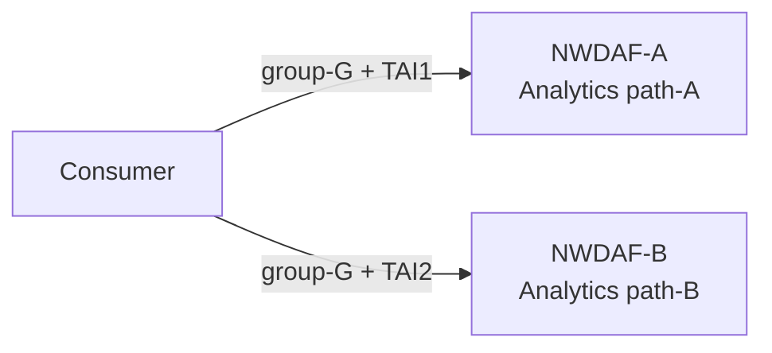
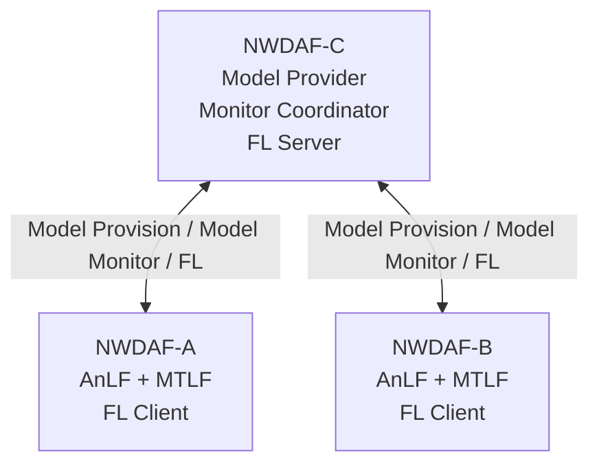
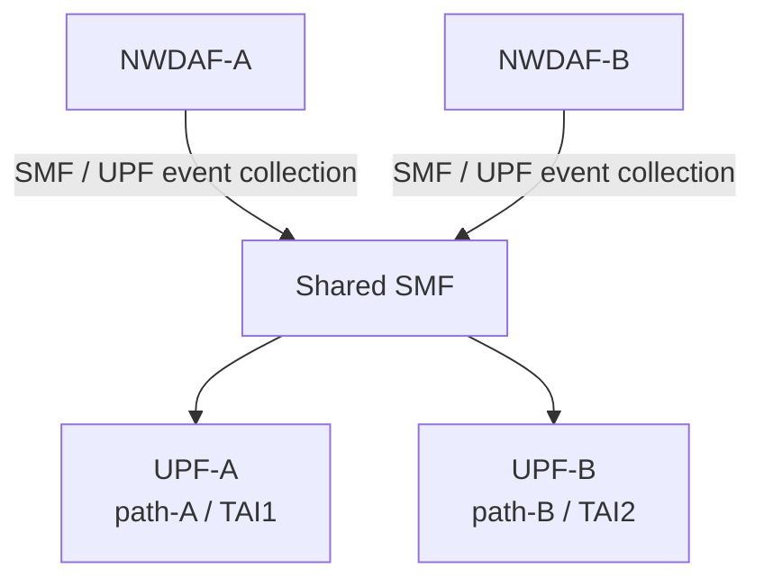
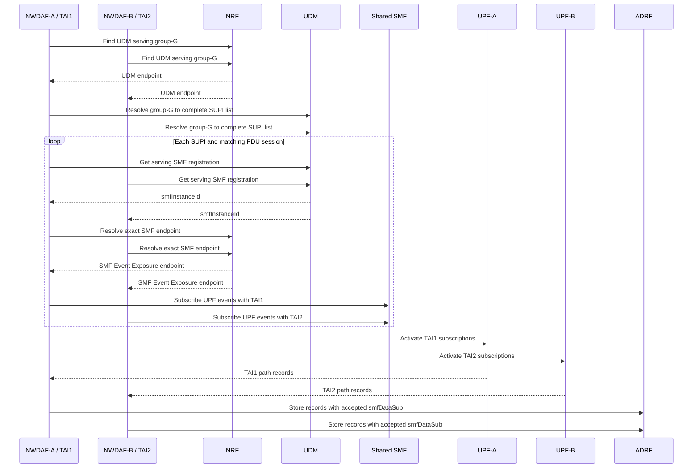
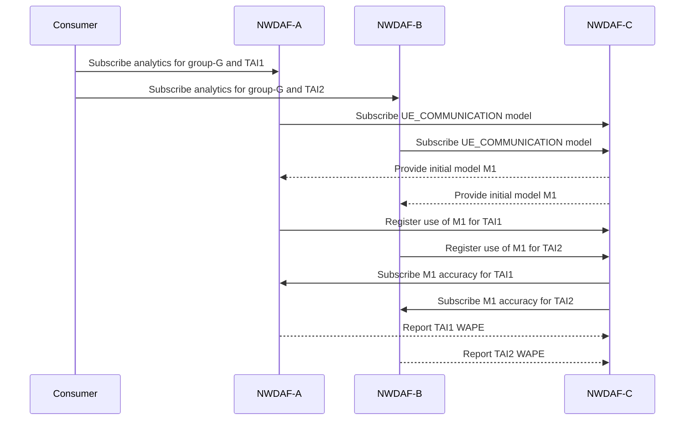
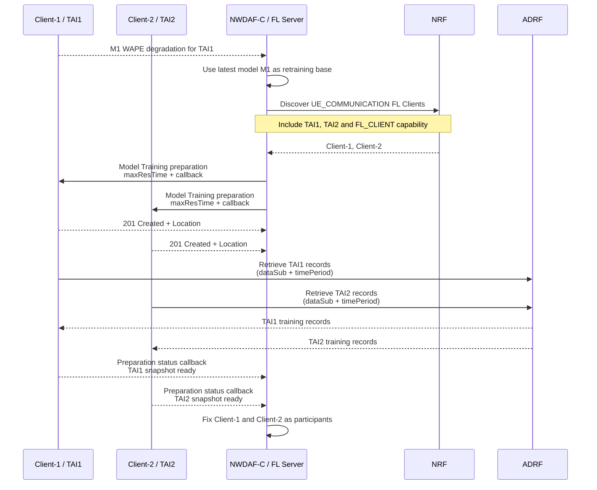
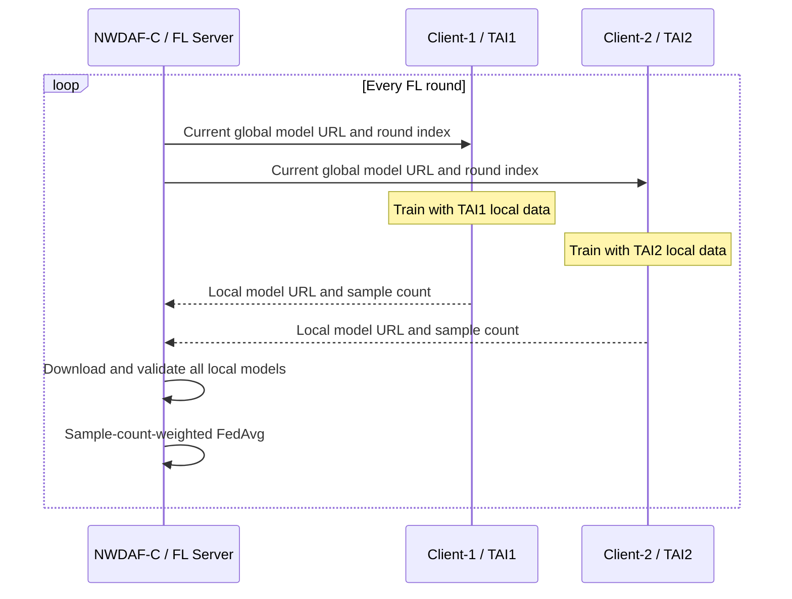
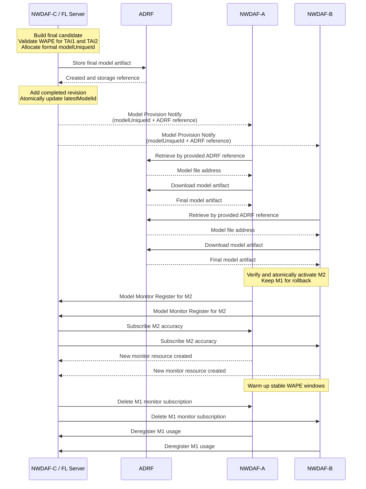
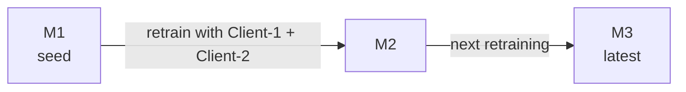

# 分散式 NWDAF 模型監控與聯邦再訓練

這份筆記用於會議中快速說明目前的設計。內容依序呈現 group 與 TAI
資料分流、正常分析、模型監控、退化觸發、FL Client 發現、聯邦訓練及
新模型發布。

---

## 1. 整體情境

Consumer 分別向兩個 Analytics NWDAFs 建立訂閱：



NWDAF-C 負責模型提供、accuracy monitoring 協調與 FL Server：



NWDAF-A、B 經同一個 SMF 蒐集不同 path 的 UPF data：



- Consumer 分別向 A、B 訂閱 analytics，不經過 C。
- A、B 負責資料蒐集、推論與本地訓練。
- C 負責模型提供、模型表現監控與 FL aggregation。
- C 不接收或聚合 A、B 的 analytics 結果。

---

## 2. Group 與 TAI 資料分流



- A、B 取得的是同一份完整 group-G membership，不是各自維護一半
  SUPIs。
- UDM 告知每個 SUPI／PDU session 由哪個 SMF instance 服務；不能把每個
  SUPI 向所有 SMFs 都訂閱。
- A、B 對同一個 SMF 分別帶 TAI1、TAI2；SMF 依 UE 是否位於該 AoI
  啟停下游 UPF subscription，因此資料自然分成兩條 path。
- SMF 接受的 subscription 會隨 raw records 存入 ADRF。之後 FL Client
  以這份 `smfDataSub + timePeriod` 取回自己的訓練資料。
- UDM 尚未導入實驗環境時，可暫時使用完整 group fixture 與固定 SMF
  endpoint；TAI 分流仍不能靠不同的 partial group fixtures 模擬。

---

## 3. 初始模型與 Accuracy Monitoring



- A、B 使用同一模型，但依 TAI 建立不同的 monitoring scopes。
- AnLF 累積足夠且穩定的 prediction window 後才回報 WAPE。
- C 分別保存 TAI1、TAI2 的線上表現。
- 任一 scope 表現下降，都可以觸發 retraining。

---

## 4. Degradation Trigger 與 FL Client 發現



- Model Monitor 決定何時 retrain；本次 base model 固定使用 C 的 latest。
- NRF 可依 Analytics ID、TAI、interoperability 與 `FL_CLIENT` capability
  找到候選者。
- NRF 宣告的是能力；Client 是否真的有足夠資料，仍由 preparation 中的
  ADRF retrieval 與 snapshot validation 確認。
- `201` 只建立 preparation resource；Client 在背景準備 snapshot，再以
  callback 回報完成。無法在 `maxResTime` 內完成時，Client 可先回 delay，
  由 C 決定是否 PATCH 新期限。
- 目前主要實驗固定使用 Client-1 與 Client-2，分別對應 TAI1、TAI2
  兩條 path。
- Participant set 在本次 FL process 啟動後保持固定，不在 round 中途增減。

---

## 5. FL Training 與 FedAvg



- 所有 Clients 使用 C 提供的同一個 global model。
- 本情境假設 ADRF 永遠存在；各 Client 在 preparation 期間以自己的
  `dataSub + timePeriod` 取得資料並固定一份 process dataset snapshot，
  snapshot ready 後以 callback 回報可參與，不使用 MongoDB fallback。
- 同一份 snapshot 在所有 rounds 重複使用，不會每輪重新向 ADRF取資料。
- Clients 只回傳 local model，不向 C 傳送 raw training data。
- FedAvg 權重使用各 Client 實際使用的 training sample count。
- 每一 round 必須收到所有 selected Clients 的有效結果。
- Local model 與 interim global model 使用暫存 URL，不經 ADRF。
- FL 暫存模型沒有正式 `modelUniqueId`。

---

## 6. Final Model 驗證與發布



- Final candidate 可對每個 participating scope 分別計算 WAPE，但最後只做
  一次 global promotion decision；不讓不同 TAI 選擇不同版本。
- 正式模型會取得 `modelUniqueId`；round 暫存模型不會。
- Model description 保存各 TAI 的 WAPE、evaluation sample count 與資料區段。
- ADRF 保存 final model artifact，但不決定模型版本或 latest。
- PyMTLF 保存 completed revisions 與單一 `latestModelId`。新模型通過
  global promotion 並存入 ADRF 後，才原子更新 latest，再沿用 Model
  Provision subscription 向 A、B 提供同一版本。通知傳遞
  `modelUniqueId` 與 ADRF reference，不直接夾帶模型 binary。
- A、B 根據通知向 ADRF 查詢模型檔案位置並下載；驗證及啟用成功後，再向
  C 註冊新模型的 Model Monitor 能力。
- 切換採 new-before-old：M2 artifact 或新監控建立失敗時，A、B 保持 M1
  與原監控；只有 M2 registration 和 monitor subscription 都成功後，才
  刪除 M1 monitor 並 deregister M1 usage。
- M2 monitor 在累積足夠 prediction／ground-truth window 前不回報 WAPE。
  遲到的 M1 notification 只歸入舊歷史，不得影響 M2。
- M1 仍保留在 C 的 completed revisions 與 ADRF，作為歷史比較及
  rollback candidate；停止監控不代表立即刪除模型。

---

## 7. 線性模型版本

第一階段只管理一個相容的 `UE_COMMUNICATION` model family：



```text
completed = [M1, M2, M3]
latestModelId = M3
Model Provision output = M3
```

- 任一 TAI degradation 都以前一個 latest model 作為共同 base。
- A、B 的 WAPE 分開保存，但不因此選用不同模型。
- Final candidate 仍可保存各 TAI validation WAPE，僅供實驗觀察與一次
  global promotion decision。
- Global promotion 可設定為技術檢查通過就發布，或 aggregate validation
  不佳時拒絕；兩種模式都只產生一個全域結果。
- Promotion 及 ADRF storage 成功後才更新 `latestModelId`；A、B 隨後都
  切換到相同新版本。
- M1、M2 可保留作歷史或 rollback，但一般 Model Provision 不提供舊版。
- 暫不支援 model tree、TAI-specific branches、Scope Assignments 或候選
  模型排名。
- 未來增加 Client-3／TAI3 時，它可加入下一次 FL 並提供更多資料，但結果
  仍只是 `M3 -> M4`，不建立另一條模型分支。

---

## 第一版範圍

- 同步、sample-count-weighted FedAvg。
- FL process 啟動後固定 participant set。
- 所有 selected Clients 成功才進行 aggregation。
- ADRF 永遠存在；每個 Client 在 preparation 期間從 ADRF 取得符合自身
  scope 的 training records，建立一次固定 dataset snapshot 後供所有
  rounds 使用。
- 在 model artifact 方面，訓練期間使用暫存 URL，只有 final model 保存
  至 ADRF。
- 只維護單一 `UE_COMMUNICATION` model family、線性 completed revisions
  與一個 `latestModelId`；A、B 對外取得同一最新版本。
- 暫不支援 partial aggregation、client replacement、asynchronous FL 或
  secure aggregation。
