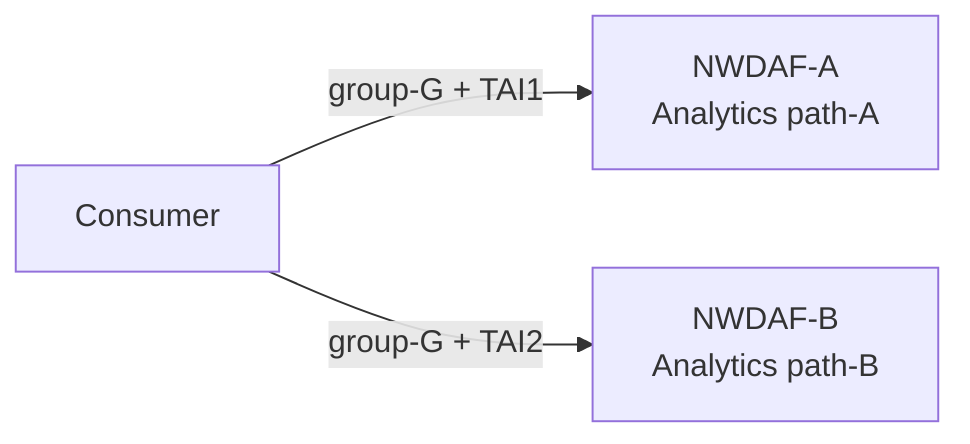
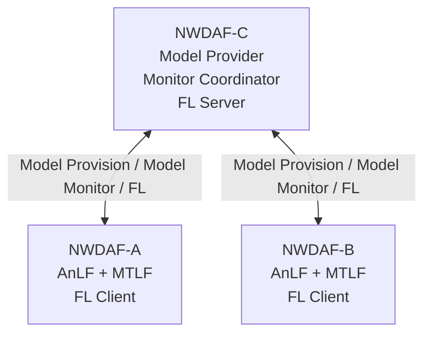
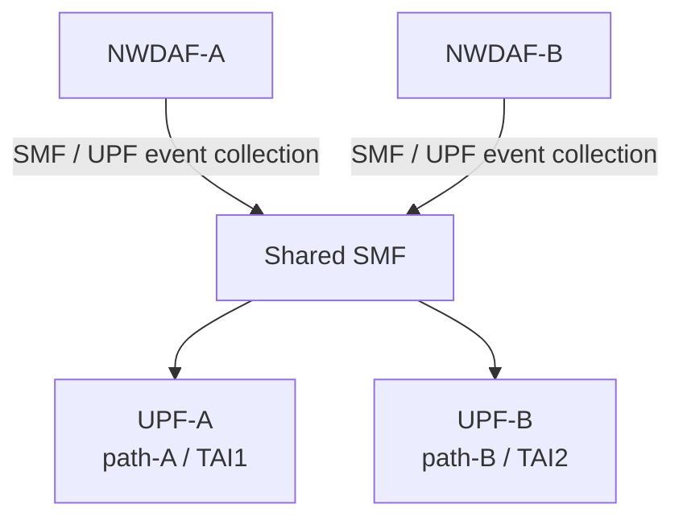
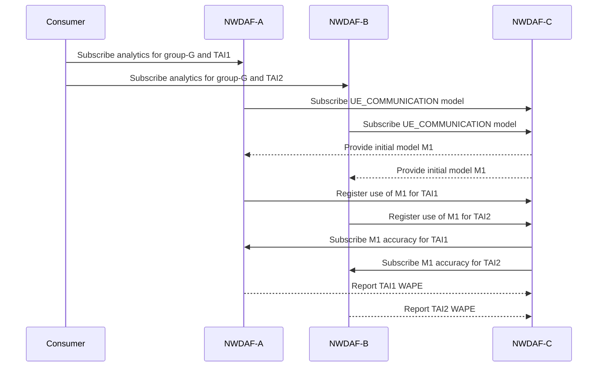
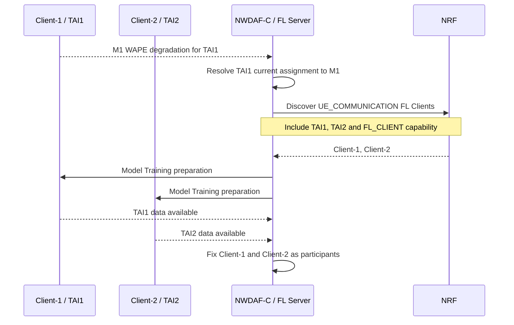
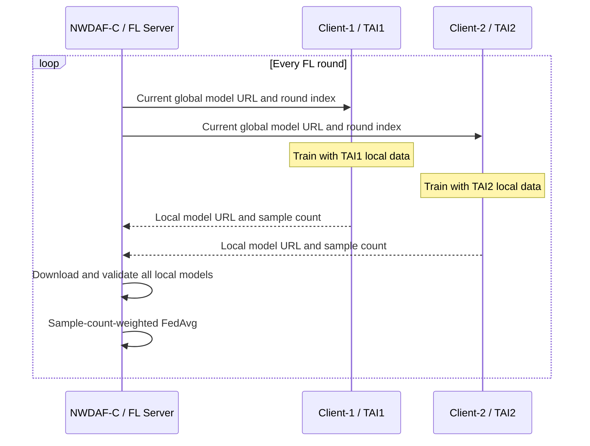
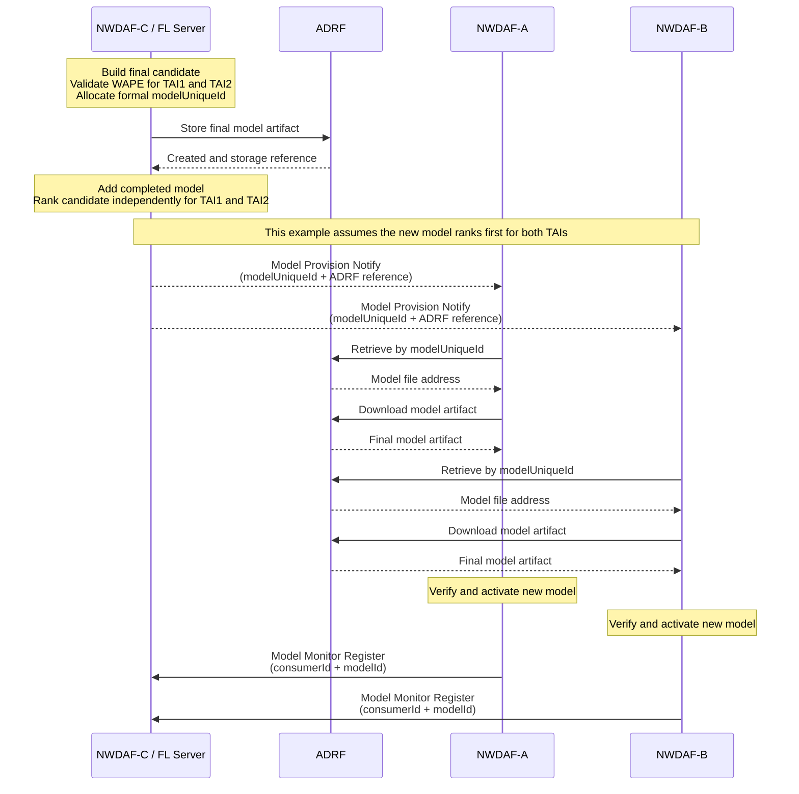
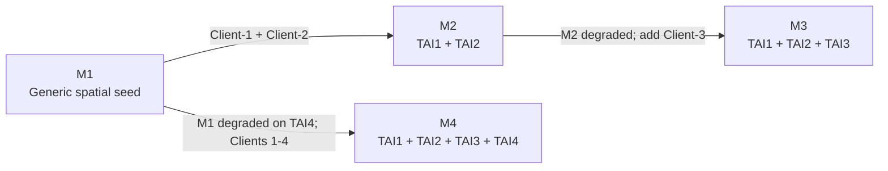

# 分散式 NWDAF 模型監控與聯邦再訓練

這份筆記用於會議中快速說明目前的設計。內容依序呈現正常分析、模型監控、
退化觸發、FL Client 發現、聯邦訓練及新模型發布。

---

## 1. 整體情境

Consumer 分別向兩個 Analytics NWDAFs 建立訂閱：



NWDAF-C 負責模型提供、accuracy monitoring 協調與 FL Server：



NWDAF-A、B 經同一個 SMF 蒐集不同 path 的 UPF data：



- Consumer 分別向 A、B 訂閱 analytics，不經過 C。
- A、B 負責資料蒐集、推論與本地訓練。
- C 負責模型提供、模型表現監控與 FL aggregation。
- C 不接收或聚合 A、B 的 analytics 結果。

---

## 2. 初始模型與 Accuracy Monitoring



- A、B 使用同一模型，但依 TAI 建立不同的 monitoring scopes。
- AnLF 累積足夠且穩定的 prediction window 後才回報 WAPE。
- C 分別保存 TAI1、TAI2 的線上表現。
- 任一 scope 表現下降，都可以觸發 retraining。

---

## 3. Degradation Trigger 與 FL Client 發現



- Model Monitor 決定何時 retrain，以及本次使用哪個 base model。
- NRF 可依 Analytics ID、TAI、interoperability 與 `FL_CLIENT` capability
  找到候選者。
- NRF 宣告的是能力；Client 是否真的有足夠資料，仍由 preparation 確認。
- 目前主要實驗固定使用 Client-1 與 Client-2，分別對應 TAI1、TAI2
  兩條 path。
- Participant set 在本次 FL process 啟動後保持固定，不在 round 中途增減。

---

## 4. FL Training 與 FedAvg



- 所有 Clients 使用 C 提供的同一個 global model。
- Clients 只回傳 local model，不向 C 傳送 raw training data。
- FedAvg 權重使用各 Client 實際使用的 training sample count。
- 每一 round 必須收到所有 selected Clients 的有效結果。
- Local model 與 interim global model 使用暫存 URL，不經 ADRF。
- FL 暫存模型沒有正式 `modelUniqueId`。

---

## 5. Final Model 驗證與發布



- Final candidate 對每個 participating scope 分別驗證；某個 TAI 未通過
  不影響其他已通過 TAI 使用該模型。
- 正式模型會取得 `modelUniqueId`；round 暫存模型不會。
- Model description 保存各 TAI 的 WAPE、evaluation sample count 與資料區段。
- ADRF 保存 final model artifact，但不決定模型選擇或 active assignment。
- PyMTLF 依各 scope 的 validation evidence 更新模型優先集；只有新模型
  成為該 scope 首選時，才沿用 Model Provision subscription 通知相關
  NWDAF。通知傳遞 `modelUniqueId` 與 ADRF reference，不直接夾帶模型
  binary。
- A、B 根據通知向 ADRF 查詢模型檔案位置並下載；驗證及啟用成功後，再向
  C 註冊新模型的 Model Monitor 能力。

---

## 6. 模型演進與未來擴充範例

目前主要實驗只使用 Client-1、Client-2 與 TAI1、TAI2。以下加入
Client-3、Client-4，是用來說明未來增加 NWDAF／path 時，模型管理可以
如何延伸；不是目前第一版實驗必須完成的拓撲。

每個 FL Client 提供自己可取得的 spatial training data：

| FL Client | Training data |
| --- | --- |
| Client-1 | TAI1 |
| Client-2 | TAI2 |
| Client-3 | TAI3 |
| Client-4 | TAI4 |



模型發展順序：

1. M1 是尚未針對特定 TAI 專門化的 seed model。
2. Client-1 或 Client-2 的 M1 表現下降後，使用 TAI1、TAI2 資料訓練 M2。
3. Client-1 或 Client-2 的 M2 表現下降後，NRF 額外發現能提供 TAI3
   training data 的 Client-3，三者共同訓練 M3。
4. Client-4 使用 M1 服務 TAI4，並由 TAI4 degradation 觸發另一次訓練；
   Client-1 至 Client-4 共同以 M1 為 base，產生 M4。

模型血緣與實際模型指派是兩件事：

```text
Model lineage:
  M1
  +-- M2
  |   `-- M3
  `-- M4

Scope model priorities after M4 validation (example):
  TAI1: M3 > M4 > M2 > M1
  TAI2: M4 > M3 > M2 > M1
  TAI3: M3 > M4 > M1
  TAI4: M4 > M1
  other compatible AoI -> M1
```

- 模型血緣表示模型從哪個 base model 訓練而來。
- 每個 scope 依自己的 validation 結果維護候選模型優先集，第一順位才是
  Model Provision 實際提供的模型；不同 TAI 不必同時切換到最新模型。
- 本例的 Analytics ID、`tgtUe`、S-NSSAI、DNN、Application ID 與
  interoperability requirements 相同，只有 AoI／TAI 不同。
- 多個模型都適用時，使用該 TAI 的 validation summary 排序；圖中的順序
  只是一個可能結果，不代表 M3 或 M4 固定具有較高優先級。

---

## 第一版範圍

- 同步、sample-count-weighted FedAvg。
- FL process 啟動後固定 participant set。
- 所有 selected Clients 成功才進行 aggregation。
- 訓練期間使用暫存 URL，只有 final model 保存至 ADRF。
- 暫不支援 partial aggregation、client replacement、asynchronous FL 或
  secure aggregation。
