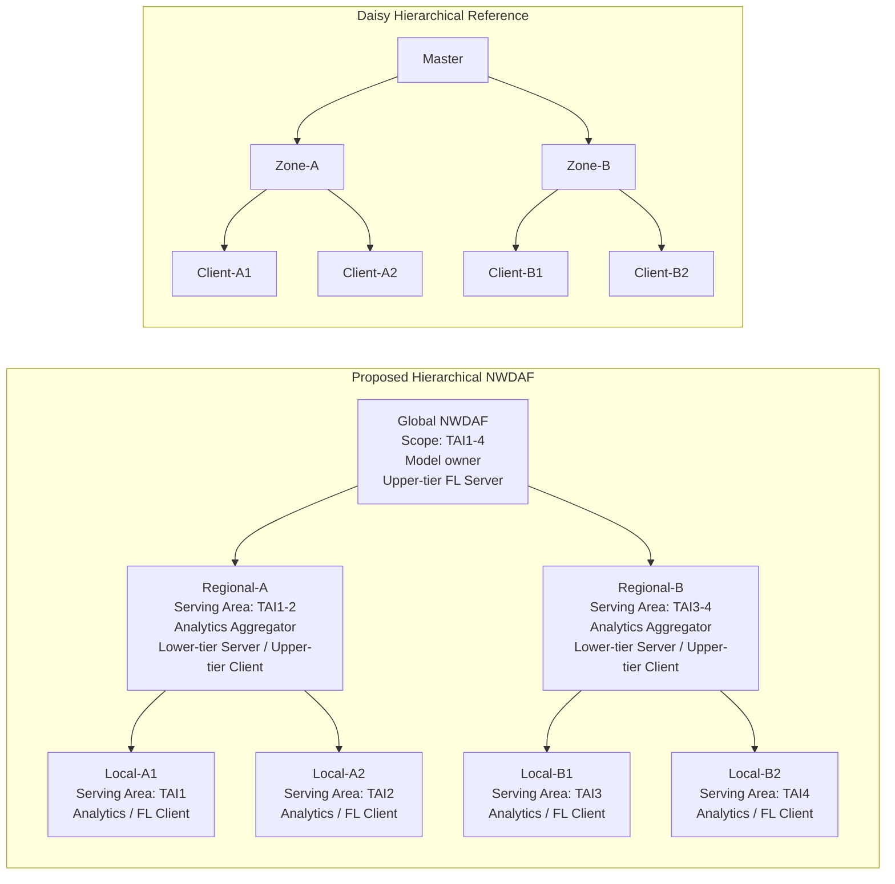
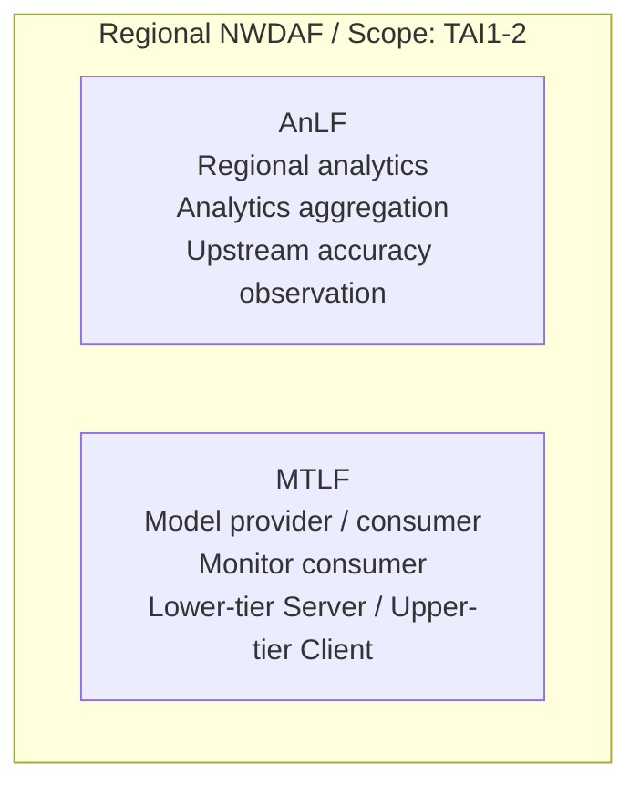
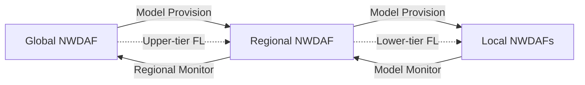
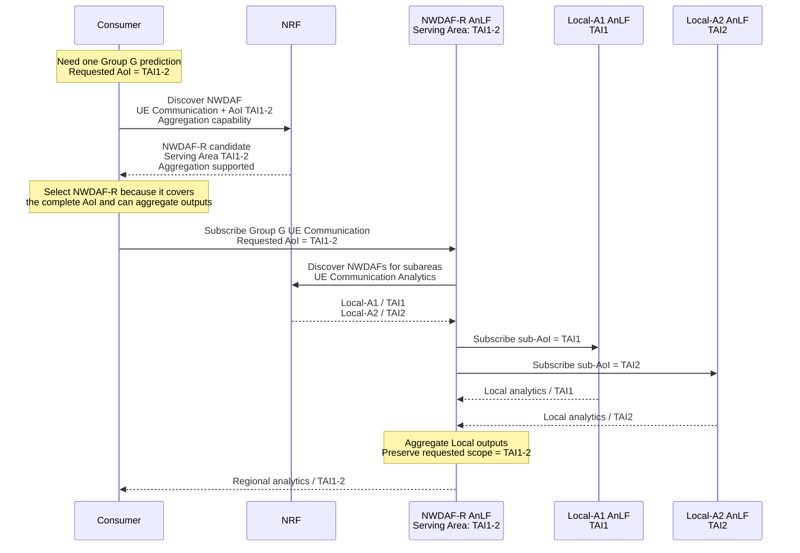
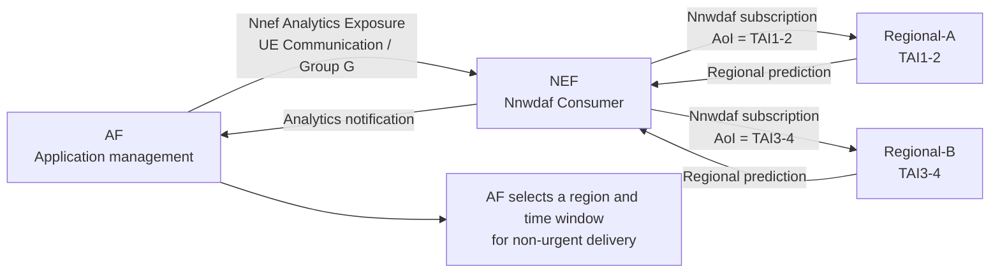
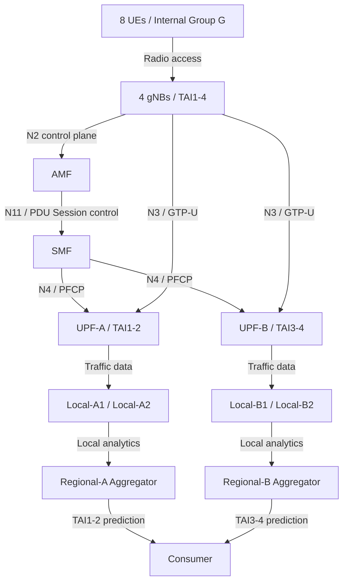
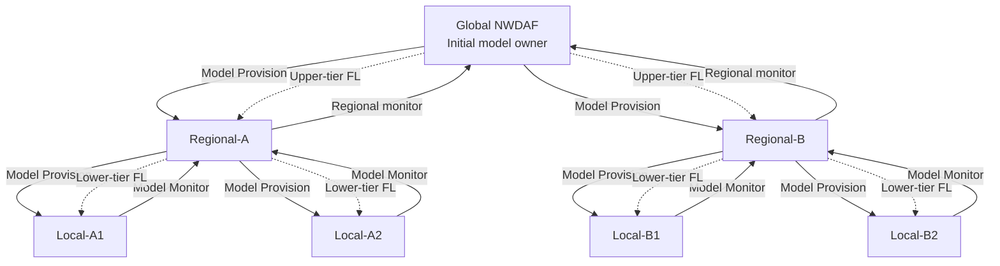
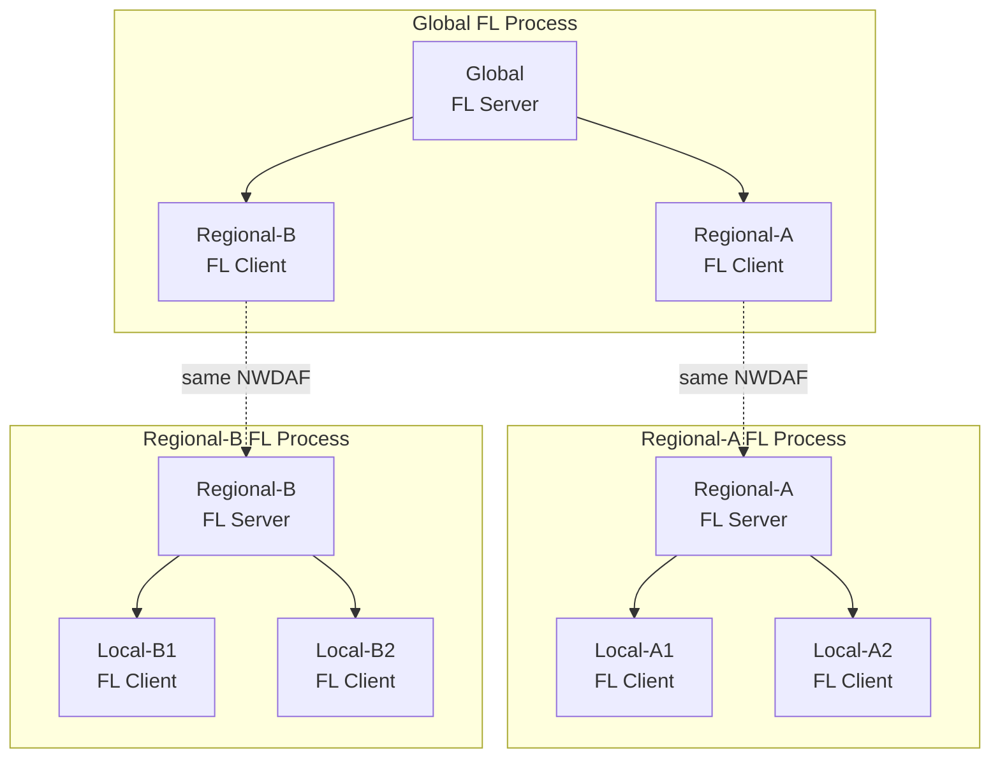

# Hierarchical NWDAF Federated Learning 會議導覽

> **核心構想**
>
> 以Regional NWDAF承接一個region內的analytics aggregation、model lifecycle與
> lower-tier FL coordination，再由Global NWDAF整合各Regional results，形成
> Global–Regional–Local hierarchical FL。

---

## 1. 想建立的階層架構

### 先定義區域與TAI關係

```text
Global scope: TAI1-4

Regional-A: TAI1-2
  ├─ Local-A1: TAI1
  └─ Local-A2: TAI2

Regional-B: TAI3-4
  ├─ Local-B1: TAI3
  └─ Local-B2: TAI4
```

- 每個TAI配置一個gNB、兩個UE與一個Local NWDAF。
- Regional-A的serving area涵蓋TAI1–2；Regional-B涵蓋TAI3–4。
- Global的model lifecycle與upper-tier FL scope涵蓋TAI1–4。
- 因此Global／Regional／Local的階層，首先反映的是不同大小的區域scope，之後才
  在這個關係上串接analytics、model與FL responsibilities。

### Proposed NWDAF topology與Daisy reference



| Daisy概念 | NWDAF情境 | 共同的FL責任 |
| --- | --- | --- |
| Master | Global NWDAF | 協調upper-tier rounds，聚合各region results |
| Zone | Regional NWDAF | 協調Local training，形成一份regional result |
| Client | Local NWDAF | 使用local dataset進行training與evaluation |

- Global、Regional與Local不是三種不同的NF。
- 它們都是NWDAF，只是根據部署範圍、能力與所在FL process扮演不同角色。
- Regional對下是FL Server，對上是FL Client。
- Daisy映射只用來理解**階層式協調與聚合責任**，不代表兩者具有相同的
  networking、discovery或identity語意。

### 3GPP允許的基礎

TS 23.288 §5：

> “The NWDAF architecture allows for arranging multiple NWDAF instances in a
> hierarchy/tree with a flexible number of layers/branches.”

TS 23.288 §5.2 NOTE 5：

> “An NWDAF containing MTLF may indicate to support both FL server and FL client
> in the FL capability for specific Analytics ID.”

因此：

- 多層NWDAF deployment是標準允許的架構。
- Regional同時具備FL Server與FL Client能力也是標準允許的角色組合。
- 但如何把多個flat FL processes串成hierarchical FL，仍是本情境需要設計的部分。

---

## 2. Regional是一個部署位置，不是單一功能

`Regional`描述這個NWDAF在deployment topology中的相對位置與scope，不等於
`Analytics Aggregator`，也不代表一種新的NF type。同一個Regional NWDAF可以
同時包含AnLF與MTLF，兩者負責的service relationship必須分開理解。



### 2.1 AnLF與MTLF各自做什麼？

| Logical function | 在Regional中的責任 |
| --- | --- |
| AnLF | 向Local取得analytics、產生regional analytics，以及對Global提供regional accuracy observation |
| MTLF | 向Global取得model、向Local提供model、接收Local monitor，並協調lower-tier FL |

- **Analytics Aggregation**是Regional內AnLF的工作。
- **Model Training與FL Server／Client**是Regional內MTLF的工作。
- **Model Provision**連接model consumer與provider：Regional向上取得model，同時
  對下供應model。
- **Model Monitor**連接使用model的AnLF與負責model的MTLF：Local向Regional
  回報，Regional再向Global提供regional observation。

### 2.2 Provision、Monitor與Training的相對關係



| Lifecycle | 第一段關係 | 第二段關係 |
| --- | --- | --- |
| Model Provision | Regional AnLF向Global MTLF取得model | Local AnLF向Regional MTLF取得model |
| Model Monitor | Local AnLF向Regional MTLF註冊與回報 | Regional AnLF向Global MTLF註冊與回報 |
| Model Training | Global MTLF Server協調Regional MTLF Client | Regional MTLF Server協調Local MTLF Clients |

這三條關係的方向看起來一致，但不能因此把AnLF Aggregator與MTLF FL coordinator
視為同一個功能。它們只是被本情境部署在同一個Regional NWDAF內。

### 2.3 Regional如何在Analytics流程中被自然選到？

先給定一個最小需求前提：Consumer需要Group G在`TAI1–2`的一份
`UE_COMMUNICATION` regional analytics，而不是分別處理兩份互不相關的Local
outputs。第3章再進一步說明這項需求如何由AF的application management用途產生。

Consumer不知道NWDAF的Global／Regional／Local部署標籤。它透過NRF查詢所需的
Analytics ID、Area of Interest與Analytics Aggregation capability，再根據NF Profile
選擇符合需求的NWDAF：



- Local-A1只涵蓋TAI1，Local-A2只涵蓋TAI2，任一Local都無法獨立完成原始request。
- Global在reference deployment中不註冊consumer-facing `UE_COMMUNICATION`
  Analytics ID，只負責model lifecycle與upper-tier FL，因此不是這次discovery的
  analytics provider candidate。
- NWDAF-R完整涵蓋TAI1–2，並在NF Profile宣告Analytics Aggregation capability。
- NWDAF-R接到subscription後，再透過NRF發現分別服務TAI1與TAI2的Local NWDAFs。
- 它將兩份Local analytics組成一份維持Consumer原始scope的output。
- 因為NWDAF-R位於Global與Local之間、負責這個region的analytics，本情境後續才把
  它稱為**Regional-A**。這是deployment role，不是Consumer使用的discovery標籤。

TS 23.288 §6.1A：

> “An NWDAF may have the capability to support the aggregation of Analytics
> (per Analytics ID) received from other NWDAFs, possibly with Analytics
> generated by itself.”

### 2.4 為什麼讓AnLF aggregation與MTLF coordination共置？

把這兩組功能放在同一個Regional NWDAF，是本情境的**架構選擇**，不是3GPP規定
所有Analytics Aggregator都必須負責model provisioning、monitor或FL。

共置後可以沿用同一個region boundary：

```text
Regional AnLF
  -> 知道哪些Local AnLF共同提供該region的analytics

Regional MTLF
  -> 向同一批Local提供model
  -> 接收這些Local的monitor
  -> degradation後協調同一region的lower-tier FL

Global MTLF
  -> 只管理Regional，不必直接管理所有Local lifecycle
```

因此，正確的推導不是「Regional是Aggregator，所以必然負責FL」，而是：

> Consumer需求證明Regional AnLF需要aggregation；hierarchical FL需求則讓我們選擇
> 在相同Regional NWDAF中配置MTLF coordination，使analytics、model、monitor與
> training沿一致的region scope串接。

---

## 3. Reference scenario：誰需要這項Analytics？

### 故事入口

一個外部AF管理一組執行相同IoT／telemetry application的UE。AF希望安排
firmware update或batch content delivery，但不希望非即時傳輸與UE原本的
telemetry communication重疊。



AF可使用的prediction內容包括：

- predicted communication time與duration；
- UL／DL traffic volume；
- traffic ratio；
- confidence。

AF可根據這些資訊判斷哪一個region、哪一個時段較適合進行非即時傳輸。

TS 23.502 §4.15.6.2 Step 0b直接支持這個故事入口：

> “The AF may subscribe to NWDAF via NEF in order to learn the UE mobility
> analytics and/or UE Communication analytics for a UE or group of UEs [...].”

本情境的推導關係是：

```text
3GPP允許AF經NEF取得一個UE group的UE Communication Analytics
  -> 定義一組由同一application management系統管理的IoT UEs
  -> 在5GC內以預先配置的Internal Group G表示
  -> AF利用regional predictions安排非即時傳輸
```

- 「AF經NEF取得group analytics」是3GPP明確允許的前提。
- 「避開telemetry時段安排firmware／batch delivery」是本proposal建立的具體用途。
- 實驗不需要實作AF、NEF或真正的firmware delivery。
- E2E實驗從Consumer向Regional建立Nnwdaf subscription開始。

### Reference scale

| 元件 | 數量 | 配置 |
| --- | ---: | --- |
| UE | 8 | 每個TAI兩個，全部屬於Internal Group G |
| gNB | 4 | 每個TAI一個gNB |
| TAI | 4 | `TAI1`至`TAI4` |
| AMF | 1 | 服務四個gNB |
| SMF | 1 | 建立PDU Sessions並提供Event Exposure |
| UPF | 2 | UPF-A對應TAI1–2；UPF-B對應TAI3–4 |
| Local NWDAF | 4 | 每個Local服務一個TAI |
| Regional NWDAF | 2 | 各自服務兩個TAI |
| Global NWDAF | 1 | 覆蓋TAI1–4並持有可發布model |

這是便於展示與驗證的reference scale，不代表架構只能支援這些數量。增加UE、Local
或Regional數量時，角色關係不需要改變。

---

## 4. 從UE上線到Analytics的完整場景



### UE與5GC

- UE經gNB完成Registration與PDU Session establishment。
- AMF選擇SMF，並將SUPI、DNN、S-NSSAI與UE location交給SMF。
- SMF透過PFCP設定UPF，並協調gNB與UPF所需的N3 tunnel endpoints。
- Reference scenario固定UE location，不把handover設為hierarchical FL的必要條件。

### Group data collection

```text
Internal Group G
  -> UDM取得SUPI list
  -> UDM UECM取得每個SUPI的serving SMF
  -> NRF exact SMF discovery
  -> Nsmf Event Exposure subscription + AoI
  -> SMF檢查UE location
  -> matching UPF data subscription
  -> Local NWDAF / ADRF / PyAnLF
  -> Local UE Communication prediction
```

### Regional analytics aggregation

- Regional-A向Local-A1與Local-A2取得TAI1、TAI2 analytics。
- Regional-B向Local-B1與Local-B2取得TAI3、TAI4 analytics。
- 每個Regional產生一份與Consumer requested AoI相同的regional output。
- Consumer不需要知道Regional背後實際使用多少Local NWDAFs。

---

## 5. Model、Monitor與Training沿同一個Region關係串接



### Model Provision：Global → Regional → Local

- Global是reference deployment中唯一預先持有model的NWDAF。
- Local discovery不認識「Global／Regional／Local」標籤，只根據Analytics ID、
  model scope、serving area與相容條件尋找provider。
- Local優先找到scope最接近自己的Regional，是因為預期較符合區域需求。
- 如果Regional當下沒有model，它再向符合條件的Global取得model並供應給Local。
- Local只需要知道Regional是自己的Model Provision provider，不需要知道model最初
  來自哪一層。

### Model Monitor：Local → Regional → Global

- Local實際使用model產生analytics，因此監控local analytics accuracy。
- Regional接收兩個Local monitor observations，形成一份regional observation。
- Global接收兩個Regional observations並保留最終degradation decision。
- 3GPP定義Model Monitor服務，也允許MTLF使用來自一個或多個AnLF的accuracy
  information；但沒有專門定義Aggregator應如何聚合child monitor results。

一個容易說明的regional policy範例：

```text
Local-A1 deviation = 0.12
Local-A2 deviation = 0.31

Regional-A reported deviation = max(0.12, 0.31) = 0.31
```

- 這是**maximum-child deviation／worst-scope policy**。
- 它使用標準`deviation`欄位，不新增cross-NWDAF private payload。
- 它不能稱為regional WAPE，因為標準Monitor欄位沒有合併WAPE所需的numerator與
  denominator。

### Degradation trigger

```text
Local accuracy observations
  -> Regional monitor consolidation
  -> Global degradation decision
  -> Global starts upper-tier FL
  -> Regional starts lower-tier FL
```

---

## 6. Hierarchical FL由三個FL processes組成

3GPP定義的是每一個FL Server與一組FL Clients之間的FL process。本情境不是發明
新的cross-NWDAF FL protocol，而是把三個process組合成hierarchy。



### 一個upper-tier round如何完成

```text
Global dispatches an upper-tier round
  -> Regional-A/B receive ordinary FL Client work
  -> each Regional advances its lower-tier process
  -> Locals train with their prepared local datasets
  -> each Regional aggregates its Local results
  -> each Regional returns one upper-tier contribution
  -> Global aggregates the Regional contributions
```

- 三個process各自具有resource、participants、round與correlation context。
- 不假設整棵tree共用同一個FL process ID。
- 對Global而言，Regional就是普通的upper-tier FL Client。
- Global不必知道一份regional result內部由哪些Local results形成。
- Regional在核心情境中是pure aggregator，不加入自己的dataset contribution。

### Sample-count propagation範例

```text
Local-A1: 30 samples
Local-A2: 40 samples
  -> Regional-A effective sample count = 70

Local-B1: 45 samples
Local-B2: 55 samples
  -> Regional-B effective sample count = 100

Global FedAvg weighting:
Regional-A : Regional-B = 70 : 100
```

如果Regional只回傳model、不回傳它代表的effective sample count，upper-tier
sample-weighted FedAvg就不再等價於對所有Local datasets進行加權。

### Validation與model cutover

```text
Global candidate model
  -> Regional validation request
  -> Local validation
  -> Regional aggregates validation results
  -> Global accepts or rejects candidate
  -> publish final model to ADRF
  -> Global -> Regional -> Local reprovision
```

---

## 7. Daisy可以提供哪些現成設計？

### 可以參考與搬入PyMTLF的能力

| Daisy能力 | 在Hierarchical NWDAF中的用途 |
| --- | --- |
| Master–Zone–Client control | Global–Regional–Local round orchestration參考 |
| Strategy-independent architecture | 將selection、wait與aggregation變成可替換政策 |
| Participant manager | 分開管理process inventory與per-round selection |
| Synchronous FedAvg | 作為最接近現有flat baseline的hierarchical起點 |
| Minimum-results waiting | 達到等待時間與結果門檻後，以已收到results聚合 |
| FedAsync | 參考time-window與staleness-weighted處理 |
| Sample-count propagation | 保留hierarchical weighted aggregation語意 |
| Configuration-driven strategy | Global與Regional可以使用不同tier policy |

### Strategy-independent代表什麼？

```text
FL process state
  -> 提供本輪model、participant inventory與round context
  -> selected strategy決定：
       1. 選擇誰參加
       2. 等到什麼條件
       3. 如何聚合results
  -> 下一輪繼續使用更新後的process state
```

因此：

- FL Server不等於FedAvg。
- synchronous FedAvg只是其中一種strategy組合。
- 未來可以替換participant filtering、deadline／quorum或per-tier FedAsync。
- 替換strategy時，不需要重寫整條NWDAF discovery與SBI lifecycle。

### Participant inventory與每輪等待是兩件事

```text
FL preparation
  -> 依active monitor owners與NRF結果建立participant inventory

Each round
  -> strategy從inventory選擇participants
  -> deadline到達且results已達門檻時可以聚合
  -> 遲到result依該strategy丟棄或做staleness處理
  -> 下一輪仍可重新選擇原本的participant
```

某個client在一輪內沒有及時回覆，不代表它被永久踢出process。只有NF狀態、真正的
join／leave或inventory失效時，才需要refresh或reselection。

### 不直接搬用的部分

- Daisy gRPC topology。
- Daisy Master／Zone／Client networking。
- `parent_address`與private discovery。
- Daisy task identity或parent／child connection semantics。

```text
Daisy
  -> 提供FL engine、hierarchical control與strategy設計參考

NWDAF + NRF + 3GPP SBI
  -> 提供NF identity、capability discovery與cross-NWDAF communication
```

---

## 8. 哪些是標準、哪些是現有成果、哪些需要設計？

| 項目 | 定位 | 說明 |
| --- | --- | --- |
| NWDAF多層hierarchy | **3GPP-defined** | 標準允許flexible layers與branches |
| Analytics Aggregator | **3GPP-defined** | 可拆分AoI並聚合多個NWDAF outputs |
| AF經NEF訂閱group UE Communication Analytics | **3GPP-defined** | 作為本情境的需求入口 |
| Model Provision與Model Monitor services | **3GPP-defined** | 提供model與accuracy monitoring標準介面 |
| FL Server與FL Client雙重能力 | **3GPP-defined** | Regional可在不同process扮演不同角色 |
| Flat distributed NWDAF FL E2E | **Implemented baseline** | 已完成data、monitor、FL、validation與reprovision |
| 多個FL processes組成hierarchy | **Design inference** | 3GPP未定義完整hierarchical FL procedure |
| Regional聚合child monitor | **Design inference** | Aggregator-specific monitor procedure未由標準定義 |
| `max(child deviations)` | **Candidate policy** | 使用標準欄位的worst-scope policy |
| Parent／child process與round mapping | **Candidate implementation** | 各process使用自己的identity與lifecycle |
| Effective sample-count propagation | **Candidate implementation** | 維持hierarchical FedAvg數學語意 |
| Strategy-independent PyMTLF engine | **Candidate implementation** | 參考Daisy拆分selection、wait與aggregation |
| Hierarchical validation cascade | **Candidate implementation** | Global→Regional→Local，再逐層聚合results |

### 核心結論

> 3GPP提供NWDAF hierarchy、Analytics Aggregator、Model Provision、Model Monitor、
> FL roles與標準training services；Daisy提供hierarchical FL engine與可替換strategy
> 的成熟參考。本情境的工作，是在不取代標準SBI的前提下，把這些能力組成一條可
> 驗證的Global–Regional–Local model lifecycle。
