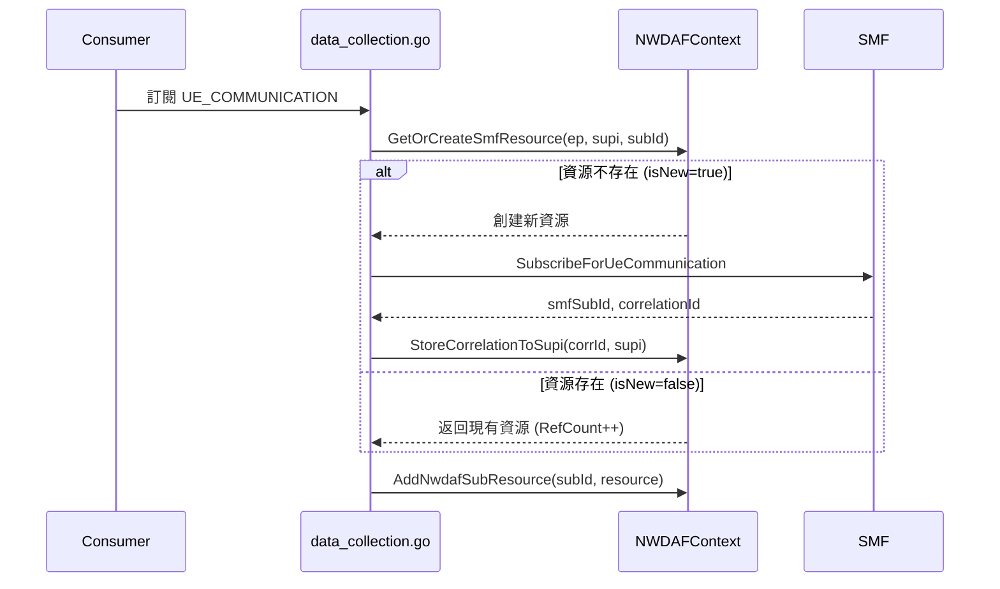
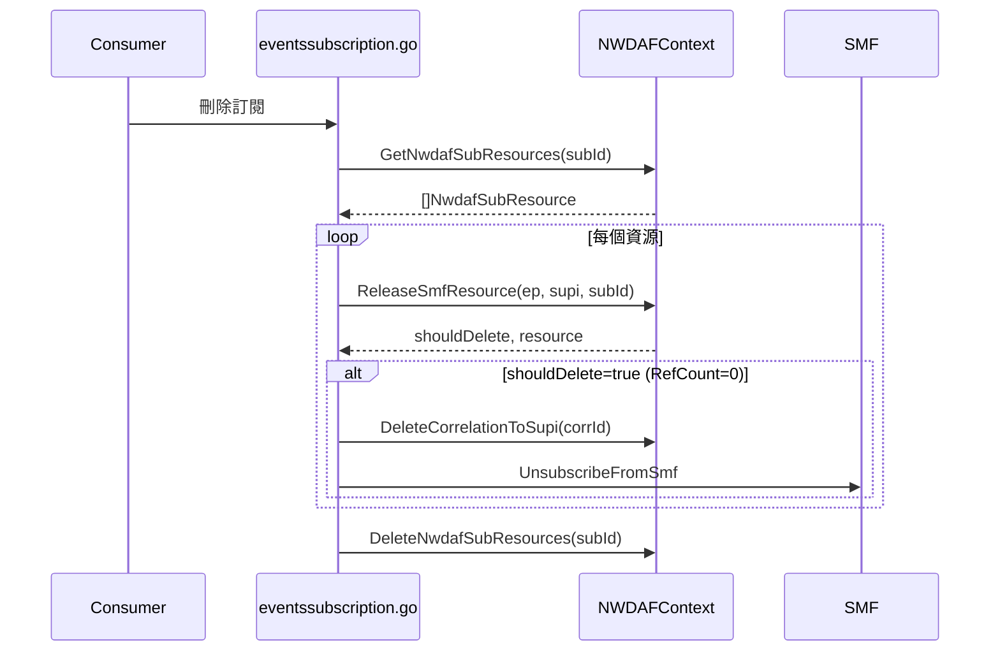

# SMF Subscription Resource Management Design

**最後更新**: 2026-01-23

本文件詳細說明 NWDAF 中 SMF 訂閱資源管理的設計，包括資料結構關係、函數功能、引用計數機制及使用流程。

---

## 1. 架構概覽

### 1.1 核心問題

多個 NWDAF Consumer 可能訂閱同一個 UE，但我們只需向 SMF 訂閱一次：

```
Consumer A ─┐
            ├─→ SMF Subscription (imsi-001) ─→ SMF
Consumer B ─┘
```

### 1.2 設計目標

1. **共享 SMF 訂閱**：同一 `(smfEndpoint, supi)` 只創建一個 SMF 訂閱
2. **引用計數**：追蹤有多少 NWDAF 訂閱在使用
3. **正確清理**：最後一個使用者離開時才取消 SMF 訂閱
4. **獨立追蹤**：每個 NWDAF 訂閱獨立追蹤其使用的資源

---

## 2. 資料結構關係

### 2.1 Cardinality 關係圖

```
┌─────────────────────────────────────────────────────────────────────┐
│                         NWDAFContext                                 │
├─────────────────────────────────────────────────────────────────────┤
│                                                                      │
│  correlationToSupiMap                                                │
│  ┌──────────────────┐     1:1                                       │
│  │ correlationId    │ ─────────→ supi                               │
│  │ (string)         │            (string)                           │
│  └──────────────────┘                                               │
│                                                                      │
│  nwdafSubResourcesMap                                               │
│  ┌──────────────────┐     1:N                                       │
│  │ nwdafSubId       │ ─────────→ []NwdafSubResource                 │
│  │ (string)         │            (slice)                            │
│  └──────────────────┘                                               │
│                                                                      │
│  smfResources                                                        │
│  ┌──────────────────┐     1:1      ┌─────────────────────────────┐  │
│  │ endpoint:supi    │ ─────────→  │ SmfSubscriptionResource     │  │
│  │ (string)         │              │ - RefCount: N               │  │
│  └──────────────────┘              │ - NwdafSubIds: map[N]bool   │  │
│                                    └─────────────────────────────┘  │
└─────────────────────────────────────────────────────────────────────┘
```

### 2.2 Cardinality 總結

| 關係 | 類型 | 說明 |
|------|------|------|
| `correlationId` → `supi` | **1:1** | 一個 correlationId 對應一個 SUPI |
| `supi` → `correlationId` | **1:1** | 一個 SUPI 只有一個 SMF 訂閱 (per endpoint) |
| `nwdafSubId` → `NwdafSubResource` | **1:N** | 一個 NWDAF 訂閱可追蹤多個 SMF 資源 |
| `smfResourceKey` → `SmfSubscriptionResource` | **1:1** | 一個 key 對應一個資源 |
| `SmfSubscriptionResource` → `nwdafSubId` | **1:N** | 一個 SMF 資源可被多個 NWDAF 訂閱共享 |

### 2.3 三個 Map 詳細說明

#### Map 1: `correlationToSupiMap`

```
┌─────────────────────────────────────────────────────────────────┐
│ correlationToSupiMap (sync.Map)                                  │
├─────────────────────────────────────────────────────────────────┤
│ Key: string (correlationId)                                      │
│ Value: string (supi)                                             │
├─────────────────────────────────────────────────────────────────┤
│ 範例:                                                            │
│   "uuid-abc-123" → "imsi-208930000000001"                       │
│   "uuid-def-456" → "imsi-208930000000002"                       │
└─────────────────────────────────────────────────────────────────┘
```

| 屬性 | 說明 |
|------|------|
| **用途** | UPF 通知路由：從 correlationId 解析目標 SUPI |
| **寫入時機** | 創建新 SMF 訂閱時 (`data_collection.go`) |
| **讀取時機** | 收到 UPF 通知時 (`upf_notify.go`) |
| **刪除時機** | SMF 訂閱完全釋放時 (RefCount=0) |
| **生命週期** | 與 SMF 訂閱相同 |

---

#### Map 2: `nwdafSubResourcesMap`

```
┌─────────────────────────────────────────────────────────────────┐
│ nwdafSubResourcesMap (sync.Map)                                  │
├─────────────────────────────────────────────────────────────────┤
│ Key: string (nwdafSubId)                                         │
│ Value: []NwdafSubResource (slice)                                │
├─────────────────────────────────────────────────────────────────┤
│ 範例:                                                            │
│   "nwdaf-sub-A" → [                                             │
│       {SmfEndpoint: "http://smf:8080", Supi: "imsi-001", ...},  │
│       {SmfEndpoint: "http://smf:8080", Supi: "imsi-002", ...}   │
│   ]                                                              │
│   "nwdaf-sub-B" → [                                             │
│       {SmfEndpoint: "http://smf:8080", Supi: "imsi-001", ...}   │
│   ]                                                              │
└─────────────────────────────────────────────────────────────────┘
```

| 屬性 | 說明 |
|------|------|
| **用途** | 清理追蹤：記錄每個 NWDAF 訂閱使用的 SMF 資源 |
| **寫入時機** | 每次訂閱或重用 SMF 資源時 (`data_collection.go`) |
| **讀取時機** | NWDAF 訂閱刪除時 (`eventssubscription.go`) |
| **刪除時機** | NWDAF 訂閱刪除完成後 |
| **生命週期** | 與 NWDAF 訂閱相同 |

**重要**：每個 NWDAF 訂閱都有獨立的追蹤記錄，即使共享同一 SMF 資源。

---

#### Map 3: `smfResources`

```
┌─────────────────────────────────────────────────────────────────┐
│ smfResources (sync.Map)                                          │
├─────────────────────────────────────────────────────────────────┤
│ Key: string ("smfEndpoint:supi" 複合鍵)                          │
│ Value: *SmfSubscriptionResource                                  │
├─────────────────────────────────────────────────────────────────┤
│ 範例:                                                            │
│   "http://smf:8080:imsi-001" → &SmfSubscriptionResource{        │
│       SmfEndpoint:   "http://smf:8080",                         │
│       Supi:          "imsi-001",                                │
│       SmfSubId:      "smf-sub-123",                             │
│       CorrelationId: "uuid-abc-123",                            │
│       RefCount:      2,                                         │
│       NwdafSubIds:   {"nwdaf-sub-A": true, "nwdaf-sub-B": true} │
│   }                                                              │
└─────────────────────────────────────────────────────────────────┘
```

| 屬性 | 說明 |
|------|------|
| **用途** | 共享管理：追蹤 SMF 訂閱及其引用計數 |
| **寫入時機** | 首次訂閱某 SUPI 時創建 (`ue_data.go`) |
| **讀取時機** | 訂閱或釋放 SMF 資源時 |
| **刪除時機** | RefCount 降為 0 時 |
| **生命週期** | 從首個使用者訂閱到最後一個使用者離開 |

---

### 2.4 三個 Map 協作情境

#### 情境：Consumer A 和 B 訂閱同一 UE

```
Step 1: Consumer A 訂閱 imsi-001
────────────────────────────────
smfResources["smf:8080:imsi-001"] = {RefCount: 1, NwdafSubIds: {A}}
correlationToSupiMap["uuid-123"] = "imsi-001"
nwdafSubResourcesMap["A"] = [{smf:8080, imsi-001, uuid-123}]

Step 2: Consumer B 訂閱同一 imsi-001 (共享)
────────────────────────────────────────────
smfResources["smf:8080:imsi-001"] = {RefCount: 2, NwdafSubIds: {A, B}}
correlationToSupiMap["uuid-123"] = "imsi-001"  (不變)
nwdafSubResourcesMap["A"] = [{smf:8080, imsi-001, uuid-123}]  (不變)
nwdafSubResourcesMap["B"] = [{smf:8080, imsi-001, uuid-123}]  (新增)

Step 3: Consumer A 刪除
───────────────────────
smfResources["smf:8080:imsi-001"] = {RefCount: 1, NwdafSubIds: {B}}
correlationToSupiMap["uuid-123"] = "imsi-001"  (保留，B 還在用)
nwdafSubResourcesMap["A"] = 刪除
nwdafSubResourcesMap["B"] = [{...}]  (不變)

Step 4: Consumer B 刪除
───────────────────────
smfResources["smf:8080:imsi-001"] = 刪除 (RefCount=0)
correlationToSupiMap["uuid-123"] = 刪除 (最後一個使用者離開)
nwdafSubResourcesMap["B"] = 刪除
→ 調用 SMF.Unsubscribe()
```

---


## 3. 資料結構詳解

### 3.1 NwdafSubResource

```go
type NwdafSubResource struct {
    SmfEndpoint   string    // SMF 端點 URL
    Supi          string    // 目標 UE SUPI
    CorrelationId string    // 對應的 correlationId
    CreatedAt     time.Time // 創建時間
}
```

**用途**：追蹤單個 NWDAF 訂閱使用的 SMF 資源，用於清理時識別需要釋放的資源。

### 3.2 SmfSubscriptionResource

```go
type SmfSubscriptionResource struct {
    mu sync.Mutex
    
    // 識別
    SmfEndpoint   string
    Supi          string
    SmfSubId      string    // SMF 返回的訂閱 ID
    CorrelationId string    // 用於 UPF 通知
    
    // 引用計數
    RefCount    int32
    NwdafSubIds map[string]bool  // 使用此資源的 NWDAF 訂閱 IDs
    
    // 時間戳
    CreatedAt  time.Time
    LastUsedAt time.Time
}
```

**不變量 (Invariant)**：`RefCount == len(NwdafSubIds)`

---

## 4. 函數功能與依賴

### 4.1 通知路由 API (correlation_mapping.go)

| 函數 | 功能 | 調用者 |
|------|------|--------|
| `StoreCorrelationToSupi(corrId, supi)` | 存儲 correlationId → supi 映射 | `data_collection.go` |
| `GetSupiByCorrelationId(corrId)` | 查詢 SUPI | `upf_notify.go` |
| `DeleteCorrelationToSupi(corrId)` | 刪除映射 | `eventssubscription.go` |

### 4.2 清理追蹤 API (correlation_mapping.go)

| 函數 | 功能 | 調用者 |
|------|------|--------|
| `AddNwdafSubResource(subId, res)` | 添加資源追蹤 | `data_collection.go` |
| `GetNwdafSubResources(subId)` | 獲取所有追蹤資源 | `eventssubscription.go` |
| `DeleteNwdafSubResources(subId)` | 刪除追蹤記錄 | `eventssubscription.go` |

### 4.3 引用計數 API (ue_data.go)

| 函數 | 功能 | 特殊機制 |
|------|------|---------|
| `GetOrCreateSmfResource(ep, supi, subId)` | 獲取或創建 SMF 資源 | 冪等性：重複調用不增加 RefCount |
| `ReleaseSmfResource(ep, supi, subId)` | 釋放引用 | 返回 `shouldDelete` 表示是否應刪除 |
| `addReference(subId, key)` | 內部：增加引用 | 檢查 NwdafSubIds 避免重複 |
| `validateInvariantLocked()` | 內部：驗證不變量 | 確保 RefCount == len(NwdafSubIds) |

---

## 5. 特殊機制

### 5.1 引用計數 (Reference Counting)

```
                    ┌─────────────────────┐
Consumer A 訂閱 ──→ │ RefCount: 1         │
                    │ NwdafSubIds: {A}    │
Consumer B 訂閱 ──→ │ RefCount: 2         │
                    │ NwdafSubIds: {A, B} │
Consumer A 刪除 ──→ │ RefCount: 1         │
                    │ NwdafSubIds: {B}    │
Consumer B 刪除 ──→ │ RefCount: 0         │ ──→ 刪除 SMF 訂閱
                    └─────────────────────┘
```

### 5.2 冪等性 (Idempotency)

```go
func (r *SmfSubscriptionResource) addReference(nwdafSubId, key string) {
    if r.NwdafSubIds[nwdafSubId] {
        return  // 已存在，不重複增加
    }
    r.RefCount++
    r.NwdafSubIds[nwdafSubId] = true
}
```

**保證**：同一個 `nwdafSubId` 多次調用 `GetOrCreateSmfResource` 只計數一次。

### 5.3 不變量驗證 (Invariant Validation)

```go
func (r *SmfSubscriptionResource) validateInvariantLocked() error {
    if r.RefCount != int32(len(r.NwdafSubIds)) {
        return fmt.Errorf("INVARIANT VIOLATION: RefCount=%d, len=%d", ...)
    }
    return nil
}
```

**觸發時機**：每次 `addReference` 和 `ReleaseSmfResource` 後驗證。

---

## 6. 使用流程

### 6.1 訂閱流程



### 6.2 清理流程



---

## 7. 並發安全

| 元件 | 機制 |
|------|------|
| `correlationToSupiMap` | `sync.Map` - 原子操作 |
| `nwdafSubResourcesMap` | `sync.Map` - 原子操作 |
| `smfResources` | `sync.Map` - 原子操作 |
| `SmfSubscriptionResource` 內部 | `sync.Mutex` - 保護 RefCount 等 |

---

## 8. 測試覆蓋

| 測試案例 | 驗證內容 |
|---------|----------|
| `TestCorrelationToSupiCRUD` | 通知路由基本操作 |
| `TestNwdafSubResourcesCRUD` | 清理追蹤基本操作 |
| `TestMultipleSubscriptionsSharedResource` | 多訂閱共享與清理 |
| `TestConcurrentCorrelationAccess` | 並發安全 |

---

## 9. 相關檔案

| 檔案 | 責任 |
|------|------|
| `internal/context/context.go` | NWDAFContext 定義 |
| `internal/context/correlation_mapping.go` | 通知路由 + 清理追蹤 API |
| `internal/context/ue_data.go` | SmfSubscriptionResource + 引用計數 |
| `internal/sbi/processor/data_collection.go` | 訂閱邏輯 |
| `internal/sbi/processor/eventssubscription.go` | 清理邏輯 |
| `internal/sbi/processor/upf_notify.go` | UPF 通知處理 |
