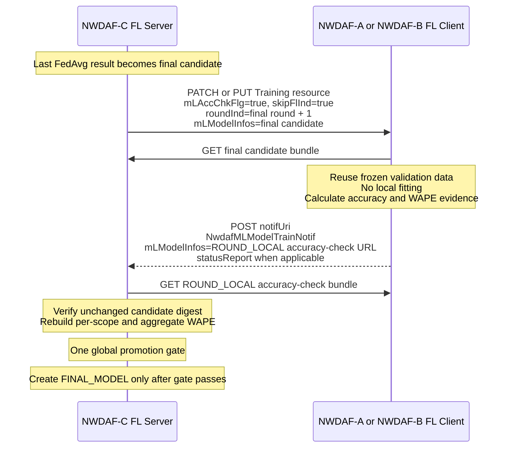
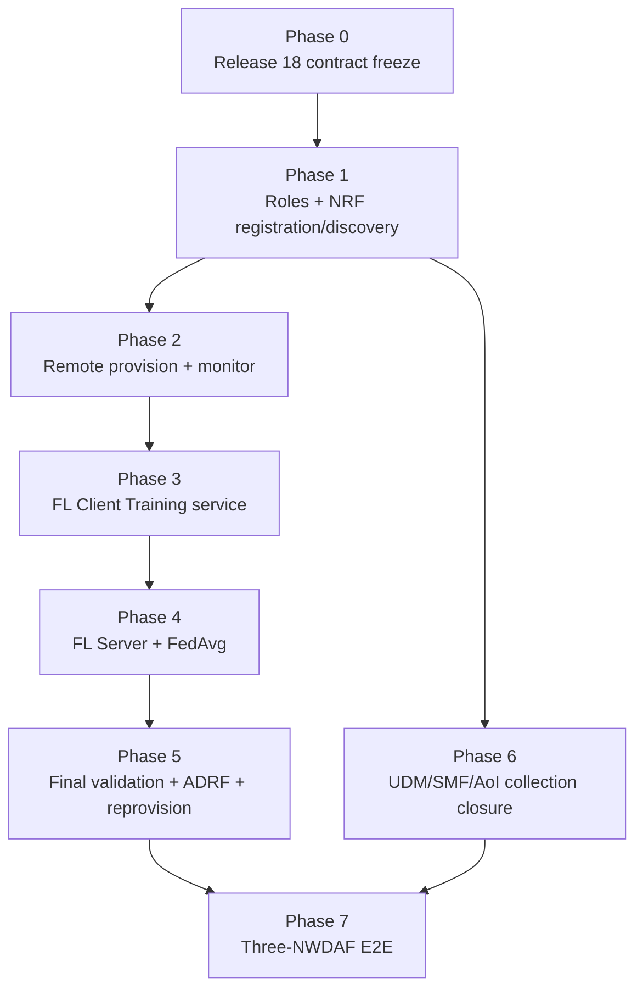

# Distributed NWDAF Federated Learning Implementation Plan

日期：2026-07-29

狀態：Phase 0 contract foundation、Phase 1 role／NRF foundation及
Phase 2 cross-NWDAF model provision／monitoring皆已完成實作、review
remediation與驗證；Phase 3 FL Client Training與Phase 4 FL Server
orchestration／FedAvg將依同一份整合詳細計畫連續實作，並保留兩個獨立
驗收 gate

相關文件：

- [Distributed NWDAF Model Monitoring and Federated Retraining Architecture](../../design/Distributed%20NWDAF%20Model%20Monitoring%20And%20Federated%20Retraining%20Architecture.md)
- [NWDAF AnLF／MTLF Current Feature Architecture](../../design/Current%20AnLF%20MTLF%20Feature%20Architecture.md)
- [NWDAF Federated Learning Release 18 規格解讀](../../specification-guides/NWDAF%20Federated%20Learning%20Release%2018%20規格解讀.md)
- [NWDAF Development Policy](../../development_policy.md)
- [Phase 3 And 4 Federated Training Execution Detailed Plan](Phase%203%20And%204%20Federated%20Training%20Execution%20Detailed%20Plan.md)

---

## 1. 計畫目的

本計畫把已確認的三個 NWDAF 分散式情境轉換成可實作、可驗收且可分開
review 的工作切片。

目標情境為：

- NWDAF-A、NWDAF-B 各自對 Consumer 提供同一 Internal Group、不同
  AoI／TAI 的 `UE_COMMUNICATION` analytics；
- NWDAF-C 不提供本情境的 analytics，而是 seed／latest model owner、
  Model Provision provider、Model Monitor coordinator 與 FL Server；
- A、B 從 C 取得相同模型，分別量測各自 scope 的 WAPE；
- 任一 scope degradation 時，C 經 NRF 發現 eligible FL Clients；
- A、B 各自從 ADRF 取得本地 training data，不把 raw data 集中送給 C；
- C 以同步、固定參與者、sample-count-weighted FedAvg 完成多輪訓練；
- final candidate 經各 Client 的本地 validation 後，由 C 做一次全域
  promotion gate；
- gate 通過的 final model 保存至 ADRF，成功後才由 C 完成 catalog
  promotion，並沿既有 Model Provision subscriptions 重新提供給 A、B；
- A、B 採 new-before-old 的模型與監控世代切換。

這是一個獨立的 federated-learning workstream，不是已完成
`mtlf-backend-transition` 的下一個 transition phase。舊 transition
計畫仍是單一 containing NWDAF 的 baseline，本計畫只在明確列出的
切片中擴充跨 NWDAF 行為。

---

## 2. 已確認的第一版實作範圍

### 2.1 拓撲與角色

```text
Consumer
  ├── subscribe group-G + TAI-A -> NWDAF-A
  └── subscribe group-G + TAI-B -> NWDAF-B

NWDAF-C
  ├── Model Provision provider
  ├── Model Monitor coordinator
  └── FL Server

NWDAF-A / NWDAF-B
  ├── Analytics provider
  ├── Model consumer
  ├── Model Monitor provider
  └── FL Client
```

每一個 NWDAF instance 都由 Go NWDAF 對外註冊及提供標準 SBI。
PyAnLF 與 PyMTLF 仍是 containing NWDAF 的 backend：

- 不獨立向 NRF 註冊；
- 不成為獨立標準 NF；
- 標準 NWDAF、NRF、UDM、SMF 與 ADRF control-plane communication
  由 Go 執行；
- Python backend 使用普通 HTTP 與 containing Go 溝通；
- Go 端命名只使用 `anlfBackend`、`mtlfBackend`，不出現 Python
  implementation 名稱。

### 2.2 FL execution profile

第一版固定：

- Analytics ID：`UE_COMMUNICATION`；
- 一個預先確認相容的 model family；
- 兩個 FL Clients；
- participant set 在 preparation 成功、第一個 training round 開始前固定；
- 所有 selected Clients 都完成 preparation 才開始；
- 同步 rounds；
- 每輪等待全部 selected Clients；
- 任一必要 Client 失敗或 timeout，該 round／process 失敗；
- 固定 round 數；
- Clients 交換完整模型參數，不交換 gradients、delta 或 optimizer state；
- 使用實際 local training sample count 做 weighted FedAvg；
- 精確 sample count 存在 project model bundle manifest，不把
  `samplRatio` 當作 sample count；
- 所有 Clients 沿用 base／global bundle 內同一份 scaler 與
  preprocessing contract，不各自重新 fit scaler；
- preparation 時建立固定 process snapshot，並沿用現有 trainer 的
  deterministic temporal split／purge-gap policy，凍結 training 與
  validation subsets；
- ADRF 是唯一 training data source；
- round local／interim model 使用暫存 URL；
- 只有通過 global promotion gate 的 final model 送往 ADRF；
- 普通 HTTP；TLS、OAuth delegation 與跨 Python process certificate
  trust 不在本計畫。

### 2.3 Model management profile

第一版只管理線性 completed revisions：

```text
M1 seed -> M2 -> M3 -> ...
                       ^
                       latestModelId
```

- 正常 Model Provision 永遠提供單一 latest model；
- 不建立 model tree、branch、per-TAI model assignment 或 candidate ranking；
- round local／interim model 不配置正式 `modelUniqueId`；
- final candidate 通過 global promotion gate 後、送往 ADRF 前配置
  numeric `modelUniqueId`；ADRF 成功保存後，該 ID 與模型才一起成為
  completed revision／latest；
- 已配置但 publication 失敗的 ID 保持 consumed，不得重用；
- `storeTransId` 只定位 ADRF record，不取代 model identity；
- completed revisions、latest pointer、ADRF reference 與下一個 model ID
  由 NWDAF-C 的 PyMTLF 持久保存。

---

## 3. 現有實作基線

本計畫起點為：

| Repository | Baseline revision |
| --- | --- |
| `NWDAF/` | `2bdb01e` |
| `PyAnLF/` | `694e3d8` |
| `PyMTLF/` | `11b3199` |
| `nwdaf-resources/` | `4937b20` |
| team ADRF reference branch | `with-mlmodelmanagement` at `7f947db` |

計畫撰寫時，上述四個主要 repository worktree 均為 clean。`resources/`
仍是 read-only reference tree；後續若需修改 NRF、ADRF、SMF、UPF 或
UDM，必須使用獨立且獲授權的 repository／branch，不得直接在
`resources/` 內實作。Release 18 YAML 只作規格證據，不在 reference tree
或外部 OpenAPI module 內直接實作本計畫的 compatibility types。

### 3.1 已具備的能力

#### Go NWDAF

- Events Subscription、Model Provision、Model Monitor public SBI；
- Go → PyAnLF／PyMTLF standard-shaped private routing；
- backend health、polling、sync 與 process-local route mirrors；
- NF registration、OAuth-aware NRF consumer；
- 共用 NRF discovery cache、`validityPeriod`、singleflight 與 bounded
  eviction；
- SMF／ADRF outbound consumer；
- callback relay 與 `ProblemDetails` mapping。

#### PyAnLF

- analytics subscription runtime；
- static group membership 與 SMF collection reconciliation；
- UPF／SMF notification ingestion；
- ADRF-first storage 與 Mongo fallback；
- model demand、Model Provision subscription；
- artifact download、bundle validation 與 atomic activation；
- Model Monitor registration；
- stable measurement window 與 WAPE reporting。

#### PyMTLF

- seed model catalog 與 immutable bundle；
- Model Provision producer；
- Model Monitor registration／subscription reconciliation；
- WAPE degradation 與 family-level retrain-in-flight；
- ADRF／Mongo dataset snapshot；
- local warm-start training、candidate evaluation、promotion；
- updated Model Provision notification；
- stale-base protection、notification coalescing 與 old-report isolation。

#### Integration assets

- single-NWDAF portable application E2E；
- team SMF Event Exposure 與 go-upf dataset replay；
- ADRF Data Management storage、retrieval subscription、fetch instruction；
- ADRF Model Management 初步 branch。

### 3.2 現況缺口

| Area | Current state | Required target |
| --- | --- | --- |
| NWDAF capability config | service advertisement 主要由 backend enable 推導 | 以 `serviceNameList`、標準 `nwdafInfo`、TAI 與 FL capability 建立 A/B/C profile |
| OpenAPI contract | pinned free5GC models 主要為 Release 17 | 沿用可用的 R17 generated models，缺少／不完整的 Release 18 Training 與 FL capability 以隔離 compatibility types 補齊 |
| NRF gateway | 只接受 SMF Event Exposure／ADRF Data Management query | NWDAF model／FL、exact instance、UDM、完整 cache key |
| NRF implementation | 無 `ml-analytics-info-list` matching，R17 typed profile 會丟 FL 欄位 | 保存與篩選 Release 18 `MlAnalyticsInfo` |
| Peer resource route | 多處以 subscription ID 作 process-local key | local opaque ID + target NF/service + peer Location；不同 NF 可回相同 ID |
| Model Provision | containing NWDAF 內部 routing | A/B 經 NRF 向 remote C 建立／維護 resource |
| Model Monitor | C 的 reconciler 固定送 containing PyAnLF | 依 `consumerId` 發現 remote A/B，建立 remote subscription |
| ML Model Training | 無 public API、consumer、provider、resource state | 完整 POST／PUT／PATCH／DELETE／callback |
| FL Client | 無 preparation／round worker | ADRF snapshot、local training、temporary artifact |
| FL Server | 無 process／participant／round／FedAvg | 固定 participant、同步 rounds、aggregation |
| PyMTLF mode | lifespan 固定啟動 current local training coordinator | `local`／`fl_server`／`fl_client` 明確分流 |
| FL preprocessing | current local trainer 每次重新 fit scaler | 所有 Client 沿用 base/global scaler 才可聚合 weights |
| Model catalog | restart 後從 seed 重建 | completed revisions、latest、ADRF ref、allocator 持久化 |
| ADRF model control | Go 只有 Data Management consumer | Go standard ML Model store/retrieve auxiliary edges |
| Dataset descriptor | PyMTLF 主要依賴 active sync projection | retained descriptor inventory bridge，idle Client 才可復用歷史 ADRF data |
| Final validation | current local training 可直接讀所有 scope data | distributed Client-side validation，C 不接收 raw data |
| Group resolution | PyAnLF static config，且目前可能做 SUPI × SMF candidate 配對 | UDM group→SUPI、UECM serving SMF、exact resource |
| AoI gating | team SMF 尚未接受 `networkArea` 或依 UeLocation 動態控制 | SMF 依 TAI 啟停 downstream UPF subscription |
| ADRF model | 初步實作仍有 contract gaps | Release 18 store/retrieve、capability、Location、ACL |
| E2E | single NWDAF portable flow | three NWDAFs、NRF、ADRF、two Clients、multi-round |

### 3.3 Branch strategy

本 federated-learning workstream 不依 Phase 建立短期 implementation
branch。各 repository 使用下列長期 branch：

| Repository | Branch |
| --- | --- |
| `NWDAF/` | `feat/r18-federated-learning` |
| `PyAnLF/` | `feat/r18-federated-learning` |
| `PyMTLF/` | `feat/r18-federated-learning` |
| `nwdaf-resources/` | `feat/r18-federated-learning` |
| `nrf/` | `feat/r18-nwdaf-discovery` |
| `nwdaf-docs/` | `main` |

不建立 `contract-foundation`、`phase1` 等額外 implementation branch。
各 repository 仍獨立 commit、獨立驗證；implementation commit 不使用
Phase、review iteration 或 finding ID 作 summary。`resources/` 內的
reference mirrors 保持 read-only。

---

## 4. 標準邊界與證據

OpenAPI 決定 path、method、request／response schema、required fields、
success status、`Location` 與 operation-specific error；TS text 用來判斷
procedure intent 與角色責任。

Go 與 PyAnLF／PyMTLF 的 internal HTTP path可以由專案定義，但只要承載
標準業務資料，query parameter、JSON property、nested structure、enum
value、success body與 `ProblemDetails`都必須沿用對應 OpenAPI名稱及
形狀。不得建立縮寫、alias、flattened form或 project-specific wrapper；
語言內部命名差異只能由 serializer tags隔離，不得出現在 wire contract。

### 4.1 NRF

| Behavior | Standard contract |
| --- | --- |
| NF register | `PUT /nnrf-nfm/v1/nf-instances/{nfInstanceId}`；create `201 + Location`，replace `200` |
| NF discovery | `GET /nnrf-disc/v1/nf-instances`；成功 `200 SearchResult` |
| Analytics provider capability | `nwdafInfo.nwdafEvents` + `nnwdaf-eventssubscription` |
| Model provider capability | `nwdafInfo.mlAnalyticsList[].mlAnalyticsIds` + `nnwdaf-mlmodelprovision` |
| FL Server／Client | `MlAnalyticsInfo.flCapabilityType` |
| FL Client endpoint | `nnwdaf-mlmodeltraining` |
| ADRF data／model | `AdrfInfo.dataStorageInd`／`mlModelStorageInd` + 對應 registered `nadrf-datamanagement`／`nadrf-mlmodelmanagement` service |

證據：

- [TS 29.510 Nnrf_NFManagement OpenAPI](../../../specs/openapi/TS29510_Nnrf_NFManagement.yaml)
- [TS 29.510 Nnrf_NFDiscovery OpenAPI](../../../specs/openapi/TS29510_Nnrf_NFDiscovery.yaml)
- [TS 29.510 `NwdafInfo`](../../../specs/TS%2029.510/6%20API%20Definitions/6.1%20Nnrf_NFManagement%20Service%20API/6.1.6%20Data%20Model/6.1.6.2%20Structured%20data%20types/6.1.6.2.45%20Type%20NwdafInfo.md)
- [TS 29.510 `MlAnalyticsInfo`](../../../specs/TS%2029.510/6%20API%20Definitions/6.1%20Nnrf_NFManagement%20Service%20API/6.1.6%20Data%20Model/6.1.6.2%20Structured%20data%20types/6.1.6.2.84%20Type%20MlAnalyticsInfo.md)
- [TS 29.510 NF Discovery GET and matching rules](../../../specs/TS%2029.510/6%20API%20Definitions/6.2%20Nnrf_NFDiscovery%20Service%20API/6.2.3%20Resources/6.2.3.2%20Resource%20nf-instances%20%28Store%29/6.2.3.2.3.1%20GET.md)
- [TS 29.510 NFDiscovery features](../../../specs/TS%2029.510/6%20API%20Definitions/6.2%20Nnrf_NFDiscovery%20Service%20API/6.2.9%20Features%20supported%20by%20the%20NFDiscovery%20service.md)
- [TS 23.288 §6.2C](../../../specs/TS%2023.288/6%20Procedures%20to%20Support%20Network%20Data%20Analytics/6.2C%20Federated%20Learning%20among%20Multiple%20NWDAFs.md)

### 4.2 Model Provision 與 Model Monitor

| Operation | Success |
| --- | --- |
| Model Provision create | `POST /subscriptions` → `201 + Location + representation` |
| Model Provision update | `PUT /subscriptions/{id}` → `200` 或 `204` |
| Model Provision delete | `DELETE /subscriptions/{id}` → `204` |
| Model Provision callback | `POST {notifUri}` → `204` |
| Monitor registration create | `POST /registrations` → `201 + Location` |
| Monitor registration delete | `DELETE /registrations/{id}` → `204` |
| Monitor subscription create | `POST /subscriptions` → `201 + Location` |
| Monitor subscription update | `PUT /subscriptions/{id}` → `200` 或 `204` |
| Monitor subscription delete | `DELETE /subscriptions/{id}` → `204` |
| Monitor callback | `POST {notificationUri}` → `204` |

Monitor registration 要求 `modelId`，且 `consumerId`／`consumerSetId` 恰好
一個。它沒有 monitor endpoint；C 必須使用 `consumerId` 作
`target-nf-instance-id` discovery，再從 `nfServiceList` 解析 endpoint。

WAPE 是本專案的 degradation policy，不是標準 `MLModelMetric` enum。
Monitor notification 只使用 `modelId + deviation` 表達 observation；
不得送 `modelMetric=WAPE`。

證據：

- [TS 29.520 Model Provision OpenAPI](../../../specs/openapi/TS29520_Nnwdaf_MLModelProvision.yaml)
- [TS 29.520 Model Monitor OpenAPI](../../../specs/openapi/TS29520_Nnwdaf_MLModelMonitor.yaml)
- [TS 29.520 §5.4.6 Model Provision Data Model](../../../specs/TS%2029.520/5%20API%20Definitions/5.4%20Nnwdaf_MLModelProvision%20Service%20API/5.4.6%20Data%20Model.md)
- [TS 23.288 §6.2A](../../../specs/TS%2023.288/6%20Procedures%20to%20Support%20Network%20Data%20Analytics/6.2A%20Procedure%20for%20ML%20Model%20Provisioning.md)
- [TS 23.288 §6.2E](../../../specs/TS%2023.288/6%20Procedures%20to%20Support%20Network%20Data%20Analytics/6.2E%20MTLF-based%20ML%20Model%20Accuracy%20Monitoring.md)

### 4.3 ML Model Training

| Operation | Success |
| --- | --- |
| create training resource | `POST /nnwdaf-mlmodeltraining/v1/subscriptions` → `201 + Location + representation` |
| complete update | `PUT /subscriptions/{id}` → `200` 或 `204` |
| partial update | `PATCH /subscriptions/{id}` → `200` 或 `204` |
| terminate resource | `DELETE /subscriptions/{id}` → `204` |
| Client result callback | `POST {notifUri}` → `204` |

第一版使用一個長期 Server–Client resource：

```text
POST preparation
  -> 201 resource created + Location
  -> asynchronous preparation status／delay／termination callback
PUT/PATCH round 1
  -> local model callback
PUT/PATCH round 2
  -> local model callback
PUT/PATCH final validation
  -> ROUND_LOCAL accuracy-check callback
DELETE
```

TS 29.552 §5.10.2.1 step 4c 明確定義正式 training 在
`maxResTime` 前無法完成時，由 Client 送 delay notification、Server
決定是否以 update 提供新的 maximum response time。Preparation 使用
相同 `mLTrainRepInfo`、notification 與 PATCH schema 是本專案的
standards-shaped orchestration policy；規格沒有另定 preparation-specific
READY 或 deadline-extension 欄位。

final validation 是獨立的 validation-only round。Server 提供 final
candidate，並同時設定：

```json
{
  "mLAccChkFlg": true,
  "skipFlInd": true
}
```

`mLAccChkFlg=true` 要求 Client 使用本地資料驗證 candidate；
`skipFlInd=true` 明確表示該 round 不執行 local fitting。只設定
`mLAccChkFlg` 不代表停止訓練。

Training notification 不含 subscription ID。Go 先以必填
`notifCorreId` 找到 local route／peer resource，再由 PyMTLF 驗證 FL
request 必須存在的 `mlCorreId` 與 expected stage。Preparation callback
通常省略 `roundInd`；正式 training／accuracy-check callback 才驗證該
state 預期的 `roundInd`。PUT body可驗證 `mlCorreId` 不變；PATCH schema
沒有 `mlCorreId`，必須從 path 對應的 existing resource state 取得。

除 OpenAPI required fields 外，validator 也必須實作 TS table 的條件：

- FL request 必須提供 `mlCorreId`；
- `mLPreFlag=true` 時，每個 `MLModelTrainInfo` 同時提供
  `dataAvReq` 與 `timeAvReq`；
- Training 的 `MLEventSubscription` 提供 `modelInterInfo`；
- notification 除必填 correlation 外，至少提供 `delayEventNotif`、
  `mLModelInfos`、`statusReport`、`termTrainReq` 之一，並遵守互斥
  條件；preparation completion 可使用 `statusReport`，不得要求虛構
  local model。

服務特定錯誤至少包含：

- `403 ML_MODEL_TRAINING_REQS_NOT_MET`；
- `403 ML_TRAINING_NOT_COMPLETE`；
- `403 OVERLOAD`；
- `403 NOT_AVAILABLE_FOR_FL_PROCESS_ANYMORE`；
- `500 UNAVAILABLE_ML_MODEL_TRAINING_FOR_ALLEVENTS`。

證據：

- [TS 29.520 ML Model Training OpenAPI](../../../specs/openapi/TS29520_Nnwdaf_MLModelTraining.yaml)
- [TS 23.288 §6.2F](../../../specs/TS%2023.288/6%20Procedures%20to%20Support%20Network%20Data%20Analytics/6.2F%20Procedure%20for%20ML%20Model%20Training.md)
- [TS 29.552 §5.10](../../../specs/TS%2029.552/5%20Signalling%20Flows%20for%20the%20Network%20Data%20Analytics%20Framework/5.10%20Federated%20Learning%20among%20Multiple%20NWDAFs.md)
- [TS 29.520 §5.5.6 Data Model](../../../specs/TS%2029.520/5%20API%20Definitions/5.5%20Nnwdaf_MLModelTraining%20Service%20API/5.5.6%20Data%20Model.md)
- [TS 29.520 §5.5.7 Error handling](../../../specs/TS%2029.520/5%20API%20Definitions/5.5%20Nnwdaf_MLModelTraining%20Service%20API/5.5.7%20Error%20handling.md)

### 4.4 ADRF

Training data retrieval：

```text
POST /nadrf-datamanagement/v1/data-retrieval-subscriptions
  -> 201 + Location
ADRF callback
  -> Client 204
Client GET data-store-records by fetch correlation IDs
  -> 200 records or 204 no data
DELETE retrieval subscription
  -> 204
```

Request 使用完整 `dataSub` 與 `timePeriod`，不是只傳 SMF subscription ID。
本 profile 還必須提供 `notifCorrId`、`notificationURI`，並在
`dataSub`／`anaSub`／`dataSetId` 中恰好選一個。第一版固定
`dataSub`，且設定 `consTrigNotif=true`，因此 callback 預期為
`fetchInstruct`；若未協商此 profile，Client 必須同時支援
`dataNotif`／`anaNotifications`。

Final model storage：

- ADRF 可由 `mlFileAddr` 下載 final artifact；
- ADRF record 中的模型必須有 numeric `modelUniqueId`；
- top-level owner 使用 NWDAF-C 的 `nfInstanceId`；
- retrieval 使用 `store-trans-id` 或 `model-unique-ids`；
- ADRF 不提供「依 Analytics ID 找最新模型」；
- 本專案 catalog 保存 `modelUniqueId -> storeTransId`；
- `storeTransId` 只從 response `Location` 解析；representation 沒有該欄；
- `201` 後仍檢查 `modelStoreResult`；若結果未能證明成功，必要時以
  retrieval probe 驗證後才 commit publication；
- `allowConsumerList` 放入 A、B、C 的 NF instance IDs；
- Model Provision wire 使用 `mLModelAdrf.storTransId`，catalog 內部名稱
  可維持 `storeTransId`，mapper 必須明確；
- ADRF 是 repository，不是 latest-model manager。

第一版只使用普通 HTTP，`allowConsumerList` 必須正確保存及比對，但若
team ADRF 沒有可信 requester identity，這只是 access metadata，不宣稱
形成跨 trust domain 的強 ACL；完整 enforcement 與 OAuth／TLS 一起延後。

證據：

- [TS 29.575 Data Management OpenAPI](../../../specs/openapi/TS29575_Nadrf_DataManagement.yaml)
- [TS 29.575 ML Model Management OpenAPI](../../../specs/openapi/TS29575_Nadrf_MLModelManagement.yaml)
- [TS 23.288 §6.2B](../../../specs/TS%2023.288/6%20Procedures%20to%20Support%20Network%20Data%20Analytics/6.2B%20Analytics%20Data%20and%20ML%20Model%20Repository%20procedures.md)

### 4.5 HTTP 共通約束

- `Content-Type` 使用 operation OpenAPI 宣告的 media type；
- create resource 成功必須帶 `Location`；
- `307`／`308` 必須帶 `Location`；
- error 使用 `application/problem+json` 與 `ProblemDetails`；
- public backend dependency 不可用時回 `503`；
- peer 宣告的標準錯誤應保留 status 與 `ProblemDetails`；
- private backend success status 必須符合對應 standard-shaped contract；
- 不以 generic `200`、`202` 或自訂 success body 取代 operation-specific
  status。

---

## 5. 本計畫先修正的設計缺口

### 5.1 Final candidate 的 per-scope WAPE

原設計同時要求：

- C 不集中取回 A、B raw data；
- C 在 promotion 前保存各 participating scope 的 WAPE。

C 因此不能直接沿用 current single-NWDAF trainer 的 local evaluation。
第一版新增 final evaluation cycle：

1. 最後一輪 FedAvg 形成 final candidate，但尚未 promotion；
2. C 對同一批 Client Training resources 發出 evaluation-only update；
3. request 同時使用：
   - `mLAccChkFlg=true`：要求以 local data 評估 global model；
   - `skipFlInd=true`：跳過本 round 的 local fitting；
   - `mLModelInfos`：提供 final candidate bundle URL；
4. 此 update 使用保留的 `roundInd = final training round + 1`，但 resource
   expected stage 是 `FINAL_VALIDATION`，不得被 round duplicate guard
   當成另一輪 local training；
5. 各 Client 重用本 process 已凍結的 validation snapshot，同時評估
   base latest model 與 final candidate；
6. Client 發布暫存 `ROUND_LOCAL` bundle，並設定
   `result_type=ACCURACY_CHECK`：
   - 被評估的 final candidate weights；
   - base／candidate weights 與 contract digest；
   - scope identity digest；
   - base／candidate WAPE、absolute-error sum、actual-value sum 與 delta；
   - evaluation sample count；
   - evaluation data window；
7. callback 仍使用 `NwdafMLModelTrainNotif` 與暫存 `mLFileAddr`；
   該 URL 指向包含 final candidate 的合法 model bundle，evaluation
   metadata 是 bundle sidecar，不是只借模型 URL 傳一份報表；
   因為 request 設定 `skipFlInd=true`，bundle 的 `weights_digest` 必須
   等於 input global candidate digest；
8. 標準 `statusReport.mlModelAcc` 只在能表達真正 ACCURACY 時提供；
   不把 WAPE 塞入該欄位；
9. C 驗證所有 bundle 指向相同 final candidate，並用各 scope sums 重現
   既有 PyMTLF gate：triggering scope improvement、aggregate improvement
   與 non-triggering scope maximum regression；
10. `enforce_performance_gate=false` 時仍保存相同 evidence，但不因結果
    較差拒絕；最後仍只有一次 global promotion gate。



`ROUND_LOCAL.result_type` 與 WAPE sidecar 是 project artifact
contract，不是新的 SBI 或 vendor JSON field。標準通訊仍使用
`mLAccChkFlg`、`skipFlInd`、`mLModelInfos`、`statusReport` 與 callback。
bundle 內額外保存哪些相容 metadata，由本專案的 model interoperability
contract 定義。

規格依據：

- [TS 23.288 §6.2F ML Model Training](../../../specs/TS%2023.288/6%20Procedures%20to%20Support%20Network%20Data%20Analytics/6.2F%20Procedure%20for%20ML%20Model%20Training.md)：request 可提供 Model Accuracy Check Flag 與 skip current FL round indication；
- [TS 29.520 §5.5.6 Training data model](../../../specs/TS%2029.520/5%20API%20Definitions/5.5%20Nnwdaf_MLModelTraining%20Service%20API/5.5.6%20Data%20Model.md)：定義 `mLAccChkFlg`、`skipFlInd`、`mLModelInfos`、`statusReport` 與 notification conditional rule；
- [TS 29.520 ML Model Training OpenAPI](../../../specs/openapi/TS29520_Nnwdaf_MLModelTraining.yaml)：定義 PUT／PATCH body 與 callback schema。

### 5.2 Remote model provider identity

現有 PyAnLF compatibility model 出現非標準 `modelProviderId`，current
architecture 文件也曾把 `provider_namespace` 描述成該 wire field。
Release 18 Model Provision OpenAPI 沒有此欄。

分散式實作改為：

```text
provider identity =
  NRF selected target nfInstanceId
  + selected NFService identity/API root

resource route =
  provider identity
  + operation direction
  + peer resource Location
```

- provider identity 保存於 PyAnLF internal demand／slot state；
- resource route 保存於 Go route mirror，並以 local opaque route ID 對
  backend 呈現；
- backend auxiliary request 以 private `SelectedTarget` metadata 傳入
  selected `nfInstanceId`、NF service instance／name 與 API root；
- Go 驗證 target identity、service 與 API root 一致後才建立 route；
  不只接收 `Target-Api-Root`，也不從 URI 反推 NF identity；
- `provider_namespace` 可留作 PyMTLF private catalog namespace；
- 不再把 `modelProviderId` 或 private family ID 放入標準 body；
- A、B 若選到不同 provider，視為不同 internal model slots；
- C 的 containing `nfInstanceId` 從 Go sync 取得。

### 5.3 Model Provision feature profile

本情境需要正式 `modelUniqueId`、ADRF model reference 與 Model Monitor。
第一版因此固定要求 A、B、C 使用相同的 Release 18
Model Provision extension profile，並依 OpenAPI `suppFeats` 完成 feature
negotiation。

- feature 不相容時拒絕該 model relationship；
- 不以 private fields 模擬不支援的 feature；
- exact feature bit 與 validation 必須由 Phase 0 直接對照 OpenAPI；
- Training round 暫存模型仍可省略 `modelUniqueId`。

### 5.4 Numeric model identity 與 restart

`modelUniqueId` 是非負整數，且規格要求在 5GC scope 內唯一。Release 18
沒有中央配號 API。

第一版採下列 deployment policy：

- 只有 NWDAF-C 建立本情境的正式 completed models；
- C 設定一個不與其他實驗 model provider 衝突的 numeric 起始區間；
- PyMTLF 以持久化 monotonic allocator 配號；
- seed、completed revisions、latest pointer、下一個 ID 與 ADRF
  references 使用同一份 file-backed catalog；
- catalog 以 temporary file + atomic rename 更新；
- process restart 不得重新使用已配置 ID；
- 新實驗若要重新從 seed 開始，必須顯式清除該實驗 data directory 與
  對應 ADRF records。

未來若同一 5GC 有多個正式 model owners，必須另設跨 owner 的 namespace
allocation policy；不在第一版。

### 5.5 FL Client discovery 的區域語意

不假設一次 `ml-analytics-info-list` 查詢會把 TAI-A、TAI-B 解讀成
「符合任一區域」。

C 對每一個 required training scope 分別 discovery：

```text
discover compatible FL Clients for scope-A
discover compatible FL Clients for scope-B
union results
deduplicate by nfInstanceId
verify service and capability
run preparation
```

只有同一個 `MlAnalyticsInfo` entry 內的條件共同匹配才算一個候選。
NRF candidate 不等於正式 participant。

### 5.6 沒有 active analytics subscription 的候選者

標準不要求 FL Client 當下必須有 Consumer analytics subscription，但它
仍必須能解析 training scope 並找到既有 ADRF records。

- Phase 3 最初只保證 active descriptor projection；第一個完整實驗中
  A、B 都有 active analytics subscriptions；
- Phase 6D 完成 descriptor inventory／retention bridge 後，具有
  historical `dataSub` descriptor 與 matching ADRF records 的 idle
  Client 才可 preparation 成功；
- 沒有 descriptor、沒有 records 或樣本不足：
  preparation 回標準 requirements-not-met；
- 不為了宣稱「任何 idle Client 都能加入」而虛構 dataset。

### 5.7 Backend restart 與 FL process

- Go 持續 mirror standard Training resources、peer Locations 與 callback
  routes，並在 backend restart 後放入 sync snapshot；
- PyMTLF completed model catalog 可恢復；
- 第一版不恢復正在執行的 optimizer、round、partial aggregate 或尚未
  完成 final evaluation 的 FL process；
- Server／Client PyMTLF process instance 改變時，上述 active FL process
  進入 failed；callback outbox 停止產生新 work，剩餘 peer resources
  於 bounded timeout 內 best-effort cleanup；
- final evaluation 完成並 durable handoff 後，Training resources 已清除；
  後續 publication 是獨立的 durable job，不再屬於可恢復 optimizer／round
  的 FL execution，restart 後只依 journal retry／reconcile ADRF store 與
  catalog commit；
- sync snapshot 同時包含 provider-side inbound resources 與
  consumer-side outbound peer routes；重啟 backend 只用它們
  terminalize／cleanup，不嘗試 resume；
- 下一次 degradation 重新建立新的 `mlCorreId` 與 resources；
- Go process restart 仍視為實驗重跑，不做 durable route persistence。

---

## 6. Component ownership

| Component | Owns |
| --- | --- |
| Go NWDAF | NF identity、service/capability profile、NRF registration/discovery/cache、public standard SBI、outbound Training／Provision／Monitor／ADRF clients、callback relay、peer resource mirror、backend sync |
| PyAnLF | analytics/model demand、provider selection policy、model activation、monitor registration、WAPE measurement、collection descriptors、ADRF raw data write |
| PyMTLF on A/B | FL Client Training producer resource、preparation、ADRF snapshot、shared-scaler local trainer、`ROUND_LOCAL` training／accuracy-check bundles |
| PyMTLF on C | FL Server model catalog、degradation intent、Client selection、FL process/round、FedAvg、global promotion、ADRF final-model publication |
| NRF extension | preserve and match Release 18 NF Profile／`MlAnalyticsInfo` |
| ADRF | raw record retrieval、completed model storage/retrieval |
| UDM／UDR extension | group membership、per-SUPI SMF registrations |
| team SMF／UPF | AoI-aware UPF Event Exposure collection |
| nwdaf-resources | multi-process configs、fixtures、launch/cleanup、E2E assertions |
| nwdaf-docs | canonical plan、architecture、spec evidence、progress |

Go 不執行：

- model family selection；
- degradation threshold；
- dataset feature conversion；
- local training；
- FedAvg；
- candidate validation；
- model promotion。

Python backend 不：

- 以獨立 NF 身分註冊 NRF；
- 直接實作另一套 public standard SBI；
- 繞過 Go 執行標準 control-plane communication。

ADRF 不：

- 選擇 latest model；
- 決定 FL participants；
- 判斷 degradation；
- 執行 promotion。

---

## 7. 依賴與交付順序



### 7.1 Work package summary

| Phase | Primary repositories | Deliverable | Depends on |
| --- | --- | --- | --- |
| 0 | `NWDAF`, `PyAnLF`, `PyMTLF`, `nwdaf-resources` | R18 compatibility contracts、artifact roles、catalog/journal schema | none |
| 1 | `NWDAF`, `PyAnLF`, `PyMTLF`, NRF fork, `nwdaf-resources` | A/B/C roles、registration、NRF discovery relay | Phase 0；editable NRF fork |
| 2 | `NWDAF`, `PyAnLF`, `PyMTLF`, `nwdaf-resources` | peer routes、remote seed provision、two-scope monitoring | Phase 1 |
| 3 | `NWDAF`, `PyMTLF`, `nwdaf-resources` | bidirectional Training transport、one-Client preparation/round | Phase 2 |
| 4 | `PyMTLF`, `NWDAF`, `nwdaf-resources` | two-Client orchestration、shared-scaler local training、FedAvg | Phase 3 |
| 5 | `NWDAF`, `PyAnLF`, `PyMTLF`, ADRF, `nwdaf-resources` | Client validation、durable final publication、reprovision/cutover | Phase 4, G1, G2 |
| 6 | `NWDAF`, `PyAnLF`, `PyMTLF`, UDM/UDR, SMF/UPF, AMF profile | group→SUPI→serving-SMF→AoI collection、descriptor retention | Phase 1, G1 |
| 7 | `nwdaf-resources`, all integrated repos, `nwdaf-docs` | portable and full-collection E2E、runbook、claim closure | Phase 5; Phase 6 for full profile |

Phase 3與Phase 4在實作排程上是一個連續work unit，共用一份
[整合詳細計畫](Phase%203%20And%204%20Federated%20Training%20Execution%20Detailed%20Plan.md)；
表格仍分列，是因為one-Client resource與two-Client orchestration有不同
驗收gate。

第一個 vertical milestone 是 Phase 1 + Phase 2：

```text
NRF role discovery
  -> A/B subscribe C seed model
  -> A/B activate M1
  -> A/B register model use
  -> C discovers exact A/B monitor endpoints
  -> A/B separately report WAPE to C
```

此 milestone 不先實作 FedAvg，先證明三個 NWDAF 的標準資源與 identity
路徑正確。

---

## 8. Phase 0：Release 18 contract foundation

狀態：已實作並完成 final validation artifact correction 與重新驗證。

詳細實作計畫：

- [Phase 0 Release 18 Contract Foundation Detailed Plan](./Phase%200%20Release%2018%20Contract%20Foundation%20Detailed%20Plan.md)

### 8.1 目標

建立由 NWDAF 維護、直接對照 Release 18 OpenAPI／TS 的 typed
compatibility contract，以及所有後續切片共用的 status matrix、feature
profile、artifact manifest 與 ID policy。

### 8.2 Slice 0A：Release 18 compatibility contract strategy

Affected repositories：

- `NWDAF/`；
- `PyAnLF/`；
- `PyMTLF/`；
- `nwdaf-resources/`；
- `nwdaf-docs/`。

Tasks：

1. 以 local official Release 18 YAML 盤點 Training、Provision、Monitor、
   NRF FL fields，並逐項標記 current
   `github.com/free5gc/openapi v1.2.3` 是否已有可用 generated model；
2. 已存在且語意足夠的 R17 generated model 繼續直接使用，不複製到
   compatibility package；
3. 缺少或 Release 18 欄位不完整的 contract，依 concern 分別放入
   `NWDAF/internal/compat/mlmodeltraining/`、
   `NWDAF/internal/compat/mlmodel/` 或
   `NWDAF/internal/compat/nrf/`，不得修改 upstream generated code；
4. compatibility package 補齊 `Nnwdaf_MLModelTraining` typed
   request／response／notification／PATCH models，以及
   `MlAnalyticsInfo.flCapabilityType`、`flTimeInterval`、`nfTypeList`、
   `nfSetIdList`、model interoperability 等 Release 18 欄位；
5. public handler、processor 與 outbound consumer 使用 typed
   compatibility models；不得以 `map[string]any` 或零散 handler-local
   struct 取代 contract；
6. compatibility types 的 field name、required／optional、cardinality、
   enum 與 JSON encoding 必須直接標記 Release 18 YAML／TS evidence；
   nested type 若 current generated package 已可表達則直接 reuse；
7. 保留 `NWDAF/go.mod` 的 current free5GC OpenAPI dependency，不建立
   OpenAPI fork、不加入 local-path `replace`，也不要求其他 repository
   取得額外 Go module；
8. PyMTLF 在 `src/py_mtlf/wire/` 對齊完整 Training contract；PyAnLF
   只對齊它實際使用的 Provision、Monitor 與共用模型資訊；
9. cross-language example payload 放 `nwdaf-resources/contracts/`；各
   implementation repo 的 unit tests 使用 code-native fixtures，不重新
   引入 root `testdata` JSON。

Resolved schema dependency and compatibility consequence：

- local corpus 已包含 TS 29.523 V18.7.0 與 official
  `TS29523_Npcf_EventExposure.yaml` V18.5.0；
- Training／Provision／Monitor 的 `eventReq` 可直接對照 exact
  `ReportingInformation`；
- current free5GC generated `models.ReportingInformation` 缺少 Release 18
  的 `notifFlagInstruct` 與 `mutingSetting`，不能作 lossless Release 18
  wire contract；
- Phase 0 在 `internal/compat/mlmodel/` 建立 shared typed Release 18
  `ReportingInformation`，並由 Training／Provision／Monitor
  compatibility models reuse；已可重用的 nested generated types仍直接
  使用；
- 第一版實驗流程使用 long-lived subscription，不主動設定 one-time
  `eventReq`，但 parser／validator 必須依完整 Release 18 schema接受並
  保留合法的 optional `eventReq`，不得無聲丟棄欄位；
- 這項 schema 補齊不改變 compatibility-first決策，也不建立 OpenAPI
  fork。

### 8.3 Slice 0B：Training wire contract

Tasks：

- 第一版流程只產生 long-lived Training request；wire validator仍使用
  TS 29.523 exact `ReportingInformation` 驗證合法的 optional
  `eventReq`，確保 immediate／one-time reporting資料可 lossless
  round-trip；
- 建立 `NwdafMLModelTrainSubsc`、notification、status、delay、termination、
  PATCH models 的 parser／validator；
- 逐 operation 建立 success／error matrix；
- 驗證 `mLPreFlag`、`mLAccChkFlg`、`mlCorreId`、`roundInd`、
  `mLModelInfos`、`maxResTime`；
- 實作 §4.3 所列 TS conditional requirements，以及 notification 的
  at-least-one／mutual-exclusion rules；不得誤作 exactly-one；
- PUT 驗證完整 body 的 `mlCorreId` 不變；PATCH 從 existing resource
  state 取得 process identity；
- `modelUniqueId` 保留 optional semantics；
- standard callback 不新增 `sampleCount` 或 WAPE field；
- freeze lossless mapping：
  `mLEventSubscs[].{mLEvent,mLEventFilter,tgtUe,modelInterInfo,mLTargetPeriod}`
  → internal `TrainingScopeDescriptor`；
- descriptor canonicalization 保留 group、TAI／network area、其他 filters、
  target、interoperability 與 requested period，作為 ADRF descriptor lookup
  key；
- 建立 JSON contract fixtures，供 Go 與 PyMTLF 使用相同語意測試。

### 8.4 Slice 0C：FL artifact manifest

建立三種 bundle role：

| Role | Formal model ID | Durable |
| --- | --- | --- |
| `ROUND_LOCAL` | no | no |
| `ROUND_GLOBAL` | no | no |
| `FINAL_MODEL` | yes | yes after ADRF store |

所有 role 共用：

- bundle contract version；
- artifact role；
- model architecture／tensor contract digest；
- preprocessing contract digest；
- base／candidate weights digest；
- `mlCorreId`；它就是 design 文件中的 `flProcessId`；
- file digests。

Role-specific fields：

- `ROUND_LOCAL`：
  - 共用 `roundInd`、participant NF instance ID、scope digest、
    input global weights digest；
  - `result_type=TRAINING` 時保存 actual local training sample count 與
    local output weights；
  - `result_type=ACCURACY_CHECK` 時保存 base／candidate WAPE sums、
    evaluation sample count、time window，且 output weights digest 必須
    等於 input global candidate digest；
- `ROUND_GLOBAL`：`roundInd`、ordered participants、input digests 與
  aggregated training sample count；
- `FINAL_MODEL`：formal model ID、participants、各 Client training
  sample count、validation summary 與 previous revision。

ADRF `storeTransId` 在 ADRF 接受 bundle 後才存在，只保存於 catalog 的
completed revision metadata，不反寫 immutable `FINAL_MODEL` bundle。
Round roles 統一使用 `ROUND_LOCAL`／`ROUND_GLOBAL`；舊 design 中泛稱的
`ROUND_INTERMEDIATE` 只代表這兩者的上位概念。

Base／global bundle 的 scaler 在所有 rounds 保持不變。FedAvg 只聚合
floating model parameters；non-floating state 必須與 base 完全相同並從
base 複製，否則拒絕該 result。不得放寬 completed-bundle validator 來接收
暫存 artifact，須建立 role-aware Training Workspace validator。

### 8.5 Slice 0D：Catalog and publication-journal contract

本 Slice 先 freeze schema、migration 與 failure semantics；完整 publication
實作在 Phase 5：

- completed revision schema；
- single `latestModelId`；
- persistent numeric allocator；
- ADRF `storeTransId`／ADRF instance identity；
- pending publication journal：reserved model ID、previous revision、
  participants／scope sample counts、validation summary、candidate
  path／digest、final bundle path／digest、selected ADRF target、store
  state／Location；
- journal 引用的 candidate／final artifact 在 terminal state 前由 durable
  publication directory pin 住，不受 workspace TTL 清理；
- freeze atomic write／startup recovery semantics；filesystem repository 與
  recovery worker 在 Phase 5 接入；
- freeze ADRF 已成功、latest 尚未 commit 時的 restart reconciliation
  semantics；實際 ADRF probe／retry 在 Phase 5 接入；
- corrupt catalog fail-fast；
- explicit experiment reset procedure。

### 8.6 Acceptance

- 第一版 supported-profile example payload 可通過 Go/Python contract
  tests；
- 第一版支援欄位的 required／optional field semantics 一致；
- Release 18 Training 與 `MlAnalyticsInfo` fixtures 可 lossless
  round-trip；
- operation status matrix 有直接 OpenAPI evidence；
- current free5GC generated models 與 local Release 18 compatibility
  models 的 ownership 不重疊；
- `NWDAF/go.mod` 不含本機 OpenAPI fork 或 local-path replacement；
- temporary artifact 不帶 formal model ID；
- catalog／journal round-trip fixture 可被 current and migrated schema 讀取；
- 不再把 `modelProviderId` 視為 standard field。

---

## 9. Phase 1：Role-aware deployment and NRF foundation

狀態：已實作完成。

詳細實作計畫：

- [Phase 1 Role-Aware Deployment And NRF Foundation Detailed Plan](./Phase%201%20Role-Aware%20Deployment%20And%20NRF%20Foundation%20Detailed%20Plan.md)

### 9.1 Slice 1A：Explicit NWDAF services and capabilities

對齊其他 free5GC NF 的 config 慣例，在 `NWDAF/pkg/factory` 與 config
增加：

- `serviceNameList`：決定實際掛載並註冊到 NRF 的標準 SBI services；
- `nwdafInfo.nwdafEvents`：描述可提供的 Analytics Events；
- `nwdafInfo.mlAnalyticsList`：描述 Model Provision／FL 對應的
  Analytics ID、TAI、model interoperability、`flCapabilityType` 與
  local training data NF types；
- `anlfBackend`／`mtlfBackend`：只描述本地 backend dependency，不作為
  對外 capability 的唯一來源。

同一 binary 用不同 config 建立：

- A profile；
- B profile；
- C profile。

`NWDAF/config/` 保留既有 `nwdafcfg.yaml`，並新增 A／B／C 三份可直接
啟動的 deployment config。不得再只以「backend enabled」推導所有外部
capability；profile config決定本 instance提供哪些標準服務，backend
enable只用來驗證對應 operation是否有本地 owner。

同一 Slice 也完成 backend execution-mode migration：

- PyMTLF 明確支援 `local`、`fl_server`、`fl_client`；第一版 C 使用
  `fl_server`，A/B 使用 `fl_client`，既有 single-NWDAF profile 保留
  `local` regression；
- lifespan 只啟動該 mode 需要的 coordinator；C degradation 不得誤走
  current local trainer；
- PyAnLF 增加 model-provider discovery mode、fixed-endpoint fallback、
  retry／timeout 與 selected-provider state；
- PyAnLF／PyMTLF config 明確設定 remote artifact allowed origins、
  download timeout、workspace root／TTL 與可跨 instance 存取的 public
  base URI；
- preparation 建立 request timeout 只涵蓋 schema validation、admission
  與 resource creation，不涵蓋 ADRF retrieval；背景 preparation 的 ADRF
  watchdog、callback retry 與 Server process watchdog 以
  `mLTrainRepInfo.maxResTime` 協調，Client effective deadline 扣除
  safety margin，並支援 bounded delay extension；
- Go config validation依 `serviceNameList`與 `nwdafInfo`檢查必要 backend：
  Events Subscription須有 AnLF，Model Provision須有 MTLF，FL
  Client／Server capability須有 MTLF；Monitor service則接受 A/B
  由 AnLF承接 subscription、C由 MTLF承接 registration。
  NRF只能在 service granularity廣告 `nnwdaf-mlmodelmonitor`，不能分別
  宣告 registration／subscription operation；第一版允許未配置 owner的
  非預期方向依標準已宣告的 `503`與既有 availability policy回應，不為
  C額外啟動 PyAnLF。

### 9.2 Slice 1B：NF Profile

Tasks：

- A/B 註冊 Events Subscription、Model Monitor；
- A/B 宣告 `FL_CLIENT` 與各自 TAI；
- C 註冊 Model Provision、Model Monitor；
- C 宣告 `FL_SERVER`；
- C 不註冊 Events Subscription；
- Phase 1 不先廣告尚未建立 public route 的 Model Training service；
  Phase 3 完成 Training handler／processor／backend routing 後才將
  `nnwdaf-mlmodeltraining` 加入 A/B profile；
- profile create／replace與 shutdown deregistration保留 existing
  lifecycle；本 Phase不宣稱新增目前不存在的 periodic heartbeat worker；
- backend 尚未 usable 時，configured service request 依 existing
  availability policy 回 `503`，不得由 Go 臨時執行 Python business logic。

### 9.3 Slice 1C：NRF discovery relay

擴充 Go shared NRF service 與兩個 backend auxiliary edges：

- `target-nf-type=NWDAF|UDM|SMF|ADRF`；
- 必填 `requester-nf-type=NWDAF` 由 Go 固定；
- `requester-nf-instance-id` 由 Go 補入；
- `target-nf-instance-id`；
- `service-names`；
- `nwdaf-event-list`；
- `ml-analytics-info-list`；
- `internal-group-identity`；
- ADRF storage capability filters。

Internal path可自訂，但上述 query names、`ml-analytics-info-list` JSON
properties、enum values、`SearchResult`與 `ProblemDetails`必須原樣沿用
TS 29.510 OpenAPI；不得建立 project-specific alias或 wrapper。

Phase 1 發現 FL Client 時只要求 `FL_CLIENT` capability；Phase 3
Training route 可用後，才同時要求 registered
`nnwdaf-mlmodeltraining` service，避免 profile 廣告尚不可呼叫的能力。

TAI／S-NSSAI／FL capability／data-source NF type 必須編入同一個
`ml-analytics-info-list` entry，不建立非標準 top-level query。
該 parameter 依 OpenAPI 使用 JSON query encoding，與 `service-names`
的一般 array encoding 不同，必須有 URL serialization round-trip test。

Cache key 必須包含完整 normalized query，不可只使用 target NF type 或
service name。Go cache 仍不進 sync。

### 9.4 Slice 1D：NRF Release 18 extension

現有 free5GC NRF：

- 不解析／match `ml-analytics-info-list`；
- R17 typed NF Profile 會丟失 `flCapabilityType`；
- 因此不能作第一版 FL discovery 的標準證據。

獨立 NRF workstream 必須：

1. 保留 current R17 generated profile 作為既有欄位基礎，並在 NRF
   repository 以隔離的 typed compatibility extension 保存 Release 18
   fields；不得要求共用 OpenAPI fork或用任意 map 保存；
2. 保存完整 `MlAnalyticsInfo`；
3. 依同一 entry 的 Analytics ID、TAI、interoperability、FL capability、
   data-source fields 做 matching；
4. 保留 service name 與 service status filtering；
5. 支援 exact `target-nf-instance-id`；
6. `SearchResult.nrfSupportedFeatures` 對 `ml-analytics-info-list` 宣告
   `Query-eNA-PH2`，對 ADRF storage-indicator queries 宣告
   `Query-eNA-PH3`；NWDAF discovery client 驗證／記錄對應 feature；
7. 加入 registration round-trip、same-entry matching 與 discovery tests。

不可只讓 NRF 接受未知 JSON，卻不實作 matching。

### 9.5 Acceptance

- NRF profile round-trip 不丟 FL fields；
- C query 可發現 A/B `FL_CLIENT`；
- A/B query 可發現 C model provider；
- C 不出現在 analytics-provider query；
- exact instance discovery 只回指定 NF；
- cache hit／expiry／singleflight regression 保持通過；
- A/B/C 使用各自獨立 UUIDv4 `nfInstanceId`；
- `nwdaf-resources` 可啟動三個角色與 NRF，並保存各 profile/discovery
  assertion；後續 phases 在同一 harness 增量擴充。

---

## 10. Phase 2：Cross-NWDAF model provision and monitoring

狀態：實作、review remediation與最終驗證完成。

詳細實作計畫：

- [Phase 2 Cross-NWDAF Model Provision And Monitoring Detailed Plan](./Phase%202%20Cross-NWDAF%20Model%20Provision%20And%20Monitoring%20Detailed%20Plan.md)
- [Phase 2 Code Review Findings And Remediation Plan](./code-reviews/Phase%202%20Code%20Review%20Findings%20And%20Remediation%20Plan.md)

### 10.1 Slice 2A：Peer-resource route foundation

先 characterization 現有 local route behavior，再建立所有 remote
subscription service 共用的 route record：

- Go 產生 backend-visible local opaque route ID；
- 另存 direction、service、target `nfInstanceId`、selected NFService／
  API root、peer resource ID、absolute `Location`、origin 與 callback
  correlation；
- Provision、Monitor、Training 與 ADRF auxiliary edges 共用
  `SelectedTarget` private contract；Go 驗證其 NF/service/API-root
  consistency；
- peer 回傳的相同 resource ID 在不同 NF／service 下不衝突；
- backend replace／delete 只帶 local route ID，Go 解析 peer
  `Location`；
- inbound callback 的 peer identity／correlation 驗證後，轉成 local
  route identity 再送 backend；
- sync snapshot 投影同一結構，不把 route identity 與 provider identity
  混為一談；
- migration 移除 PyAnLF 對 non-standard `modelProviderId` 的 wire
  dependency，但保留 current single-NWDAF characterization regression。

### 10.2 Slice 2B：Remote Model Provision

PyAnLF：

- model demand 出現時透過 Go discovery 找 model provider；
- candidate 必須同時有 matching `mlAnalyticsList` 與 registered
  `nnwdaf-mlmodelprovision` service；
- deterministic selection 第一版仍可排序取第一個；
- selected provider `nfInstanceId` 與 API root 存入 internal demand state。

Go：

- AnLF auxiliary create 接受完整 selected-target metadata；
- 對 remote C 呼叫 standard Model Provision create；
- 保存 peer `Location`、target NF、target origin、callback route；
- replace／delete 使用 peer Location，不假設 remote resource ID 在整個
  deployment 唯一；
- C public SBI 收到後仍 route 給 C PyMTLF；
- C callback 送到 A/B public Go，再 route 給 PyAnLF。

PyMTLF-C：

- seed／latest catalog 滿足 A、B demand；
- A、B 對同 family 取得同一 latest model；
- callback retry、coalescing 與 revision guard 沿用既有邏輯。

### 10.3 Slice 2C：Remote Monitor registration

PyAnLF-A/B：

- 模型成功 active 後，以 containing NWDAF `nfInstanceId` 作
  `consumerId`；
- registration 送到原 model provider C；
- provider ownership 來自 demand route，不來自 custom wire field。

Go：

- registration create／delete 支援 remote target；
- route key 包含 target NF／origin／peer Location；
- external Model Monitor body 保持標準 shape。

### 10.4 Slice 2D：C discovers A/B and subscribes

PyMTLF-C reconciler：

1. 收到 registration；
2. 讀取 `consumerId`；
3. 透過 C Go 對 NRF 使用 exact `target-nf-instance-id`；
4. 驗證該 NF 的 registered `nnwdaf-mlmodelmonitor` service；
5. 對 remote A/B 建立 Model Monitor subscription；
6. 保存 registration → remote subscription → callback correlation；
7. replace／delete 使用 peer Location；
8. A/B notifications 經各自 Go 送到 C Go，再 route 給 C PyMTLF。

### 10.5 Slice 2E：Restart and generation isolation

- backend restart 由 Go sync 恢復 provision／registration／subscription
  route projections；
- peer API roots 不從 Python process memory 猜測；
- C 只接受 active correlation 對應的 WAPE；
- retired model／old correlation report 不影響 current degradation；
- new-before-old replacement 保持成立。

### 10.6 Acceptance

三個 NWDAF、尚未啟動 FL 時可證明：

1. A/B 經 NRF 發現 C；
2. A/B 從 C 取得 M1；
3. A/B activate M1；
4. A/B 各自向 C register；
5. C 經 exact discovery 找 A/B；
6. C 向 A/B 建立 monitor subscriptions；
7. A/B 的 WAPE 分別進入 C 的兩個 scope；
8. 刪除任一 Consumer analytics subscription 不誤刪另一 scope；
9. backend restart 後 relationship 可重新 sync／reconcile；
10. `nwdaf-resources` 三角色 profile 完成 seed provision／monitor
    vertical test，既有 single-NWDAF E2E 仍通過。

---

## 11. Phase 3：FL Client Training service

Phase 3與Phase 4共用Training resource、identity、callback與artifact contract，
因此採連續實作；詳細順序與共同failure semantics見
[Phase 3 And 4 Federated Training Execution Detailed Plan](Phase%203%20And%204%20Federated%20Training%20Execution%20Detailed%20Plan.md)。
Phase 3仍以「C對A完成preparation與一個local round」作為獨立gate；
該gate未通過前不得進入two-client FedAvg。

### 11.1 Slice 3A：Go public service

`NWDAF/internal/sbi` 增加：

- `POST /nnwdaf-mlmodeltraining/v1/subscriptions`；
- `PUT /subscriptions/{id}`；
- `PATCH /subscriptions/{id}`；
- `DELETE /subscriptions/{id}`；
- FL Server callback route；
- handler／processor／consumer／context route mirror；
- `nnwdaf-mlmodeltraining` OAuth service scope。

Handler 只做 HTTP／OpenAPI validation；processor 擁有 resource procedure；
outbound peer call 經 consumer；resource state 放 existing context pattern。

### 11.2 Slice 3B：Go ↔ PyMTLF boundary

Go → PyMTLF standard-shaped private routes mirror public methods與body。

對 inbound Training resource：

- Go 保存原始 external `notifUri`；
- 轉給 PyMTLF 前改成 containing Go 的 MTLF callback URI；
- PyMTLF callback local Go；
- Go 同步 relay 到原 FL Server URI；
- callback sender 只有在 remote Server 接受後才取得 `204`。

Provider-side resource store 明確處理 state lock、PUT／PATCH idempotency、
DELETE cancellation 與 deadline。Callback 使用 bounded outbox：

- peer response 遺失時重送同一 artifact／digest，不重新訓練；
- resource 已終止後不產生新 callback；
- graceful shutdown 只在 bounded timeout 內 flush／cleanup。

Sync 增加 provider-side inbound Training resource／route projections，但不包含：

- dataset bytes；
- model bytes；
- optimizer state；
- partial aggregate。

### 11.3 Slice 3C：FL Server outbound Training control

建立目前完全缺少的 consumer-side path：

```text
PyMTLF-C
  -> C Go auxiliary + SelectedTarget
  -> remote A/B Nnwdaf_MLModelTraining
```

- 支援 standard POST／PUT／PATCH／DELETE；
- C Go 以 Phase 2 peer-route foundation 保存 local route ID、target NF、
  peer `Location`／origin 與 `notifCorreId`；
- PyMTLF-C 後續只用 local route ID，不信任 peer subscription ID 全域唯一；
- A/B result 經 A/B Go callback relay 到 C public callback，再 route 至
  PyMTLF-C；
- backend sync 同時投影 consumer-side outbound peer routes；
- one-client process test 在此 Slice 就進 `nwdaf-resources`，不等 Phase 7。

### 11.4 Slice 3D：Preparation resource

PyMTLF-A/B：

- `mLPreFlag=true` 時只做 requirements／willingness check，不執行 fitting；
- HTTP handler 與 processor 只完成 schema、capability、capacity、
  correlation 與 basic admission validation，建立 resource 後立即回
  `201 + Location + representation`；
- 使用 active `dataSub` projection；historical inventory 需等 Phase 6D，
  portable E2E 可使用明確標示的 descriptor fixture；
- resource 建立後由背景 worker 透過 Go ADRF Data Management auxiliary
  建立 retrieval subscription，固定 `consTrigNotif=true`；
- 經 Go callback 收到 fetch instruction；
- PyMTLF 直接 GET ADRF records；
- validate、transform，沿 existing temporal split／purge gap 凍結
  training 與 validation subsets；
- 成功後以標準 `NwdafMLModelTrainNotif.statusReport` callback 回報；
  resource expected stage 是 `PREPARATION_RESULT` 時，C 將沒有
  delay／termination 的有效 status report 判讀為完成，不新增 `READY`
  欄位；
- request 帶 `mLTrainRepInfo.maxResTime`；Client 在扣除 safety margin
  的 effective deadline 前回 success、`delayEventNotif` 或
  `termTrainReq`；
- delay 不自動延長；C 回 `204` 後依 bounded policy PATCH 新
  `maxResTime`，Client 收到成功 update 前不得假設延期成立；
- C 從收到 create／update success response 後啟動 Server watchdog；
  Client 從接受 create／update 後使用本地 monotonic timer，safety
  margin 必須涵蓋 callback transport、retry 與 `204 + PATCH + 200/204`
  的往返；
- 不符合 requirements 時回
  `403 ML_MODEL_TRAINING_REQS_NOT_MET`，但只限建立前已可確定的 failure；
  建立後的 temporary dependency delay 或 permanent failure 分別以
  `delayEventNotif`／`termTrainReq` 回報；
- requirements-not-met 的 `ProblemDetails.invalidParams` 列出實際未滿足
  的 attribute，例如 `dataAvReq.minNumSamples`、`timeAvReq` 或
  `modelInterInfo`；
- C 以成功 `201` 記錄 resource 已建立，以 A、B 全部成功的 preparation
  callbacks 作為 participant freeze gate；
- preparation resource 後續持續沿用同一 frozen snapshot；
- 任一層 timeout／cancellation 必須向內取消 work，刪除 ADRF retrieval
  resource 並清理 partial snapshot；config tests 驗證 callback、ADRF
  watchdog、safety margin 與 bounded extension ordering。

### 11.5 Slice 3E：Round executor

`PUT`／`PATCH` 將 resource 從 preparation 轉成 execution：

- `mLPreFlag=false`；
- PUT 驗證 body `mlCorreId` 與 resource 不變；PATCH 從 resource state
  取得 process identity；
- 驗證 `roundInd`、expected stage、deadline；
- 下載 C 的 round input；round 0 使用 current completed base model，
  後續 round 使用上一輪的 `ROUND_GLOBAL` artifact；
- 驗證 weights、tensor contract、preprocessing contract；
- 使用凍結 training subset 執行 FL-specific local training；
- 沿用 global bundle scaler，禁止 per-client refit；既有 `local` trainer
  行為不被修改；
- 只更新可聚合 floating parameters；non-floating state 保持 base 值；
- 發布 `ROUND_LOCAL` artifact；
- callback 回 C；
- 不 local-promote round model；
- 同一 resource 的 stale／duplicate round 不重複訓練；
- Client 可送 delay／termination，第一版 Server policy 仍可選擇整體失敗。

### 11.6 Slice 3F：Temporary artifact server

- URL 必須可由另一個 NWDAF instance 存取；
- configured public base URI 不可是只對本 process 有效的 loopback；
- artifact 由 role-aware Training Workspace validator 驗證，不放寬
  completed model bundle contract；
- artifact 有 process／round／participant scope；
- size、digest、archive、origin 與 redirect 驗證沿用 current bundle safety；
- active process 期間不得刪除；
- original base bundle／scaler 保留到 final evaluation 完成，供 Client
  在同一 frozen validation subset 做公平 comparison；
- terminal retention 到期才 cleanup；
- startup 清理 orphaned expired workspace；
- cleanup 不得刪除 completed artifact。

### 11.7 Acceptance

- 一個 remote C 可對 A 建立 preparation resource；
- A 先回 `201 + Location`，再從 ADRF freeze train／validation subsets，
  最後以標準 `statusReport` callback 宣告 preparation completed；
- preparation deadline 內可回 delay，C 可 PATCH 一次 bounded
  extension；沒有 notification 時可重現 timeout；
- C 對同一 resource 發 round 1；
- A 產生一個包含正確 sample count 的 local artifact；
- Client local scaler 與 global scaler 相同；
- callback response 遺失時只重送相同 digest；
- delay、requirements-not-met、timeout、duplicate PUT／PATCH／callback、
  delete 可重現；
- PyMTLF restart 不 resume local training，而是使 process 明確失敗。

---

## 12. Phase 4：FL Server orchestration and FedAvg

Phase 4沿用Phase 3已驗證的long-lived Training resource，不另建round或
aggregation wire API。其獨立gate為「C協調A、B完成至少兩輪、使用不相等
sample count的weighted FedAvg」，並只產生尚未promotion的final candidate。

### 12.1 Slice 4A：Retrain intent

PyMTLF-C 沿用 existing WAPE policy：

- 任一 active scope degraded 取得一次 family-level retrain intent；
- training in flight 時忽略同 family 的重複 trigger，但保留 observation；
- intent 固定 base latest model、trigger scope，並把 A/B 兩個相容 active
  scopes 都列為第一版 required training scopes；
- model demand 消失或 base stale 時取消。

### 12.2 Slice 4B：Candidate discovery

C：

- 依 required scopes 分別查 NRF；
- candidate 必須宣告 `FL_CLIENT`；
- candidate 必須有 registered Training service；
- Analytics ID、TAI、interoperability、local data NF type 相容；
- union／dedupe by `nfInstanceId`；
- deterministic ordering；
- 建立 `ParticipantAssignment`：selected NF/service + 第一版單一
  `TrainingScopeDescriptor`；
- 每個 required scope 恰好指派給一個 selected Client；
- 第一版要求A/B兩個required scopes指派給兩個distinct Clients；
- 一個Client承擔多個scope雖可由標準Training body表達，但目前
  `ROUND_LOCAL` contract只有一個`scope_digest`，因此延後到artifact
  contract明確擴充後再支援；
- 第一個 profile 驗證結果必須是兩個 distinct Clients、分別覆蓋 A/B
  scopes，但不 hardcode NF identity。

### 12.3 Slice 4C：Preparation and participant freeze

對每個 candidate：

- 建立一個 long-lived Training resource；
- 依 assignment 將標準 `mLEventSubscs` 送入該 Client，Go lossless
  pass-through，不解讀 training scope；
- 使用共同 `mlCorreId`、不同 `notifCorreId`；
- 收到 `201` 後保存各 remote resource 並等待 preparation notification；
- 以 expected stage + correlation + `statusReport` 判讀 completion，不
  新增非標準 READY property；
- Client delay 時由 C 決定是否 PATCH 新 `maxResTime`，不得自動延長；
- 第一版 required A/B 任一 requirements-not-met 或失敗即取消 process；
- future optional candidate 才可因 preparation 失敗而排除；
- A/B 的成功 preparation callbacks 全部到齊後固定 participant set並進
  `READY`；
- 正式 rounds 開始後 participant set immutable；
- process 中途不加入新 NRF candidate；
- selected Client 離開、timeout 或 invalid result 使 process 失敗。

### 12.4 Slice 4D：Round state machine

```text
FL execution:

CREATED
  -> PREPARATION_CREATING
  -> PREPARATION_WAITING
  -> READY
  -> ROUND_DISPATCH
  -> ROUND_WAITING
  -> AGGREGATING
  -> next ROUND_DISPATCH
  -> FINAL_VALIDATION
  -> PUBLICATION_HANDOFF
  -> EXECUTION_COMPLETE

Durable publication job:

RESERVED
  -> BUNDLE_READY
  -> ADRF_STORED
  -> CATALOG_COMMITTED
  -> NOTIFIED
```

FL execution 在 handoff 前可進 `FAILED`／`CANCELLED`，不跨 restart
resume。Publication job 依 journal 跨 restart retry／reconcile；整體
retraining workflow 只有到 `NOTIFIED` 才算成功完成。

State 至少記錄：

- `mlCorreId`；
- base model digest；
- selected participants；
- participant → assigned scope descriptors；
- per-client subscription／correlation；
- current `roundInd`；
- deadline；
- received result；
- artifact digest；
- sample count；
- expected callback stage；
- publication job ID after durable handoff；
- failure cause。

同一 participant／stage／`roundInd` 的重複 callback若 digest 相同回
`204` 並保持原 state；digest 不同則 process failed。Final evaluation
使用下一個保留 `roundInd` 與 `FINAL_VALIDATION` stage，不與最後一個
training result 混用。

PyMTLF-C 是所有 outbound Training resources 的 lifecycle owner：

- preparation 部分成功後另一 required Client 失敗時，立即 bounded
  DELETE 已建立 resources；
- round／evaluation 失敗、cancel 或 timeout 時同樣 best-effort DELETE；
- repeated DELETE 必須 idempotent；
- Client workspace 依 retention policy 保留，resource delete 不立即刪除
  已回傳 artifact；
- graceful shutdown 使用相同 bounded cleanup，不阻塞無限時間。

### 12.5 Slice 4E：FedAvg

C 下載全部 `ROUND_LOCAL` bundles 後：

- 驗證 process、round、participant；
- 驗證 full parameter structure；
- 驗證 dtype、shape、ordering；
- 驗證所有 Clients 使用同一 scaler／preprocessing digest；
- 只聚合 floating parameters；non-floating state 必須與 base 相同；
- 驗證 sample count 為正整數；
- 驗證 sample count 等於 manifest scope counts 加總；
- 排除 validation samples；
- 任一 invalid result 使 round 失敗；
- 使用 sample-count-weighted FedAvg；
- 發布下一個 `ROUND_GLOBAL`；
- fixed rounds 完成後形成尚未 promotion 的 final candidate。

### 12.6 Acceptance

- 兩 Clients 完成至少兩 rounds；
- 每輪只聚合相同 `mlCorreId + roundInd`；
- unequal sample counts 產生可預期的 weighted result；
- missing／zero／mismatched sample count 被拒絕；
- timeout 不進行 partial aggregation；
- new Client 在 process 中途出現不改變 participant set；
- base model 被更新時 stale process 不得通過 promotion gate；
- `nwdaf-resources` 完成 two-client／two-round weighted FedAvg process
  test，包含 unequal sample counts 與 duplicate callback。

---

## 13. Phase 5：Final validation, ADRF publication and reprovision

### 13.1 Slice 5A：Client-side final validation

- C 對 A/B 發 final validation-only update：
  - `mLAccChkFlg=true`；
  - `skipFlInd=true`；
  - `mLModelInfos` 指向 final candidate；
  - `roundInd=final training round + 1`；
- A/B 使用 frozen validation snapshot；
- 不執行 local fitting；
- A/B 發布 `ROUND_LOCAL/result_type=ACCURACY_CHECK` bundle；
- accuracy-check bundle 包含未修改的 candidate model 與 project-private
  evaluation metadata；
- bundle `weights_digest` 必須等於 request 的 candidate digest；
- C 驗證 base／candidate weights 與 preprocessing digest；
- C 收集每 scope 的 base／candidate WAPE、absolute-error sum、
  actual-value sum、sample count 與 time window；
- missing／invalid evaluation 使 promotion gate 失敗；
- `training.enforce_performance_gate`：
  - `true`：沿用既有 triggering-scope improvement、aggregate
    improvement 與 non-triggering scope maximum-regression 規則；
  - `false`：仍計算及保存結果，但技術檢查通過即可繼續；
- 只有一個 global yes／no gate，不做 per-TAI promotion；
- 收齊並驗證全部 evaluation callbacks 後，C 將 workflow hand off 給
  durable publication job，並 bounded DELETE 所有 Client Training
  resources；publication 不再需要保持 Training subscription。

### 13.2 Slice 5B：ADRF Model Management control path

NWDAF：

- PyMTLF-C → C Go auxiliary → ADRF standard ML Model store；
- PyAnLF-A/B → containing Go auxiliary → ADRF standard model record
  retrieval；
- Go 執行 NRF discovery，要求 `mlModelStorageInd`、registered
  `nadrf-mlmodelmanagement` 與 available service status；
- first profile 使用 instance-level `adrfId`，不使用 `adrfSetId`；
- NRF mode 以 `adrfId` exact discovery；fixed-endpoint mode 必須同時
  配置該 endpoint 的 ADRF `nfInstanceId`，且與 model reference 一致；
- Go 保留 peer HTTP status、`ProblemDetails`、redirect 與 `Location`；
- Python 取得 model record／file address 後直接下載 artifact，Go 不代理
  model bytes。

Team ADRF：

- 對齊 Release 18 store／retrieve schema、status 與 `Location`；
- 驗證 top-level owner、required ML model fields、`modelStoreResult` 與
  allowed-consumer metadata；
- 可從 `mlFileAddr` 下載並保存 immutable model；
- 以 `store-trans-id`／`model-unique-ids` retrieval；
- NRF profile 同時宣告 `mlModelStorageInd` 與
  `nadrf-mlmodelmanagement` service。

### 13.3 Slice 5C：Final bundle and publication journal

C：

1. global promotion gate 通過後，原子 reserve numeric `modelUniqueId`
   並 durable 寫入含 candidate／previous revision／validation evidence 的
   pending-publication journal；
2. 將 candidate pin 到 durable publication directory；
3. 建立 immutable `FINAL_MODEL` bundle，fsync 後將 path／digest 更新至
   journal；
4. 讓 ADRF 可由 temporary URL 下載；
5. 以 C `nfInstanceId` 作 owner 發送 Nadrf ML Model store request；
6. 提供 `mlStorageSize`；
7. `allowConsumerList` 包含 A、B、C `nfInstanceId`；
8. 驗證 `201 + Location + representation`；
9. 只從 `Location` 解析 `storeTransId`；
10. 驗證 `modelStoreResult`；必要時 retrieval probe；
11. journal 記錄 ADRF identity、Location 與 store success；
12. Model Provision durable reference 映射為
    `mLModelAdrf.{adrfId, storTransId}`。

ADRF storage 失敗：

- 保留 local final candidate；
- 不更新 latest；
- 不通知 A/B；
- journal 讓 restart 後仍可辨認並 retry／reconcile 同一 publication；
- reserved model ID 不重用；
- 不因 workspace TTL 刪除。

若 ADRF 已成功而 process 在 catalog commit 前 crash，startup 先以 journal
與 retrieval probe reconcile；不得重新配置 ID 或建立不必要的重複 record。
若在 final bundle 完成前 crash，則從 pinned candidate 與 journal metadata
重建；pinned input 遺失／損壞時將 job 標記 failed、保留 model ID
tombstone，且不更動 latest。

### 13.4 Slice 5D：Atomic catalog promotion

順序固定：

1. aggregation complete；
2. Client evaluation complete；
3. global promotion gate pass；
4. model ID reserved and journal durable；
5. final bundle complete；
6. ADRF store success and journal updated；
7. completed revision append；
8. atomic update latest pointer；
9. clear pending journal；
10. enqueue Model Provision desired notifications。

任一步驟失敗維持原 latest。

### 13.5 Slice 5E：ADRF model retrieval in PyAnLF

PyAnLF-A/B：

- 支援 `mLModelAdrf`；
- `mLModelAdrf.adrfId` 是 authoritative storage identity；
- NRF mode 對該 ID 做 exact target discovery；
- fixed-endpoint mode 驗證 configured ADRF `nfInstanceId` 等於該 ID，
  不得靜默改用另一個 endpoint；
- 以 `storeTransId` 取 record；
- 從 record 的 ADRF-hosted file address 下載 artifact；
- 保留 allowlist、size、digest、archive 與 bundle validation；
- retrieval 或 activation 失敗時繼續使用 old model。

### 13.6 Slice 5F：Reprovision and monitoring cutover

- C 沿 existing Model Provision subscriptions 通知相同 new latest；
- A/B candidate-first activate；
- A/B register new model use；
- C 建立 new monitor subscriptions／correlations；
- new scopes warm up；
- 確認新 relationship 後才 delete old monitor／deregister old use；
- old report 只能進 retired history；
- Consumer analytics subscriptions 不重建。

### 13.7 Acceptance

- final model 只在 ADRF 成功保存後成為 latest；
- A/B 從 ADRF 取得相同 new model；
- A/B 都完成 new monitor relationship；
- old relationship 之後才清除；
- C restart 後仍知道 latest、previous revision、ADRF reference 與下一個 ID；
- ADRF-success／catalog-before-commit crash 可由 journal reconcile；
- Model Provision 正常 request 只回 latest，不讓 ADRF 承擔選模；
- `nwdaf-resources` E2E 完成 final evaluation、ADRF publication、
  reprovision 與 new-before-old cutover。

---

## 14. Phase 6：Standard collection prerequisites

本 Phase 依賴 Phase 1 generic NRF discovery foundation，之後可與
Phase 2–5 平行；它不阻擋使用預先存入 ADRF 的 FL-first E2E，但仍是
「Consumer subscription 到 FL」完整標準情境的必要條件。

規格證據：

- [TS 29.503 Nudm SDM OpenAPI](../../../specs/openapi/TS29503_Nudm_SDM.yaml)
- [TS 29.503 Nudm UECM OpenAPI](../../../specs/openapi/TS29503_Nudm_UECM.yaml)
- [TS 29.508 Nsmf Event Exposure OpenAPI](../../../specs/openapi/TS29508_Nsmf_EventExposure.yaml)
- [TS 23.288 §6.2.2.1](../../../specs/TS%2023.288/6%20Procedures%20to%20Support%20Network%20Data%20Analytics/6.2%20Procedures%20for%20Data%20Collection/6.2.2%20Data%20Collection%20from%20NFs/6.2.2.1%20General.md)
- [TS 23.502 §4.15.4.5](../../../specs/TS%2023.502/4%20System%20procedures/4.15%20Network%20Exposure/4.15.4%20Core%20Network%20Internal%20Event%20Exposure/4.15.4.5%20Exposure%20of%20Events%20from%20UPF%20for%20UPF%20Data%20Collection.md)

### 14.1 Slice 6A：UDM discovery and group membership

- Go NWDAF 新增 Nudm SDM outbound consumer 與 AnLF auxiliary route；
- PyAnLF 新增 group resolver、cache、refresh 與 config；
- NWDAF 依 `internal-group-identity` 發現 serving UDM；
- 經 Go 呼叫 group identifiers 取得完整 SUPI list；
- 使用 legitimate 3GPP Group ID wire value；
- A、B 取得相同完整 membership；
- cache／refresh 使用 UDM response semantics；
- fixture profile 仍可保留，但必須標記 non-standard transition。

現有 free5GC UDM route 回 `501`；需獨立 UDM／UDR implementation task。

### 14.2 Slice 6B：Serving SMF registration

- Go NWDAF 新增 Nudm UECM outbound consumer 與 AnLF auxiliary route；
- PyAnLF 對每個 SUPI 查 UECM SMF registrations；
- 以 PDU session、DNN、S-NSSAI 篩選；
- 取得 exact `smfInstanceId`；
- 以 NRF `target-nf-instance-id` 解析該 SMF Event Exposure endpoint；
- 不做 SUPI × all discovered SMFs Cartesian product；
- collection identity 保留 SUPI、PDU、SMF、DNN、S-NSSAI、AoI、events。

### 14.3 Slice 6C：SMF AoI gating

Team SMF：

- decoder 接受 `eventSubs[].networkArea`；
- 從 current SM context 的 `UeLocation` 取得 latest TAI；
- matching TAI 才建立／維持 downstream UPF subscription；
- UE location update 後重新評估；
- leave AoI 時停止 downstream subscription；
- NWDAF→SMF resource 可以繼續存在；
- first experiment 接受 last-known TAI limitation；
- AMF Event Exposure assisted profile 延後。

Full-core profile 必須由 AMF/PDU Session procedure 提供真實
`UeLocation` 更新。若只將 standard-shaped `UeLocation` fixture 注入 team
SMF，驗收名稱必須是 collection integration，不得標成 full-core E2E。

### 14.4 Slice 6D：Training data descriptor inventory

PyAnLF 在 ADRF write 成功時保存：

- accepted standard `dataSub`；
- semantic scope；
- containing NWDAF／source NF association；
- first／last observation time；
- ADRF identity。

建立明確 private bridge：

```text
PyAnLF descriptor snapshot/delta
  -> Go mirror
  -> PyMTLF sync projection
```

- contract 包含 descriptor identity、retention、ADRF identity、`dataSub`、
  semantic scope 與 observation time window；
- Go 不取得 raw data；
- PyMTLF 只取得 descriptor；
- analytics subscription 刪除後，可依 retention policy 保留 historical
  descriptor，讓 future preparation 解析既有 ADRF records；
- backend restart 由 Go mirror 重送 projection；Go restart 仍視為實驗
  重跑。

### 14.5 Acceptance

- 一個合法 group 經 UDM 展開成 SUPIs；
- 每個 SUPI 只向實際 serving SMF/PDU resource 訂閱；
- A/B 使用同一 membership、不同 AoI；
- team SMF 只啟動 matching TAI 的 UPF data；
- ADRF records 可由相同 `dataSub + timePeriod` 取回；
- 未完成真實 UDM／UeLocation／AoI 測試前，不宣稱 full-core
  standards-complete collection。

---

## 15. Phase 7：Three-NWDAF E2E and closure

### 15.1 Portable FL profile

放在 `nwdaf-resources/`：

- NRF extension；
- ADRF；
- NWDAF-A/B/C；
- PyAnLF-A/B；
- PyMTLF-A/B/C；
- static complete group membership fixture；
- configured SMF／ADRF endpoints where required；
- pre-seeded or replayed ADRF datasets；
- deterministic A/B inference／ground-truth stimulus：先形成穩定 WAPE，
  再只讓一個 scope degradation 以觸發 retrain；
- two-client multi-round FL；
- final ADRF store；
- updated model activation／monitor cutover。

此 profile 驗證 application-level FL，不宣稱真實 PDU session 或 AoI
mobility。

### 15.2 Full collection profile

在必要外部 workstreams 完成後加入：

- UDM／UDR group and SMF registration；
- AMF、PDU Session fixture 與真實 `UeLocation` delivery；
- AMF→SMF UeLocation；
- team SMF AoI gating；
- two UPF paths；
- UPF dataset replay or controlled notifications；
- A/B raw data store to ADRF；
- degradation trigger；
- full FL and reprovision。

### 15.3 Harness rules

- 不在 NF repository root 建立跨 process `test/`；
- configs、fixtures、launch、health wait、cleanup、assertion 放
  `nwdaf-resources/`；
- harness 自 Phase 1 起逐 Slice 增量擴充，不等到本 Phase 才一次建立；
- 每個 process 使用獨立 port、data directory、artifact base URI 與
  `nfInstanceId`；
- 啟動前檢查 port、buffer、disk、artifact public URI、ADRF reachability；
- failure 保留 logs、process state summary、artifact manifests；
- cleanup 不刪 user data 或其他 repository changes。

### 15.4 Acceptance levels

| Level | Claim |
| --- | --- |
| Unit／contract | 單一 package／component behavior |
| Process integration | 真實 Go／Python HTTP process |
| Portable FL E2E | three NWDAFs + NRF + ADRF，fixtures／replay |
| Full collection E2E | AMF/PDU + UDM + SMF AoI + UPF data path |

報告不得把較低 level 描述成較高 level。

---

## 16. Verification matrix

### 16.1 NWDAF

- Release 18 compatibility contract parse／validation／lossless
  round-trip；
- Go／Python cross-language contract fixtures；
- config table tests：A／B／C valid profiles、invalid role combinations；
- NF Profile serialization round-trip；
- NRF discovery query／cache tests；
- selected-target NF/service/API-root consistency validation；
- cross-process preparation deadline-budget config tests；
- public Training handler method、body、status、Location、ProblemDetails；
- outbound Training consumer success／peer error／redirect；
- remote Training／Model Provision／Monitor route collision tests；
- ADRF Model Management auxiliary／consumer status and Location mapping；
- callback correlation；
- backend restart sync；
- `make test`；
- `make build`；
- `make lint`。

Exemplar alignment：

- `nrf`：control-plane app／service／registration baseline；
- `udm`：generated model、consumer 與 outbound tests；
- `pcf`：callback／notification route；
- `bsf`：subscription resource CRUD；
- `smf`：cross-NF consumer and context state。

### 16.2 PyAnLF

- remote provider discovery and selection；
- no custom provider wire field；
- remote provision／registration reconciliation；
- `mLModelAdrf` retrieval；
- authoritative `adrfId` exact discovery／fixed-endpoint mismatch；
- candidate-first atomic activation；
- old-report isolation；
- UDM/UECM scope resolution；
- descriptor retention；
- repository lint；
- full pytest。

### 16.3 PyMTLF

- role config：`local`／`fl_server`／`fl_client`；
- Training resource CRUD／PATCH；
- preparation resource admission、background completion callback、delay
  extension／termination；
- standard Training fields → scope descriptor mapping；
- participant assignment and per-scope counts；
- ADRF frozen train／validation subsets；
- shared-scaler FL trainer and non-floating state policy；
- role-aware temporary manifest validation；
- round idempotency；
- callback outbox idempotency；
- local artifact sample count；
- FedAvg numeric fixtures；
- timeout／termination；
- terminal peer-resource cleanup；
- final evaluation bundles；
- catalog persistence／corruption／allocator／pending publication journal；
- ADRF publication retry；
- reprovision；
- repository lint；
- full pytest。

### 16.4 External workstreams

- NRF registration/discovery contract tests；
- NRF local Release 18 compatibility profile／matching tests；
- ADRF Model Management handler／repository／download tests；
- UDM group／UECM tests；
- AMF／PDU Session `UeLocation` profile or explicitly labelled injected fixture；
- SMF networkArea decode、UeLocation gate、dynamic UPF resource tests；
- UPF notification replay。

### 16.5 Cross-process

至少驗證：

1. three-role NRF registration；
2. remote seed provisioning；
3. two-scope WAPE monitoring；
4. one degradation trigger；
5. two-Client preparation；
6. at least two weighted rounds；
7. Client-side final validation；
8. ADRF final model store；
9. same updated model active on A/B；
10. new monitor generation；
11. old resource cleanup；
12. backend restart failure／recovery boundary。

---

## 17. 明確不在第一版

- Analytics Aggregator；
- Consumer 經單一 C 訂閱 A/B analytics；
- dynamic client sampling；
- partial quorum；
- participant replacement；
- asynchronous FedAvg；
- early stopping；
- gradients／parameter delta transport；
- optimizer state exchange；
- secure aggregation；
- DCCF／MFAF integration；
- MongoDB training-data fallback；
- cross-ADRF backfill；
- model tree／branch；
- per-TAI latest model；
- multiple incompatible model families；
- NRF NF status subscription；
- AMF-assisted AoI UE-list intersection；
- FL process crash resume；
- durable Go route state；
- TLS／OAuth delegation to Python；
- cross-provider numeric model-ID allocation。

上述項目若在實作時被發現，不自動升格為 current-slice blocker。

---

## 18. Implementation discipline

每一個 Phase 仍要拆成可獨立驗收的 vertical slice：

1. 先確認 owner、external／private contract、package placement、
   acceptance tests；
2. characterization／contract test 優先；
3. 完成一個 slice 後先跑 focused verification；
4. 再跑該 repo required full verification；
5. 準備 repository-separated checkpoint；
6. 不把整個跨 repo Phase 累積成一次巨大 diff；
7. implementation commit 不使用 `phase`、review iteration 或 finding ID；
8. docs commits 可以使用 plan／phase 名稱；
9. review 只 admission current-slice confirmed defects；
10. follow-up review 只檢查 remediation diff 與 direct dependencies。

### 18.1 Package 與 directory gate

本計畫所有 Go repository均遵守
`development_policy.md` 的 New Go Package Gate：

1. 新增 package前必須記錄 owner、callers、transport boundary、
   dependency direction，以及適用的 free5GC exemplar；
2. 預設在既有 owner package新增檔案；共用 parser／validator、標準
   schema名稱或避免重複，不足以單獨成立新 package；
3. 使用標準欄位名稱、標準-shaped representation或
   `ProblemDetails`的 Go–Python private API依然是 backend boundary，
   不因此歸入 `internal/sbi`；
4. `internal/sbi/consumer`只承擔 Go向其他 NF發出的標準 SBI client、
   transport、OAuth、serialization與cache；
5. `internal/sbi/processor`只承擔 Go public SBI進入後的 processor
   flow；
6. Go–AnLF／MTLF共用的 private contract與validation由既有
   `internal/backend` owner承擔，除非後續計畫先證明需要不同的
   stable package ownership；
7. detailed plan與review必須逐一列出新增 package及其必要性；測試通過
   不能替代 package placement review。

Phase 1 checkpoint套用此約束：backend呼叫 Go的 NRF discovery query
contract／parser不應形成 `internal/sbi/nfdiscovery` package。該 private
boundary應由 `internal/backend`擁有；真正的 Go→NRF discovery
transport與cache保留在 `internal/sbi/consumer`。

Repository commit 彼此獨立：

- NRF；
- NWDAF；
- PyAnLF；
- PyMTLF；
- ADRF；
- UDM／SMF／UPF；
- nwdaf-resources；
- nwdaf-docs。

---

## 19. Remaining gates by workstream

### Gate G1：Editable external repositories

`resources/` 是 read-only。開始 Phase 1／5／6 對應的 external workstream
前，需要確認實際要提交的 editable repositories／branches：

- NRF fork：已滿足。使用 workspace `nrf/`，
  branch `feat/r18-nwdaf-discovery`；
- ADRF team repository；
- UDM／UDR；
- team SMF／UPF。

Phase 0 的 NWDAF／Python compatibility contract 不依賴上述 external
repository，因此 G1 不阻擋 Phase 0；各 external workstream 開始前再確認
對應 repository 即可。

### Gate G2：Model ID range

需要在部署 config 選一個 NWDAF-C numeric model ID 起始區間與 data
directory。這是實驗部署值，不改變上述 architecture。

第一版 product behavior 已足以開始 Phase 0；Phase 1 的 NRF prerequisite
已滿足，Phase 5／6 對應 external workstream 開始前仍需確認其 repository，
Phase 5 promotion 前需滿足 G2。

---

## 20. Overall completion criteria

本計畫只有在下列條件同時成立時完成：

1. A/B/C 使用正確 Release 18 capability 向 NRF 註冊；
2. NRF 能保存並篩選 FL fields；
3. A/B 可從 remote C 取得模型；
4. C 可依 `consumerId` 發現並監控 A/B；
5. 任一 scope WAPE degradation 只建立一個 FL intent；
6. C 透過 NRF + preparation 固定 A/B participants；
7. A/B 各自從 ADRF freeze training／validation subsets；
8. 至少兩輪 full-model weighted FedAvg 成功；
9. exact sample count 由 artifact manifest 驗證；
10. base latest 與 final candidate 在 A/B 相同 frozen validation subsets
    完成 WAPE comparison；
11. C 只做一次 global promotion gate，且 ADRF 成功後才 catalog-promote；
12. final model 成功保存 ADRF 後才更新 latest；
13. A/B 透過 existing Model Provision resources 取得同一 new model；
14. new-before-old monitor cutover 完成；
15. completed catalog 與 model allocator 可跨 C PyMTLF restart 恢復；
16. portable three-NWDAF E2E 通過；
17. UDM／SMF／AoI profile 未完成時有清楚的 verification label；
18. canonical architecture、API docs、config docs 與 E2E runbook 更新；
19. 每個 repository required build／lint／test 結果均有記錄；
20. 未驗證的真實 NRF／UDM／SMF／UPF／ADRF 行為不被誤報為已完成。
