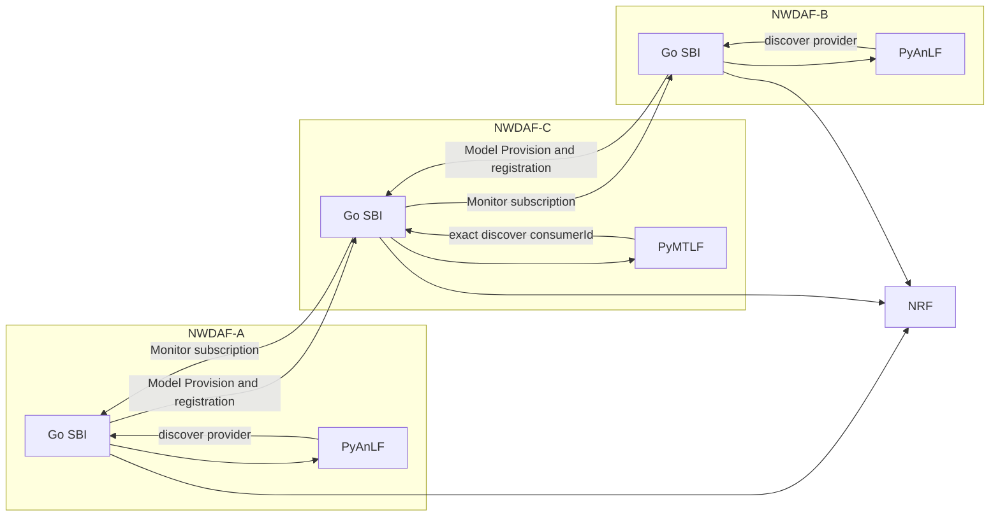
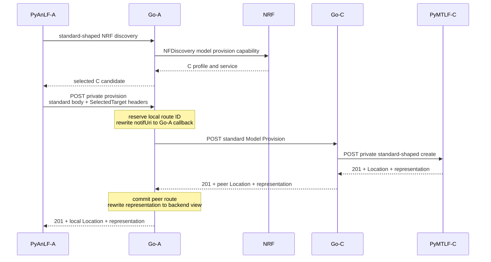
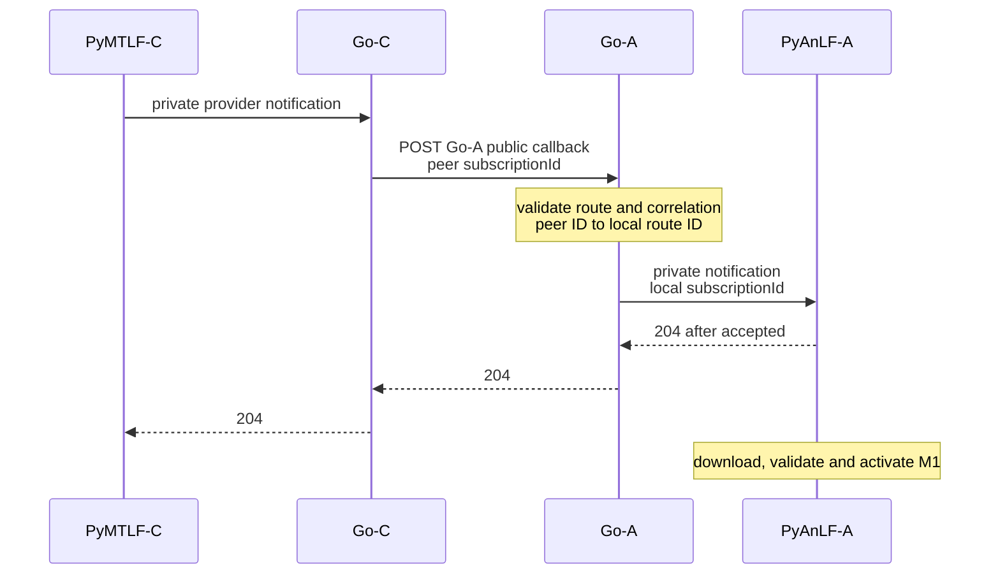
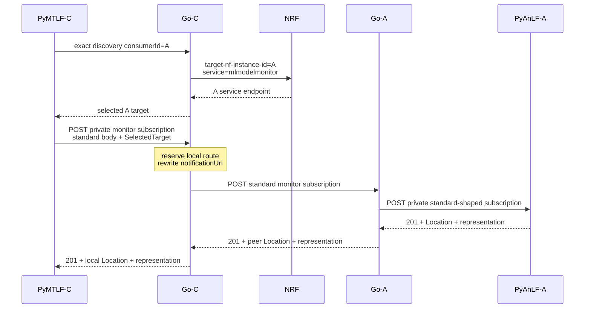
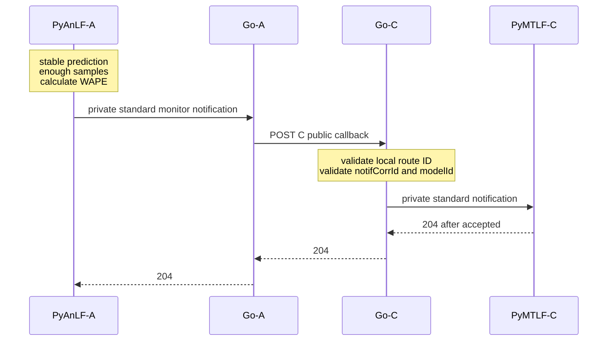

# Phase 2 Cross-NWDAF Model Provision And Monitoring Detailed Plan

日期：2026-07-29

狀態：實作與驗證完成

後續取代實作（2026-08-02）：本Phase記錄的`provider_namespace`、
fallback provider identity與`(provider_id, modelUniqueId)`private key已由
Pre-Phase 6 Python backend configuration checkpoint移除。正式model identity
改為numeric `modelUniqueId`；provider NWDAF `nfInstanceId`只保留為
Model Provision／Monitor route context。本文其餘內容保留當時實作歷史。

併發修正補充（2026-08-13）：full-core teardown 證明目前 NWDAF
實作仍會在持有全域 `mlModelMu` 時執行 peer／backend HTTP，偏離本文
§17 已核准的「network call 不持有全域 route mutex」與 revision guard。修正範圍、狀態轉移及
驗收測試記錄於
[NWDAF 跨節點 ML Model Route 併發修正計畫](code-reviews/NWDAF%20Cross-Node%20ML%20Model%20Route%20Concurrency%20Remediation%20Plan.md)。

上層計畫：

- [Distributed NWDAF Federated Learning Implementation Plan](./Distributed%20NWDAF%20Federated%20Learning%20Implementation%20Plan.md)

相關設計、規格解讀與政策：

- [Distributed NWDAF Model Monitoring and Federated Retraining Architecture](../../design/Distributed%20NWDAF%20Model%20Monitoring%20And%20Federated%20Retraining%20Architecture.md)
- [NWDAF AnLF／MTLF Current Feature Architecture](../../design/Current%20AnLF%20MTLF%20Feature%20Architecture.md)
- [NWDAF Federated Learning Release 18 規格解讀](../../specification-guides/NWDAF%20Federated%20Learning%20Release%2018%20規格解讀.md)
- [Phase 0 Release 18 Contract Foundation Detailed Plan](./Phase%200%20Release%2018%20Contract%20Foundation%20Detailed%20Plan.md)
- [Phase 1 Role-Aware Deployment And NRF Foundation Detailed Plan](./Phase%201%20Role-Aware%20Deployment%20And%20NRF%20Foundation%20Detailed%20Plan.md)
- [NWDAF Development Policy](../../development_policy.md)

實作 repositories：

- `NWDAF/`
- `PyAnLF/`
- `PyMTLF/`
- `nwdaf-resources/`
- `nwdaf-docs/`

Phase 2 不預期修改 `nrf/`；但會以 Phase 1 的 team NRF fork 執行
registration、discovery 與 regression tests。

---

## 1. 目的

Phase 2 要把目前只在單一 NWDAF 內成立的 Model Provision 與 Model
Monitor 流程，擴充為 A、B、C 三個 NWDAF 間的標準服務互動：

- NWDAF-A 與 NWDAF-B 提供 `UE_COMMUNICATION` analytics；
- NWDAF-C 擁有初始模型 M1，提供 Model Provision；
- A、B 在沒有可用模型時，經 Go 向 NRF 發現 C；
- A、B 向 C 建立標準 Model Provision subscription，取得並啟用 M1；
- A、B 啟用模型後，向 C 建立標準 Model Monitor registration；
- C 從 registration 的 `consumerId` 得知使用模型的 NWDAF 身分；
- C 經 Go 對 NRF 做 exact discovery，找到 A、B 的
  `nnwdaf-mlmodelmonitor` endpoint；
- C 分別向 A、B 建立 Model Monitor subscription；
- A、B 在具備穩定預測與 WAPE 計算條件後，分別向 C 回報
  `deviation`；
- C 保留兩個 analytics scope 的獨立監控狀態。

本 Phase 完成後，跨 NWDAF 的模型取得與 accuracy monitoring 閉環必須
成立，但不開始 FL round，不建立 Model Training subscription，也不執行
FedAvg。

---

## 2. Branch、baseline 與 repository 邊界

### 2.1 Branch strategy

沿用 federated-learning workstream 的長期 branch：

| Repository | Branch |
| --- | --- |
| `NWDAF/` | `feat/r18-federated-learning` |
| `PyAnLF/` | `feat/r18-federated-learning` |
| `PyMTLF/` | `feat/r18-federated-learning` |
| `nwdaf-resources/` | `feat/r18-federated-learning` |
| `nrf/` | `feat/r18-nwdaf-discovery` |
| `nwdaf-docs/` | `main` |

不建立以 Phase 命名的 implementation branch。各 repository 獨立
commit、獨立驗證，不混合 commit。

### 2.2 Plan baseline

| Repository | Baseline |
| --- | --- |
| `NWDAF/` | `634865e` |
| `PyAnLF/` | `4de985d` |
| `PyMTLF/` | `77519ae` |
| `nwdaf-resources/` | `f7a7ba5` |
| `nrf/` | `e5d6df3` |
| `nwdaf-docs/` | `d91b236` |

開始實作前仍須重新檢查各 repository status，保留所有不屬於本工作單元
的既有變更。

### 2.3 Repository responsibilities

| Repository | Phase 2 responsibility |
| --- | --- |
| `NWDAF/` | 標準 SBI producer／consumer、NRF discovery、remote resource route、callback relay、sync projection |
| `PyAnLF/` | model demand、provider selection、模型啟用、registration、WAPE report |
| `PyMTLF/` | C 的 seed/latest model provision、registration ownership、A/B exact discovery、monitor subscription reconcile、accuracy state |
| `nwdaf-resources/` | A/B/C profiles、seed artifact、multi-process vertical test 與操作說明 |
| `nrf/` | 不新增功能；只提供既有 Release 18 registration／discovery 能力 |
| `nwdaf-docs/` | 計畫、進度、行為差異與驗證證據 |

`resources/`、SMF、UPF、ADRF 與 UDM 不在本 Phase 的修改範圍。

---

## 3. 已確立的設計約束

### 3.1 Go、PyAnLF 與 PyMTLF 的責任

Go NWDAF：

- 對外提供標準 SBI；
- 接受 backend 的 standard-shaped request；
- 經 NRF 找到 peer，或接受 backend 已選定的 target；
- 將標準 request relay 到 peer NWDAF；
- 保存 local route 與 peer resource 的對應；
- 依 callback route 與 correlation 將通知送回正確 backend；
- 不決定模型是否可重用；
- 不計算 WAPE；
- 不判斷 degradation；
- 不擁有 seed model 或 model catalog。

PyAnLF：

- 根據 analytics demand 決定是否需要模型；
- 決定是否可重用目前 active model；
- 透過既有通用 NRF discovery edge 選擇 model provider；
- 模型下載與啟用成功後才建立 monitor registration；
- 在穩定預測且具備足夠資料時回報 WAPE；
- 同一模型可供多個相容 analytics demand 共用，但各 monitoring scope
  仍維持獨立。

PyMTLF：

- 在 C 擁有 seed/latest model；
- 回應 Model Provision subscription；
- 接受 A、B 的 Model Monitor registration；
- 依 `consumerId` exact discover A、B；
- 對 A、B 建立並維護 Model Monitor subscription；
- 保存各 scope 的 WAPE 與 degradation 狀態；
- 本 Phase 只記錄 retrain eligibility，不啟動 FL。

### 3.2 標準 body 與私有 routing metadata 分離

Go ↔ backend 的 Model Provision／Model Monitor request body 必須沿用
Release 18 OpenAPI 欄位名稱與 JSON shape，不可包成自訂 envelope，也不可
新增 `modelProviderId`、`targetApiRoot` 等非標準 body 欄位。

只有 Go 才需要的 peer selection 資訊，使用 private HTTP metadata 傳遞。
第一版定義下列 request headers：

| Header | Meaning |
| --- | --- |
| `X-NWDAF-Target-Nf-Instance-Id` | 選定 peer 的 `nfInstanceId` |
| `X-NWDAF-Target-Nf-Service-Instance-Id` | 選定 NFService instance |
| `X-NWDAF-Target-Api-Root` | 選定 service 的 absolute API root |
| `X-NWDAF-Target-Selection-Source` | `NRF` 或 `CONFIGURED` |

約束：

- body 保持標準 shape；
- header 只存在於 containing Go 與其 backend 的 private boundary；
- peer NWDAF 不會收到這些 header；
- route 所屬 service 已由 private path 確定，不另傳一個可互相矛盾的
  service-name header；
- Go 必須一次驗證所有 required target headers，不能只信任 API root；
- URL 不可反向推導成 provider identity；
- provider identity 來自 selected NRF candidate 或明確 configured
  identity。

### 3.3 不新增 Go package

本 Phase 只擴充既有 package：

- `NWDAF/internal/context`
- `NWDAF/internal/backend`
- `NWDAF/internal/sbi/consumer`
- `NWDAF/internal/sbi/processor`
- `NWDAF/internal/sbi/handler`
- `NWDAF/internal/anlf`
- `NWDAF/internal/mtlf`
- `NWDAF/pkg/service`

若實作過程發現必須新增 package，必須先依 Development Policy 的 New Go
Package Gate 紀錄：

- owner；
- lifecycle；
- dependency direction；
- failure semantics；
- restart semantics；
- 為什麼既有 package 無法承擔。

未完成此紀錄前不得建立新 package。

### 3.4 Plain HTTP profile

本實驗 profile 使用普通 HTTP。Phase 2 不處理：

- TLS certificate；
- OAuth token exchange；
- callback sender 的 cryptographic authentication；
- Python process 取得 free5GC trust identity。

仍必須做邏輯驗證：

- callback route ID 存在；
- correlation 完全相符；
- notification 對應 active peer resource；
- selected target 的 NF、service 與 API root 一致；
- redirect 與 Location 是合法 HTTP(S) URI；
- 不接受帶 userinfo 的 URI；
- 不允許 HTTPS 降級為 HTTP。

這些驗證不能被描述為 sender authentication。

---

## 4. Normative evidence 與專案 profile

### 4.1 Model Provision resource

主要 Stage 3 證據：

- [TS 29.520 Nnwdaf MLModelProvision OpenAPI](../../../specs/openapi/TS29520_Nnwdaf_MLModelProvision.yaml)
- [TS 29.520 MLModelProvision HTTP resources](../../../specs/TS%2029.520/5%20API%20Definitions/5.4%20Nnwdaf_MLModelProvision%20Service%20API/5.4.3%20Resources.md)
- [TS 29.520 MLModelProvision notifications](../../../specs/TS%2029.520/5%20API%20Definitions/5.4%20Nnwdaf_MLModelProvision%20Service%20API/5.4.5%20Notifications.md)
- [TS 29.520 MLModelProvision feature negotiation](../../../specs/TS%2029.520/5%20API%20Definitions/5.4%20Nnwdaf_MLModelProvision%20Service%20API/5.4.8%20Feature%20negotiation.md)
- [TS 23.288 §6.2A Model Provision procedures](../../../specs/TS%2023.288/6%20Procedures%20to%20Support%20Network%20Data%20Analytics/6.2A%20Procedure%20for%20ML%20Model%20Provisioning.md)

標準 resource behavior：

| Operation | Success |
| --- | --- |
| `POST /nnwdaf-mlmodelprovision/v1/subscriptions` | `201`、required `Location`、created representation |
| `PUT /subscriptions/{subscriptionId}` | `200` + representation，或 `204` |
| `DELETE /subscriptions/{subscriptionId}` | `204` |
| provider → `notifUri` callback `POST` | consumer 接受後回 `204` |

Create request `NwdafMLModelProvSubsc` 至少包含：

- `mLEventSubscs`；
- `notifUri`。

每個 `MLEventSubscription` 至少包含：

- `mLEvent`；
- `mLEventFilter`。

Provider notification：

- 包含 `eventNotifs`；
- 包含 provider resource 的 `subscriptionId`；
- 每個 model event 使用 `mLFileAddr` 或 `mLModelAdrf` 表示模型取得方式；
- 正式模型使用 `modelUniqueId`；
- callback correlation 使用標準欄位，不增加私有 provider 欄位。

### 4.2 Model Provision supported features

本專案 Phase 2 使用 URL model address，因此 A、B 要求
`ModelProvisionExt` feature。

行為：

- PyAnLF create request 的 `suppFeats` 宣告此需求；
- C PyMTLF 回應 negotiated feature intersection；
- A、B 在回應未包含 required feature 時不得直接啟用 URL model；
- supported-feature bitmask 由 feature number helper 產生，不在多處硬編碼
  magic string；
- Phase 2 不使用 inline model binary；
- Phase 2 不要求 ADRF model reference。

正式 seed M1 必須同時有：

- numeric `modelUniqueId`；
- immutable artifact URL；
- 可由 A、B 驗證的 bundle digest／manifest；
- 與 `UE_COMMUNICATION` demand 相容的 event、filter、target
  applicability。

### 4.3 Model Monitor registration

主要 Stage 3 證據：

- [TS 29.520 Nnwdaf MLModelMonitor OpenAPI](../../../specs/openapi/TS29520_Nnwdaf_MLModelMonitor.yaml)
- [TS 29.520 MLModelMonitor HTTP resources](../../../specs/TS%2029.520/5%20API%20Definitions/5.6%20Nnwdaf_MLModelMonitor%20Service%20API/5.6.3%20Resources.md)
- [TS 29.520 MLModelMonitor notifications](../../../specs/TS%2029.520/5%20API%20Definitions/5.6%20Nnwdaf_MLModelMonitor%20Service%20API/5.6.5%20Notifications.md)
- [TS 23.288 §6.2E Model Accuracy Monitoring procedures](../../../specs/TS%2023.288/6%20Procedures%20to%20Support%20Network%20Data%20Analytics/6.2E%20MTLF-based%20ML%20Model%20Accuracy%20Monitoring.md)

Registration create：

```text
POST /nnwdaf-mlmodelmonitor/v1/registrations
```

成功回應：

- `201`；
- required `Location`；
- created `MLModelMonitorReg` representation。

`MLModelMonitorReg`：

- `modelId` required；
- `consumerId` 與 `consumerSetId` exactly one；
- 本情境使用 `consumerId`；
- `consumerId` 是使用模型的 containing NWDAF `nfInstanceId`；
- event、target 與 filter 保留標準欄位，用來區分 monitoring scope。

刪除 registration：

```text
DELETE /nnwdaf-mlmodelmonitor/v1/registrations/{registrationId}
```

成功回 `204`。

### 4.4 Model Monitor subscription 與 notification

C 向 A 或 B 建立：

```text
POST /nnwdaf-mlmodelmonitor/v1/subscriptions
```

`MLModelMonitorSub` 至少包含：

- `modelIds`；
- `notificationUri`；
- `notifCorrId`。

A/B notification：

- 回傳同一 `notifCorrId`；
- 使用 `modelAccuInfos`；
- `modelId` 對應 active model；
- 本專案把 WAPE 放在標準 `deviation`；
- `inferenceNum` 在可取得時一併回報；
- 不新增 `modelMetric: WAPE`，因 WAPE 是本專案計算政策，不是該欄位的
  標準 enum 值；
- 尚未達到穩定預測或最小 sample 條件時，不送假資料、不送
  `deviation=0`。

### 4.5 Status code evidence

外部 SBI 必須依各自 OpenAPI operation 宣告的 status code：

| Situation | Go-facing behavior |
| --- | --- |
| valid create | `201` + required `Location` + representation |
| valid replace | operation 宣告的 `200` + body 或 `204` |
| valid delete | `204` |
| valid callback | `204` |
| malformed standard body／path／selected private metadata | `400 ProblemDetails` |
| local resource not found | `404 ProblemDetails` |
| required backend unavailable | `503 ProblemDetails` |
| NRF temporarily unavailable | `503 ProblemDetails` |
| exact target does not exist／does not expose required service | `404 ProblemDetails` |
| selected peer connection／timeout failure | `503 ProblemDetails` |
| peer success response malformed、missing Location or wrong media type | `502 ProblemDetails` |
| local route commit failure | `500 ProblemDetails`，並執行 compensation |
| declared redirect | 保留 method/body 並處理 `307`／`308` |

Private backend edge 可傳回相同的標準 `ProblemDetails`。不得將所有 peer
錯誤壓成 `500`，也不得因 private route 就改用非標準 error envelope。

### 4.6 Stage 2 與 Stage 3 的區分

TS 23.288 描述的是服務程序與參與角色；TS 29.520 OpenAPI 定義實際 HTTP
resource contract。Phase 2 的 implementation 以 OpenAPI method、body、
status、Location 與 callback schema 為直接 contract，再以 TS 23.288
確認角色與程序意圖。

若 TS 敘述中有「可提供 provider information」但 Release 18 OpenAPI body
沒有對應欄位，本專案不自行新增 wire 欄位。provider identity 改由：

1. NRF discovery result；
2. private selected-target metadata；
3. Go route state

共同維護。

---

## 5. 現況盤點

### 5.1 已存在的能力

Go NWDAF：

- 已提供 public Model Provision 與 Model Monitor SBI；
- 已提供 PyAnLF／PyMTLF 使用的 standard-shaped private routes；
- 已保存 local provision subscription、monitor registration 與 monitor
  subscription route；
- 已能 relay local backend notification；
- 已有 backend standard HTTP transport 與 sync snapshot；
- 已有通用 NRF discovery auxiliary edge；
- 已能查詢指定 service、ML analytics capability 與 exact
  `target-nf-instance-id`；
- 已有 SMF standard proxy 可作為 peer Location、compensation 與 CRUD
  route 的 local exemplar。

PyAnLF：

- 已有 model demand coordinator；
- 已有 Model Provision subscription reconciler；
- 已有 Phase 1 `ModelProviderResolver`，支援 NRF 與 configured mode；
- 已有 artifact download、validation 與 activation；
- 已有 Model Monitor registration reconciler；
- 已有 WAPE 計算、穩定回報與 scope 隔離；
- 已有 Go sync restore。

PyMTLF：

- `fl_server` runtime 已掛載 Model Provision 與 Model Monitor；
- 已有 seed/latest model catalog；
- 已有 immutable artifact repository；
- 已能接受 registration；
- 已有 monitor subscription reconciler；
- 已有 callback delivery、retry 與 accuracy policy；
- seed model 已由 PyMTLF 擁有，不由 PyAnLF 內建。

Phase 1：

- A、B、C 已有獨立穩定 `nfInstanceId`；
- A、B 註冊 Model Monitor 與 `FL_CLIENT` 能力；
- C 註冊 Model Provision、Model Monitor 與 `FL_SERVER` 能力；
- NRF 能 lossless 保存、回傳與篩選 `mlAnalyticsList`；
- Go auxiliary discovery 已可供 PyAnLF、PyMTLF 共用。

### 5.2 直接缺口

目前 Model Provision／Monitor route 仍只代表 containing NWDAF 內部關係：

- A 的 PyAnLF create 只會被 A Go 送到 A PyMTLF；
- C PyMTLF 建立 monitor subscription 只會被 C Go 送到 C PyAnLF；
- route ID 直接等同 local backend resource ID；
- route record 沒有 target NF、service instance、API root 或 peer
  `Location`；
- replace／delete 無法對遠端 resource 操作；
- public callback 沒有可定位 local outbound route 的 route ID；
- current generated Model Provision consumer 會遺失 Release 18 body 欄位與
  peer representation，不適合直接延伸；
- `ResourceIDFromLocation` 要求 UUIDv4，不適用於 opaque peer resource；
- sync snapshot 不包含 peer target 與 peer resource；
- PyAnLF provider ownership 仍依賴 local `provider_namespace`／早期
  custom provider identity；
- PyAnLF 已建立 resolver，但 demand coordinator 尚未使用 resolver 的
  selected target；
- PyMTLF reconciler 尚未依 registration `consumerId` exact discover
  remote A/B；
- configured provider mode 使用 placeholder identity，無法作為可靠 route
  ownership。

### 5.3 必須保留的既有行為

移植成 remote flow 時不得改壞：

- PyAnLF model family／applicability matching；
- 同一相容模型 demand 的共用與 refcount；
- artifact digest、bundle validation 與 activation safety；
- 模型 ready 後才建立 registration；
- WAPE 的計算公式；
- stable prediction／minimum sample gate；
- PyMTLF degradation policy 與 retrain-in-flight guard；
- callback retry、coalescing 與 revision guard；
- backend restart sync 與 unconfirmed-create reconciliation；
- single-NWDAF local regression。

Remote transport 只是改變 resource owner 所在 NWDAF，不得順帶重寫上述
業務邏輯。

---

## 6. Target architecture

### 6.1 Role topology



### 6.2 Resource direction

每個 Go route 都要明確區分：

| Direction | Meaning |
| --- | --- |
| `INBOUND` | peer／external consumer 在此 NWDAF 建立 resource；local backend 是 provider |
| `OUTBOUND` | local backend 經此 NWDAF 在 peer 建立 resource；peer 是 provider |

範例：

| NWDAF | Resource | Direction |
| --- | --- | --- |
| A | A PyAnLF 向 C 建立的 Model Provision subscription route | `OUTBOUND` |
| C | A 在 C 建立的 Model Provision resource | `INBOUND` |
| A | A 向 C 建立的 Monitor registration route | `OUTBOUND` |
| C | A 的 Monitor registration | `INBOUND` |
| C | C 向 A 建立的 Monitor subscription route | `OUTBOUND` |
| A | C 在 A 建立的 Monitor subscription | `INBOUND` |

相同 UUID 字串即使出現在不同 NWDAF、不同 service 或不同 direction，
也不可被視為同一個 resource。

### 6.3 Route identity、provider identity 與 model identity

三種 identity 必須分開：

| Identity | Owner | Purpose |
| --- | --- | --- |
| local route ID | containing Go | backend replace/delete、callback routing、sync |
| provider／consumer NF identity | NRF NF profile | peer selection、ownership、exact discovery |
| `modelUniqueId` | model provider PyMTLF | 正式模型版本識別 |

禁止：

- 用 peer subscription ID 取代 local route ID；
- 用 URL hostname 取代 `nfInstanceId`；
- 用 `modelUniqueId` 找 Model Provision subscription；
- 用 registration ID 當作 consumer NF identity；
- 將 provider namespace 傳進標準 wire body。

---

## 7. Peer-resource route model

### 7.1 Common selected target

Go 內部沿用既有 package 定義共用 `SelectedTarget` value，至少保存：

```text
SelectedTarget
├── nfInstanceId
├── nfServiceInstanceId
├── serviceName
├── apiRoot
└── selectionSource
```

Validation：

- `nfInstanceId` 是 UUID；
- `nfServiceInstanceId` 非空；
- `serviceName` 必須和 private route 的預期 service 相同；
- `apiRoot` 是 absolute HTTP(S) URI；
- API root 不含 query、fragment 或 userinfo；
- `NRF` source 必須可和 discovery result 對上；
- `CONFIGURED` source 必須由 config 提供真實且穩定的
  `nfInstanceId`、service instance ID 與 endpoint，不再產生 placeholder
  identity。

### 7.2 Common peer route fields

Provision、registration 與 subscription route 在既有
`internal/context` record 中加入共用 peer fields：

```text
PeerRoute
├── localRouteId
├── direction
├── resourceKind
├── selectedTarget
├── peerLocation
├── peerResourceIdHint
├── originalCallbackUri
├── publicCallbackUri
├── backendCallbackUri
├── correlationId
├── acceptedRepresentation
├── backendRepresentation
├── lifecycleState
└── processGeneration
```

說明：

- `localRouteId`：Go 產生的 UUIDv4，backend 永遠只操作它；
- `peerLocation`：peer `201` 回應的 absolute resolved Location，replace／
  delete 的唯一權威 target；
- `peerResourceIdHint`：只供 log／validation，不能作 map key；
- `originalCallbackUri`：inbound external resource 的真正 callback；
- `publicCallbackUri`：outbound request 交給 peer 的 containing Go callback；
- `backendCallbackUri`：Go relay 到 backend 的 private callback；
- `correlationId`：只保存該標準 resource 定義的 correlation；
- `lifecycleState`：`CREATING`、`ACTIVE`、`REPLACING`、
  `DELETING`、`PENDING_CLEANUP`；
- `processGeneration`：防止 backend restart 前後的 stale route 被誤認。

各 resource 的現有特殊欄位繼續留在原 record：

- provision accepted representation；
- registration owner；
- monitor subscription `ownerRegistrationId`；
- notification-specific representation。

不建立一個混合所有 resource schema 的巨大 generic store。

### 7.3 Local Location

Private backend create 回應的 `Location` 使用 local route ID：

```text
/internal/v1/.../{localRouteId}
```

backend 不會看到 peer resource ID，也不直接保存 peer Location。這可確保：

- 不同 peer 回傳相同 subscription ID 時不衝突；
- peer 未使用 UUID 時仍可操作；
- remote resource topology 不洩漏成 backend state；
- Go 可在 replace／delete 前重新驗證 route ownership。

### 7.4 Peer Location handling

Go 收到 peer `201`：

1. 確認 `Location` header 存在；
2. 以 final effective request URI resolve relative Location；
3. 確認為 HTTP(S)；
4. 拒絕 userinfo、fragment 與無 host URI；
5. 保存完整 absolute Location；
6. 不要求最後 path segment 是 UUID；
7. 不自行重建 `/subscriptions/{id}`；
8. 後續 PUT／DELETE 只使用保存的 Location。

若 peer 回 `201` 但 body、media type 或 Location 不合法：

1. 嘗試對 resolved peer resource 做 bounded compensation DELETE；
2. compensation 成功後不保存 active route；
3. compensation 失敗則保存 `PENDING_CLEANUP`；
4. `PENDING_CLEANUP` 不投影成 backend active resource；
5. cleanup reconciler 重試後才移除。

### 7.5 Redirect

Model Provision／Monitor OpenAPI 宣告 `307`／`308`。Outbound client：

- 最多 follow 三次；
- 保留原 method 與 body；
- 每次要求合法 `Location`；
- 拒絕 URI userinfo；
- 不允許 HTTPS → HTTP downgrade；
- 最終 effective URI 與 peer Location 一併保存；
- `307` 只影響該次 request；
- `308` 可更新該 route 的 peer Location；
- 不因 redirect target host 改變就改寫 selected `nfInstanceId`；
- 超過上限或 redirect 無效時回 declared failure，而不是無限 loop。

---

## 8. Callback design

### 8.1 Public callback routes

Outbound remote resource 的 callback 必須先回到 containing Go。使用既有
SBI server 與 handler／processor 分層增加 callback routes，不建立新
service package：

```text
POST /nnwdaf-callback/v1/ml-model-provision/{localRouteId}
POST /nnwdaf-callback/v1/ml-model-monitor/{localRouteId}
```

這些路徑是 NWDAF 自己作為 consumer 時提供的 callback URI，不是假裝成
新的標準 service resource。callback body 完全使用對應 OpenAPI schema。

### 8.2 Provision callback

C 發出的 Model Provision notification 包含 C resource 的
`subscriptionId`。A/B Go：

1. 以 callback path 的 `localRouteId` 找 outbound route；
2. 驗證 route kind 與 direction；
3. 驗證 route active；
4. 若 peer Location 可抽取 resource ID，檢查 body `subscriptionId`
   和 peer resource 對應；
5. 驗證標準 correlation；
6. 將 notification 的 `subscriptionId` 改成 local route ID；
7. relay 到 PyAnLF private callback；
8. 只有 PyAnLF 接受後才對 C 回 `204`。

這個 ID rewrite 是 containing Go 的 routing adapter，不改變 peer 間的
標準 contract。

### 8.3 Monitor callback

A/B 發出的 Model Monitor notification 以 `notifCorrId` 識別。C Go：

1. 以 callback path `localRouteId` 找 outbound monitor subscription；
2. 驗證 route active；
3. 驗證 `notifCorrId` 完全相符；
4. 驗證 report 的 `modelId` 是 route 訂閱的 model；
5. relay 到 C PyMTLF；
6. 只有 PyMTLF 接受後才回 `204`。

Retired route、舊 correlation、錯誤 model ID 或 route-kind mismatch 都不得
進入 accuracy policy。

### 8.4 Callback failure

| Failure | Behavior |
| --- | --- |
| route 不存在 | `404 ProblemDetails` |
| route 尚未 active／backend syncing | `503 ProblemDetails` |
| correlation 或 model mismatch | `400 ProblemDetails` |
| backend unavailable | `503 ProblemDetails` |
| backend rejects standard body | 傳遞其 declared error |
| duplicate valid notification | backend 以 revision／idempotency guard 接受但不重複套用 |

Peer notification sender 保留現有 bounded retry。接收端不可先回 `204` 再
非同步丟失通知。

---

## 9. Slice 2A：Peer-resource route foundation

### 9.1 Characterization first

修改 route 結構前，先補 characterization tests：

- local Provision create／replace／delete；
- local registration create／delete；
- local monitor subscription create／replace／delete；
- backend notification callback；
- duplicate create／delete；
- backend restart sync；
- backend unavailable status；
- current correlation mismatch rejection。

用途是鎖定既有單 NWDAF 行為，remote route 實作不能讓 local mode 退化。

### 9.2 Go route changes

在既有 `internal/context` route stores：

- 由 Go 產生 local UUIDv4 route ID；
- 不再直接把 backend resource ID 當 route key；
- 加入 direction 與 common peer fields；
- 保留各 resource typed record；
- map lookup 以 local route ID；
- route state transition 在 context owner 內完成；
- processor 不直接操作裸 map；
- outbound network call 不持有不必要的 store-wide lock；
- `CREATING` reservation 防止 concurrent duplicate create；
- local record commit 與 peer create 之間有 compensation。

### 9.3 Standard outbound transport

擴充既有 `internal/sbi/consumer`，提供 lossless Model Provision／Monitor
remote operations：

- body 使用 Phase 0 compat model；
- JSON 不經 Release 17 generated type round-trip；
- status 與 media type 依 operation 驗證；
- 保存完整 peer representation；
- 支援 `201` Location；
- 支援 `200`／`204` replace；
- 支援 `204` delete；
- 支援 `307`／`308`；
- 解析 `ProblemDetails`；
- timeout、body size 與 redirect 有界。

不建立 `peerclient`、`subscriptionmanager` 或 `coordinator` 之類無明確
free5GC owner 的新 package。

### 9.4 SelectedTarget validation

Private create 前：

- handler 讀取 private headers；
- processor 將 headers 轉成 typed `SelectedTarget`；
- NRF source 可用既有 discovery cache／result 作 consistency check；
- configured source 只接受 config 已明確提供的 identity；
- service name 從 operation 固定；
- API root 必須對應選定 service；
- selected target 不放進 standard request body。

### 9.5 Sync contract

Go → backend sync snapshot 加入：

- local route ID；
- direction；
- resource kind；
- selected target；
- peer Location；
- lifecycle state；
- callback correlation；
- owner registration ID；
- accepted／backend representation；
- process generation。

Snapshot 不包含：

- model binary；
- dataset；
- WAPE buffer；
- PyMTLF accuracy-policy window；
- artifact download state；
- NRF cache 全量內容。

### 9.6 Slice 2A acceptance

- 同一 peer resource ID 可在兩個 target NF 同時存在；
- peer non-UUID Location 可 replace／delete；
- backend 只看到 local route ID；
- malformed `201` 觸發 compensation；
- selected-target body 未污染標準 JSON；
- sync round-trip 不遺失 peer route；
- local regression 全部保留。

---

## 10. Slice 2B：Remote Model Provision

### 10.1 PyAnLF provider resolution

把既有 `ModelProviderResolver` 接入 `ModelDemandCoordinator`：

1. analytics demand 出現；
2. 檢查是否已有相容 active model；
3. 若無模型，查 resolver；
4. NRF mode 透過 containing Go 的 generic discovery：
   - target NF type `NWDAF`；
   - required service `nnwdaf-mlmodelprovision`；
   - `mlAnalyticsIds` 包含 `UE_COMMUNICATION`；
   - interoperability 與 demand 一致；
5. deterministic 排序候選；
6. 第一版選排序後第一個 candidate；
7. 保存 selected provider identity 與 service API root；
8. 以 standard body + private selected-target headers 呼叫 A/B Go。

Candidate cache：

- 沿用 Phase 1 Go NRF cache；
- PyAnLF 只快取自己的 selected target／resolution state；
- 不在 sync snapshot 傳 ADRF 或全域 NRF cache；
- peer create 回 `404`／`503` 時，resolver 清除本地 candidate 並依既有
  bounded retry 再 discovery；
- 不在每次 reconcile 無條件重查 NRF。

### 10.2 Configured provider mode

PyAnLF configured mode config 改為：

```yaml
model_provider:
  mode: configured
  configured_target:
    nf_instance_id: "<uuid>"
    provision:
      nf_service_instance_id: "<provision-service-id>"
      api_root: "http://..."
    monitor:
      nf_service_instance_id: "<monitor-service-id>"
      api_root: "http://..."
```

規則：

- provider NF identity與兩個service entry required；
- Provision與Monitor必須使用各自真實的service instance identity；
- 兩個service可以共用origin，但不可以假裝是同一個service instance；
- 不再使用 `"configured-model-provider"` placeholder；
- configured mode 不要求該 peer 已在 NRF；
- endpoint 或 identity 寫錯視為實驗 config 錯誤；
- selected-target source 標為 `CONFIGURED`；
- NRF 與 configured mode 的後續 route 行為完全相同。

### 10.3 Create flow



Go-A request rewrite：

- 保存 PyAnLF original private callback；
- 對 C 的 standard `notifUri` 改成 Go-A public callback；
- 保留其餘標準欄位；
- 不改寫 event、filter、target、feature request；
- local route ID 在 peer POST 前先 reservation，因此 callback URI 穩定。

Go-C inbound behavior：

- 走既有 public handler → processor；
- 建立 C inbound local route；
- 將 callback 改成 C PyMTLF private callback；
- PyMTLF create 成功後回標準 `201`、Location 與 representation；
- Go-C 對 A 回 public C resource Location。

### 10.4 Seed model resolution

C PyMTLF：

- `fl_server` profile 載入 M1 seed；
- M1 由 PyMTLF artifact repository 擁有；
- Model Provision subscription 依現有 family/applicability matching；
- A、B 的 demand event/filter/target 相容時，取得同一 latest M1；
- AoI 不必讓 M1 分裂成兩個 model version；
- 正式 notification 包含 M1 `modelUniqueId` 與 immutable URL；
- `immRep` 要求 immediate report 時，create response／既有 delivery
  semantics 保留；
- 後續模型更新仍可在同一 subscription notification，但新模型訓練與
  promotion 不在 Phase 2。

### 10.5 Provision notification



Go-C 仍只做 standard relay，不檢查模型內容。PyAnLF 負責：

- supported feature；
- URL allowlist；
- timeout；
- digest；
- bundle manifest；
- family／applicability；
- atomic activation。

### 10.6 Replace and delete

PyAnLF 對 local route ID：

- PUT 時 Go-A 查 peer Location，relay 到 C；
- DELETE 時 Go-A 查 peer Location，relay 到 C；
- peer body 中若存在 resource identity，以 peer identity 對外；
- 回 PyAnLF 的 representation／Location 保持 local identity；
- peer `404` 表示 remote resource 已消失，Go 清除 local route；
- PyAnLF 將該 route 視為 terminal missing，清除後再 reconcile；
- peer timeout 不清 route，保留供 retry；
- 同一 demand 沒有變化時不重複 create。

### 10.7 Slice 2B acceptance

- A、B 經 NRF 找到 C；
- configured mode 也能指定 C；
- A、B 各建立一個 remote provision resource；
- C 看到兩個 inbound resources；
- A、B 取得同一 M1；
- A、B 完成 download、validation 與 activation；
- PUT／DELETE 使用 peer Location；
- custom `modelProviderId` 不出現在 wire JSON；
- C、A 或 B 暫時 unavailable 時依標準 status 與 bounded retry 恢復。

---

## 11. Slice 2C：Remote Monitor registration

### 11.1 Registration trigger

PyAnLF 只有在以下條件全部成立時建立 registration：

- provision notification 已接受；
- model bundle 已下載；
- manifest／digest 已驗證；
- model 已 atomic activate；
- selected provider route 仍 active；
- containing NWDAF identity 已從 Go sync 取得。

若 activation 失敗，不可先註冊「正在使用」該模型。

### 11.2 Registration body

A/B PyAnLF 使用標準 `MLModelMonitorReg`：

```json
{
  "modelId": 1,
  "consumerId": "<NWDAF-A nfInstanceId>",
  "modelAccuInd": true,
  "mLEvent": "UE_COMMUNICATION",
  "tgtUe": {
    "intGroupIds": ["group-1"]
  },
  "mLEventFilter": {
    "networkArea": {
      "tais": [
        {
          "plmnId": {
            "mcc": "001",
            "mnc": "01"
          },
          "tac": "000001"
        }
      ]
    }
  }
}
```

實際欄位以 Release 18 compat model 為準；範例只說明語意。

規則：

- A 使用 A 的 `nfInstanceId`；
- B 使用 B 的 `nfInstanceId`；
- 不使用 backend process ID；
- 不使用 consumer set；
- `modelId` 是 C 正式提供的 `modelUniqueId`；
- `modelAccuInd=true` 表示 A/B 可提供 model accuracy information；
- event／target／filter 描述實際 monitoring scope；
- 相同模型在不同 AoI／target 的 registration 仍為不同 scope。

### 11.3 Provider ownership

Registration target 必須來自該 active model 的 provision route：

```text
active model
  -> originating provision local route
  -> selected provider C
  -> C Model Monitor registration API root
```

若 C 的 Model Provision 與 Model Monitor 使用不同 service instance：

1. 以 C 的 `nfInstanceId` 做 exact discovery；
2. 要求 `nnwdaf-mlmodelmonitor`；
3. 選定 C 對應 service instance；
4. registration 仍屬於同一 provider NF identity。

不得假設 provision API root 直接把 path 換字串後就是 monitor API root。

### 11.4 Remote create and delete

流程和 Slice 2B 共用 peer route foundation：

- PyAnLF → A/B Go：standard registration + SelectedTarget headers；
- A/B Go → C Go：standard Model Monitor registration；
- C Go → C PyMTLF：standard-shaped private create；
- C 回 peer Location；
- A/B Go 回 local Location；
- PyAnLF 只保存 local registration route ID。

Delete：

- analytics demand refcount 降到零；
- 或 active model 被真正 retired；
- PyAnLF 先停止後續 report；
- 以 local registration ID 呼叫 Go；
- Go relay peer DELETE；
- 成功 `204` 後清 local route；
- peer `404` 清 local route並視為 terminal；
- 一個 scope 的 delete 不可刪除同模型的其他 scope。

### 11.5 C registration ownership

C PyMTLF registration store 保存：

- C local registration ID；
- `modelId`；
- `consumerId`；
- normalized event／target／filter scope；
- desired monitor subscription state；
- revision；
- active／deleting lifecycle。

它不保存 A/B 的 model binary，也不由 registration body推導 artifact。

### 11.6 Slice 2C acceptance

- A、B activation 前沒有 registration；
- activation 後各建立一個 C remote registration；
- C registration 的 `consumerId` 分別是 A、B NF instance ID；
- scope 可區分不同 AoI；
- provider ownership 不依賴 custom field；
- A delete 不影響 B；
- restart sync 後不重複 registration。

---

## 12. Slice 2D：C discovers A/B and subscribes

### 12.1 Exact discovery

C PyMTLF reconciler 收到 registration 後：

1. 讀 `consumerId`；
2. 呼叫 C Go generic NRF discovery edge；
3. query 指定：
   - target NF type `NWDAF`；
   - `target-nf-instance-id = consumerId`；
   - service `nnwdaf-mlmodelmonitor`；
   - matching ML analytics capability；
4. Go 先查通用 NRF cache；
5. cache miss／expired 才查 NRF；
6. 確認結果仍是 registration 指定的 NF；
7. 取 matching service instance 與 API root；
8. 建立 selected target。

找不到時：

- registration 仍接受並保存；
- monitor subscription state 為 pending；
- reconciler bounded polling；
- NRF unavailable 與 target not found 分別紀錄；
- 不刪 registration；
- 不產生 fake WAPE。

這延續「接受 consumer resource」與「下游資料／監控資源立即可用」分離的
既有決策。

### 12.2 Monitor subscription body

C PyMTLF 針對每個 registration 建立標準 subscription：

```json
{
  "modelIds": [1],
  "notificationUri": "http://nwdaf-c/nnwdaf-callback/v1/ml-model-monitor/<route-id>",
  "notifCorrId": "<stable-correlation>"
}
```

在 PyMTLF → Go private request 中：

- body 的 `notificationUri` 先是 PyMTLF private callback；
- Go-C reservation route 後改成 C public callback；
- `ownerRegistrationId` 是 private header／route metadata；
- `ownerRegistrationId` 不加入標準 external body；
- `notifCorrId` 是標準 correlation，對該 active subscription generation
  穩定。

### 12.3 Remote create



B 使用相同流程，但 route、correlation 與 scope 完全獨立。

### 12.4 A/B report gate

PyAnLF 對每個 active monitor subscription：

- 只讀該 subscription 指定的 model；
- 只讀對應 analytics scope 的 prediction／actual values；
- 保留既有 WAPE 公式；
- minimum sample 未達成時不回報；
- prediction 尚未穩定時不回報；
- actual denominator protection 沿用既有邏輯；
- 每次 report 使用該 subscription 的 `notifCorrId`；
- `deviation` 是 WAPE；
- `inferenceNum` 是該 interval 可採用的 inference count；
- report period 沿用 config；
- queue/buffer 滿時丟最舊資料，不讓 ingestion 因 buffer full 失敗。

### 12.5 Report flow



C PyMTLF：

- 以 subscription route 找 owner registration；
- 以 registration 找 normalized scope；
- 以 `modelId` + scope 保存 accuracy sample；
- A、B 的 WAPE 不合併成同一條時間序列；
- 任一 scope degradation 可使模型進入 retrain-eligible；
- Phase 2 只記錄此狀態，不建立 FL process。

### 12.6 Replace and reconciliation

若 registration representation 改變：

- model ID 或 scope 不變：必要時 PUT existing monitor subscription；
- model ID 改變：new-before-old；
- 先建立新 subscription／correlation；
- 新 subscription active 後才停止舊 report；
- 舊 subscription DELETE；
- old correlation 立刻 retired；
- delayed old callback 不進 accuracy state。

完整的「新模型 promotion 後重新 provision／重新 monitor」屬後續 Phase；
Phase 2 只完成同一 M1 relationship 的安全 replacement foundation。

### 12.7 Slice 2D acceptance

- C exact discover A、B；
- C 各建立一個 remote monitor subscription；
- A、B 接受各自 subscription；
- A、B 產生不同 `notifCorrId`；
- 兩筆 WAPE 進入 C 的不同 scope；
- insufficient data 不產生假 report；
- duplicate／old correlation 不重複影響 policy；
- A unavailable 時 B 繼續監控；
- exact target 恢復後 reconciler 自動補建。

---

## 13. Slice 2E：Restart、generation isolation 與 vertical E2E

### 13.1 Backend restart

Go process 存活、PyAnLF／PyMTLF restart：

1. Go 持續 polling backend health；
2. backend 重新連上；
3. Go 建立新的 process generation；
4. sync request 帶 active route snapshot；
5. backend restore desired／accepted state；
6. backend 對 unconfirmed create 做 reconcile；
7. resource 已存在時不重建；
8. peer `404` 時清 stale local route並重建；
9. sync 完成才進入 usable；
10. callback 在 backend syncing 期間回 `503`，讓 sender retry。

### 13.2 Go restart

本階段不持久化 Go route：

- Go restart 視為實驗重跑；
- peer 可能殘留 resource，不承諾自動接回；
- E2E runner teardown 必須清理；
- 文件不得宣稱 Go restart transparent recovery。

### 13.3 Generation isolation

每次 backend process connection 取得 generation。下列事件不得跨 generation
誤用：

- stale sync response；
- old unconfirmed create；
- old callback correlation；
- old active-model report；
- delete 完成後延遲抵達的 callback。

Route 只有在：

- route active；
- generation compatible；
- correlation match；
- model ID match

時才可送進 backend current state。

### 13.4 nwdaf-resources vertical test

擴充 distributed FL deployment：

```text
NRF
├── NWDAF-A Go + PyAnLF-A
├── NWDAF-B Go + PyAnLF-B
└── NWDAF-C Go + PyMTLF-C
```

Fixture：

- 固定 A、B、C `nfInstanceId`；
- A、B `UE_COMMUNICATION` analytics／monitor／FL client profile；
- C Model Provision／Monitor／FL server profile；
- C seed M1 bundle；
- immutable artifact URL；
- 同一 Internal Group ID；
- A 使用 TAI-1；
- B 使用 TAI-2；
- 可控制 prediction／actual sample stream；
- plain HTTP。

Test steps：

1. 啟動 NRF；
2. 啟動 C Go 與 PyMTLF-C；
3. 啟動 A/B Go 與 PyAnLF；
4. 等待三個 NF registration；
5. 對 A 建立 analytics subscription；
6. 對 B 建立相同 group、不同 AoI analytics subscription；
7. 驗證 A/B 經 NRF 選中 C；
8. 驗證 C 有兩個 provision resources；
9. 驗證 A/B 下載並 active 同一 M1；
10. 驗證 C 有 A/B registration；
11. 驗證 C exact discover A/B；
12. 驗證 A/B 各有一個 monitor subscription；
13. 注入足夠 sample；
14. 驗證 C 收到兩個 scope 的 WAPE；
15. restart PyAnLF-A，驗證 sync 後不重複 create；
16. restart PyMTLF-C，驗證 registration／subscription relationship restore；
17. 刪除 A analytics subscription；
18. 驗證 A relationship 清除、B 不受影響；
19. teardown 清除 peer resources；
20. 驗證 process 正常停止。

本 Phase E2E 不需要：

- SMF；
- UPF；
- UDM；
- ADRF；
- MongoDB training data；
- Model Training；
- FedAvg。

Analytics sample 可使用 support tooling 的 deterministic fixture，目的只在
驗證 model provision／monitor control plane 與 WAPE scope。

### 13.5 Existing regression

必須同時保留：

- Phase 1 profile／discovery assertions；
- single-NWDAF Model Provision E2E；
- single-NWDAF Model Monitor E2E；
- PyAnLF artifact／activation tests；
- PyMTLF model catalog／notification tests；
- backend sync tests；
- portable `make test` 或 repository canonical test target。

---

## 14. Detailed API mapping

### 14.1 A/B PyAnLF → containing Go

| Action | Body | Private metadata | Response identity |
| --- | --- | --- | --- |
| provision create | `NwdafMLModelProvSubsc` | C selected target | A/B local route |
| provision replace | standard representation | local route in path | A/B local route |
| provision delete | none | local route in path | none |
| registration create | `MLModelMonitorReg` | C selected target | A/B local route |
| registration delete | none | local route in path | none |
| monitor callback response | standard status | local inbound route | none |

### 14.2 C PyMTLF → containing Go

| Action | Body | Private metadata | Response identity |
| --- | --- | --- | --- |
| provider notification | standard provision notification | C inbound local route | none |
| monitor subscription create | `MLModelMonitorSub` | A/B selected target + owner registration | C local route |
| monitor subscription replace | standard representation | C local route | C local route |
| monitor subscription delete | none | C local route | none |
| monitor notification response | standard status | C outbound local route | none |

### 14.3 Go ↔ peer Go

只使用標準 service paths、headers、JSON body、Location、ProblemDetails 與
callback schema。Private selected-target／owner metadata 不跨 NWDAF。

---

## 15. Config changes

### 15.1 PyAnLF

新增／調整：

- `model_provider.mode`；
- configured target real identity；
- discovery retry／refresh；
- required Model Provision features；
- public callback base 由 containing Go sync；
- report interval、minimum samples 與 buffer size沿用既有設定。

移除：

- 以 `model_provision.provider_namespace` 代表 remote provider identity；
- placeholder configured NF identity；
- custom wire `modelProviderId` dependency。

Provider namespace 若仍用於 local catalog key，只能是 backend internal model
namespace，不可再當成 NRF NF identity。

### 15.2 PyMTLF

C `fl_server` profile：

- seed M1 descriptor；
- artifact repository/public URL；
- notification retry；
- exact consumer discovery retry；
- monitor report expectation；
- accuracy policy；
- containing Go private base URL。

A/B 的 PyMTLF `fl_client` 在 Phase 2 不參與 Model Provision／Monitor server
流程，不需 seed model。

### 15.3 NWDAF Go

沿用：

- public SBI scheme／register IPv4；
- backend endpoints；
- NRF URI；
- role-aware service profile；
- callback public base。

若現有 callback public base 無法可靠從 NF profile／config 取得，擴充既有
NWDAF config section；不得由 backend 猜測 container hostname。

### 15.4 nwdaf-resources

提供三份明確 profile：

- A：analytics + monitor + FL client；
- B：analytics + monitor + FL client；
- C：provision + monitor + FL server。

每份 config 需使用不同：

- `nfInstanceId`；
- Go SBI port；
- backend port；
- data／artifact directory；
- process log；
- callback base。

---

## 16. Failure and reconciliation matrix

| Failure | State retained | Retry owner | Recovery |
| --- | --- | --- | --- |
| NRF 暫時 unavailable | demand／registration | PyAnLF or PyMTLF reconciler | bounded rediscovery |
| target not found | demand／registration | backend reconciler | periodic exact discovery |
| peer connect timeout on create | local `CREATING` reservation only | backend reconciler after Go result | retry create with duplicate guard |
| peer `201` malformed | `PENDING_CLEANUP` if needed | Go cleanup reconciler | compensation DELETE |
| peer PUT timeout | active route | backend reconciler | retry same peer Location |
| peer DELETE timeout | deleting route | backend reconciler | retry same peer Location |
| peer resource `404` | local route removed | backend reconciler | recreate if still desired |
| local backend unavailable on callback | active route | peer sender | callback retry after `503` |
| callback correlation mismatch | active route unchanged | none | reject `400` and log |
| PyAnLF restart | Go route snapshot | Go sync + PyAnLF reconcile | restore without duplicate |
| PyMTLF restart | Go route snapshot + PyMTLF durable/domain state | Go sync + PyMTLF reconcile | restore subscriptions |
| Go restart | no durable route | experiment runner | full experiment rerun |

Retry log 必須包含：

- local route ID；
- resource kind；
- target `nfInstanceId`；
- target service instance；
- correlation；
- attempt；
- terminal／retryable classification。

不得在 log 印 model bytes、dataset 或完整 credential-bearing URI。

---

## 17. Concurrency and idempotency

### 17.1 Create

- local route ID 先產生；
- store 先建立 `CREATING` reservation；
- 相同 backend desired resource 同時 reconcile 時只能有一個 outbound
  create；
- network call 不長時間持有全域 route mutex；
- commit 時確認 reservation generation 仍相同；
- stale create response 必須 compensation，不可覆蓋新 route。

### 17.2 Replace

- 同一 route replace serialize；
- revision guard 防止較舊 PUT response 覆蓋新 representation；
- peer `200` body完整保存；
- peer `204` 保留 request 中的 accepted representation；
- replace 期間有效 callback 仍可依 active generation處理。

### 17.3 Delete

- delete idempotent；
- duplicate local delete 在 route 已消失時回標準 `404`；
- backend reconciler 將 peer `404` 視為 cleanup complete；
- route 進入 deleting 後不接受新的 report；
- delete A scope 不修改 B route。

### 17.4 Callback

- notification delivery 可重送；
- backend revision／correlation guard 使 duplicate 無副作用；
- Go 不以「已看過 request body hash」取代標準 identity；
- valid callback 只有 backend commit 後回 `204`。

---

## 18. Implementation file map

### 18.1 NWDAF

預期修改既有檔案／package：

- `internal/context/ml_model_routes.go`
  - typed peer route fields；
  - lifecycle transition；
  - local route ID；
- `internal/backend/contract.go`
  - sync snapshot extension；
- `internal/backend/standard_http.go`
  - opaque Location／redirect helpers；
- `internal/backend/nrf_discovery.go`
  - existing candidate consistency validation；
- `internal/sbi/consumer/`
  - lossless remote Model Provision／Monitor operations；
- `internal/sbi/processor/ml_model.go`
  - inbound/outbound route handling；
  - compensation；
  - ID rewrite；
- existing handler/router files
  - public callbacks；
- `internal/anlf/`、`internal/mtlf/`
  - private header constants／backend bridge；
- `pkg/service/init.go`
  - extended sync projections；
- config／factory tests
  - callback base and role validation。

舊 generated Release 17-only Model Provision consumer 若已無 caller，應在本
Phase 最後刪除；若仍有 caller，先轉移後再刪。不可同時保留兩套相互競爭的
remote transport。

### 18.2 PyAnLF

預期修改：

- `core/discovery.py`
  - configured real identity；
  - candidate invalidation；
- `core/model_demand.py`
  - resolver integration；
  - selected provider ownership；
  - required feature；
- registration reconciler
  - remote C selected target；
  - containing NF `consumerId`；
- sync state／models
  - selected target restore；
- config
  - configured target schema；
- tests
  - NRF/configured remote flow、reuse、delete、restart。

### 18.3 PyMTLF

預期修改：

- existing discovery core
  - exact consumer resolver；
- `core/monitor_reconciler.py`
  - registration → exact discovery → selected target；
- `core/monitor_store.py`
  - remote route projection；
- `api/ml_model_provision.py`
  - feature negotiation validation；
- `api/ml_model_monitor.py`
  - remote registration ownership；
- sync contract
  - selected target／route generation；
- config
  - exact discovery retry；
- tests
  - C provision、A/B registration、remote subscription、WAPE scope。

### 18.4 nwdaf-resources

預期修改：

- `deployments/distributed_fl/`
  - A/B/C configs；
  - M1 seed artifact fixture；
  - vertical runner；
  - deterministic WAPE sample injector；
  - assertions；
  - cleanup；
- README
  - prerequisites；
  - startup sequence；
  - expected evidence；
  - failure diagnostics；
  - no-SMF／UPF／ADRF scope。

---

## 19. Verification plan

### 19.1 NWDAF unit／component tests

- selected target header parse／validation；
- standard body lossless round-trip；
- same peer resource ID on different NF；
- non-UUID peer Location；
- relative Location resolve；
- `201` missing Location；
- malformed success body；
- compensation success／failure；
- `307`／`308`；
- PUT `200`／`204`；
- peer `404`／`503`；
- public callback route；
- provision peer-ID → local-ID rewrite；
- monitor correlation／model validation；
- sync snapshot round-trip；
- backend unavailable；
- concurrent create／replace／delete；
- local single-NWDAF characterization。

### 19.2 PyAnLF tests

- demand with active compatible model does not rediscover；
- demand without model discovers C；
- candidate selection deterministic；
- configured target validation；
- placeholder identity rejected；
- required Model Provision feature；
- notification activates M1；
- registration only after activation；
- `consumerId` equals containing NF instance ID；
- two scopes share model but not monitor state；
- stable prediction gate；
- WAPE uses `deviation`；
- delete refcount；
- sync/restart no duplicate；
- custom provider wire field absent。

### 19.3 PyMTLF tests

- seed/latest M1 provision；
- feature negotiation；
- two inbound provision resources return same M1；
- registration exact-one consumer identity；
- registration owner scope；
- exact NRF discovery by `consumerId`；
- target missing pending reconcile；
- remote monitor subscription create／delete；
- callback correlation；
- A/B WAPE isolation；
- stale correlation rejection；
- backend restart reconcile；
- retrain not started in Phase 2。

### 19.4 Contract tests

- request／response validate against local Release 18 OpenAPI schema；
- method、path、status、Location 與 media type；
- `ProblemDetails`；
- `suppFeats`；
- no private header crosses external peer；
- no custom JSON field；
- callback body schema；
- opaque Location。

### 19.5 Multi-process E2E

至少驗證：

- NRF registration；
- capability-filtered provider discovery；
- exact consumer discovery；
- real HTTP between A/B/C Go processes；
- real Go ↔ PyAnLF／PyMTLF processes；
- seed artifact download；
- active model；
- registration；
- monitor subscription；
- WAPE callback；
- backend restart；
- per-scope delete isolation。

---

## 20. Phase acceptance criteria

Phase 2 只有在以下全部成立時完成：

1. A、B 經 NRF 發現 C 的 Model Provision service；
2. configured provider mode 具有真實 stable identity；
3. A、B 對 C 建立標準 Model Provision subscription；
4. Go 保存 local route、selected target 與 peer Location；
5. C PyMTLF 提供 M1；
6. A、B 取得、驗證並啟用同一 M1；
7. A、B activation 後才向 C registration；
8. registration `consumerId` 是 A、B `nfInstanceId`；
9. C 依 `consumerId` exact discover A、B；
10. C 對 A、B 各建立標準 Model Monitor subscription；
11. A、B 只有在資料充分時回報 WAPE；
12. WAPE 透過標準 `deviation` 傳輸；
13. C 保留 A、B 兩個 scope；
14. A scope delete 不影響 B；
15. peer resource ID 不需要全域唯一；
16. replace／delete 使用 peer Location；
17. callback 使用 local route 與 correlation驗證；
18. backend restart 後不重複建立 resource；
19. Go restart limitation 已明確記錄；
20. local／distributed regression tests 都通過；
21. standard API 的 status、headers、body 與 ProblemDetails 通過 contract
    tests；
22. 沒有 `modelProviderId` 等自訂欄位進入標準 wire；
23. 沒有新增未通過 package gate 的 Go package；
24. Phase 3 Model Training／FedAvg 沒有混入本 Phase。

---

## 21. Explicitly deferred

Phase 2 不做：

- Model Training public SBI；
- FL preparation；
- FL client selection；
- round scheduling；
- local training；
- FedAvg；
- `sampleCount` weighted aggregation；
- final-model validation；
- model promotion；
- training workspace cleanup；
- ADRF training dataset retrieval；
- ADRF final model storage；
- SMF／UPF data collection；
- UDM group resolution；
- AoI-aware data-plane subscription；
- TLS／OAuth；
- persistent Go route recovery；
- priority／capacity based NWDAF selection；
- multi-provider failover beyond deterministic rediscovery；
- multiple completed-model tree or complex scope assignment。

其中 Model Training 與 FedAvg 由 Phase 3、4；final validation／promotion 由
Phase 5；package cleanup 與 final documentation由 Phase 6 處理。

---

## 22. Execution order

實作依下列順序完成，不在每個小 slice 自動 commit：

1. 補 local characterization tests；
2. 實作 typed peer route、SelectedTarget 與 sync contract；
3. 實作 lossless remote transport、Location、redirect 與 compensation；
4. 實作 public callbacks；
5. 接入 PyAnLF provider discovery 與 Remote Model Provision；
6. 完成 C seed M1 provision vertical path；
7. 實作 remote registration；
8. 接入 PyMTLF exact consumer discovery；
9. 實作 remote monitor subscription；
10. 完成 WAPE callback 與 scope isolation；
11. 完成 backend restart／generation tests；
12. 擴充 nwdaf-resources distributed vertical test；
13. 跑各 repository canonical tests；
14. 跑 contract tests；
15. 跑 A/B/C multi-process E2E；
16. review package boundary、standard contract、failure semantics 與 cleanup；
17. 更新主計畫 status、design current-state 與 E2E 文件；
18. 使用者確認後再按 repository 分別 commit。

---

## 23. Implementation handoff

本計畫已將 Phase 2 的主要架構決策固定：

- A/B 是 model consumer 與 monitor provider；
- C 是 model provider 與 monitor consumer；
- provider／consumer discovery 共用 Phase 1 Go NRF edge；
- standard body 不混入 routing metadata；
- Go 擁有 local-to-peer route；
- peer resource 以 Location 操作；
-正式模型由 C PyMTLF 擁有；
- accuracy report 使用 WAPE → `deviation`；
- monitoring scope 分離；
- backend restart 可 sync；
- Go restart 視為實驗重跑；
- Phase 2 不做 FL training。

因此開始實作前沒有架構性 blocking decision。若實作中出現以下情況，必須
停在該 technical boundary 更新計畫，而不是自行擴張：

- OpenAPI 與現有 compat model 無法表達 required standard field；
- 必須新增 Go package；
- 必須修改 NRF matcher；
- 必須依賴 SMF／UPF／ADRF 才能完成 acceptance；
- peer redirect 需要引入尚未同意的 TLS／OAuth identity policy；
- Go restart recovery 被提升為 requirement。

---

## 24. Implementation result

狀態：實作、code review remediation 與最終驗證皆已完成
（2026-07-29）。

Canonical review ledger：

- [Phase 2 Code Review Findings And Remediation Plan](./code-reviews/Phase%202%20Code%20Review%20Findings%20And%20Remediation%20Plan.md)

Canonical ledger 的registration owner identity、failed compensation、
callback ownership、configured service identity、完整WAPE E2E、
redirect persistence及accuracy scheduling findings皆已關閉。

### 24.1 完成範圍

- `NWDAF/` 建立跨 NWDAF Model Provision、Model Monitor registration、
  Model Monitor subscription 與 callback relay；Go 產生本地 UUIDv4，
  保存 selected target、peer `Location`、callback correlation、
  lifecycle 與 backend process generation。
- Go auxiliary edge 只以 private headers 傳遞 `SelectedTarget`，標準 peer
  body 沒有加入 routing 欄位；NRF source 會對照尚未過期的 Go discovery
  cache，configured source則使用 backend 已驗證的 stable identity。
- Go 對 create response 驗證 status、body、media type及 `Location`，
  replace／delete 使用完整 peer `Location`；create response contract
  失敗時嘗試 immediate compensation delete。Compensation 失敗時保留
  cleanup-only `PENDING_CLEANUP` route，由bounded retry reconciliation
  在peer回`204`或`404`後移除。
- 舊的Release 17 generated Model Provision consumer確認沒有production
  caller後已移除；跨NWDAF Provision與Monitor只保留
  `ml_model_peer_service.go`這一條lossless peer transport。
- Go public callback 以 local route ID接收 peer notification，驗證
  outbound direction、active lifecycle、selected target、backend process
  generation、correlation與model identity後才轉交正確backend；private
  routing headers不會送往peer。
- backend sync依local／remote resource與initiator建立乾淨projection：
  remote AnLF Provision／registration不會送入local PyMTLF，remote MTLF
  Monitor也不會送入local PyAnLF；route generation只由真正承載local
  resource或發起remote relationship的backend重建。Monitor owner在寫入
  route前一律normalize為Go registration route ID。
- `PyAnLF/` 依 Analytics ID、Model Provision service及 capability從NRF
  選出C，亦保留configured target模式；沒有可用模型時建立remote
  Model Provision demand，下載、驗證、啟用M1後才以自己的
  `nfInstanceId`作`consumerId`向C registration。
- `PyMTLF/` 由seed catalog提供M1；C對每個registration使用
  `consumerId`做exact NRF discovery，分別向A、B建立Model Monitor
  subscription，保存獨立registration、correlation與WAPE scope。
- Model Provision URL通知只在Feature 4完成協商時使用；未協商extension
  不會偷偷傳URL。
- `nwdaf-resources/` distributed runner現可啟動temporary MongoDB、team
  NRF、support-only fake SMF、三個Go NWDAF、PyAnLF-A/B及PyMTLF-A/B/C，
  建立同group、不同TAI的兩條analytics subscription，透過PyAnLF
  production UPF callback注入deterministic observation，並驗證完整
  prediction、ground-truth、WAPE與A/B到C的callback path。
- PyAnLF在有效WAPE尚未到monitor period時保留該measurement；下一個
  due period優先送WAPE而不是insufficient-data liveness，避免有效WAPE
  被週期性飢餓。

### 24.2 Final E2E 已證明的行為

1. A、B、C以不同`nfInstanceId`註冊NRF。
2. A、B經NRF找到C的Model Provision service。
3. A、B從C取得並啟用同一seed M1。
4. A、B分別向C建立registration。
5. C以各registration的`consumerId`exact discover A、B。
6. C建立兩條獨立monitor subscription與correlation。
7. runner以support fake SMF建立collection binding，再向PyAnLF-A/B
   production callback注入UPF-shaped observation。
8. A/B各自完成prediction／ground-truth pairing並產生`deviation` WAPE，
   經Go-A/B、Go-C送達PyMTLF-C的獨立scope。
9. PyMTLF-C意外重啟後由Go snapshot恢復，未重複建立peer resource；
   owner registration與subscription使用同一Go identity namespace。
10. PyAnLF-A意外重啟後重新啟用既有M1，
   未觀察到重複建立remote Provision、registration或monitor
   relationship。
11. 刪除A analytics subscription只移除A monitor route；A舊UPF callback
    回`404`，B仍可由新observation產生並回報WAPE。
12. Go停止後三個NWDAF profile皆從NRF deregister。

此runner使用support-only fake SMF，不啟動production SMF、UPF、UDM或
ADRF，也不宣稱驗證真實data-plane collection或FL training。

### 24.3 驗證紀錄

| Repository | Verification | Result |
| --- | --- | --- |
| `NWDAF/` | `go test ./...` | pass |
| `NWDAF/` | `go vet ./...` | pass |
| `NWDAF/` | `golangci-lint v2.11.4 run ./...` | pass, 0 issues |
| `PyAnLF/` | full `pytest` | pass, 253 passed／1 skipped |
| `PyAnLF/` | `ruff check src tests run.py` | pass |
| `PyMTLF/` | full `pytest` | pass, 143 passed |
| `PyMTLF/` | `ruff check src tests` | pass |
| `nwdaf-resources/` | Phase 2 preflight及distributed deployment ruff | pass |
| `nwdaf-resources/` | isolated A/B/C multi-process E2E | pass |

原本的`golangci-lint v2.8.0` binary是以Go 1.25建置，無法分析要求
Go 1.26的NWDAF module。本次已升級為以Go 1.26.2建置的
`golangci-lint v2.11.4`，修正其findings後以0 issues通過。
