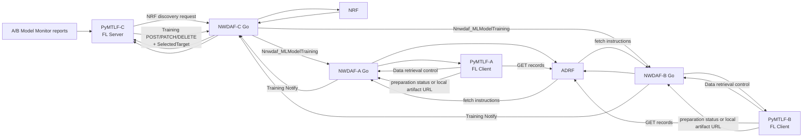
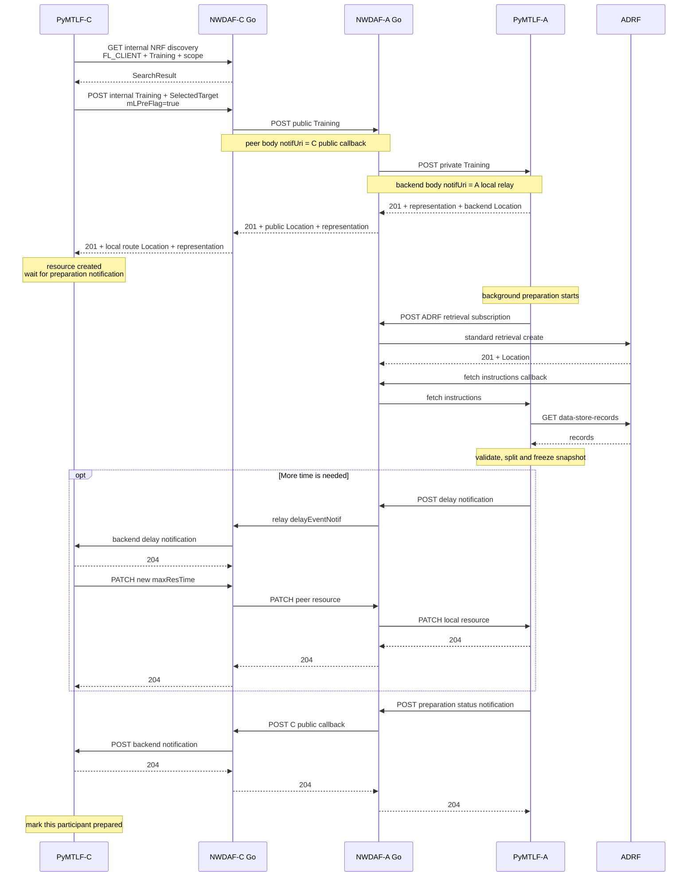
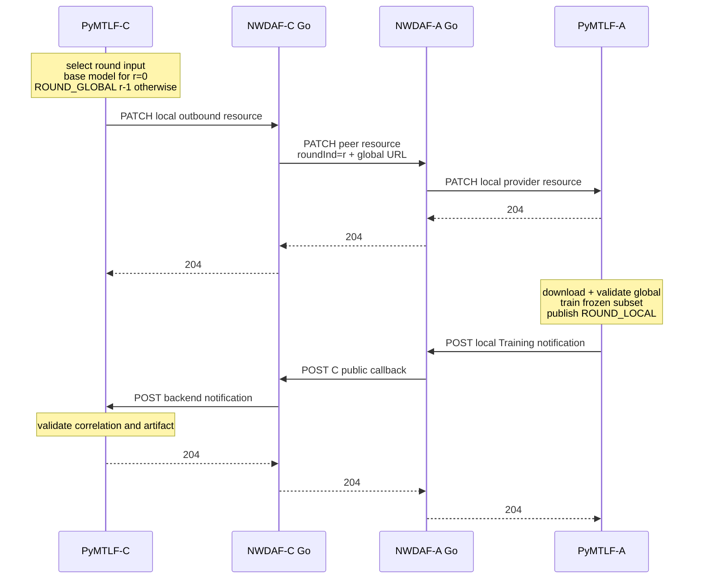
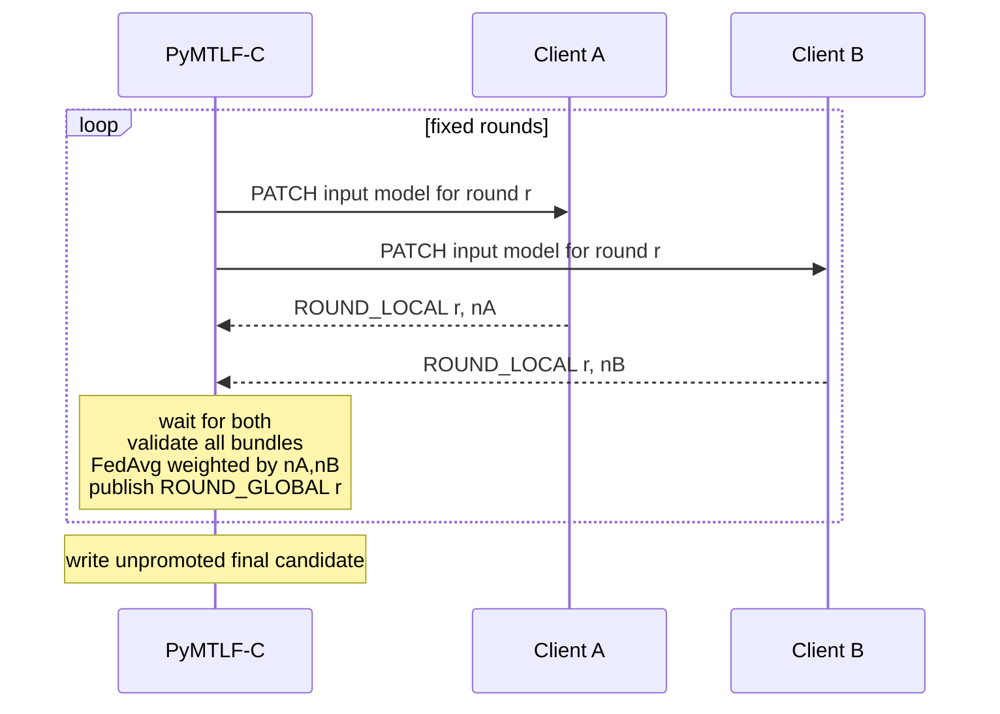

# Phase 3 And 4 Federated Training Execution Detailed Plan

日期：2026-07-29

狀態：設計完成，待實作

上層計畫：

- [Distributed NWDAF Federated Learning Implementation Plan](Distributed%20NWDAF%20Federated%20Learning%20Implementation%20Plan.md)

相關基線：

- [Phase 0 Release 18 Contract Foundation Detailed Plan](Phase%200%20Release%2018%20Contract%20Foundation%20Detailed%20Plan.md)
- [Phase 1 Role-Aware Deployment And NRF Foundation Detailed Plan](Phase%201%20Role-Aware%20Deployment%20And%20NRF%20Foundation%20Detailed%20Plan.md)
- [Phase 2 Cross-NWDAF Model Provision And Monitoring Detailed Plan](Phase%202%20Cross-NWDAF%20Model%20Provision%20And%20Monitoring%20Detailed%20Plan.md)
- [Distributed NWDAF Model Monitoring and Federated Retraining Architecture](../../design/Distributed%20NWDAF%20Model%20Monitoring%20And%20Federated%20Retraining%20Architecture.md)
- [NWDAF Development Policy](../../development_policy.md)

---

## 1. 目的

本文件把主計畫的 Phase 3「FL Client Training service」與 Phase 4
「FL Server orchestration and FedAvg」設計為一個連續實作單元。

兩者共同完成下列垂直流程：

```text
degradation
  -> discover FL Clients
  -> preparation
  -> freeze participant set and local datasets
  -> dispatch global model
  -> local training
  -> collect local models
  -> sample-count-weighted FedAvg
  -> repeat fixed rounds
  -> produce an unpromoted final candidate
```

合併設計不表示取消兩個責任邊界。實作仍保留兩個可獨立驗收的 gate：

1. **FL Client gate**：C 可對 A 完成 preparation 與一個 local round；
2. **FL Server gate**：C 可協調 A、B 完成至少兩輪 weighted FedAvg。

這樣可以一次固定 shared contract、identity、callback、artifact 與 failure
語意，同時避免在尚未證明單一 Client resource 正確前就除錯多 Client
聚合。

---

## 2. 實作基線與 repository 邊界

### 2.1 Baseline revisions

| Repository | Branch | Baseline |
| --- | --- | --- |
| `NWDAF/` | `feat/r18-federated-learning` | `fba2170` |
| `PyAnLF/` | `feat/r18-federated-learning` | `8f20f0a` |
| `PyMTLF/` | `feat/r18-federated-learning` | `07e5f49` |
| `nwdaf-resources/` | `feat/r18-federated-learning` | `bcb771c` |
| `nwdaf-docs/` | `main` | `266207c` |

### 2.2 Repository ownership

| Repository | 本工作單元責任 |
| --- | --- |
| `NWDAF/` | public Training SBI、callback、Go/backend route、peer consumer、OAuth scope、sync projection |
| `PyMTLF/` | Client preparation／local training、Server process／FedAvg、artifact workspace、business state |
| `nwdaf-resources/` | shared examples、one-client gate、two-client multi-round E2E |
| `PyAnLF/` | regression only；不加入 FL training business logic |
| `nwdaf-docs/` | 設計、證據、實作結果與 review record |

本工作單元不修改：

- `resources/` reference trees；
- team ADRF、SMF、UPF；
- NRF matching 行為；
- PyAnLF analytics／WAPE 計算。

若實作發現外部 repository 的 deterministic blocker，先記錄為
integration dependency，不直接修改 read-only reference。

---

## 3. 已確認的範圍

### 3.1 第一版固定 profile

- NWDAF-C：FL Server；
- NWDAF-A、NWDAF-B：FL Clients；
- `UE_COMMUNICATION`；
- 同一 model family 與 `modelInterInfo`；
- A、B 各自對應一個 required TAI scope；
- ADRF 是唯一 training data source；
- asynchronous preparation after resource creation；
- preparation 成功後固定 participant set；
- synchronous fixed rounds；
- 每輪等待所有 required Clients；
- local model 交換完整 weights，不交換 gradient、delta、optimizer state；
- actual training sample count weighted FedAvg；
- global scaler／preprocessing contract 固定；
- ordinary HTTP；
- process 或 backend restart 不 resume in-flight training；
- Phase 4 結束只產生 **unpromoted final candidate**。

### 3.2 明確不在本工作單元

- final validation-only round；
- performance promotion gate；
- formal `modelUniqueId` allocation；
- ADRF final model storage；
- completed catalog promotion；
- Model Provision reprovision；
- monitoring generation cutover；
- dynamic Client join／leave；
- partial aggregation；
- optional Client；
- asynchronous secure aggregation；
- gradients、model delta、optimizer-state aggregation；
- historical training descriptor inventory；
- standard UDM group resolution 與 serving-SMF improvements；
- TLS／OAuth delegation to Python artifact servers。

前六項由 Phase 5 負責；data descriptor inventory 與完整 collection
prerequisites 由 Phase 6 負責。

---

## 4. Normative evidence 與專案 profile

### 4.1 ML Model Training resource

Release 18 OpenAPI 定義：

| Operation | Method and path | Success |
| --- | --- | --- |
| create | `POST /nnwdaf-mlmodeltraining/v1/subscriptions` | `201` + `Location` + representation |
| complete update | `PUT /subscriptions/{subscriptionId}` | `200` + representation 或 `204` |
| partial update | `PATCH /subscriptions/{subscriptionId}` | `200` + representation 或 `204` |
| delete | `DELETE /subscriptions/{subscriptionId}` | `204` |
| notify | `POST {notifUri}` | `204` |

證據：

- [TS 29.520 ML Model Training OpenAPI](../../../specs/openapi/TS29520_Nnwdaf_MLModelTraining.yaml)
- [TS 29.520 §5.5 ML Model Training API](../../../specs/TS%2029.520/5%20API%20Definitions/5.5%20Nnwdaf_MLModelTraining%20Service%20API/README.md)

### 4.2 Preparation

`mLPreFlag=true` 表示 provider 只檢查是否能滿足 training requirements，
以及在 request 有模型時能否取得模型；它不是 training round。

本 profile 使用非同步 preparation：

- Client 完成 schema、capability、capacity、correlation 與 basic admission
  validation 後建立 resource，回 `201 Created + Location`；
- `201` 只表示 resource 已建立及 preparation work 已被接受，不表示 ADRF
  dataset 已準備完成；
- Client 在背景完成 ADRF retrieval、validation 與 frozen
  train／validation snapshot；
- 完成後以標準 `NwdafMLModelTrainNotif.statusReport` callback 回報；
- 不新增 `READY` property，也不在 response 中虛構 local model；
- 若 request 使用 immediate reporting 且結果確實已可用，才使用
  `immReport`；一般路徑保持 absent；
- 建立前已可確定的不符合要求回 `403` 與
  `ML_MODEL_TRAINING_REQS_NOT_MET`；建立後的 delay／failure 透過
  `delayEventNotif`／`termTrainReq` 回報。

Server 在等待 `PREPARATION_RESULT` 的 resource 上，以正確 correlation、
有效 `statusReport` 且沒有 delay／termination 判讀 preparation completed。
這是使用標準 schema 的 orchestration rule，因為 Release 18 沒有
preparation-specific `READY` 欄位。

Request 使用 `mLTrainRepInfo.maxResTime` 建立 Server watchdog。Client
effective deadline 必須扣除 safety margin，以預留 callback transport、
retry 與延期 PATCH 的 round trip。Client 需要更多時間時先送
`delayEventNotif`；Server 回 `204` 後再決定是否 PATCH 新
`maxResTime`。Client 在收到成功 update 前不得自行假設延期成立。

TS 29.552 §5.10.2.1 step 4c 明確規定正式 training 的 delay／new maximum
response time；preparation 使用同一 OpenAPI subscription／patch／notify
schema 是本專案的一致 standards-shaped policy，不宣稱為規格另外定義的
preparation extension procedure。

證據：

- [TS 23.288 §6.2F.1–6.2F.2](../../../specs/TS%2023.288/6%20Procedures%20to%20Support%20Network%20Data%20Analytics/6.2F%20Procedure%20for%20ML%20Model%20Training.md)
- [TS 29.552 §5.10.2.2 Preparation](../../../specs/TS%2029.552/5%20Signalling%20Flows%20for%20the%20Network%20Data%20Analytics%20Framework/5.10%20Federated%20Learning%20among%20Multiple%20NWDAFs.md)

### 4.3 Multi-round execution

規格允許 Server 以同一 Individual Training resource 的 `PUT` 或 `PATCH`
提供 aggregated model，進入下一輪。Client 使用 `Nnwdaf_MLModelTraining_Notify`
回報 local model。

本 profile：

- public provider 同時支援 `PUT` 與 `PATCH`；
- Server orchestrator 固定以 `PATCH` 送 round command；
- 不為每輪重新 `POST`；
- 每輪 `PATCH` 提供 `roundInd`、`mLPreFlag=false` 與一個
  `mLModelInfos` input model URL；
- `mlCorreId` 從 existing resource 取得，因為 patch schema 沒有該欄；
- Client callback 帶 `notifCorreId`、`mlCorreId`、`roundInd` 與 local
  artifact URL。

使用 `PATCH` 是對 long-lived subscription 做部分更新，沒有改變 create
subscription 的 `POST` 語意。

Round 0 的 input 是既有 completed base model，不是假造一個尚未經過
aggregation 的 `ROUND_GLOBAL(0)`。Round 0 local results 聚合後才形成
`ROUND_GLOBAL(0)`，並成為 round 1 的 input：

```text
completed base
  -> Client ROUND_LOCAL(0)
  -> Server ROUND_GLOBAL(0)
  -> Client ROUND_LOCAL(1)
  -> Server ROUND_GLOBAL(1)
```

證據：

- [TS 29.552 §5.10.2.1 steps 4–8](../../../specs/TS%2029.552/5%20Signalling%20Flows%20for%20the%20Network%20Data%20Analytics%20Framework/5.10%20Federated%20Learning%20among%20Multiple%20NWDAFs.md)

### 4.4 Training notification 與 sample count

標準 `statusReport.trainInDataInfo.samplRatio` 是 sampling ratio，不是 exact
sample count。FedAvg 所需的 exact count 使用 Phase 0 project-private
`ROUND_LOCAL.fl_metadata.training_sample_count`。

標準 callback 只提供模型位置與標準 status projection；Server 下載 bundle
後才取得：

- participant identity；
- scope digest；
- round identity；
- exact training sample count；
- weights digest；
- model／preprocessing contract digest。

### 4.5 Error contract

標準 service-specific cause：

| Cause | HTTP | 本 profile 使用情境 |
| --- | --- | --- |
| `ML_MODEL_TRAINING_REQS_NOT_MET` | `403` | preparation requirements 不滿足 |
| `ML_TRAINING_NOT_COMPLETE` | `403` | resource 尚未產生可要求的結果 |
| `OVERLOAD` | `403` | Client concurrency／capacity 不接受新工作 |
| `NOT_AVAILABLE_FOR_FL_PROCESS_ANYMORE` | `403` | restart、terminal resource、無法繼續 process |
| `UNAVAILABLE_ML_MODEL_TRAINING_FOR_ALLEVENTS` | `500` | request 中所有 training events 都不可用 |

證據：

- [TS 29.520 §5.5.7 Error handling](../../../specs/TS%2029.520/5%20API%20Definitions/5.5%20Nnwdaf_MLModelTraining%20Service%20API/5.5.7%20Error%20handling.md)

### 4.6 free5GC implementation-shape evidence

Go implementation 使用下列 local exemplar：

- `bsf/internal/sbi/api_management.go` 與
  `bsf/internal/sbi/processor/subscriptions.go`：subscription collection、
  individual resource、`Location`；
- `pcf/internal/sbi/api_httpcallback.go` 與
  `pcf/internal/sbi/consumer/notification.go`：callback handler／outbound
  notification separation；
- `udm/internal/sbi/consumer/nrf_service.go`：outbound consumer 與 NRF
  client ownership。

這些 exemplar 證明 handler／processor／consumer／context 的責任形狀；
它們沒有 NWDAF FL 的直接實作，因此 Training state 與 peer-route 細節是
依本專案既有 Phase 2 route foundation 推導，不宣稱來自 free5GC 現成
FL exemplar。

---

## 5. Target architecture

### 5.1 角色與資料方向



### 5.2 Go responsibility

Go：

- 註冊與提供 `nnwdaf-mlmodeltraining`；
- parse HTTP boundary 與 standard contract；
- 對 PyMTLF 做 standard-shaped routing；
- 保存 process-local route mirror；
- 保存 external callback URI、peer `Location` 與 selected target；
- 經 consumer 呼叫 peer NWDAF；
- relay callback；
- 維持 OAuth scope、redirect、`ProblemDetails` 與 status code；
- sync active route projection。

Go 不：

- 決定 Client selection；
- 解讀 training data；
- 決定 local sample count；
- 執行 local training；
- 做 FedAvg；
- 保存 model bytes；
- resume FL process。

### 5.3 PyMTLF responsibility

PyMTLF-A/B：

- validate preparation business requirements；
- resolve matching ADRF data descriptors；
- retrieve and freeze local dataset；
- validate／download global artifact；
- local training；
- publish temporary local artifact；
- produce callback；
- own provider resource worker、outbox、workspace and terminal state。

PyMTLF-C：

- turn degradation into one retrain intent；
- NRF candidate discovery and assignment；
- create／update／delete remote resources；
- freeze participant set；
- round state machine；
- callback correlation and deduplication；
- artifact validation；
- sample-count-weighted FedAvg；
- publish temporary global artifacts；
- produce an unpromoted final candidate。

---

## 6. Identity 與 correlation model

### 6.1 Identity table

| Identity | Owner | Scope | Stability |
| --- | --- | --- | --- |
| `mlCorreId` | PyMTLF-C | one complete FL process | all Clients and rounds share |
| `notifCorreId` | PyMTLF-C | one Server–Client Training resource | stable for resource lifetime |
| Server local route ID | C Go | outbound peer mapping | process-local opaque UUID |
| Client public subscription ID | A/B Go | public resource URI | process-local opaque UUID |
| Client backend resource ID | A/B PyMTLF | provider business state | bound to Go route during sync |
| `roundInd` | PyMTLF-C | one process stage | monotonically increasing |
| `scopeDigest` | PyMTLF | canonical training scope | stable for equivalent descriptor |
| artifact digest | artifact producer | immutable bytes | SHA-256 |
| `modelUniqueId` | PyMTLF-C catalog | completed formal model | absent in Phase 3/4 transient artifacts |

`mlCorreId`、`notifCorreId` 第一版都產生 UUID string，但規格只要求
string；UUID 是專案 identity policy，不改變 wire schema。

Process state 的 `processBaseWeightsDigest` 永遠指 retrain 開始時的 latest
completed model。Artifact manifest 的 `base_weights_digest` 則指該 artifact
所屬 round 的 input weights；round 1 之後它可以是上一個
`ROUND_GLOBAL` 的 output digest。兩者不得混用。

### 6.2 Correlation order

Callback route 不依賴 peer subscription ID：

```text
public callback path local route ID
  -> active outbound route
  -> expected notifCorreId
  -> expected mlCorreId
  -> expected participant and stage
  -> expected roundInd only for round-scoped notification
```

Preparation notification 通常省略 `roundInd`；正式 training／accuracy
check notification 才必須匹配 expected round。任何適用層不符都不得寫入
preparation 或 round result。

### 6.3 Training scope

`TrainingScopeDescriptor` 保留完整：

- `mLEventSubscs[]`；
- `mLEventFilter`，包含 `networkArea`／TAI；
- element target；
- `tgtRepUe`；
- requested time windows；
- `modelInterInfo`。

不得只用 TAI、group ID、SMF subscription ID 或 correlation ID 代替
training scope。

---

## 7. Standard body 與 private routing metadata

### 7.1 Standard-shaped body

Go ↔ PyMTLF body 保持：

- `NwdafMLModelTrainSubsc`；
- `NwdafMLModelTrainSubscPatch`；
- `NwdafMLModelTrainNotif`；
- standard `ProblemDetails`。

property name、nested shape 與 enum 不可改名、flatten 或另加 wrapper。

Notification conditional validation 除 `notifCorreId` 外，要求至少一個
result signal：`statusReport`、`mLModelInfos`、`delayEventNotif` 或
`termTrainReq`。Preparation 必須允許標準 `statusReport`-only callback；
不得沿用只接受 model／delay／termination 的舊 validator。

### 7.2 Private metadata

只有 remote outbound operation 需要 Phase 2 已建立的 private headers：

- `X-NWDAF-Target-Nf-Instance-Id`；
- `X-NWDAF-Target-Nf-Service-Instance-Id`；
- `X-NWDAF-Target-Api-Root`；
- `X-NWDAF-Target-Selection-Source`。

這些欄位不進標準 JSON body。

Training route 不另開一套 selected-target schema；沿用
`backend.SelectedTarget` 與 NRF cache validation。

### 7.3 URI rewriting

Inbound Client resource：

```text
C callback URI in public request
  -> A/B Go saves as DestinationNotificationURI
  -> body forwarded to local PyMTLF uses A/B Go internal relay URI
  -> PyMTLF callback reaches containing Go
  -> Go relays to saved C callback URI
```

Outbound Server resource：

```text
PyMTLF-C callback URI
  -> C Go saves destination backend URI
  -> peer body receives C public callback URI
  -> A/B callback reaches C public route
  -> C Go validates route and forwards to PyMTLF-C
```

Backend response representation must restore the caller-visible `notifUri`；
不得把 containing Go relay URI 洩漏成 accepted backend representation。

---

## 8. Resource state models

### 8.1 Client provider resource

```text
PROVISIONAL
  -> PREPARING
  -> PREPARATION_RESULT_PENDING
  -> PREPARED
  -> ROUND_RUNNING
  -> RESULT_PENDING
  -> PREPARED
  -> DELETING
  -> TERMINATED

PROVISIONAL / PREPARING / PREPARED / ROUND_RUNNING / RESULT_PENDING
  -> FAILED
```

語意：

- `PROVISIONAL`：basic admission 尚未完成，public ID 尚未公開；
- `PREPARING`：resource 已建立並回 `201`，ADRF retrieval／snapshot
  正在背景執行；
- `PREPARATION_RESULT_PENDING`：snapshot 已固定，completion callback
  已進 outbox但尚未收到 Server `204`；
- `PREPARED`：completion callback 已被 Server 接受，可接受下一 round；
- `ROUND_RUNNING`：本地訓練中；
- `RESULT_PENDING`：固定 result 已產生，callback outbox 尚未被 Server
  接受；
- `FAILED`／`TERMINATED`：不可再訓練。

同一 resource 同時只允許一個 round worker。

### 8.2 Server process

```text
CREATED
  -> DISCOVERING
  -> PREPARATION_CREATING
  -> PREPARATION_WAITING
  -> READY
  -> ROUND_DISPATCH
  -> ROUND_WAITING
  -> AGGREGATING
  -> ROUND_DISPATCH
  -> ...
  -> CANDIDATE_READY
  -> PUBLICATION_HANDOFF

Any non-terminal state
  -> FAILED
  -> CLEANING_UP
  -> TERMINAL
```

本工作單元在 `CANDIDATE_READY` 驗收。`PUBLICATION_HANDOFF` 是 Phase 5
入口，不在此實作 durable publication。

### 8.3 Round participant state

```text
NOT_DISPATCHED
  -> DISPATCHED
  -> CALLBACK_ACCEPTED
  -> ARTIFACT_VALIDATED

DISPATCHED
  -> DELAY_REPORTED
  -> DISPATCHED        # Server explicitly extends deadline

Any active state
  -> INVALID / TIMED_OUT / TERMINATED
```

Preparation participant 使用平行語意：

```text
NOT_CREATED
  -> RESOURCE_CREATED
  -> PREPARATION_WAITING
  -> PREPARATION_COMPLETED

PREPARATION_WAITING
  -> DELAY_REPORTED
  -> PREPARATION_WAITING  # Server PATCHes a new maxResTime

Any active state
  -> INVALID / TIMED_OUT / TERMINATED
```

第一版 policy：

- delay 不自動延長；
- config 可固定允許一次 bounded extension；
- preparation 與 round 都使用 Server watchdog 與 Client safety margin；
- 不允許 partial aggregate；
- required Client timeout 使 process 失敗。

---

## 9. End-to-end flow

### 9.1 Preparation



### 9.2 One training round



### 9.3 Two-client FedAvg



---

## 10. Slice 3A：Go public Training service

### 10.1 Route shape

在 existing `internal/sbi` 增加：

- collection `POST`；
- individual `PUT`、`PATCH`、`DELETE`；
- Training notification callback；
- `nnwdaf-mlmodeltraining` authorization scope。

使用 existing `sbi.Route`、handler、processor、consumer、context，不建立
新的 generic SBI package。

### 10.2 Handler

Handler：

- Content-Type validation；
- body size/read；
- standard JSON parse and conditional validation；
- path ID parse；
- call processor；
- map response status、headers、body。

Handler 不執行 ADRF、training、artifact 或 FedAvg。

### 10.3 Context route

在 existing context route ownership 增加 Training route，至少保存：

- local route ID；
- inbound／outbound direction；
- selected target；
- peer `Location`；
- backend resource ID／Location；
- accepted／backend representation；
- destination notification URI；
- `notifCorreId`；
- `mlCorreId`；
- lifecycle；
- process generation；
- cleanup retry metadata。

不建立獨立 persistence database。

### 10.4 Status and Location

- public create 在 backend 完成 basic admission 並建立 preparation
  resource 後回 `201`，不得等待 ADRF retrieval／snapshot freeze；
- public `Location` 永遠是 containing Go resource；
- backend `Location` 不直接暴露給 peer；
- outbound private create 回 PyMTLF-C 的 `Location` 是 C Go local route；
- C Go 保存 remote A/B public `Location`；
- preparation completion／delay／termination 都沿既有 callback relay
  回到 PyMTLF-C；
- only `308` 可永久更新 peer Location；
- `307` 只用於該次 request。

### 10.5 Media type and response mapping

| Operation | Request media type | Success body |
| --- | --- | --- |
| POST create | `application/json` | required stored representation |
| PUT replace | `application/json` | representation on `200`; empty on `204` |
| PATCH update | `application/merge-patch+json` | representation on `200`; empty on `204` |
| DELETE | none | empty on `204` |
| callback | `application/json` | empty on `204` |

Go public handler只回OpenAPI對該operation宣告的status。Peer
`ProblemDetails`若屬該operation允許的error status則保留標準欄位轉發；
transport failure才映射為`502`／`503`，不得改寫成requirements-not-met。

---

## 11. Slice 3B：Go ↔ PyMTLF Training boundary

### 11.1 Private routes

PyMTLF provider side：

- `POST /internal/v1/ml-model-training/subscriptions`；
- `PUT /internal/v1/ml-model-training/subscriptions/{id}`；
- `PATCH /internal/v1/ml-model-training/subscriptions/{id}`；
- `DELETE /internal/v1/ml-model-training/subscriptions/{id}`；
- `POST /internal/v1/ml-model-training/notifications`。

PyMTLF Server outbound side可使用同一 collection／individual resource，
搭配 selected-target headers；不得建立 `start-round`、`ready`、
`aggregate` 等非標準 wire API。

Python application 內部可以有普通 method／queue command，但不形成新的
Go/Python HTTP contract。

Private HTTP mapping：

| Direction | Route | Routing key |
| --- | --- | --- |
| Go → Client backend create/update/delete | `/internal/v1/ml-model-training/subscriptions...` | Go local resource ID |
| Client backend → containing Go result | `/internal/v1/ml-model-training/notifications` | unique `notifCorreId` + current generation |
| peer Client Go → Server Go | `/nnwdaf-callback/v1/ml-model-training/{localRouteId}` | C outbound route ID + body correlations |
| Server Go → PyMTLF-C | `/internal/v1/ml-model-training/notifications` | unique `notifCorreId` + process identity |

`notifCorreId` 在一個 containing Go 的 active Training routes 中必須
unique；create 時發現 collision 就拒絕，不靠 linear first-match routing。

### 11.2 Callback acknowledgement

Client callback worker 只有在最終 remote Server 回 `204` 後才把 outbox
entry 標為 delivered。

若 transport 或 response 遺失：

- retry 同一 notification body；
- URL 指向同一 immutable artifact；
- artifact digest 不變；
- 不重新 local train。

### 11.3 Sync

Go → PyMTLF sync 增加：

- active inbound Training route projections；
- active outbound Training route projections；
- accepted representation；
- route/correlation identity；
- lifecycle and generation。

Sync 不傳：

- dataset；
- model bytes；
- workspace contents；
- callback outbox body；
- partial aggregate；
- optimizer state。

Restart 處理見 §19；sync 用於辨識並終止失去 business state 的資源，
不是 resume protocol。

---

## 12. Slice 3C：Client preparation

### 12.1 Admission and background validation

PyMTLF-A/B 在回 `201` 前依序檢查：

1. runtime mode 是 `fl_client`；
2. capacity 可接受新 resource；
3. `mlCorreId` 存在；
4. `notifCorreId` unique；
5. `mLPreFlag=true`；
6. `mLEventSubscs` 支援 `UE_COMMUNICATION`；
7. `modelInterInfo` 與 local model contract 相容；
8. `mLModelTrainInfos[].dataAvReq` 與 `timeAvReq` 存在；
9. `mLModelTrainInfos` 與 `mLEventSubscs` 在第一版採相同數量與 index
   對應；
10. scope 可對應到 active data descriptor 或 E2E fixture；
11. `mLTrainRepInfo.maxResTime` 可接受，且能形成正的 effective deadline。

Resource 建立後由 background worker 檢查：

1. request 提供的 completed base model 可下載並通過 bundle、
   interoperability、model 與 preprocessing contract validation；
2. ADRF 可達並能建立 retrieval resource；
3. records 滿足 time window／minimum samples；
4. snapshot 可完成 transform and split；
5. preparation result 能在 callback outbox 中可靠保存。

`timeAvReq`在標準schema中是string且未固定格式。第一版project profile
只接受ISO 8601 duration（例如`PT10M`）；無法解析時以
`ML_MODEL_TRAINING_REQS_NOT_MET`指出該欄，不自行猜測單位。

### 12.2 ADRF descriptor mapping

每個 effective training scope 可對應一個或多個 local `dataSub`
descriptors。若 group 內多個 SUPI 分別有 SMF data subscription：

- Client 對每個 matching `dataSub` 建立 retrieval；
- 使用同一 requested time window；
- 收集並 canonicalize records；
- 以 record identity 去重；
- 合併後再做 transform and split。

ADRF query 使用完整 `dataSub`，不只使用 SMF subscription ID，也不以
`scopeDigest` 當 ADRF standard key。

Phase 3 只依 active sync projection；沒有 matching descriptor 時回
requirements not met。Portable E2E 可用明確 fixture descriptor，但
不得在 production path 靜默生成 fake descriptor。

### 12.3 Frozen snapshot

snapshot 至少固定：

- process and resource identity；
- canonical scope descriptor；
- source descriptors；
- requested／actual time window；
- normalized record IDs；
- train indices；
- validation indices；
- training sample count；
- validation sample count；
- feature order；
- preprocessing/scaler digest；
- base model contract digest。

沿用 existing temporal split、validation ratio、purge gap與 deterministic
seed。validation samples 不計入 FedAvg weight。

### 12.4 Preparation response

同步 admission 成功：

- commit provider resource；
- return `201 + Location + stored representation`；
- response `mLPreFlag=true`；
- `immReport` absent，除非有真實 standard immediate information；
- base model只用於 preparation compatibility／preprocessing確認，不在
  response 中回傳成 Client local result；
- start one background preparation worker。

同步 admission 失敗：

- 不公開 resource；
- return standard `ProblemDetails`。

背景 preparation 成功：

- freeze train／validation snapshot；
- cleanup ADRF retrieval subscription；
- retain a `statusReport` preparation notification in callback outbox；
- callback 被 Server 以 `204` 接受後，resource 進 `PREPARED`。

背景 preparation 尚未完成：

- 在 effective deadline 前 retain／send `delayEventNotif`；
- 繼續工作不代表 extension 已獲准；
- 只有 Server PATCH 新 `maxResTime` 並成功更新 resource 後，Client
  才重設 deadline。

背景 preparation 無法完成：

- best-effort delete ADRF retrieval resource；
- cleanup partial workspace；
- retain／send `termTrainReq=NOT_AVAILABLE_ML_TRAIN`；
- resource 進 terminal failure，不能接受 round。

Preparation success callback 使用 `notifCorreId`、`mlCorreId` 與
`statusReport.trainInDataInfo`。標準沒有 exact sample count，也沒有
`ready`；Server 依 expected `PREPARATION_RESULT` stage 判讀 completion。

### 12.5 Preparation deadline

- Server 從收到 create success response 後啟動 `maxResTime` watchdog；
- Client 從接受 resource 後用 local monotonic timer 計時；
- Client effective deadline =
  `accepted time + maxResTime - safety margin`；
- safety margin涵蓋callback request timeout、retry，以及
  `delay callback + 204 + PATCH + 200/204`往返；
- delay notification 的 `expCompTime` 是預估剩餘秒數，不會自動延期；
- 第一版只允許 configured bounded extension 次數與總等待上限；
- deadline 前沒有 success／delay／termination callback 時，Server 將
  required Client標記 timeout並使process失敗。

---

## 13. Slice 3D：Client round executor

### 13.1 Round command

Canonical orchestrator command：

```json
{
  "mLPreFlag": false,
  "roundInd": 0,
  "mLModelInfos": [
    {
      "event": "UE_COMMUNICATION",
      "mLFileAddr": {
        "mLModelUrl": "http://nwdaf-c-artifacts.example/.../inputs/0/model.tar.gz"
      }
    }
  ]
}
```

### 13.2 Admission

Client rejects：

- resource not `PREPARED`；
- wrong or repeated round with different command digest；
- stale round；
- missing input model；
- wrong event／model interoperability；
- untrusted artifact origin；
- artifact too large or unsafe archive；
- mismatched process、model contract、preprocessing contract；
- scaler digest changed；
- current round input weights digest mismatch。

### 13.3 Local training

- load frozen training subset；
- load input weights and existing scaler；
- do not fit a new scaler；
- use FL-specific trainer entrypoint；
- keep current local-mode trainer behavior unchanged；
- only train aggregatable floating state；
- non-floating state remains byte/digest equivalent；
- deterministic seed includes `mlCorreId + participant + roundInd`；
- exact consumed training sample count is recorded。

### 13.4 Local artifact and callback

`ROUND_LOCAL`：

- has no formal `modelUniqueId`；
- `result_type=TRAINING`；
- includes participant NF instance ID；
- includes scope digest；
- includes round；
- includes input global digest；
- includes output weights digest；
- includes exact training sample count。

Standard callback only carries `mLModelInfos[].mLFileAddr.mLModelUrl` plus
correlation fields。`statusReport` may include standard `samplRatio` for
observation，but Server never treats it as exact FedAvg weight。

### 13.5 Idempotency

| Input | Behavior |
| --- | --- |
| same round + same command digest while running | `204`, no second worker |
| same round + same digest after result | `204`, retry existing callback if needed |
| same round + different digest | `403 NOT_AVAILABLE_FOR_FL_PROCESS_ANYMORE`, resource failed |
| older round | reject, no state change |
| future non-next round | reject, no state change |
| duplicate callback delivery | same body and artifact digest |

---

## 14. Slice 3E：Temporary artifact workspace

### 14.1 Ownership

PyMTLF directly serves temporary artifacts. `mLModelUrl` may point to a
non-SBI file endpoint；Go只轉送標準 model information，不 proxy model bytes。

### 14.2 Path and access

Artifact URL is scoped by：

```text
process / participant / round / role / immutable digest
```

Requirements：

- absolute configured public base URI；
- cross-NWDAF reachable；
- no directory traversal；
- immutable after publish；
- exact Content-Length where available；
- bounded archive and extracted size；
- SHA-256 verification；
- redirect origin policy；
- active process artifacts not removed。

### 14.3 Retention

- local/global round artifact survives callback retry；
- final candidate survives until Phase 5 handoff or terminal retention expiry；
- terminal workspace cleaned after TTL；
- startup removes only expired orphan workspace；
- never remove completed catalog artifact。

Interim round models never go to ADRF。

---

## 15. FL Client gate

完成 Phase 3 gate 前，不開始 two-client aggregation implementation。

Gate must prove：

1. C discovers A as an `FL_CLIENT` with Training service；
2. C creates one preparation resource；
3. A immediately returns resource-creation `201 + Location` without waiting
   for ADRF retrieval or snapshot freeze；
4. A retrieves ADRF records and freezes dataset in the background；
5. A sends a preparation completion callback through A Go and C Go；
6. a delay callback can lead to one bounded `maxResTime` PATCH；
7. C sends round 0 through the same resource only after preparation completion；
8. A trains exactly once；
9. A publishes `ROUND_LOCAL` with positive exact sample count；
10. local-result callback reaches PyMTLF-C through A Go and C Go；
11. duplicate command does not retrain；
12. lost callback response retries the same digest；
13. DELETE stops future work；
14. Client restart causes explicit process failure rather than resume。

---

## 16. Slice 4A：Retrain intent and discovery

### 16.1 Trigger

PyMTLF-C reuses existing accuracy policy unchanged：

- any active A/B scope can trigger degradation；
- one family can have at most one retrain in flight；
- additional reports are stored as observations but do not start another process；
- retrain intent fixes the current latest base model digest；
- A/B compatible active monitoring scopes become required training scopes。

### 16.2 Discovery query

For each required scope, C asks containing Go to query NRF with：

- target/requester NF type `NWDAF`；
- service name `nnwdaf-mlmodeltraining`；
- `ml-analytics-info-list` including：
  - `mlAnalyticsIds=["UE_COMMUNICATION"]`；
  - `flCapabilityType="FL_CLIENT"`；
  - required `trackingAreaList`；
  - model interoperability where represented by the profile。

PyMTLF parses complete SearchResult and selects an exact registered service。
Selected target is returned to Go as private headers；Go validates it against
its unexpired NRF cache。

### 16.3 Candidate eligibility

Candidate must：

- NF status `REGISTERED`；
- service status `REGISTERED`；
- support `FL_CLIENT` or `FL_SERVER_AND_CLIENT`；
- support `UE_COMMUNICATION` in the same `MlAnalyticsInfo` entry；
- cover required TAI；
- provide compatible model interoperability；
- expose a usable exact Training service；
- not be NWDAF-C itself unless a future config explicitly allows Server also
  acting as Client。

### 16.4 Assignment

Algorithm：

1. canonicalize each required scope；
2. discover candidates per scope；
3. sort by `nfInstanceId`, service ID, API root；
4. assign each scope to the first eligible candidate；
5. require one distinct Client per required scope in the first profile；
6. require two distinct Clients in the first experiment profile；
7. fail if any required scope has no distinct assignment。

No priority／capacity scoring in this version。

Release 18可讓一個Training resource帶多個`mLEventSubscs`，但Phase 0的
第一版`ROUND_LOCAL` manifest只保存一個`scope_digest`。為避免把多個
scope悄悄壓成語意不明的digest，本工作單元不讓同一Client同時承擔多個
required scopes。Multi-scope assignment與對應artifact contract留待後續
擴充。

---

## 17. Slice 4B：Server preparation and participant freeze

### 17.1 Process creation

Create：

- one `mlCorreId`；
- one per-client `notifCorreId`；
- base model digest；
- trigger observation；
- required scopes；
- participant assignments；
- per-Client preparation response window；
- Server watchdog state and bounded extension budget。

### 17.2 Preparation fan-out

For each Client：

- one long-lived Training resource；
- one assigned `mLEventSubscs` in the first profile；
- shared `mlCorreId`；
- distinct `notifCorreId`；
- `mLPreFlag=true`；
- `mLModelInfos`提供current completed base model URL；它可帶既有formal
  model identity，但不是round-local／round-global artifact；
- data availability requirements；
- availability time requirement；
- `mLTrainRepInfo.maxResTime`；
- target reporting UE。

Preparation requests may be sent concurrently after assignments are fixed。

### 17.3 Freeze rule

Participant set becomes immutable only when all required Clients returned
successful preparation result callbacks。A successful `201` only moves that
assignment to `RESOURCE_CREATED`／`PREPARATION_WAITING`。

PyMTLF-C accepts a preparation completion only when：

- route and `notifCorreId` identify the expected Client resource；
- `mlCorreId` identifies the active process；
- process expects `PREPARATION_RESULT`；
- notification contains a valid `statusReport`；
- notification does not contain delay or termination。

If a Client sends `delayEventNotif`：

1. C retains the delay state before returning `204`；
2. C checks configured extension count／total wait budget；
3. if accepted, C PATCHes the same resource with a new `maxResTime`；
4. the new deadline begins only after the Client accepts the update；
5. otherwise the original deadline remains effective and the process fails on
   timeout。

If any required Client fails：

- process fails；
- C best-effort DELETEs all created resources；
- no round is dispatched；
- no replacement Client is selected inside the same process。

Dynamic reselection is standard-allowed but explicitly deferred。

---

## 18. Slice 4C：Server round orchestration

### 18.1 Round dispatch

For round `r`：

1. select immutable input：
   - `r=0` 使用 completed base model；
   - `r>0` 使用 `ROUND_GLOBAL(r-1)`；
2. set expected callback stage and deadline for all participants；
3. send PATCH to all participants；
4. accept `200` or `204` per standard；
5. enter `ROUND_WAITING` only after all dispatch responses succeed。

If one dispatch fails, do not continue with a subset。

### 18.2 Callback acceptance

Before acknowledging `204` to peer, PyMTLF-C must retain in current process
state/workspace：

- participant；
- `notifCorreId`；
- `mlCorreId`；
- `roundInd`；
- standard notification digest；
- artifact URL；
- expected stage。

Then it downloads and validates artifact。Transport acknowledgement only means
notification accepted, not that the round has aggregated。

這個retain不宣稱跨PyMTLF restart durable；Server restart仍依§20.2讓
in-flight process失敗。

### 18.3 Duplicate callback

- same participant／round／notification digest／artifact digest：return `204`,
  preserve first result；
- same participant／round but different artifact：mark process failed；
- callback from unknown／deleted／old-generation route：`404` or applicable
  standard error，never attach to current process；
- callback for stale round：do not mutate aggregate。

### 18.4 Deadline

- deadline derives from configured round timeout and optional
  `mLTrainRepInfo.maxResTime`；
- Client sends success／delay／termination before its effective deadline,
  which subtracts the configured transport／retry safety margin；
- one optional extension is allowed only when config enables it and Client sent
  `delayEventNotif`；
- extension is sent by PATCHing the existing resource；
- delay does not grant itself an extension；the new window starts only after
  the PATCH succeeds；
- timeout of any required Client fails process；
- no partial FedAvg。

---

## 19. Slice 4D：FedAvg

### 19.1 Pre-aggregation validation

Every local artifact must match：

- current `mlCorreId`；
- current `roundInd`；
- assigned participant；
- assigned scope digest；
- expected input global digest；
- current round input weights digest；
- process original base digest through process state, not by misreading the
  round-local `base_weights_digest`；
- model contract digest；
- preprocessing/scaler digest；
- parameter names/order；
- tensor shapes；
- dtypes；
- floating/non-floating classification；
- positive training sample count。

Artifact count must equal the frozen **training** count for the assigned scope。
Validation samples are excluded。

### 19.2 Formula

For floating parameter `w`：

```text
w_global = sum(n_i * w_i) / sum(n_i)
```

where `n_i` is exact `training_sample_count` from validated private manifest。

Non-floating state：

- is not averaged；
- must equal input global state；
- is copied from input global artifact。

### 19.3 Determinism

- participants sorted by normalized NF instance ID；
- tensors processed in contract order；
- accumulation dtype explicitly fixed；
- manifest participant list canonical；
- same inputs produce same weights digest。

### 19.4 Output

After each non-final training round：

- write `ROUND_GLOBAL(r)` aggregation record；
- its `round_ind` is `r` and its `base_weights_digest` is the immutable input
  used by Clients in round `r`；
- use its weights as input to round `r+1`。

After configured final training round：

- retain the final `ROUND_GLOBAL(r)` as the unpromoted candidate；
- state becomes `CANDIDATE_READY`；
- do not introduce a new `CANDIDATE` artifact role；
- candidate has no formal `modelUniqueId`；
- no ADRF store；
- no latest pointer update；
- no Model Provision notification。

Phase 5 converts an accepted candidate into `FINAL_MODEL`。

---

## 20. Cleanup, restart and failure semantics

### 20.1 PyMTLF Client restart

After sync：

- active inbound Training routes are recognized；
- missing frozen snapshot/workspace means they cannot resume；
- recreate only terminal/tombstone representation needed for deterministic
  error and cleanup；
- send at most one `termTrainReq=NOT_AVAILABLE_ML_TRAIN` when callback route
  remains valid；
- future PUT/PATCH returns `403 NOT_AVAILABLE_FOR_FL_PROCESS_ANYMORE`；
- DELETE remains `204` idempotent。

### 20.2 PyMTLF Server restart

- in-flight process is not reconstructed；
- sync identifies outbound resources owned by previous generation；
- new backend schedules bounded DELETE cleanup；
- old callbacks cannot become a new process result；
- retraining may be triggered again by later accuracy observations。

### 20.3 Go restart

Go route state is process-local by project decision。Go restart loses public
resource and peer mapping，therefore current FL process fails and experiment must
restart。This work unit does not add Go persistence。

### 20.4 Backend unavailable

- public create/update requires correct backend role usable；
- unavailable Client backend：`503`；
- unavailable Server backend callback destination：`503` so sender retries；
- Go continues existing polling／sync；
- becoming usable does not resume an old FL worker。

### 20.5 Cleanup order

Terminal Server process：

1. cancel local workers；
2. stop accepting round results；
3. bounded DELETE all remote Training resources；
4. retain immutable artifacts until TTL；
5. record final failure cause；
6. release family retrain-in-flight state。

### 20.6 Failure mapping

| Failure | Immediate response／transition |
| --- | --- |
| unsupported training requirement | `403 ML_MODEL_TRAINING_REQS_NOT_MET` |
| new resource exceeds Client capacity | `403 OVERLOAD` |
| PyMTLF role unavailable | `503 Service Unavailable` |
| ADRF temporarily unreachable after preparation resource creation | Client sends bounded `delayEventNotif`; permanent/unrecoverable failure sends `termTrainReq` |
| unsafe or incompatible model artifact known before admission | `403 ML_MODEL_TRAINING_REQS_NOT_MET` |
| unsafe or incompatible model artifact found by background preparation | Client sends `termTrainReq`; active process fails |
| duplicate round with different command | Client resource and Server process fail |
| Client delay without allowed extension | process fails at original deadline |
| Client termination notification | process fails and cleans all resources |
| missing required callback | process fails; no partial aggregate |
| peer `404` during cleanup | treat resource as already deleted |
| cleanup transport failure | bounded retry, then retain terminal diagnostic |

---

## 21. Concurrency and idempotency

### 21.1 Locks

Avoid a single global lock across network or training work。

- Go route mutation：short context lock；
- Client resource transition：per-resource lock；
- Server process transition：per-process lock；
- artifact publish：atomic temp-to-final rename；
- callback outbox：queue lock independent from training worker；
- family retrain intent：family-level compare-and-set。

### 21.2 Race cases

Tests must cover：

- PATCH vs DELETE；
- callback vs timeout；
- duplicate callback arriving concurrently；
- backend restart during result delivery；
- second degradation during training；
- two callbacks for same participant with different digest；
- cleanup retry vs explicit delete；
- TTL cleanup vs active artifact download。

### 21.3 Queue bounds

- preparation jobs bounded；
- local training jobs bounded；
- callback outbox bounded；
- Server process count bounded；
- artifact disk usage bounded by workspace count／TTL。

Queue full maps to `403 OVERLOAD` for a new Client resource。A previously
accepted resource must not silently drop its callback；it transitions to explicit
failure if delivery cannot be retained。

---

## 22. Config changes

### 22.1 PyMTLF common

Extend `federated_learning` without adding another top-level FL config family：

- preparation timeout；
- round timeout；
- Client deadline safety margin；
- maximum preparation／round extension count and total extension duration；
- max active Client resources；
- max active Server processes；
- callback outbox size；
- callback retry/backoff；
- workspace TTL；
- public artifact base URL；
- allowed artifact origins；
- delay extension policy。

Validate：

- callback request timeout < callback delivery deadline；
- callback retry and delay／PATCH round trip fit inside deadline safety margin；
- artifact download timeout < round timeout；
- preparation ADRF watchdog < advertised `maxResTime - safety margin` or sends
  delay before the effective deadline；
- retention > maximum callback retry horizon；
- public artifact URL is cross-process reachable in distributed configs。

### 22.2 Client

`runtime.mode=fl_client`：

- enables public provider behavior；
- disables local coordinator and FL Server orchestrator；
- uses existing trainer hyperparameters unless FL-specific override is
  explicitly required；
- preserves existing local trainer defaults。

### 22.3 Server

`runtime.mode=fl_server`：

- enables degradation-to-process bridge；
- enables discovery／assignment／FedAvg；
- disables FL Client provider worker；
- fixed `round_count >= 2` for distributed E2E；
- first profile requires two distinct Clients；
- partial aggregation disabled。

### 22.4 NWDAF Go

No new role inference。Existing config remains source of truth：

- A/B advertise `nnwdaf-mlmodeltraining` + `FL_CLIENT`；
- C advertises `FL_SERVER` capability；
- backend enable and service advertisement validation remain aligned；
- OAuth scope comes from advertised service。

---

## 23. Implementation file map

Exact filenames may follow nearby repository style，but ownership may not move
without updating this plan。

### 23.1 NWDAF

Prefer extending：

- `internal/sbi/server.go` and existing route files；
- `internal/sbi/processor/`；
- `internal/sbi/consumer/`；
- `internal/mtlf/server.go`；
- `internal/mtlf/processor/`；
- `internal/mtlf/client/`；
- `internal/context/` existing route ownership；
- `internal/backend/` shared standard HTTP／sync contract；
- `internal/compat/mlmodeltraining/` existing Release 18 compatibility types；
- `pkg/factory/` only for service/config validation。

New Go package gate：

- Training is not a reason to add `internal/sbi/nfdiscovery`；
- standard schema remains in existing compat package；
- route state remains existing context owner；
- peer transport remains existing SBI consumer；
- private MTLF route remains `internal/mtlf`。

### 23.2 PyMTLF

Expected owners：

- `wire/ml_model_training.py`：standard wire only；
- `core/training_scope.py`：canonical scope；
- `core/fl_artifacts.py`：role manifest validation；
- new provider resource module under `core/`；
- new Server process/orchestrator module under `core/`；
- new FedAvg module under `core/` only if it has a distinct pure responsibility；
- `api/`：thin HTTP routes；
- `client/` or existing HTTP client owner：Go auxiliary calls；
- `app.py`：mode-based lifecycle wiring；
- `config.py`：validated settings。

Do not put Go-style handler／processor packages into Python。

### 23.3 nwdaf-resources

Extend `deployments/distributed_fl/`：

- preserve Phase 1/2 checks；
- add ADRF-backed one-client training profile；
- add two-client/two-round profile；
- add deterministic unequal sample datasets；
- add fault injection for duplicate callback、timeout and response loss；
- document command、ports、artifacts and expected assertions。

Contract examples remain review/E2E inputs，not imported runtime dependency。

---

## 24. Verification plan

### 24.1 NWDAF

Focused tests：

- all public methods/path/status；
- conditional validator and service causes；
- public/backend/peer Location separation；
- notif URI rewriting；
- inbound/outbound route collision；
- same peer subscription ID from different NFs；
- selected-target cache validation；
- 307 vs 308；
- callback correlation；
- inactive／old-generation callback rejection；
- cleanup retry；
- sync projection。

Repository gate：

```text
go test ./...
go vet ./...
golangci-lint run ./...
```

### 24.2 PyMTLF Client

- preparation schema and requirements；
- ADRF descriptor matching；
- multiple dataSub merge/dedupe；
- time window/min samples；
- deterministic frozen split；
- no scaler refit；
- round admission；
- duplicate command；
- local artifact manifest；
- exact sample count；
- callback retry same digest；
- delete/cancel；
- restart terminalization；
- workspace TTL。

Repository gate：

```text
pytest
ruff check
```

### 24.3 PyMTLF Server

- degradation dedupe；
- scope-specific discovery；
- deterministic participant assignment；
- all-or-nothing preparation；
- participant freeze；
- round transition；
- callback correlation/dedupe；
- timeout without partial aggregate；
- exact sample-count validation；
- tensor compatibility；
- weighted FedAvg numerical golden；
- non-floating state preservation；
- deterministic output digest；
- cleanup；
- restart failure。

### 24.4 Contract examples

Update/verify：

- preparation request carrying the completed base model；
- preparation response without fabricated immediate model；
- round PATCH；
- local result callback；
- delay／termination；
- round local/global artifacts。

Go and PyMTLF both parse normative examples；PyMTLF validates private artifacts。

### 24.5 Cross-process gate A

One Client：

```text
NRF + ADRF
NWDAF-A + PyMTLF-A
NWDAF-C + PyMTLF-C
```

Proves §15。

### 24.6 Cross-process gate B

Two Clients：

```text
NRF + ADRF
NWDAF-A + PyMTLF-A
NWDAF-B + PyMTLF-B
NWDAF-C + PyMTLF-C
```

Dataset uses unequal counts，for example：

```text
A training samples = 12
B training samples = 8
```

Assert at least：

- two preparation resources；
- two fixed participants；
- at least two rounds；
- expected weighted tensor result；
- validation rows excluded from counts；
- duplicate callback accepted once；
- missing Client causes failure and no partial global model；
- new NRF Client during round does not join；
- final state `CANDIDATE_READY`；
- no ADRF model store；
- no completed latest model update。

---

## 25. Acceptance criteria

### 25.1 Combined contract

- public Training API matches Release 18 method/path/status/header/body；
- Go/backend wire preserves standard property names；
- private routing metadata stays outside body；
- route IDs do not assume peer IDs are globally unique；
- callback uses route + `notifCorreId` + `mlCorreId` + expected stage；
  round-scoped callback additionally requires `roundInd`。

### 25.2 FL Client gate

- preparation POST returns `201 + Location` before ADRF retrieval completes；
- background preparation freezes a usable ADRF dataset and reports completion
  with standard `statusReport` callback；
- delay is reported before the Client effective deadline and does not extend
  itself；
- a Server PATCH can grant one bounded new `maxResTime`；
- one round trains exactly once；
- local artifact is immutable and externally reachable；
- exact positive training sample count is present；
- retry resends same result；
- restart does not resume。

### 25.3 FL Server gate

- degradation starts one process；
- NRF discovery selects two eligible Clients without hardcoded IDs；
- required A/B preparation is all-or-nothing；
- participant freeze waits for both preparation completion callbacks, not only
  both `201` responses；
- participant set is immutable；
- at least two synchronous rounds complete；
- FedAvg uses exact unequal sample weights；
- any invalid/missing result fails process without partial aggregate；
- output is an unpromoted candidate only。
- round 0 consumes the completed base；`ROUND_GLOBAL(0)` only appears after
  round 0 aggregation。

### 25.4 Regression

- Phase 2 remote provision／monitor E2E remains green；
- single-NWDAF local mode remains green；
- PyAnLF analytics and WAPE behavior unchanged；
- no interim artifact reaches ADRF；
- no Phase 5 publication behavior is pulled forward。

---

## 26. Execution order

### Slice A：Shared Go Training resource and route

1. characterize Phase 2 route behavior；
2. add public POST／PUT／PATCH／DELETE and callback；
3. add private MTLF routes and consumer；
4. add context route and sync projection；
5. complete focused Go tests。

Checkpoint：standard resource can traverse Go → stub backend and remote Go。

### Slice B：Client preparation

1. provider resource store/state；
2. requirements；
3. active descriptor mapping；
4. ADRF snapshot；
5. immediate `201 + Location`, followed by background preparation and a
   completion／delay／termination callback；
6. cleanup and focused tests。

Checkpoint：C can prepare A。

### Slice C：Client round and artifact

1. PATCH admission；
2. global artifact download/validation；
3. frozen local training；
4. local artifact publish；
5. callback outbox/idempotency；
6. delete/restart behavior。

Checkpoint：**FL Client gate** complete。

### Slice D：Server discovery and preparation

1. retrain intent bridge；
2. scope query；
3. deterministic assignment；
4. remote resource owner；
5. all-or-nothing preparation；
6. participant freeze。

### Slice E：Round orchestration and FedAvg

1. process state machine；
2. round dispatch/wait；
3. callback dedupe；
4. artifact validation；
5. weighted aggregation；
6. candidate output；
7. cleanup/restart。

Checkpoint：**FL Server gate** complete。

### Slice F：Integrated verification and documentation

1. one-client cross-process gate；
2. two-client/two-round gate；
3. fault matrix；
4. full repository gates；
5. one complete code review；
6. remediation only for admitted findings；
7. implementation results and design docs update；
8. separate repository commits。

---

## 27. Review boundary

Code review treats Phase 3/4 as one feature milestone but checks both gates
separately。

Required review questions：

1. Is every new Go package justified by an owner and exemplar？
2. Does any standard field get renamed or wrapped on Go/backend wire？
3. Can a callback be attached to the wrong route, process, round or generation？
4. Can duplicate input retrain or aggregate twice？
5. Can validation samples influence FedAvg weight？
6. Can one missing Client still produce a global model？
7. Can restart silently resume with missing dataset/workspace？
8. Can cleanup remove an artifact still needed for callback retry？
9. Did any Phase 5 publication behavior leak into this work unit？
10. Do cross-process tests prove production routes rather than a parallel test API？

Only deterministic findings that violate this plan or acceptance criteria block
completion。Future dynamic membership、selection scoring、secure transport and
publication remain later work。
