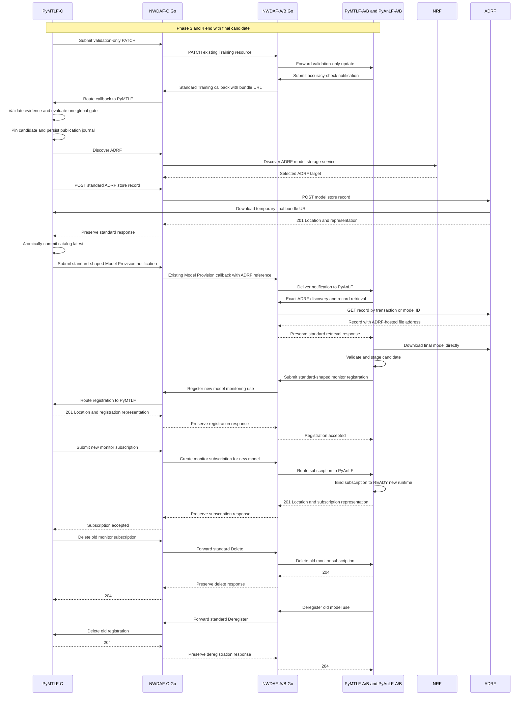

# Phase 5 Final Validation ADRF Publication And Reprovision Detailed Plan

日期：2026-07-30

狀態：已完成實作、code review remediation 與跨 process E2E 驗證

上層計畫：

- [Distributed NWDAF Federated Learning Implementation Plan](Distributed%20NWDAF%20Federated%20Learning%20Implementation%20Plan.md)

相關基線：

- [Phase 3 And 4 Federated Training Execution Detailed Plan](Phase%203%20And%204%20Federated%20Training%20Execution%20Detailed%20Plan.md)
- [Phase 2 Cross-NWDAF Model Provision And Monitoring Detailed Plan](Phase%202%20Cross-NWDAF%20Model%20Provision%20And%20Monitoring%20Detailed%20Plan.md)
- [Distributed NWDAF Model Monitoring and Federated Retraining Architecture](../../design/Distributed%20NWDAF%20Model%20Monitoring%20And%20Federated%20Retraining%20Architecture.md)
- [NWDAF AnLF／MTLF Current Feature Architecture](../../design/Current%20AnLF%20MTLF%20Feature%20Architecture.md)
- [NWDAF Development Policy](../../development_policy.md)

---

## 1. 目的

Phase 3／4 已讓 NWDAF-C 協調 NWDAF-A、NWDAF-B 完成固定參與者、
多輪、sample-count-weighted FedAvg，但目前流程只產生
`CANDIDATE_READY`：

```text
final ROUND_GLOBAL
  -> unpromoted candidate
  -> CANDIDATE_READY
```

Phase 5 將這個候選模型轉換為可正式提供、可在 restart 後恢復、且已由
ADRF 保存的 latest model：

```text
CANDIDATE_READY
  -> A/B final validation
  -> global promotion gate
  -> durable publication handoff
  -> ADRF store
  -> atomic catalog commit
  -> Model Provision notification
  -> A/B retrieve and stage
  -> new monitor relationship
  -> retire old relationship
```

本 Phase 同時完成四個責任：

1. A/B 使用 Phase 3 preparation 時凍結的 validation subset 比較 base 與
   final candidate；
2. C 將通過技術檢查及設定之 performance gate 的 candidate 封裝成正式
   `FINAL_MODEL`；
3. C 經 Go SBI 邊界把正式模型保存至 ADRF，並以 durable journal 保護
   crash recovery；
4. A/B 經既有 Model Provision subscription 取得 ADRF reference，安全切換
   至新模型，再建立新的 accuracy monitor relationship。

ADRF 只負責保存及依 reference 取回模型。latest 選擇、lineage、promotion、
subscription 與 cutover 仍由 NWDAF-C／PyMTLF 管理。

---

## 2. 實作基線與 repository 邊界

### 2.1 Baseline revisions

| Repository | Branch | Baseline |
| --- | --- | --- |
| `NWDAF/` | `feat/r18-federated-learning` | `9244783` |
| `PyAnLF/` | `feat/r18-federated-learning` | `8f20f0a` |
| `PyMTLF/` | `feat/r18-federated-learning` | `84081fd` |
| `nwdaf-resources/` | `feat/r18-federated-learning` | `e84c5bd` |
| `adrf/` | `feat/r18-federated-learning` | `b656b08` |
| `nwdaf-docs/` | `main` | `3cd2e60` |

Team ADRF 的 editable repository 已 clone 至 workspace `adrf/`。它從最新
`origin/with-mlmodelmanagement` 建立
`feat/r18-federated-learning`，可作為 Phase 5 implementation target。

`resources/adrf/` 保留為 read-only reference，不再作為提交目標。

### 2.2 Repository ownership

| Repository | Phase 5 責任 |
| --- | --- |
| `PyMTLF/` | final validation orchestration、global gate、durable catalog／publication、ADRF store client、promotion、cutover tracking |
| `PyAnLF/` | validation-only execution、ADRF reference resolution、candidate staging、new-before-old monitor cutover |
| `NWDAF/` | Release 18 ADRF wire compatibility、NRF discovery、ADRF store／retrieve SBI forwarding |
| team ADRF | 第一版 URL-backed single-model store／retrieve vertical |
| `nwdaf-resources/` | cross-process fixtures、failure injection、Phase 5 E2E |
| `nwdaf-docs/` | plan、evidence、progress、review record |

`resources/` 僅用於參考，不直接修改。

### 2.3 Package placement constraint

本 Phase 不因為新增功能就建立新的 Go package。新增程式必須先放入現有
責任邊界：

```text
NWDAF/internal/compat/adrf
  Release 18 ADRF ML Model Management wire types

NWDAF/internal/sbi/consumer
  outbound Nadrf_MLModelManagement HTTP client

NWDAF/internal/mtlf
  PyMTLF-C store/probe auxiliary routes

NWDAF/internal/anlf
  PyAnLF-A/B retrieval auxiliary routes
```

只有現有 package 無法維持依賴方向、且至少有兩個獨立 caller 需要共用
同一責任時，才重新啟動 new-package review。

---

## 3. 已存在的 foundation 與目前缺口

### 3.1 已存在

PyMTLF 已有：

- `ROUND_LOCAL`、`ROUND_GLOBAL`、`FINAL_MODEL` artifact roles；
- `ACCURACY_CHECK` result type；
- base／candidate WAPE component schema；
- final validation summary 與 global gate metadata；
- numeric model identity 與 in-memory provider-wide allocator；
- `PendingPublication`、`CompletedRevision`、`ModelCatalogRecord` 等 durable
  record foundation；
- Phase 3／4 的 fixed participant set、frozen dataset snapshot、candidate
  artifact 與 callback correlation。

PyAnLF 已有：

- Model Provision subscription／notification worker；
- URL-backed model download、archive／manifest／digest validation；
- active model runtime 與 desired monitor registration reconciliation；
- Model Monitor registration／subscription 的同步 request-response chain；
- Go sync 所帶的 restart recovery snapshot；
- model activation 後的 warm-up 與 WAPE report。

NWDAF 已有：

- generic NRF discovery auxiliary interface；
- ADRF target type、`nadrf-mlmodelmanagement` service name 與
  `ml-model-storage-ind` query parsing；
- standard-shaped Go/backend routing pattern；
- ADRF Data Management consumer，可作 timeout、redirect、ProblemDetails
  與 target handling 的實作參考。

### 3.2 缺口

目前 Phase 3／4 在 candidate ready 後會立即：

- DELETE A/B Training resources；
- 清除 callback correlations；
- 將 retrain family 標記為完成。

因此尚無機會在同一 resource 上進行 final validation，也無法阻止
publication／cutover 期間啟動另一個 retrain。

另外：

- PyMTLF Client 尚未執行 `mLAccChkFlg=true + skipFlInd=true` 的
  validation-only branch；
- Client resource 未保留可重用的 preparation base artifact reference；
- durable record models 尚未接到 runtime；
- current in-memory catalog 每次啟動由 seed config 重建；
- ADRF ML Model Management 尚未接到 NWDAF Go auxiliary；
- PyAnLF 只支援 `mLFileAddr`，尚未解析 `mLModelAdrf`；
- PyAnLF 目前切換 active model 後會太早移除 old runtime／registration；
- notification callback 的 `204` 只證明 PyAnLF 已接收工作，不證明模型
  已下載、啟用或完成新 monitor relationship。

### 3.3 Team ADRF reference 的已知不相容

目前 reference implementation 可證明團隊已有 ML Model Management
雛形，但不可直接視為 Release 18 contract：

- repository 內附的 `docs/spec/TS29575_Nadrf_MLModelManagement.yaml`
  標示 V19.6.0，且 schema／response 已被簡化；Phase 5 不以它作 wire
  source of truth；
- `modelUniqueId` 使用 string，而本地 Release 18 YAML 是 `Uinteger`；
- `mlFileAddr` 形狀不是 `MLModelAddr` object；
- 缺少 `allowConsumerList`；
- response 使用非標準 top-level `storeResult`，而非
  `modelStoreResult` object；
- collection GET 尚未正確實作 `store-trans-id`／`model-unique-ids`
  selection；
- NRF capability 尚未使用 `adrfInfoList[].mlModelStorageInd`；
- model URL 下載失敗時仍可能保存 failed record 並回 `201`，而不是規格
  error response；
- 存在額外的 individual GET／download path，不可拿來取代標準
  collection retrieval。

Phase 5 只要求修正本情境使用的 URL-backed single-model vertical，不要求
一次完成整個 ADRF service。wire source of truth 固定為
`nwdaf-docs/specs/openapi/` 的 Release 18 OpenAPI 與對應 TS text。

---

## 4. 規格證據與 project profile

### 4.1 ADRF store／retrieve

[TS 29.575 Nadrf ML Model Management OpenAPI](../../../specs/openapi/TS29575_Nadrf_MLModelManagement.yaml)
定義：

- `POST /mlmodel-store-records` 建立 store record；
- 成功必須回 `201`、`Location` 與
  `NadrfMLModelStoreRecord` representation；
- `GET /mlmodel-store-records` 可用 `store-trans-id` 或
  `model-unique-ids` 查詢；
- 找到時回 `200` representation，無符合項目時回 `204`；
- retrieval 可回 `307`／`308` redirect；
- URL-backed `MLModelInfo` 包含 numeric `modelUniqueId`、
  `mlFileAddr` 與 `mlStorageSize`；
- `allowConsumerList` 可表達允許取回模型的 NF instance／set。

本地 Release 18 YAML 的 `modelStoreResult` 是單一 `ModelStoreResult`
object。Phase 5 wire contract 以此 YAML 為準；第一版每次只存一個 model，
不支援 multi-model store request。

成功的 store result 必須為：

```text
ML_MODEL_FILE_STORED_IN_ADRF
```

依同一份 Release 18 TS 29.575 procedure：

- model file address 不存在時回 `404` ProblemDetails，cause 為
  `ML_MODEL_FILE_ADDRESS_NOT_FOUND`；
- model download 失敗時回 `500` ProblemDetails，cause 為
  `ML_MODEL_FILE_DOWNLOAD_FAILED`。

這兩種情況不得保存成 successful record，也不得回 `201`；
`modelStoreResult.storeResult=ML_MODEL_FILE_STORED_IN_ADRF` 才能通過
publication gate。

[TS 23.288 §6.2B.5–6.2B.7](../../../specs/TS%2023.288/6%20Procedures%20to%20Support%20Network%20Data%20Analytics/6.2B%20Analytics%20Data%20and%20ML%20Model%20Repository%20procedures.md)
進一步說明：MTLF 可提供 model address 讓 ADRF 下載並本地保存；retrieval
成功後，ADRF 回傳其所保存 model 的 identifier 與 file address。
[TS 29.575 §4.3](../../../specs/TS%2029.575/4%20Services%20offered%20by%20the%20ADRF/4.3%20Nadrf%20_%20MLModelManagement%20Service.md)
也明確把 storage、retrieval 與 removal 定義為 ADRF 的
ML Model Management 責任。

### 4.2 Model Provision ADRF reference

[TS 29.520 Nnwdaf ML Model Provision OpenAPI](../../../specs/openapi/TS29520_Nnwdaf_MLModelProvision.yaml)
定義 `MLEventNotif` 必須提供 `mLFileAddr` 或 `mLModelAdrf` 其中之一。
`MLModelAdrf` 必須提供 `adrfId` 或 `adrfSetId`，但 `storTransId` 本身是
optional。

Phase 5 固定 profile：

- 使用 instance-level `adrfId`；
- top-level `modelUniqueId` 必須存在；
- 正常 store path 同時提供 `storTransId`；
- 若 crash recovery 只能由 `modelUniqueId` 證明 ADRF 已保存，則允許
  `mLModelAdrf` 省略 `storTransId`，不得自行發明 transaction ID；
- A/B 優先以 `store-trans-id` exact retrieval；沒有 transaction ID 時才以
  `model-unique-ids` retrieval。

### 4.3 ADRF NRF capability

[TS 29.510 Nnrf NF Discovery OpenAPI](../../../specs/openapi/TS29510_Nnrf_NFDiscovery.yaml)
定義 `ml-model-storage-ind=true` discovery query；
[TS 29.510 Nnrf NF Management OpenAPI](../../../specs/openapi/TS29510_Nnrf_NFManagement.yaml)
的 `AdrfInfo.mlModelStorageInd` 表達 ADRF model storage／retrieval
capability。

Phase 5 discovery 同時要求：

```text
target-nf-type=ADRF
requester-nf-type=NWDAF
service-names=nadrf-mlmodelmanagement
ml-model-storage-ind=true
```

retrieval 已持有 `adrfId` 時，再加入 exact `target-nf-instance-id`。此流程
重用 Phase 1 generic discovery interface，不新增 ADRF-specific discovery
API。

### 4.4 標準與 project-private 邊界

| 資料／行為 | 邊界 |
| --- | --- |
| Training subscription、PATCH、callback | TS 29.520-shaped |
| `mLAccChkFlg`、`skipFlInd`、`roundInd` | TS 29.520 fields |
| artifact URL 內的 `ACCURACY_CHECK` metadata | project-private bundle contract |
| ADRF store／retrieve body、query、status、Location | TS 29.575 |
| Model Provision `mLModelAdrf` | TS 29.520 |
| publication journal、catalog、gate evidence | PyMTLF private durable state |
| candidate activation／cutover retry state | PyAnLF private runtime state |

Private metadata 不塞入未定義的 standard JSON fields；它只存在
artifact bundle 或 backend local state。

---

## 5. 固定 end-to-end 流程



重要 transaction boundaries：

1. validation callback 完成前，不進入 publication；
2. durable handoff 完成前，不刪除 Training resources；
3. ADRF store 成功前，不更新 latest；
4. catalog commit 成功前，不送 Model Provision notification；
5. notification `204` 不等於 model activation success；
6. new monitor relationship 成立前，不移除 old model relationship。

---

## 6. Identity 與 ownership

### 6.1 Identity map

| Identity | Owner | 用途 |
| --- | --- | --- |
| `mlCorreId` | C | 一次 FL process；串接 rounds、validation、publication evidence |
| Training subscription ID | A/B Go | 標準 Training resource |
| notification correlation ID | C | 把 A/B callback route 回 process／participant |
| family key | C | 同一 model demand／lineage；不放進標準 API |
| `modelUniqueId` | C | provider-wide numeric completed-model identity |
| publication ID | C | durable publication job identity |
| `storeTransId` | ADRF | ADRF store record locator；可能在 recovery 中不可取得 |
| `adrfId` | ADRF NRF profile | authoritative storage NF identity |
| artifact digest | artifact producer | bytes identity 與 integrity |

### 6.2 Model ID allocation

- `modelUniqueId` 使用 Unix milliseconds 作為 allocation baseline；
- 配置公式固定為
  `max(currentUnixMilliseconds, lastAllocatedModelId + 1)`；
- `lastAllocatedModelId` 與 catalog／publication journal 一起 durable
  保存並在同一 state lock 下更新；
- `modelUniqueId` 因此在 C provider namespace 內唯一且單調遞增；
- 同一毫秒多次配置或 system clock rollback 不會重用 ID；
- ID 在 publication journal durable 後即視為已使用；
- failed／abandoned ID 成為 tombstone，不重用；
- family 仍是 catalog selection key，numeric ID 是 provider-wide
  revision identity；
- Phase 5 第一個 E2E 只驗收一個 family，但 durable schema 不應把未來所有
  family 強迫成同一 linear lineage。

這不宣稱不同 MTLF providers 之間具有全域唯一性。正式 artifact 的 bytes
identity 仍由 SHA-256 digest 表達；timestamp-based `modelUniqueId` 是版本
識別與排序值。若手動清除 C durable state、但保留 ADRF database，既有
ADRF records 不會自動消失，而會成為 C 不再管理的 historical／orphan
records；同時也失去由 persisted `lastAllocatedModelId` 提供的完整
non-reuse proof。乾淨重跑實驗時建議兩者一起清除，但這不是 ADRF 的自動
行為。

### 6.3 ADRF access profile

Store record：

- owner：C `nfInstanceId`；
- model：一個 completed `FINAL_MODEL`；
- `allowConsumerList`：A、B、C 的 `nfInstanceId`；
- model bytes source：C temporary artifact URL；
- ADRF 下載並保存 immutable copy；
- record 的 ADRF-hosted address 供 A/B 直接下載。

`allowConsumerList` 是 wire metadata。第一版必須由 ADRF 保存並在
retrieval representation 中保留，且 PyAnLF／PyMTLF 會驗證 expected
consumers 未被錯配。由於本實驗階段仍使用普通 HTTP，沒有可信 caller
identity 可供 ADRF 強制執行 instance-level authorization；真正的
allowlist enforcement 隨 OAuth／TLS identity hardening 一起處理，不新增
非標準 caller-ID header。這是第一版安全限制；TS 23.288 §6.2B.7 所描述的
consumer verification 尚未在本 Phase 完成。

---

## 7. Slice 5A：Client-side final validation

### 7.1 Server dispatch

最後一輪 aggregation 完成後，C 不再設為終局 `CANDIDATE_READY` 並立即
cleanup，而是進入：

```text
FINAL_VALIDATION_DISPATCH
  -> FINAL_VALIDATION_WAITING
  -> FINAL_VALIDATION_EVALUATING
```

C 對相同 A/B Training resources 發 PATCH：

```json
{
  "mLAccChkFlg": true,
  "skipFlInd": true,
  "roundInd": 2,
  "mLModelInfos": [
    {
      "mLFileAddr": {
        "mLModelUrl": "http://c.example/internal/v1/artifacts/final-candidate"
      }
    }
  ]
}
```

範例假設 training rounds 為 `0`、`1`，所以 final validation
`roundInd=2`。

只有以下 exact combination 進入 validation-only branch：

```text
mLAccChkFlg == true
AND skipFlInd == true
AND exactly one candidate model reference
AND roundInd == expected validation round
```

其他模糊組合回標準可表達的 client error，不猜測 caller 意圖。

### 7.2 Client execution

A/B：

1. 重用 preparation 時凍結的 validation subset；
2. 載入 preparation base model 與 final candidate；
3. 使用同一 preprocessing／scaler contract；
4. 不執行 optimizer、backpropagation 或 local fitting；
5. 分別計算 base 與 candidate 的 WAPE components；
6. 將 candidate weights 原封不動包入
   `ROUND_LOCAL/result_type=ACCURACY_CHECK`；
7. callback 仍使用既有 Training notification path。

Client resource 因此必須保留：

- frozen dataset snapshot；
- validation row selection；
- preparation base artifact key／digest；
- model／preprocessing contract digest；
- assigned scope digest；
- final candidate input digest。

不重新向 ADRF 抓另一批 validation data，也不重新切分資料。

### 7.3 WAPE evidence

每個 assigned scope 必須提供：

```text
absolute_error_sum
absolute_actual_sum
evaluation_sample_count
validation start_time
validation end_time
base weights digest
candidate weights digest
scope digest
participant NF instance ID
```

WAPE：

```text
WAPE = absolute_error_sum / absolute_actual_sum
```

`absolute_actual_sum` 必須大於零。C 的 aggregate WAPE 使用所有 scope
components 加總後再相除，不平均各 scope 的 WAPE：

```text
aggregate WAPE =
  sum(scope absolute_error_sum) / sum(scope absolute_actual_sum)
```

既有 WAPE 計算方式、triggering degradation 判斷與 threshold 語意不得在
搬接 validation path 時任意修改。

### 7.4 Evidence validation

C 必須驗證：

- frozen participant set 全員恰好一份 result；
- process、participant、scope、round identity；
- base artifact 與 candidate artifact digest；
- candidate output weights digest 等於 input candidate digest；
- model contract 與 preprocessing contract digest；
- validation sample count／window；
- duplicate callback 完全相同才 idempotent；
- conflicting duplicate、missing participant、zero denominator 或 malformed
  metadata 都使 process 失敗。

第一版每個 participant 對應一個 required TAI scope。contract 仍以
assigned scope 為單位，避免把未來多 scope client 寫死。

### 7.5 Global promotion gate

只有一個 global promotion decision，不做 per-TAI model promotion。

`training.enforce_performance_gate=true`：

1. triggering scope 的 candidate WAPE 必須小於 base WAPE；
2. aggregate candidate WAPE 必須小於 aggregate base WAPE；
3. 每個 non-triggering scope 的 regression 不得超過
   `max_scope_wape_regression`。

`training.enforce_performance_gate=false`：

- 仍完整計算並保存 base／candidate evidence；
- 仍要求所有 technical／integrity checks 通過；
- 不因 candidate WAPE 較差而拒絕 publication；
- log 清楚輸出 gate 若啟用時會通過或拒絕的結果。

Phase 5 實驗 profile 預設使用 `false`。本階段的主要目標是驗證完整
validation／publication／cutover 流程，不因目前模型表現不穩定而阻擋
E2E；需要驗證 promotion policy 時再由 config 顯式啟用。

### 7.6 Handoff 與 cleanup

gate 通過後：

1. C 把 candidate、base revision、participant/sample counts 與 validation
   evidence交給 durable publication job；
2. publication state 成功 fsync 後，Phase 3／4 orchestration 才可 bounded
   DELETE A/B Training resources；
3. callback correlations 可在 cleanup 後移除；
4. family retrain-in-flight 不在此時釋放，直到 publication 與 required
   A/B cutover 完成或進入明確 terminal failure。

gate 拒絕或 validation timeout 時：

- 不建立 completed model；
- 不存 ADRF；
- 不更動 latest；
- bounded cleanup Training resources；
- 釋放 family in-flight；
- 保留 workspace／evidence 至 retention expiry 供 review。

---

## 8. Slice 5B：ADRF Model Management control path

### 8.1 NWDAF internal APIs

內部 API 延續「標準 shape、Go 檢查與轉送、Python 做業務決策」原則。
建議 route：

```text
POST /internal/v1/adrf-mlmodelmanagement/mlmodel-store-records
GET  /internal/v1/adrf-mlmodelmanagement/mlmodel-store-records
```

兩個 backend 可以使用同一標準 path shape，但 route ownership 分開：

- PyMTLF-C 使用 store 與 publication reconciliation retrieval；
- PyAnLF-A/B 使用 model retrieval。

POST body 必須是 standard `NadrfMLModelStoreRecord`。GET query 保留
`store-trans-id`／`model-unique-ids` 原名。

### 8.2 Go responsibility

Go：

- 驗證 backend readiness、body size、media type、required target headers；
- 使用 backend 提供或 generic discovery 選出的 exact ADRF target；
- 執行標準 ADRF HTTP operation；
- 保留成功 status、response body 與 `Location`；
- 保留規格列出的 `ProblemDetails` status；
- 按既有 peer consumer policy 處理 `307`／`308`；
- 不選 latest、不建立 publication、不解析模型 bundle；
- 不代理 ADRF-hosted model bytes。

若 Go 連不上 ADRF，回可辨識的 peer-unavailable `ProblemDetails`，Python
依 publication／retrieval policy retry。Go 不把 peer error 改寫成業務成功。

### 8.3 Python target selection

PyMTLF／PyAnLF 各自保留獨立 ADRF config：

```text
mode: nrf | fixed
fixed_api_root
configured_nf_instance_id
retry interval
request timeout
download timeout
```

兩者可採不同 discovery mode。只要最後指向通知或 publication 所要求的
ADRF identity 即可。

固定模式必須同時配置 `configured_nf_instance_id`。收到
`mLModelAdrf.adrfId` 時若不相等，直接失敗，不靜默改用固定 endpoint。

### 8.4 Team ADRF first vertical

本 Phase 不把 team ADRF 改造成完整、泛用的 Release 18
ML Model Management implementation。只擴充 A/B/C 實驗會使用的
single-model profile：

```text
owner              = one nfInstanceId
payload            = exactly one mlModelInfo
model identity     = one numeric modelUniqueId
model transport    = one mLModelUrl
storage metadata   = mlStorageSize
allowed consumers  = A, B and C nfInstanceId
retrieval selector = one store-trans-id OR one model-unique-id
```

對此 profile，team ADRF 必須：

- NRF profile 使用 `adrfInfoList[].mlModelStorageInd=true`；
- service name 為 `nadrf-mlmodelmanagement` 且 status available；
- 接受一個 URL-backed `MLModelInfo`；
- 下載、驗證 size 並保存 immutable bytes；
- address not found 時回標準 `404` ProblemDetails；
- download failed 時回標準 `500` ProblemDetails；
- failed download 不建立可 retrieval 的 store record；
- 產生 ADRF 自己的 `storeTransId`；
- 回 `201 + Location + NadrfMLModelStoreRecord`；
- 回正確 `modelStoreResult`；
- collection GET 支援 `store-trans-id` 或 `model-unique-ids`；
- 找不到回 `204`；
- store／retrieve representation 正確保存並回傳 `allowConsumerList`；
- response 提供 ADRF-hosted file address。

實作時沿用現有：

- MongoDB repository；
- store transaction ID generator；
- local model directory；
- URL downloader；
- ADRF-hosted model download endpoint；
- `Location` 建構方式；
- NRF registration／heartbeat lifecycle。

只在上述流程無法正確運作的地方修改，不整理其他 ADRF Data Management
程式、不重構整個 processor／repository，也不為未使用的 schema variants
建立通用 abstraction。

第一版驗證只涵蓋：

1. one happy-path POST；
2. address／download failure status；
3. GET by transaction ID；
4. GET by one numeric model ID；
5. `204` no match；
6. NRF profile 包含 model storage capability；
7. stored bytes 可由 response address 下載且 digest 相同。

不要求舊 MongoDB ML model records 的 schema migration；Phase 5 E2E 使用
fresh experiment database。現有額外 individual GET／PUT／DELETE routes
可以保留，但本 Phase 不依賴、不擴充也不宣告其標準合規性。

明確 defer：

- inline `mlModels`；
- multi-model request；
- ADRF record PUT；
- delete／retention lifecycle；
- ADRF set selection；
- priority／capacity-aware ADRF selection；
- 任意查詢／latest model management；
- multi-selector／multi-result handling；
- 完整 NF Set、FQDN 與 forward-compatible schema validation；
- 與本實驗無關的泛用輸入防禦與 legacy cleanup。

---

## 9. Slice 5C／5D：Durable publication 與 atomic promotion

### 9.1 Durable state shape

避免 catalog 與多個 journal files 之間無法原子提交，本 Phase 使用一個
versioned state snapshot：

```text
DurableModelState
├── schemaVersion
├── providerNamespace
├── lastAllocatedModelId
├── families
│   └── completed revisions and latest pointer
├── pendingPublications
└── tombstonedModelIds
```

大型 artifact 不放入 JSON，而是存於 content-addressed artifact repository
及 durable publication directory。state 只保存 path、digest 與 metadata。

每次 state write：

1. 同 directory 建 temporary file；
2. write full representation；
3. fsync file；
4. `os.replace`；
5. fsync parent directory。

同一 process 內使用單一 state lock。catalog append、latest update 與
publication state transition 必須透過同一 durable repository。

### 9.2 Publication states

```text
RESERVED
  -> FINAL_BUNDLE_READY
  -> STORE_IN_FLIGHT
  -> STORE_ACCEPTED
  -> CATALOG_COMMITTED
  -> CUTOVER_PENDING
  -> COMPLETE

any recoverable state -> retry or reconcile
irrecoverable input corruption -> FAILED_TERMINAL
```

每個 pending publication 至少保存：

- publication ID；
- family key；
- `mlCorreId`；
- reserved model ID；
- expected previous model ID／generation／artifact digest；
- participant IDs 與 training sample counts；
- full validation evidence／gate result；
- pinned candidate path／digest；
- final bundle path／digest；
- selected ADRF ID／API root identity；
- optional store transaction ID；
- optional resource Location；
- required／adopted cutover scope identities；
- retry count、last error、updated time。

### 9.3 Exact publication order

```text
1. Recheck current family base revision
2. Pin candidate into durable publication directory
3. Reserve numeric model ID and persist journal
4. Build immutable FINAL_MODEL bundle
5. Fsync bundle and persist FINAL_BUNDLE_READY
6. Discover/select ADRF
7. Persist STORE_IN_FLIGHT
8. POST standard store record
9. Validate 201, Location, representation and store result
10. Persist STORE_ACCEPTED with ADRF reference
11. Recheck stale-base compare-and-swap condition
12. Atomically append completed revision and update latest
13. Mark CATALOG_COMMITTED
14. Persist CUTOVER_PENDING with required adoption scopes
15. Enqueue desired Model Provision notifications
16. Mark COMPLETE only after required cutovers
```

第 1 與第 11 步都要做 stale-base check。只要 latest 已非本 job 所訓練的
base revision，即使 ADRF 已保存 candidate，也不得把它 promotion 成
current latest。

### 9.4 FINAL_MODEL bundle

正式 bundle 沿用既有 inference bundle components：

```text
config.json
model.py
model.npy
scaler.pkl
```

`config.json` 增加已存在的 `FINAL_MODEL` contract metadata：

- new model identity；
- previous model identity；
- family／analytics descriptor；
- `mlCorreId`；
- participant NF instance IDs；
- participant training sample counts；
- base／candidate weights digest；
- per-scope final validation evidence；
- global gate result；
- creation time；
- component digests。

training workspace 的 round bundles 不寫入 ADRF。只有 completed
`FINAL_MODEL` 進入 ADRF。

### 9.5 Store request

概念範例：

```json
{
  "nfInstanceId": "33333333-3333-4333-8333-333333333333",
  "mlModelInfo": [
    {
      "modelUniqueId": 42,
      "mlFileAddr": {
        "mLModelUrl": "http://c.example/internal/v1/artifacts/final-digest"
      },
      "mlStorageSize": 1048576,
      "allowConsumerList": [
        {"nfInstanceId": "11111111-1111-4111-8111-111111111111"},
        {"nfInstanceId": "22222222-2222-4222-8222-222222222222"},
        {"nfInstanceId": "33333333-3333-4333-8333-333333333333"}
      ]
    }
  ]
}
```

temporary URL 只需維持到 ADRF 已下載並回 store success；journal 未進入
`STORE_ACCEPTED` 前，artifact 不得被 retention cleanup。

### 9.6 Store success validation

正常成功必須同時滿足：

- HTTP `201`；
- `Location` 存在且 path 最後一段可解析為 `storeTransId`；
- response owner 等於 C；
- response model ID 等於 reserved ID；
- response `modelStoreResult.modelUniqueId` 等於 reserved ID；
- `storeResult=ML_MODEL_FILE_STORED_IN_ADRF`；
- size／allowlist 等必要 metadata 未被錯配。

正常 path 的 `storeTransId` 只從 `Location` 取得，不從本地猜測或使用
request ID 代替。

### 9.7 Ambiguous store recovery

`STORE_IN_FLIGHT` 可能表示：

- ADRF 沒收到 request；
- ADRF 已存但 response 遺失；
- response 已回但 C 在 journal update 前 crash。

startup 或 retry worker 不可直接盲目重送 POST。順序：

1. 以 reserved `modelUniqueId` 做 bounded retrieval probe；
2. 若找到，驗證 owner、model ID、size、allowlist 與下載後 digest；
3. 可證明是同一 final bundle時，進入 `STORE_ACCEPTED`；
4. probe 無法回傳 transaction ID 時，ADRF reference 允許只記
   `adrfId + modelUniqueId`；
5. bounded visibility probes 均為 `204` 後才可重試同一 publication 的
   POST；
6. conflicting record 是 terminal conflict，不覆蓋、不 promotion。

這利用 C provider-wide、不重用的 numeric model ID 做 idempotency
reconciliation，不假設 ADRF POST 本身具 idempotency key。

### 9.8 Catalog commit

ADRF store success 後，C 在同一 atomic state transaction：

- append completed revision；
- 更新該 family latest pointer；
- 保存 ADRF reference；
- 保存 validation summary；
- 將 pending publication 標記為 `CATALOG_COMMITTED`；
- 保存 required cutover scopes，接著轉為 `CUTOVER_PENDING`；
- 保持 `lastAllocatedModelId` 不小於所有
  completed／reserved／tombstoned IDs。

只有這次 durable write 成功後：

- provision request 才可解析到新 latest；
- notification dispatcher 才可 enqueue new model；
- log 才可宣告 promotion complete。

若 commit 失敗，old latest 保持不變。ADRF 中已保存的模型成為可由 journal
reconcile 的未 promotion artifact，不得靠啟動時「挑最大 ID」自動
promotion。

pending publication 不在 catalog commit 後立刻刪除。它轉為 durable
cutover record，直到 required A/B scopes 完成 adoption 後才標記
`COMPLETE`；之後可依 retention policy compact／archive。

### 9.9 Startup recovery

啟動順序：

1. 載入及驗證 durable state；
2. 驗證 completed revision artifacts／ADRF reference shape；
3. 驗證 pending pinned artifacts digest；
4. 還原 family retrain-in-flight；
5. 依 publication state enqueue recovery；
6. 最後啟動新的 degradation intent consumption。

Recovery：

| State | Startup action |
| --- | --- |
| `RESERVED` | 由 pinned candidate 重建 final bundle |
| `FINAL_BUNDLE_READY` | 重新 discovery／store |
| `STORE_IN_FLIGHT` | 先 probe，禁止 blind POST |
| `STORE_ACCEPTED` | 做 stale-base check 並 commit catalog |
| `CATALOG_COMMITTED` | 建立 durable cutover desired state |
| `CUTOVER_PENDING` | 以 durable adoption state 配合 restart sync snapshot 恢復既有 resources；未完成者重新 enqueue desired notification／reconciliation |
| `COMPLETE` | 不重送；依 retention policy compact |
| `FAILED_TERMINAL` | 保留 tombstone 與 evidence，不自動重試 |

若 pinned candidate／final bundle 遺失或 digest 錯誤：

- 標記 `FAILED_TERMINAL`；
- reserved model ID tombstone；
- old latest 不變；
- 不從不可信 bytes 重建或 promotion。

---

## 10. Slice 5E：PyAnLF ADRF retrieval

### 10.1 Provision notification

C 在 catalog commit 後，沿既有 Model Provision subscription 發：

```json
{
  "eventNotifs": [
    {
      "event": "UE_COMMUNICATION",
      "modelUniqueId": 42,
      "mLModelAdrf": {
        "adrfId": "44444444-4444-4444-8444-444444444444",
        "storTransId": "store-transaction-id"
      }
    }
  ],
  "subscriptionId": "existing-model-provision-subscription"
}
```

Ambiguous store recovery 無法取得 transaction ID 時可省略
`storTransId`，但 `modelUniqueId` 仍必須存在。

### 10.2 Retrieval sequence

PyAnLF：

1. 驗證 notification event／scope 與 current demand；
2. 讀取 `modelUniqueId` 與 `mLModelAdrf.adrfId`；
3. NRF mode exact discovery 該 ADRF，或驗證 fixed endpoint identity；
4. 有 `storTransId` 時用 `store-trans-id` GET；
5. 否則用 `model-unique-ids` GET；
6. 驗證 record owner、model ID、allowlist、size 與唯一 match；
7. 從 ADRF-hosted `mlFileAddr` 直接下載；
8. 執行 compressed size、extracted size、entry count、path safety、
   component digest、bundle schema、runtime compatibility 驗證；
9. stage candidate，不立即破壞 old runtime。

Go 只轉送 record retrieval；artifact bytes 是 PyAnLF 對 ADRF-hosted URL
的直接 HTTP download。

### 10.3 Retrieval failure

下列任一狀況不得取代 active model：

- exact ADRF discovery 失敗；
- fixed identity mismatch；
- `204` no match；
- multiple／conflicting model match；
- record allowlist 未包含預期的 A／B／C identities；
- model ID、size、digest 或 bundle identity mismatch；
- download timeout；
- archive／runtime compatibility validation 失敗。

PyAnLF 保留 old model，依 bounded backoff 重試同一 desired notification。
不得靜默改抓另一個 ADRF 或改用另一個 model ID。

---

## 11. Slice 5F：Reprovision 與 monitor cutover

### 11.1 為什麼 notification `204` 不足夠

目前 PyAnLF callback 在接受並排入 worker 後即可回 `204`。此時：

- ADRF record 可能尚未取得；
- artifact 可能尚未下載；
- candidate 可能 validation 失敗；
- runtime 尚未切換；
- new monitor registration 尚未建立。

因此 C 不可把 notification delivery success 當作 adoption success。

本文件的「切換成功」指完整的 model-and-monitor cutover，不只是 model
bytes 已在 PyAnLF 本地啟用：

1. notification accepted；
2. ADRF retrieval／bundle validation／local runtime activation；
3. new monitor registration 的 `201` 已逐級回到 PyAnLF；
4. new monitor subscription 的 `201` 已逐級回到 PyMTLF。

第 2 步是 PyAnLF 本地 activation success；第 4 步表示 subscription 已由
PyAnLF 綁定到同一 model ID 與 scope 的 READY runtime，才是 C 與 A/B
已有共同監控關係的 end-to-end completion evidence。

### 11.2 New-before-old sequence

每個 A/B scope：

```text
OLD_ACTIVE
  -> NEW_STAGED
  -> NEW_RUNTIME_READY
  -> NEW_REGISTRATION_DESIRED
  -> NEW_REGISTRATION_ACCEPTED
  -> NEW_MONITOR_SUBSCRIPTION_ACCEPTED
  -> OLD_MONITOR_SUBSCRIPTION_RETIRING
  -> OLD_REGISTRATION_RETIRING
  -> NEW_ACTIVE
```

詳細行為：

1. PyAnLF 驗證並 stage 新 artifact；
2. 建立新 model runtime，但保留 old runtime／artifact；
3. desired monitor registrations 暫時同時包含 old 與 new model；
4. A/B 的 PyAnLF 經 A/B Go 向 C register new model use；
5. C 的 PyMTLF 建立 registration resource，`201 + Location +
   representation` 經 C Go、A/B Go 逐級回到發起的 PyAnLF；
6. C 的 monitor reconciler 經 C Go、A/B Go 建立 new monitor
   subscription／correlation；
7. A/B 的 PyAnLF 只在 model ID 與 scope 可綁定到新 READY runtime，且
   accuracy monitoring 已啟用時回 `201 + Location + representation`；
8. 該回應逐級回到 C 的 PyMTLF後，C 才將該 scope 標記 adopted；
9. C 的 reconciler 經 C Go、A/B Go 刪除 old monitor subscription；目的
   PyAnLF 完成刪除後回 `204`，並將回應逐級送回 C；
10. A/B 的 PyAnLF 在接受 old subscription delete 後，再經 A/B Go、C Go
    deregister old model use；目的 PyMTLF 完成刪除後回 `204`；
11. old registration 與 subscription 都完成清除後進入 `NEW_ACTIVE`；
12. old artifact 在 rollback grace period 後才可回收。

不新增 activation acknowledgement API。既有兩次標準 resource creation
的同步 `201` 回應就是 normal-path acknowledgement。Go sync 只在 backend
restart 後恢復 Go-owned route mirror 與 backend resource snapshot，不是
正常切換的完成訊號，也不負責判定 model runtime 或 monitoring readiness。

### 11.3 C adoption tracking

C 的 accuracy policy 以 scope identity 追蹤 adoption：

- required scopes 是觸發本次 FL process 的 A/B monitor scopes；
- new registration 必須來自 frozen participant NF instance ID；
- model ID 必須是 new latest；
- new monitor subscription 必須收到目的 PyAnLF 的成功 `201`，才能將
  scope 標記 adopted；
- old model report 只進 retired／ignored history，不再觸發新 degradation；
- family retrain-in-flight 在 required scopes 完成 adoption 前保持；
- all required scopes adopted 後，publication workflow complete。

若 A/B 其中一個在 cutover timeout 內未完成：

- 已完成者可繼續使用新模型；
- 未完成者保留或 rollback old runtime；
- C 不把整個 catalog latest 回退；
- C 保留 pending adoption status 並依 bounded retry 重新送 desired
  provision notification；
- 不重建 Consumer analytics subscription；
- 不啟動同 family 的另一個 retrain。

### 11.4 Warm-up

新 monitor relationship 成立後，PyAnLF 依既有 stable-reporting 規則累積
足夠 observation 才送含 deviation 的 WAPE report。warm-up notification
與 absence of deviation 不視為 model failure。

本 Phase 不修改 WAPE formula、window aggregation 或 degradation
threshold。

---

## 12. Failure 與 restart matrix

| Failure point | Required behavior |
| --- | --- |
| A/B final validation timeout | process failed；old latest 不變；cleanup Training resources |
| validation evidence invalid | 不 store ADRF；保留 evidence；old latest 不變 |
| gate rejected | 正常 rejected outcome；不建立 completed model |
| crash before journal fsync | Phase 3 workspace仍是唯一 candidate；不宣告 handoff |
| crash after ID reserve | restore journal；ID 不重用 |
| final bundle corrupt | terminal failure＋ID tombstone |
| NRF 找不到 ADRF | 保留 publication；interval-based rediscovery |
| ADRF endpoint temporarily down | retry same selected endpoint；必要時再 discovery |
| POST response lost | first retrieve by model ID；不得 blind duplicate POST |
| ADRF store result failed | 不 promotion；保留 retryable／terminal evidence |
| crash after ADRF success | probe and resume catalog commit |
| stale base before commit | 不 promotion；記錄 orphan ADRF artifact |
| catalog commit failed | old latest 不變；restart retry commit |
| provision callback unavailable | catalog latest 保持；desired delivery retry |
| PyAnLF retrieval invalid | old runtime 保持；retry exact reference |
| new monitor relationship timeout | old relationship保持；retry cutover |
| C restart during cutover | 從 durable adoption state與Go restart sync snapshot重建進度；未完成的subscription重新reconcile |
| A/B restart during cutover | Go restart sync snapshot恢復既有resource；PyAnLF重新stage／reconcile，正常完成仍以逐級`201`確認 |

ADRF 後來恢復可用時，不回補先前訓練資料的 storage gap；此議題屬 training
data path，與本 Phase completed-model publication 無關。

---

## 13. Config additions

具體數值可在實作時以安全 default 落地，但 config 語意先固定。

PyMTLF-C：

```text
model_state.directory
publication.temporary_artifact_retention
publication.request_timeout
publication.download_visibility_timeout
publication.retry_interval
publication.max_retry_interval
publication.probe_attempts
training.enforce_performance_gate
training.max_scope_wape_regression
cutover.timeout
cutover.retry_interval
```

Phase 5 experiment config 的 `training.enforce_performance_gate` default 為
`false`；`max_scope_wape_regression` 仍保留，供顯式啟用 gate 時使用。

PyAnLF-A/B：

```text
adrf.mode
adrf.fixed_api_root
adrf.configured_nf_instance_id
adrf.request_timeout
adrf.download_timeout
adrf.retry_interval
model_cutover.timeout
model_cutover.rollback_grace_period
```

Timeout 必須考量實驗網路與大型 model download，不使用過短 default。
所有 queue／workspace capacity 在啟動時驗證為正數並記錄有效值。

---

## 14. 實作順序

### Checkpoint 1：Validation-only vertical

- PyMTLF Client 保留 base artifact；
- 實作 accuracy-check branch；
- Server 新增 validation states／callback validation／global gate；
- cleanup 移到 durable handoff 後；
- one-client 及 two-client validation tests。

驗收：同一 candidate 在 A/B 不被訓練，candidate digest 原封不動回傳，C
能得到正確 aggregate WAPE。

### Checkpoint 2：Durable model state

- 整合 catalog／journal foundation；
- atomic state repository；
- seed migration；
- ID allocation／tombstone；
- final bundle builder；
- startup recovery unit tests。

驗收：不同 crash points restart 後不重用 ID、不錯誤更新 latest。

### Checkpoint 3：NWDAF／ADRF standard vertical

- `internal/compat/adrf` ML model types；
- existing consumer 新增 store／retrieve；
- AnLF／MTLF auxiliary routes；
- generic discovery integration；
- team ADRF first vertical correction；
- contract/status/Location tests。

驗收：C 可 store，A/B 可用 transaction ID 或 model ID 取回同一 record。

### Checkpoint 4：Publication transaction

- PyMTLF ADRF client；
- store response validation；
- ambiguous recovery probe；
- stale-base CAS；
- atomic catalog commit；
- desired notification enqueue。

驗收：ADRF success 前永遠看不到 new latest；crash 後可續接同一 job。

### Checkpoint 5：PyAnLF retrieval and cutover

- `mLModelAdrf` wire model；
- exact ADRF resolution；
- direct download／validation；
- dual old/new desired monitor state；
- standard registration／subscription response-chain cutover confirmation；
- restart-only sync reconciliation；
- rollback／retry。

驗收：新 monitor relationship 成立後才清 old relationship。

### Checkpoint 6：Cross-process E2E

- nwdaf-resources 啟動 A/B/C、PyAnLF、PyMTLF、NRF、ADRF；
- 注入 one-scope degradation；
- 跑 fixed-round FL；
- final validation；
- ADRF publication；
- reprovision；
- monitor cutover；
- crash injection。

---

## 15. Verification matrix

### 15.1 Unit／contract tests

PyMTLF：

- validation-only 不呼叫 trainer；
- base／candidate evaluation 使用 frozen rows；
- zero denominator、wrong scope、wrong round、digest mismatch 被拒絕；
- aggregate WAPE 以 components 加總；
- gate enabled／disabled；
- atomic state recovery；
- ID 不重用；
- `STORE_IN_FLIGHT` probe-first；
- stale-base commit rejection。

PyAnLF：

- `mLModelAdrf` parse；
- exact `adrfId`；
- store transaction／model ID retrieval；
- allowlist／size／digest／archive validation；
- old model retained on failure；
- new-before-old cutover；
- restart sync reconciliation。

NWDAF：

- store／retrieve route ownership；
- exact standard JSON／query names；
- selected target validation；
- `201 + Location` preservation；
- `200`／`204`／`307`／`308` preservation；
- ProblemDetails passthrough；
- body limits／unsupported content type；
- no artifact byte proxy。

ADRF：

- numeric model ID；
- URL download success／not found／failed；
- allowlist；
- collection GET selectors；
- required response representation；
- NRF capability。

### 15.2 E2E scenarios

1. **Happy path**
   A/B validation pass，ADRF store，catalog promotion，A/B retrieve，
   new monitor relationship，old cleanup。

2. **Gate reject**
   candidate aggregate較差且 gate enabled；latest／ADRF／monitor均不變。

3. **Gate observe-only**
   candidate較差但 gate disabled；evidence保留且仍可 publication。

4. **ADRF unavailable then recovery**
   candidate pinned；latest不變；ADRF恢復後同一 publication完成。

5. **Lost POST response**
   ADRF已保存但 C 未記錄；restart以 model ID probe恢復，不建立 duplicate。

6. **Catalog commit crash**
   ADRF success後 crash；restart commit同一 revision。

7. **PyAnLF retrieval failure**
   A 或 B bundle validation失敗；old model仍服務 analytics。

8. **Partial cutover**
   A完成、B timeout；A使用new，B保留old，C維持pending adoption並retry。

9. **Restart during cutover**
   A/B/C任一 restart後由 durable state與sync snapshot恢復既有resource，
   再以正常request-response reconciliation完成未完成的desired relationship。

---

## 16. Acceptance criteria

Phase 5 完成必須同時滿足：

1. C 在相同 A/B Training resources 執行 validation-only round；
2. A/B 不 fitting，且回傳的 candidate digest 不變；
3. C 驗證所有 frozen scopes 的 base／candidate WAPE evidence；
4. global gate 行為符合 config，且無 per-TAI promotion；
5. Training resources 只在 durable handoff 後 cleanup；
6. numeric model ID durable、單調、不重用；
7. completed final bundle 包含 lineage、participants、sample counts 與
   validation summary；
8. ADRF 只在標準 `201 + Location + successful modelStoreResult` 後視為
   store success；
9. ADRF success 前 latest 不變；
10. restart 可 reconcile `STORE_IN_FLIGHT`／`STORE_ACCEPTED`；
11. C 的 normal Model Provision request 只提供自己管理的 latest；
12. A/B 能從 `mLModelAdrf` 指定的 ADRF 取回相同 model；
13. retrieval／activation失敗不破壞 old analytics runtime；
14. new monitor relationship 成立後才移除 old relationship；
15. Consumer analytics subscriptions 不因 model cutover 重建；
16. E2E 證明 final validation、ADRF publication、reprovision 與
    new-before-old cutover。

---

## 17. 明確不在 Phase 5

- per-TAI／per-scope 同時保留多個 latest model；
- model tree／best-model selection；
- dynamic FL participant replacement；
- partial aggregation；
- ADRF inline model transfer；
- ADRF multi-model store；
- ADRF set selection；
- ADRF retention／delete lifecycle；
- training round artifact 存 ADRF；
- automatic orphan model deletion；
- TLS／OAuth security hardening；
- UDM group resolution、AMF AoI membership、SMF／UPF dynamic collection；
- Phase 6 standard collection prerequisites；
- Phase 7 portable/full-collection system E2E。

---

## 18. Implementation gates

### G1：Editable team ADRF repository

已滿足：

- repository：workspace `adrf/`；
- branch：`feat/r18-federated-learning`；
- baseline：`b656b08`；
- source branch：`origin/with-mlmodelmanagement`。

### G2：Durable state location

已決定使用：

- model ID：durable monotonic Unix-millisecond allocator；
- model state：`data/model-state/`；
- publication artifacts：`data/publications/`。

兩個 directories 都位於 PyMTLF `data/` 下並由 `.gitignore` 排除。實驗若
顯式清除此 state，ADRF records 不會自動清除。為避免留下 C 已無法管理的
historical／orphan records，乾淨重跑時建議一起清除該實驗的 ADRF
database；若刻意保留 ADRF，則需接受舊 records 仍存在且 allocator 不再能
從已刪除的 state 證明完整 non-reuse history。

---

## 19. Definition of done

Phase 5 不是在「產生一個看似較好的 candidate」時完成，而是在以下狀態
成立時完成：

```text
FINAL_MODEL is durably stored in ADRF
AND C catalog durably points latest to that model
AND A and B retrieved and validated the same model
AND new monitor relationships are established through successful resource responses
AND old relationships are retired only afterward
```

任何較早的狀態都必須能在 restart 後辨認、恢復或明確失敗，不得用
in-memory success log 代替 durable completion。

---

## 20. 實作結果（2026-07-31）

### 20.1 Repository results

`PyMTLF/` 已完成：

- A/B validation-only round、frozen validation evidence 與 global gate；
- numeric timestamp-based model ID、completed revision 與 atomic durable
  model-state snapshot；
- `FINAL_MODEL` bundle、participant sample counts、lineage 與 validation
  metadata；
- ADRF store request、probe-first ambiguous recovery、response owner／size／
  allowlist validation；
- publication retry journal、terminal tombstone、startup reconciliation；
- ADRF success 後才進行 stale-base guarded catalog commit；
- durable `CUTOVER_PENDING`／`COMPLETE` adoption tracking；
- restart 後重新建立 generation in-flight 與 provision desired state。

`PyAnLF/` 已完成：

- `mLModelAdrf` exact ADRF resolution；
- 有 `storTransId` 時以 transaction ID retrieval，沒有時以
  `modelUniqueId` retrieval；
- record owner、allowed consumer、model ID、successful store result 與
  ADRF-hosted URL origin validation；
- bundle 下載、既有 archive／digest／runtime validation；
- new runtime、new registration、new monitor subscription 成功後才移除
  old relationship；
- retrieval／activation failure 保留 old runtime；
- callback queue consumption 與 monitor delete ordering 的 E2E 衍生問題
  已修正並加入 regression tests。

`NWDAF/` 已完成：

- Release 18 ADRF ML Model Management compat types；
- PyMTLF store／retrieve 與 PyAnLF retrieve auxiliary routes；
- `Target-Api-Root`、standard query name、request shape 與 response
  `Location`／status／body preservation；
- Go 僅做標準 SBI validation／forwarding，不代理 model bytes，也不承擔
  publication decision。

Team `adrf/` 已完成本 Phase 的 single-model vertical：

- NRF profile 同時廣告 Data Management 與 ML Model Management；
- URL-backed model download、size check、immutable local file 與 Mongo
  record；
- numeric model ID、allowed-consumer metadata、`201 + Location +
  modelStoreResult`；
- collection GET by transaction ID 或 model ID；
- source 404 回 `404/ML_MODEL_FILE_ADDRESS_NOT_FOUND`；
- transport／下載／size failure 回
  `500/ML_MODEL_FILE_DOWNLOAD_FAILED`；
- failure 不建立可 retrieval 的 record；
- model ID unique index 防止 ambiguous duplicate。

`nwdaf-resources/` 已擴充 isolated distributed FL runner，實際驗證：

1. A/B/C role 與 NRF discovery；
2. two-client fixed-round weighted FedAvg；
3. A/B final validation-only results；
4. C 建立正式 model ID 與 final bundle；
5. ADRF 保存 record 與 bytes；
6. C latest catalog commit；
7. A/B 由 ADRF reference 下載並啟用相同模型；
8. new monitor relationship 成立；
9. old routes／relationships 之後才退休。

Runner 使用 temporary MongoDB、model-state、publication、artifact 與 ADRF
model directory；測試結束不在任一 repository 留下 runtime data。

### 20.2 Verification evidence

已通過：

- `NWDAF/`: `go test ./...`
- `adrf/`: `go test ./...`
- `PyAnLF/`: full Ruff check 與 full pytest
- `PyMTLF/`: full Ruff format check、Ruff check 與 full pytest
- `nwdaf-resources/`: distributed FL Ruff check、preflight、role/discovery
  verifier 與完整 cross-process E2E
- 所有 affected repositories：`git diff --check`

Cross-process 最終結果：

```text
Published model <timestamp-model-id> stored in ADRF and adopted by A/B
PASS: isolated distributed NWDAF control plane, federated training,
final validation, ADRF publication, and model cutover verified
```

本結果證明 Phase 5 profile，不宣稱 Phase 6 的 UDM／AMF／SMF／UPF
standard collection prerequisites 或 Phase 7 full-core E2E 已完成。
