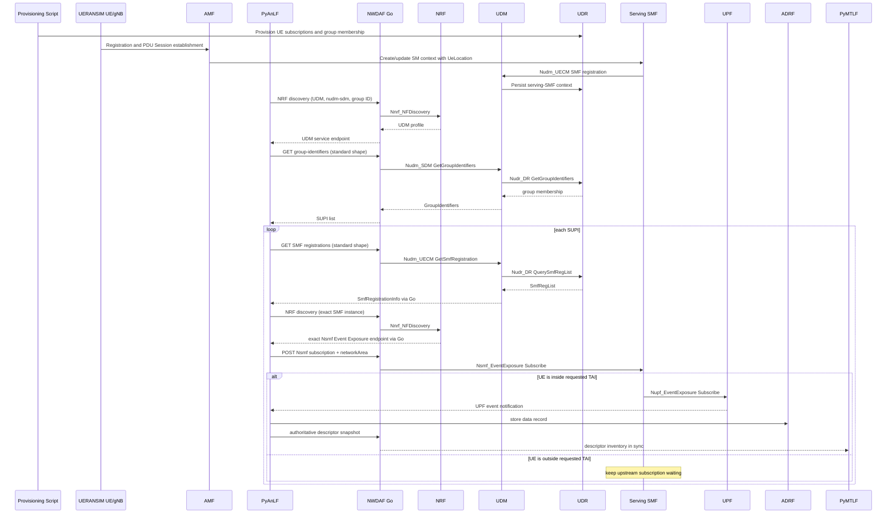

# Phase 6 Standard Collection And Full-Core Data-Flow Detailed Plan

日期：2026-08-04

狀態：Ready for implementation

上層計畫：

- [Distributed NWDAF Federated Learning Implementation Plan](Distributed%20NWDAF%20Federated%20Learning%20Implementation%20Plan.md)

相關設計與規格解讀：

- [Distributed NWDAF Model Monitoring and Federated Retraining Architecture](../../design/Distributed%20NWDAF%20Model%20Monitoring%20And%20Federated%20Retraining%20Architecture.md)
- [Internal Group Resolution And Serving SMF Release 18 規格解讀](../../specification-guides/Internal%20Group%20Resolution%20And%20Serving%20SMF%20Release%2018%20規格解讀.md)
- [NWDAF Federated Learning Release 18 規格解讀](../../specification-guides/NWDAF%20Federated%20Learning%20Release%2018%20規格解讀.md)
- [NWDAF Development Policy](../../development_policy.md)

---

## 1. 目的

Phase 0–5 已可使用預先存在的 training data 驗證分散式 FL、final
validation、ADRF publication、model reprovision 與 monitor cutover。Phase 6
補上 analytics subscription 到 training data 之間尚未完成的標準資料蒐集鏈：

```text
Internal Group ID
  -> UDM discovery
  -> UDM SDM group membership
  -> UDR group data
  -> SUPI list
  -> UDM UECM SMF registrations
  -> UDR context data
  -> exact serving SMF discovery
  -> Nsmf Event Exposure subscription with AoI
  -> matching UPF data
  -> PyAnLF inference and ADRF storage
  -> retained training-data descriptors
  -> PyMTLF ADRF retrieval
```

本 Phase 的目標不是擴充完整 UDM、UDR 或 SMF 產品能力，而是以既有
free5GC 分層補齊目前實驗需要的最小 Release 18 行為，並使用真實
UERANSIM registration／PDU Session 流程驗證資料從 UPF 到 ADRF 及
PyMTLF retrieval 的完整路徑。既有 AnLF collection refcount、
reconciliation、queue 與資料轉換邏輯必須保留。

## 2. 已確認的設計決策

1. NWDAF 的標準 peer 是 UDM，不直接向 UDR 讀取 subscription data。
2. PyAnLF 決定要解析哪些 group、SUPI、PDU session、SMF 與 AoI；Go
   NWDAF 負責 NRF、UDM、SMF 等標準通訊與必要驗證、轉送。
3. `Internal Group ID -> SUPI` 及 `SUPI -> serving SMF registrations` 使用
   Release 18 Nudm API 形狀；Go 與 PyAnLF 間的 private API 也保留相同欄位
   名稱、body、query、status 與 `ProblemDetails` 語意。
4. Group membership 在本實驗期間視為固定，不實作
   `GROUP_MEMBER_LIST_CHANGE` 或定期更新 membership。
5. 實驗開始前以可重複執行的 provisioning scripts 準備兩類持久資料：
   WebConsole-equivalent UE subscription／authentication data，以及合法
   Internal Group ID 對原實驗六個 SUPI 的 membership。這是 OAM／fixture
   準備操作，不是新的標準 SBI，也不要求人工操作 WebConsole UI。
6. PyAnLF 不再對一個 SUPI 向所有 SMF 建立 Cartesian-product 訂閱，而是先
   取得該 SUPI 的 SMF registration，再精確發現對應 SMF。
7. Consumer analytics subscription 的接受與底層資料來源是否已就緒分離。
   暫時解析不到 UDM、registration 或 SMF 時，PyAnLF 保留需求並重試，不回頭
   撤銷已接受的 consumer subscription。
8. AoI 以 `eventSubs[].networkArea` 傳給 SMF。第一個實驗 profile 支援
   `tais`；不宣稱已完成 `NetworkAreaInfo` 所有 area representation。
9. SMF 使用真實 PDU Session context 的 last-known `UeLocation` 判斷 TAI。
   Phase 6 啟動 AMF、AUSF、NSSF、PCF 與 UERANSIM，讓 UE registration／PDU
   Session procedure 自然產生 serving-SMF registration 與 `UeLocation`；不以
   static session fixture 取代這條驗收路徑。第一個 profile 只驗證固定位置下的
   create-time initial gate，location transition 與 AMF Event Exposure assisted
   tracking 不在本 Phase 實作。
10. Analytics subscription 刪除後，ADRF 內的歷史資料不應因 active
    `smfResources` 消失而無法被 PyMTLF 找到；因此建立有 retention 的
    training-data descriptor inventory。
11. Descriptor bridge 使用完整 authoritative snapshot，不同時設計 snapshot
    與 delta protocol。
12. Descriptor 是 private synchronization envelope，但資料規格與 analytics
    scope 分別直接使用 `NadrfStoredDataSpec` 與 `MLEventSubscription`；不再
    自訂 `dataSub`、observation window 或 `semanticScope` representation。
13. Phase 6 integration profile 假設 ADRF 可用；既有 MongoDB fallback 不在本
    Phase 擴充。
14. Phase 6 驗收止於完整 collection data flow 與 PyMTLF dataset retrieval；
    degradation、multi-round FL、final validation、model publication、
    reprovision 與 monitor cutover 仍由 Phase 7 串成完整業務 E2E。

## 3. 規格與實作證據

### 3.1 NRF discovery

[3GPP TS 29.510 V18.11.0 Nnrf NFDiscovery OpenAPI](../../../specs/openapi/TS29510_Nnrf_NFDiscovery.yaml)
提供 `service-names`、`target-nf-instance-id` 與
`internal-group-identity` query parameters。因此本計畫的兩段 UDM discovery
都使用同一個通用 Nnrf API：第一段用 group identity 選出 serving UDM，第二段
用已知 UDM instance ID 取得其 UECM service endpoint，不建立 project-specific
UDM discovery schema。

[3GPP TS 29.510 V18.11.0 Nnrf NFManagement OpenAPI](../../../specs/openapi/TS29510_Nnrf_NFManagement.yaml)
中的 UDM profile 可表達 Internal Group ID ranges；實驗 config 必須使 UDM
registration 與實際 provisioned group 相符。

### 3.2 Internal Group ID 與 UDM SDM

[3GPP TS 29.503 V18.13.0 Nudm SDM OpenAPI](../../../specs/openapi/TS29503_Nudm_SDM.yaml)
定義：

```http
GET /group-data/group-identifiers?int-group-id={groupId}&ue-id-ind=true
```

成功時回傳 `200 OK` 與 Nudm `GroupIdentifiers`。錯誤狀態包含
`400`、`401`、`403`、`404`、`406`、`429`、`500`、`502`、`503`；找不到
group 或資料時需保存 `GROUP_IDENTIFIER_NOT_FOUND`／`DATA_NOT_FOUND`
語意，不可改成 `200` 加空 body。

[3GPP TS 29.504 V18.13.0 Nudr DR OpenAPI](../../../specs/openapi/TS29504_Nudr_DR.yaml)
與 [3GPP TS 29.505 V18.7.0 Subscription Data OpenAPI](../../../specs/openapi/TS29505_Subscription_Data.yaml)
定義 UDM 對 UDR 使用：

```http
GET /subscription-data/group-data/group-identifiers?int-group-id={groupId}&ue-id-ind=true
```

UDR representation 可含 `allowedAfIds`；UDM 對 NWDAF 回應時只投影 Nudm
版本允許的欄位，不透傳 UDR-only 欄位。

### 3.3 Serving SMF registration

[3GPP TS 29.503 V18.9.0 Nudm UECM OpenAPI](../../../specs/openapi/TS29503_Nudm_UECM.yaml)
定義：

```http
GET /{supi}/registrations/smf-registrations
    ?single-nssai={snssai}
    &dnn={dnn}
```

成功時回傳 `200 OK` 與 `SmfRegistrationInfo` object。UDM 對 UDR 使用
Release 18 path：

```http
GET /subscription-data/{supi}/context-data/smf-registrations
```

UDR 回傳 `SmfRegList` array，UDM 依 DNN／S-NSSAI 篩選後轉為含
`smfRegistrationList` 的 `SmfRegistrationInfo`。空結果在 Nudm 邊界轉成
`404 Not Found`，而非回傳成功的空 wrapper。

### 3.4 Nsmf Event Exposure 與 AoI

[3GPP TS 29.508 V18.9.0 Nsmf Event Exposure OpenAPI](../../../specs/openapi/TS29508_Nsmf_EventExposure.yaml)
規定 subscription create 使用 `POST /subscriptions`，成功為 `201 Created`，
包含 `Location` header 與 `NsmfEventExposure` representation；delete 成功為
`204 No Content`。`networkArea` 位於每一筆 `eventSubs[]`，不是 top-level
extension。

[3GPP TS 23.502 V18 §4.15.4.5](../../../specs/TS%2023.502/4%20System%20procedures/4.15%20Network%20Exposure/4.15.4%20Core%20Network%20Internal%20Event%20Exposure/4.15.4.5%20Exposure%20of%20Events%20from%20UPF%20for%20UPF%20Data%20Collection.md)
說明 consumer 經 SMF 訂閱 UPF event 並帶 AoI 時，SMF 只在 UE 位於 AoI
內時啟動 UPF subscription，UE 離開後停止。規格允許 SMF 使用既有
PDU Session procedure 傳入的位置；AMF Event Exposure 是可用的強化方式，
不是本實驗唯一合法的資料來源。

### 3.5 ADRF stored-data specification 與 ML event scope

[3GPP TS 29.575 V18.11.0 Nadrf Data Management OpenAPI](../../../specs/openapi/TS29575_Nadrf_DataManagement.yaml)
定義 `NadrfStoredDataSpec`，以 `dataSpec`（`DataSubscription`）與
`timePeriod`（`TimeWindow`）共同描述一段 stored data。其中
`DataSubscription.smfDataSub` 直接使用 TS 29.508 `NsmfEventExposure`，因此
descriptor 不需要另外發明 SMF data selector。

[3GPP TS 29.520 V18.13.0 Nnwdaf ML Model Provision OpenAPI](../../../specs/openapi/TS29520_Nnwdaf_MLModelProvision.yaml)
定義 `MLEventSubscription`，包含 `mLEvent`、`mLEventFilter`、`tgtUe` 與選填
target period。Descriptor 使用這個 model 保存 training data 所服務的
analytics scope，而不是 hand-written `semanticScope`。

### 3.6 Generated model availability

目前 pinned free5GC OpenAPI 已提供 `GroupIdentifiers`、
`UdmSdmGroupIdentifiers`、`SmfRegistrationInfo`、`NetworkAreaInfo`、`Tai`
與相關 UDM／UDR clients。因此本 Phase 優先直接使用 generated types；只有在
實作時證實某個精確 Release 18 欄位不存在，才依 development policy 在
`internal/compat` 補最小 compatibility type。

## 4. Target architecture



圖中省略 NRF registration、AUSF authentication 與 NSSF selection 的細節；
這些 process 仍屬 Phase 6 full-core profile 的啟動前提。資料平面不經過 Go：
UPF notification 直接到 PyAnLF；PyMTLF 依 descriptor 自行向 ADRF retrieval
API 取得 training data。Go 只保存 descriptor metadata mirror，不保存或轉送
raw training data。

## 5. Repository scope

### 5.1 `udr/`

- 在既有 Data Repository router 增加 Release 18 group identifiers route。
- 使用既有 handler／processor／Mongo persistence 分層，不建立新 package。
- collection 使用 `subscriptionData.groupData.groupIdentifiers`。
- lookup key 為 `intGroupId`；依 `ue-id-ind` 決定是否回傳 `ueIdList`。
- 增加 Release 18
  `/subscription-data/{ueId}/context-data/smf-registrations` route，沿用既有
  SMF registration processor 與 collection。
- 暫時保留舊的 serving-PLMN route，避免無關功能回歸；Phase 6 不負責刪除
  legacy route。
- 回應使用 generated Release 18 representation 與規定 status code。

### 5.2 `udm/`

- 完成目前回傳 `501` 的 `HandleGetGroupIdentifiers` 與
  `HandleGetSmfRegistration`。
- handler 僅處理 HTTP；processor 組織業務流程；UDR 呼叫放在既有 consumer。
- GroupIdentifiers 使用一般 UDR discovery，不把 Internal Group ID 誤當
  External Group ID 或 target NF instance ID。
- 將 UDR GroupIdentifiers 投影成 Nudm GroupIdentifiers。
- 將 UDR `SmfRegList` 篩選並包成 `SmfRegistrationInfo`。
- 可由 config 宣告 `internalGroupIdentifiersRanges`，並在 NF Profile 的
  `udmInfo` 註冊；service list 必須包含 `nudm-sdm` 與 `nudm-uecm`。

### 5.3 `NWDAF/`

- 延用既有 generic NRF discovery contract；不為 UDM 或 ADRF 另造 discovery
  service。
- 支援兩段 UDM discovery：
  1. `target-nf-type=UDM`、`service-names=nudm-sdm`、
     `internal-group-identity={groupId}`；
  2. 已知 UDM 後，以 `target-nf-instance-id`、
     `service-names=nudm-uecm` 取得精確 UECM API root。
- 在既有 AnLF handler／processor／consumer 邊界增加：

```text
GET /internal/v1/udm-sdm/group-data/group-identifiers
GET /internal/v1/udm-uecm/{ueId}/registrations/smf-registrations
PUT /internal/v1/sync/anlf/training-data-descriptors
```

- 前兩條 private route 保留標準 query 名稱、response representation、status
  與 `ProblemDetails`，由 `Target-Api-Root` 指定已發現的 UDM API root。
- descriptor route 驗證 backend process instance generation，原子替換 Go
  mirror，並觸發 PyMTLF sync projection 更新。
- 不建立新的泛用 package；沿用 `internal/anlf`、`internal/backend`、
  `internal/sbi/consumer` 與既有 sync ownership。

### 5.4 `PyAnLF/`

- 新增 UDM-based group resolver 與 serving-SMF resolver。
- standard profile 以 UDM 為真實來源；既有 static group map 只保留為明確
  標記的 non-standard transition profile。
- group 成功結果可 cache；失敗不得 negative-cache，必須依既有 retry／polling
  機制重試。
- group 中部分 SUPI 成功時允許先建立可行的 collection，未解析項目留待重試。
- collection identity 必須包含 SUPI、PDU session、SMF NF instance、SMF API
  root、DNN、S-NSSAI、network area、events 與 reporting period。
- Nsmf request 填入 registration 對應的 `pduSeId`、DNN、S-NSSAI，並將
  consumer subscription 的 AoI 放在 `eventSubs[].networkArea`。
- 保留既有 refcount 與 reconciliation 機制，移除 SUPI × all-SMF 展開。
- ADRF write 成功後更新 training-data descriptor；write 失敗不得推進
  `NadrfStoredDataSpec.timePeriod`。

### 5.5 `smf-nwdaf-ext/`

- 延伸既有 Release 18 hand-written Event Exposure decoder，接受 generated
  `NetworkAreaInfo`。
- current experiment 要求 `networkArea.tais`；缺少 `networkArea` 時保持現有
  immediate subscription 行為。
- 有 AoI 且 UE 在範圍內：維持既有同步建立 NUPF subscription 的行為，成功後
  回 `201`。
- 有 AoI 且 UE 不在範圍內：建立 upstream Nsmf resource 並回標準 `201`，但
  downstream 狀態為 waiting，尚無 NUPF subscription ID。
- Phase 6 full-core profile 從正常 PDU Session create／update procedure 建立的
  SM context 取得 `UeLocation`、S-NSSAI、DNN、UE IP、PDU Session ID 與
  selected UPF；測試期間 UE 位置固定，不建立 location-transition worker。
- 現有 `eventExposure.staticSessionResolution` 可保留給既有 portable regression，
  但 Phase 6 不再擴充或依賴它，也不得用它通過 full-core data-flow acceptance。
- PDU session release／Nsmf delete 時，若有 downstream resource 仍需清除，
  避免 stale UPF subscription。
- 本 Phase 不持久化 Nsmf subscription；SMF restart 視為實驗重跑或由上層重新
  reconcile。

### 5.6 `PyMTLF/`

- sync projection 改以 training-data descriptors 作為歷史 ADRF dataset 的
  可用性依據，不再只依賴 active `smfResources`。
- 仍由 PyMTLF 決定 dataset time range，並以既有標準 `dataSub + timePeriod`
  retrieval 流程直接向 ADRF 取資料。
- 不接收 raw data，不新增 Go data proxy。

### 5.7 `nwdaf-resources/`

- 增加 UE subscriber、group membership fixtures、provisioning scripts 與
  full-core collection runner／說明。
- 固定 UERANSIM revision，提供 dependency／kernel／network／port preflight；
  測試環境使用兩個 gNB、兩個 TAI 與六個 UE，前三個 UE 連接 gNB-A，後三個
  UE 連接 gNB-B。
- full-core collection profile 啟動 MongoDB、NRF、NSSF、UDR、UDM、AUSF、
  AMF、PCF、team SMF、UPF-A／B、UERANSIM、NWDAF-A／B、PyAnLF-A／B、
  PyMTLF 與 ADRF。目前 team SMF 的 PDU Session establishment 會發現 PCF
  並建立 SM Policy Association，因此 PCF 是此 profile 的必要 dependency。
  BSF discovery 失敗時 SMF 可退回一般 PCF discovery，第一個 profile 不要求
  啟動 BSF。
- UERANSIM 建立真實 UE registration 與 PDU Session；SMF 經正常 Nudm UECM
  registration 寫入 serving-SMF 關係，AMF 經 PDU Session procedure 提供
  `UeLocation`。runner 不直接 provision 這兩種 runtime state。
- UPF 使用既有 controlled notification／dataset replay 能力產生可重複資料；
  Phase 6 不要求先建立可供一般 UE application 使用的完整 Internet path。

## 6. UE subscriber and group provisioning

### 6.1 目的與邊界

UERANSIM UE 只能發起 registration，不能代替 operator 預先建立 subscriber
data。Phase 6 因此先準備 UE subscription／authentication data，再準備
Internal Group ID membership。前者使 UDM／AUSF 能接受六個 UE，後者使
NWDAF 能經 UDM 將同一個 group 展開為這六個 SUPI。

free5GC WebConsole 建立 subscriber 時，會將同一份 subscriber input 投影到
UDR 所需的多份 subscription data。Phase 6 沿用 pinned WebConsole 的資料模型
與 upsert 行為，但提供命令列 script，不新增 WebConsole 畫面、UDR 私有管理
API 或通用 OAM 系統，也不要求測試人員逐筆操作 UI。

實作參考為 workspace read-only free5GC WebConsole 的
`backend/WebUI/api_webui.go`：它以 stable filter 呼叫
`mongoapi.RestfulAPIPutOne` 寫入 subscriber data。實作時必須先列出並鎖定該
revision 實際寫入的 collections 與 stable filters，再將同等投影封裝成 scoped、
idempotent provisioning script；不得只寫 authentication record 後宣稱 UE
subscriber 已完整建立。

建議檔案：

```text
nwdaf-resources/deployments/distributed_fl/
├── fixtures/
│   ├── ue-subscribers.json
│   └── group-memberships.json
└── scripts/
    ├── provision_ue_subscribers.py
    └── provision_group_memberships.py
```

UDR MongoDB 目標：

```text
database:   free5gc
collection: subscriptionData.groupData.groupIdentifiers
```

fixture 範例：

```json
{
  "groups": [
    {
      "intGroupId": "00000001-466-92-01",
      "ueIdList": [
        { "supi": "imsi-466920000000001" },
        { "supi": "imsi-466920000000002" },
        { "supi": "imsi-466920000000003" },
        { "supi": "imsi-466920000000004" },
        { "supi": "imsi-466920000000005" },
        { "supi": "imsi-466920000000006" }
      ]
    }
  ]
}
```

`ue-subscribers.json` 保存與 UERANSIM config 一致的 SUPI、MCC／MNC、K、
OP／OPc、AMF、S-NSSAI、DNN、session／QoS 與實驗需要的固定 IP。這些是明確
標記的本地實驗 credentials，不得誤用為 production secrets。兩份 fixture 的
六個 SUPI 必須完全一致。

### 6.2 Script behavior

- subscriber `apply`：依 pinned WebConsole projection，以 SUPI／serving PLMN 等
  stable keys 對所需 collections 做 replace/upsert，可重複執行。
- group `apply`：以 `intGroupId` 為 filter 做 replace/upsert，可重複執行。
- `show`：只列出 fixture 涵蓋的六個 subscribers 與 group，供 preflight 確認。
- `clear`：只刪除 fixtures 宣告的 SUPIs／group IDs，不 drop database、
  collection 或其他使用者資料。
- 驗證 subscriber 與 UERANSIM identity／credentials 一致、Internal Group ID
  wire format、非空 SUPI list、group 內 SUPI 唯一性及兩份 fixture membership
  完全相符。
- Mongo URI、database、collection 與 fixture path 可由 CLI/config 指定；範例填入
  本地實驗預設值並加註解。
- script failure 回 non-zero；不得只印 warning 後假裝成功。
- scripts 只建立持久 UE subscription 與 group membership；不得人工寫入 AMF
  registration、SMF registration、PDU Session、`UeLocation` 或 SM context。
  這些 runtime state 必須由 UERANSIM 與 free5GC procedures 產生。

這些 scripts 只負責準備 UDR state。正式 runtime 仍是
`NWDAF -> UDM -> UDR`，不允許 PyAnLF 或 Go NWDAF 直接讀 MongoDB group
collection。

## 7. Training-data descriptor contract

### 7.1 Descriptor identity and lifetime

每個已接受 SMF collection resource 已有穩定 UUID `correlationId`，直接作為
descriptor identity，不再增加另一組 project ID。

Descriptor state：

- `ACTIVE`：對應 SMF resource 仍存在；
- `RETAINED`：SMF resource 已刪除，但 ADRF 歷史資料仍可在 retention window
  內供訓練使用。

預設 retention 為 3600 秒；deployment preflight 必須確認它不小於 PyMTLF
dataset retrieval window（目前預設 1800 秒）。到達 `retainUntil` 後，PyAnLF
從下一份 authoritative snapshot 移除 descriptor。

### 7.2 Standard model composition

3GPP 沒有定義 PyAnLF、Go 與 PyMTLF 間的 descriptor inventory，因此
snapshot envelope 與 lifecycle metadata 仍屬 private contract；但其 payload
應直接組合標準 model：

| Descriptor field | Model ownership |
| --- | --- |
| `storedDataSpec` | TS 29.575 `NadrfStoredDataSpec` |
| `storedDataSpec.dataSpec` | TS 29.575 `DataSubscription` |
| `storedDataSpec.dataSpec.smfDataSub` | TS 29.508 `NsmfEventExposure` |
| `storedDataSpec.timePeriod` | TS 29.122 `TimeWindow` |
| `mlEventSubscription` | TS 29.520 `MLEventSubscription` |
| `sourceNfInstanceId`, `adrfInstanceId` | TS 29.571 `NfInstanceId` value |
| `retainUntil` | TS 29.571 `DateTime` value |

只有 `processInstanceId`、`correlationId`、`state` 與 retention／source
association 沒有可直接替代的標準 aggregate model，保留為私有欄位。
`sourceNfInstanceId` 明確代表實際提供 Event Exposure resource 的 SMF；它不能
由 `smfDataSub.nfId` 取代，因為後者在 Nsmf subscription 中代表 NF service
consumer，而不是 serving SMF。

### 7.3 Snapshot shape

private contract 使用 typed JSON，而不是任意 map：

```json
{
  "processInstanceId": "pyanlf-process-uuid",
  "trainingDataDescriptors": [
    {
      "correlationId": "collection-resource-uuid",
      "state": "ACTIVE",
      "storedDataSpec": {
        "dataSpec": {
          "smfDataSub": {
            "supi": "imsi-123456789012345",
            "pduSeId": 10,
            "dnn": "internet",
            "snssai": { "sst": 1, "sd": "010203" },
            "nfId": "nwdaf-instance-uuid",
            "notifId": "collection-resource-uuid",
            "notifUri": "http://pyanlf:9091/callbacks/upf-events",
            "eventSubs": [
              {
                "event": "UPF_EVENT",
                "networkArea": {
                  "tais": [
                    { "plmnId": { "mcc": "001", "mnc": "01" }, "tac": "000001" }
                  ]
                },
                "upfEvents": [
                  { "type": "USER_DATA_USAGE_MEASURES" }
                ]
              }
            ]
          }
        },
        "timePeriod": {
          "startTime": "2026-08-04T09:00:00Z",
          "stopTime": "2026-08-04T09:30:00Z"
        }
      },
      "mlEventSubscription": {
        "mLEvent": "UE_COMMUNICATION",
        "mLEventFilter": {
          "networkArea": {
            "tais": [
              { "plmnId": { "mcc": "001", "mnc": "01" }, "tac": "000001" }
            ]
          }
        },
        "tgtUe": { "intGroupIds": ["00000001-466-92-01"] }
      },
      "sourceNfInstanceId": "smf-instance-uuid",
      "adrfInstanceId": "adrf-instance-uuid",
      "retainUntil": "2026-08-04T10:30:00Z"
    }
  ]
}
```

實作時上述 nested models 必須使用 generated model，或在 generated type
缺欄時使用精確對齊 OpenAPI 的 compatibility model；不得退化成
`dict[str, Any]`／`map[string]any`。上例只省略與說明無關的選填欄位。

PyMTLF 建立 `NadrfDataRetrievalSubscription` 時，直接將
`storedDataSpec.dataSpec` 放入 retrieval `dataSub`；
`storedDataSpec.timePeriod` 表示可用 observation window，PyMTLF 可依 training
policy 使用完整 window 或選擇其中的子區間，再以標準 `TimeWindow` 放入
retrieval `timePeriod`。最後補上該次 retrieval 自己的 `notifCorrId` 與
`notificationURI`。Descriptor 本身不是 ADRF request，不保存某次 retrieval
transaction 的 callback 欄位。

### 7.4 Synchronization behavior

1. PyAnLF 在 descriptor 改變時 coalesce 並重送完整 snapshot。
2. Go 只接受當前 PyAnLF process generation，原子替換 mirror。
3. Go 將同一 inventory 放入 PyMTLF sync projection。
4. PyAnLF restart 時，Go 可在 startup sync 回送 mirror，PyAnLF 恢復 inventory
   後不得立刻造成無限 republish loop。
5. PyMTLF restart 時，由 Go 的下一次 sync 重新提供 inventory。
6. Go restart 不持久化 mirror，依既有決策視為整體實驗重跑。

## 8. Failure and concurrency semantics

| 情況 | 預期行為 |
| --- | --- |
| NRF 找不到 UDM | 保留 collection requirement，按 polling policy 重試 |
| UDM group `404` | 記錄 group 尚不可解析，不建立錯誤的空 membership |
| group 部分 SUPI 可解析 | 已解析 SUPI 可先工作，其餘獨立重試 |
| SUPI 無 SMF registration | 該 SUPI pending，不向任意 SMF 廣播 |
| exact SMF discovery 暫時失敗 | cache 已知有效 endpoint；失效後依 discovery policy 重試 |
| SMF 收到 AoI subscription、UE 在外 | 回標準 `201` 建立 upstream resource；下游保持 waiting |
| SM context 尚無 `UeLocation` | 回標準 `201` 建立 upstream resource；本 Phase 保持 waiting |
| initial NUPF create 失敗 | create 回規格對應失敗，由 PyAnLF collection reconciliation 重試 |
| ADRF write 失敗 | 不推進 `storedDataSpec.timePeriod.stopTime`；依既有 reconnect 行為重試 |
| analytics subscription delete | refcount 降為零後刪 SMF resource；descriptor 轉 `RETAINED` |
| stale PyAnLF snapshot | Go 依 `processInstanceId`／generation 拒絕舊 process 覆蓋新狀態 |

## 9. Implementation slices

### Slice 6A：Contract、provisioning 與 UDR resources

1. 固定 UE subscriber、UERANSIM identity、group membership fixtures 與
   provisioning script contract。
2. UDR 實作 GroupIdentifiers resource。
3. UDR 增加 Release 18 SMF registration path，保留 legacy path。
4. 增加 schema、status、Mongo query 與 idempotent provisioning tests。

完成條件：六個 UE 與 group fixtures 可重複 apply/show/clear；直接呼叫兩條
UDR Release 18 resource 可取得規格形狀的資料。

### Slice 6B：UDM operations and profile

1. 完成 UDM SDM GroupIdentifiers operation。
2. 完成 UDM UECM SmfRegistrationInfo operation。
3. 完成 UDR array -> UDM wrapper、filter 與 error mapping。
4. config 與 NF Profile 宣告 group range、`nudm-sdm`、`nudm-uecm`。

完成條件：NWDAF 只經 UDM 即可取得 fixture membership 與 UERANSIM PDU
Session procedure 產生的 per-SUPI serving-SMF registrations。

### Slice 6C：NWDAF relay and PyAnLF resolution

1. 擴充 generic discovery validation 支援 UDM SDM 與 exact UDM UECM。
2. 增加兩條 standard-shaped AnLF auxiliary routes 與 consumer。
3. PyAnLF 移植 group expansion、registration resolution、exact SMF selection。
4. 移除 standard profile 的 SUPI × all-SMF 行為。
5. 保留 static fixture mode，明確標記 non-standard。

完成條件：同 group、不同 AoI 的 A/B requirements 可解析成正確且獨立的
per-SUPI／PDU／SMF collection resources。

### Slice 6D：SMF location-aware path selection and AoI gating

1. 在 PDU Session path selection 階段，以 AMF 傳入並保存在 SM context 的
   `UeLocation` / TAI 選擇對應 AN node 及 UPF path；不得在多 AN 拓樸中
   直接取第一個 AN。
2. 驗證 TAI-A 的 UE 選到 UPF-A 及 `10.60.0.0/16`，TAI-B 的 UE
   選到 UPF-B 及 `10.61.0.0/16`。config 中已有的 AN `anIP` 只是拓樸
   資料，不能當作 runtime selection 已完成的證據。
3. Event Exposure decoder 與 repository 支援 `eventSubs[].networkArea`。
4. Event Exposure create path 使用已選定 PDU Session 的 current TAI，支援
   inside／outside 初始狀態。
5. 從真實 SM context 讀取 `UeLocation`、S-NSSAI、DNN、UE IP、PDU Session
   ID 與 selected UPF，不擴充 static session fixture 作為替代資料來源。
6. delete、PDU release、missing-location、initial failure 與 no-AoI regression
   tests。

完成條件：同一 serving SMF 先依 UE current TAI 建立正確的 PDU Session
UPF path，再只對位於 NWDAF 指定 TAI 的 UE 維持 downstream UPF Event
Exposure subscription。這是兩個不同的決策點，不得只驗證後者。

### Slice 6E：Descriptor inventory

1. 定義 private envelope，並以 `NadrfStoredDataSpec`、
   `MLEventSubscription` 與其 nested standard models 組成 typed payload。
2. PyAnLF 在 ADRF write 與 resource lifecycle 更新 descriptor。
3. Go 建立 process-aware in-memory mirror。
4. PyAnLF／PyMTLF restart sync 納入 inventory。
5. PyMTLF 由 descriptor 解析 ADRF dataset request。

完成條件：analytics subscription 刪除後，在 retention window 內仍可用原本的
`dataSub + timePeriod` 取回 ADRF training data。

### Slice 6F：Full-core collection data flow

1. 固定 UERANSIM／free5GC revisions，完成 binary、kernel、network、port、
   config 與 privilege preflight。
2. provision 六個 UE subscribers 與一個 Internal Group ID，啟動完整 core、
   兩個 gNB 及六個 UE，等待 registration、PDU Session、UE IP、UeLocation 與
   UDM serving-SMF registration 全部成立。
3. 建立同 group、不同 AoI 的兩條 analytics subscription。
4. 驗證 group、exact SMF、AoI gate、兩個 UPF path、UPF callback、ADRF
   record、descriptor 與 PyMTLF retrieval 全鏈。
5. failure 保留 per-process logs 與 runtime state summary；cleanup 只移除本次
   process、network namespace／interface 與 fixtures，不破壞其他實驗資料。

完成條件：不啟用 `staticSessionResolution`、不人工 provision SMF registration
或 `UeLocation`，仍可走完 UE registration 到 PyMTLF dataset retrieval 的
full-core data flow。

## 10. Verification plan

### 10.0 Verified prerequisite baseline

2026-08-04 的實機 smoke test 已確認以下前置條件，這些是 Phase 6
實作前的 baseline，不代表 Phase 6 已完成：

- strict full-core preflight：10 passed、0 pending、0 failed；
- patched gtp5g v0.9.16 可在當前 kernel load，IP forwarding 已開啟；
- UPF-A 與 UPF-B 可同時建立 `upfgtp-a` / `upfgtp-b`、獨立 UE routes、
  PFCP 與 Event Exposure listeners；
- SMF 可同時與兩個 UPF 建立 PFCP association；
- subscriber fixture 已對齊 WebConsole input 與 UDM authentication subscription
  的不同 MongoDB document shape；
- TAI-A 與 TAI-B 的代表 UE 均可完成 authentication、registration 與
  PDU Session establishment。

此次同時驗證出現行 SMF 的明確缺口：兩個 UE 皆被選到 UPF-A，
TAI-B UE 也取得 `10.60.0.0/16` 的地址。原因是 path selection 參數未包含
current TAI，而 `selectUPPathSource()` 在多 AN 時仍回傳第一個 AN。因此
Slice 6D 必須先完成 location-aware PDU path selection，之後才能有效驗證
AoI Event Exposure gating。

UERANSIM 的 local TUN 路由需要額外 host privilege；代表 UE 已在 TUN
建立前完成 core-side PDU Session procedure。Phase 6 的 collection acceptance 不以
一般 Internet forwarding 或 UE namespace routing 為完成條件，但仍必須驗證
SMF selected UPF、UE pool 與 Event Exposure path 正確。

### 10.1 Repository tests

- `udr/`：route、query、Mongo lookup、`ue-id-ind`、`200`／`404`、legacy route
  regression。
- `udm/`：handler／processor／consumer、UDR failure mapping、UDR-only field
  removal、array-to-wrapper、DNN／S-NSSAI filtering、empty-list `404`。
- `NWDAF/`：NRF discovery parameters、`Target-Api-Root`、query encoding、body、
  status、headers、`ProblemDetails` passthrough，以及 descriptor standard nested
  model validation／atomic replacement。
- `PyAnLF/`：cache/no-negative-cache、partial progress、no Cartesian product、
  exact PDU/SMF identity、networkArea placement、refcount regression，並驗證
  ADRF 成功寫入才更新 `NadrfStoredDataSpec.timePeriod`。
- `smf-nwdaf-ext/`：current-TAI-to-AN/UPF path selection、兩個 UE pool、decode、
  真實 SM context 的 inside/outside/unknown gate、multi-PDU identity、initial
  failure、delete/release 與 no-AoI behavior；既有
  static resolver 只做 regression，不作 Phase 6 acceptance dependency。
- `PyMTLF/`：ACTIVE／RETAINED descriptor selection、time range、restart sync、
  expired descriptor exclusion，以及 standard stored-data spec 到
  `NadrfDataRetrievalSubscription` 的 data-spec 無損投影與合法 time-window
  selection。
- `nwdaf-resources/`：subscriber／group provisioning idempotency、scoped clear、
  cross-fixture identity validation、invalid fixture rejection，以及 UERANSIM／
  free5GC preflight。

### 10.2 Cross-process acceptance scenario

1. 以 subscriber fixture 建立六個 UE 的 subscription／authentication data，
   再將同六個 SUPI 放在一個合法 Internal Group ID 下。
2. 啟動 MongoDB、NRF、NSSF、UDR、UDM、AUSF、AMF、PCF、team SMF、UPF-A／B、
   NWDAF-A／B、PyAnLF-A／B、PyMTLF 與 ADRF。
3. 啟動兩個 UERANSIM gNB，分別宣告 TAI-A／TAI-B；前三個 UE 連接 gNB-A，
   後三個連接 gNB-B，並建立 PDU Sessions。
4. 驗證 AMF→SMF `UeLocation`、TAI-A→UPF-A / `10.60.0.0/16`、
   TAI-B→UPF-B / `10.61.0.0/16`、SMF→UDM UECM registration、UDM→UDR
   persistence 及 NRF registrations 均由正常程序完成。
5. 對 NWDAF-A／B 建立相同 group、不同 TAI 的 analytics subscription。
6. 驗證 PyAnLF 經 UDM 展開 group，且每個 SUPI 只使用 exact serving SMF／
   PDU Session；SMF 只對 matching TAI 啟動 downstream UPF resource。
7. 送出 UPF data，驗證 PyAnLF callback、ADRF write 與 descriptor snapshot。
8. 刪除 analytics subscription，驗證 SMF cleanup 與 descriptor retained。
9. 觸發 PyMTLF preparation，驗證仍能取回 retention window 內資料。

啟動 UE 前，preflight 必須確認 PCF 已向 NRF 註冊並提供
`npcf-smpolicycontrol`；找不到 PCF 不能以忽略 SM policy procedure 的方式通過
full-core acceptance。

此情境可宣稱 full-core collection data-flow E2E，但尚未涵蓋 degradation、FL
rounds、final validation、model publication 與 reprovision；完整業務 E2E 由
Phase 7 完成。

## 11. Commit and delivery boundaries

- 每個 repository 獨立 commit，不跨 repository 混合提交。
- implementation commit summary 不使用 `Phase 6` 等專案階段詞；以實際功能
  命名，例如 `feat(sdm): resolve internal group membership`。
- `udm/`、`udr/`、`smf-nwdaf-ext/` 使用既有
  `feat/r18-federated-learning` branch。
- 不在每個小 slice 強制 commit；完成一個可獨立 review、測試與回復的
  repository work unit 後再提交。
- 實作前後記錄每個 repository status，保留所有無關 user changes。

## 12. Out of scope

- 動態 group membership、`GROUP_MEMBER_LIST_CHANGE` 與 UDM Event Exposure。
- WebConsole UI 或通用 group OAM CRUD service。
- NWDAF／PyAnLF 直接讀取 UDR 或 MongoDB。
- AMF Event Exposure AoI UE-list procedure。
- UE 進入／離開 AoI 後動態建立或刪除 downstream UPF subscription。
- Python backend 直接執行 NRF／UDM／SMF 標準通訊。
- OAuth／TLS 與 Python 對外 NF trust。
- SMF Event Exposure subscription persistence across restart。
- SMF priority／capacity／load-aware selection。
- `NetworkAreaInfo` 中 TAI 以外所有 area form 的完整支援。
- Phase 7 的三 NWDAF 完整 FL 業務 E2E 與正式 portability claim。
- 為 Phase 6 修改一般 UE user-plane forwarding 核心行為；本 Phase 只允許對
  team UPF Event Exposure controlled notification／dataset replay 做必要且最小的
  integration 調整。

## 13. Completion criteria

Phase 6 只有在以下條件全部成立時完成：

1. fixture scripts 能安全且冪等地準備六個 UE subscribers 與 UDR group
   membership，且 clear 不影響其他資料。
2. UDR 與 UDM 提供本情境所需的 Release 18 group／SMF registration resources。
3. UDM profile 可被 Internal Group ID 正確發現。
4. PyAnLF 不再依 static group 或 all-SMF Cartesian product 才能完成 standard
   collection。
5. Nsmf subscription 保留正確 PDU、DNN、S-NSSAI 與
   `eventSubs[].networkArea`。
6. 六個 UERANSIM UE 可經正常 registration／PDU Session procedure 建立
   `UeLocation` 與 UDM serving-SMF registrations，不人工注入 runtime state。
7. SMF 能先依真實 SM context 的 current TAI 選擇正確 AN / UPF path
   與 UE pool，再依 initial TAI gate 決定建立 downstream UPF resource 或讓
   upstream resource 保持 waiting。
8. A/B 可用相同 group、不同 AoI 蒐集各自需要的資料。
9. ADRF write 成功後建立可供 PyMTLF 使用的 descriptor。
10. analytics subscription delete 後，歷史 descriptor 在 retention window 內
   仍可解析 ADRF records。
11. 所有 repository-specific tests 與 full-core collection data-flow scenario
    通過，且報告沒有把它誤稱為已完成 FL 業務 E2E。
