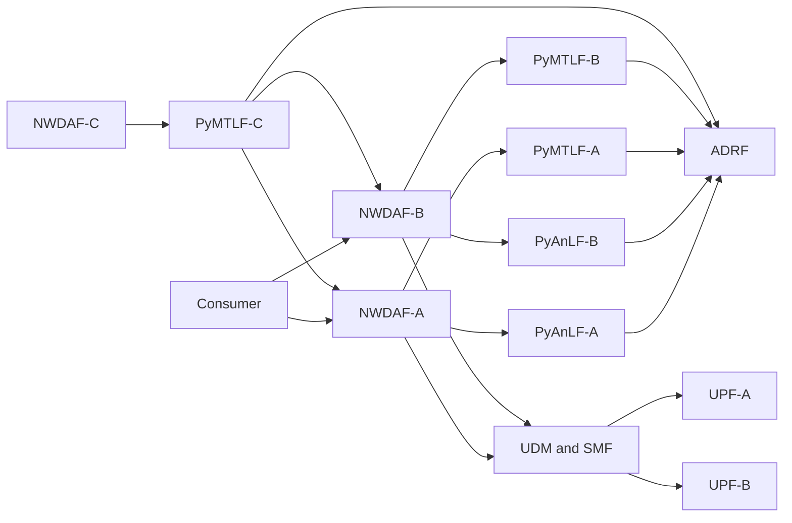
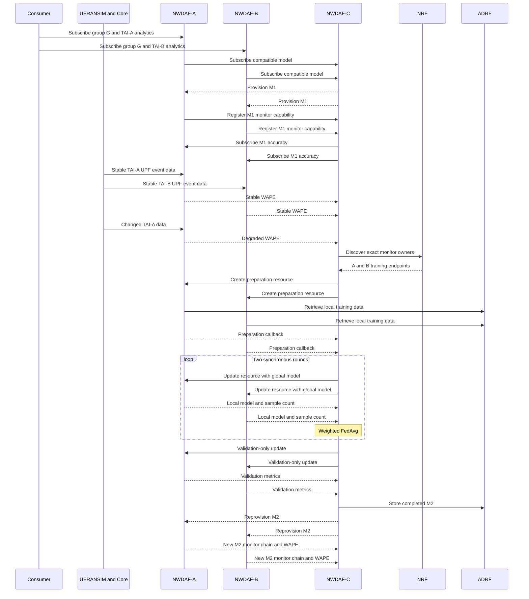

# Phase 7 Full-Core Federated Learning Business E2E Detailed Plan

日期：2026-08-04

狀態：Verified

上層計畫：

- [Distributed NWDAF Federated Learning Implementation Plan](Distributed%20NWDAF%20Federated%20Learning%20Implementation%20Plan.md)

前置計畫與設計：

- [Phase 6 Standard Collection And Full-Core Data-Flow Detailed Plan](Phase%206%20Standard%20Collection%20Prerequisites%20Detailed%20Plan.md)
- [Phase 3 And 4 Federated Training Execution Detailed Plan](Phase%203%20And%204%20Federated%20Training%20Execution%20Detailed%20Plan.md)
- [Phase 5 Final Validation ADRF Publication And Reprovision Detailed Plan](Phase%205%20Final%20Validation%20ADRF%20Publication%20And%20Reprovision%20Detailed%20Plan.md)
- [Distributed NWDAF Model Monitoring And Federated Retraining Architecture](../../design/Distributed%20NWDAF%20Model%20Monitoring%20And%20Federated%20Retraining%20Architecture.md)
- [NWDAF Federated Learning Release 18 規格解讀](../../specification-guides/NWDAF%20Federated%20Learning%20Release%2018%20規格解讀.md)
- [NWDAF Development Policy](../../development_policy.md)

後續修正記錄：

- [PyAnLF Collection Runtime Revision Race Remediation Plan](code-reviews/Phase%207%20PyAnLF%20Collection%20Runtime%20Revision%20Race%20Remediation%20Plan.md)

---

## 1. 目的與可宣稱的結果

Phase 0–5 已用 portable cross-process runner 驗證 Model Provision、Model
Monitor、兩個 FL Clients、兩輪同步 FedAvg、final validation、ADRF model
publication、reprovision 與 monitor cutover。Phase 6 已用完整核心網 profile
驗證：

```text
UERANSIM registration and PDU Session
  -> UDM and UDR group / serving-SMF data
  -> exact serving SMF
  -> AoI-aware Nsmf Event Exposure
  -> matching UPF
  -> PyAnLF inference and ADRF storage
  -> retained descriptors
  -> PyMTLF ADRF retrieval
```

目前缺口是兩套驗證尚未接成同一個業務流程：portable runner 的 FL 完整，但
資料以 fake SMF 與直接 observation injection 產生；full-core runner 的資料流
完整，但在 preparation 時改由 runner 直接扮演 FL Server，沒有讓 NWDAF-C
自行從 accuracy degradation 啟動完整訓練。

本 Phase 將兩者接成同一個 full-core business E2E。完成後可以精確宣稱：

> 在兩個固定 TAI、兩個 UPF 與六個 UERANSIM UE 的實驗拓撲中，A／B
> NWDAF 以真實 5GC registration、PDU Session、UDM／UDR resolution、SMF
> AoI gate 與 Nupf Event Exposure 路徑取得受控 UPF replay data；其中一個
> analytics scope 的實際 WAPE degradation 使 C NWDAF 自動協調兩個
> monitored FL Clients 完成兩輪 FedAvg、final validation、ADRF model
> publication、A／B model reprovision 與 monitor generation cutover。

這個 claim 不等於「UERANSIM application traffic 已經實際穿過 GTP-U data
plane」。UE registration、PDU Session、UPF selection 與 Event Exposure
subscription 是真實流程；流量數值則由 go-upf 內建 PseudoDriver 依 committed
dataset profile 產生，以提供可重複的 stable-to-degraded stimulus。

## 2. 實作基線

計畫撰寫時的已驗證 revisions：

| Repository | Branch | Baseline revision |
| --- | --- | --- |
| `NWDAF/` | `feat/r18-federated-learning` | `ea43cce` |
| `PyAnLF/` | `feat/r18-federated-learning` | `a35f689` |
| `PyMTLF/` | `feat/r18-federated-learning` | `38a64d2` |
| `nwdaf-resources/` | `feat/r18-federated-learning` | `1468899` |
| `nrf/` | `feat/r18-nwdaf-discovery` | `0dd4024` |
| `adrf/` | `feat/r18-federated-learning` | `905f059` |
| `udr/` | `feat/r18-federated-learning` | `bf44774` |
| `udm/` | `feat/r18-federated-learning` | `b8db49e` |
| `smf-nwdaf-ext/` | `feat/r18-federated-learning` | `e8707b9` |
| `go-upf/` | local `dev/federated-learning` | `c69051b` |
| `resources/UERANSIM/` | read-only `master` | `2a3ef81` |

所有 runtime evidence 必須在 summary 中記錄實際使用的 revision、dirty flag
與 binary hash；上表是計畫基線，不可用來掩蓋執行時使用了過期 binary。

## 3. 已確認的設計決策

1. NWDAF-C 是 seed／latest model owner、Model Provision provider、Model
   Monitor coordinator 與 FL Server；不在本情境提供 analytics 或充當
   analytics aggregator。
2. NWDAF-A／B 分別是 analytics provider、model consumer、accuracy provider
   與 FL Client。
3. Consumer 對 A／B 建立相同 Internal Group ID、不同 AoI／TAI 的兩條
   `UE_COMMUNICATION` subscriptions。
4. A／B 從 C 取得同一個 M1，並各自建立獨立 Model Monitor registration；C
   依 registration 的 `consumerId` 鎖定 A／B 的 NF instance。
5. FL participants 是本次被 C 監控的 A／B owners，不是單純從 NRF 結果中
   任選兩個相容 clients；同 TAI decoy 必須被排除。
6. 任一 scope degradation 觸發 retraining 後，A、B 都以各自所有 eligible
   retained data 參與，不只使用 degraded scope 的資料，也不把一方只當
   validation client。
7. ADRF 在本 profile 永遠存在。A／B 的 PyAnLF 經 containing Go 使用標準
   Data Management request 寫 ADRF，不同時寫 MongoDB；PyMTLF-A／B 各自
   根據 retained descriptor 與 fetch instruction 從 ADRF 取回本地資料。
8. 第一版使用固定兩個 participants、同步 rounds、固定兩輪與 exact
   sample-count-weighted FedAvg。
9. round local／global artifacts 經暫存 URL 交換，不存 ADRF；只有 completed
   final model 由 C 保存至 ADRF。
10. final validation 仍必須執行並留下 per-scope evidence，但實驗預設
    `enforce_performance_gate: false`，所以流程驗收不要求新模型優於舊模型。
11. C 只維護線性 completed revisions 與單一 latest model；本 Phase 不加入
    model tree、per-TAI assignment 或 ranking。
12. final model 經 ADRF publication 成功後才 promotion；A／B 採
    new-before-old monitor cutover。
13. main acceptance 不得呼叫 PyAnLF private observation endpoint，也不得直接
    POST fabricated degradation 到 PyMTLF-C 的 monitor callback。
14. fixed-location profile 是本 Phase 完成條件；TAI mobility 與 AMF Event
    Exposure assisted tracking 延後。
15. 不重新設計現有 acc policy、WAPE、training、FedAvg、generation、artifact
    或 cutover 業務邏輯。若 E2E 暴露現有實作缺陷，只做可由失敗證據支持的
    最小修正，並保留原有演算法語意。
16. Go 與 Python 間維持普通 HTTP；TLS、OAuth delegation 與 Python 對外 SBI
    trust 不在本 Phase。
17. PyMTLF 的 `validation_ratio` 預設為 `0.10`。此比例套用在已建立的
    chronological sliding-window samples，而不是先切分原始 observations；較早
    的 retained samples 用於 reference validation，較新的 retained samples
    用於 fitting，兩者之間保留足以避免 observation overlap 的 boundary purge。

## 4. 標準證據與 project profile 分界

### 4.1 Analytics 與資料蒐集

- [3GPP TS 29.520 V18.13.0 Nnwdaf Events Subscription OpenAPI](../../../specs/openapi/TS29520_Nnwdaf_EventsSubscription.yaml)
  定義 analytics subscription 的標準 resource、callback 與
  `UE_COMMUNICATION` payload shape。
- [3GPP TS 23.502 V18.14.0 §4.15.4.5](../../../specs/TS%2023.502/4%20System%20procedures/4.15%20Network%20Exposure/4.15.4%20Core%20Network%20Internal%20Event%20Exposure/4.15.4.5%20Exposure%20of%20Events%20from%20UPF%20for%20UPF%20Data%20Collection.md)
  說明 NWDAF 經 SMF 訂閱 UPF event、使用 AoI，以及 UE 進出 AoI 時的
  downstream subscription 語意。
- [3GPP TS 29.508 V18.9.0 Nsmf Event Exposure OpenAPI](../../../specs/openapi/TS29508_Nsmf_EventExposure.yaml)
  規定 create 使用 `POST /subscriptions`，成功為 `201 Created` 並回
  `Location`；delete 成功為 `204 No Content`，`networkArea` 位於
  `eventSubs[]`。
- [3GPP TS 29.575 V18.11.0 Nadrf Data Management OpenAPI](../../../specs/openapi/TS29575_Nadrf_DataManagement.yaml)
  定義 data-store record、retrieval subscription、fetch instruction 與相關
  status。Phase 7 不發明第二套 raw-data query schema。

Phase 7 的受控 Parquet stimulus、TAI-A／B 固定資料分布與 stable／degraded
數值是 project test profile，不是 3GPP 欄位或規定。

### 4.2 Model Provision 與 Model Monitor

- [3GPP TS 23.288 V18.13.0 §6.2A](../../../specs/TS%2023.288/6%20Procedures%20to%20Support%20Network%20Data%20Analytics/6.2A%20Procedure%20for%20ML%20Model%20Provisioning.md)
  定義 MTLF 向 AnLF 提供模型的程序語意。
- [3GPP TS 29.520 V18.13.0 Nnwdaf ML Model Provision OpenAPI](../../../specs/openapi/TS29520_Nnwdaf_MLModelProvision.yaml)
  定義 subscription create／replace／delete 與 notification；create 成功為
  `201 Created` 並含 `Location`，callback 成功接受為 `204 No Content`。
- [3GPP TS 23.288 V18.13.0 §6.2E](../../../specs/TS%2023.288/6%20Procedures%20to%20Support%20Network%20Data%20Analytics/6.2E%20MTLF-based%20ML%20Model%20Accuracy%20Monitoring.md)
  與 [3GPP TS 29.520 V18.13.0 Nnwdaf ML Model Monitor OpenAPI](../../../specs/openapi/TS29520_Nnwdaf_MLModelMonitor.yaml)
  定義 monitor registration、subscription、notification 與 model accuracy
  information。`consumerId` 用 NF instance identity 關聯 consumer；本 profile
  使用 `deviation` 傳遞 WAPE。

WAPE 計算方式、reference buffer、degradation threshold、decision window 與
「只讓 A degradation」都是 project policy。Main E2E 必須透過 production
inference／ground-truth matching 產生 WAPE，不能因為 WAPE 是 private policy
就略過標準 Monitor transport。

### 4.3 ML Model Training

- [3GPP TS 23.288 V18.13.0 §6.2C](../../../specs/TS%2023.288/6%20Procedures%20to%20Support%20Network%20Data%20Analytics/6.2C%20Federated%20Learning%20among%20Multiple%20NWDAFs.md)
  描述 multiple NWDAFs 的 FL 角色與程序。
- [3GPP TS 23.288 V18.13.0 §6.2F](../../../specs/TS%2023.288/6%20Procedures%20to%20Support%20Network%20Data%20Analytics/6.2F%20Procedure%20for%20ML%20Model%20Training.md)
  定義 preparation、training、accuracy check、delay 與 termination 的 stage-2
  行為。
- [3GPP TS 29.520 V18.14.0 Nnwdaf ML Model Training OpenAPI](../../../specs/openapi/TS29520_Nnwdaf_MLModelTraining.yaml)
  定義 subscription `POST`、individual resource 的 `PUT`／`PATCH`／`DELETE`、
  callback 以及 `mLPreFlag`、`mLAccChkFlg`、`skipFlInd`、`roundInd`、
  `maxResTime` 等欄位。Create 成功為 `201 Created` 並含 `Location`；callback
  接受成功為 `204 No Content`。

規格沒有定義 FedAvg 演算法、exact sample count、tensor bundle format、固定
round 數或 promotion threshold。本 profile 以 private bundle manifest 保存
exact sample count，`samplRatio` 只保留其標準「採樣比例」語意。

### 4.4 ADRF final model publication

[3GPP TS 29.575 V18.7.0 Nadrf ML Model Management OpenAPI](../../../specs/openapi/TS29575_Nadrf_MLModelManagement.yaml)
定義 `POST /mlmodel-store-records`、`MLModelInfo`、`modelUniqueId`、
`storeTransId` 與 retrieval。C 在 final candidate 完成後配置正式
`modelUniqueId`；round artifacts 不因 Training schema 重用 `MLEventNotif`
而被誤當 completed models。

## 5. 現況差距

| 能力 | Portable `run.py` | Full-core collection runner | Phase 7 目標 |
| --- | --- | --- | --- |
| 真實 UERANSIM registration／PDU Session | 無 | 有 | 有 |
| UDM／UDR group 與 serving-SMF resolution | 無 | 有 | 有 |
| 兩個 UPF 與 AoI gate | fake SMF | 有 | 有 |
| PyAnLF production inference／WAPE | 有 | 有，但未作 FL trigger 驗收 | 有 |
| degradation stimulus | 直接 POST private monitor callback | 無 | 只由 UPF profile 使 A WAPE degradation |
| Participant selection | C 自動選 A／B 並排除 decoy | runner 直接選 A／B | C 自動選 monitor owners 並排除 decoy |
| Training preparation | C 自動建立 | runner 直接對 A／B POST | C 自動建立並等待 callbacks |
| 兩輪 FedAvg | 有 | 無 | 有 |
| Final validation | 有 | 無 | 有 |
| ADRF final model | 有 | 無 | 有 |
| Reprovision／cutover | 有 | 無 | 有 |

因此本 Phase 的首要工作不是再建一套 FL coordinator，而是讓 full-core runner
走 production trigger，並重用 Phase 3–5 已完成的 coordinator。

## 6. Target topology

```text
Consumer
  +-- group-G + TAI-A --> NWDAF-A --> PyAnLF-A / PyMTLF-A
  +-- group-G + TAI-B --> NWDAF-B --> PyAnLF-B / PyMTLF-B

NWDAF-C --> PyMTLF-C
  +-- owns M1 and completed M2
  +-- provisions A and B
  +-- subscribes to A and B model accuracy
  +-- coordinates A and B as FL clients

NRF
  +-- UDM, SMF, ADRF and NWDAF discovery

UDR <-- UDM <-- NWDAF-A/B
                  |
                  +-- SMF -- UPF-A -- controlled TAI-A replay
                         +-- UPF-B -- controlled TAI-B replay

ADRF
  +-- A/B training data
  +-- completed final model from C
```



## 7. Full business E2E



### 7.1 Stage 0：preflight、build 與 isolated state

Runner 必須在建立任何 process 前：

1. 執行既有 full-core preflight，確認 MongoDB、kernel module、IP forwarding、
   required interfaces、ports、UERANSIM binaries、UPF binary 與 Python virtual
   environments。
2. 從目前 editable repositories 建置本次會直接驗收的 Go binaries：NRF、UDR、
   UDM、team SMF、NWDAF 與 ADRF。Pinned AMF／AUSF／NSSF／PCF 及 go-upf
   可使用明確指定 binary，但 summary 必須記錄 source revision 與 SHA-256。
3. 不 checkout、不切 branch、不改 sibling repository。
4. 清除本 scenario 專用 ADRF database、PyMTLF durable state、temporary
   artifacts，以及六個 fixture SUPI 的 serving-SMF registrations；不得 drop
   使用者其他 database 或修改非 fixture subscriber。
5. apply 六個 UE subscriber fixtures 與一個 group membership。

若 binary 無法證明對應本次 source，runner 必須 fail fast，不能用 stale binary
通過驗收。

### 7.2 Stage 1：核心網與 NWDAF roles ready

依 dependency 順序啟動：

```text
MongoDB
  -> NRF
  -> NSSF / UDR / UDM / AUSF / PCF / AMF
  -> UPF-A / UPF-B / team SMF
  -> two gNBs / six UEs
  -> ADRF
  -> PyMTLF-A/B/C and PyAnLF-A/B
  -> NWDAF-A/B/C
```

Readiness 不只看 port：

- core NF、ADRF、A／B／C 已出現在 NRF；
- C 宣告 Model Provision、Model Monitor coordinator 與 FL Server 能力；
- A／B 宣告 analytics、Model Monitor provider 與 FL Client 能力；
- six UEs 有正常 serving-SMF registrations；
- TAI-A UE 使用 UPF-A 的 `10.60.*` pool，TAI-B UE 使用 UPF-B 的
  `10.61.*` pool。

### 7.3 Stage 2：analytics、M1 provision 與 monitor establishment

Consumer 分別建立：

```http
POST http://nwdaf-a/nnwdaf-eventssubscription/v1/subscriptions
UE_COMMUNICATION + group-G + TAI-A

POST http://nwdaf-b/nnwdaf-eventssubscription/v1/subscriptions
UE_COMMUNICATION + group-G + TAI-B
```

A／B 可先接受 analytics subscription；model demand 與 collection
reconciliation 在 background 並行。Runner 等待以下 production state：

1. A／B 都從 C 取得並啟用 M1；
2. A／B 各自建立一筆 Model Monitor registration；
3. C 依兩筆 registration 建立兩筆 Model Monitor subscriptions；
4. C 保留兩個不同 `consumerId`、registration ID、monitor resource ID 與
   correlation ID；
5. 每個 SUPI 只有對應其 serving SMF／PDU Session／TAI 的 collection
   resource，不出現 Cartesian product。

### 7.4 Stage 3：stable evidence

UPF-A／B 先送出足夠的 stable history 與 live stable windows。Runner 必須等到：

- A、B 都已送出至少一筆由 prediction 與後續 ground truth 實際匹配而成的
  finite WAPE；
- C 已對兩個 scope 建立 reference／正常狀態；
- A／B 皆已有 ADRF data records 與 retained descriptors；
- C 尚未建立 federated process。

不允許用「WAPE notification 數量為零」當作 stable，也不允許以 fabricated
accuracy payload 取代這個 gate。

### 7.5 Stage 4：single-scope degradation 與 automatic trigger

只有 UPF-A profile 在 live windows 切換到 degraded distribution；UPF-B 在相同
時間軸繼續 control distribution。Runner 等待：

- A 產生實際高於其 policy boundary 的 WAPE；
- B 仍產生 finite WAPE，且沒有被 profile 人為切到 degraded distribution；
- C 經 production accuracy policy 對 A 做出 degradation decision；
- C 只建立一個 active federated process。

「B 沒有 trigger」的證據必須來自 B 仍持續回報，而不是停止 B data flow。

### 7.6 Stage 5：participant discovery 與 preparation

C 以兩筆 Model Monitor registrations 的 `consumerId` 作 participant owner
identity，經 NRF 做 exact target discovery，取得 A／B ML Model Training
endpoints。即使 NRF 另有同 Analytics ID、同 TAI 或相容 vendor 的 decoy，C
也不能把它加入 process。

C 對 A／B 建立 `mLPreFlag=true` 的 training resources：

- A／B 先回 `201 Created + Location`，表示 resource 已接受；
- dataset retrieval 在 client background 執行；
- A／B 的 PyMTLF 依 retained descriptors，先經 containing Go 發出標準形狀的
  ADRF retrieval request；取得 fetch instructions 後，由 PyMTLF 直接向指定
  fetch URI 取回本地資料；
- preparation 對 descriptor inventory、time window、downloaded records 與
  train／validation split 建立 process snapshot；client 必須先從完整時間序列
  建立 chronological sliding-window samples，再於 sample boundary 切分，不能
  先取 10% raw observations 後才嘗試建立 30-step sequence；之後新寫入 ADRF
  的 records 不加入正在執行的 process；
- 切分時先保留一段不配置給任何 subset 的 boundary purge，使最後一個
  validation window 與第一個 training window 不共用 observation；purge 後的
  retained samples 以較早 10% 作 validation、較新 90% 作 training，兩側都
  至少保留一個 sample；此條件是 triggering scope 的 preparation admission
  requirement。非 triggering scope 沿用既有語意：若只有 training samples，
  仍可參與 fitting，但不列入 evaluation scopes，並留下 structured warning；
- 完成後 callback C；若預期超過 `maxResTime`，先送 delay notification，C
  依現有 policy PATCH 同一 resource；
- 兩個 clients 都進入 `PREPARED` 後才固定 participant set 並開始 round 0。

Main E2E 不直接由 runner 對 A／B 建立 preparation resource。

### 7.7 Stage 6：two-round synchronous FedAvg

固定流程：

```text
M1
  -> A local round 0 + B local round 0
  -> sample-count-weighted global round 0
  -> A local round 1 + B local round 1
  -> sample-count-weighted global round 1
  -> final candidate
```

每個 client round result 必須：

- 透過 Training callback 回 C；
- 使用 immutable artifact URL；
- manifest 含 exact local training sample count；
- 保留相同 process、participant 與 round correlation；
- 不配置 completed-model identity，不存 ADRF。

C 必須驗證兩個 local results 都屬於本輪、兩個 sample counts 都為正數，並在
global manifest 記錄 input counts 與總 sample count。任一 selected client
timeout 或失敗時，沿既有 strict synchronous policy 終止 process，不降級成
單 client aggregation。

### 7.8 Stage 7：final validation-only operation

C 以同一 client training resource 發出：

```json
{
  "mLPreFlag": false,
  "mLAccChkFlg": true,
  "skipFlInd": true
}
```

A／B 不再更新 weights，只用各自 frozen validation subset 評估 candidate，並在
callback bundle 回傳 metrics。C 必須保存兩個 scope 的 finite validation
evidence。

本 profile `enforce_performance_gate: false`，所以 candidate 即使不優於舊模型
仍可進 publication；log、manifest 與 summary 仍必須清楚記錄比較結果及
「gate disabled」決策，不能假裝模型改善。

### 7.9 Stage 8：ADRF publication 與 completed revision

C 先建立正式 final bundle，再配置下一個 numeric `modelUniqueId`，接著經 Go
NWDAF 使用 Nadrf ML Model Management 保存。只有 ADRF 回覆成功且 C 可確認
record 後：

- process journal 進入 `COMPLETE`；
- completed revisions 加入 M2；
- `latestModelId` 從 M1 切到 M2；
- 保存 `storeTransId` 與 ADRF reference。

若 ADRF publication 失敗，candidate 不得成為 latest；已配置的 ID 保持
consumed，不得重用。

### 7.10 Stage 9：reprovision 與 new-before-old cutover

C 沿 A／B 既有 Model Provision subscriptions 通知同一個 M2 ADRF reference。
A／B 下載、驗證並啟用 M2 後：

1. A／B 以 M2 identity 建立新 Model Monitor registration；
2. C 建立對應的新 monitor subscriptions；
3. 新 routes usable 後才刪除 M1 monitor resources；
4. A／B analytics subscription 與 collection resources 不重建；
5. 後續 prediction 使用 M2 generation。

`204 No Content` 只證明單次 notification 被接收，不能單獨代表整個 cutover
成功。Primary evidence 是 A／B model activation state、新 monitor resource
成功建立、舊 resource 被刪除，以及 M2 generation 產生新的 WAPE。

### 7.11 Stage 10：post-cutover evidence 與 teardown

Runner 繼續讓 UPF data flow 運作，直到 A、B 各至少出現一筆 M2 generation 的
finite WAPE。因 performance gate 預設關閉，本 baseline 不要求 M2 WAPE 必須
低於 M1 或 degradation threshold。

接著刪除兩條 analytics subscriptions，驗證相關 SMF／UPF collection resources
被回收，再執行 scoped teardown 與 deregistration。ADRF experiment database
與 PyMTLF durable state 必須一起清除，避免下一次 run 把 M2 當作初始 latest。

## 8. Deterministic stimulus design

### 8.1 不使用 private trigger

現有 portable runner 的 `trigger_degradation()` 是快速 regression 所需的 test
shortcut；Phase 7 main runner 不 import、不呼叫它。現有 `post_observation()`
也不得用於 main acceptance。

### 8.2 PseudoDriver 時間軸

go-upf PseudoDriver 依 `file.json` 的 breaking time 將資料分成：

- breaking time 以前：Phase 1 historical burst，近乎立即送入；
- breaking time 以後：Phase 2，以 UPF Event Exposure report period 實時間隔
  pacing。

Traffic dataset 內部的 stable-to-degraded boundary 則由
`stableWindows * windowSeconds` 決定。兩個 boundary 必須刻意分開：

```text
0 ---------------- breaking time ---------------- stable boundary -------->
| historical stable burst | live stable lead-in | live changed data |
```

Phase 7 profile 應保留足以填滿 M1 input window 的 historical stable records，
並在 live phase 留至少兩個完整 report periods，讓 A／B 都先形成可驗證的
stable WAPE，之後才讓 A 的資料改變。不可把 breaking time 與 stable boundary
設成同一時間，否則 monitor readiness 與 degradation 會形成 race。

Profile validator 至少檢查：

```text
floor(breakingTimeSeconds / reportPeriodSeconds) >= minimumPreparationObservations
(stableBoundarySeconds - breakingTimeSeconds) / reportPeriodSeconds >= 2
datasetEndSeconds > stableBoundarySeconds
```

目前 full-core report period 為 30 秒、M1 input window 為 30 steps，output
window 為 1 step。只滿足一個 input window 仍不足以完成 preparation；client
必須先建立所有 chronological candidate windows，再在 sample boundary 保留
`input_window + output_window - 1` 個 window positions 作 purge。剩餘 samples
至少要能分成一個 validation sample 與一個 training sample，validation 預設占
retained samples 的 10%，其餘給較新的 training samples。

以目前 30-step input 與 one-step output 計算：raw observations 先形成
`N - 30` 個 candidate windows，boundary purge 需要 30 個 positions，因此至少
需要 `N - 30 - 30 >= 2`，也就是 62 個 aggregated observations。這個數字不是
硬編碼門檻；runner 必須依 bundle 的 input／output window、purge policy 與
validation ratio 動態計算，並同時驗證兩側 sample count 都為正數。

實作使用下列 deterministic allocation；`R` 是 purge 後可配置的 sample 數：

```text
C = N - inputWindow - outputWindow + 1
P = inputWindow + outputWindow - 1
R = C - P
V = max(1, floor(R * validationRatio))
T = R - V

validation = earliest V candidate windows
purge      = following P candidate windows
training   = remaining T candidate windows
```

`R` 必須至少為 2，且 `V`、`T` 都必須為正數。因預設 1800 秒在 30 秒 report
period 下最多只有約 60 筆，仍低於新的 62 筆理論下限，follow-up 同時把
`preparation_data_window_seconds` 預設調為 3600 秒；實際 request window 仍可由
部署 profile 覆寫。

初始可採用以下可讀 profile，再由實作時的 deterministic calibration test 確認
最小時間；調整時必須保持同一語意，而非只延長任意 sleep：

| Setting | A | B |
| --- | --- | --- |
| `windowSeconds` | `1` | `1` |
| `breakingTimeSeconds` | `3000` | `3000` |
| `stableWindows` | `3090` | `3090` |
| live stable lead-in | `90s` | `90s` |
| `postBoundaryMode` | `degraded` | `stable` |
| post-boundary values | low-volume changed distribution | same control distribution |

Dataset generator 新增可選的 `postBoundaryMode`，合法值只有 `degraded` 與
`stable`；未填時維持目前的 `degraded` 行為，避免改壞 portable fixtures。
`stable` 模式在 boundary 後繼續使用相同 control pattern，而不是只把 base
bytes 設成相同值，因現有 degraded pattern 的 modulo amplitude 也不同。A／B
都要有足夠長的 Phase 2 尾段，覆蓋 degradation detection、training、
publication 與 post-cutover WAPE。

A profile 另以可選 `degradedJitterScale` 控制 post-boundary modulo amplitude；
未提供時維持既有值 `100`。實測曾以高流量值作為「degraded」資料，但 M1 WAPE
反而由約 `2.43` 降至約 `0.8`，因此沒有觸發 retrain。最終 profile 使用低流量
changed distribution，使 A WAPE 上升至約 `25.27`；B 維持約 `2.20`。這是以
production inference 結果校準 stimulus，而不是繞過 policy 注入 degradation。

### 8.3 不以 wall-clock sleep 判定狀態

Runner 只允許短暫 pacing／stabilization sleep；業務轉換必須使用 bounded
condition wait，例如：

- M1 activation + monitor resources ready；
- A／B stable WAPE 已被 C 評估；
- A degradation decision 出現；
- process state／round artifact／callback count；
- ADRF model record；
- M2 activation 與 new monitor routes。

每個 wait 都要有階段名稱、timeout、相關 process logs 與 failure evidence。

## 9. Identity、correlation 與 evidence

### 9.1 必須保存的 identity chain

```text
analytics subscription A/B
  -> model provision subscription A/B
  -> M1 model identity and generation
  -> monitor registration A/B consumerId
  -> monitor subscription A/B correlation
  -> federated process ID
  -> client training resource A/B
  -> round index and artifact key
  -> final validation result A/B
  -> M2 modelUniqueId and storeTransId
  -> M2 generation and new monitor resources
```

同一個字串不應同時扮演多種 identity；summary 以明確欄位記錄 mapping。

### 9.2 Primary evidence

優先使用：

- SBI response status、`Location` 與 callback payload；
- NRF profile／discovery response；
- UDM／UDR／ADRF scoped records；
- PyMTLF durable process journal、completed revision 與 latest pointer；
- bundle manifest、sample counts、round inputs 與 hashes；
- Go process route／resource snapshots；
- per-generation model activation 與 monitor identity。

若現有介面沒有安全的 read API，runner 可用精確、結構化 log marker 做次要
assertion；本 Phase 不為測試方便新增 private introspection API。禁止只用模糊
substring 或「process 沒掛」宣稱業務成功。

### 9.3 Run summary

成功與失敗都要輸出 machine-readable `summary.json`，至少包含：

- scenario ID、開始／結束時間、elapsed time；
- repository revisions、dirty flags、binary hashes；
- six SUPIs、TAI、UE IP、serving SMF 與 selected UPF mapping；
- A／B analytics、provision、monitor registrations／subscriptions；
- M1 stable WAPE evidence；
- degraded scope、trigger time 與 C decision；
- participant NF instance IDs 與 excluded decoy；
- preparation results、two round results、exact sample counts；
- final validation metrics 與 gate policy／decision；
- M2 `modelUniqueId`、`storeTransId`、ADRF record；
- A／B M2 activation、新舊 monitor route mapping；
- M2 post-cutover WAPE evidence；
- cleanup result 與保留的 runtime path。

## 10. Harness structure

### 10.1 Repository ownership

預期必要修改只有：

| Repository | Planned changes |
| --- | --- |
| `nwdaf-resources/` | shared full-core support、new full FL runner、traffic profiles、preflight、README、runner tests |
| `nwdaf-docs/` | 本計畫、主計畫進度與最終 verified result |
| `PyMTLF/` | configurable preparation data window、window-first validation split、預設 `validation_ratio=0.10` 與 focused tests |

以下 repositories 是 runtime dependencies，正常情況不修改：NRF、UDR、UDM、
team SMF、NWDAF、PyAnLF 與 ADRF。若 full-core E2E 證明其中有本
Phase 必須修正的 defect，先把 failure、root cause、affected contract 與最小
方案記回本文件，再依 repository boundary 修改及驗證。

本次 E2E 先暴露一個 PyMTLF defect：FL Server 固定只在 preparation request
中要求最近 30 分鐘資料，與當時 raw-observation-first split 所算出的 94 筆下限
不相容；Client 因而以 `NOT_AVAILABLE_ML_TRAIN` 終止。第一個修正把標準
`dataAvReq.timeWindows` 的歷史長度改為 server config
`preparation_data_window_seconds`；基線實作預設為 1800 秒，Phase 7 profile
明確設為 3600 秒。Slice 7F 會把 PyMTLF 預設一併調為 3600 秒，使預設值與新的
minimum preparation observations 自洽。

驗證後檢討進一步確認 `validation_ratio=0.65` 只是為了讓舊切分方式在有限資料
中成立，會不合理地把大部分資料留給 validation。Follow-up 必須把 dataset
builder 改成 window-first split，預設 ratio 改為 `0.10`，並同步更新動態資料
下限、tests 與 E2E evidence；FedAvg、callback 與 accuracy policy 語意不變。

`go-upf/` 只作 runtime dependency；沒有使用者明確授權時，不修改、不 commit、
不 push。`resources/` 維持 read-only。

### 10.2 File shape

預計修改的 `nwdaf-resources` support-tooling shape：

```text
deployments/
  distributed_fl/
    scripts/
      full_core_support.py
      run_full_core_collection.py
      run_full_core_fl.py
    configs/core/
      core-profile.json
      upf-a-traffic.json
      upf-b-traffic.json
    checks/
      full_core_preflight.py
    README.md
  portable_event_exposure/
    datasets/
      generate.go
```

`full_core_support.py` 只抽出兩個 full-core scenarios 都需要的 runtime build、
config、launch、provision、wait、cleanup 與 evidence helpers；不建立泛用測試
框架，也不搬入 FL business assertions。

- `run_full_core_collection.py` 保留 Phase 6 regression，仍止於 collection +
  ADRF retrieval。
- `run_full_core_fl.py` 負責 Phase 7 business flow。
- portable `run.py` 保留快速 regression，不改寫成 full-core runner。

預期執行入口：

```bash
PyMTLF/.venv/bin/python \
  nwdaf-resources/deployments/distributed_fl/scripts/run_full_core_fl.py
```

需要保留成功 runtime evidence 時加上 `--keep-runtime`。Host privilege 與 binary
前置條件沿用 `configs/core/README.md`，runner 不自行安裝 system packages。

### 10.3 Stale binary protection

Phase 6 runner 允許使用預先準備的 `--binary-dir`。Phase 7 需要避免 source 已
更新但 runner 仍使用舊 binary：

1. Editable repositories 預設在 run 開始時 build 到 scenario runtime；
2. pinned／external binaries 以 explicit CLI path 提供；
3. manifest 記錄 binary path、SHA-256、source revision 與 build command；
4. 使用者明確要求 `--no-build` 時，仍必須提供可驗證 manifest，不可靜默
   使用未知 binary。

### 10.4 Portability

README 不假設 repository 位於名為 `resources/` 的目錄。所有 external path
由 CLI argument、可解出的 workspace-relative default 或 preflight 訊息提供；
錯誤訊息必須說明缺少哪個 binary／config，而不是要求使用者重建特定私人
directory layout。

## 11. Failure、restart 與 cleanup policy

### 11.1 Failure policy

- core registration／PDU／serving-SMF resolution 失敗：scenario fail；
- A／B 任一路 collection、ADRF write 或 stable WAPE 缺失：不得進 trigger；
- C 選到非 monitor owner：scenario fail；
- preparation timeout、任一 selected client termination、round callback 缺失或
  artifact hash 不符：該 process fail，不做 partial FedAvg；
- ADRF model store 失敗：candidate 不 promotion、不 reprovision；
- 任一 A／B M2 activation 或 new monitor route 失敗：cutover fail，舊 route
  不應先被刪除。

### 11.2 Restart scope

Phase 2–5 已有 backend restart／sync regression。為控制 full-core runtime，
Phase 7 main happy path 不額外強制在每個階段 restart；但 shared harness refactor
不能破壞 portable runner 既有的 PyMTLF-C 與 PyAnLF-A restart coverage。

若時間允許，可增加一個獨立 failure profile，在 preparation 前 restart
PyMTLF-C，確認 Go snapshot 恢復 monitor relationships 後仍只啟動一個 process。
它不是第一版 completion blocker。

### 11.3 Cleanup

Cleanup 順序：

1. delete analytics／training／monitor／provision resources；
2. stop UE、gNB、backends、NWDAFs、core NFs；
3. clear fixture serving-SMF registrations、group／subscriber fixtures；
4. clear scenario ADRF database、PyMTLF state、artifacts、runtime network state；
5. 保留失敗 run 的 logs、configs、summary 與 manifests。

Cleanup failure 必須記錄，但不能遮蔽原始 exception。成功時預設刪除 temporary
runtime；`--keep-runtime` 可保留完整 evidence。

## 12. Implementation slices

### Slice 7A：shared full-core harness foundation

1. 從現有 collection runner 抽出真正共用的 build／launch／provision／cleanup
   helpers。
2. 保留 Phase 6 runner 行為與 summary，避免 refactor 讓既有 regression 失效。
3. 加入 source revision、dirty flag 與 binary hash manifest。
4. 補 runner-level tests，涵蓋 CLI、path resolution、scoped cleanup 與 stale
   binary rejection。

完成條件：Phase 6 full-core collection runner 使用新 shared support 後仍通過，
且沒有修改任何 NF 的 production behavior。

### Slice 7B：deterministic stable-to-degraded profiles

1. 調整 A／B traffic profiles，使兩者都有足夠 historical stable warm start。
2. 為 dataset generator 加入 backward-compatible `postBoundaryMode`；A 之後
   切換 distribution，B 保持相同 control pattern。
3. 保留 live stable lead-in，並加入 profile validation，證明 breaking time、
   stable boundary、report period
   與 dataset length 的順序正確。
4. summary 記錄實際 transition windows，不依賴人工觀察 log。

完成條件：只啟動 collection／inference 時，A、B 先都有 finite stable WAPE，
之後只有 A 被 production acc policy 判為 degraded。

### Slice 7C：automatic FL orchestration

1. 建立 `run_full_core_fl.py`，啟動完整 core、A／B／C 與 decoy。
2. 建立兩條 analytics subscriptions，等待 M1／monitor／collection readiness。
3. 等待 real WAPE degradation 觸發 C；禁止 private trigger。
4. 驗證 C 依 monitor owners 選 A／B、排除 decoy，自動完成 preparation。
5. 驗證兩輪 synchronous training、exact sample counts 與 weighted FedAvg。

完成條件：runner 沒有扮演 FL Server，C 從 degradation decision 自行走到
final candidate。

### Slice 7D：validation、publication 與 cutover

1. 驗證 A／B validation-only callbacks 與 per-scope metrics。
2. 驗證 disabled performance gate 仍保留完整 evidence。
3. 驗證 C 只將 final model 存 ADRF，promotion 後 latest 變成 M2。
4. 驗證同一 M2 reprovision 給 A／B、new-before-old monitor cutover。
5. 繼續 data flow，驗證 A／B 都用 M2 generation 產生 finite WAPE。

完成條件：ADRF、C durable state、A／B activation 與 monitor routes 對同一個
M2 identity 達成一致。

### Slice 7E：verification、documentation 與 closure

1. 執行 affected repositories 的 unit、lint、contract 與 cross-process tests。
2. 執行 portable FL regression、Phase 6 full-core collection regression、Phase 7
   full FL business E2E。
3. 把實際 revisions、counts、timings、limitations 與 evidence summary 回填本
   文件及主計畫。
4. Review 只聚焦本 Phase diff、contract boundary 與可宣稱結果，不重新審查
   已凍結的 Phase 0–6 全部設計。

完成條件：三個 runner level 都能被正確區分，且 full FL claim 只來自 Phase 7
runner。

### Slice 7F：validation split correction and revalidation

1. PyMTLF 先由完整 chronological observations 建立 candidate sliding windows。
2. 依 model input／output window 保留不共用 observation 的 boundary purge，再將
   retained samples 的較早 10% 配給 validation、較新 90% 配給 training。
3. `validation_ratio` 預設與 committed profiles 改為 `0.10`，
   `preparation_data_window_seconds` 預設改為 3600；validation 必須保證兩側
   至少各有一個 sample。
4. `nwdaf-resources` profile preflight 使用相同公式動態計算 minimum raw
   observations，並將 evidence 欄位命名為 `minimumPreparationObservations`，
   不保留固定 94 筆或只代表 training 的假設。
5. 補 PyMTLF dataset-builder unit tests、config tests 與 runner preflight tests，
   並重跑 portable、Phase 6 regression 及 Phase 7 full business E2E。

完成條件：新的 split 使 validation／training 都非空、沒有跨 boundary 的
observation overlap，Phase 7 仍由 production degradation 自動完成 FL、final
validation、ADRF publication 與 model cutover。

## 13. Verification matrix

### 13.1 `nwdaf-resources`

- traffic profile schema、boundary order、control-path invariants；
- config generator 保留 dual TAI／UPF mapping；
- shared support 的 path、build manifest、process lifecycle、timeout 與 cleanup；
- summary schema 與 required identity mappings；
- Ruff／Python tests；
- Phase 6 collection runner regression；
- portable FL runner regression；
- new Phase 7 full-core FL runner。

### 13.2 Runtime dependencies

若未修改，只執行與 E2E 風險相稱的既有 verification，至少確認 binary 可由
baseline source 建置。若有修改，該 repository 必須各自執行完整相關 tests：

- Go repositories：`go test ./...`，適用時 `golangci-lint run`；
- PyAnLF／PyMTLF：`.venv/bin/pytest -q` 與 `.venv/bin/ruff check`；
- contract 兩端同時驗證 standard-shaped payload 與 status mapping。

### 13.3 Full-core stage assertions

| Stage | Required assertion |
| --- | --- |
| UE/core ready | 6 registrations、2 TAI、2 expected UPF pools |
| Analytics | A／B subscriptions accepted with different AoI |
| M1 | A／B activate same model and establish two monitor chains |
| Collection | each SUPI maps to exact SMF／PDU／UPF and ADRF record |
| Stable | A／B both have finite real WAPE before process start |
| Trigger | only A stimulus changes and C creates one process |
| Selection | participants exactly A／B monitor owners; decoy excluded |
| Preparation | A／B retrieve ADRF data and callback prepared |
| Round 0 | two immutable local artifacts and one weighted global artifact |
| Round 1 | two immutable local artifacts and one weighted global artifact |
| Validation | one validation-only result per client with finite metrics |
| Publication | one formal M2 ADRF record and C latest pointer M2 |
| Cutover | A／B M2 active, new monitor routes usable, M1 routes removed |
| Post-cutover | A／B each produce finite M2-generation WAPE |
| Teardown | scoped resources removed and unrelated data preserved |

## 14. Acceptance criteria

Phase 7 只有在以下條件全部成立時完成：

1. Main runner 未直接 inject PyAnLF observations 或 PyMTLF degradation。
2. 六個 UE 的 registration、PDU Session、serving-SMF registration、TAI、UE IP
   與 UPF mapping 均由本次正常程序建立。
3. Consumer 的兩條 analytics subscriptions 使用相同 group、不同 AoI，且
   A／B 都有 analytics callback。
4. A／B 都從 C 取得 M1，建立兩條獨立 Model Monitor chains，並在 degradation
   前各自產生 finite WAPE。
5. 只有 A traffic distribution 改變；B control path 持續產生資料與 WAPE。
6. C 透過 production acc policy 建立一個 process，participants 正好是
   monitor owners A／B，decoy 未被選中。
7. A／B 各自從 ADRF 取得資料，完成 preparation、兩個 local rounds、兩個
   global rounds 與 final validation。
8. FedAvg 使用 exact positive sample counts；bundle hashes、roles、rounds 與
   correlation 全部一致。
9. C 把一個 formal M2 保存 ADRF；publication 成功後才將其設為 latest。
10. A／B 都啟用同一 M2，new monitor routes 建立後才移除 M1 routes。
11. A／B 各自產生至少一筆 M2-generation finite WAPE；不把「模型一定改善」
    納入 disabled-gate baseline claim。
12. Portable FL、Phase 6 full-core collection 與 Phase 7 full business E2E 的
    assertion levels 沒有互相取代。
13. Failure 會保留完整 runtime evidence，success cleanup 不破壞非本 scenario
    資料。

## 15. 明確不在本 Phase

- 真實 UE application packet throughput 或 Internet forwarding benchmark；
- UE 在 TAI-A／B 間移動與 dynamic downstream subscription maintenance；
- AMF Event Exposure assisted location tracking；
- participant churn、late join、partial aggregation 或 quorum；
- convergence-based early stopping；
- gradients、model delta、optimizer state 或 secure aggregation；
- TLS、OAuth delegation、certificate distribution；
- ADRF unavailable／MongoDB fallback；
- model tree、per-TAI assignment、candidate ranking；
- production-grade performance gate 或保證新模型品質改善；
- 修改／push go-upf；
- 在 NF repository root 新增跨 process `test/` 目錄。

## 16. Commit boundaries

- `nwdaf-resources/` 與 `nwdaf-docs/` 分開 commit。
- 若 E2E 證明必須修正其他 repository，每個 repository 仍獨立 commit、獨立
  verification，不和 harness 混在同一 commit。
- Commit message 使用 `<type>(<scope>): <summary>`，不使用 phase number 作
  summary。
- 依既有決策，先完成整體實作與 review，再依 repository boundary commit；
  不要求每個 Slice 都 commit。

## 17. Verified result（2026-08-05）

本節記錄 Slice 7F 完成 window-first、`validation_ratio=0.10` 後重新執行的
最終證據。先前 `0.65` raw-observation-first run 只保留為問題定位背景，不再作為
目前 sample counts 或 training-data policy 的驗收結果。

### 17.1 實際完成內容

- `nwdaf-resources` 建立 shared full-core support，讓 Phase 6 collection runner
  與 Phase 7 FL runner 共用 source build、runtime manifest、core launch、fixture、
  callback、cleanup 與 evidence helpers。
- 每次 run 直接從 editable NRF、UDR、UDM、SMF、NWDAF、ADRF source 建置
  binary；pinned core binaries 與 UPF 也保存 SHA-256，避免 stale binary 被誤認
  為目前 source。
- A／B profiles 都提供 3000 秒 historical stable data 與 90 秒 live stable
  lead-in；A 在 boundary 後切換 low-volume pattern，B 持續 control pattern。
- Phase 7 runner 只建立 consumer analytics subscriptions 並觀察 production
  state；沒有呼叫 private observation／degradation endpoint，也沒有代替 C 建立
  Model Training subscriptions。
- PyMTLF FL Server 新增 `preparation_data_window_seconds`，並以該值填入標準
  `dataAvReq.timeWindows`；PyMTLF 預設與 Phase 7 profile 都使用 3600 秒。
- PyMTLF 先建立完整 chronological sliding-window samples，再以 30 個 window
  positions 隔離 validation 與 training；purge 後較早 10% 用於 reference
  validation，較新 90% 用於 fitting。30-step input 與 one-step output 的動態
  minimum preparation observations 是 62 筆。
- `summary.json` 保存 source/binary manifest、兩段 stable WAPE、真正
  post-boundary WAPE、process/round identity、exact sample counts、validation
  evidence、ADRF transaction、M2 identity 與新舊 monitor routes。

### 17.2 E2E 實測證據

最終 full-core FL run 耗時 `191.769` 秒，取得：

| Evidence | Result |
| --- | --- |
| serving-SMF registrations | 6 |
| ADRF data records at assertion time | 30 |
| TAI-A UE addresses | all `10.60.*` |
| TAI-B UE addresses | all `10.61.*` |
| A stable M1 WAPE | `2.4307`, `2.4312` |
| B stable M1 WAPE | `2.1993`, `2.1996` |
| A post-boundary M1 WAPE | `25.2742` |
| B control M1 WAPE | `2.1991` |
| federated processes | exactly 1 |
| selected participants | NWDAF-A and NWDAF-B monitor owners only |
| local/global fitting rounds | 2 per client / 2 global |
| round sample counts | A=40, B=40, aggregated=80 in both rounds |
| final validation | 4 samples per client; evidence preserved |
| performance gate profile | disabled enforcement; `gateWouldAccept=true` in this run |
| final model | `modelUniqueId=1785916531189` |
| ADRF publication | `COMPLETE`, with recorded `storeTransId` |
| post-cutover WAPE | A=`12.4072`, B=`1.2665` |
| monitor cutover | two new routes active; old route identities absent |

`modelUniqueId` 與 `storeTransId` 是單次 run identity，不是 committed fixture；
其他 run 會產生不同值。驗收重點是同一 run 中 ADRF、catalog、provision、A／B
activation 與 monitor routes 對同一 identity 達成一致。

### 17.3 Regression results

- PyMTLF：Ruff passed；`190 passed`。
- nwdaf-resources focused checks：Ruff passed；`10 passed`。
- portable distributed FL runner：passed，包含 restart、兩輪 FedAvg、final
  validation、ADRF publication 與 cutover。
- Phase 6 full-core collection runner：passed，6 registrations、6 初始 ADRF
  records、92 analytics callbacks、2 successful preparations。
- Phase 7 full-core FL runner：passed，完整證據如 17.2。

### 17.4 實測發現與最小修正

1. 高流量 changed profile 並不必然代表模型 degradation；第一次 calibration
   使 A WAPE 下降，因此 policy 正確地沒有啟動 FL。最終改用能由實際 inference
   證明 WAPE 上升的 low-volume profile。
2. 30 分鐘 preparation window 只有約 60 個 observations，無法滿足舊切分的
   94 observations 下限。修正為可設定的標準 time window，而非放寬 dataset
   eligibility；Slice 7F 另使其預設值與新切分下限自洽。
3. portable preflight 過去假設所有 component 都有 `implementationBase`；Phase 6
   新增的 runtime dependencies 沒有該欄位。現在只在 manifest 提供 base 時做
   ancestor check。
4. portable PyAnLF fixture 同時需要 configured SMF endpoint 與 static group
   resolution；補上明確 `resolution_mode: static`。Full-core runner 仍使用標準
   UDM／UDR／serving-SMF resolution，兩者沒有混用。
5. 基線驗證後確認 65% validation 是 raw-observation-first split 所造成的過度
   配置。Slice 7F 已改為 window-first split、10% validation 與 90% recent
   training，並以新的 full-core run 證明每個 client 得到 40 training samples
   與 4 validation samples；兩側 window 沒有共用 observation。

## 18. Follow-up finding（2026-08-11）

在套用 stateless backend lifecycle 後，以 PyAnLF revision
`5c305c7b69a50e9356bcfca8229f1a3cffd11a9a` 及 infrastructure commit
`75cae80` 重跑 full-core E2E 時，A／B initial model activation 各出現一次
`StaleRuntimeRevisionError`。完整 FL 閉環仍成功，因此 17.2 的業務流程結論沒有
被推翻；但這證明 collection reconcile 與 initial runtime model activation 間有
可恢復的 process-internal race。

舊 collection task 已取得的 SMF／UPF resource 沒有因此被取消，RuntimeManager
也在 mutation 前拒絕舊 revision；問題是 stale task 被 generic worker handler
記成一般 ERROR 並準備重試。修正不得重新加入 external sync，也不得以取消並重建
peer subscription 迴避競態。

完整 root cause、修正邊界、test-first concurrency scenario 與驗收條件記錄於：

- [PyAnLF Collection Runtime Revision Race Remediation Plan](code-reviews/Phase%207%20PyAnLF%20Collection%20Runtime%20Revision%20Race%20Remediation%20Plan.md)

PyAnLF process-internal remediation 已於 2026-08-11 完成，repository-level 結果為
`282 passed, 2 skipped`且 Ruff通過。Phase 7 full-core FL E2E尚未使用修正版重跑，
因此完整關閉證據仍以 remediation plan 的 pending verification 記錄為準。
