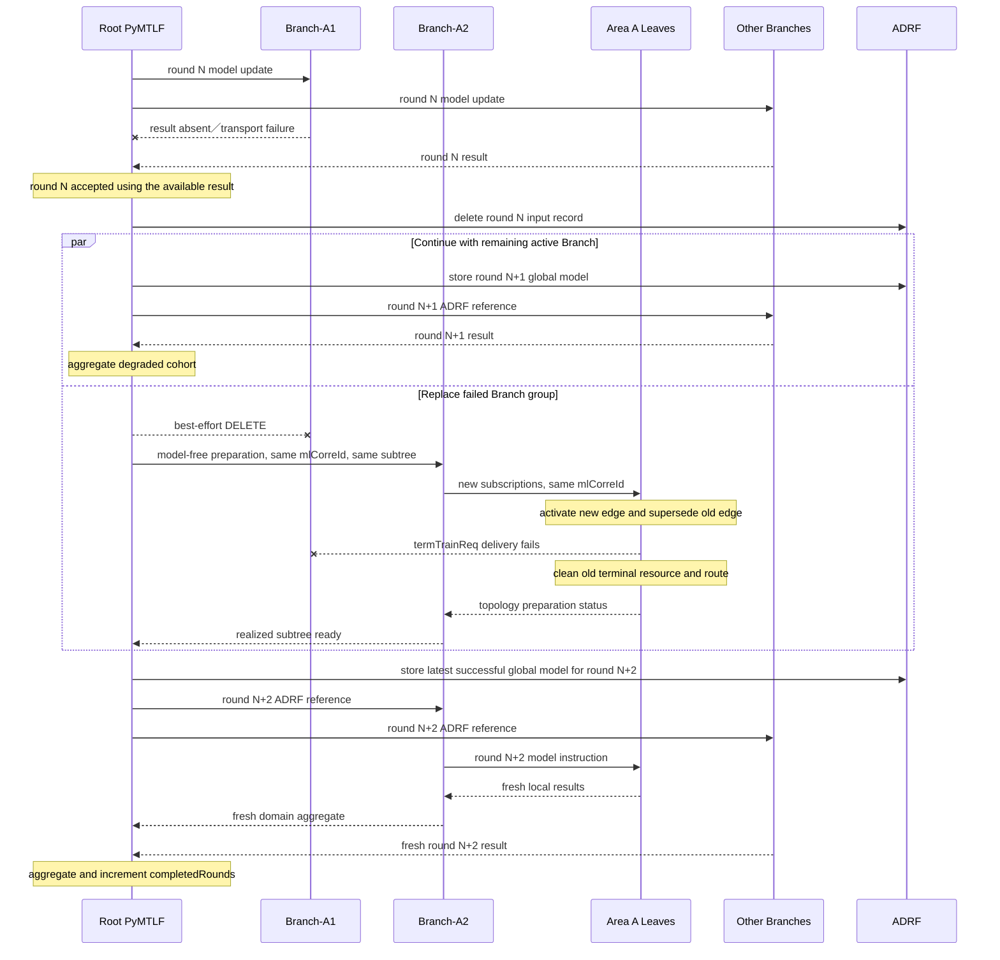

# Slice 3 — Branch Replacement without Retained-result Recovery Detailed Plan

日期：2026-09-07

狀態：Committed／Formal Testbed Validation Pending

相關文件：

- [Protocol Extension Implementation Plan](../Hierarchical%20NWDAF%20FL%20Protocol%20Extension%20Implementation%20Plan.md)
- [Protocol Extension Implementation Slice Map](../Protocol%20Extension%20Implementation%20Slice%20Map.md)
- [Protocol Implementation Current-State Inventory](../Protocol%20Implementation%20Current-State%20Inventory.md)
- [Protocol Resource Lifecycle and Wire Integration Mapping](../Protocol%20Resource%20Lifecycle%20and%20Wire%20Integration%20Mapping.md)
- [Protocol Extension Implementation Review Ledger](../Protocol%20Extension%20Implementation%20Review%20Ledger.md)
- [Slice 5 Detailed Plan](./Slice%205%20Protocol-driven%20Hierarchy%20Integration%20Detailed%20Plan.md)
- [Slice 6 Detailed Plan](./Slice%206%20Migration%20and%20Regression%20Closure%20Detailed%20Plan.md)
- [Branch 故障替換情境](../../../../design/hierarchical-federated-learning/branch_replacement_scenario.md)
- [Topology、Policy 與 Strategy 細節設計](../../../../design/hierarchical-federated-learning/topology_policy_design.md)
- [Candidate OpenAPI artifact](../../../../design/hierarchical-federated-learning/candidate_openapi.yaml)

---

## 1. Slice 目標

本 slice 讓已完成的 protocol-driven HFL runtime 在 training 途中遇到一個 direct
Branch 失效時，依 topology 中 Root node 的 effective policy 判斷當輪是否仍可使用成功
Branches完成aggregation，並在剩餘active Branches仍符合policy時繼續後續training。若
failed Branch group還有可用candidate，Root同時依既有direct-child selection semantics
選出新Branch、對它建立新的model-free preparation subscription，由新Branch對同一批
Leaves重建lower-tier subscriptions；replacement完成後只從下一個尚未dispatch的round
開始參與，不插入已凍結的current-round cohort。

這次重新啟用 Slice 3，但不恢復原先規劃的 retained-result runtime：

- `x-retainedResultReq`／`x-retainedResultStatus` 保留既有 wire contract 與 `403`
  execution gate；
- 不建立 `mlCorreId -> latest completed result` index；
- 不取回舊 Branch 或 Leaves 尚未送達的計算結果；
- 當輪是否aggregate只由Root effective policy對selected cohort的completion decision決定；
- policy接受的degraded round只聚合成功Branches，未送達的舊result不在之後補入；
- policy拒絕的attempt才不產生aggregate，後續使用更大的upper-tier `roundInd`重新訓練。

完成本 slice 代表「受控的單一 Branch fail-stop replacement」可在 local real-process
environment 跑通，不代表已完成任意拓樸自癒、跨廠商 re-parent authorization、Root
restart recovery 或 retained-result handoff。

---

## 2. 基準、規格與現況

### 2.1 盤點版本

| Repository | Revision | Slice 3 角色 |
| --- | --- | --- |
| `PyMTLF/` | `8a1d6fcfe8091efd543296ff0c11d1fb84766095` | Root failure／replacement state、FL Server participant lifecycle、Leaf rebind owner |
| `NWDAF/` | `256349f3f2d459339bc1f4e33d6b5c8a17e2d1e6` | 既有 Model Training Notify／DELETE transport與Leaf inbound route的terminal lifecycle owner |
| `nwdaf-resources/` | `e0e73c3fbe6f48aec65d6f977c637d0dcc3902c9` | 多區域 real-process replacement scenario 與 evidence owner |
| `nrf/` | `0dd4024d4ab75b6630e04901968228b9b9718cf5` | Fresh exact-ID discovery dependency；預設 read-only |
| `adrf/` | `905f0599f68fe389bba14ed56db0ef9abeab5ccd` | Per-attempt global-model record dependency；預設 read-only |
| `nwdaf-docs/` | `021677f0b905555703af9f40279bbb2956a0c04f` 加上本次 unstaged plan | Canonical scope、review 與驗證紀錄 |

Production implementation 開始前必須重新確認 affected repositories 的 HEAD 與工作樹。
若 Slice 5／6 後的 Root round owner、candidate freshness contract或 canonical runner 已
改變，先更新本計畫的 owner mapping，不能依本表的舊 revision 直接實作。

### 2.2 Release 18 可重用機制

本 slice 只將標準已允許的 FL Client 維護行為組成 hierarchical Branch replacement，
不把它描述成 3GPP 已定義的 hierarchy recovery procedure：

- TS 23.288 Release 18 §6.2C.2.2 step 4a 允許 FL Server 對當前 iteration 調整
  maximum response time或要求 Client略過該 iteration；step 7則為下一 round重新決定
  Clients並下發 aggregated model。
- TS 23.288 Release 18 §6.2C.2.3 明確允許 FL Server 在 execution phase依狀態、
  availability、capability、leave request或未在 maximum response time內回報等資訊，
  reselect、add或delete FL Clients；新 candidate 仍走既有 selection procedure，增刪可在
  iteration結束時發生。
- TS 29.520 Release 18 §5.5.3.3提供既有 subscription的PUT、JSON Merge PATCH與
  DELETE；新 Branch則可沿用collection POST建立新的resource。
- TS 29.520 Release 18 §4.6.2.4.2允許provider NWDAF以
  `Nnwdaf_MLModelTraining_Notify`的`termTrainReq`要求終止subscription，並表示
  後續不再對該subscription發送notification。Consumer回覆`204`只代表已接受
  並保存該notification，規格沒有保證consumer之後一定發送DELETE。
- TS 23.288 Release 18 §6.2C.2.3 step 1b將帶Termination Request的
  `Nnwdaf_MLModelTraining_Notify`定義為FL Client表示離開FL process的既有方式。
  本project的Branch consumer在接受該terminal notification後，會以既有
  unsubscribe path補送標準DELETE；這是本實作的lifecycle behavior，不宣稱為
  `204`的標準必然後續動作。
- TS 29.520 Release 18 §5.5.6.2.2將`mlCorreId`定義為ML model training procedure
  identifier，將`roundInd`定義為multi-round training的round number；兩者沒有定義
  hierarchical parent／child recovery binding。

因此，本 slice 可重用既有 `Nnwdaf_MLModelTraining` operations、hierarchy-wide
`mlCorreId`、per-edge `notifCorreId` 與 recursive `x-flTopology`。Root如何將一個
failed Branch assignment換成另一個Branch，仍是本project的orchestration behavior。

### 2.3 現有 production gap

目前 code 的直接行為是：

- Root 在 request開始時只解析並resolve每個configured assignment中的單一Branch；
  training期間沒有其他direct-child candidate state。
- Slice 2的`CandidatePool`已實作`minAvailableNodes`、`fractionTrain`、`minTrainNodes`、
  `acceptFailures`及`minCompletionRate`；Branch已用它決定lower-tier readiness、round
  selection及completion，且可在設定值低於configured candidates／active participants時
  執行。
- Branch preparation達到`minAvailableNodes`後即停止繼續建立relationship；其餘候選維持
  `UNCONFIRMED`。每輪選取數為
  `max(floor(active * fractionTrain), minTrainNodes)`且不超過active數量；completion rate的
  分母是該輪selected participants，而不是全部configured candidates。
- `FLServerEngine.execute_hierarchy_round()`已接受explicit selection、`accept_failures`與
  `minimum_completion_rate`；policy允許時可只聚合selected cohort中的成功results。但Root
  現在未傳入這些設定，因此upper tier仍使用all participants、`accept_failures=false`與
  completion rate `1.0`的預設行為。
- Root目前也無法從accepted degraded round取得failed Branch identity並啟動replacement；
  若upper-tier participant failure不符合預設行為，server process與整個Root request仍會
  進terminal cleanup。
- `FLServerEngine`已有新增preparation target、刪除participant、重新收集preparation與
  admission的基礎方法，但目前只允許在preparation state使用，不能在round失敗後形成
  replacement transition。
- `FLExperimentRegistry`允許同一active experiment下的多個Client subscriptions共用
  `mlCorreId`；然而Leaf端尚未定義新Branch subscription成功後，如何淘汰舊Branch
  subscription、舊callback work與registry membership。
- Leaf PyMTLF已可透過既有internal notification gateway將標準
  `NwdafMLModelTrainNotif`交給containing Go NWDAF；Go會依`notifCorreId`找到對應
  inbound route，同步轉送至consumer callback URI，並將peer的`204`或傳遞錯誤
  沿同一HTTP request回給PyMTLF。
- Go與PyMTLF也已有標準DELETE的正常resource path。目前Slice 3 working tree
  另外新增backend-ID route retirement endpoint，會讓同一subscription的cleanup使用新的非標準命令
  繞過既有Notify／DELETE lifecycle；本次remediation將移除該endpoint，並改由
  `termTrainReq`、既有DELETE與bounded local fallback完成收尾。
- `HierarchyNodeResolver.resolve()`每次都會經NRF exact-ID查詢並重新驗證registration、
  FL capability、event與model interoperability，因此可作替代Branch使用前的
  fresh check；Root現有static topology沒有足以進行任意list discovery的area／selection
  criteria。

這代表 wire path與Branch policy executor已足以建立及操作subtree，但缺少Root
topology assignment config、upper-tier policy wiring、可恢復的round outcome、replacement
owner與Leaf rebind lifecycle。目前 static topology只保存Branch／Leaf identities；Root另從
`federated_learning.strategy`建立共同strategy、從`server.client_training.epochs`建立Leaf
`reportAfter`，並把Branch `reportAfter`固定為一個round，`enabled`與priority也在組裝wire
node時補成固定值。這些都是protocol topology原本已能承載的指派資訊，不應繼續由分散的
global config或hard-coded mapping拼出。

---

## 3. Slice 邊界

### 3.1 納入

- Root static topology以Branch groups分開多個並行區域；每組包含有priority的Branch
  candidates、只宣告一次的Leaf candidates，以及由該組selected Branch套用的Leaf
  policy與strategy；Root policy與upper-tier strategy則直接放在topology根節點。Branch與
  Leaf candidates亦可直接設定`enabled`、`priority`與各自的`report_after`。
- Hierarchical assignment所需的`policy`、`strategy`、candidate state及node-local work均以
  static topology為authoritative source，再映射成既有`x-flTopology`；不再從
  `federated_learning.strategy`、`server.client_training.epochs`或Root／Branch hard-coded
  values補出explicit assignment。
- Root選擇Branch與Branch選擇Leaf共用Slice 2既有direct-child candidate pool、priority與
  policy semantics；本slice的production recovery與E2E evidence只實作及驗證Branch
  replacement。
- Root在每輪依自己的effective policy選擇active Branches，並以selected cohort計算
  completion；Branch仍依各group下發的effective policy建立及選擇Leaves。
- Initial Branch selection與mid-training replacement都從相同group candidate pool依序
  嘗試；初始最高順位Branch無法完成resolve／preparation時可改試下一個。
- Training途中一個direct Branch的round dispatch failure、termination Notify或response
  deadline timeout觸發replacement。
- Candidate使用前經NRF fresh exact-ID resolve與既有capability／event／interoperability
  validation。
- Root淘汰failed Branch的local participant、callback correlation與ADRF consumer
  authority，再向replacement建立新的model-free preparation subscription。
- Replacement Branch以同一hierarchy-wide `mlCorreId`、新的subscription resource與
  `notifCorreId`，對同一Leaf subtree逐級重建subscriptions。
- Leaf在受控同一procedure內接受新parent subscription，並在新resource成功建立後
  fence舊parent resource所屬work與registry membership。舊edge再以標準`termTrainReq`
  通知consumer；成功時等consumer經既有路徑發送DELETE，明確傳遞失敗時由
  provider端完成terminal cleanup。
- 單一Branch失敗後，當輪若符合Root completion policy，使用成功Branches完成aggregate；
  若不符合才丟棄該attempt。只要剩餘active Branches仍符合Root readiness policy，Root在
  replacement preparation期間繼續dispatch後續round。
- Replacement完成後只加入下一個尚未dispatch的cohort；不取回或補入舊Branch／Leaves的
  retained result。
- Unit／boundary tests、local multi-process replacement scenario與review evidence。

### 3.2 不納入

- Retained-result保存、查詢、傳輸、freshness判斷或舊計算結果接續。
- Leaf failure replacement的production transition與E2E evidence；它是相同direct-child
  selection model可延伸的情境，但不是本slice驗收目標。
- 獨立的initial-preparation failure injection scenario；initial selection本身會使用同一
  candidate pool，但本slice的replacement evidence聚焦已admitted hierarchy在training
  round期間的失效。
- 同一failed attempt內同時替換兩個以上Branches；多重同時失效直接終止request。
- 任意NRF list discovery、area ranking、topology optimizer或動態產生replacement
  candidate list。
- Root process restart後恢復replacement state或ADRF mapping。
- Old Branch恢復後的ownership handback、split-brain處理或跨廠商re-parent authorization。
- 新的external protocol field、candidate OpenAPI變更、NRF schema或ADRF API變更。
- 正式multi-host testbed performance experiment與paper metrics。

若實作證明新parent identity或authorization資訊無法從現有inbound contract、local
topology與trusted deployment context取得，不得把Leaf-local判斷描述成完整安全方案；應
停止擴大實作，將該問題回報為新的protocol decision。

---

## 4. 固定 execution contract

### 4.1 Direct-child candidate configuration

本 slice 延伸Root local static topology，而不是新增wire field。Configuration以
`branch_groups`表示多個並行的Branch範圍；每組的`branches`是可服務同一組Leaves的
候選池，`leaves`只宣告一次，避免重複subtree或由runtime比對Leaf lists推導群組。
Topology根節點的`policy`與`strategy`分別控制Root對currently active Branch
representatives的selection／completion及upper-tier training／aggregation contract；每個
group的`policy`與`strategy`則映射成selected Branch收到的`x-flTopology`，控制該Branch
與direct Leaves形成的local FL process。Branch與Leaf candidate entries直接承載對應edge
的`enabled`、`priority`與`report_after`，使local config和protocol assignment使用同一組
語意：

```yaml
admission:
  mode: complete_required
policy:
  allow_additional_candidates: false
  additional_candidate_priority: 0
  selection_method: priority
  min_available_nodes: 1
  fraction_train: 1.0
  min_train_nodes: 1
  accept_failures: true
  min_completion_rate: 0.5
strategy:
  method: fedProx
  aggregation: sampleWeighted
  method_parameters:
    proximal_mu: 0.01
branch_groups:
  - branches:
      - nf_instance_id: 10000000-0000-4000-8000-000000000111
        enabled: true
        priority: 100
        report_after:
          count: 1
          unit: round
      - nf_instance_id: 10000000-0000-4000-8000-000000000112
        enabled: true
        priority: 50
        report_after:
          count: 1
          unit: round
    policy:
      allow_additional_candidates: false
      additional_candidate_priority: 0
      selection_method: priority
      min_available_nodes: 2
      fraction_train: 0.5
      min_train_nodes: 1
      accept_failures: true
      min_completion_rate: 0.5
    strategy:
      method: fedProx
      aggregation: sampleWeighted
      method_parameters:
        proximal_mu: 0.01
    leaves:
      - nf_instance_id: 10000000-0000-4000-8000-000000001101
        enabled: true
        priority: 100
        report_after:
          count: 5
          unit: epoch
      - nf_instance_id: 10000000-0000-4000-8000-000000001102
        enabled: true
        priority: 50
        report_after:
          count: 5
          unit: epoch
  - branches:
      - nf_instance_id: 20000000-0000-4000-8000-000000000121
        enabled: true
        priority: 100
        report_after:
          count: 1
          unit: round
      - nf_instance_id: 20000000-0000-4000-8000-000000000122
        enabled: true
        priority: 50
        report_after:
          count: 1
          unit: round
    policy:
      allow_additional_candidates: false
      additional_candidate_priority: 0
      selection_method: priority
      min_available_nodes: 2
      fraction_train: 1.0
      min_train_nodes: 2
      accept_failures: false
      min_completion_rate: 1.0
    strategy:
      method: fedProx
      aggregation: sampleWeighted
      method_parameters:
        proximal_mu: 0.01
    leaves:
      - nf_instance_id: 20000000-0000-4000-8000-000000001201
        enabled: true
        priority: 100
        report_after:
          count: 5
          unit: epoch
      - nf_instance_id: 20000000-0000-4000-8000-000000001202
        enabled: true
        priority: 50
        report_after:
          count: 5
          unit: epoch
```

設定與選擇規則如下：

- 每個`branch_groups[]`是獨立assignment；不同groups可各自選出一個active Branch並行
  training，一組內的Branch失效不改變其他group的assignment。
- Root-level `policy`只作用於每個group目前選出的active Branch representative；
  replacement candidates仍留在各自group內，不會因`fraction_train`同時選到同區域的
  兩個替代Branches。
- Root-level `strategy`是Root與selected Branch representatives形成之upper-tier local FL
  process的training／aggregation contract；它由Root local runtime直接採用，不作為Root的
  `reportAfter`，因Root沒有direct parent。
- `branch_groups[].policy`是該group selected Branch作為FL Server時使用的node policy；
  Root將它和group Leaves一起映射到該Branch的`x-flTopology`，不在code中重建固定值。
- `branch_groups[].strategy`是selected Branch與該group Leaves形成之lower-tier local FL
  process的共同contract。Root將它放入Branch topology node；Branch建立Leaf subscription
  時，將同一method、aggregation與typed method parameters逐級放入Leaf收到的node，不要求
  static YAML在每個Leaf重複strategy。
- 每組至少需要一個Branch candidate及一個Leaf candidate；只有一個Branch時仍可執行
  一般training，但該group沒有Branch failover能力。
- `enabled`為optional boolean，省略時為`true`。設為`false`的Branch或Leaf candidate仍保留
  explicit exclusion語意，但不得進入establishment或training selection；runtime failure
  status不反向改寫static config。
- `priority`為non-negative signed-32-bit integer。當direct parent的
  `selection_method: priority`時，每個enabled explicit candidate都必須提供；使用
  `selection_method: random`時可以省略，省略值在local representation中視為`0`，但不參與
  random selection排序。
- 每個enabled explicit Branch與Leaf candidate都必須提供`report_after`。Branch的unit必須
  為`round`，表示完成幾次lower-tier rounds後向Root回報；Leaf的unit必須為`epoch`，表示
  local training epochs。不同candidates可使用不同count，replacement必須保留被選中
  Branch自己的值。
- 所有Branch candidate、Leaf candidate與Root identity都必須是canonical UUIDv4，
  並在同一topology內全域唯一；同一NF不能同時出現在兩個assignment或兩種role。
- priority較高者先嘗試；相同priority沿用Slice 2既有的canonical `nfInstanceId`
  tie-breaking，不因本slice改變既有selection結果。
- Root對每個group使用一個direct-child candidate pool，initial preparation只選出一個
  active Branch；其他Branch保持`UNCONFIRMED`，不建立subscription，也不列入ADRF
  allowlist。
- `admission.mode=complete_required`只控制initial admission：每個configured group都要有
  一個selected Branch完成subtree preparation後才能開始training。Root-level
  `min_available_nodes`等policy則控制admission完成後的runtime round，不會讓initial
  topology因較低minimum而跳過整個group。
- Root與各group policy使用Slice 2相同欄位、validation與default-resolution semantics；
  `min_available_nodes >= min_train_nodes`，比例在`(0, 1]`，而
  `accept_failures=true`時必須有`min_completion_rate`。本slice不增加另一套policy type。
- Topology root與每個Branch group都必須提供strategy，使upper-tier與各lower-tier local
  FL process各自有明確contract；不得回退到舊global hierarchy strategy。
- Static YAML沿用local config的`snake_case`命名；Root映射成protocol node時使用既有
  `FlPolicy`、`FlStrategy`與`FlReportAfter`的`camelCase` wire names，不建立語意不同的
  第二份欄位。Config enum values沿用protocol values，例如`fedProx`、`sampleWeighted`、
  `epoch`與`round`，不再另設只為local config存在的同義值。
- readiness達到`min_available_nodes`後即可開始round；未建立的候選保留
  `UNCONFIRMED`。Round selection數量為
  `min(active, max(floor(active * fraction_train), min_train_nodes))`。
- completion rate只以該輪selected participants為分母；`accept_failures=false`要求全部
  selected participants成功，`accept_failures=true`則在
  `successful / selected >= min_completion_rate`時只聚合成功results。
- Root選定Branch後，才把該group共用的Leaves映射成該Branch的`x-flTopology.children`；
  每個Leaf保留configured enabled、priority與`reportAfter`，並取得group strategy；Branch
  依收到的effective policy使用既有candidate-pool機制建立及選擇direct participants。
  需要多少active或per-round Leaves，分別由`minAvailableNodes`、`minTrainNodes`與
  `fractionTrain`決定，不由priority本身決定。
- `federated_learning.strategy`與`server.client_training.epochs`不再是hierarchical explicit
  assignment的authoritative source。Flat FL仍可繼續使用其既有server-owned training
  setting；locally discovered child在上層沒有提供node instruction時，也可依protocol既有
  規則採用該Branch的local decision，但不得覆蓋static topology已明確指定的值。
- `retainedResultReq`雖仍存在於candidate protocol schema，依本slice決策不加入static
  topology config，也不由replacement path產生。`status`、`statusTimestamp`與
  `statusCause`屬Notify／runtime state；`mlCorreId`、`notifCorreId`、`roundInd`及model
  references屬procedure／operation state，均不得混入static assignment。
- Root-level與Branch-level selection使用同一組candidate eligibility、priority、status與
  freshness semantics；selection owner只操作自己的direct children。設計因此可延伸到
  Leaf replacement，但本slice不新增或驗證該production recovery path。
- 每個Branch candidate在單一Root request內最多進行一次relationship establishment；
  成功啟用後可正常參與多個round，但initial discovery／preparation或後續round失敗後
  不重新建立同一candidate，改試下一個。
- NRF不是configured candidate list的authoritative owner。Local topology決定每個group的
  Branch／Leaf candidates；
  NRF exact-ID resolve只在真正選用前確認目前registration與capability仍有效。

### 4.2 可恢復與不可恢復的失敗

只有能明確歸因到單一selected direct Branch不可用的結果，才進replacement：

- Root對該Branch的round PUT／PATCH發生connection／deadline transport failure，或peer
  resource回`404`／`410`／`503`等可明確表示resource／service不可用的結果；
- 該Branch以termination Notify表示離開或不可用；
- 該Branch在當次maximum response deadline前沒有完成callback。

下列錯誤仍直接終止整個Root request，不嘗試替換：

- notification schema、identity、`mlCorreId`、`roundInd`或expected subtree不一致；
- peer回`400`／`403`／`409`等表示request、authorization或state contract不成立的
  response；
- model／artifact／workload不相容或result validation失敗；
- aggregation、ADRF store／retrieve／delete或Root local workspace失敗；
- Root shutdown、generation reset或其他無法歸因到單一Branch的internal error；
- 同一attempt同時有多個direct Branch失效。

`FLServerEngine`應以typed outcome／exception回傳recoverable failed Branch identity，不能
再由Root解析error string。Non-recoverable error仍沿用既有terminal cleanup。

### 4.3 Round completion與attempt semantics

Active-round cohort在dispatch時凍結，replacement不加入已開始的round。Root使用
topology根節點的effective policy，對該cohort沿用Slice 2既有completion semantics：

- `completionRate = successful selected Branches / selected Branches`；
- `acceptFailures=false`時，任一selected Branch失敗便拒絕該attempt；
- `acceptFailures=true`時，只有`completionRate >= minCompletionRate`才接受，並只聚合
  successful Branch results；
- response deadline前未回報、termination Notify及可恢復的peer availability failure都
  計為該selected Branch失敗；result validation、aggregation、ADRF及Root internal error
  不轉換成completion failure，仍是terminal error。

本slice不對同一`roundInd`重送。Root需區分：

- `completedRounds`：成功完成Root aggregation的數量；
- upper-tier `roundInd`：每次dispatch attempt的monotonic identifier。

固定規則如下：

1. 若當輪completion decision接受，Root立即以successful Branch results產生global
   aggregate並增加`completedRounds`；failed Branch的缺失／late result永遠不補入該
   aggregate。
2. 若當輪completion decision拒絕，該attempt不產生Root aggregate、不增加
   `completedRounds`，同一attempt已成功回報的partial results也不跨round保留。
3. 不論當輪接受或拒絕，Root在完成該attempt的正常ADRF／temporary input cleanup後，才
   dispatch下一個round；每個attempt使用新的ADRF record與嚴格增加的`roundInd`。
4. 下一attempt以最近一次成功Root aggregate為source；若尚無成功aggregate，則沿用最初
   random-initialized global model。
5. Failed Branch從後續cohort移除。若剩餘active Branches仍符合Root
   `minAvailableNodes`與`minTrainNodes`，Root不等待replacement完成即可繼續round；若不
   符合，則暫停新dispatch直到replacement ready或candidate耗盡。
6. Replacement在背景完成preparation與Leaf rebind後，原子地成為該group的active
   representative，並從下一個尚未dispatch的round起重新進入Root selection。
7. Configured `round_count`表示需要完成的成功global aggregations。只有policy接受且真正
   產生Root aggregate的attempt才計數，因此最後successful `roundInd`可能大於或等於
   `round_count - 1`。

Final handoff、status與evidence必須使用實際最後successful attempt的round identity，不能
再假設它等於`completedRounds - 1`。

Attempt完成decision後，所有selected participants的當次notification state必須一併
封存。Replacement期間到達的舊`roundInd` callback只能記錄為late outcome，不能重新開啟
已接受或已拒絕的attempt；下一attempt也必須以新的expected round／attempt generation
拒絕它。

### 4.4 Replacement transition

Root在收到包含failed Branch identity的recoverable round outcome後，先完成4.3的
completion decision與當輪cleanup，再啟動下列replacement transition。當剩餘active
Branches符合Root readiness policy時，replacement state不得成為後續round的全域阻塞；
Root需分別保存training progress與per-group replacement progress：

1. 保存failed assignment、attempt identity與可觀察的per-group `BRANCH_REPLACING`
   progress；Root request在仍可訓練時可繼續呈現目前round state。
2. 從Root FL Server process移除failed Branch的participant、selected-set state與
   `notifCorreId` correlation。對舊remote resource的DELETE採best effort；peer已失效時，
   DELETE失敗需保留evidence，但不能讓dead local participant繼續阻擋replacement。
3. 由failed Branch所屬group的direct-child candidate pool，依既有eligibility與priority
   規則選下一個尚未嘗試的candidate，再經NRF fresh exact-ID resolve。
4. 使用該group共用的Leaf candidate set、policy、strategy與`reportAfter`建立
   `ProtocolPreparationTarget`；Branch node使用replacement candidate自己的enabled、
   priority與round-unit `reportAfter`，Leaf nodes保留各自的enabled、priority與epoch-unit
   `reportAfter`。新subscription沿用同一`mlCorreId`，產生新的
   `notifCorreId`與resource location，且不帶`x-retainedResultReq`。
5. Replacement Branch逐級建立model-free Leaf subscriptions並回報完整
   `x-flTopologyReport`。Root依下發的effective policy驗證realized Leaf set；本slice的
   canonical replacement scenario依group policy的`minAvailableNodes`判斷subtree ready，
   不以Leaf replacement擴大主要驗證範圍。
6. Preparation或discovery失敗時清理該candidate的partial resources，再嘗試下一個；
   candidate耗盡後將該group保留為unavailable。若其他active representatives仍符合Root
   policy，request可繼續degraded training；否則bounded終止並清理。
7. Replacement ready後，Root原子更新active Branch mapping、admission snapshot與
   expected subordinate set；下一個尚未建立的ADRF record才使用包含replacement且排除
   failed Branch的新consumer set。

不需要新增「我是replacement」的wire flag。對目前受控流程而言，同一`mlCorreId`、新
per-edge resource／`notifCorreId`與Root指定的同一subtree已足以建立新路徑；是否允許
這次re-parent由local trusted topology與Slice 3 rebind rule決定。

### 4.5 Leaf rebind與late-work fencing

新Branch為Area A Leaves建立subscription時，Leaves可能仍保存舊Branch建立的resource。
同一Leaf只能保留一條代表該hierarchy assignment的active upper edge，因此需要以下
transition：

- 新subscription必須使用相同hierarchy-wide `mlCorreId`並通過完整preparation
  validation；Create尚未成功前不得破壞舊resource。
- 新resource成功建立後，Leaf以同一procedure與role為scope，原子地將舊upper
  subscription標為`SUPERSEDED`／`TERMINATING`，取消其pending training／callback work並
  移除舊registry membership；新resource保持active。這個transition必須先完成，才能
  發送舊resource的terminal notification。舊resource雖不再是active member，仍必須能以
  backend resource ID取得，供後續標準DELETE完成實體清理。
- 舊resource之後的PUT／PATCH或late completion不得改寫新resource state；尚未送出的
  callback work需取消。已經進入transport的HTTP callback無法被收回，由old Branch
  fail-stop前提與接收端的old-round／old-correlation fencing隔離。
- Leaf PyMTLF使用舊resource的`notifCorreId`產生含`termTrainReq`的
  `NwdafMLModelTrainNotif`，透過既有internal notification gateway同步交給containing
  Go NWDAF。PyMTLF在取得Go的明確回覆前，只保留完成terminal delivery所需的
  最小resource metadata；舊training work已經fence，不會等待notification才停止。
- Go依`notifCorreId`找到舊inbound route，將route轉為只允許terminal DELETE的
  `TERMINATING`狀態，並將notification轉送至舊Branch callback URI。一般PUT／PATCH與
  後續callback均不得讓該route回到active。
- 若舊Branch接受notification並回`204`，Go將同一`204`回給Leaf PyMTLF，但保留
  terminating route與Leaf terminal resource。本project的Branch PyMTLF在接受
  `termTrainReq`後，排入原participant resource的既有unsubscribe；Branch Go再對Leaf
  public resource發送標準DELETE。Leaf Go將DELETE傳給Leaf PyMTLF，只在backend完成
  resource cleanup後才刪除／tombstone route。
- `204`不能被視為規格保證後續一定收到DELETE。若舊Branch已回`204`卻在
  bounded termination grace period內沒有發送DELETE，Leaf Go重用既有backend DELETE
  lifecycle清除Leaf PyMTLF terminal resource，再刪除／tombstone route；不新增專用
  cleanup API。
- 若Go已成功處理PyMTLF request，但對舊Branch的notification因transport或peer
  response明確失敗，Go在該次request內刪除／tombstone舊route，並將peer delivery
  failure沿同一HTTP response回給PyMTLF。PyMTLF收到該明確結果後實體清除舊
  backend resource，不再等不會到來的consumer DELETE。
- 若Leaf PyMTLF本身無法連到containing Go，它不能推斷Go或舊Branch是否已
  處理notification。此時保留最小terminal delivery job做bounded retry；舊
  training work仍保持fenced。後續若Go回覆route已tombstone／不存在，PyMTLF可視為
  Go端已完成收尾並刪除本地terminal resource。
- Supersede舊resource不等於終止整個`mlCorreId` experiment；只有最後active upper
  subscription被正常刪除時，才進既有procedure cleanup。
- 舊result artifact與callback work直接依既有workspace／resource lifecycle清除，不建立
  retained index。

目前inbound contract沒有通用的authenticated parent-ownership token。本slice只在同一
受控deployment、同一configured subtree與fail-stop old Branch前提下啟用上述rebind；不
宣稱它是通用multi-vendor安全re-parent protocol。

### 4.6 ADRF與artifact lifecycle

- 每個attempt的Root global-model ADRF record都依既有round lifecycle在completion decision
  後刪除；無論該attempt接受或拒絕，都不能修改record後沿用。
- 每個下一attempt建立新的`modelUniqueId`／`storTransId` record，不必等待replacement；
  replacement尚未ready時，record只授權目前active cohort及其realized descendants。
- Replacement ready後，下一個尚未建立的record之`allowConsumerList`才納入replacement
  Branch與其realized Leaves，並持續排除failed Branch；不得修改已dispatch round的
  allowlist與cohort。
- Root global model仍以`mLModelAdrf`逐級下發；Branch domain aggregate與所有上行result
  仍使用producer-owned temporary `mLFileAddr`。
- Candidate preparation維持model-free；只有下一training attempt建立並下發model。
- Root shutdown、terminal failure與successful completion都必須使active ADRF record
  count回到零。

---

## 5. 目標流程



圖中`minCompletionRate=0.5`只是可執行範例。其他區域在replacement期間不需要重建
subscriptions；只要Root readiness與completion policy允許，它們可繼續完成degraded
round。Replacement只加入尚未dispatch的下一輪，不改變in-flight cohort。

---

## 6. Repository 實作計畫

### 6.1 `PyMTLF/`

#### Static topology與Root candidate state

- `src/py_mtlf/core/fl_topology.py`
  - 將既有`branches -> leaves`輸入改為`branch_groups -> branches／leaves`；Branch與Leaf
    entries都接受`enabled`、priority及role-correct `report_after` validation；
  - 在topology root解析Root policy與upper-tier strategy，在每個branch group解析selected
    Branch對Leaves使用的policy與lower-tier strategy；共用Slice 2現有field model、typed
    FedProx parameters與cross-field validation，不保留hard-coded runtime substitute；
  - 每個group輸出immutable Branch candidate set與只保存一次的Leaf candidate set，不以
    重複Leaf list推導assignment；
  - 驗證Root／Branch／Leaf的全域identity互斥；
  - 移除project-specific `version`欄位，不增加schema version、legacy reader或舊格式
    compatibility path。
- `src/py_mtlf/config.py`與hierarchical config／test fixtures
  - 移除舊`federated_learning.strategy` config model、hierarchical-mode requirement及
    `algorithm／participant_selection／waiting_policy／aggregation`輸入，不保留ignored
    field、alias或fallback reader；
  - `server.client_training.epochs`因flat flow及上層未明確指定時的local decision仍有owner，
    保留既有設定，但不得作為explicit hierarchical assignment的來源。
- `src/py_mtlf/core/fl_root.py`
  - 每個group建立Root-owned direct-child candidate pool，initial selection只resolve實際
    要嘗試的Branch；不另建replacement-specific queue；
  - 每個group只向Root runtime cohort暴露目前的一個active representative；Root從
    topology root取得effective policy，實際用於readiness、per-round selection與
    completion，不再依`execute_hierarchy_round()`預設值執行all-required；
  - Leaf selection以`branch_groups[].policy`為authority；Root將它下發為selected Branch
    node的`x-flTopology.policy`，不再由`_protocol_branch_node()`硬編碼all-required policy；
  - Root upper-tier execution使用topology root strategy；selected Branch收到group
    strategy，不再從`federated_learning.strategy`組裝protocol assignment；
  - 選定Branch時，將candidate自己的enabled、priority與round-unit `report_after`，以及
    group共用Leaf candidates的enabled、priority與epoch-unit `report_after`映射為該Branch
    收到的`x-flTopology`；Branch再把group strategy逐級放入Leaf subscriptions；
  - Hierarchical explicit participant的local epochs只以subscription保存的
    `reportAfter`為execution authority；round artifact內既有`client_training` metadata不得
    覆蓋它。`server.client_training.epochs`只保留給flat flow或未收到上層instruction時的
    local decision；
  - 將successful-round counter與dispatch `roundInd` counter分離，並記錄每輪selected、
    successful與failed Branch identities；
  - 每輪依Root CandidatePool公式產生selected cohort，將`acceptFailures`與
    `minCompletionRate`傳給FL Server；accepted degraded round只聚合successful results；
  - 新增per-group `BRANCH_REPLACING` observable progress與bounded replacement loop；剩餘
    active cohort符合Root policy時，training rounds與replacement preparation可並行；
  - replacement ready後原子重建admission、reports與expected subordinate，並從下一個
    ADRF record／尚未dispatch cohort開始納入replacement；
  - candidate exhaustion依Root readiness決定保留unavailable group並繼續，或執行terminal
    cleanup；non-recoverable error仍直接terminal。

#### FL Server recoverable round boundary

- `src/py_mtlf/core/fl_server.py`
  - 以typed round outcome同時攜帶aggregate、completion acceptance及direct failed
    participant identities，讓accepted degraded round也能觸發replacement；
  - 將peer transport、termination與deadline failure和validation／aggregation／internal
    error分開；
  - selected participant的dispatch availability failure只記錄該participant失敗，仍繼續
    dispatch／等待同一cohort的其他participants，使completion threshold取得完整
    successful／failed集合；
  - reuse目前explicit selection、`accept_failures`與`minimum_completion_rate`執行路徑；
    recoverable participant failure在policy接受時完成aggregation，在policy拒絕時回傳
    rejected attempt，兩者都不得僅因availability failure取消整個hierarchy；
  - 允許retire failed participant、清除local correlation，並在remote DELETE失敗時保留
    cleanup evidence；
  - 當consumer角色收到`termTrainReq`並成功接受時，排入該participant的既有
    unsubscribe path，由containing Go NWDAF對provider resource發送標準DELETE；
  - 重用現有add-target／collect／admit transport owner建立replacement，避免第二套
    subscription client；但將replacement preparation保存為獨立per-participant substate，
    不要求仍在training的global process退回preparation state；
  - pending replacement不進入in-flight selected cohort；preparation完成後只在round
    boundary由Root原子adopt成active participant。

#### Leaf rebind與procedure cleanup

- `src/py_mtlf/core/fl_client.py`
  - 在protocol preparation Create完成前後建立atomic same-procedure rebind；
  - fence舊resource revision、pending work與late callback，並將舊resource保留為terminal
    resource直到consumer DELETE、明確delivery failure或bounded fallback cleanup；
  - 對舊resource產生含`termTrainReq`的standard notification，並依Go同步回覆區分
    accepted delivery、peer delivery failure與local Go unreachable；只有最後一種保留
    bounded retry job；
  - 不觸發retained lookup，不重新解讀request中的model field。
- `src/py_mtlf/core/fl_experiment.py`
  - 讓supersede只移除舊subscription membership，不把整個experiment標成terminal；
  - 保持不同`mlCorreId`的top-level conflict與最後resource cleanup規則。
- `src/py_mtlf/core/fl_branch.py`、`fl_hierarchy_discovery.py`與
  `fl_round_model_distribution.py`
  - Branch建立downstream target時保留Leaf node的enabled、priority與`reportAfter`，並將
    group strategy逐級傳遞；不得以Branch local default覆蓋explicit assignment；
  - 其餘預設重用既有production owner；只有direct contract test證明缺少replacement所需
    state transition時才做focused修改。

### 6.2 `NWDAF/`

現有Go routes已能為新Branch與Leaves建立新的Create resources、轉送topology-only
Notify、執行PATCH／DELETE並以per-resource `notifCorreId`做callback correlation。本次
remediation不再新增另一條route retirement command path，而是將terminal semantics接回
現有Notify／DELETE lifecycle：

- 移除
  `DELETE /internal/v1/ml-model-training/inbound-routes/:backendSubscriptionId`及其handler、
  processor contract、context lookup與PyMTLF dedicated client method；
- backend-originated notification包含`termTrainReq`時，Go仍使用既有
  `/internal/v1/ml-model-training/notifications`與`notifCorreId`找到舊inbound route，不新增
  custom field、header或endpoint；
- Go在轉送前以route revision保護terminal transition，使該route不再接受普通
  mutation，但仍能接受consumer後續發送的標準DELETE；
- peer回`204`時，Go同步回`204`給PyMTLF並等待consumer DELETE。DELETE沿
  現有public handler→processor→backend DELETE path清除PyMTLF resource，成功後才刪除與
  tombstone Go route；
- peer notification明確失敗時，Go刪除／tombstone route後將既有
  `ProblemDetails`失敗沿同一HTTP response回給PyMTLF；該回覆表示consumer未接受
  notification，PyMTLF可完成舊terminal resource cleanup；
- peer已回`204`但bounded grace period內沒有DELETE時，Go由原route保存的
  backend resource identity重用既有backend DELETE operation，之後刪除／tombstone route。
  Terminal route保存grace deadline，並由processor現有cleanup reconciliation worker以可測試
  clock驅動；backend DELETE失敗時保留pending-cleanup state並依既有retry policy再試，不增加可呼叫的
  cleanup API或新的external config surface。

Focused regression需確認：

- 多個不同subscription resources可以攜帶同一`mlCorreId`；
- 新舊resource各自維持獨立`notifCorreId`、Location、revision與DELETE lifecycle；
- `termTrainReq`只終止舊resource，不會終止共用`mlCorreId`的新resource；
- notification成功路徑等待標準DELETE；peer傳遞失敗與grace timeout路徑也都會
  清掉backend resource與matching inbound route，不影響新resource或outbound route；
- 重複DELETE、late DELETE或PyMTLF重試terminal notification不會重複清理或恢復舊
  resource；
- retained-result instruction仍被既有execution gate拒絕，replacement path不依賴它。

### 6.3 `nwdaf-resources/`

- 在canonical hierarchical deployment新增`branch-replacement` scenario／profile，保留
  既有`smoke`與`aggregation`預設行為。
- Scenario使用一個Root、三個active regional Branches、Area A的一個inactive
  replacement Branch，以及每區至少兩個Leaves；所有node均使用真實Go NWDAF與PyMTLF
  process。
- Topology明確設定Root policy允許單一Branch failure後以剩餘Branches完成round，並為各
  group設定Leaf policy／strategy及Branch／Leaf `report_after`；evidence需證明runtime採用
  的是config值，而非Root／Branch hard-coded defaults。
- Generalize node／topology／shard／artifact-origin support，使replacement Branch在啟用前
  已註冊NRF但沒有active training subscription。
- 至少執行兩個successful global rounds；在觀察到`completedRounds == 1`，且Root已進入
  下一個`ROUND_DISPATCH`／`ROUND_WAITING`後，同時停止Area A primary的Go NWDAF與
  PyMTLF processes，使整個Branch instance於training途中失效。
- Fault injection以Root observable state／completed-round barrier確認發生時點；若既有
  workload太快，使用runner-owned synchronization延長可觀察區間，不在production code
  新增failure hook，也不以單一fixed sleep作為成功證據。
- Runner需保存新舊subscription identity、replacement topology report、round attempts、
  每輪selected／successful／failed cohort、ADRF lifecycle、final outcome與terminal cleanup
  evidence。

### 6.4 `nwdaf-docs/`

- 將實作前／後revision、review findings、測試與remaining gap追加到既有review ledger。
- 不回頭把retained-result scenario描述成Slice 3 production behavior。
- 正式multi-host testbed未執行前，維持integration verification gap。

---

## 7. 測試計畫

### 7.1 `PyMTLF` deterministic tests

| Test area | 必須直接證明的production behavior |
| --- | --- |
| Static topology | Multiple Branch groups、root／per-group policy與strategy、Branch／Leaf enabled、priority、role-correct `reportAfter`、single stored Leaf set、UUIDv4、global duplicate／role collision rejection，以及無`version`／legacy input path |
| Assignment mapping | Root／group strategy及每個candidate的enabled、priority、`reportAfter`完整映射至protocol topology；移除舊hierarchical global strategy config，explicit assignment不再由global epochs或hard-coded one-round補值 |
| Config evolution | 舊`federated_learning.strategy`與舊static topology shape依experimental-schema policy被拒絕，不存在ignored field、compatibility alias或fallback reader；flat／local-default epochs仍有focused regression |
| Root policy | `minAvailableNodes` readiness、`fractionTrain`／`minTrainNodes` selection及`acceptFailures`／`minCompletionRate` completion均由topology config驅動；低於configured／active數量的boundary直接覆蓋 |
| Root replacement | Accepted或rejected round中的timeout／termination／peer failure都回報failed identity並觸發fresh candidate resolve；same `mlCorreId`、new resource／`notifCorreId`、same subtree |
| Round accounting | Accepted degraded round只聚合successful cohort並增加`completedRounds`；rejected attempt不aggregate／不增加計數；下一attempt使用higher `roundInd`與last committed global model |
| FL Server recovery | Recoverable failure依effective completion policy產生typed outcome而不cancel entire process；retired participant與correlation立即fenced；non-recoverable error仍terminal |
| Candidate failure | Initial或replacement discovery／preparation失敗改試下一Branch candidate；每個candidate只建立一次relationship；exhaustion後依Root readiness決定degraded continuation或terminal cleanup |
| Leaf rebind | 新resource成功後才supersede舊resource；舊work／callback不能改寫新state；舊edge發送`termTrainReq`，依同步回覆區分accepted、peer failure與local Go unreachable |
| Terminal Notify／DELETE | Notify成功後Branch使用既有unsubscribe發送標準DELETE；明確peer failure與success-without-DELETE timeout都會清掉舊backend resource與matching route；不保留dedicated retirement API |
| ADRF lifecycle | Per-round record cleanup、新record identity、replacement allowlist與terminal zero-record cleanup |
| Generation／shutdown | Replacement途中Root generation改變或shutdown時停止所有新工作並清理已建立resources |

測試使用真實production state machine、artifact owner與aggregation path；network／clock／
callback邊界可使用`httpx.MockTransport`、fake clock與`Event`／barrier控制。不得mock掉
candidate resolve、participant mutation、round counter、ADRF mapping或Leaf rebind本身。

預期focused files包括：

- `tests/test_fl_topology.py`
- `tests/test_fl_root.py`
- `tests/test_fl_server.py`
- `tests/test_fl_client.py`
- `tests/test_fl_experiment.py`
- `tests/test_fl_hierarchy_discovery.py`
- `tests/test_fl_round_model_distribution.py`

### 7.2 `NWDAF` regression

執行internal gateway、Model Training processor、route context、callback與resource
lifecycle focused tests，再執行repository full test／lint／build。Go tests需直接驗證：

- backend-originated `termTrainReq`沿現有notification route依`notifCorreId`匹配正確
  inbound resource；
- peer回`204`時Go保留terminal route，之後的標準DELETE會先到PyMTLF清理
  backend resource，再清Go route；
- peer transport／response failure以同一HTTP response回報PyMTLF，並且只清理該
  matching inbound route；
- accepted notification之後沒有DELETE的grace-timeout fallback重用既有backend
  DELETE，不透過dedicated endpoint；
- 舊 dedicated retirement route、processor contract、context lookup與tests已移除。

這些Go tests不代替PyMTLF same-procedure rebind、consumer unsubscribe與terminal cleanup tests。

### 7.3 `nwdaf-resources` real-process evidence

Scenario至少需斷言：

1. Initial topology由Area A primary、Area B、Area C三個Branches建立，replacement尚未
   建立training subscription。
2. 第一個global round成功，之後Area A primary process確實於training途中被停止。
3. Root以configured `acceptFailures`與`minCompletionRate`接受其他兩個Branches的results，
   產生degraded aggregate並增加`completedRounds`；failed Branch result不在aggregate內。
4. Root在replacement尚未ready期間，以符合`minAvailableNodes`／`minTrainNodes`的剩餘
   active Branches繼續至少一輪training，而不是全域等待replacement。
5. Root以fresh NRF resolve選到Area A replacement，使用同一`mlCorreId`建立新resource；
   新舊`notifCorreId`與resource Location不同。
6. Replacement取得原Area A subtree，Leaves的新upper resources成功，舊callback path不再
   被接受為active result owner。由於scenario已停止舊Branch，Leaf發送的
   `termTrainReq`必須呈現peer delivery failure，該failure沿同一request回到Leaf PyMTLF後，
   舊backend resource與public route都完成terminal cleanup。
7. Request與Notify evidence均沒有使用`x-retainedResultReq`／
   `x-retainedResultStatus`。
8. Replacement只從下一個尚未dispatch的round加入；該round使用最近一次成功Root global
   model，三個區域均回報fresh results後再aggregate。
9. Replacement ready後建立的新ADRF allowlist包含replacement且排除failed Branch；所有
   round／terminal records最後均被刪除。
10. Root完成configured successful round count與held-out evaluation，所有remaining
   subscriptions／process-local workspace完成cleanup。

Existing canonical hierarchy scenario與distributed／flat scenario也必須回歸，避免
replacement-only state改壞一般training lifecycle。

---

## 8. 驗收條件

- [x] Mid-training單一direct Branch failure在有candidate時不立即終止Root request。
- [x] Root只對可恢復的availability failure進replacement；validation、aggregation與ADRF
  error維持terminal。
- [x] Root與Branch的direct-child candidates共用priority／eligibility semantics；本slice只
  對Root的Branch replacement執行production recovery與E2E驗證。
- [x] Topology root與每個Branch group可分別設定policy與strategy；Root／Branch runtime確實使用
  `minAvailableNodes`、`fractionTrain`、`minTrainNodes`、`acceptFailures`與
  `minCompletionRate`及對應local process strategy，不再以hard-coded values取代。
- [x] Branch與Leaf candidates可在同一topology設定`enabled`、`priority`與`report_after`；
  Branch只接受`round`、Leaf只接受`epoch`，replacement保留被選candidate的node-local值。
- [x] Root產生的`x-flTopology`與static assignment一致；hierarchical explicit
  participants不再從`federated_learning.strategy`、`server.client_training.epochs`或固定
  one-round取得指派值，Leaf training實際使用subscription保存的epochs。
- [x] 舊hierarchical `federated_learning.strategy`輸入已從current config schema、範例與
  fixtures移除，舊欄位不被靜默接受；flat flow與合法local default仍能使用
  `server.client_training.epochs`。
- [x] Root以每輪selected cohort為completion rate分母；policy接受時只聚合successful
  Branch results，policy拒絕時不產生aggregate。
- [x] Initial selection與replacement都只使用fresh NRF exact-ID resolve後的Branch，且
  每個candidate每個run最多建立一次relationship。
- [x] New Branch以same `mlCorreId`、fresh per-edge identity與same Leaf subtree完成
  model-free preparation。
- [x] Leaf same-procedure rebind不終止整個experiment；新resource成功後舊resource／
  work／callback被fence，並透過既有notification gateway發送`termTrainReq`。
- [x] `termTrainReq`成功時，Branch consumer排入既有unsubscribe，標準DELETE經
  Leaf Go傳到Leaf PyMTLF真正清理resource，之後才清Go route。
- [x] `termTrainReq`明確peer delivery failure時，Go將failure沿同一request回給
  PyMTLF，並且舊backend resource與matching route均完成terminal cleanup；PyMTLF連不到
  local Go時則保留bounded retry job。
- [x] Accepted notification未等到DELETE時有bounded fallback cleanup；舊 dedicated
  inbound-route retirement API、client與lookup已移除，不誤刪新resource或outbound route。
- [x] 剩餘active Branches符合Root readiness policy時，replacement期間仍可繼續training；
  replacement只從下一個尚未dispatch的cohort加入。
- [x] Policy拒絕的attempt不保留partial result；後續使用higher upper-tier `roundInd`與last
  committed global model進入fresh training attempt。
- [x] 每個round ADRF record均完成cleanup；replacement ready後的新allowlist排除failed
  Branch並納入replacement；terminal record count為零。
- [x] Candidate exhaustion可觀察地留下unavailable group，並依Root readiness決定繼續或
  bounded termination；simultaneous Branch failures與Root shutdown維持terminal cleanup。
- [x] Production path不發送或執行retained-result instruction，既有`403`gate維持通過。
- [x] `PyMTLF` full tests與Ruff、`NWDAF` full test／lint／build、hierarchy與distributed
  real-process regressions通過。
- [x] 正式multi-host testbed若尚未執行，review ledger仍明確標為remaining gap。

---

## 9. 實作順序

1. 先以tests固定topology root policy／strategy、
   `branch_groups -> branches／policy／strategy／leaves` config、identity規則，以及
   Branch／Leaf enabled、priority、role-correct `report_after`與deterministic
   direct-child selection。
2. 將Root／per-group policy與strategy、candidate edge instructions映射到
   `x-flTopology`，並以現有Branch／Leaf tests確認preparation minimum、fractional
   selection、completion threshold及實際local epochs維持成立；同時移除hierarchical
   explicit path對global strategy／epochs與hard-coded one-round的依賴。
3. 在FL Server建立包含aggregate／acceptance／failed identities的typed recoverable round
   outcome與non-terminal participant retirement。
4. 在Root接上effective policy、selected cohort與completion decision，分離attempt／
   completion counters，加入不阻塞eligible rounds的per-group replacement loop。
5. 完成Leaf same-procedure rebind、`termTrainReq`同步轉送、Branch consumer標準
   DELETE、peer delivery failure與success-without-DELETE fallback；移除dedicated
   inbound-route retirement endpoint與client，並完成old-work fencing與experiment cleanup tests。
6. 串接per-round ADRF cleanup、replacement-ready後的新allowlist與actual final-round
   identity。
7. 完成PyMTLF focused／full regression與code review；若發現Go contract gap，先回報並更新
   affected-repository boundary。
8. 擴充`nwdaf-resources`多區域scenario，完成真實process termination、degraded rounds與
   replacement E2E。
9. 回歸現有hierarchy、distributed／flat scenarios，整理review ledger與user review diff。

每一階段先建立或更新會失敗的direct test，再修改最小production owner使其通過；不能用
runner workaround補掉production state缺口。

---

## 10. Review gate與剩餘風險

Replacement、degraded training、Leaf rebind與terminal cleanup均已完成production
remediation及local real-process驗證。Dedicated inbound-route retirement API已移除，
目前改由`termTrainReq`、Branch consumer standard DELETE與Go-owned bounded grace
fallback完成收尾。Slice 3的production、test tooling與delivery record已分別提交至
`NWDAF/`、`PyMTLF/`、`nwdaf-resources/`與`nwdaf-docs/`；正式multi-host
testbed驗證尚待執行，因此本計畫不標示為`Completed`。

預先確認的剩餘風險如下：

- Leaf rebind依賴受控deployment與同一configured subtree，缺少通用authenticated
  re-parent authorization；
- replacement若直到training已完成才ready，該candidate不會為已結束procedure額外建立
  subscriptions；scenario必須提供足夠rounds直接觀察degraded與restored兩段結果；
- static Branch groups只能驗證已知Branch候選，不能代表動態area-wide Branch discovery；
- process restart不恢復in-memory replacement progress；
- `termTrainReq`的`204`不是consumer必定發送DELETE的標準保證；本project以
  Branch consumer unsubscribe behavior與Go-owned bounded grace fallback完成資源收尾；
- local real-process evidence完成後，正式multi-host testbed仍需另行驗證實際網路失敗與
  timing behavior。
