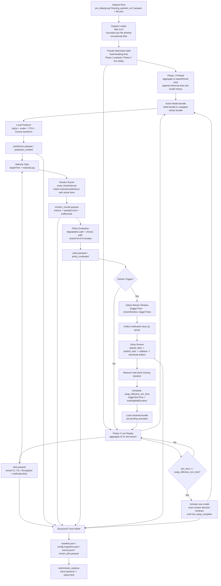

# NWDAF Fast Retrain Replay Tool Design

## 1. 背景與目標

目前端到端測試需要整個 testbed 長時間運行：

- `go-upf` / EES 每 `5s` 持續送出流量通知
- NWDAF 經過 AnLF 推論、Accuracy Monitor、MTLF retrain policy
- Daisy 完成訓練後再 callback / hot-swap
- 最後再另外用 `tools/retrain_analysis` 解析 log

這條路徑很接近正式系統，但驗證成本高，尤其對下列問題不友善：

- retrain policy 門檻調整
- cold-start / chronic path 行為驗證
- 新模型是否真的改善
- 同一份 dataset 在不同 config / model / training setup 下的快速重跑比較

因此需要一個新的 **快速重播 / 模擬工具**：

- 一次讀入整份 dataset
- 直接在本地完成流量重播、模型推論、accuracy monitoring、retrain policy evaluation
- 在 trigger 點啟動 Daisy 07 的真實訓練流程
- 量測真實訓練耗時，並把其結果映射回 dataset timeline
- 產生結構化 trace 與 HTML 報表

此工具的定位是 **offline experiment harness**，不是正式 runtime path。

---

## 2. 參考現有邏輯

### 2.1 Dataset / replay 來源

`go-upf` EES 目前的 warm-start / replay 來源在：

- `.agent/go-upf/pre_data/<group>/training_packets_run001.parquet`
- `.agent/go-upf/pre_data/<group>/file.json`
- 相關 replay 邏輯：`.agent/go-upf/internal/ees/pseudodriver.go`

已確認的重要行為：

- Parquet replay 只依賴少數欄位：`ts`, `direction`, `len`, `action`, `ue_ip`
- `file.json` 目前至少包含：
  - `breaking time`
  - `total_duration_seconds`
- Pseudo driver 會把 packet-level 資料聚合成 subscription `reportPeriod` 對應的時間窗
- 這些時間窗最後會被整理成 TS 29.564 形式的 notification payload

對新 tool 的意義：

- 新工具應直接讀 `pre_data`，不經過 `go-upf`
- 但聚合後的結果必須和 EES notification 語意一致，否則 Daisy 07 與監控指標都會偏掉

### 2.2 推論邏輯來源

目前 UE Communication 推論分成兩段：

- NWDAF AnLF：`internal/anlf/analytics.go`
- ML Service：`.agent/NWDAF-ML-Service`

已確認的重要行為：

- 實際輸入特徵固定為 10 維：
  - `total_vol`, `ul_vol`, `dl_vol`
  - `total_nb_pkts`, `ul_nb_pkts`, `dl_nb_pkts`
  - `ul_thr`, `dl_thr`, `ul_pkt_thr`, `dl_pkt_thr`
- 預設 `input_window=30`
- 目前 NWDAF config 的 `out_seq_len=1`
- predictor 會做：
  - `log1p`
  - `StandardScaler`
  - TCN forward
  - inverse scale + `expm1`
- 目前 ML Service bundle loading 由 `model_manager.py` 處理，支援：
  - `config.json`
  - `model.npy`
  - `scaler.pkl`
  - `model.py`

對新 tool 的意義：

- 新工具可以直接重用同一套 bundle loading 與 predictor 邏輯
- 不需要再經過 HTTP `POST /predict`
- 初始模型與 retrain 後模型都應以同樣的本地 bundle contract 載入

### 2.3 Accuracy monitoring / retrain policy 來源

目前監控與 retrain decision 的核心在：

- `internal/anlf/monitor.go`
- `internal/mtlf/trigger.go`

已確認的重要行為：

- monitor round 不是每個 prediction 都立刻判定，而是每 `checkInterval` 批次檢查
- prediction 需要成熟後才納入比對；目前 runtime 使用 `ConsumeMaturePredictions(2 * samplingInterval)`
- per-scope accuracy report 目前產出：
  - `Metrics`
  - `TrafficScale`
  - `SampleCount`
  - `InferenceNum`
  - `WindowStart / WindowEnd`
- metric 語意目前為：
  - `MAE` / `MSE`：UL 與 DL 視為等權 channel，直接平均
  - `WAPE`：`sum(abs(err)) / sum(abs(actual))`
  - `NRMSE`：`sqrt(MSE) / mean(abs(actual))`
  - `TrafficScale`：`mean(abs(actual))`，單位是 bytes per channel observation
- retrain policy 目前包含：
  - degradation path：`fixedFloor` + `zScoreThreshold`
  - chronic path：`metric / aggregator / threshold / minTrafficScale`
  - shared `M-of-N` decision window
- cold-start 語意目前為：
  - `zscore` / `chronicValue` 持續計算
  - `degradationSignal` / `chronicSignal` 在 `baselineReady=false` 時標為 `skipped`
  - decision hit 不累積

對新 tool 的意義：

- 這些邏輯必須被高保真重現
- v1 可以用 Python 實作 mirror policy，但必須以目前 Go 行為作為單一事實來源

### 2.4 Daisy retrain 流程來源

目前 Daisy 相關主要有兩條路：

- 07 example 的 file-based training：`.agent/daisy/examples/07_MTLF_training`
- NWDAF 現行 retrain workflow 的 upload / async publish path：
  - `.agent/daisy/src/py/daisyfl/master/server_api_handler.py`
  - `internal/mtlf/training.go`

已確認的重要行為：

- Daisy 07 dataset parser 可以吃兩種來源：
  - `data_dirs` 下的 `training_notifications_runXXX.json`
  - Mongo `daisy_mtlf.training_data` by `tid` + `group_id`
- `/upload_data` 會把每筆 notification document 存入 Mongo
- `/publish_task` 會依 `tid` 找出所有 `group_id`，自動 spawn Daisy clients
- `/download/<tid>` 可下載 artifact tarball
- NWDAF 現行 async training lifecycle 為：
  - trigger retrain
  - submit Daisy task
  - training complete callback
  - hot-swap

對新 tool 的意義：

- 若希望在同一次 replay 內多次 retrain，**Mongo / `tid` 路徑比 file-based path 更適合**
- 因為每次 retrain 的 training window 都會不同，不適合靠靜態 `data_dirs` 重開一套資料目錄

---

## 3. 設計目標

### 3.1 必須達成

1. 不啟動 `go-upf` 與 `NWDAF-ML-Service`，直接本地讀資料與推論
2. 高保真重現目前 NWDAF 的：
   - prediction cadence
   - accuracy monitor cadence
   - metrics semantics
   - retrain policy
3. retrain 時仍呼叫 Daisy 07 的真實訓練流程
4. 量測 Daisy 真實 wall-clock 訓練時間
5. 在 dataset timeline 上標記：
   - monitor rounds
   - policy signal
   - retrain trigger
   - training start / done
   - model swap effective time
6. 產生結構化 trace，供 HTML renderer 直接讀取

### 3.2 明確不做

- 不取代正式 NWDAF runtime
- 不模擬完整 SBI / subscription / callback server
- 不要求和正式 log 逐字一致
- 不在 v1 支援所有 analytics 類型；只支援 `UE_COMMUNICATION`

---

## 4. 推薦工具形狀

推薦新增一個獨立 Python 工具目錄，例如：

```text
tools/retrain_replay/
  pyproject.toml
  README.md
  retrain_replay.py
  replay_core/
    dataset_loader.py
    ees_windowing.py
    local_model.py
    metrics.py
    policy.py
    daisy_runner.py
    trace_writer.py
  report/
    trace_report.py
```

CLI 建議至少分兩個子命令：

```bash
uv run retrain_replay.py run ...
uv run retrain_replay.py report ...
```

其中：

- `run`：執行 replay + retrain simulation，輸出 trace
- `report`：把 trace 渲染成 HTML

也可保留和現有 `tools/retrain_analysis` 的整合，讓現有報表工具新增一個 `trace input` backend。

### 4.1 常用指令

在 `tools/retrain_replay/` 目錄：

```bash
uv run retrain_replay.py run \
  --dataset-root ../../.agent/go-upf/pre_data \
  --config ../../.agent/tmp/nwdafcfg.yaml \
  --replay-config ./replay_config.yaml \
  --initial-bundle ../../.agent/NWDAF-ML-Service/artifacts/initial \
  --daisy-example-dir ../../.agent/daisy/examples/07_MTLF_training \
  --out ../../.agent/tmp/replay-test
```

只驗證 policy / trace，不啟動 Daisy：

```bash
uv run retrain_replay.py run \
  --dataset-root ../../.agent/go-upf/pre_data \
  --config ../../.agent/tmp/nwdafcfg.yaml \
  --replay-config ./replay_config.yaml \
  --initial-bundle ../../.agent/NWDAF-ML-Service/artifacts/initial \
  --daisy-example-dir ../../.agent/daisy/examples/07_MTLF_training \
  --out ../../.agent/tmp/replay-test \
  --skip-daisy
```

在 `tools/retrain_analysis/` 目錄產生報表：

```bash
uv run retrain_report.py \
  --input ../../.agent/tmp/replay-test \
  --out ../../.agent/tmp/replay-test/report.html
```

---

## 5. 核心執行流程

### 5.0 E2E 流程圖



### 5.1 輸入

建議 `run` CLI 至少支援：

```bash
uv run retrain_replay.py run \
  --dataset-root .agent/go-upf/pre_data \
  --groups group1 group2 \
  --config .agent/tmp/nwdafcfg.yaml \
  --replay-config tools/retrain_replay/replay_config.yaml \
  --initial-bundle .agent/NWDAF-ML-Service/artifacts/initial \
  --daisy-example-dir .agent/daisy/examples/07_MTLF_training \
  --out .agent/tmp/replay-test
```

可選參數：

- `--max-slots`
- `--start-offset-sec`
- `--retrain-window-sec`（override config）
- `--sim-report-period-sec`
- `--skip-daisy`
- `--reuse-existing-daisy`

設定來源分工建議如下：

- `config/nwdafcfg.yaml`
  - 正式 NWDAF / MTLF / Daisy task 已存在的設定
- `replay_config.yaml`
  - replay tool 專用的資料粒度、重播控制、retrain 實驗控制、報表輸出控制

原則上，凡是與 retrain 實驗流程或 UPF 回報資料粒度相關的設定，都應集中由
config 管理，而不是散落成硬編碼常數或大量 CLI flag。

### 5.2 前處理：把 Parquet 轉成 EES 等價時間窗

每個 `group` 目錄：

1. 讀 `file.json`
2. 讀 `training_packets_run*.parquet`
3. 依 `reportPeriod` 聚合成固定時間窗
4. 輸出 group-level slot stream

每個 slot 至少保留：

- `datasetTimeSec`
- `slotStart`
- `slotEnd`
- `groupId`
- `ulVol`, `dlVol`
- `totalVol`
- `ulPkts`, `dlPkts`
- `ulThr`, `dlThr`
- `ulPktThr`, `dlPktThr`
- 對應 notification payload

建議直接在 replay 工具內產生與 Daisy dataset parser 相容的 notification document：

```json
{
  "notificationItems": [...],
  "correlationId": "replay_group1_slot_000123"
}
```

這樣同一份中介資料可以同時供：

- 本地 predictor 使用
- Daisy `/upload_data` 使用
- trace/debug 使用

### 5.3 本地推論

工具啟動時先載入初始模型 bundle。

每個 group 維護：

- 最近 `input_window` 個 slot 的 10 維觀測
- 目前 active model version

當歷史窗足夠時：

1. 以 ML Service 同等 preprocessing + predictor 執行推論
2. 產生下一個 slot 的 `predUl/predDl`
3. 記錄 prediction record

建議 prediction record 至少保留：

- `predictedAtSimTime`
- `targetSimTime`
- `groupId`
- `scope=group:<groupId>`
- `modelVersion`
- `modelBundlePath`
- `predUl`, `predDl`
- `confidence`

### 5.4 Monitor round 與 maturity

為了貼近 runtime 行為，不能在每個 slot 立刻做 decision。

建議 mirror 現行邏輯：

- sampling interval 由 config `analytics.ueCommunication.samplingInterval`
- prediction maturity 規則預設採 `targetTime + 2 * samplingInterval`
- `monitor.maturity_lag_sec` 可覆寫這個成熟延遲
- monitor cadence 採 `accuracyMonitor.checkInterval`
- 每個 monitor round 只消費已成熟、且尚未被消費的 predictions

offline replay 中，不需要真的等時間流逝，但要維持同樣的 **虛擬時間規則**。

### 5.5 Accuracy report 建立

每個 monitor round 針對每個 scope 建立與 `anlf.AccuracyReport` 等價的物件：

- `Metrics`
- `TrafficScale`
- `SampleCount`
- `InferenceNum`
- `WindowStart / WindowEnd`

v1 建議 scope 先固定為：

- `group:<groupId>`

因為目前 `pre_data` 與 Daisy 07 的資料流本來就是 group aggregate 導向。

另外需注意：

- `minSamples` gate 應比照 NWDAF runtime，以 **整個 monitor round 的成熟 pair 總數** 判斷
- per-scope `SampleCount` 仍各自記錄在 report 內
- 不能把 `minSamples` 錯套成每個 scope 各自判斷，否則會和真實 NWDAF 觸發條件不一致

### 5.6 Retrain policy 評估

對每個 report 套用與 `internal/mtlf/trigger.go` 等價的 decision flow：

- record metric history
- compute `mean/std/zscore`
- compute `trafficScale/chronicValue`
- evaluate degradation path
- evaluate chronic path
- update per-path decision window
- emit retrain trigger if hit threshold

這一層要輸出的不是字串 log，而是結構化 policy record。

目前實作語意還包含：

- monitor round 在 retrain / pending swap 期間仍持續記錄
- 但 policy evaluation 會在 `retraining_until` 之前暫停
- 因此 `monitor_rounds.parquet` 可能連續，但 `policy.parquet` 會在 retrain 期間出現刻意保留的空窗

每筆 policy record 建議至少保留：

- `simTime`
- `groupId`
- `scope`
- `modelVersion`
- `primaryMetric`
- `current`, `mean`, `std`, `zscore`
- `baselineReady`
- `degradationEligible`
- `degradationSignal`
- `trafficScale`
- `chronicEligible`
- `chronicSignal`
- `chronicValue`
- `degradationHits`, `degradationRequired`
- `chronicHits`, `chronicRequired`
- `hitReason`

### 5.7 Daisy retrain 啟動

一旦某 model 觸發 retrain：

1. 決定 retrain data window
2. 依 group 切出該 window 的 notification docs
3. 產生新的 `tid`
4. 呼叫 Daisy：
   - `/upload_data`
   - `/publish_task`
5. 記錄 wall-clock `training_started_at`
6. 等待 callback 回傳訓練結果並取得 artifact

與這個流程相關的控制項，應統一來自 config，至少包含：

- retrain data window
- upload batch size
- publish timeout
- Daisy lifecycle mode
- slot/report period 粒度
- chart / trace downsampling 粒度

### 5.8 Daisy training window 選型

推薦 v1 採 **Mongo / TID upload path**，而不是臨時產生 `data_dirs`。

理由：

- 可自然支援多次 retrain
- 每次 retrain window 不需要重建整個 example 目錄
- 與 NWDAF 現行 `ADRF -> Daisy upload -> publish_task` 路徑更接近

每次 retrain 時，tool 應把 replay 過程中已產生的 notification docs 依 group 上傳：

- `tid=<job tid>`
- `group_id=<group>`
- `data=[notification_doc, ...]`

### 5.9 訓練完成與模型切換

訓練完成後需要得到：

- `artifact_url` 或本地 artifact path
- `training_wall_duration_sec`

接著定義：

```text
swap_effective_sim_time = retrain_trigger_sim_time + training_wall_duration_sec
```

這樣做的理由是：

- replay 本身不以 real time 速度前進
- 但我們仍需要把真實訓練耗時投影回 dataset timeline
- runtime 語意上訓練期間舊模型仍持續服務，因此新模型不能在 trigger 當下立刻生效

因此建議流程為：

1. retrain trigger 發生時先記錄 trigger event
2. 等待 Daisy callback 回傳 `model_url` 與完成狀態，拿到 `duration_sec`
3. 在 trace 中建立一筆 scheduled swap event
4. replay 後續 slot 時，直到 `sim_time >= swap_effective_sim_time` 才切到新模型

這比單純「訓練時暫停 replay」更貼近 runtime。

---

## 6. Structured Trace 格式

新的 replay 工具不應再以 free-form log 作為 canonical output。

建議 output directory 例如：

```text
.agent/tmp/replay-20260428-01/
  manifest.json
  config.snapshot.yaml
  slots.parquet
  predictions.parquet
  monitor_rounds.parquet
  policy.parquet
  retrain_jobs.parquet
  events.jsonl
  report.html
```

### 6.1 `manifest.json`

記錄整體 run metadata：

- command line
- source dataset root / groups
- config path
- initial bundle
- daisy example dir
- run started / finished
- total slots
- total retrains
- report period / sampling interval / check interval

### 6.2 `slots.parquet`

每個 group 每個 slot 一列：

- `simTime`
- `groupId`
- `slotStart`, `slotEnd`
- `actualUl`, `actualDl`
- `actualTotal`
- `actualUlPkts`, `actualDlPkts`
- `actualUlThr`, `actualDlThr`
- `actualUlPktThr`, `actualDlPktThr`
- `notificationDocId`

### 6.3 `predictions.parquet`

- `predictedAtSimTime`
- `targetSimTime`
- `groupId`
- `scope`
- `modelVersion`
- `modelSource`
- `predUl`, `predDl`
- `confidence`
- `matchedActualUl`, `matchedActualDl`
- `maturedAtSimTime`

### 6.4 `monitor_rounds.parquet`

- `simTime`
- `modelVersion`
- `scope`
- `sampleCount`
- `inferenceNum`
- `windowStart`
- `windowEnd`
- `metricsJson`
- `trafficScale`

### 6.5 `policy.parquet`

欄位沿用 §5.6。

這份表是 report 的主資料源，不需要再反 parse log。

### 6.6 `retrain_jobs.parquet`

- `jobId`
- `triggerSimTime`
- `reason`
- `scope`
- `modelVersionBefore`
- `trainingDataStart`
- `trainingDataEnd`
- `daisyTid`
- `trainingWallStart`
- `trainingWallEnd`
- `trainingWallDurationSec`
- `swapEffectiveSimTime`
- `artifactLocation`
- `modelVersionAfter`
- `status`

### 6.7 `events.jsonl`

保留人類可讀、但仍具結構化欄位的 event stream。

目前實作欄位為：

- `timestamp`
- `eventType`
- `model`
- `scope`
- `reason`
- `detail`

目前主要 event types：

- `prediction_emitted`
- `monitor_round`
- `policy_evaluated`
- `retrain_trigger`
- `training_accepted`
- `training_complete`
- `hot_swap_complete`

### 6.8 可選：synthetic log

若需要和現有 `tools/retrain_analysis` 保持暫時相容，可選擇額外輸出：

```text
synthetic_nwdaf.log
```

但這應只是 compatibility export，不是 canonical source。

---

## 7. HTML 報表方向

### 7.1 報表不應重新 parse 文字 log

對 replay tool 來說，報表應直接讀 structured trace。

### 7.2 與現有 `tools/retrain_analysis` 的關係

已定案：

- 報表產生以 `tools/retrain_analysis` 為主
- `tools/retrain_analysis` 需新增 `TraceBackend`
- 新 replay tool 不再維護一套獨立的 HTML renderer 主流程

因此推薦拆法改為：

- `tools/retrain_replay`
  - 負責 replay、local inference、policy mirror、Daisy 整合、structured trace 輸出
- `tools/retrain_analysis`
  - 保留既有 `LogBackend`
  - 新增 `TraceBackend`
  - 對 log 與 trace 提供盡量一致的視覺化語意與區塊排列

### 7.3 報表至少應有的區塊

1. Experiment summary
2. Dataset / model / config metadata
3. Slot-level actual traffic
4. Actual vs predicted traffic
5. Metric time series
6. Policy timeline
7. Decision-window hit timeline
8. Retrain job timeline
9. Model version timeline
10. Trigger explanation table

比起現有 log parser，新的 trace report 還可以多畫：

- `trainingWallDurationSec` 分布
- retrain 前後固定 horizon 的效果比較
- model version 在各 group 上的覆蓋區間

---

## 8. Daisy 整合策略

### 8.1 v1 推薦模式

v1 已定案：工具 **自動管理 Daisy example 的 lifecycle**：

- 若未發現現成 Daisy master，先在 `07_MTLF_training` 目錄啟動 master
- retrain 時以 `/upload_data` + `/publish_task` 執行
- 完成後可視設定決定是否保留 Daisy process

理由：

- 對實驗者最省事
- 可確保每次 replay run 的 Daisy 狀態乾淨

### 8.2 callback 需求

目前已定案並落地的方式是：

- replay tool 內建最小本地 callback receiver
- `publish_task` 帶 `CALLBACK_URL`
- Daisy 透過 async callback 回傳 `task_id / status / model_url`
- replay tool 再依 callback 回來的 `model_url` 下載 artifact

理由：

- Daisy artifact packaging 實際依賴 callback workflow
- 這條路徑和 NWDAF 現行 async training lifecycle 更一致
- 可避免 sync publish path 完成後 artifact 尚未可下載的競態問題

---

## 9. 實作建議階段

### Phase 1: 純 replay + local inference + policy

先不接 Daisy，只完成：

- Parquet -> slot stream
- local model inference
- monitor / policy mirror
- structured trace
- report

這一階段可先用 `--skip-daisy` 驗證：

- metrics 是否合理
- policy trigger 點是否接近真實 NWDAF
- trace schema 是否足夠

### Phase 2: Daisy async callback retrain

補上：

- `/upload_data`
- `/publish_task`
- `/download/<tid>`
- artifact loading
- model swap schedule

### Phase 3: parity validation

拿既有真實實驗資料做對照，確認：

- trigger 次數
- trigger 時間點
- chronic / degradation path 判定
- swap 後走勢

### Phase 4: report consolidation

整理成：

- 可直接閱讀的 HTML
- 可供後續 notebook / pandas 使用的 Parquet trace

---

## 10. 風險與注意事項

### 10.1 Python policy mirror 與 Go policy 漂移

這是最大風險。

應對方式：

- 明確以 `internal/anlf` / `internal/mtlf` 為單一語意來源
- 為 metric 與 policy 寫 parity fixture tests
- 一旦 Go policy 有變更，replay tool 也必須同步更新

### 10.2 Daisy training duration 與 simulated timeline 的映射

若處理不當，會讓 replay 的 swap 點毫無意義。

本設計採：

- 真實量測 wall-clock training duration
- 投影回 simulated timeline

這是目前最合理、也最容易解釋的方式。

### 10.3 group scope 與 future SUPI scope

目前 dataset 與 07 training 基本上是 group aggregate 導向。

因此 v1 應先只保證：

- `scope = group:<groupId>`

若未來要驗證更細粒度 scope，再另外擴充。

### 10.4 report 與 trace schema 穩定性

新工具一旦開始產生 structured trace，就應把 schema 視為半正式契約。

否則後面 HTML renderer 會一直被打破。

---

## 11. 建議的 v1 決策

1. 新工具使用 Python + `uv`
2. 直接讀 `.agent/go-upf/pre_data`
3. 直接重用 ML Service 的本地 model bundle / predictor 邏輯
4. MTLF policy 先以 Python mirror 方式重現
5. Daisy retrain 採 07 example 的 **Mongo/TID path**
6. Daisy v1 採 **async callback + 本地 callback receiver**
7. canonical output 採 **Parquet/JSONL structured trace**
8. HTML / 報表產生以 `tools/retrain_analysis` 為主，新增 trace backend
9. v1 scope 固定只做 `group:<groupId>`
10. initial model 固定直接讀本地 bundle path，不經過 HTTP model load
11. 所有 retrain 相關與 UPF 回報資料粒度相關控制項，統一由 config 管理

---

## 12. Replay Config 設計補充

新增：

```text
tools/retrain_replay/replay_config.yaml
```

用來集中管理 replay tool 專用控制項，以及覆寫部分既有 NWDAF 設定。

建議欄位：

```yaml
dataset:
  groups: [group1, group2]
  report_period_sec: 5
  start_offset_sec: 0
  max_slots: null
  use_pseudo_warmstart: true
  breaking_time_sec: null

monitor:
  check_interval_sec: null
  maturity_lag_sec: null

retrain:
  window_sec: null
  upload_batch_size: 500
  max_concurrent_jobs: 1
  swap_effective_mode: wall_duration_projection
  mock_training_duration_sec: 120

daisy:
  auto_manage: true
  reuse_existing: false
  python_bin: python3.8
  publish_timeout_sec: 3600
  callback_host: 127.0.0.1
  callback_port: null

report:
  progress_every_slots: 120
  chart_downsample: null
  emit_synthetic_log: false
```

欄位原則：

- `dataset.groups`
  - 指定要納入 replay 的 dataset groups；未指定時，自動掃描 `dataset-root` 下的子目錄
- `dataset.report_period_sec`
  - 控制 packet 聚合到 slot 的時間粒度
- `dataset.start_offset_sec`
  - 從正規化後的 dataset timeline 起點往後跳過前 N 秒，再開始建立 slot
- `dataset.max_slots`
  - 限制每個 run 最多載入多少個 slot，方便做短時間 smoke test 或局部除錯
- `dataset.use_pseudo_warmstart`
  - `true` 時比照 pseudo driver，依 `breaking time` 先做 Phase 1 preload，再開始 Phase 2 live replay
- `dataset.breaking_time_sec`
  - `null` 時讀各 group 的 `file.json`
- `monitor.check_interval_sec`
  - `null` 時沿用 `nwdafcfg.yaml` 的 `accuracyMonitor.checkInterval`
- `monitor.maturity_lag_sec`
  - `null` 時沿用目前 runtime 語意：`samplingInterval * 2` 的成熟消費視窗規則
- `retrain.window_sec`
  - `null` 時沿用 `nwdafcfg.yaml` 的 `adrf.retrainWindow`
- `retrain.upload_batch_size`
  - Daisy `/upload_data` 每次上傳的 notification docs 批次大小；資料窗很大時可避免單次 payload 過大
- `retrain.max_concurrent_jobs`
  - 預留的併發 retrain 控制欄位；目前實作仍以單一 active retrain job 為主，尚未真正啟用多 job 排程
- `retrain.swap_effective_mode`
  - 控制新模型在 simulated timeline 上何時生效；目前實作固定等同 `wall_duration_projection`
  - `wall_duration_projection` 的意義是：`swap_effective_sim_time = trigger_time + training_wall_duration_sec`
- `retrain.mock_training_duration_sec`
  - `--skip-daisy` 時用於 mock retrain lifecycle 與 swap 投影
- `daisy.auto_manage`
  - `true` 時由 replay tool 自動啟動 Daisy master；`false` 時要求外部 Daisy endpoint 已先可用
- `daisy.reuse_existing`
  - `true` 時若偵測到 endpoint 已可連通，直接沿用既有 Daisy，不重啟 master
- `daisy.python_bin`
  - 指向 Daisy 專用 Python interpreter，可與 replay tool 自身的 Python 環境分離
- `daisy.publish_timeout_sec`
  - Daisy task publish、callback 等待、artifact download 共用的逾時上限
- `daisy.callback_host` / `daisy.callback_port`
  - 控制本地 callback receiver 的綁定位址
- `report.progress_every_slots`
  - terminal progress log 的週期；每處理多少個 live slots 印一次進度摘要
  - 這只影響 console 可見性，不影響 trace 或報表內容
- `report.chart_downsample`
  - 控制長時間 replay 的圖表降採樣
- `report.emit_synthetic_log`
  - 預留的 compatibility export 欄位；目前主要 trace 消費路徑仍以 `manifest/parquet/events.jsonl` 為主，未作為常態輸出

整體原則是：

- runtime 已有正式語意的設定，優先從 `nwdafcfg.yaml` 讀
- replay tool 獨有的實驗控制項，放在 `replay_config.yaml`
- 若 `replay_config.yaml` 有 override，需在 trace manifest 與 report summary 中明確記錄
