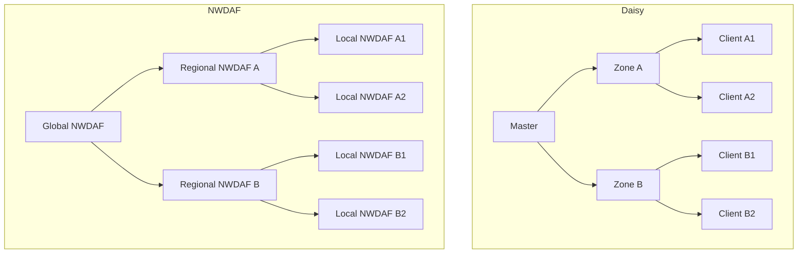
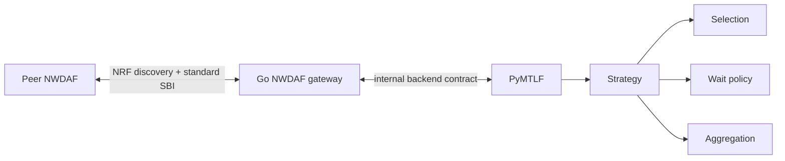

# Daisy 能力重用與 Hierarchical NWDAF FL 設計

## 1. 文件目的

本文件從high-level角度回答三個問題：

1. Daisy已經有哪些能力可用於hierarchical FL？
2. 這些能力搬入NWDAF／PyMTLF後，分別解決什麼問題？
3. 哪些Daisy設計只能作為類比，不能直接取代3GPP NWDAF機制？

核心結論是：

> 重用Daisy的FL控制概念與政策抽象；保留NWDAF既有的NRF discovery、標準SBI、
> Model Provision、Model Monitor與ML Model Training lifecycle。

Daisy不是要部署在NWDAF旁邊的另一套網路，也不是要用它的gRPC連線取代SBI。
它主要提供PyMTLF尚缺少的hierarchical orchestration與可替換training policy參考。

## 2. Daisy與NWDAF架構的類比

Daisy已有Master–Zone–Client三層hierarchical example，可以用下列方式理解本情境：

| Daisy | Hierarchical NWDAF | 共同責任 |
| --- | --- | --- |
| Master | Global NWDAF | 協調上層round、整合各region結果 |
| Zone | Regional NWDAF | 對下協調Local、對上回傳一份regional result |
| Client | Local NWDAF | 使用local dataset進行training／evaluation |



這個類比只用來理解**協調與聚合責任**，不能推導其他語意。Daisy的Master、Zone、
Client是不同runtime/component types；Global、Regional、Local則是相同NWDAF
type依部署狀態與個別FL process扮演不同角色。Daisy的child是否知道Master、使用
哪個task ID或如何連parent，都不能直接當作3GPP NWDAF的規格解讀。

## 3. Daisy已有的可重用能力

### 3.1 Strategy-independent control

Daisy將一輪FL拆成三類政策責任：

- 從目前可用participants中選擇本輪對象，並產生training／evaluation工作；
- 決定要等到什麼條件才結束本輪；
- 將已收到的model或evaluation results聚合成下一個狀態。

因此「FL Server」不等於「FedAvg」。Server負責維護process與round，而strategy
決定selection、wait與aggregation。換strategy時，不必把整條participant通訊與
model lifecycle重寫一次。

搬入PyMTLF後，可形成下列分工：

```text
PyMTLF process state
  -> 提供本輪模型、participants與round context
  -> 所選strategy決定selection、wait與aggregation
  -> PyMTLF透過本地NWDAF gateway執行標準peer operation
  -> callback回到PyMTLF所維護的process／round
```

NWDAF Go gateway仍負責HTTP/SBI、NRF互動、resource與callback routing；PyMTLF
才是FL process、round、policy、aggregation與artifact state的owner。

### 3.2 Participant pool與filtering

Daisy的participant manager維護已連線、可用、忙碌或失效的clients，並允許在
sampling前套用criterion。可重用的是「inventory與每輪selection分開」的概念：

```text
Process preparation
  -> 建立可參與此process的participant inventory

Each round
  -> strategy從inventory中的available participants選擇本輪對象
```

在NWDAF情境中，inventory來源不使用Daisy private registration。每一層FL Server
先從active Model Monitor owners取得與受影響model／scope相關的NWDAFs，再以
NRF discovery驗證Analytics ID、serving area、FL capability與service endpoint，
最後透過FL preparation固定該process可用的participants。

之後不需要每輪重新對NRF搜尋同一批clients。某一輪沒在等待門檻前回覆，也不等於
永久踢除；下一輪仍可從原inventory重新選擇。只有NF status、真正join／leave或
inventory失效時，才需要執行額外refresh／reselection。

### 3.3 Hierarchical round control

Daisy的hierarchical example已具備Master與Zone分層執行的控制概念：Zone先在
children間執行local rounds，形成一份zone result，再和其他Zones一起參與Master
aggregation。Master與Zone可以有不同的communication frequency與strategy。

在NWDAF中的對應行為是：

```text
Global發起upper-tier round
  -> Regional發起或續行自己的lower-tier process
  -> Local回傳local result
  -> Regional聚合為一份regional result
  -> Regional以upper-tier FL Client身分回覆Global
  -> Global聚合Regional results
```

可重用的是outer／inner round orchestration、完成條件與上行結果形成方式。Daisy
原本的task distribution、process topology與network connection不直接搬入。

### 3.4 Sample-count weighted aggregation

Daisy的FedAvg以每個result的data sample count加權，聚合後也把sample counts加總。
這正好對應hierarchical FedAvg需要保留的數學語意。

例如：

```text
Local-A1 = 30 samples
Local-A2 = 40 samples

Regional-A result = aggregate(A1, A2)
Regional-A effective sample count = 70
```

Global必須以Regional-A代表的70筆與其他Regional的effective sample count再做
加權。若Regional只回傳一個model卻沒有它代表的總sample count，上層FedAvg就不再
等價於對所有Local results進行sample-weighted aggregation。

核心情境中的Regional是pure aggregator，不加入自己的dataset contribution。
`FL_SERVER_AND_CLIENT`表示它可在不同process中對下為Server、對上為Client，並不
要求它必須另做regional local training。

### 3.5 Partial-result waiting與FedAsync

Daisy現有同步FedAvg可把「本輪要求幾個clients」與「至少收到幾個成功results」
分開。經過minimum waiting time後，只要達到minimum-results門檻，就可以結束等待
並聚合，不必永遠等到所有participants回覆。這接近目前所考慮的quorum行為：

```text
send to selected clients
  -> wait at least a configured interval
  -> enough successful results: aggregate current results
  -> the next round still starts from the process inventory
```

Daisy也有FedAsync，但它不是「每收到一份update就立即完成一次global update」的
純event-driven實作。現有設計較接近time-window／batched async：向available
clients派送工作、等待固定時間，再聚合目前取得的results；同時保留有限數量的舊
subtasks，使較晚結果可以依`server_round - client_round`計算staleness，再用decay
降低影響。超過保留範圍的舊subtask才會被結束。

因此Daisy提供兩種可參考方向：

- synchronous FedAvg加minimum-results門檻；
- time-window FedAsync加staleness weighting。

目前文件只列出能力，不預先決定E2E情境最後採用哪一種。3GPP本身也允許FL Server
逐份更新、等待全部results，或在maximum response time後使用已收到的results；
具體policy屬於implementation choice。

### 3.6 Configuration-driven replacement

Daisy的Master與Zone可以在task configuration中分別指定strategy、operator與
metrics handling。這表示同一個hierarchical control flow可以替換不同政策，例如：

| Upper tier | Lower tier | 可表達的行為 |
| --- | --- | --- |
| synchronous FedAvg | synchronous FedAvg | 最接近現有baseline的hierarchy |
| synchronous FedAvg | quorum／partial-result | Local有straggler時不等待所有results |
| synchronous FedAvg | FedAsync | lower tier允許time-window與staleness處理 |
| quorum／partial-result | synchronous FedAvg | upper tier容許部分Regional按時完成 |

在PyMTLF中可以沿用configuration-driven選擇，但應採受控的strategy registry，並
驗證artifact、parameters與result contract；不能直接把任意module path當成外部
SBI輸入。

## 4. 放入NWDAF後的完整責任分工

### 4.1 Global

Global持有可發布的model，接收Regional monitor，判斷degradation，並成為
upper-tier FL Server。它只把Regional視為自己的FL Clients，不需要知道每份
regional result內部是由哪些Local training results聚合而成；若aggregation policy
需要effective sample count，Regional再以內部artifact metadata提供必要資訊。

### 4.2 Regional

Regional是hierarchy新增的核心：

- 對analytics lifecycle：聚合兩個Local scopes的analytics；
- 對Model Provision：向Global取model，同時向Local供應model；
- 對Model Monitor：接收Local observations，產生regional monitor回報Global；
- 對FL：對下為Server，對上為Client；
- 對validation：把Global要求向Local傳遞，再把results逐層聚合回去。

Regional收到upper-tier training request後，不能只執行自己的local trainer。它必須
先完成或推進lower-tier process，取得child results並聚合，之後才能形成一份對
Global有效的FL Client result。這正是Daisy Zone control最值得參考的部分。

### 4.3 Local

Local沿用現有FL Client大部分行為：在preparation階段建立local dataset snapshot，
在各round使用該snapshot進行training，回傳model result與sample count，並在
validation階段提供local result。每輪不重新從ADRF抓取整份dataset。

### 4.4 Go NWDAF與PyMTLF



Go NWDAF不是training strategy owner。它對外呈現標準NWDAF identity與service，
並把request／callback交給正確backend process；PyMTLF維護實際的FL邏輯狀態。

## 5. 不應直接搬用的Daisy設計

| Daisy設計 | 不直接使用的原因 | NWDAF替代方式 |
| --- | --- | --- |
| Master／Zone／Client gRPC topology | 會形成另一套NWDAF間私有傳輸 | `Nnwdaf_MLModelTraining`與既有標準SBI |
| `parent_address` | 把parent固定成private endpoint | NRF discovery加標準selection |
| Daisy client registration／discovery | 不含NWDAF capability與serving-area語意 | NF profile、NRF discovery與FL preparation |
| Daisy task API與task identity | 不等同3GPP FL process resource | 各層獨立標準process與內部correlation |
| Master／Zone／Client type assumptions | NWDAF instances是同一NF type | 依deployment與per-process role決定行為 |
| Daisy dataset transport | 現有dataset lifecycle已經由ADRF與PyMTLF建立 | 沿用現有preparation snapshot |

## 6. 多個FL processes與識別

Hierarchy不是一個跨全樹的單一標準FL process，而是三個relationships：

```text
Global process:     Global -> Regional-A, Regional-B
Regional-A process: Regional-A -> Local-A1, Local-A2
Regional-B process: Regional-B -> Local-B1, Local-B2
```

每個process各自建立標準resource、subscription與correlation context。文件不假設
全樹共用同一個`mlCorreId`，也不假設`mlCorreId`在所有NWDAFs之間具有規格保證的
global uniqueness；Release 18沒有定義hierarchy，也沒有定義如何跨process組成
parent／child關係。PyMTLF需維護最小內部mapping，讓Regional知道一個upper-tier
round應由哪個lower-tier process與哪組results完成。

這項mapping是backend orchestration state，不應創造新的NWDAF-to-NWDAF API，
也不能從Daisy的task ID或parent visibility直接推導。

## 7. 現有PyMTLF與主要缺口

現有flat baseline已具有server round、client local training、sample-weighted FedAvg、
validation、publication與model cutover lifecycle，但尚未具備完整Regional行為：

| 缺口 | Daisy可提供的參考 | NWDAF-specific工作 |
| --- | --- | --- |
| Server／Client runtime目前互斥 | Zone同時承接上下層control | 讓同一PyMTLF runtime維護多個per-process roles |
| Participant、wait、aggregation耦合在流程內 | Strategy abstraction | 保留現有baseline為一個strategy，建立可替換boundary |
| 無nested lower-tier lifecycle | Master–Zone–Client orchestration | 對接多個標準FL processes與callback correlation |
| 無effective sample propagation | FedAvg sample-count sum | 定義Regional result代表的有效sample count |
| 無跨層validation | hierarchical evaluate／metrics aggregation | 定義Regional validation completion與上行result |
| 無Model Provision雙向lifecycle | Daisy沒有對應標準service | 由NWDAF／PyMTLF依TS 23.288 §6.2A補足 |
| 無Regional monitor aggregation | Daisy沒有對應標準service | 由PyAnLF／NWDAF以標準monitor欄位補足 |

所以Daisy可以明顯降低FL engine與hierarchical round control的設計成本，但不能單獨
完成Model Provision、Monitor、NRF discovery或standard SBI integration。

## 8. 重用結論

確定可參考：

- Master–Zone–Client的hierarchical control概念；
- strategy-independent selection、wait與aggregation；
- participant inventory、availability與criterion filtering；
- synchronous FedAvg與sample-count propagation；
- minimum-results waiting與partial-result behavior；
- FedAsync的time-window、bounded stale results與staleness decay；
- per-tier configuration與controlled plugin selection。

確定不直接搬：

- Daisy gRPC networking與private discovery；
- `parent_address`與固定component topology；
- Daisy task／ID語意；
- Master、Zone、Client彼此可見性的假設；
- Daisy dataset transport。

仍待在E2E設計時選定：

- upper與lower tier各採哪個strategy；
- outer／inner round比例；
- minimum-results、waiting window與late-result policy；
- validation results如何逐層合成；
- internal parent／child process mapping的最小資料。

Daisy本地參考以hierarchical、customized algorithms與FedAsync三組examples為主；
它們分別證明分層控制、configuration-driven replacement與per-tier async組合已經有
可直接閱讀的實作基礎。
