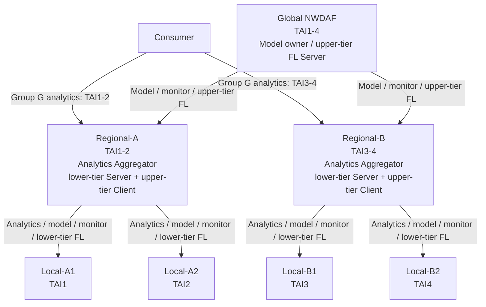

# Hierarchical NWDAF Federated Learning Proposal

## 1. 文件定位

本文件提出一個Global–Regional–Local NWDAF情境，將現有distributed NWDAF
Federated Learning（FL）full-core E2E baseline延伸為hierarchical FL。現階段的
重點是說清楚完整使用情境、各元件的期望行為、3GPP依據、現有能力與需要補足的
範圍；strategy組合與細部政策保留到E2E設計階段再收斂。

| 項目 | 內容 |
| --- | --- |
| 主要方向 | Hierarchical NWDAF Federated Learning |
| 現有基礎 | Distributed NWDAF + flat FL full-core E2E baseline |
| 主要系統 | free5GC、UERANSIM、NWDAF、PyAnLF、PyMTLF、ADRF |
| 標準基礎 | 3GPP Release 18 Analytics Aggregation、Model Provision、Model Monitor、FL capability、NRF discovery與`Nnwdaf_MLModelTraining` |
| 主要重用來源 | 實驗室既有Daisy FL framework |
| 目前狀態 | Candidate design；hierarchical E2E尚未完成 |

## 2. Proposal摘要

現有系統已驗證一個NWDAF FL Server協調兩個NWDAF FL Clients的flat FL流程，
包括group data collection、analytics、model monitoring、degradation detection、
federated retraining、validation、model publication與reprovision。下一階段不新增
一套NWDAF間的私有FL protocol，而是利用Release 18既有的NWDAF hierarchy、
Analytics Aggregator、Model Provision consumer/provider、FL Server/Client角色與
標準ML Model Training processes，組成兩層訓練架構。

```text
Global NWDAF
  -> Regional-A NWDAF -> Local-A1, Local-A2
  -> Regional-B NWDAF -> Local-B1, Local-B2
```

Regional不是只在degradation後臨時出現的FL proxy。它從analytics階段便是覆蓋
兩個Local scopes的Analytics Aggregator；之後又同時向Global取得model、向Local
提供model、聚合Local monitor，以及在不同FL processes中對上為Client、對下為
Server。這使analytics、model、monitor、training與validation沿同一條region關係
串接，而Global不需要直接維護全部Local的生命週期。

Daisy提供可重用的hierarchical round control、strategy-independent selection／
wait／aggregation、participant inventory、FedAvg、FedAsync與sample-count
propagation。重用範圍是PyMTLF內部的FL engine概念；NWDAF間仍使用NRF discovery
與標準SBI。

本proposal不宣稱3GPP已定義完整的hierarchical FL procedure，也不預先假設
hierarchy會提升model accuracy。3GPP定義的是可組合的角色與services；跨層round、
effective sample count、monitor aggregation與validation cascade仍需設計。

## 3. 現有Flat FL Baseline

現有full-core E2E已完成：

```text
Internal Group ID
  -> UDM / UDR group membership resolution
  -> SUPI to serving-SMF resolution
  -> NRF exact SMF discovery
  -> Nsmf Event Exposure subscription with AoI
  -> SMF to UPF data subscription
  -> NWDAF / ADRF data handling
  -> PyAnLF prediction
  -> WAPE model monitoring
  -> degradation detection
  -> NWDAF-C coordinates NWDAF-A and NWDAF-B
  -> synchronous sample-count-weighted FedAvg
  -> final validation and ADRF publication
  -> model reprovision and monitor cutover
```

現有部署使用六個UE、兩個TAI與兩個UPF。FL preparation開始時，各Local會先依
training data requirement準備local dataset snapshot；後續round重複使用這份
dataset，不是在每一輪重新抓取資料。participant inventory也在preparation後固定，
再由同步FedAvg等待結果並依sample count聚合。

已驗證的baseline證明標準SBI與完整model lifecycle可以運作，但目前仍是flat：

- PyMTLF的FL Server與FL Client runtime互斥；
- 沒有Regional同時對上、對下維護不同FL processes的lifecycle；
- participant selection、wait condition與aggregation尚未形成可替換strategy；
- 沒有cross-tier round、effective sample count與validation aggregation。

## 4. Reference Scenario

### 4.1 Group G與Consumer需求

參考情境使用一組由同一application management系統管理的IoT／telemetry UEs。
它們執行相同應用，但分布在四個TAI。5GC內以預先配置的`Internal Group G`表示
這組UE；group membership在實驗期間固定。Group表示共同service context，不代表
所有成員位於同一區域。

完整故事中的最終analytics使用者是一個外部AF。AF希望安排firmware或batch
content delivery，又不想和既有telemetry communication重疊，因此訂閱Group G的
`UE_COMMUNICATION` predictions。它取得predicted communication time、duration、
UL／DL traffic volume、ratio與confidence後，可分別選擇兩個region較空閒的時間
執行非即時傳輸。

若AF不受信任，標準路徑是AF透過NEF呼叫`Nnef_AnalyticsExposure_Subscribe`，
NEF再向NWDAF建立Nnwdaf subscription。這裡定義：AF是最終analytics使用者，NEF
是Nnwdaf介面的直接consumer；後續一律簡稱為**Consumer**。

AF可使用External Group Identifier，5GC內再對應到Internal Group ID。5G VN group
是3GPP中具體的group management例子：AF可提供External Group ID與GPSI list，
UDM在建立新5G VN group時配置unique Internal Group ID。不過本情境不要求Group G
具有5G VN功能，也不聲稱每個Internal Group都是5G VN group。實際實驗直接在
UDM／UDR預先配置Internal Group G與固定SUPI list；AF、NEF與外部識別轉換只用於
補足需求故事，不是hierarchical FL的實作項目。

### 4.2 參考部署規模

| 元件 | 數量 | 配置 |
| --- | ---: | --- |
| UE | 8 | 每個TAI兩個，皆屬於Internal Group G |
| gNB | 4 | 每個TAI一個gNB |
| TAI | 4 | `TAI1`至`TAI4` |
| AMF | 1 | 服務四個gNB |
| SMF | 1 | 建立PDU Sessions並提供NWDAF資料收集所需Event Exposure |
| UPF | 2 | `UPF-A`對應`TAI1–2`，`UPF-B`對應`TAI3–4` |
| Local NWDAF | 4 | 每個Local服務一個TAI |
| Regional NWDAF | 2 | Regional-A服務`TAI1–2`；Regional-B服務`TAI3–4` |
| Global NWDAF | 1 | 覆蓋`TAI1–4`，持有可發布的model |

這些數量是便於說明與驗證架構的reference scale，不代表系統上限；後續可以增加
UE、Local與Regional數量，而不改變角色關係。



## 5. E2E Scenario Story

### 5.1 UE上線與PDU Session

八個UE分別經四個gNB完成Registration與PDU Session establishment。gNB使用已
配置或RAN selection取得的AMF建立N2，不向NRF尋找AMF。AMF選擇SMF，並在
`CreateSMContext`傳入SUPI、DNN、S-NSSAI與`UeLocation`。SMF透過N4設定UPF，
再經AMF／N2與gNB交換N3 endpoint與TEID。

本reference deployment沿用既有TAI-aware initial UPF selection，使TAI1–2使用
UPF-A、TAI3–4使用UPF-B。UE在實驗中不跨TAI移動，所以不要求handover後重選UPF
或重建N3／N9 datapath。

### 5.2 Consumer訂閱Regional analytics

Consumer建立兩份Group G的`UE_COMMUNICATION` subscription：

- requested AoI=`TAI1–2`；
- requested AoI=`TAI3–4`。

Regional成為自然target的理由不是為了配合FL topology，而是它的serving area恰好
涵蓋requested AoI，且具有Analytics Aggregation能力。單一Local只覆蓋一個TAI；
Regional則能將兩個TAI拆成Local subtasks，再產生一份與Consumer原始scope相同的
regional output。Global不需要宣告此consumer-facing Analytics ID，只負責model
lifecycle與upper-tier FL。

### 5.3 Group解析、資料收集與analytics

Regional將AoI拆分後，分別發現並訂閱兩個Local。Local以Internal Group ID向UDM
取得完整SUPI list；對每個SUPI查詢serving-SMF registration，再用
`smfInstanceId`向NRF執行exact discovery，最後向正確SMF建立帶AoI的Nsmf Event
Exposure subscription。

SMF在subscription建立時檢查PDU Session目前的`UeLocation`。UE位於AoI內時，
SMF向對應UPF建立data subscription；不在AoI時，不建立downstream subscription。
資料交由Local NWDAF／ADRF／PyAnLF產生Local prediction，Regional再把兩個Local
outputs聚合成Consumer要求的region-level prediction。

### 5.4 Model discovery與provisioning chain

Global是reference deployment中唯一預先持有model的NWDAF。Regional向Global
取得model，Local再向Regional取得同一model family：

```text
Global model owner
  -> Regional-A / Regional-B
  -> Local-A1 / Local-A2 / Local-B1 / Local-B2
```

Local執行Model Provision discovery時不知道候選者的Global／Regional／Local標籤。
它只查詢符合Analytics ID、model AoI、S-NSSAI與interoperability條件的MTLF。

需要區分**選擇期待**與**實際行為**：

- 選擇期待：若候選provider的model scope與Local requested AoI相符，Local可合理
  期待該model較適合自己的服務區域；若沒有完全相符者，其他可用model也可以使用。
- 實際行為：reference deployment中Regional的scope最符合Local需求，但Regional
  初始沒有model；它再向Global取得model，然後以自己的Model Provision
  subscription向Local交付。

因此Local不需要知道Regional是否自行訓練model，也不需要知道model最初來自Global。
Regional是下游subscription的provider，而不是把Global callback URL透明轉交。

### 5.5 Model Monitor chain

Local直接使用model產生analytics，並向供應model的Regional註冊accuracy monitor。
Regional本身是產生aggregated analytics的AnLF；它接收兩個Local monitor
observations，形成一份regional-scope observation，再向Global註冊monitor。

3GPP沒有明文定義child monitor aggregation，因此這一步是standards-compatible
interpretation，不寫成既有標準程序。候選做法包括重新計算regional WAPE、透過
標準repository references取得資料後重算，或以標準`deviation`欄位回報
`max(child deviations)`。初始偏好為第三種，因為它不需新增非標準payload，且以
最差scope觸發degradation較保守。

必須明確稱它為**maximum-child deviation**或**worst-scope policy**，不能稱為
regional WAPE。標準Model Monitor欄位沒有WAPE numerator／denominator，單靠
`inferenceNum`也無法重新計算兩個scopes的整體WAPE。

Global接收Regional-A與Regional-B的monitor，並保留最終degradation decision。

### 5.6 Participant形成與hierarchical FL

當Global判斷model degradation後，各層以active monitor owners錨定候選clients，
再透過NRF驗證FL capability、serving area與service endpoint，並執行FL
preparation：

- Global的monitor owners是Regional-A與Regional-B，因此自然形成upper-tier
  participant inventory；
- Regional-A的monitor owners是Local-A1與Local-A2；
- Regional-B的monitor owners是Local-B1與Local-B2。

inventory在process preparation時形成。每輪由strategy從既有inventory選擇
participants，不需要重新做完整NRF discovery；某一輪未及時回覆，也不預設將該
client永久踢除。只有NF status、真正join／leave或inventory失效時，才需要額外
refresh／reselection。

Hierarchy由三個獨立的標準FL processes組成：

```text
Global process:
  Global Server <- Regional-A Client, Regional-B Client

Regional-A process:
  Regional-A Server <- Local-A1 Client, Local-A2 Client

Regional-B process:
  Regional-B Server <- Local-B1 Client, Local-B2 Client
```

每個process各有自己的resource與correlation context，不假設整棵tree共用一個
FL process ID。Release 18沒有定義hierarchical process ID，也沒有保證
`mlCorreId`是跨所有NWDAFs的global unique key；PyMTLF需維護最小的內部
parent／child process與round mapping。

Regional收到upper-tier training request後，推進自己的lower-tier process，聚合
Local results，再以普通upper-tier FL Client result回覆Global。若採sample-weighted
FedAvg，Regional result必須帶有它所代表的effective sample count。例如Local-A1
為30筆、Local-A2為40筆，Regional-A在Global aggregation時必須代表70筆。

Regional在核心情境中是pure aggregator，不加入自己的dataset contribution。

### 5.7 Validation與model cutover

Validation沿相同hierarchy進行：Global要求Regional validation，Regional再向Local
傳遞並聚合results，最後由Global接受或拒絕candidate model。通過後，Global把final
model發布到ADRF並觸發Model Provision更新；model再經Regional供應給Local，完成
generation與monitor cutover。具體validation aggregation policy仍待E2E設計時決定。

## 6. 3GPP依據與推導

### 6.1 AF、NEF與Group analytics

TS 23.288 §6.7.3.1說明UE Communication Analytics可分析UE communication
pattern與user-plane traffic，並把statistics或predictions提供給5GC NF或AF；target
可以是一個UE group，filter可以包含Area of Interest。

TS 23.288 §6.1.1.2明確定義：

> “The AF subscribes to or cancels subscription to analytics information via
> NEF by invoking the Nnef_AnalyticsExposure_Subscribe/... service operation.”

TS 23.502 §4.15.6.2 Step 0b進一步直接連結AF、NEF、UE Communication Analytics
與group target：

> “The AF may subscribe to NWDAF via NEF in order to learn the UE mobility
> analytics and/or UE Communication analytics for a UE or group of UEs [...].”

因此，本proposal的故事先採用規格已明確允許的前提：AF可經NEF取得一個UE group
的UE Communication predictions。在此前提上，本情境再具體化該需求：Group G是
由同一application management系統管理、執行相同IoT／telemetry服務的一組UE；
AF利用prediction避開既有telemetry communication時段，分region安排非即時
firmware或batch delivery。後半段是為了形成完整且可驗證scenario所作的情境選擇，
不是3GPP指定AF取得analytics後必須採取的動作。

NEF再呼叫`Nnwdaf_AnalyticsSubscription_Subscribe`，並保存AF request與NWDAF
subscription之間的association。TS 23.502 §4.15.6.3c則以5G VN group為例，允許
AF提供External Group ID與GPSI list；§4.15.6.2要求UDM為新5G VN group配置unique
Internal Group ID。這支持External-to-Internal group story，但目前實驗仍是直接
預配置generic Internal Group G。

來源：

- [TS 23.288 §6.1.1](../../../../specs/TS%2023.288/6%20Procedures%20to%20Support%20Network%20Data%20Analytics/6.1%20Procedures%20for%20analytics%20exposure/6.1.1%20Analytics%20Subscribe%20and%20Unsubscribe.md)
- [TS 23.288 §6.7.3](../../../../specs/TS%2023.288/6%20Procedures%20to%20Support%20Network%20Data%20Analytics/6.7%20UE%20related%20analytics/6.7.3%20UE%20Communication%20Analytics.md)
- [TS 23.502 §4.15.6.2](../../../../specs/TS%2023.502/4%20System%20procedures/4.15%20Network%20Exposure/4.15.6%20External%20Parameter%20Provisioning/4.15.6.2%20NEF%20service%20operations%20information%20flow.md)
- [TS 23.502 §4.15.6.3c](../../../../specs/TS%2023.502/4%20System%20procedures/4.15%20Network%20Exposure/4.15.6%20External%20Parameter%20Provisioning/4.15.6.3c%205G%20VN%20Group%20membership%20management%20parameters.md)

### 6.2 NWDAF hierarchy與Analytics Aggregator

TS 23.288 §5允許NWDAF形成多層hierarchy：

> “The NWDAF architecture allows for arranging multiple NWDAF instances in a
> hierarchy/tree with a flexible number of layers/branches.”

TS 23.288 §6.1A.1允許NWDAF聚合其他NWDAFs的analytics：

> “An NWDAF may have the capability to support the aggregation of Analytics
> (per Analytics ID) received from other NWDAFs [...].”

§6.1A也描述Aggregator可依serving areas拆分AoI、取得各subarea analytics，再產生
一份aggregated output。因此Regional作為Consumer-facing Aggregator有直接規格
依據；早期aggregation routing設計可作為實作起點，但它不屬於最新flat baseline。

TS 29.510的`NwdafInfo.taiList`是NWDAF一般serving area，並沒有generic per-service
TAI。`MlAnalyticsInfo.trackingAreaList`則是特定model的AoI。Global避免被Consumer
選為一般analytics provider的方式，是不宣告該consumer-facing Analytics service／
Analytics ID，而不是替每個service創造不同serving area。

來源：

- [TS 23.288 §5](../../../../specs/TS%2023.288/5%20Network%20Data%20Analytics%20Functional%20Description.md)
- [TS 23.288 §6.1A](../../../../specs/TS%2023.288/6%20Procedures%20to%20Support%20Network%20Data%20Analytics/6.1A%20Analytics%20aggregation%20from%20multiple%20NWDAFs.md)
- [TS 29.510 `NwdafInfo`](../../../../specs/TS%2029.510/6%20API%20Definitions/6.1%20Nnrf_NFManagement%20Service%20API/6.1.6%20Data%20Model/6.1.6.2%20Structured%20data%20types/6.1.6.2.45%20Type%20NwdafInfo.md)
- [TS 29.510 `MlAnalyticsInfo`](../../../../specs/TS%2029.510/6%20API%20Definitions/6.1%20Nnrf_NFManagement%20Service%20API/6.1.6%20Data%20Model/6.1.6.2%20Structured%20data%20types/6.1.6.2.84%20Type%20MlAnalyticsInfo.md)

### 6.3 Model Provision chain

TS 23.288 §6.2A說明：

> “An NWDAF can be at the same time a consumer of this service provided by
> other NWDAF(s) and a provider of this service to other NWDAF(s).”

同一clause也允許MTLF從另一個MTLF取得trained model。因此Regional向Global取得
model、同時向Local提供model具有直接標準依據。NRF可以依Analytics ID、S-NSSAI、
model AoI與vendor information回傳候選MTLF；3GPP沒有規定候選者的完整ranking，
最終selection仍屬實作政策。

來源：[TS 23.288 §6.2A](../../../../specs/TS%2023.288/6%20Procedures%20to%20Support%20Network%20Data%20Analytics/6.2A%20Procedure%20for%20ML%20Model%20Provisioning.md)。

### 6.4 Model Monitor chain

TS 23.288 §6.2E要求使用model產生analytics、且能監控accuracy的AnLF向MTLF註冊
monitor；degradation判斷機制則是MTLF internal procedure。Local直接符合前提。
Regional產生aggregated analytics並以child observations形成regional monitor，是
對標準元件的相容組合，但§6.2E沒有定義child monitor aggregation，必須保留這個
解讀邊界。

TS 29.520的標準monitor欄位不足以把兩個Local WAPE精確重建為regional WAPE，
因此initial maximum-child policy只回報標準`deviation`，不加入private error-sum
payload，也不把該值誤稱為regional WAPE。

來源：

- [TS 23.288 §6.2E](../../../../specs/TS%2023.288/6%20Procedures%20to%20Support%20Network%20Data%20Analytics/6.2E%20MTLF-based%20ML%20Model%20Accuracy%20Monitoring.md)
- [TS 29.520 §5.6.6](../../../../specs/TS%2029.520/5%20API%20Definitions/5.6%20Nnwdaf_MLModelMonitor%20Service%20API/5.6.6%20Data%20Model.md)

### 6.5 FL dual role與多process composition

Release 18的NWDAF profile可表示`FL_SERVER`、`FL_CLIENT`與
`FL_SERVER_AND_CLIENT`。TS 23.288 §5.2也說明：

> “An NWDAF containing MTLF may indicate to support both FL server and FL
> client in the FL capability for specific Analytics ID.”

所以Regional可在upper-tier process為Client、在lower-tier process為Server。
TS 23.288 §6.2C定義每一個FL process的discovery、preparation、training、delay、
aggregation、notification、termination與participant maintenance，但未定義如何把
多個process組成hierarchy。cross-tier orchestration因此是本系統需要補足的設計，
不是新的3GPP protocol。

§6.2C也允許Server逐份更新、等待全部results，或在maximum response time到期後
使用已收到的results。這使synchronous wait-all、quorum／partial-result與async
policy都能在不更改標準SBI的情況下實作。

來源：

- [TS 23.288 §6.2C](../../../../specs/TS%2023.288/6%20Procedures%20to%20Support%20Network%20Data%20Analytics/6.2C%20Federated%20Learning%20among%20Multiple%20NWDAFs.md)
- [TS 29.510 `FlCapabilityType`](../../../../specs/TS%2029.510/6%20API%20Definitions/6.1%20Nnrf_NFManagement%20Service%20API/6.1.6%20Data%20Model/6.1.6.3%20Simple%20data%20types%20and%20enumerations/6.1.6.3.19%20Enumeration%20FlCapabilityType.md)

## 7. Component Responsibilities與改動範圍

| Component | Reference scenario中的行為 | 現有狀態 | Hierarchy需要補足 |
| --- | --- | --- | --- |
| AF／NEF | 建立需求故事與標準analytics exposure入口 | 不在現有E2E內 | 不納入核心實驗；以Consumer/Nnwdaf subscription取代 |
| UE | Registration、PDU Session、產生被分析的session／traffic context | baseline已支援 | 固定位置情境不需修改 |
| gNB | N2轉送、N3 endpoint建立 | UERANSIM已支援baseline | 固定位置情境不需修改 |
| AMF | UE context、SMF selection、向SMF傳遞`UeLocation` | free5GC已有baseline與部分handover logic | hierarchy本身不需修改 |
| SMF | PDU Session、N4 programming、serving-SMF registration、NWDAF Event Exposure、initial AoI gate | 實驗室fork已支援baseline | hierarchy本身不需修改 |
| UPF | N3／N6 forwarding、PFCP state、UPF data exposure | 兩個UPF baseline已驗證 | hierarchy本身不需修改 |
| UDM／UDR | 固定Group G membership與serving-SMF registrations | 現有extensions已支援 | fixed membership不需修改 |
| NRF | NWDAF profile、capability與service discovery | 已能表示並match dual-role FL capability | 驗證Aggregator、Model Provision與dual-role組合 |
| Local NWDAF | data collection、prediction、monitor、local training與validation | 現有A/B涵蓋主要flat行為 | 擴為四個instances，上游改為Regional |
| Regional NWDAF | Analytics Aggregator、雙向Model Provision、monitor aggregation、lower-tier Server、upper-tier Client、validation aggregation | 最新flat E2E沒有此角色 | 核心新增行為 |
| Global NWDAF | model owner、degradation decision、upper-tier Server、final validation/publication/cutover | 現有C已有flat top-level lifecycle | participant與result邊界改為Regional |
| NWDAF Go gateway | 標準SBI、NRF互動、backend request/callback routing | 已有flat service gateway | Regional concurrent roles與多process routing/correlation |
| PyAnLF | Local analytics與WAPE observations | flat baseline已驗證 | Regional analytics與maximum-child monitor aggregation |
| PyMTLF | model lifecycle、flat Server／Client、FedAvg、validation | roles互斥，只有flat lifecycle | dual role、nested processes、strategy boundary、effective samples與validation cascade |
| ADRF | training data與final model storage | baseline已驗證 | 沿用現有resource，不新增hierarchy-specific SBI |

詳細的Registration、PDU Session、N3 tunnel、group-to-serving-SMF、handover與
hierarchical lifecycle traces見
[情境、元件與落差分析](scenario_components_and_gap_analysis.md)。

## 8. Daisy能力重用

Daisy的Master–Zone–Client可以類比分別理解為Global–Regional–Local，但只類比
hierarchical coordination與aggregation responsibility。Daisy三者是不同component
types；本proposal中的所有節點都是相同NWDAF type，依per-process role決定行為。

| Daisy能力 | 在本系統中的用途 |
| --- | --- |
| Strategy-independent control | 把selection、wait與aggregation從固定流程抽離 |
| Participant manager／criterion | 區分process inventory與per-round selection |
| Master–Zone–Client orchestration | 參考outer／inner rounds與Regional上行result形成 |
| FedAvg | 沿用sample-weighted baseline與effective sample propagation |
| Minimum-results waiting | 支援達門檻後使用partial results，不永久移除late client |
| FedAsync／staleness | 作為time-window與late-result policy選項 |
| Per-tier configuration | 允許upper與lower tier替換不同strategy |

不直接搬入Daisy的gRPC topology、private discovery、`parent_address`、task identity
或dataset transport。NWDAF peer仍由NRF發現並使用標準SBI；Go NWDAF是protocol
gateway，PyMTLF才維護FL process與strategy state。

Daisy能力、現有PyMTLF落差與可選政策詳見
[Daisy重用與Hierarchical設計](daisy_reuse_and_hierarchical_design.md)。

## 9. Assumptions與Out-of-scope

`Assumption`是為了界定目前情境而固定的條件；它不代表真實網路永遠如此。
`Out of scope`表示解除該條件所需的程序與元件變更已知，但不納入這一版工作範圍。

| Assumption | 採用理由 | 放寬後需要處理的內容 | 定位 |
| --- | --- | --- | --- |
| Group membership在實驗期間固定 | membership lifecycle不影響hierarchy主線 | UDM `GROUP_MEMBER_LIST_CHANGE`、GPSI/SUPI reconciliation、serving-SMF重新解析、subscription create/delete與refcount | Out of scope |
| UE location／TAI固定 | 現有SMF只有create-time initial AoI gate | UERANSIM handover stimulus、AMF相容與procedure驗證、SMF既有Nsmf subscriptions重新評估、Nupf create/delete | Out of scope |
| Single PLMN、no roaming | 避免HPLMN／VPLMN、SEPP與V-SMF／H-SMF範圍 | roaming discovery、security與home/visited NF interaction | Out of scope |
| SSC Mode 1、fixed PSA | 符合現有free5GC runtime與穩定資料路徑 | SSC2/3、PSA relocation、I-UPF／N9與session continuity | Out of scope |
| Local數量與region assignment固定 | 實驗環境沒有額外clients可遞補 | NF status subscription、join／leave、inventory refresh與dynamic reassignment | Optional extension |

free5GC AMF／SMF已有部分N2 handover與PFCP tunnel update路徑；主要缺口在
UERANSIM尚無upstream merged的完整inter-gNB handover，以及本情境若解除固定位置
後，SMF需要依新`UeLocation`重新評估既有NWDAF subscriptions。這些成本已在詳細
scenario文件保留，但不作為hierarchical FL前置工作。

## 10. 尚待收斂的設計選項

以下選項不影響目前scenario成立，但在實作E2E前需要選定：

1. upper與lower tier先都沿用synchronous FedAvg，或其中一層展示
   quorum／partial-result或FedAsync；
2. outer／inner round比例與Regional completion condition；
3. waiting window、minimum results與late-result policy；
4. Regional monitor除initial maximum-child deviation外，是否保留其他標準欄位
   可表達的policy；
5. validation results的逐層aggregation與Global final acceptance condition；
6. parent／child process、round與effective sample count的最小內部metadata。

這些是系統政策選擇，不需要先發明新的NWDAF-to-NWDAF API。

## 11. 結論

這個proposal以一條完整需求故事連接hierarchical NWDAF FL：外部AF希望根據
Group G在兩個regions的UE communication predictions安排非即時batch delivery；
Consumer因此訂閱恰好覆蓋兩個TAI且能聚合Local結果的Regional NWDAF。Regional
再自然成為model provision、monitor、training與validation的中間協調點。

Release 18明確提供所需building blocks，但沒有替多個FL processes定義完整
hierarchical orchestration。因此實際需要補足的重點集中在Regional Analytics／
Monitor aggregation，以及PyMTLF的dual-role、nested lifecycle、pluggable strategy、
effective sample count與validation cascade。固定membership、固定location、單一
PLMN與SSC Mode 1則把UE／gNB／AMF／SMF／UPF維持在已驗證baseline，避免把另一組
大型mobility問題混入hierarchical FL主線。
