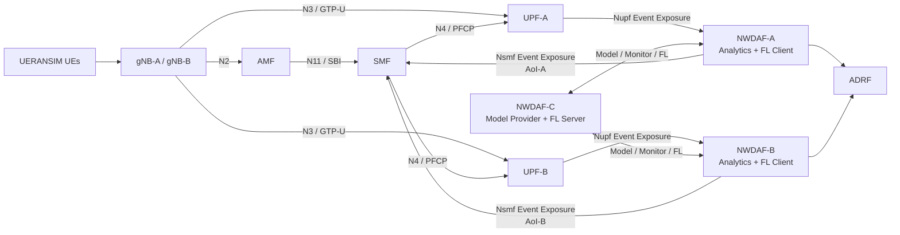
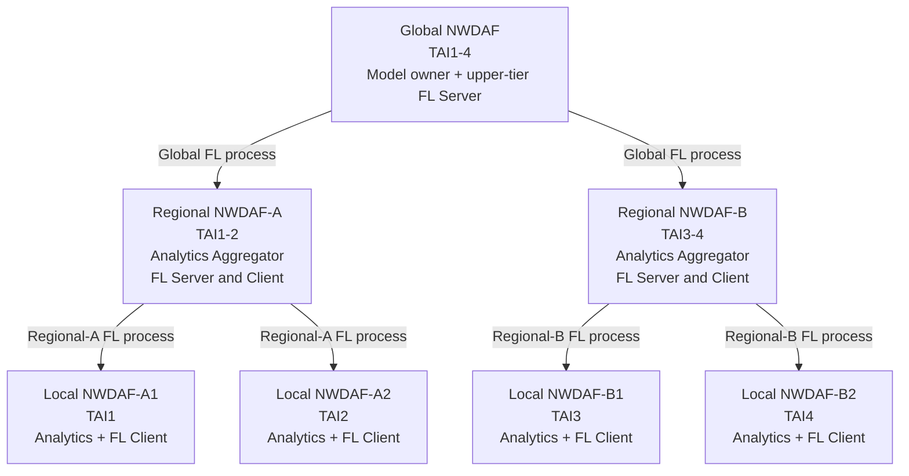
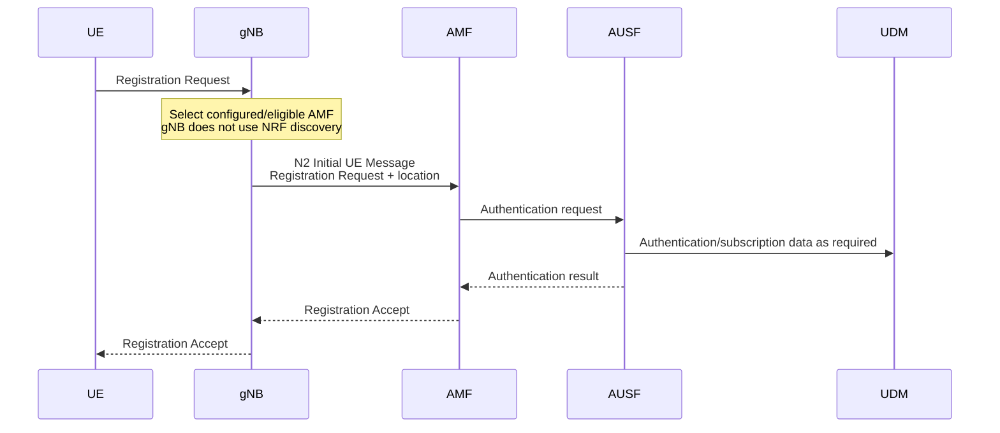
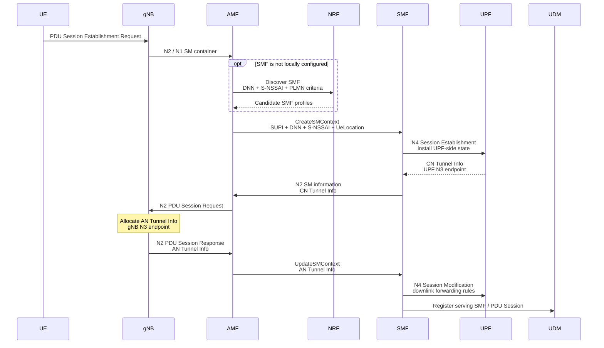
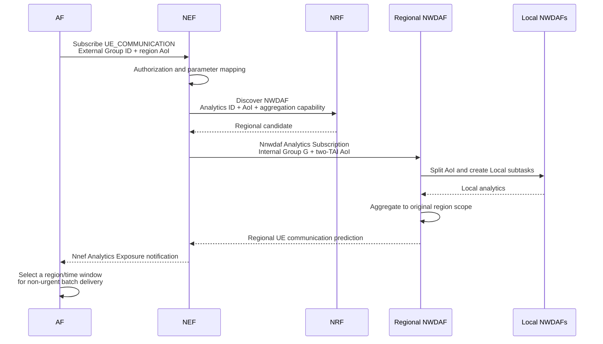
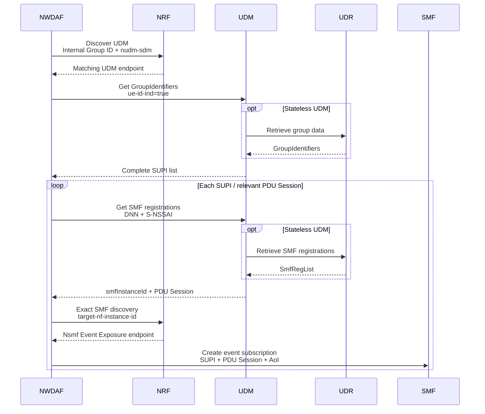
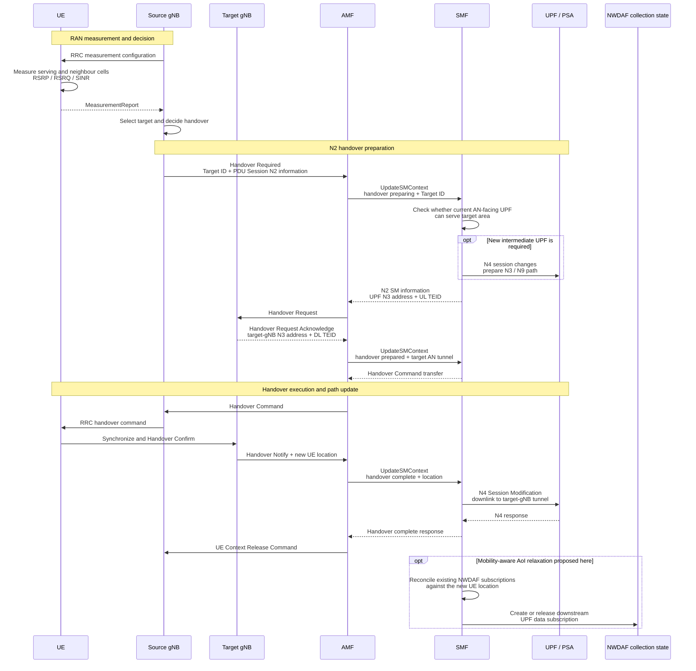
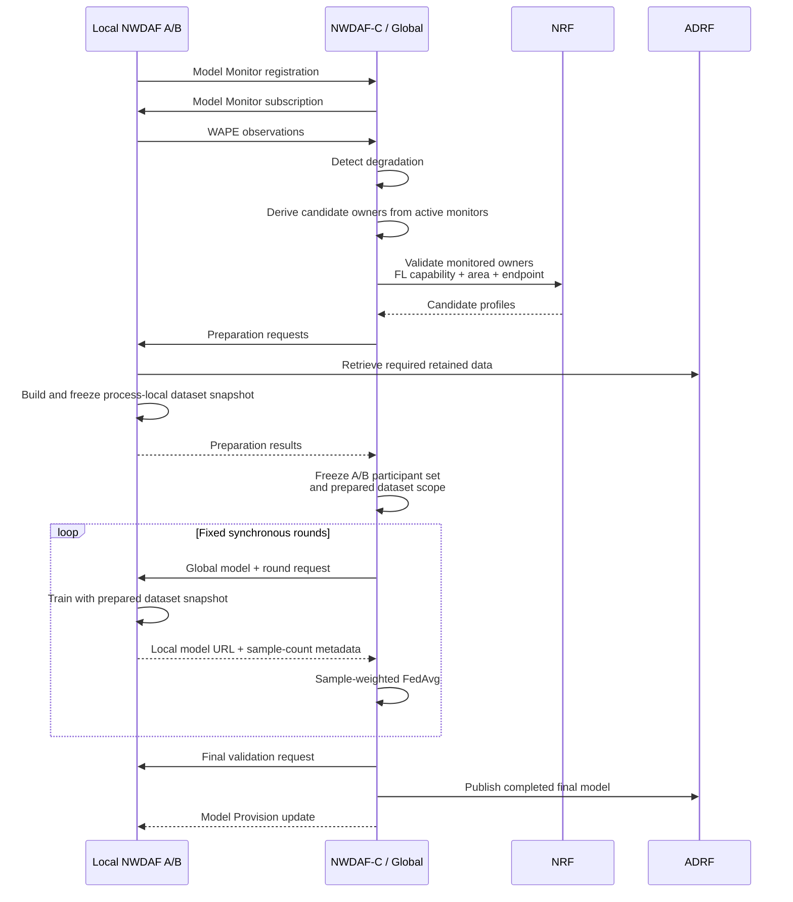
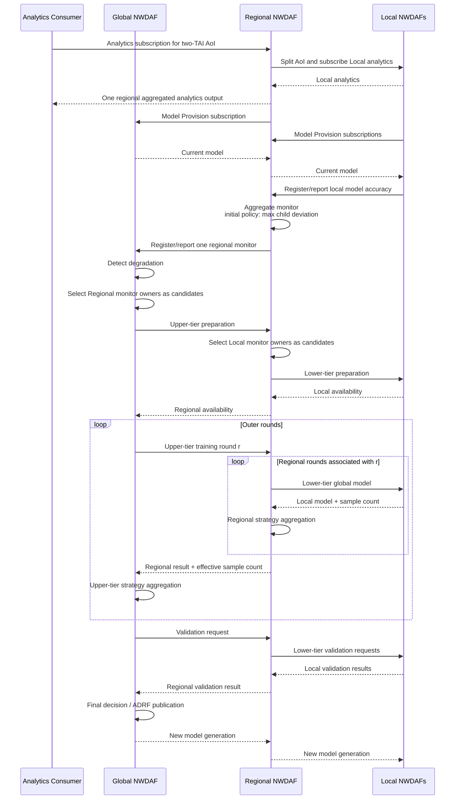

# Hierarchical NWDAF FL 情境、元件與落差分析

## 1. 文件目的

本文件建立 proposal 所需的完整系統情境，回答下列問題：

1. UE、gNB、AMF、SMF、UPF、NRF、UDM、UDR、NWDAF 與 ADRF 在實驗中
   分別負責什麼。
2. UE Registration、PDU Session、N3 tunnel、NWDAF data collection、model
   monitoring 與 FL 之間如何銜接。
3. 哪些能力由3GPP Release 18明確定義，哪些是標準允許的實作政策，
   哪些是hierarchical FL需要補足的設計。
4. upstream free5GC、UERANSIM、現有 implementation 與候選設計之間有哪些
   落差。
5. 若實作 hierarchical NWDAF FL，實際需要改動哪些 component。

本文件不將所有 5GC procedure 展開成一般性教材；只保留理解 NWDAF E2E
依賴與判斷實作範圍所需的步驟。

## 2. 判讀標記

| 標記 | 意義 |
| --- | --- |
| **Implemented baseline** | 已由現有 full-core E2E 或 source 證明 |
| **3GPP-defined** | Release 18 明確定義 |
| **Design inference** | 由標準元件組合而成，但沒有對應的完整 3GPP procedure |
| **Candidate extension** | 尚未實作、可在核心情境後加入的方向 |
| **Assumption** | 實驗期間固定的條件 |
| **Out of scope** | 不作為目前主線 |

## 3. 完整情境

### 3.1 現有 full-core baseline

現有 baseline 使用六個 UERANSIM UEs、兩個固定 TAI 與兩個 UPFs。UE 經正常
Registration 與 PDU Session procedure 形成 serving-SMF registrations；兩個
NWDAF analytics scopes 使用相同 Internal Group ID、不同 AoI 收集資料。



已驗證的業務鏈為：

```text
UERANSIM Registration and PDU Session
  -> UDM / UDR group and serving-SMF data
  -> exact serving-SMF discovery
  -> AoI-aware Nsmf Event Exposure
  -> matching UPF Event Exposure
  -> PyAnLF inference and ADRF storage
  -> WAPE model monitoring
  -> degradation detection
  -> NWDAF-C selects monitored owners A/B
  -> two synchronous sample-weighted FedAvg rounds
  -> final validation and ADRF model publication
  -> model reprovision and monitor cutover
```

主要證據為 [Phase 7 verified result](../../../plans/federated-learning/Phase%207%20Full-Core%20Federated%20Learning%20Business%20E2E%20Detailed%20Plan.md#17-verified-result2026-08-05)。

這個結果使用真實 5GC control-plane procedures 與標準化 service chain；
流量數值則由 go-upf PseudoDriver 提供可重複的 stable-to-degraded stimulus，
不代表已完成 UE application traffic 的 GTP-U throughput benchmark。

### 3.2 規格證據與情境推導

本文件不只列出 clause number。每個關鍵設計都依下列順序判讀：

```text
3GPP 原文
  -> 對本情境的中文解讀
  -> 規格明確允許到哪裡
  -> 本系統額外做出的設計推論
  -> 需要改動的 implementation
```

首先，TS 23.288 §5.1 明確容許多層 NWDAF deployment：

> “The NWDAF architecture allows for arranging multiple NWDAF instances in a
> hierarchy/tree with a flexible number of layers/branches. The number and
> organisation of the hierarchy layers, as well as the capabilities of each
> NWDAF instance remain deployment choices.”

這段原文證明 Global、Regional、Local 三層部署本身符合 Release 18；但層數、
分組方式與各層能力仍是 deployment choice，不能據此宣稱 3GPP 已定義
hierarchical FL procedure。

其次，TS 23.288 §6.1A.1 定義 Aggregator NWDAF 的合法用途：

> “An NWDAF may have the capability to support the aggregation of Analytics
> (per Analytics ID) received from other NWDAFs, possibly with Analytics
> generated by itself.”

§6.1A.2 進一步說明 Aggregator 可依其他 NWDAFs 的 serving areas 將 AoI 切成
subareas，向這些 NWDAFs 取得 analytics，再產生單一 aggregated output。因此，
Regional 並非為了讓 FL 路徑好看而加入的 transparent proxy；它先是服務
TAI1–2 或 TAI3–4 的合法 Analytics Aggregator，才自然成為該 region 的 model
lifecycle 與 FL 協調點。

最後，TS 23.288 §5.2 的 NOTE 5 明確允許同一 MTLF 同時具備兩種 FL 能力：

> “An NWDAF containing MTLF may indicate to support both FL server and FL client
> in the FL capability for specific Analytics ID.”

這允許 Regional 對 Global 是 FL Client、對 Local 是 FL Server。規格仍只定義
每一個 flat FL process；把三個 process 串成 hierarchy、建立 parent/child
correlation及傳遞aggregation metadata，仍是本系統的設計工作。

主要原文來源：

- [TS 23.288 §5](../../../../specs/TS%2023.288/5%20Network%20Data%20Analytics%20Functional%20Description.md)
- [TS 23.288 §6.1A](../../../../specs/TS%2023.288/6%20Procedures%20to%20Support%20Network%20Data%20Analytics/6.1A%20Analytics%20aggregation%20from%20multiple%20NWDAFs.md)
- [TS 23.288 §6.2A](../../../../specs/TS%2023.288/6%20Procedures%20to%20Support%20Network%20Data%20Analytics/6.2A%20Procedure%20for%20ML%20Model%20Provisioning.md)
- [TS 23.288 §6.2C](../../../../specs/TS%2023.288/6%20Procedures%20to%20Support%20Network%20Data%20Analytics/6.2C%20Federated%20Learning%20among%20Multiple%20NWDAFs.md)
- [TS 23.288 §6.2E](../../../../specs/TS%2023.288/6%20Procedures%20to%20Support%20Network%20Data%20Analytics/6.2E%20MTLF-based%20ML%20Model%20Accuracy%20Monitoring.md)

### 3.3 Group G、Consumer需求與實驗邊界

參考情境使用八個UE，每個TAI配置兩個UE。八個UE都屬於同一個固定的
`Internal Group G`，代表由同一套application management系統管理、執行相同
IoT／telemetry服務的一組終端。Group membership描述的是共同的service context，
不是地理分組；同一個Group G可以同時分布在`TAI1–4`。

完整故事中的最終analytics使用者是一個外部AF。AF管理這批終端，想在不與既有
telemetry traffic重疊的時段，分區安排firmware或batch content delivery，因此
訂閱Group G的`UE_COMMUNICATION` predictions。它關心的結果包括predicted
communication time、duration、UL／DL traffic volume、ratio與confidence，並用
這些資訊比較兩個region何時適合執行非即時傳輸。

若AF不受信任，TS 23.288 §6.1.1.2定義AF透過NEF呼叫
`Nnef_AnalyticsExposure_Subscribe`，NEF再以
`Nnwdaf_AnalyticsSubscription_Subscribe`向NWDAF訂閱。為避免後續流程反覆展開
AF／NEF，本文件作以下名詞區分：

- **最終analytics使用者**：AF。
- **Nnwdaf介面的直接consumer**：NEF。
- **後續簡稱Consumer**：代表上述analytics request的5GC側發起者，不再重複
  畫出AF／NEF。

AF依External Group Identifier表示外部群組、5GC內部再使用Internal Group ID，
是標準允許的完整形式。5G VN group是一個具體例子：TS 23.502 §4.15.6.3c允許AF
提供External Group ID與GPSI member list，§4.15.6.2要求UDM在建立新5G VN group
時配置unique Internal Group ID。然而，本情境**不要求Group G具備5G VN功能**，
也不聲稱所有Internal Group都是5G VN group。實際實驗直接在UDM／UDR預先配置
Internal Group G與固定SUPI list；AF、NEF及External-to-Internal mapping只用來
補足故事入口，不列入hierarchical FL的實作範圍。

規格原文：

> “The AF subscribes to or cancels subscription to analytics information via
> NEF by invoking the Nnef_AnalyticsExposure_Subscribe/... service operation.”

> “The AF may subscribe to NWDAF via NEF in order to learn the UE mobility
> analytics and/or UE Communication analytics for a UE or group of UEs [...].”

> “If a new 5G VN group is created, the UDM shall assign a unique Internal
> Group ID for the 5G VN group [...].”

相關來源：

- [TS 23.288 §6.1.1 Analytics Subscribe and Unsubscribe](../../../../specs/TS%2023.288/6%20Procedures%20to%20Support%20Network%20Data%20Analytics/6.1%20Procedures%20for%20analytics%20exposure/6.1.1%20Analytics%20Subscribe%20and%20Unsubscribe.md)
- [TS 23.288 §6.7.3 UE Communication Analytics](../../../../specs/TS%2023.288/6%20Procedures%20to%20Support%20Network%20Data%20Analytics/6.7%20UE%20related%20analytics/6.7.3%20UE%20Communication%20Analytics.md)
- [TS 23.502 §4.15.6.2 External Parameter Provisioning](../../../../specs/TS%2023.502/4%20System%20procedures/4.15%20Network%20Exposure/4.15.6%20External%20Parameter%20Provisioning/4.15.6.2%20NEF%20service%20operations%20information%20flow.md)
- [TS 23.502 §4.15.6.3c 5G VN Group membership](../../../../specs/TS%2023.502/4%20System%20procedures/4.15%20Network%20Exposure/4.15.6%20External%20Parameter%20Provisioning/4.15.6.3c%205G%20VN%20Group%20membership%20management%20parameters.md)
- [TS 23.502 §5.2.6.16 Nnef Analytics Exposure](../../../../specs/TS%2023.502/5%20Network%20Function%20Service%20procedures/5.2%20Network%20Function%20services/5.2.6%20NEF%20Services/5.2.6.16%20Nnef_AnalyticsExposure%20service.md)

### 3.4 候選 hierarchical topology 與角色

候選情境包含四個固定TAI與四個gNB。Global的部署範圍為TAI1–4；Regional-A
與Regional-B分別承接TAI1–2、TAI3–4；四個Local各自負責一個TAI。另配置一個
AMF、一個SMF與兩個UPF，其中UPF-A承接TAI1–2、UPF-B承接TAI3–4。這是便於
說明與驗證的reference scale，之後可以增加UE、Local或Regional數量，而不改變
角色關係。



各層責任如下：

| Tier | Analytics 與 model lifecycle | FL responsibility | 建議 profile 重點 |
| --- | --- | --- | --- |
| Global | 持有可供應的 model；接收 regional monitor；做最終 degradation、validation、publication | upper-tier FL Server | MTLF、Model Provision、Monitor、`FL_SERVER`；不與 Regional 競爭 consumer-facing general Analytics subscription |
| Regional | 對 Consumer 產生 aggregated analytics；向 Global 取 model 再供應 Local；聚合 Local monitor 與 validation | 對上 FL Client、對下 FL Server | AnLF+MTLF、`analyticsAggregation=true`、`analyticsAccuracyChecking=true`、`FL_SERVER_AND_CLIENT` |
| Local | 收集資料、執行 inference、監控 model、使用 retained local data training | lower-tier FL Client | AnLF+MTLF、TAI-specific analytics/model use、`FL_CLIENT` |

TS 29.510 對 `NwdafInfo.taiList` 的定義是：

> “The list of TAIs the NWDAF can serve.”

它是 NWDAF 的一般 serving area；Release 18 並沒有一個可讓每個 SBI service
各自填不同 TAI 的通用欄位。`MlAnalyticsInfo.trackingAreaList` 則被定義為：

> “Area of Interest of the ML model [...].”

`MlAnalyticsInfo.trackingAreaList` 是
特定 ML model 的 Area of Interest，且若兩者同時存在，model AoI 應是一般 serving
area 的 subset。因此可用「Global 一般範圍涵蓋 TAI1–4、特定 model filter 再縮小」
表達模型範圍，但不應宣稱能把 Analytics service 與 Model Training service 的
serving area 完全獨立註冊。避免 Global 被 Consumer 選成 analytics provider 的
乾淨做法，是不要在 Global 的 supported services 中宣告該 consumer-facing
Analytics service／Analytics ID，而不是創造私有 per-service TAI 語意。

這個作法的文字基礎是 TS 23.288 §5.1 的 “list of supported Analytics IDs
(possibly per supported service)”；也就是服務能力與 Analytics ID 可以分開宣告，
但 serving TAI 仍受 NF-level profile 約束。

相關資料模型：

- [TS 29.510 `NwdafInfo`](../../../../specs/TS%2029.510/6%20API%20Definitions/6.1%20Nnrf_NFManagement%20Service%20API/6.1.6%20Data%20Model/6.1.6.2%20Structured%20data%20types/6.1.6.2.45%20Type%20NwdafInfo.md)
- [TS 29.510 `NwdafCapability`](../../../../specs/TS%2029.510/6%20API%20Definitions/6.1%20Nnrf_NFManagement%20Service%20API/6.1.6%20Data%20Model/6.1.6.2%20Structured%20data%20types/6.1.6.2.76%20Type%20NwdafCapability.md)
- [TS 29.510 `MlAnalyticsInfo`](../../../../specs/TS%2029.510/6%20API%20Definitions/6.1%20Nnrf_NFManagement%20Service%20API/6.1.6%20Data%20Model/6.1.6.2%20Structured%20data%20types/6.1.6.2.84%20Type%20MlAnalyticsInfo.md)

### 3.5 Analytics aggregation 與 discovery

Consumer 以兩個 TAI 的 AoI 要求 analytics，並透過 NRF 選擇具有 aggregation
capability 且覆蓋該範圍的 Regional。Regional 再把 AoI 拆成兩個 subareas，
分別發現並訂閱 Local，最後回傳一份符合原始 consumer scope 的 aggregated
analytics：

```text
Consumer requests TAI1-2 analytics
  -> NRF selects Regional-A with analyticsAggregation
  -> Regional-A splits AoI into TAI1 and TAI2
  -> Regional-A discovers/subscribes Local-A1 and Local-A2
  -> Locals collect data and generate analytics
  -> Regional-A correlates and aggregates both outputs
  -> Consumer receives one TAI1-2 analytics result
```

這是 TS 23.288 §6.1A 已定義的 Aggregator procedure。實驗室早期文件
[AoI-based Aggregation Routing](../../../notes/distributed/aggregation_routing/agg_routing_with_aoi.md)
已描述 Consumer→Aggregator→Leaf 的拆分與 callback correlation，可作為設計
起點；但該文件是 future-work note，最新 flat E2E 已移除 Aggregator，因此不能
列成 implemented baseline。

Consumer建立兩份subscription，分別要求Group G在`TAI1–2`與`TAI3–4`的
analytics。Regional成為合理target的原因不是「hierarchy需要中間層」，而是它的
serving area恰好涵蓋requested AoI，且它具有Analytics Aggregation能力，可以把
兩個Local subareas的結果組成一份與原始request scope相符的regional output。

### 3.6 Hierarchical Model Provision

TS 23.288 §6.2A.1 說明同一 NWDAF 可同時為 model provisioning consumer 與
provider：

> “An NWDAF can be at the same time a consumer of this service provided by other
> NWDAF(s) and a provider of this service to other NWDAF(s).”

因此採下列兩段標準 Model Provision subscriptions：

```text
Regional -> subscribe model at Global
Local    -> subscribe model at its Regional

Global model -> Regional provider-of-record -> Local model user
```

Regional 不是把 Global callback URL 原封不動轉交 Local 的 proxy；它在下游
subscription 中是 provider-of-record，需維護 model identity、generation、來源與
Local subscriptions。這讓後續 monitor registration 能回到實際供應 model 的
Regional，也讓 Global 不必直接維護所有 Local 的 provisioning lifecycle。

Local進行Model Provision discovery時並不知道候選者是「Regional」或「Global」。
它只根據所需Analytics ID、model AoI、S-NSSAI、vendor／interoperability等條件
取得可用MTLF candidates。若一個provider的model scope與Local的requested AoI
相符，Local可以合理期待該model適用於自己的區域；若沒有完全相符的provider，
選擇其他可用model也仍然成立。

在reference deployment中，Regional因scope最接近而成為Local看到的provider；
但Regional當下可能沒有model，於是依TS 23.288 §6.2A再向Global取得，之後以自己
的Model Provision subscription向Local交付。這是**實際行為**，和Local在discovery
時對model suitability的**選擇期待**必須分開；Local無須知道Regional只是先取得
Global model再向下提供。

### 3.7 Hierarchical Model Monitor

TS 23.288 §6.2E 對 monitor registration 的前提是：

> “When an NWDAF containing AnLF starts making use of an ML Model and it has the
> ability either to monitor the analytics accuracy of the ML Model, or to deliver
> Analytics Feedback Information [...], it registers with the NWDAF containing
> MTLF [...].”

Local 正在直接使用 model 產生 analytics，故它向 Regional 註冊 monitor 完全符合
此敘述。Regional 則不是透明轉送：它本身以 AnLF 聚合 Local analytics，並產生一份
TAI1–2或TAI3–4的regional analytics output；本系統將該output與相同
`modelId`／generation綁定。Regional收到兩個Local monitor observations後，將它們
合成一份regional-scope accuracy observation，再向供應model的Global註冊一個
regional monitor。

但 §6.2E 沒有明文定義「Aggregator 代替 child AnLF 聚合 ML Model Monitor」。
因此上一段是standards-compatible interpretation，而不是3GPP-defined monitor
aggregation procedure。它的解讀基礎是Regional本身為AnLF並產生aggregated
analytics output，而且將child observations作為判斷該output accuracy的內部輸入；
規格並未明文定義child monitor aggregation，所以不能把這一步寫成標準程序。

TS 23.288 §6.2E 也明確保留 MTLF 的 degradation policy：

> “The actual mechanism for the NWDAF containing MTLF for determining the
> degradation of the ML Model degradation is an internal procedure of the
> NWDAF containing MTLF [...].”

候選 monitor aggregation policies 如下：

| 方案 | Regional 對 Global 回報方式 | 標準欄位 | 成本與語意 |
| --- | --- | --- | --- |
| A | 用 regional prediction 與 ground truth 重新計算 regional WAPE | `deviation` | 語意最完整，但需建 regional validation/data path |
| B | 透過標準 `adrfId`／`dataSetTag` 取得資料後重算 | `deviation`、repository references | 保留標準 contract，但增加資料查找與重算 |
| C（初始偏好） | 回報 `max(child deviations)` | `deviation` | 實作最小、保守地代表 worst scope；必須稱為 maximum-child deviation policy，而非數學上的 regional WAPE |

TS 29.520 的 `MLModelAccuracyInfo` 只有 `mlModelAcc`、`deviation`、
`inferenceNum`、`adrfId`／`adrfSetId`、`dataSetTag`、`modelMetric` 與
`monitorInterval` 等欄位，沒有 WAPE numerator／denominator。故不得加入私有
error-sum sidecar 來假裝是標準 monitor payload；`inferenceNum` 也不足以精確合成
WAPE。方案 C 可先不填 `inferenceNum`，或只把它當 coverage metadata，不能用它
暗示 max policy 是 sample-weighted WAPE。

現有 PyAnLF 的 flat baseline 以 `deviation=WAPE` 回報，並帶
`inferenceNum`、`monitorInterval` 與 `modelMetric=ACCURACY`，目前沒有填
`mlModelAcc`。因此 maximum-child policy 可以沿用 `deviation` 語意；需要新增的
是 Regional 接收多份 Local observations、依 model generation／scope 關聯、選出
最大值，再建立一份對 Global 的標準 Monitor notification。

資料模型證據：[TS 29.520 §5.6.6](../../../../specs/TS%2029.520/5%20API%20Definitions/5.6%20Nnwdaf_MLModelMonitor%20Service%20API/5.6.6%20Data%20Model.md)。

### 3.8 Hierarchical FL 與 validation

Analytics、Provision 與 Monitor 已建立 Regional 的目的性後，degradation 形成
下列 FL processes。每一層 FL Server 都先以本層的 active Model Monitor owners
作為訓練候選者來源，再透過 NRF 驗證其 FL capability、area 與服務 endpoint，
不需要 Global 維護一份私有 Global→Local assignment table：

```text
Global process:
  Global = FL Server
  Regional-A, Regional-B = FL Clients

Regional-A process:
  Regional-A = FL Server
  Local-A1, Local-A2 = FL Clients

Regional-B process:
  Regional-B = FL Server
  Local-B1, Local-B2 = FL Clients
```

Global 的 active monitor owners 是 Regional-A／B，因此自然形成 upper-tier
candidate inventory；每個 Regional 的 active monitor owners 是其兩個 Locals，
因此自然形成 lower-tier inventory。Regional 收到 upper-tier round 後，對這些
Local monitor owners 執行 NRF discovery／validation 與 preparation，再啟動獨立的
lower-tier process。它聚合 Local results 後，對 Global 只呈現一份普通的
FL Client result。若採 sample-weighted FedAvg，Regional 必須一併傳遞所有 Local
contributions 的 effective sample count，否則 upper-tier weighting 會改變數學
語意；這項 exact count 是 project-specific algorithm/artifact metadata，不是
Release 18 已標準化欄位。

Validation 採相同的 cascade：Global 發起、Regional 向 Local 傳遞並聚合
validation results、Global 作最後接受與 publication 決定。既有 final validation
可在 private artifact contract 中保留 WAPE components；它與必須遵守標準欄位的
cross-NWDAF Model Monitor payload 是兩個不同邊界，不應混為一談。

Regional 在核心情境中不以自己的 dataset 產生額外 training contribution。它是
真正的 Analytics Aggregator，但在 FL 數學上只代表下層 Local contributions；
這能避免 regional self-training 帶來 consumer discovery、資料來源與公平比較
上的額外變因。

## 4. 元件責任與改動影響

| Component | 本情境的必要責任 | 現有狀態 | Hierarchical FL 影響 |
| --- | --- | --- | --- |
| AF／NEF（故事入口） | AF以External Group Identifier要求Group G的regional UE Communication predictions；NEF完成authorization、mapping與Nnwdaf subscription | 不在現有E2E baseline內 | 僅用於說明需求；實驗從預先配置Internal Group G與Consumer/Nnwdaf邊界開始 |
| UE | Registration、PDU Session request，產生被分析的 UE identity／session | UERANSIM 已支援 baseline 所需流程 | 無必要 source change |
| gNB | 與已選定／配置 AMF 建立 N2；轉送 NAS；建立 N3 endpoint | UERANSIM 已支援 registration 與 PDU Session | 無必要 source change |
| AMF | access／mobility context、authentication coordination、SMF selection、將 `UeLocation` 傳給 SMF | free5GC core 已提供 baseline procedure | 無必要 source change |
| AUSF／NSSF | authentication 與 slice selection dependency | baseline core dependency | 不屬於 hierarchy change set |
| SMF | PDU Session lifecycle、UPF selection、N4 programming、serving-SMF registration、NWDAF-facing Event Exposure | 實驗室 fork 已有 TAI-aware initial UPF selection 與 create-time AoI gate | 固定位置情境不需修改 |
| UPF | N3／N6 forwarding、PFCP state、事件量測與回報 | 兩個 UPF 與 controlled Event Exposure replay 已驗證 | 不需因 hierarchy 修改 |
| NRF | NF registration/discovery；match Analytics ID、area、FL capability 與 exact instance | 實驗室 fork 已保存並 match Release 18 NWDAF FL fields | 原則上沿用；驗證 dual-role profile 即可 |
| UDM | subscriber data、Internal Group membership 對外查詢、serving-SMF registration retrieval | 實驗室 fork 已提供所需 operations | 固定 group 情境不需修改 |
| UDR | UDM 背後的 group 與 SMF registration persistence | 實驗室 fork 已提供所需 resources | 不需因 hierarchy 修改 |
| ADRF | 保存 training data 與 completed final model | baseline 中為必要元件且已驗證 | 不需新增 hierarchy-specific SBI |
| Local NWDAF | TAI-specific analytics、data collection、model use／monitoring、lower-tier local training | 現有 A/B 已涵蓋主要行為 | 擴充為四個 instances；model/monitor/FL 的上游改為 Regional |
| Regional NWDAF | Analytics Aggregator；對上取 model 與回報 regional monitor；對下供 model；對上為 FL Client、對下為 FL Server；聚合 training 與 validation | 早期 note 有 aggregation routing 設計，但最新 E2E 未實作此角色 | 情境與 hierarchy 的核心新增角色 |
| Global NWDAF | model owner、regional monitor consumer、degradation decision、upper-tier FL Server、final validation/publication／cutover | 現有 C 已有 top-level lifecycle，但直接管理 flat Local clients | 改為只管理 Regional participants 與 regional results |
| PyAnLF | analytics runtime、SMF／UPF ingestion、WAPE measurement | baseline 已驗證 | Local path沿用；Regional需補 analytics、monitor、validation aggregation policy |
| PyMTLF | model lifecycle、monitor policy、FL server/client execution、artifact validation | flat server/client 已驗證，但 roles 互斥 | Regional Model Provision consumer/provider、dual-role FL、nested process與cross-tier result是主要改動 |

## 5. 核心程序追蹤

### 5.1 UE Registration

最小 procedure trace：



關鍵點：

- gNB 依 RAN selection procedure 或配置的 AMF address 建立 N2，不是向 NRF
  查找 AMF。
- N1 是 UE 與 AMF 間的 logical NAS relationship；訊息實際經 gNB 與 N2
  傳送。
- Registration 建立 AMF 可使用的 UE identity、security、slice 與 location
  context，後續 PDU Session 和 serving-NF information 依賴這些狀態。

規格證據：

- [TS 23.502 §4.2.2.2.2 General Registration](../../../../specs/TS%2023.502/4%20System%20procedures/4.2%20Connection%2C%20Registration%20and%20Mobility%20Management%20procedures/4.2.2%20Registration%20Management%20procedures/4.2.2.2%20Registration%20procedures/4.2.2.2.2%20General%20Registration.md)

### 5.2 PDU Session 建立與 N3 tunnel



N3 的 UL 與 DL endpoint 使用不同的 receiving TEID：

```text
UL: gNB -> UPF, packet carries the UPF-allocated TEID
DL: UPF -> gNB, packet carries the gNB-allocated TEID
```

因此 N3 tunnel 不是一次 request-response 建立；SMF 先配置 UPF，再經 AMF／N2
取得 gNB endpoint，最後更新 UPF downlink state。

規格證據：

- [TS 23.502 §4.3.2.2.1 PDU Session Establishment](../../../../specs/TS%2023.502/4%20System%20procedures/4.3%20Session%20Management%20procedures/4.3.2%20PDU%20Session%20Establishment/4.3.2.2%20UE%20Requested%20PDU%20Session%20Establishment/4.3.2.2.1%20Non-roaming%20and%20Roaming%20with%20Local%20Breakout.md)
- [TS 23.502 §4.3.2.2.3 SMF selection](../../../../specs/TS%2023.502/4%20System%20procedures/4.3%20Session%20Management%20procedures/4.3.2%20PDU%20Session%20Establishment/4.3.2.2%20UE%20Requested%20PDU%20Session%20Establishment/4.3.2.2.3%20SMF%20selection.md)

### 5.3 Consumer訂閱Regional analytics



這張圖描述完整故事；hierarchical FL實驗不需要實作AF、NEF或AF採取的batch
delivery action。實驗直接以Consumer對Regional的兩份Nnwdaf subscriptions作為
入口。TS 23.288 §6.7.3.1明確允許target為一個UE group、filter包含Area of
Interest，且output predictions包含time slots、duration、traffic volume、ratio
與confidence，因此AF的決策需求與analytics內容相符。

### 5.4 Internal Group 至 serving SMF



這條 procedure 的重要邊界是：

- NWDAF 的標準 peer 是 UDM，不直接讀取 UDR／MongoDB。
- NRF 先用 Internal Group ID 發現 UDM，但不回傳 group members。
- `smfInstanceId` 是 identity，不是 endpoint；需要 exact NRF discovery。
- 任選 NRF 回傳的 SMFs 再對所有 SUPIs 訂閱會形成錯誤的 Cartesian product。

規格證據與完整解讀：

- [Internal Group Resolution and Serving SMF Release 18](../../../specification-guides/Internal%20Group%20Resolution%20And%20Serving%20SMF%20Release%2018%20規格解讀.md)
- [TS 23.502 §4.15.4.5 UPF data collection exposure](../../../../specs/TS%2023.502/4%20System%20procedures/4.15%20Network%20Exposure/4.15.4%20Core%20Network%20Internal%20Event%20Exposure/4.15.4.5%20Exposure%20of%20Events%20from%20UPF%20for%20UPF%20Data%20Collection.md)

### 5.5 SMF AoI gate 與現有限制

Release 18 procedure 支援 SMF 根據 UE 是否位於 AoI 建立或停止 downstream UPF
subscription。現有實驗室 SMF fork 已完成：

```text
Nsmf subscription create
  -> inspect current PDU Session UeLocation once
  -> inside AoI: create Nupf subscription
  -> outside AoI: retain upstream resource without downstream subscription
```

目前沒有完成：

```text
UeLocation changes after subscription creation
  -> reevaluate every affected NWDAF subscription
  -> create or delete downstream Nupf subscription
```

因此 proposal 應使用「create-time initial AoI gate」描述 baseline，並以固定
UE location 作為 assumption；不得把 mobility-aware reconciliation 寫成已完成。

### 5.6 UE 移動至 N2-based handover

本 proposal 不以 handover 為主要 contribution，但 fixed UE location 是一項需要
交代解除成本的實驗假設。以下流程以單一 PLMN、source／target gNB 由同一 AMF
服務、SSC Mode 1 且 PSA 不變為簡化情境。它刻意分成兩個邊界：前半段是 RAN
量測與 handover decision；TS 23.502 §4.9.1.3 的 5GC procedure 則從 source RAN
送出 `Handover Required` 開始。



這裡的「訊號變弱」只是直觀描述。實際上 UE 依 gNB 配置量測 serving／
neighbour cells，`MeasurementReport` 可攜帶 RSRP、RSRQ、SINR 等結果；是否換手
與 target selection 是 NG-RAN decision，不是 UE、AMF 或 SMF 的決定。接著：

- source gNB 對 AMF 發出 `Handover Required`，才進入 N2-based handover 的
  5GC preparation procedure；
- AMF 以 `Nsmf_PDUSession_UpdateSMContext` 讓 SMF 準備 PDU Session；
- TS 23.502 明確要求 SMF 檢查 target 是否仍位於 AN-facing UPF service area，
  必要時選擇新的 intermediate UPF；
- target gNB 在 `Handover Request Acknowledge` 中提供自己的 N3 tunnel
  information，SMF 才能在完成階段透過 N4 更新 user-plane path；
- N2-based handover 成功由 target gNB 送 `Handover Notify`。不要和 Xn-based
  handover 的 `Path Switch Request` 混為同一條 message sequence；
- 最後一段 AoI reconciliation 不是 TS 23.502 handover 本身的訊息，而是解除
  本專案 fixed-location assumption 時，SMF 需要增加的 NWDAF subscription
  lifecycle reaction。

規格證據：

- [TS 38.331 §5.5.5 Measurement reporting](https://www.etsi.org/deliver/etsi_ts/138300_138399/138331/15.30.00_60/ts_138331v153000p.pdf)
- [TS 23.502 §4.9.1.3.2 N2 handover preparation](../../../../specs/TS%2023.502/4%20System%20procedures/4.9%20Handover%20procedures/4.9.1%20Handover%20procedures%20in%203GPP%20access/4.9.1.3%20Inter%20NG-RAN%20node%20N2%20based%20handover/4.9.1.3.2%20Preparation%20phase.md)
- [TS 23.502 §4.9.1.3.3 N2 handover execution](../../../../specs/TS%2023.502/4%20System%20procedures/4.9%20Handover%20procedures/4.9.1%20Handover%20procedures%20in%203GPP%20access/4.9.1.3%20Inter%20NG-RAN%20node%20N2%20based%20handover/4.9.1.3.3%20Execution%20phase.md)

### 5.7 現有 Model Monitor 至 flat FL baseline



Dataset lifecycle 的正確順序是：Local 在 preparation 階段就依 training data
requirement 從 ADRF 取得所需資料，建立該 FL process 使用的 local dataset
snapshot；preparation 成功後，participant set 與 dataset scope 才被固定。後續
training rounds 反覆使用這份已準備的 snapshot，不是在每一輪重新向 ADRF 抓取
資料。這也使 `training_sample_count` 在同一 process 內具有一致的 weighting
語意。

### 5.8 提議的 Aggregator-based hierarchical lifecycle



此 sequence 由五組各自合法的 Release 18 relationships 組成：Analytics
aggregation、兩段 Model Provision、兩段 Model Monitor、三個 FL processes，以及
分層 validation。3GPP 沒有把它們合成一條現成 procedure；`parent process +
outer round` 與 `child process + regional round` 的 correlation、Regional
completion condition、monitor aggregation、failure propagation 及 effective
sample count都是需要補足的系統設計。

## 6. 3GPP 證據分類

### 6.1 3GPP-defined

下列是 proposal 可直接依賴的標準 building blocks：

- TS 23.288 §5.1：NWDAF 可包含 AnLF、MTLF 或兩者；多個 NWDAFs 可組成彈性
  hierarchy/tree。
- TS 23.288 §6.1A：Aggregator 可切分 AoI、發現並訂閱多個 NWDAFs，再產生單一
  aggregated analytics output。
- TS 29.510 `NwdafCapability`：`analyticsAggregation=true` 表示支援 analytics
  aggregation；另有 `analyticsAccuracyChecking` 能力。
- TS 23.288 §6.2A：同一 NWDAF 可同時是 Model Provision consumer 與 provider。
- TS 23.288 §6.2E：使用 model 的 AnLF 可向 model provider 註冊 accuracy monitor；
  MTLF 可接收一個或多個 AnLF 的多份資訊，並以 internal procedure 判斷 degradation。
- TS 23.288 §5.2 與 TS 29.510 `FlCapabilityType`：MTLF 可同時宣告
  `FL_SERVER` 與 `FL_CLIENT` capability。
- TS 23.288 §6.2C：每個 FL process 由一個 server 與多個 clients 組成，包含
  registration、discovery、preparation、round、delay、aggregation、termination
  與 participant maintenance。
- TS 29.520 §4.6：`Nnwdaf_MLModelTraining` 的 resource 與 callback contract。

TS 23.288 §6.2C.2.2 step 5 對等待政策的原文是：

> “The FL Server NWDAF may update the global ML Model each time a FL Client NWDAF
> provides updated local ML Model information, or the FL Server NWDAF may decide
> to wait for local ML Model information from all FL Client NWDAFs before
> updating the global ML Model.”

同一步驟也允許 maximum response time 到期後，只聚合已取得的 local model
information。這表示標準 contract 能承載 wait-all、逐次更新或 partial-result
policy；選擇哪一種及如何處理 late result 仍是 implementation policy。

主要證據：

- [TS 23.288 §5](../../../../specs/TS%2023.288/5%20Network%20Data%20Analytics%20Functional%20Description.md)
- [TS 23.288 §6.1A](../../../../specs/TS%2023.288/6%20Procedures%20to%20Support%20Network%20Data%20Analytics/6.1A%20Analytics%20aggregation%20from%20multiple%20NWDAFs.md)
- [TS 23.288 §6.2A](../../../../specs/TS%2023.288/6%20Procedures%20to%20Support%20Network%20Data%20Analytics/6.2A%20Procedure%20for%20ML%20Model%20Provisioning.md)
- [TS 23.288 §6.2C](../../../../specs/TS%2023.288/6%20Procedures%20to%20Support%20Network%20Data%20Analytics/6.2C%20Federated%20Learning%20among%20Multiple%20NWDAFs.md)
- [TS 23.288 §6.2E](../../../../specs/TS%2023.288/6%20Procedures%20to%20Support%20Network%20Data%20Analytics/6.2E%20MTLF-based%20ML%20Model%20Accuracy%20Monitoring.md)
- [TS 29.510 `FlCapabilityType`](../../../../specs/TS%2029.510/6%20API%20Definitions/6.1%20Nnrf_NFManagement%20Service%20API/6.1.6%20Data%20Model/6.1.6.3%20Simple%20data%20types%20and%20enumerations/6.1.6.3.19%20Enumeration%20FlCapabilityType.md)
- [NWDAF FL Release 18 specification guide](../../../specification-guides/NWDAF%20Federated%20Learning%20Release%2018%20規格解讀.md)

### 6.2 標準化框架與實作政策

3GPP 沒有指定：

- FedAvg、FedAsync 或其他 aggregation algorithm；
- exact sample count 或 aggregation weight；
- model tensor／gradient／delta format；
- participant selection algorithm；
- wait、quorum、timeout 與 retry policy；
- local dataset split、normalization 與 preprocessing；
- intermediate model storage 與 model promotion policy。
- child monitor results 如何形成一個 regional monitor result；
- validation results 如何逐層聚合；
- Model Provision、Monitor 與 FL relationships 如何綁成同一棵 operational tree。

因此 strategy-independent engine 可以在不更改標準 SBI 的情況下控制 selection、
wait、aggregation 與 evaluation policy。

### 6.3 與標準相容的設計推論

Release 18 沒有定義一套獨立的 hierarchical FL procedure。以下項目屬於
proposal需要明確定義的設計項目：

- 多個標準 FL processes 的 parent／child composition；
- Global／Regional／Local process correlation；
- nested round scheduling；
- Regional 對上的 single result semantics；
- effective sample-count propagation；
- per-tier strategy selection；
- worst-scope deviation aggregation（`max(child deviations)`）；
- hierarchical Model Provision 與 validation cascade；
- hierarchy-specific failure isolation 與 recovery。

正確表述是「以 Release 18 roles 與 services 組成 hierarchy」，不是「3GPP
已標準化 hierarchical NWDAF FL」。

## 7. free5GC、UERANSIM 與現有實作

### 7.1 upstream free5GC 邊界

目前官方 free5GC repository 將自身描述為 3GPP Release 17-based 5GC，並包含
ULCL 與 multi-UPF infrastructure。專案本地 upstream
mirror 顯示：

- AMF 會以 DNN、S-NSSAI、PLMN 與 preferred locality 發現 SMF，之後選取
  第一個可用 candidate；沒有以 Cell ID／TAI 直接執行 location-specific SMF
  selection。
- SMF 已有 multi-UPF topology、N9、AN-facing UPF、ULCL 與 additional PSA
  infrastructure。
- static user-plane topology 中存在多個 AN 時，upstream `selectUPPathSource()`
  尚未依 runtime UE location 選擇對應 AN root。
- AMF 在 `CreateSMContext` 與後續 update 中會把 `UeLocation` 交給 SMF。
- AMF／SMF 已有多項 handover 與 Path Switch handler，不等於整套 emulator
  mobility scenario 已可直接使用。

本地 mirror 只證明其 pinned revision；目前 upstream project 狀態應以
[free5GC repository](https://github.com/free5gc/free5gc) 為準。

### 7.2 現有 extensions

| Repository | 已有能力 |
| --- | --- |
| `NWDAF/` | Release 18 Model Provision／Monitor／Training gateway、NRF discovery、`FL_SERVER_AND_CLIENT` compatibility model |
| `nrf/` | Release 18 NWDAF profile persistence與`ml-analytics-info-list` matching；`FL_CLIENT` query可匹配dual-role profile |
| `udm/`, `udr/` | Internal Group membership與serving-SMF registration resources |
| `smf-nwdaf-ext/` | Nsmf Event Exposure、Nupf downstream lifecycle、create-time AoI gate、TAI-aware initial UPF service-area selection |
| `PyAnLF/` | collection intent、inference、ADRF storage、WAPE measurement |
| `PyMTLF/` | flat FL Server／Client、synchronous FedAvg、artifact validation、final publication與cutover |
| `adrf/` | Data Management與ML Model Management paths |

這代表 Go NWDAF gateway 與 NRF profile/matching 已能表達 Regional 的 dual FL
capability；真正阻擋 hierarchy 的主要 gap 不在新增另一套 discovery protocol，
而在 Regional analytics aggregation、PyMTLF dual-role lifecycle 與分層結果語意。

### 7.3 UERANSIM mobility 邊界

free5GC AMF／SMF 已包含 N2／Xn handover、N2 SM context update 與 user-plane
tunnel update 的主要 control-plane logic，官方整合測試也包含 N2 與 Xn handover
case。但這不表示 upstream UERANSIM 已能直接完成相同 E2E scenario。

UERANSIM upstream 的 N2 handover PR 目前仍為 open。它提供人工
`handover <UE-ID> <gNBTargetID>` stimulus，也就是以 operator command 代替
前述 UE measurement、`MeasurementReport` 與 source-gNB autonomous decision。
PR 並明確表示 data forwarding 尚未實作。因此它可作為 deterministic mobility
event，不代表 measurement-driven handover 或 seamless user-plane continuity已
完成。該整合目前另牽涉尚未合併的 free5GC AMF compatibility fix。

來源：[UERANSIM PR #769](https://github.com/aligungr/UERANSIM/pull/769)、
[free5GC AMF PR #168](https://github.com/free5gc/amf/pull/168)。

此限制不影響固定位置 hierarchical FL 主情境；只有在 relaxation 需要驗證
mobility-aware AoI reconciliation 時才會成為直接依賴。

若未來解除 fixed-location assumption，所需工作應分成以下層次，不應籠統寫成
「實作 handover」：

| Component | 已有基礎 | 仍需修改或驗證 |
| --- | --- | --- |
| UE／gNB emulator | UERANSIM 支援 registration 與 PDU Session；open PR 有人工 N2 trigger | 最低成本路徑是移植並固定該 PR、補齊 target/source context 與 regression；若要求真實 mobility decision，還要建立 radio measurement model、RRC measurement report 與 gNB decision logic；若要求 continuity，還要完成 data forwarding |
| AMF | free5GC 已有 Handover Required／Request／Acknowledge／Notify、Cancel，以及 Xn Path Switch handlers | 驗證 UERANSIM interoperability、AMF UE NGAP ID/context lifecycle與新版相容性；視結果納入或重作尚未合併的 compatibility fix；確認新的 `UeLocation` 正確傳給 SMF |
| SMF | 已有 handover N2 SM parsing、`UpdateSMContext` states 與 PFCP tunnel update | 單純 same-UPF handover以驗證既有路徑為主；本專案若要 mobility-aware AoI，需在 location change 後重新評估既有 Nsmf subscriptions並建立／釋放 downstream Nupf subscription |
| UPF topology | 現有 N4／PFCP 與 multi-UPF infrastructure可承接 SMF programming | same PSA／same UPF時主要是驗證新 target-gNB tunnel；若要求依 UPF service area插入或更換 I-UPF，還需把 runtime Target ID／TAI 接到 UPF selection及 N3／N9 datapath rebuilding |
| NWDAF | 固定位置 collection與initial AoI gate已有 baseline | 不需參與 NGAP handover；只需驗證 SMF reconciliation 後，資料收集 scope會隨 UE 進出 AoI正確啟停 |

因此 mobility relaxation 可再分成三個不同成本層級：

```text
controlled handover event
  = patched UERANSIM + AMF compatibility + existing core path validation

mobility-aware NWDAF AoI
  = controlled event + SMF subscription reconciliation

seamless mobility / service-area-driven I-UPF
  = measurement-driven RAN + data forwarding + dynamic N3/N9 datapath
```

## 8. Hierarchical FL 實作落差

### 8.1 必要改動

| Component | 需要補足的能力 | 預估程度 |
| --- | --- | --- |
| `PyAnLF` | Regional Analytics Aggregator、Local monitor intake、maximum-child deviation與validation aggregation | 中至高 |
| `PyMTLF` | Regional Model Provision consumer/provider；dual-role runtime；可重用的strategy／round engine；nested process；parent-facing training／evaluation result；effective sample count | 高 |
| `NWDAF` | Regional Aggregator與dual-role profile/config、同時承接inbound resources與outbound peer requests、hierarchical Model Provision／Monitor routing及correlation | 中 |
| `nrf` | dual-role registration/discovery行為驗證；若現有matching完整則不需新API | 低 |
| `nwdaf-resources` | 增加Global／Regional／Local deployment、fair flat comparison與signaling/bytes evidence | 中 |
| `ADRF` | 沿用local data與final model storage；沒有預期的新標準resource | 低 |

### 8.2 不需因 hierarchy 修改的 baseline dependencies

在固定 membership、固定 TAI、單一 PLMN、SSC Mode 1 情境下，下列 component
只需維持現有 baseline，不應被列為 hierarchy 的 source-change requirement：

```text
UE / gNB / AMF / AUSF / NSSF
SMF / UPF
UDM / UDR
ADRF standard interfaces
```

若 hierarchy 實驗失敗於這些 component，應先判定是 baseline regression 或
部署問題，不能直接把它當成 hierarchical FL design gap。

### 8.3 Regional 不採 self-training 的理由

`FL_SERVER_AND_CLIENT` 只表示 Regional 可在不同 FL processes 扮演不同角色，
不表示它必須用自己的 dataset 做 local training。核心情境採 pure model
aggregator：Regional 的 upper-tier contribution 是 lower-tier Local results 的
聚合，不額外加入 Regional dataset。

這項選擇同時維持三個邊界清楚：

1. 資料來源仍是實際收集與產生 analytics 的 Local；
2. Regional 的 AnLF 職責是依 §6.1A 產生 aggregated analytics，而不是建立另一份
   與 Local 重疊的原始資料來源；
3. 若後續比較flat與hierarchy，兩者可以維持相同Local datasets與training work，
   避免Regional額外資料來源改變比較條件。

若未來加入 Regional self-training，必須另行定義資料如何取得、是先 training
還是先聚合，以及如何計算 sample weight；它不是目前 proposal 的必要選項。

## 9. 假設與解除條件矩陣

| Scenario assumption | 採用理由 | Relaxation 所需工作 | 與主題關聯／成本 | Relaxation 定位 |
| --- | --- | --- | --- | --- |
| Group membership在實驗中固定 | 已有標準擴充路徑，但membership lifecycle不影響hierarchy核心問題 | UDM Event Exposure、GPSI notification reconciliation、authoritative group re-fetch、per-SUPI subscription create/delete、refcount | 關聯低、成本中 | Out of scope |
| UE location／TAI固定 | 隔離FL topology變因；現有只完成initial AoI gate | Handover stimulus、location update、existing Nsmf subscription reconciliation、downstream Nupf create/delete | 關聯低至中、成本中高 | Out of scope |
| 單一PLMN、無roaming | 避免HPLMN/VPLMN、SEPP、V-SMF/H-SMF與trust擴張 | roaming architecture與跨PLMN discovery/security | 關聯低、成本極高 | Out of scope |
| SSC Mode 1、固定PSA | 現有free5GC runtime與baseline相符 | SSC2/3 session replacement、PSA relocation、IP continuity驗證 | 關聯低、成本極高 | Out of scope |
| 可發現的Local數量與region assignment固定 | 實驗環境沒有額外候選者可遞補；先隔離topology | NRF status subscription、leave/join、動態region assignment與round-boundary replacement | 關聯高、成本中高 | Optional extension |

### 9.1 Mobility 成本效益結論

Mobility-aware AoI reconciliation 可改善 scenario 完整性，但它需要修改 SMF
subscription lifecycle並依賴可控handover stimulus；mobility-triggered I-UPF／
datapath rebuilding又會進一步進入PFCP、N3/N9與UPF service-area整合。兩者都
不會直接完成hierarchy、strategy或cross-tier weighting所需的系統行為。

因此目前較合理的定位是：

```text
fixed UE location = explicit experiment assumption
mobility-aware AoI = standards-supported relaxation, scoped out
mobility-triggered I-UPF / PSA work = separate extension
```

### 9.2 Monitor-anchored candidate inventory 與每輪 participant selection

需要區分三個階段：

```text
FL process 建立前
  -> FL Server 從active Model Monitor registrations／subscriptions
     取得正在監控受影響model與scope的NWDAFs
  -> 以NRF discovery驗證這些monitor owners的Analytics ID、area、
     FL capability與service endpoint
  -> 對通過驗證者執行preparation，建立此process的participant inventory

每一 training round
  -> strategy 從既有 inventory 決定本輪選哪些 clients
  -> 不重新執行完整 NRF discovery

inventory 真的失效時
  -> 才考慮查詢／訂閱 NRF status、補入新 client或移除不可用 client
```

TS 23.288 §6.2C.2.1 定義 FL Server 透過 NRF 發現候選 FL Clients，以 preparation
確認它們能否參加，再決定可納入 FL process 的 clients。規格允許以 Analytics ID、
Service Area、FL capability與data-source等條件發現；「先以active monitor owners
縮小候選集合」則是本系統延續現有baseline的participant policy。
§6.2C.2.3 則是第三段的 maintenance procedure：在 FL execution phase 中，Server
可取得既有 clients 的 availability／capability change、接收 join／leave資訊，
必要時發現新 candidates，並在 iteration 結束時加入或移除 participants。

這個policy在hierarchy中不需新增Global→Local mapping：Global收到Regional的
monitor，因此找到Regional；Regional收到Local的monitor，因此找到Local。四個
Local與region assignment在實驗期間固定；Global與Regional各自在process建立時
完成一次monitor-anchored discovery/preparation，之後每輪由strategy從inventory
選人。沒有「某輪沒有回覆就永久踢除」的預設，也不建議每輪重新向 NRF 發現
相同 clients，因為這會重複 discovery 成本並混淆
candidate discovery 與 round selection 的責任。

只有未來要處理 NF status change、真正的 join／leave，或 inventory 已不足以完成
訓練時，才需要納入 §6.2C.2.3 的 inventory refresh／reselection。它是 optional
extension，不是 basic hierarchical FL 的必要條件。

## 10. 主要結論

1. Regional 應先以標準 Analytics Aggregator 承接兩個 Local scopes，而不是在
   degradation 後才臨時插入 FL path；這讓 discovery、Model Provision、Monitor、
   FL 與 validation 共用一條可解釋的分層關係。
2. 現有 full-core baseline 足以保留 UE／gNB／AMF／SMF／UPF 主流程，但 Analytics
   Aggregator 與 hierarchical model lifecycle 尚未實作。
3. Release 18 明確提供 hierarchy deployment、analytics aggregation、Model
   Provision consumer/provider、monitoring、dual FL capability 與單層 FL process；
   將它們組成一條 E2E hierarchy 是 standards-compatible design inference。
4. 主要gap在Regional aggregation、PyMTLF dual-role/nested lifecycle、
   strategy boundary、sample-count propagation、monitor與validation aggregation。
5. Regional monitor 初始偏好採標準 `deviation` 欄位回報
   `max(child deviations)`；它是 worst-scope policy，不宣稱為 regional WAPE。
6. Mobility與dynamic group membership不是hierarchical FL的必要前置工作；
   每輪 participant selection 使用process建立時形成的inventory，只有真正的
   status change或join／leave才需要額外的inventory refresh／reselection。
