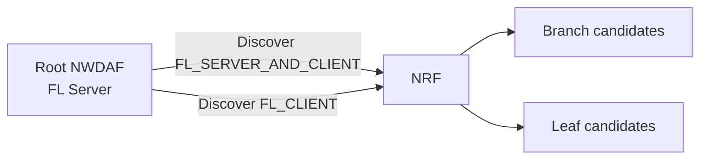
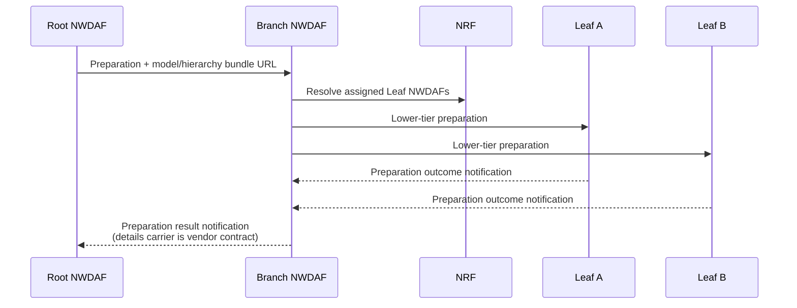

# Hierarchical NWDAF Federated Learning Proposal Draft

## 1. 問題重新定位

一般 FL framework 的基本流程是由 FL Server 找到可參與的 FL Clients、傳送模型與
training contract、收集 local model updates，並依 strategy 完成 aggregation。

在 NWDAF 環境中，local training 與 aggregation algorithm 並不是唯一問題。更關鍵的
問題是：

> FL Server 如何透過 3GPP mechanism 感知可用 NWDAFs、理解其能力，並在不依賴
> 特定 Analytics／Model Monitor／Model Provision 情境的前提下，建立可執行的
> hierarchical FL topology？

因此，本設計先不限制「誰因為什麼原因啟動 FL」。不同 trigger 可以在未來接到同一套
topology establishment 與 FL execution framework。

## 2. 設計目標

提出一套通用的 Hierarchical NWDAF FL 建立方法，使同一種 NWDAF implementation
可以依當次 topology assignment 動態扮演：

```text
Root NWDAF
└─ FL Server

Branch NWDAF
├─ 對上：FL Client
└─ 對下：FL Server

Leaf NWDAF
└─ FL Client
```

「Root」、「Branch」與「Leaf」是一次 hierarchical FL topology 中的相對位置，
不是新的 NF type，也不要求 NWDAF 在部署時永久綁定同一角色。

## 3. 標準提供的基礎

### 3.1 FL capability registration and discovery

TS 23.288 §5.2 與 §6.2C.2.1 定義 NWDAF containing MTLF 可向 NRF 註冊：

- Analytics ID。
- Address information。
- Service Area。
- FL capability type。
- Time interval supporting FL。
- FL Client 可收集 training data 的 data-source NF type／NF Set 等資訊。

TS 29.510 定義的 FL capability type 包含：

```text
FL_SERVER
FL_CLIENT
FL_SERVER_AND_CLIENT
```

因此，同時宣告 FL Server 與 FL Client 能力的 NWDAF，是潛在的 Branch candidate：

```text
對上層FL process：FL Client
對下層FL process：FL Server
```

這只能證明 NWDAF 能支援兩種標準角色；3GPP 尚未定義 Branch 的協調行為或
hierarchical topology establishment procedure。

### 3.2 FL preparation

TS 23.288 §6.2C.2.1 定義 FL Server 可在 NRF discovery 後，使用
`Nnwdaf_MLModelTraining` preparation request 確認候選 FL Client 是否符合本次訓練
需求。

Preparation 可檢查：

- Analytics ID。
- ML Model Interoperability information。
- Data Availability requirement。
- FL Availability time requirement。
- Model information 存在時，Client 是否能成功下載模型。

Client 可透過 `Nnwdaf_MLModelTraining_Subscribe` response 或
`Nnwdaf_MLModelTraining_Notify` 表達是否參與 FL。因此，標準允許 preparation decision
使用非同步 notification 回報。

Preparation 並不是另一套獨立的 SBI service。它使用相同的
`Nnwdaf_MLModelTraining_Subscribe` operation，並在
`NwdafMLModelTrainSubsc.mLPreFlag` 設為 `true`。TS 29.520 §5.5.6.2.2 對此欄位的
原文說明是：

> “Indicates whether the subscription is for preparation of ML Model training. Set
> to "true" if it is for ML training preparation, otherwise set to "false".”

並明確要求：

> “It shall be present when the service is for preparation of Federated Learning.”

以下是省略非必要條件的簡化標準 request body；它只示範 preparation、FL correlation
與 model URL 如何放入既有 schema，不包含本設計的 bundle 內部格式：

```text
POST {apiRoot}/nnwdaf-mlmodeltraining/v1/subscriptions
```

```json
{
  "mLEventSubscs": [
    {
      "mLEvent": "UE_COMMUNICATION",
      "mLEventFilter": {},
      "modelInterInfo": "vendor-model-format-v1"
    }
  ],
  "notifUri": "https://root.example.com/ml-training/callback",
  "notifCorreId": "prep-root-branch-a",
  "mlCorreId": "fl-upper-001",
  "mLPreFlag": true,
  "mLModelInfos": [
    {
      "event": "UE_COMMUNICATION",
      "mLFileAddr": {
        "mLModelUrl": "https://models.example.com/bundles/plan-001"
      }
    }
  ]
}
```

其中，`mLEventSubscs`、`notifUri` 與 `notifCorreId` 是 OpenAPI schema 的 required
properties；`mlCorreId` 在 FL service 中應存在；`mLPreFlag: true` 才把這次
ML Model Training subscription 定位為 preparation。實際情境可再加入
`mLModelTrainInfos` 表達 data／time availability requirements。

規格來源：

- [TS 29.520 §5.5.6 Data Model](../../../../specs/TS%2029.520/5%20API%20Definitions/5.5%20Nnwdaf_MLModelTraining%20Service%20API/5.5.6%20Data%20Model.md)
- [Release 18 OpenAPI `NwdafMLModelTrainSubsc`](../../../../specs/openapi/TS29520_Nnwdaf_MLModelTraining.yaml)

### 3.3 Model file address

TS 29.520 的 `mLModelInfos` 可包含：

```text
mLFileAddr
├─ mLModelUrl
└─ mlFileFqdn
```

TS 29.520 §5.4.6.2.8 對 `mLModelUrl` 的原文定義是：

> “The URL of the ML Model file.”

同一份 data model 對直接承載的 `mlFile` 說明：

> “Indicates the ML model file. The format of its value is out of 3GPP scope.”

因此，3GPP 標準化的是 SBI envelope、ML model information 與 model file address，
沒有指定模型檔案的序列化格式。這提供同 vendor NWDAFs 使用共同 model packaging
format 的空間，但**沒有直接定義** model file 可用來建立 hierarchical topology。

規格來源：

- [TS 29.520 §5.4.6 Data Model](../../../../specs/TS%2029.520/5%20API%20Definitions/5.4%20Nnwdaf_MLModelProvision%20Service%20API/5.4.6%20Data%20Model.md)
- [Release 18 OpenAPI `MLModelAddr`](../../../../specs/openapi/TS29520_Nnwdaf_MLModelProvision.yaml)

### 3.4 本設計新增的 model bundle contract

本設計將 `mLModelUrl` 指向的 ML model file 包裝成同 vendor 可理解的 **model
bundle**。Bundle 必須仍包含可供訓練的 model artifact；hierarchy manifest 是附加的
packaging metadata，不取代模型，也不改變 `mLModelUrl` 的 SBI 型別或基本語意。

這項設計新增以下責任：

#### Root NWDAF

- 建立並發布包含 model artifact 與 hierarchy manifest 的 bundle。
- 在 manifest 中提供 topology plan ID、指派給 Branch 的 Leaf candidates，以及
  topology admission policy。
- 保證 model URL 在 preparation 期間可取得，並維護 bundle version 與完整性。
- 不在 manifest 中重複或覆寫已有標準欄位；Analytics ID、training requirements、
  preparation flag 等資訊仍由標準 SBI 表達。

#### Branch NWDAF

- 下載 bundle，分別驗證 model artifact 與 hierarchy manifest。
- 確認 manifest 是指派給本 NWDAF 且版本可理解；無法解析時不得自行猜測其語意。
- 將 manifest 中的 NF instance identifiers 視為候選者提示，再透過 NRF 解析並確認
  Leaf 的標準能力與 service endpoint。
- 對 Leaf 建立獨立的 lower-tier preparation；傳給 Leaf 的 bundle 只保留該層執行
  所需資訊，不直接轉送完整 upper-tier assignment。
- 若採第 6 節的 result-bundle 做法，建立並發布包含有效 model artifact 與實際
  preparation results 的新 bundle，並維持其 URL lifecycle。

#### Leaf NWDAF

- 接收 Branch 所建立的 lower-tier training request 與執行訓練所需的 model bundle。
- 不需要知道完整 topology，也不需要理解其他 Branch 或 Leaf 的 assignment。
- 依標準 training requirements、model interoperability、資料與時間可用性，以及
  implementation policy，決定是否參與本次 FL。

上述 Leaf 決策責任直接對應 TS 23.288 §6.2C.2.1 step 8：

> “FL Client NWDAF(s) checks if it can meet the ML Model training requirement and/or
> can successfully download the model if the model information is provided in the
> request and decides whether to join the Federated Learning process based on
> operator policy ... and/or implementation.”

同一 procedure 的 step 10 將最終 participant 決策保留給 FL Server：

> “FL Server NWDAF determines the FL Client NWDAFs to be involved in the FL
> procedures based on the information received in step 6 and other information
> received in step 9 (if available).”

因此，hierarchy manifest 是協助逐層執行 candidate assignment 的同 vendor contract；
每一層仍須經過標準 discovery／preparation，不能把 manifest 本身視為 Client 已獲准
參與 FL 的證明。

規格來源：[TS 23.288 §6.2C.2.1](../../../../specs/TS%2023.288/6%20Procedures%20to%20Support%20Network%20Data%20Analytics/6.2C%20Federated%20Learning%20among%20Multiple%20NWDAFs.md)

## 4. Topology establishment overview

Topology 建立分成兩個主要階段。

### 4.1 階段一：環境感知與候選者建立

Root NWDAF 向 NRF 查詢：

1. 同時具有 FL Server 與 FL Client 能力的 Branch candidates。
2. 符合 Analytics ID、Service Area、Time Period、Model Interoperability 等條件的
   Leaf FL Client candidates。



NRF discovery 建立的是 candidate inventory，不代表候選者已確定能參與本次 FL。

### 4.2 階段二：逐層 preparation

Root 選擇一個 Branch candidate，並建立 upper-tier preparation subscription。
Request 使用標準 `mLModelUrl` 指向第 3.4 節定義的 model bundle；bundle 另外包含
本次 topology plan。

概念範例：

```json
{
  "bundleVersion": "1.0",
  "model": {
    "artifact": "model.onnx",
    "interoperability": "001122"
  },
  "hierarchyPlan": {
    "planId": "plan-001",
    "assignedClients": [
      {"nfInstanceId": "leaf-a"},
      {"nfInstanceId": "leaf-b"}
    ],
    "admissionPolicy": {
      "mode": "PARTIAL_ALLOWED",
      "minimumClients": 1
    }
  }
}
```

Branch 接受 subscription 後：

1. 回覆 `201 Created`，不阻塞原始 HTTP request。
2. 下載並驗證 model bundle 與 hierarchy plan。
3. 透過 NRF 重新解析與確認被指派的 Leaf NWDAFs。
4. 以另一組 lower-tier FL process 對各 Leaf 建立 preparation subscriptions。
5. 等待各 Leaf 以非同步 notification 回報 preparation outcome。
6. 形成實際 subordinate topology result，再回報 Root。



文字流程如下：

1. Root 從 candidate inventory 選出 Branch，建立 upper-tier preparation，並以
   `mLModelUrl` 提供包含模型與 topology plan 的 bundle。
2. Branch 下載並驗證 bundle，取得 Root 指派的 Leaf candidate identifiers 與
   admission policy。
3. Branch 以 NRF discovery 重新解析這些 identifiers，確認各 Leaf 目前的 NF profile、
   FL capability 與 service endpoint。
4. Branch 為 lower tier 建立另一組 FL process，並分別向候選 Leaf 發送 preparation
   request。傳給 Leaf 的內容只包含該層需要的模型與 training contract。
5. 每個 Leaf 獨立檢查模型下載、interoperability、資料與時間可用性，再以相同的
   preparation outcome notification 形式回報是否參與；成功或失敗由 notification
   內容表達。
6. Branch 依本次 admission policy 等待 Leaf outcomes，整理實際 prepared、failed
   與未在期限內完成的 participants。
7. Branch 向 Root 發送 upper-tier preparation result notification；若採本設計的
   result-bundle contract，詳細結果由 notification 中的 model bundle URL 提供。
8. Root 根據實際結果與 admission policy，決定接受目前 topology、補選 Leaf、重新
   分組，或更換 Branch 後再次執行 preparation。

## 5. 非同步 preparation 狀態語意

本設計沿用現有 implementation profile：

```text
201 Created
= subscription已建立，preparation開始執行

後續prepared notification
= 本層所需的preparation已完成

後續termination notification
= 本層無法完成或維持此次preparation
```

3GPP 提供 response／notification、`statusReport`、`termTrainReq` 與
`mLModelInfos` 等標準結構；上述狀態對應與 hierarchy result interpretation 是本設計的
implementation profile。

## 6. Subordinate preparation result

Branch 必須回報實際準備結果，而不能只提供單一成功／失敗布林值，否則 Root
無法重建 topology。

概念範例：

```json
{
  "planId": "plan-001",
  "status": "READY_WITH_PARTIAL_PARTICIPATION",
  "preparedClients": [
    {"nfInstanceId": "leaf-a"}
  ],
  "failedClients": [
    {
      "nfInstanceId": "leaf-b",
      "cause": "INSUFFICIENT_DATA"
    }
  ]
}
```

TS 23.288 §6.2C.2.1 step 9 允許 Client 使用 Notify 或 Subscribe response 表示是否
加入 FL：

> “FL Client NWDAF(s) invokes Nnwdaf_MLModelTraining_Notify or
> Nnwdaf_MLModelTraining_Subscribe response or Nnwdaf_MLModelTrainingInfo_Request
> response service operation to indicate to the FL Server NWDAF whether it will
> join the FL procedure ...”

本設計希望 Branch 在上述非同步回報中，將下層 preparation result manifest 放入
`mLModelUrl` 所指向的 bundle，使 Root 能得知哪些 Leaf 已準備完成、哪些 Leaf 失敗，
再進行 partial admission 或 topology re-planning。

這不是 `mLModelUrl` 最自然的標準語意。TS 29.520 將它定義為 ML Model file 的 URL，
並將 Notify 中的 `mLModelInfos` 描述為 “Represents the ML Model information.”；規格
並沒有把這個 URL 描述成一般性的 topology control 或 preparation-result channel。

另一方面，TS 29.520 沒有規範 ML model file 的內部格式，且
`NwdafMLModelTrainNotif` schema 允許在 Notify 中提供 `mLModelInfos`。規格也沒有明文
禁止同 vendor 在仍含有效 model artifact 的 bundle 中附加 preparation metadata。
因此，本設計把它定位為：

> 使用標準 SBI 欄位傳遞 model bundle URL，並在未標準化的 bundle 內容中附加
> hierarchy preparation result。

這種做法在 data type 與傳輸流程上未被規格直接阻止，但附加資訊的語意與解析方式是
同 vendor implementation contract，不能宣稱為 3GPP 已定義的 hierarchical FL
procedure。若後續認為這項語意延伸不可接受，才需要另行選擇詳細結果的承載方式。

規格來源：

- [TS 23.288 §6.2C.2.1](../../../../specs/TS%2023.288/6%20Procedures%20to%20Support%20Network%20Data%20Analytics/6.2C%20Federated%20Learning%20among%20Multiple%20NWDAFs.md)
- [TS 29.520 §5.5.6.2.8 `NwdafMLModelTrainNotif`](../../../../specs/TS%2029.520/5%20API%20Definitions/5.5%20Nnwdaf_MLModelTraining%20Service%20API/5.5.6%20Data%20Model.md)

## 7. Topology admission policies

框架不將完整或部分成功寫死，至少保留兩種 policy。

### 7.1 Complete required

```text
任一必要Leaf失敗
        ↓
Branch回報實際結果
        ↓
Root保留已成功participants或清理本次attempt
        ↓
補選Leaf／重新分組／更換Branch
        ↓
再次preparation
```

這裡失敗的是目前 topology plan，不代表整個 FL training 永久終止。

### 7.2 Partial allowed

若成功 participants 已滿足 `minimumClients` 或其他 admission criterion，Root 可：

- 接受目前實際 topology 並開始 training。
- 先補選後再開始。
- 在 training 同時保留後續 participant maintenance 空間。

無論採哪個 policy，Branch 都要回報 prepared 與 failed client lists，最終是否接受
由 Root 決定。

## 8. Topology ownership

```text
Root
├─ 維護整體candidate inventory
├─ 選擇Branch與Leaf assignments
├─ 決定admission policy
├─ 接收實際preparation results
└─ 接受、補選或重建topology

Branch
├─ 執行被指派的lower-tier preparation
├─ 維護upper/lower process mapping
├─ 整理prepared／failed results
└─ 不在Root未知情況下自行永久替換Leaf

Leaf
├─ 檢查標準與bundle contract
├─ 準備local model/data resources
└─ 非同步回報preparation outcome
```

Branch 可在 Root 授權的 candidate set 或 policy 範圍內進行局部選擇，但實際 topology
仍須回報 Root。

## 9. FL process boundaries

Hierarchy 由多個標準 FL processes 組成，而不是一個跨整棵樹的單一 subscription：

```text
Upper-tier process
Root NWDAF：FL Server
└─ Branch NWDAF：FL Client

Lower-tier process
Branch NWDAF：FL Server
├─ Leaf NWDAF A：FL Client
└─ Leaf NWDAF B：FL Client
```

每個 process 各自維護：

- `mlCorreId`。
- Subscription resources。
- Notification correlations。
- Round state。
- Participant state。

Branch 內部維護 upper process 與 lower process 的對應關係；3GPP 尚未定義這個
cross-process hierarchy mapping。

## 10. 與現有 baseline 的關係

現有 NWDAF／PyMTLF 已具備：

- 標準 `Nnwdaf_MLModelTraining` subscription gateway。
- NRF FL capability registration／discovery 基礎。
- FL Server 與 FL Client runtime。
- 非同步 preparation：先 `201`，再下載模型、建立 ADRF dataset，最後 callback。
- Prepared status 與 termination notification。
- Flat synchronous FL 與 sample-count-weighted FedAvg。

新設計需要補上的主要能力是：

- 同一 NWDAF 同時承擔 upper Client 與 lower Server runtime。
- Hierarchy plan bundle 與 result bundle schema。
- Preparation 階段接收與處理帶 `mLModelInfos` 的 result notification。
- Upper／lower FL process mapping。
- Topology planner 與 re-planning lifecycle。
- Complete-required／partial-allowed admission policy。
- 對已成功、失敗與替補 participants 的資源清理與重用規則。

## 11. 尚待討論

1. Root 更新 topology plan 時，採修改既有 upper-tier subscription，或建立新的
   preparation subscription。
2. 已準備完成的 Leaf 是否跨 topology revision 保留，及其資料／模型有效性條件。
3. Result bundle 的最小必要欄位、版本與完整性驗證方式。
4. Branch 可否在 Root 指定的候選集合內自行補選，以及需要回報到什麼粒度。
5. `PARTIAL_ALLOWED` 的最低門檻由 Root、Branch 或 strategy module 決定。
6. Preparation timeout、重試與 late notification 的處理。
7. Topology 完成後，upper／lower training rounds 的協調頻率與 effective sample count
   propagation。
