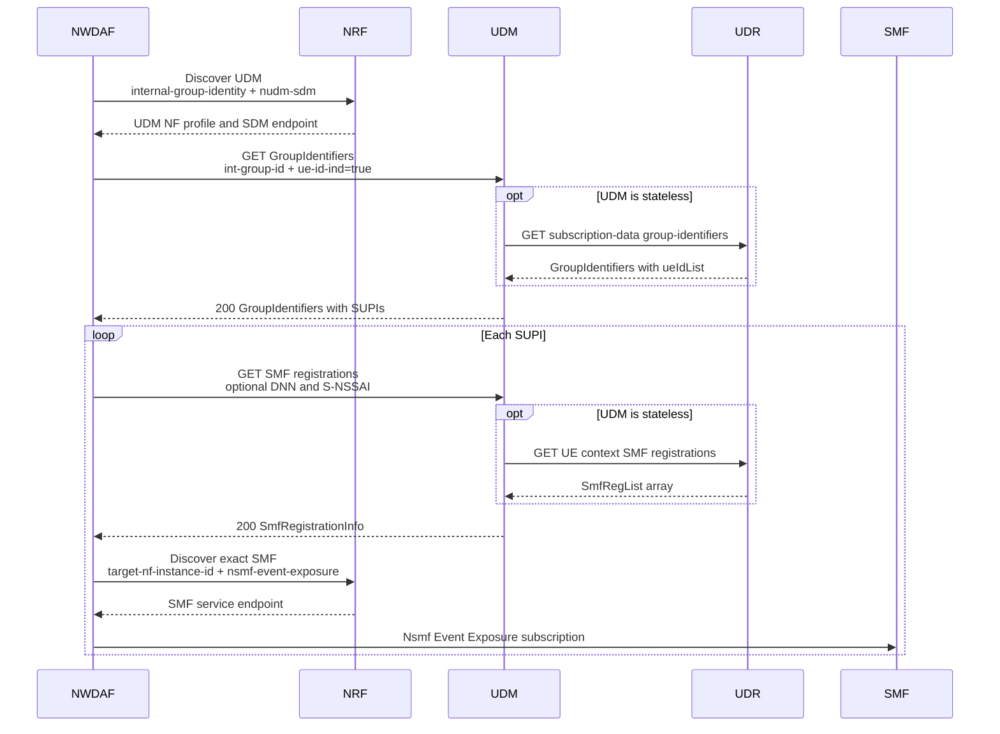

# Internal Group Resolution And Serving SMF Release 18 規格解讀

## 1. 文件目的

本文件說明 NWDAF 收到以 Internal Group ID 為 target 的
analytics subscription 後，如何依 Release 18 規格：

1. 找到服務該 group 的 UDM；
2. 將 Internal Group ID 展開為 SUPI list；
3. 找出每個 SUPI／PDU session 實際登錄的 SMF；
4. 用 `smfInstanceId` 解析正確的 SMF service endpoint；
5. 將 UDM 和 UDR 在此流程的對外與內部責任分開。

這些步驟是後續以 group + AoI 對 SMF 進行 per-SUPI UPF
Event Exposure subscription 的前置條件。本文件只解讀規格，
不決定專案的 cache TTL、retry、fixture 或 package placement。

## 2. 主要結論

- NWDAF 的標準 peer 是 UDM，不是 UDR。
- Group membership 使用 `Nudm_SDM_Get` 的 `GroupIdentifiers`
  resource；`ue-id-ind=true` 才會要求 UE identifier list。
- Internal Group ID 的字串只能識別 group，不含成員清單；無法從
  ID 本身推導 SUPIs。
- Serving SMF 不能只靠 NRF 找一個任意 SMF。NWDAF 應對每個
  SUPI 呼叫 `Nudm_UECM_Get`，取得 SMF registrations，再以
  `smfInstanceId` 向 NRF 解析該 instance 的 endpoint。
- Stateful UDM 可以在本地維護這些資料；stateless UDM 可在處理
  NWDAF request 時使用 `Nudr_DataRepository` 從 UDR 取得。
- `Nudr_GroupIDmap` 是 subscriber identity／routing information 到
  **NF Group ID** 的 mapping，不是 Internal Group ID 到 SUPI list。

## 3. Internal Group ID 本身表達什麼

TS 23.003 §28.9 規定 Internal Group ID 與 IMSI-Group Identifier
使用相同組成方式。TS 23.003 §19.9 將它分成四部分：

| 部分 | 意義 | wire format |
| --- | --- | --- |
| Group Service Identifier | 識別 group 適用的 group-related service | 4 octets，表示為 8 個 hex 字元 |
| MCC | 國家代碼 | 3 digits |
| MNC | Home PLMN 網路代碼 | 2 或 3 digits |
| Local Group ID | operator 分配的本地 group identity | 1 到 10 octets，表示為 2 到 20 個 hex 字元 |

例如：

```text
00000001-001-01-01
|      | |  |  |
|      | |  |  +-- Local Group ID: 0x01
|      | |  +----- MNC: 01
|      | +-------- MCC: 001
|      +---------- separator
+----------------- Group Service Identifier: 0x00000001
```

TS 29.571 `GroupId` 的 pattern 也直接反映這個格式：

```regex
^[A-Fa-f0-9]{8}-[0-9]{3}-[0-9]{2,3}-([A-Fa-f0-9][A-Fa-f0-9]){1,10}$
```

Group Service Identifier 不是 API service name，Local Group ID 也不是
SUPI index。這四部分共同保證 group identity 在網路內的識別
範圍，但 group membership 必須另外查詢。

規格證據：

- [TS 23.003 §28.9 Internal-Group Identifier](../../specs/TS%2023.003/28%20Numbering%2C%20addressing%20and%20identification%20for%205G%20System%20%285GS%29/28.9%20Internal-Group%20Identifier.md)
- [TS 23.003 §19.9 IMSI-Group Identifier](../../specs/TS%2023.003/19%20Numbering%2C%20addressing%20and%20identification%20for%20the%20Evolved%20Packet%20Core%20%28EPC%29/19.9%20IMSI-Group%20Identifier.md)
- [TS 29.571 Common Data OpenAPI `GroupId`](../../specs/openapi/TS29571_CommonData.yaml)

## 4. 完整角色邊界



這個圖中，NWDAF 不需要知道 UDM 是 stateful 還是 stateless。
UDM 對外保持 `Nudm_SDM` 與 `Nudm_UECM` contract；UDR 只是
stateless UDM 可使用的 repository backend。

TS 23.502 §4.15.4.5.2 並明確假設同一 Group ID 的所有
members 屬於同一 UDM。TS 23.288 §6.2.2.1 進一步說明同一
Internal Group ID 的 members 屬於同一 UDM Group ID，NWDAF
可選擇支援該 UDM Group ID 的 UDM instance。

## 5. 步驟一：發現服務 group 的 UDM

NWDAF 向 NRF 發出的 discovery 可使用：

```http
GET {nrfApiRoot}/nnrf-disc/v1/nf-instances
    ?target-nf-type=UDM
    &requester-nf-type=NWDAF
    &requester-nf-instance-id={nwdafInstanceId}
    &service-names=nudm-sdm
    &internal-group-identity=00000001-001-01-01
```

`internal-group-identity` 在 TS 29.510 中是 UDM、NSSAAF 與 TSCTSF
discovery 可使用的 query parameter。UDM NF Profile 的
`udmInfo.internalGroupIdentifiersRanges` 用 range 或 pattern 宣告自己
支援的 Internal Group IDs。`service-names=nudm-sdm` 再確保候選
UDM 實際提供 GroupIdentifiers 所屬的 service。

NRF 在此只選出 UDM，不會直接回傳 SUPI list。

規格證據：

- [TS 29.510 Nnrf NFDiscovery OpenAPI](../../specs/openapi/TS29510_Nnrf_NFDiscovery.yaml)
- [TS 29.510 Nnrf NFManagement OpenAPI `UdmInfo`](../../specs/openapi/TS29510_Nnrf_NFManagement.yaml)
- [TS 23.502 §4.15.4.5.2](../../specs/TS%2023.502/4%20System%20procedures/4.15%20Network%20Exposure/4.15.4%20Core%20Network%20Internal%20Event%20Exposure/4.15.4.5%20Exposure%20of%20Events%20from%20UPF%20for%20UPF%20Data%20Collection.md)

## 6. 步驟二：Internal Group ID 展開為 SUPIs

### 6.1 NWDAF 對 UDM

```http
GET {udmApiRoot}/nudm-sdm/v2/group-data/group-identifiers
    ?int-group-id=00000001-001-01-01
    &ue-id-ind=true
```

Request 沒有 body。`ext-group-id` 與 `int-group-id` 至少要有一個；
NWDAF 已經持有 Internal Group ID，因此使用
`int-group-id`。`ue-id-ind` 預設為 `false`，所以需要成員清單時
必須明確設為 `true`。

```json
{
  "intGroupId": "00000001-001-01-01",
  "ueIdList": [
    { "supi": "imsi-001010000000001" },
    { "supi": "imsi-001010000000002" }
  ]
}
```

`UeId.supi` 是必填；每個 item 還可帶選填的 `gpsiList`。

主要 response 語意：

| Status | 語意 |
| --- | --- |
| `200 OK` | 回傳 `GroupIdentifiers` |
| `404 Not Found` | group 或所需資料不存在，可帶 `GROUP_IDENTIFIER_NOT_FOUND` 或 `DATA_NOT_FOUND` |
| `403 Forbidden` | 帶 AF identity 的情境下 AF 無權存取 |

### 6.2 Stateless UDM 對 UDR

UDM 若不在本地保存 membership，可在處理前調用：

```http
GET {udrApiRoot}/nudr-dr/v2/subscription-data/group-data/group-identifiers
    ?int-group-id=00000001-001-01-01
    &ue-id-ind=true
```

UDR 回傳的也是 `GroupIdentifiers`。TS 29.505 的 UDR schema
多了可選的 `allowedAfIds`，UDM 負責對外提供 Nudm contract
與處理授權，不應將 UDR representation 不加區分地透傳給 NWDAF。

規格證據：

- [TS 29.503 §5.2.2.2.14 Group Identifier Translation](../../specs/TS%2029.503/5%20Services%20offered%20by%20the%20UDM/5.2%20Nudm_SubscriberDataManagement%20Service/5.2.2%20Service%20Operations/5.2.2.2%20Get/5.2.2.2.14%20Group%20Identifier%20Translation.md)
- [TS 29.503 §6.1.3.20 GroupIdentifiers resource](../../specs/TS%2029.503/6%20API%20Definitions/6.1%20Nudm_SubscriberDataManagement%20Service%20API/6.1.3%20Resources/6.1.3.20%20Resource_%20GroupIdentifiers%20%28Document%29.md)
- [TS 29.503 Nudm SDM OpenAPI](../../specs/openapi/TS29503_Nudm_SDM.yaml)
- [TS 29.505 §5.2.33 UDR GroupIdentifiers resource](../../specs/TS%2029.505/5%20Usage%20of%20Nudr_DataRepository%20Service/5.2%20Resources/5.2.33%20Resource_%20GroupIdentifiers.md)
- [TS 29.505 Subscription Data OpenAPI](../../specs/openapi/TS29505_Subscription_Data.yaml)

## 7. 步驟三：找出每個 SUPI 的 serving SMF

### 7.1 NWDAF 對 UDM

TS 23.502 §4.15.4.5.2 要求 NWDAF 對每個 SUPI 使用
`Nudm_UECM_Get`，並可提供 DNN 與 S-NSSAI 來取得對應 SMF。
Stage 3 路徑為：

```http
GET {udmApiRoot}/nudm-uecm/v1/imsi-001010000000001/registrations/smf-registrations
    ?single-nssai={"sst":1,"sd":"010203"}
    &dnn=internet
```

上例為了可讀性顯示 decoded query value；實際 HTTP URI 中
`single-nssai` 的 JSON 內容需要 percent-encode。

成功回應是 `SmfRegistrationInfo` wrapper：

```json
{
  "smfRegistrationList": [
    {
      "smfInstanceId": "11111111-2222-3333-4444-555555555555",
      "pduSessionId": 10,
      "singleNssai": { "sst": 1, "sd": "010203" },
      "dnn": "internet",
      "plmnId": { "mcc": "001", "mnc": "01" }
    }
  ]
}
```

`smfInstanceId`、`pduSessionId`、`singleNssai` 與 `plmnId` 是
`SmfRegistration` 的必填欄位；`dnn` 在 schema 中為選填。
未提供 DNN／S-NSSAI 時，UDM 可回傳該 UE 的多筆 registrations。
因此 NWDAF 不能假設第一筆永遠正確。

| Status | 語意 |
| --- | --- |
| `200 OK` | 回傳 `SmfRegistrationInfo` |
| `404 Not Found` | 沒有符合該 UE／DNN／S-NSSAI 的有效 registration |

### 7.2 Stateless UDM 對 UDR

UDM 可從 UDR 取得 UE 的所有 SMF registrations：

```http
GET {udrApiRoot}/nudr-dr/v2/subscription-data/imsi-001010000000001/context-data/smf-registrations
```

TS 29.505 此 resource 只有 `supported-features` query parameter，不接受
DNN 或 S-NSSAI 當 query filter。因此 stateless UDM 取得底層
`SmfRegList` 後，再依 NWDAF 的 Nudm request 進行對應篩選。

UDR response 的 schema 是陣列，不是 UDM 對外的 wrapper：

```json
[
  {
    "smfInstanceId": "11111111-2222-3333-4444-555555555555",
    "pduSessionId": 10,
    "singleNssai": { "sst": 1, "sd": "010203" },
    "dnn": "internet",
    "plmnId": { "mcc": "001", "mnc": "01" }
  }
]
```

UDR 的 collection GET 在成功時可回傳空陣列的 `200 OK`；UDM
對 NWDAF 的 `Nudm_UECM_Get` 則在沒有有效 registration 時要使用
`404 Not Found`。這是 UDM 不能只當成無邏輯 reverse proxy 的
具體例子。

規格證據：

- [TS 29.503 §5.3.2.5.7 SMF registration retrieval](../../specs/TS%2029.503/5%20Services%20offered%20by%20the%20UDM/5.3%20Nudm_UEContextManagement%20Service/5.3.2%20Service%20Operations/5.3.2.5%20Get.md)
- [TS 29.503 Nudm UECM OpenAPI](../../specs/openapi/TS29503_Nudm_UECM.yaml)
- [TS 29.505 §5.2.8 SmfRegistrations resource](../../specs/TS%2029.505/5%20Usage%20of%20Nudr_DataRepository%20Service/5.2%20Resources/5.2.8%20Resource_%20SmfRegistrations.md)
- [TS 29.504 Nudr DataRepository OpenAPI](../../specs/openapi/TS29504_Nudr_DR.yaml)
- [TS 29.505 Subscription Data OpenAPI](../../specs/openapi/TS29505_Subscription_Data.yaml)

## 8. 步驟四：將 SMF identity 解析成 endpoint

UDM 回傳的 `smfInstanceId` 是 NF instance identity，不是 URL。
NWDAF 再向 NRF 發出 exact-instance discovery：

```http
GET {nrfApiRoot}/nnrf-disc/v1/nf-instances
    ?target-nf-type=SMF
    &requester-nf-type=NWDAF
    &requester-nf-instance-id={nwdafInstanceId}
    &target-nf-instance-id=11111111-2222-3333-4444-555555555555
    &service-names=nsmf-event-exposure
```

NWDAF 從該 NF Profile 的 `nfServices` 取得相應 service endpoint，
才能針對該 SUPI／PDU session 建立 Event Exposure subscription。
把 group 內每個 SUPI 送給 NRF 找到的所有 SMF 會產生
Cartesian product，並不是 serving-SMF resolution。

## 9. `Nudr_GroupIDmap` 為何不是這條路徑

`Nudr_GroupIDmap` 的用途是根據 NF type 與 subscriber-related
information 取得 UDM Group ID 等 **NF Group ID**，也可查詢該 NF
Group 服務的 Routing Indicators。它回答的是「該 subscriber
應路由到哪個 NF group」，不是「該 Internal Group ID 內含哪些
UE」。

因此：

```text
Internal Group ID -> SUPI list
    use Nudm_SDM GroupIdentifiers
    UDM may internally use Nudr_DataRepository GroupIdentifiers

Subscriber/routing information -> NF Group ID
    use Nudr_GroupIDmap
```

規格證據：

- [TS 29.504 §5.3 Nudr GroupIDmap service](../../specs/TS%2029.504/5%20Services%20offered%20by%20the%20UDR/5.3%20Nudr_GroupIDmap%20Service.md)
- [TS 29.504 Nudr GroupIDmap OpenAPI](../../specs/openapi/TS29504_Nudr_GroupIDmap.yaml)

## 10. 對實驗情境的標準流程摘要

```text
Consumer subscription: Internal Group ID + AoI
  -> NWDAF discovers group-serving UDM through NRF
  -> NWDAF asks UDM for the complete SUPI list
     -> stateless UDM may retrieve membership from UDR
  -> for every SUPI, NWDAF asks UDM for SMF registrations
     -> stateless UDM may retrieve registration records from UDR
  -> NWDAF filters by DNN/S-NSSAI and keeps every relevant PDU session
  -> NWDAF resolves each smfInstanceId through NRF
  -> NWDAF subscribes to that SMF with the original AoI
  -> SMF applies AoI gating to its downstream UPF collection
```

UDR 是 free5GC 部署中 UDM 可使用的實際資料儲存者，但在
NWDAF 的標準流程圖中應放在 UDM 後方的條件分支，不應
畫成 NWDAF 直接跳過 UDM 存取 subscriber context。

## 11. 對實作的 contract 檢查點

1. UDM registration 需宣告 `nudm-sdm`、`nudm-uecm` 及適用的
   `udmInfo.internalGroupIdentifiersRanges`。
2. NWDAF 發現 UDM 時使用合法 `GroupId` wire value，不使用
   `group-G` 這類只供圖解的 label。
3. `ue-id-ind=true` 不可遺漏，否則 response 不保證含
   `ueIdList`。
4. UDR `SmfRegList` 陣列與 UDM `SmfRegistrationInfo` wrapper 分別
   decode，不建立錯誤的共用 wire type。
5. DNN／S-NSSAI filter 屬於 UDM UECM request；Release 18 UDR collection
   resource 不提供這兩個 query parameters。
6. UDR collection 空陣列的 `200` 要在 UDM 邊界轉換為符合
   Nudm 語意的 `404`。
7. `smfInstanceId` 和 SMF endpoint 分開儲存；endpoint 透過 NRF
   discovery 取得並依 validity/cache policy refresh。

## 12. 規格版本

| 規格 | 本文檢查版本 | 用途 |
| --- | --- | --- |
| TS 23.003 | V18.8.0 | Internal Group ID 組成 |
| TS 23.288 | V18.13.0 | NWDAF group data collection 原則 |
| TS 23.502 | V18.13.0 | Group -> SUPI -> serving SMF -> UPF Event Exposure 流程 |
| TS 29.503 | V18.13.0 | Nudm SDM／UECM resources 與 response semantics |
| TS 29.504 | V18.13.0 | Nudr services 與 HTTP behavior |
| TS 29.505 | V18.8.0 | UDR subscription-data resources 與 data models |
| TS 29.510 | V18.11.0 | NRF registration／discovery query |
| TS 29.571 | V18.12.0 | `GroupId` common schema |

`TS29505_Subscription_Data.yaml` 附件自身標示 V18.7.0，與 TS
29.505 主文 V18.8.0 為同一 Release 的相鄰 point release。實作
wire contract 時以該 OpenAPI 附件與對應 data-model table 交叉檢查。
