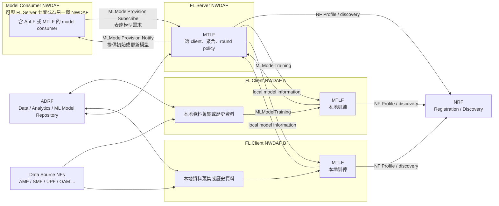
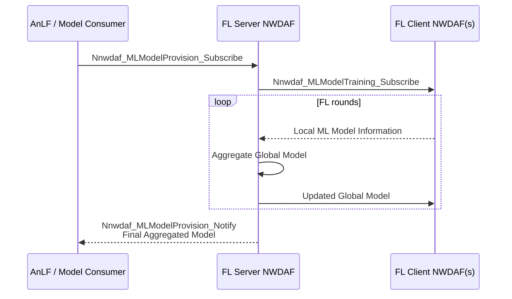
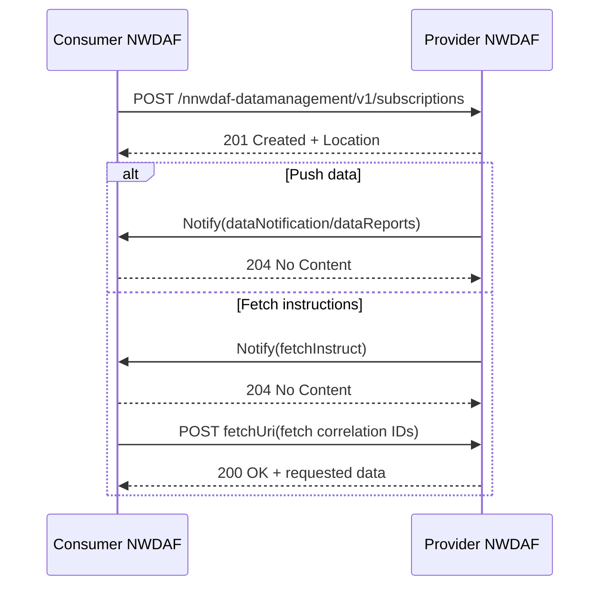
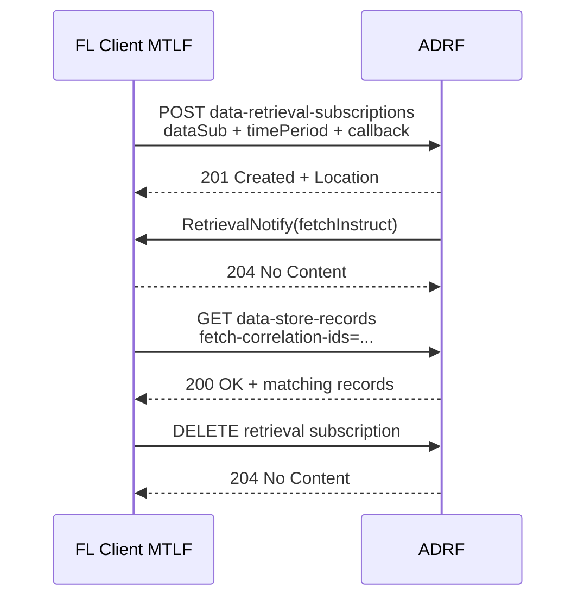
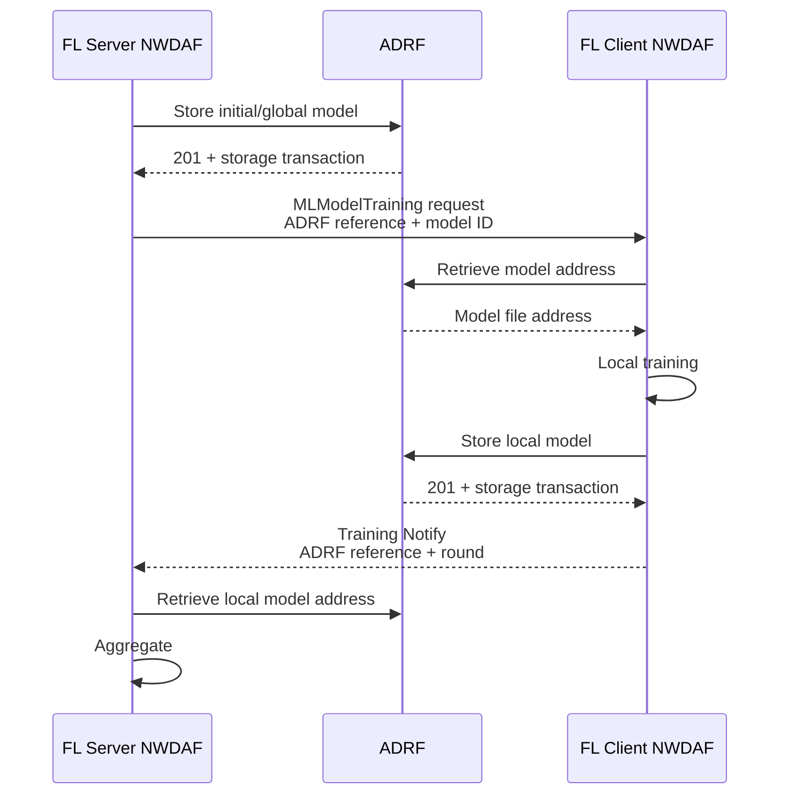
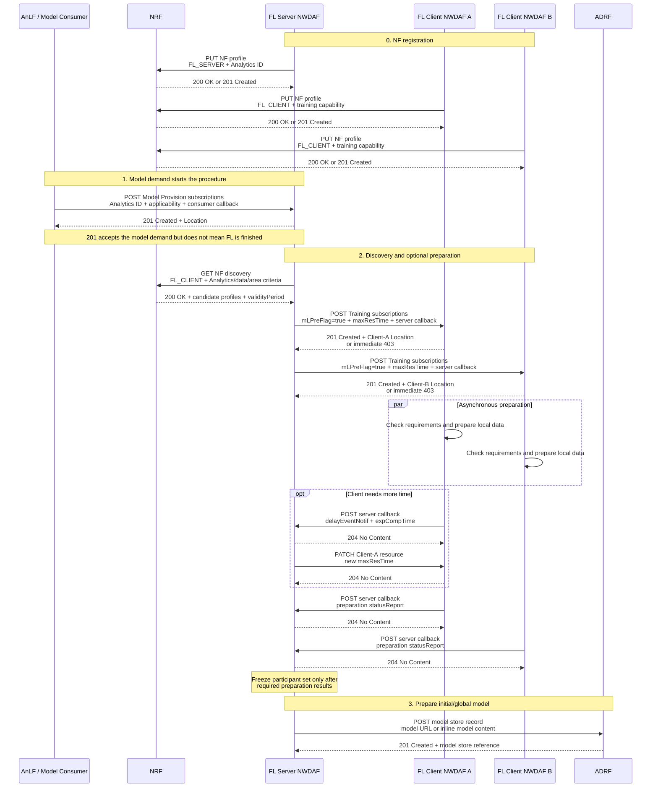
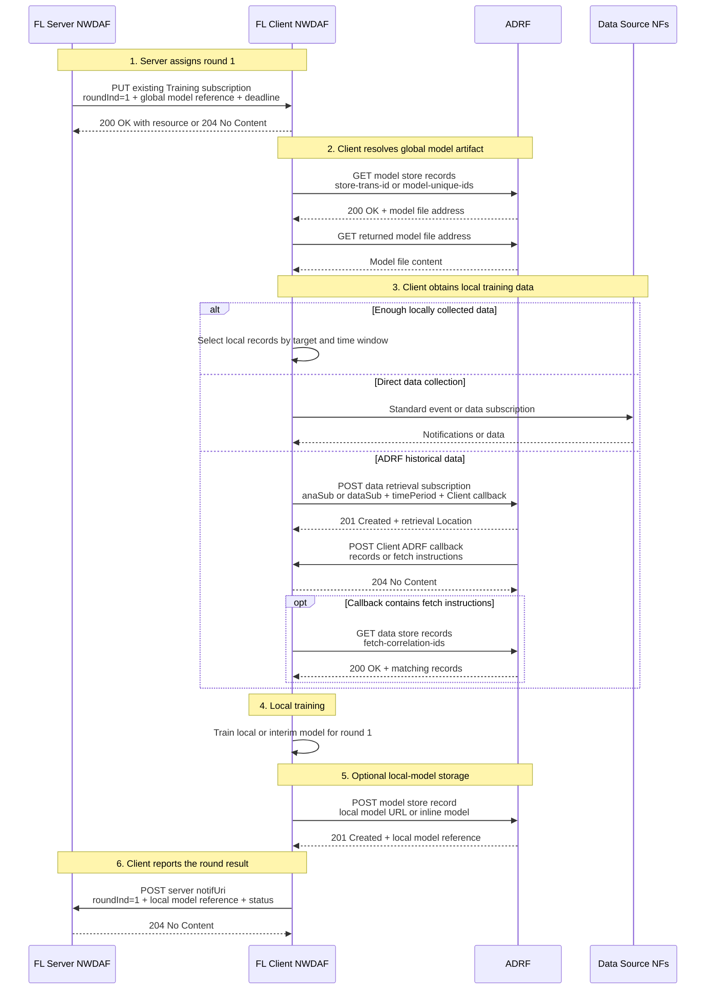
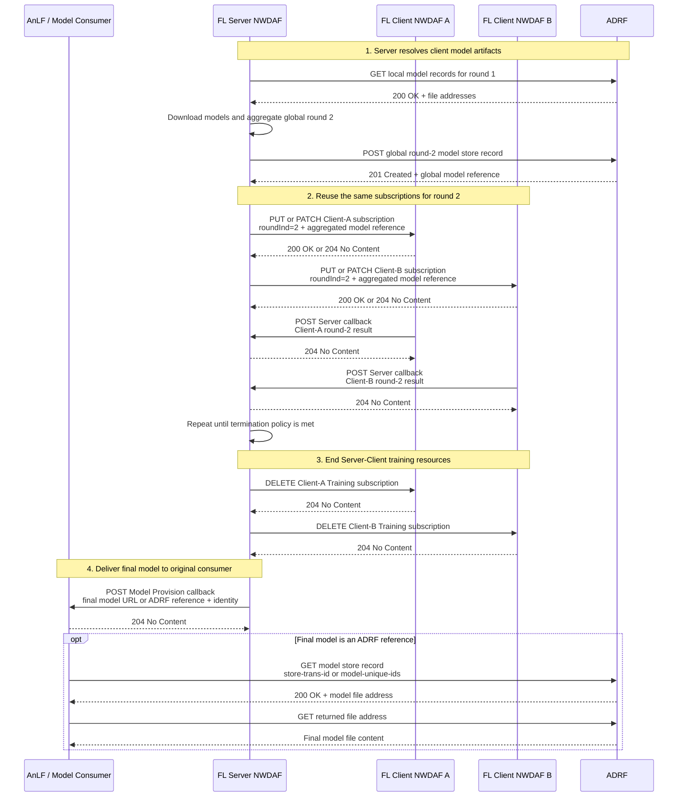

# NWDAF Federated Learning Release 18 規格解讀

## 1. 文件目的

本文件解讀 3GPP Release 18 中，NWDAF 進行 Federated Learning（FL）
時所涉及的角色、服務與端到端程序。它回答以下問題：

- FL Server NWDAF 與 FL Client NWDAF 如何向 NRF 登錄能力並找到彼此；
- `Nnwdaf_MLModelProvision` 與 `Nnwdaf_MLModelTraining` 各自負責什麼；
- FL Server 與 FL Client 能交換哪些標準資訊；
- 模型參數、梯度、更新量及 FedAvg 權重是否有標準欄位；
- FL Client 可以從哪些地方取得本地訓練資料；
- `Nnwdaf_DataManagement` 與 `Nadrf_DataManagement` 的差別；
- ADRF 如何保存資料與模型，以及它在 FL 流程中可以扮演什麼角色；
- 現有 free5GC 與本專案在實作 Release 18 FL 前有哪些規格落差。

這是一份規格解讀，不決定本專案的 FL 演算法、部署拓撲、資料拆分、
訓練排程或錯誤恢復策略。這些決策應在後續設計文件中建立。

## 2. 規格來源與判讀方式

主要依據如下：

| 層次 | 規格 | 本文件用途 |
| --- | --- | --- |
| Stage 2 | TS 23.288 Release 18 | 角色、能力、程序與資訊語意 |
| Stage 3 | TS 29.510 Release 18 | NRF registration、discovery、NF Profile |
| Stage 3 | TS 29.520 Release 18 | NWDAF 的 Model Provision、Model Training、Data Management HTTP API |
| Stage 3 flow | TS 29.552 Release 18 | 把 NWDAF 程序對應到實際 HTTP request、response、callback 與 status code |
| Stage 3 | TS 29.574 Release 18 | DCCF Data Management、Context Management 與 data collection profile API |
| Stage 3 | TS 29.575 Release 18 | ADRF 的資料與模型 repository HTTP API |
| 共通 SBI | TS 29.500、TS 29.501 | HTTP、錯誤、feature negotiation、安全等共通規則 |

本地轉換文件的主要版本為 TS 23.288 V18.13.0、TS 29.510 V18.11.0、
TS 29.520 V18.14.0、TS 29.552 V18.7.0、TS 29.574 V18.12.0 與
TS 29.575 V18.11.0。個別 OpenAPI 檔案的 `externalDocs` 可能指向同一
Release 的相鄰版本；例如目前兩份 TS 29.574 YAML 標示 V18.11.0。
若 TS prose 與 YAML 出現差異，實作 API 時應再以該 YAML 自身標示的
版本及對應 TS data-model table 交叉確認。

本文使用下列標籤：

- **規格要求**：TS 或 OpenAPI 明確要求的行為。
- **規格允許**：標準允許多種選擇，實際行為由實作、local configuration
  或 operator policy 決定。
- **規格未定義**：標準沒有定義資料格式或演算法，需要另外建立互通協議。
- **本專案現況**：描述目前 workspace/free5GC 的能力，不代表標準限制。

本地證據入口：

- [TS 23.288 §5：NWDAF functional description](../../specs/TS%2023.288/5%20Network%20Data%20Analytics%20Functional%20Description.md)
- [TS 23.288 §6.2C：Federated Learning among Multiple NWDAFs](../../specs/TS%2023.288/6%20Procedures%20to%20Support%20Network%20Data%20Analytics/6.2C%20Federated%20Learning%20among%20Multiple%20NWDAFs.md)
- [TS 23.288 §6.2F：Procedure for ML Model Training](../../specs/TS%2023.288/6%20Procedures%20to%20Support%20Network%20Data%20Analytics/6.2F%20Procedure%20for%20ML%20Model%20Training.md)
- [TS 29.552 §5.10：Federated Learning signalling flow](../../specs/TS%2029.552/5%20Signalling%20Flows%20for%20the%20Network%20Data%20Analytics%20Framework/5.10%20Federated%20Learning%20among%20Multiple%20NWDAFs.md)
- [TS 29.552 §5.6A：ML Model Training procedures](../../specs/TS%2029.552/5%20Signalling%20Flows%20for%20the%20Network%20Data%20Analytics%20Framework/5.6A%20ML%20Model%20Training%20procedures.md)
- [TS 29.510 Nnrf_NFManagement OpenAPI](../../specs/openapi/TS29510_Nnrf_NFManagement.yaml)
- [TS 29.510 Nnrf_NFDiscovery OpenAPI](../../specs/openapi/TS29510_Nnrf_NFDiscovery.yaml)
- [TS 29.520 Nnwdaf_MLModelTraining OpenAPI](../../specs/openapi/TS29520_Nnwdaf_MLModelTraining.yaml)
- [TS 29.520 Nnwdaf_DataManagement OpenAPI](../../specs/openapi/TS29520_Nnwdaf_DataManagement.yaml)
- [TS 29.574 Ndccf_DataManagement OpenAPI](../../specs/openapi/TS29574_Ndccf_DataManagement.yaml)
- [TS 29.574 Ndccf_ContextManagement OpenAPI](../../specs/openapi/TS29574_Ndccf_ContextManagement.yaml)
- [TS 29.575 Nadrf_DataManagement OpenAPI](../../specs/openapi/TS29575_Nadrf_DataManagement.yaml)
- [TS 29.575 Nadrf_MLModelManagement OpenAPI](../../specs/openapi/TS29575_Nadrf_MLModelManagement.yaml)

## 3. 先建立正確的整體心智模型

Release 18 的 NWDAF FL 不是單一介面，而是由數個彼此獨立的平面組成：



六個平面的責任如下：

| 平面 | 標準服務 | 核心責任 |
| --- | --- | --- |
| 能力與位置 | `Nnrf_NFManagement`、`Nnrf_NFDiscovery` | 宣告 FL 能力、找到候選 FL Server/Client |
| 模型需求與交付 | `Nnwdaf_MLModelProvision` | Consumer 訂閱所需模型；MTLF 提供初始或更新模型 |
| FL 協調 | `Nnwdaf_MLModelTraining` | 準備檢查、每輪模型分派、本地結果回報、延遲與終止 |
| NWDAF 間資料提供 | `Nnwdaf_DataManagement` | 從另一個 NWDAF 取得 runtime/historical data |
| 歷史資料 repository | `Nadrf_DataManagement` | ADRF 儲存、查詢、訂閱與刪除資料或 analytics |
| 模型 repository | `Nadrf_MLModelManagement` | ADRF 儲存、查詢與刪除 ML model artifacts |

最重要的邊界是：

- AnLF 在此流程中是 Model Provision consumer，不會提供模型。
  `Nnwdaf_MLModelProvision` 的 provider 是含 MTLF 的 NWDAF；
- `MLModelTraining` 傳遞的是「執行訓練所需的控制資訊與模型資訊」，
  不是通用 dataset transport。
- `DataManagement` 傳遞的是 data/analytics，不負責啟動 FL round 或聚合模型。
- ADRF 是 repository，不會因為保存模型就自動成為 FL Server。
- FL Server 與 FL Client 都是「含有 MTLF 的 NWDAF」。Python backend
  是否獨立部署，是專案內部架構，並不改變對外 NF 身分。

## 4. FL 的標準角色與基本限制

### 4.1 FL Server 與 FL Client

TS 23.288 §5.3 定義一個 FL process 包含：

- 一個含 MTLF 的 FL Server NWDAF；
- 多個含 MTLF 的 FL Client NWDAF；
- 每個 client 保有自己的 local dataset；
- server 選擇 clients、提供模型、接收 local ML model information、
  聚合 global model，並分派下一輪模型；
- client 使用本地資料訓練，向 server 回報 local ML model information，
  再接收下一輪 global model。

**規格要求：** Release 18 在此處只規範 Horizontal Federated Learning。
各 client 的資料具有相同 feature space，但樣本不同。Local dataset
不在 FL participants 之間交換或分享。

**規格允許：** 同一個 NWDAF 可以針對某個 Analytics ID 同時宣告
`FL_SERVER_AND_CLIENT`。角色是 capability，不代表每個 FL process
中它都同時執行兩種角色。

證據：

- [TS 23.288 §5.3](../../specs/TS%2023.288/5%20Network%20Data%20Analytics%20Functional%20Description.md)
- [TS 23.288 §6.2C.1](../../specs/TS%2023.288/6%20Procedures%20to%20Support%20Network%20Data%20Analytics/6.2C%20Federated%20Learning%20among%20Multiple%20NWDAFs.md)

### 4.2 AnLF 不需要知道模型是否經由 FL 訓練

AnLF 的需求仍是「取得能用於某 analytics 的模型」。MTLF 可以用本地訓練、
集中式訓練或 FL 滿足需求。TS 23.288 將 FL 決策放在 MTLF 一側，考量
Analytics ID、資料可用性、service area、privacy、configuration 等條件。

因此標準流程可形成：

1. AnLF 或另一個 model consumer 向 MTLF 訂閱模型；
2. MTLF 決定是否需要 FL；
3. 若需要，由 FL Server MTLF 協調多個 FL Client MTLF；
4. 最終模型仍透過 Model Provision 交付給原始 consumer。

這也是為什麼 Model Provision 與 Model Training 不能合併成同一條 API。

## 5. NRF：FL participants 如何找到彼此

### 5.1 NF registration

NF 使用 `Nnrf_NFManagement_NFRegister` 向 NRF 登錄 NF Profile：

```http
PUT {nrfApiRoot}/nnrf-nfm/v1/nf-instances/{nfInstanceId}
Content-Type: application/json
```

`nfInstanceId` 由 NF 自己提供，在該 PLMN 中全域唯一，格式為 UUID v4。
建立成功時：

- NRF 回覆 `201 Created`；
- response body 包含建立後的 NF Profile；
- `Location` 指向該 NF instance resource；
- NRF 回傳 heartbeat timer，NF 後續需維持註冊狀態。

NRF 必須允許規格定義的 NF type，也必須允許 custom NF type；對於
vendor-specific NF Profile attributes，NRF 應接受並保存。這不代表舊版 NRF
一定懂得用新欄位進行 matching：保存未知欄位與正確執行 Release 18
FL discovery 是兩件不同的事。

證據：

- [TS 29.510 §5.2.2.2 NFRegister](../../specs/TS%2029.510/5%20Services%20Offered%20by%20the%20NRF/5.2%20Nnrf_NFManagement%20Service/5.2.2%20Service%20Operations/5.2.2.2%20NFRegister.md)

### 5.2 NWDAF 的分析、模型提供與 FL capability profile

NRF 對 NWDAF 能力的描述分成兩層，查詢者應同時檢查：

1. `NFProfile.nfServiceList`：NF 實際註冊了哪些標準服務，以及服務的
   status、版本、scheme 和 endpoint；
2. `NFProfile.nwdafInfo`：這些服務可處理哪些 Analytics ID、模型適用
   範圍，以及是否具備 FL Server 或 FL Client 能力。

只看其中一層並不足夠。例如，只有 `mlAnalyticsList` 而沒有可用的
`nnwdaf-mlmodelprovision` service endpoint，不能據此呼叫 Model Provision；
反過來，只有 service endpoint 而未取得足夠的能力描述，也無法精確判斷
它是否適合目前的 Analytics ID、S-NSSAI、TAI 或 interoperability 條件。

| 要判斷的能力 | `nwdafInfo` 能力欄位 | 應確認的 service name |
| --- | --- | --- |
| 提供單次 analytics | `eventIds` | `nnwdaf-analyticsinfo` |
| 提供 analytics subscription | `nwdafEvents` | `nnwdaf-eventssubscription` |
| 提供某種 Analytics ID 的模型 | `mlAnalyticsList[].mlAnalyticsIds` | `nnwdaf-mlmodelprovision` |
| 擔任 FL Server | `mlAnalyticsList[].flCapabilityType=FL_SERVER` 或 `FL_SERVER_AND_CLIENT` | 依後續程序所需服務確認；若同時要取得模型，應確認 `nnwdaf-mlmodelprovision` |
| 擔任 FL Client | `mlAnalyticsList[].flCapabilityType=FL_CLIENT` 或 `FL_SERVER_AND_CLIENT` | `nnwdaf-mlmodeltraining` |

#### 5.2.1 `nwdafEvents` 與 `mlAnalyticsIds` 不代表同一項能力

這兩個欄位都可能包含 `UE_COMMUNICATION` 等相同的 `NwdafEvent` 值，
但它們宣告的是不同服務邊界：

- `nwdafEvents` 表示 `Nnwdaf_EventsSubscription` 支援哪些 analytics
  event。它回答的是「這個 NWDAF 能不能接受此類分析訂閱並提供分析結果」；
- `mlAnalyticsIds` 表示 `Nnwdaf_MLModelProvision` 支援哪些 Analytics ID
  的模型，並作為同一個 `MlAnalyticsInfo` 內 FL capability 的適用範圍。
  它回答的是「這個 NWDAF 能不能提供此類分析所需的模型，以及宣告的
  FL 能力適用於哪類分析」。

因此：

```text
nwdafEvents = ["UE_COMMUNICATION"]
  -> 宣告可提供 UE_COMMUNICATION analytics

mlAnalyticsIds = ["UE_COMMUNICATION"]
  -> 宣告可提供 UE_COMMUNICATION 所需模型，
     或其同一 MlAnalyticsInfo 內的 FL 能力適用於 UE_COMMUNICATION
```

兩者互不推導：

- 只有 `nwdafEvents`，不代表該 NWDAF 能提供或訓練模型；
- 只有 `mlAnalyticsIds`，不代表該 NWDAF 對外提供 analytics；
- 同時提供兩者，才表示它分別宣告了 analytics 與模型／FL 兩類能力，
  且仍需確認對應的 `NFService` 都已註冊。

`mlAnalyticsIds` 的名稱容易被誤讀。它不是模型實例的 ID，也不是
`modelUniqueId`；它描述的是模型所服務的 analytics 類型。實際模型 identity
要到 Model Provision 或 Model Training 程序中處理。

`mlAnalyticsList` 中的一個或多個 `MlAnalyticsInfo` 同時描述 Model
Provision filter 與 FL 能力。主要欄位為：

| 欄位 | 意義 |
| --- | --- |
| `mlAnalyticsIds` | 此組能力適用的 Analytics ID |
| `snssaiList` | 模型適用的 S-NSSAI |
| `trackingAreaList` | 模型適用的 Area of Interest/TAI |
| `mlModelInterInfo` | 模型互通允許的 vendor 列表 |
| `flCapabilityType` | `FL_SERVER`、`FL_CLIENT` 或 `FL_SERVER_AND_CLIENT` |
| `flTimeInterval` | 可參與 FL 的時間區間 |
| `nfTypeList` | client 可從哪些 NF type 蒐集本地訓練資料 |
| `nfSetIdList` | client 可從哪些 NF Set 蒐集本地訓練資料 |

同一個 `MlAnalyticsInfo` 內的 Analytics IDs 必須共享相同的其他屬性。
如果 `UE_COMMUNICATION` 與另一個 Analytics ID 的 interoperability、
FL capability 或 data source 條件不同，就必須分成不同
`MlAnalyticsInfo` entries。

若一個 NWDAF 註冊 `nnwdaf-mlmodelprovision`，並在
`mlAnalyticsIds` 宣告 `UE_COMMUNICATION`，但省略
`flCapabilityType`，代表它可提供該類 analytics 的模型，但沒有宣告任何
FL 能力。模型可能來自本地訓練或集中式訓練；提供模型本身不等於支援 FL。

概念範例一：可提供 `UE_COMMUNICATION` 模型，但不支援 FL：

```json
{
  "nwdafInfo": {
    "mlAnalyticsList": [
      {
        "mlAnalyticsIds": ["UE_COMMUNICATION"],
        "mlModelInterInfo": {
          "vendorList": ["example-vendor"]
        }
      }
    ]
  },
  "nfServiceList": {
    "model-provision-service-id": {
      "serviceInstanceId": "model-provision-service-id",
      "serviceName": "nnwdaf-mlmodelprovision",
      "versions": [
        {
          "apiVersionInUri": "v1",
          "apiFullVersion": "1.1.4"
        }
      ],
      "scheme": "http",
      "nfServiceStatus": "REGISTERED",
      "apiPrefix": "http://model-provider.example"
    }
  }
}
```

概念範例二：針對 `UE_COMMUNICATION` 擔任 FL Client：

```json
{
  "nfInstanceId": "4947a69a-f61b-4bc1-b9da-47c9c5d14b64",
  "nfType": "NWDAF",
  "nfStatus": "REGISTERED",
  "nwdafInfo": {
    "mlAnalyticsList": [
      {
        "mlAnalyticsIds": ["UE_COMMUNICATION"],
        "trackingAreaList": [
          {
            "plmnId": {"mcc": "208", "mnc": "93"},
            "tac": "000001"
          }
        ],
        "flCapabilityType": "FL_CLIENT",
        "nfTypeList": ["SMF", "UPF"]
      }
    ]
  }
}
```

兩個範例都只顯示相關片段，不是完整可註冊 NF Profile。

缺省欄位的語意不能一律解讀為「不支援」：

- `eventIds` 未提供時，對已提供的 `Nnwdaf_AnalyticsInfo` 而言表示可處理
  任意 `eventId`；
- `nwdafEvents` 未提供時，對已提供的
  `Nnwdaf_EventsSubscription` 而言表示可處理任意 `nwdafEvent`；
- 某個 `MlAnalyticsInfo` 未提供 `mlAnalyticsIds` 時，表示該 entry
  可服務任意 ML Analytics ID，且其中其他屬性必須能適用於所有
  ML Analytics ID；
- 若 NWDAF 支援跨 vendor 的 ML model interoperability，
  `mlModelInterInfo` 必須存在並以 `vendorList` 描述允許範圍；規格將
  缺少此欄位解讀為模型不允許由任何 NWDAF vendor 取回；
- `flCapabilityType` 未提供時，則明確表示該 NWDAF 不支援任何 FL
  capability type；
- 上述 wildcard 語意不會憑空建立服務。Discovery consumer 仍應以
  `service-names` 與回傳的 `nfServiceList` 確認所需服務真的存在且可用。

證據：

- [TS 29.510 `NwdafInfo`](../../specs/TS%2029.510/6%20API%20Definitions/6.1%20Nnrf_NFManagement%20Service%20API/6.1.6%20Data%20Model/6.1.6.2%20Structured%20data%20types/6.1.6.2.45%20Type%20NwdafInfo.md)
- [TS 29.510 `MlAnalyticsInfo`](../../specs/TS%2029.510/6%20API%20Definitions/6.1%20Nnrf_NFManagement%20Service%20API/6.1.6%20Data%20Model/6.1.6.2%20Structured%20data%20types/6.1.6.2.84%20Type%20MlAnalyticsInfo.md)
- [TS 29.510 `NFService`](../../specs/TS%2029.510/6%20API%20Definitions/6.1%20Nnrf_NFManagement%20Service%20API/6.1.6%20Data%20Model/6.1.6.2%20Structured%20data%20types/6.1.6.2.3%20Type%20NFService.md)
- [TS 23.288 §5.2 NWDAF Discovery and Selection](../../specs/TS%2023.288/5%20Network%20Data%20Analytics%20Functional%20Description.md)

### 5.3 Analytics 與模型提供者 discovery

`Nnrf_NFDiscovery` 提供不同的 query parameters 分別篩選 analytics
provider 與 model provider：

| 需求 | `service-names` | 能力 filter |
| --- | --- | --- |
| 找可接受 analytics subscription 的 NWDAF | `nnwdaf-eventssubscription` | `nwdaf-event-list` |
| 找可接受單次 analytics request 的 NWDAF | `nnwdaf-analyticsinfo` | `event-id-list` |
| 找可提供模型的 NWDAF | `nnwdaf-mlmodelprovision` | `ml-analytics-info-list` |

例如，要找可接受 `UE_COMMUNICATION` analytics subscription 的 NWDAF：

```http
GET {nrfApiRoot}/nnrf-disc/v1/nf-instances
    ?target-nf-type=NWDAF
    &requester-nf-type={requesterNfType}
    &service-names=nnwdaf-eventssubscription
    &nwdaf-event-list=UE_COMMUNICATION
```

要找可提供 `UE_COMMUNICATION` 模型的 NWDAF：

```http
GET {nrfApiRoot}/nnrf-disc/v1/nf-instances
    ?target-nf-type=NWDAF
    &requester-nf-type=NWDAF
    &requester-nf-instance-id={requesterNwdafId}
    &service-names=nnwdaf-mlmodelprovision
    &ml-analytics-info-list=[{"mlAnalyticsIds":["UE_COMMUNICATION"]}]
```

`ml-analytics-info-list` 使用 JSON query content；實際 HTTP request 必須依
URI 規則編碼。Consumer 還可在 `MlAnalyticsInfo` filter 中加入
S-NSSAI、TAI、model interoperability、FL role、FL time interval 和
local-training data source 條件。

NRF 回覆的是「宣告具備能力且已註冊服務的候選 NWDAF」，不會列出該
NWDAF 目前管理的模型 catalog。以下資訊不屬於 NRF model-provider
discovery 的回答：

- 目前是否已有符合完整 event filter、target UE 或 use case 的模型；
- `modelUniqueId`、generation、revision 或其他 provider 內部 identity；
- 模型 artifact、下載 URL 或 ADRF reference；
- 模型當前 accuracy、是否正在訓練或何時 promotion。

這些資訊要在選定 provider 後，由實際的
`Nnwdaf_MLModelProvision_Subscribe`、建立訂閱的 response 與後續
notification 決定。因此 discovery 與 Model Provision 的責任分界是：

```text
NRF discovery
  -> 找到宣告可提供此類模型的 provider 與 service endpoint
  -> 建立 Model Provision subscription
  -> provider 依完整訂閱條件提供現有模型、後續更新或失敗資訊
```

證據：

- [TS 29.510 Nnrf_NFDiscovery OpenAPI](../../specs/openapi/TS29510_Nnrf_NFDiscovery.yaml)
- [TS 29.520 Nnwdaf_MLModelProvision OpenAPI](../../specs/openapi/TS29520_Nnwdaf_MLModelProvision.yaml)

### 5.4 FL Server discovery

需要 FL Server 的含 MTLF NWDAF 可向 NRF 查詢：

- target NF type = `NWDAF`；
- Analytics ID；
- FL capability type = server；
- 若目的包含向該 server 取得模型，service name =
  `nnwdaf-mlmodelprovision`；
- 可選的 Time Period of Interest；
- 可選的 S-NSSAI、Area of Interest、model interoperability 等條件。

NRF 回傳符合條件的候選 NWDAF profiles，consumer 再依本地政策選擇一個。

### 5.5 FL Client discovery

FL Server 向 NRF 查詢候選 FL Clients 時，可使用：

- target NF type = `NWDAF`；
- Analytics ID；
- FL capability type = client；
- service name = `nnwdaf-mlmodeltraining`；
- service area；
- Time Period of Interest；
- client 可取得資料的 NF type 或 NF Set ID；
- ML model interoperability。

NRF discovery 不等於 client 已接受參與。它只產生候選集合；server
後續仍可執行 FL preparation，確認 client 的資料、時間、運算與模型互通條件。

**規格要求：** Release 18 中，發現 FL-capable NWDAF 的 consumer
限於另一個含 MTLF 的 NWDAF。

概念查詢：

```http
GET {nrfApiRoot}/nnrf-disc/v1/nf-instances
    ?target-nf-type=NWDAF
    &requester-nf-type=NWDAF
    &requester-nf-instance-id={flServerNwdafId}
    &service-names=nnwdaf-mlmodeltraining
    &ml-analytics-info-list=[
      {
        "mlAnalyticsIds":["UE_COMMUNICATION"],
        "flCapabilityType":"FL_CLIENT"
      }
    ]
```

### 5.6 NF discovery 的 HTTP 與 cache 語意

```http
GET {nrfApiRoot}/nnrf-disc/v1/nf-instances
    ?target-nf-type=NWDAF
    &requester-nf-type=NWDAF
    &ml-analytics-info-list=...
```

成功時 NRF 回覆 `200 OK` 與 `SearchResult`：

- `validityPeriod`；
- 符合條件的 NF profiles，或 enhanced discovery 使用的 instance map；
- 找不到時仍可回傳空集合；
- 若忽略了不支援的 query parameters，可在結果中指出。

Consumer 對相同 query 應在 `validityPeriod` 尚未到期時重用先前結果，
並避免同時送出多個相同 discovery requests。`Cache-Control: max-age`
應與 `validityPeriod` 一致。

**設計含意：** 一個通用 NRF discovery cache 可以跨 SMF、ADRF、FL
Server/Client discovery 使用，但 cache key 必須包含完整 query 語意；
不能只用 target NF type 當 key。

證據：

- [TS 29.510 §5.3.2.2 NFDiscover](../../specs/TS%2029.510/5%20Services%20Offered%20by%20the%20NRF/5.3%20Nnrf_NFDiscovery%20Service/5.3.2%20Service%20Operations/5.3.2.2%20NFDiscover.md)
- [TS 29.510 Nnrf_NFDiscovery OpenAPI](../../specs/openapi/TS29510_Nnrf_NFDiscovery.yaml)

### 5.7 ADRF 也能透過 NRF 發現

ADRF 是標準 NF type。它使用相同的 NFRegister 程序註冊，並在
`NFProfile.adrfInfoList` 中以 `AdrfInfo` 宣告：

| 欄位 | 意義 |
| --- | --- |
| `mlModelStorageInd` | 是否支援 ML model storage/retrieval |
| `dataStorageInd` | 是否支援 data/analytics storage/retrieval |

需要 ADRF 的 NWDAF 原則上應透過 NRF discovery；若 consumer 已經由
local configuration 或其他方式取得 ADRF 資訊，則可不查 NRF。Discovery
可用：

- target NF type = `ADRF`；
- `ml-model-storage-ind=true`；
- `data-storage-ind=true`；
- 可選的 S-NSSAI 等選擇條件。

這代表 FL Client 可獨立發現支援 data storage 的 ADRF，FL Server
也可獨立發現支援 model storage 的 ADRF。兩者不必把 ADRF endpoint
放進彼此的 FL sync state；但若同一個 FL process 要共用 artifact，
Training/Model Provision message 必須帶出實際 ADRF reference。

**規格允許：** 固定 endpoint 與 NRF discovery 都合法。若不同 NWDAF
被設定或選到不同 ADRFs，資料與模型不會自動同步；這是部署/選擇結果，
不能期待 NRF 替應用層合併 repository。

證據：

- [TS 23.501 §6.3.20 ADRF discovery and selection](../../specs/TS%2023.501/6%20Network%20Functions/6.3%20Principles%20for%20Network%20Function%20and%20Network%20Function%20Service%20discovery%20and%20selection/6.3.20%20ADRF%20discovery%20and%20selection.md)
- [TS 29.510 `AdrfInfo`](../../specs/TS%2029.510/6%20API%20Definitions/6.1%20Nnrf_NFManagement%20Service%20API/6.1.6%20Data%20Model/6.1.6.2%20Structured%20data%20types/6.1.6.2.122%20Type%20AdrfInfo.md)

## 6. Model Provision 與 FL 的關係

### 6.1 Model Provision 是模型需求與交付介面

`Nnwdaf_MLModelProvision` 的典型 consumer 是含 AnLF 的 NWDAF，provider
是含 MTLF 的 NWDAF。Consumer 以 Analytics ID、filter、target、使用情境、
互通資訊等條件訂閱模型；provider 可立即提供模型，也可在模型更新後再次通知。

模型可以透過以下方式描述：

- 模型檔案 URL/FQDN；
- ADRF instance/set 與 storage transaction information；
- Model Unique ID；
- validity、spatial validity、model metric、accuracy 等附加資訊。

因此它回答的是：「哪個 consumer 需要哪一類可部署模型，以及模型在哪裡。」
它不描述多個 FL Clients 如何執行 round。

證據：

- [TS 23.288 §6.2A Procedure for ML Model Provisioning](../../specs/TS%2023.288/6%20Procedures%20to%20Support%20Network%20Data%20Analytics/6.2A%20Procedure%20for%20ML%20Model%20Provisioning.md)
- [TS 29.520 Nnwdaf_MLModelProvision OpenAPI](../../specs/openapi/TS29520_Nnwdaf_MLModelProvision.yaml)

### 6.2 FL 流程中的位置

TS 23.288 §6.2C 的 general procedure 在 step 0 允許原始 model consumer
先向 FL Server NWDAF 訂閱 Model Provision。FL 完成後，FL Server
再向該 consumer 提供 final aggregated model。



Model Provision subscription 也可以先於 FL 決策存在。MTLF 收到模型需求後，
才判斷要使用本地訓練、既有模型或 FL。

### 6.3 HTTP resource model

Base path：

```text
{apiRoot}/nnwdaf-mlmodelprovision/v1
```

| 行為 | HTTP | Resource | 成功回覆 |
| --- | --- | --- | --- |
| 建立模型訂閱 | `POST` | `/subscriptions` | `201 Created`、body、`Location` |
| 更新模型訂閱 | `PUT` | `/subscriptions/{subscriptionId}` | `200 OK` 或 `204 No Content` |
| 取消模型訂閱 | `DELETE` | `/subscriptions/{subscriptionId}` | `204 No Content` |
| MTLF 提供初始/更新模型 | callback `POST` | subscription 的 notification URI | consumer 接受後 `204 No Content` |

Model Provision 是長期 subscription 時，同一個 resource 可以收到多次
model notifications；若 request 使用 one-time reporting，則只要求一次結果。
是否因每一個 FL round 都通知 AnLF，應由 Model Provision reporting condition
與 MTLF policy 決定，而不是由 Training round 自動推導。通常 intermediate
FL models 留在 Training participants，達到可提供條件的模型才交給 AnLF。

## 7. Nnwdaf_MLModelTraining 完整能力

### 7.1 誰呼叫誰

Provider 與 consumer 都是含 MTLF 的 NWDAF：

- FL Server NWDAF 是 Training service consumer；
- FL Client NWDAF 是 Training service producer；
- server 建立或更新 training subscription；
- client 透過 callback 回報準備結果、本地模型、accuracy/status、delay
  或 termination。

這個角色方向容易和一般「server 提供 API」的直覺混淆。此處的
FL Server 是 FL 協調者，但在 SBI 上是 client 所提供
`Nnwdaf_MLModelTraining` service 的 consumer。

### 7.2 HTTP resource model

Base path：

```text
{apiRoot}/nnwdaf-mlmodeltraining/v1
```

| 行為 | HTTP | Resource | 成功回覆 |
| --- | --- | --- | --- |
| 建立 training subscription | `POST` | `/subscriptions` | `201 Created`、body、`Location` |
| 完整更新 subscription | `PUT` | `/subscriptions/{subscriptionId}` | `200 OK` 或 `204 No Content` |
| 部分更新 subscription | `PATCH` | `/subscriptions/{subscriptionId}` | `200 OK` 或 `204 No Content` |
| 取消 subscription | `DELETE` | `/subscriptions/{subscriptionId}` | `204 No Content` |
| client 通知 server | callback `POST` | request 的 `notifUri` | server 接受後 `204 No Content` |

建立 request 的 `NwdafMLModelTrainSubsc` 最低要求：

- `mLEventSubscs`：至少一個要訓練的 analytics event；
- `notifUri`：client 回報結果的 callback；
- `notifCorreId`：callback correlation。

FL 使用時，`mlCorreId` 用來識別整個 FL procedure。HTTP resource
中的 `subscriptionId` 只識別 server 與特定 client 之間的 training
subscription，兩者不能互換。

### 7.3 Training request 可以表達什麼

| Stage 2 概念 | OpenAPI 欄位 | 說明 |
| --- | --- | --- |
| Analytics 與適用範圍 | `mLEventSubscs` | Analytics ID、filter、target、use-case 等 |
| Initial/global model | `mLModelInfos` | 模型 URL 或 ADRF reference，以及選填的 ID／附加資訊 |
| FL procedure identity | `mlCorreId` | 同一個 FL process 的 correlation |
| Preparation | `mLPreFlag` | `true` 表示先檢查能否參與，不執行正式 round |
| Global model accuracy check | `mLAccChkFlg` | 要求 client 以 local training data 測試 global model |
| Data availability | `mLModelTrainInfos[].dataAvReq` | 需要的 input events、統計條件、時間窗、最少樣本 |
| Time availability | `mLModelTrainInfos[].timeAvReq` | client 可用於訓練的時間要求 |
| Deadline | `mLTrainRepInfo.maxResTime` | 此次回報的最大等待時間 |
| Round | `roundInd` | 目前 iteration round |
| Target | `tgtRepUe` | group、SUPI 或 any UE 等訓練 target |
| Skip | `skipFlInd` | 要求跳過目前 round |
| Reporting/expiry | `eventReq` | immediate、one-time、periodic、expiry 等共通 reporting 資訊 |

#### 7.3.1 Stage 2 的 model file 與 Stage 3 HTTP contract

TS 23.288 §6.2F.2 在服務語意層將 `ML Model file` 列為 Training request
的選填輸入，並說明 NWDAF 可依模型大小與實作決定是否包含。這不代表
TS 29.520 已定義可單獨承載 inline model binary 的 HTTP contract。

Stage 3 的實際限制如下：

- `NwdafMLModelTrainSubsc.mLModelInfos` 與
  `NwdafMLModelTrainNotif.mLModelInfos` 都重用 Model Provision 的
  `MLEventNotif`；
- `MLEventNotif` 雖然宣告了 `mlFile` string property，但其 schema
  同時要求 `event`，並要求 `mLFileAddr` 或 `mLModelAdrf` 至少存在
  一個；
- top-level `MLEventNotif.modelUniqueId` 並非 required；正式管理的
  initial／global model 可提供 ID，FL round 的 local／interim model
  則可只靠 FL correlation identities 與 artifact URL 關聯；
- 因此只提供 `mlFile` 無法通過 Release 18 OpenAPI validation；
- Training API 的 request／notification body 使用 `application/json`，
  沒有定義 multipart 或 `application/octet-stream` 的模型 binary
  傳輸方式；
- `mlFile` 即使和必要 reference 一起出現，也沒有足夠的標準 encoding
  說明，不適合作為跨實作 contract。

因此在可互通的 Stage 3 實作中，initial／global model 與
local／interim model 都應使用：

1. `mLFileAddr` 中的 URL 或 FQDN；或
2. `mLModelAdrf` 中的 ADRF reference。

本文件不把 inline model transport 視為目前可用的 Release 18 HTTP
能力。這是 Stage 2 允許的抽象輸入與目前 Stage 3 OpenAPI 表達能力之間的
落差，不應只以模型大小或實作偏好描述。

證據：

- [TS 23.288 §6.2F](../../specs/TS%2023.288/6%20Procedures%20to%20Support%20Network%20Data%20Analytics/6.2F%20Procedure%20for%20ML%20Model%20Training.md)
- [TS 29.520 Nnwdaf_MLModelTraining OpenAPI](../../specs/openapi/TS29520_Nnwdaf_MLModelTraining.yaml)
- [TS 29.520 Nnwdaf_MLModelProvision OpenAPI](../../specs/openapi/TS29520_Nnwdaf_MLModelProvision.yaml)

概念範例：

```json
{
  "mLEventSubscs": [
    {
      "mLEvent": "UE_COMMUNICATION",
      "mLEventFilter": {
        "anySlice": true
      }
    }
  ],
  "notifUri": "http://fl-server.example/callbacks/training/client-a",
  "notifCorreId": "fl-client-a-training",
  "mlCorreId": "fl-process-2026-001",
  "mLPreFlag": false,
  "mLAccChkFlg": true,
  "mLModelTrainInfos": [
    {
      "dataAvReq": {
        "inpEvents": ["<required DccfEvent value>"],
        "minNumSamples": 1000
      }
    }
  ],
  "mLTrainRepInfo": {
    "maxResTime": 300
  },
  "roundInd": 1
}
```

這是欄位關係示意；實際 `DccfEvent` 與 event filter 必須使用對應 OpenAPI
允許的完整值與 schema。

### 7.4 Client notification 可以表達什麼

`NwdafMLModelTrainNotif` 要求 `notifCorreId`，並可包含：

| 欄位 | 意義 |
| --- | --- |
| `mlCorreId` | 所屬 FL process |
| `roundInd` | 回報哪一輪結果 |
| `mLModelInfos` | local/interim ML model information |
| `statusReport.mlModelAcc` | local model accuracy，範圍 0–100 |
| `statusReport.trainInDataInfo` | 訓練資料涵蓋區域、sampling ratio、各維度 min/max |
| `delayEventNotif` | 無法在 deadline 前完成、原因及預估剩餘時間 |
| `termTrainReq` | client 主動要求終止及原因 |

若 server 設定 `mLAccChkFlg`，client 可以用自己的 local training data
作 testing dataset，回報收到之 global model 的 accuracy。

**規格限制：** 這裡的標準 metric 在本 release 僅定義 `ACCURACY`。
專案內的 WAPE、MSE 或其他指標不能直接假裝成標準 `MLModelMetric` 枚舉；
若跨廠商需要傳遞，必須使用明確的擴充或 artifact agreement。

### 7.5 Preparation 與正式 execution

Server 可先向候選 clients 發出 `mLPreFlag=true` 的 request，確認：

- 是否支援所需 Analytics ID；
- model format/runtime 是否互通；
- 是否能取得需要的 input events；
- 是否有足夠樣本與適當時間窗；
- 是否能下載 server 提供的模型；
- 時間、運算與通訊能力是否允許參與。

Client 成功回覆不代表已完成訓練，只代表願意且能參與。Preparation
可以被省略，例如 server 已從先前 FL、NRF profile 或 local
configuration 知道 client 能力。

TS 29.520 沒有另開一支 Stage 3 `MLModelTrainingInfo` API；
它以 `MLModelTraining` 的 immediate + one-time reporting 實現
Stage 2 的 `Nnwdaf_MLModelTrainingInfo_Request` 語意。

換句話說，`MLModelTrainingInfo` 在 TS 23.288 的服務描述層是另一個
request/response service operation，但落到 TS 29.520 HTTP API 時，
不會出現第二條例如 `/nnwdaf-mlmodeltraininginfo/...` 的 path。兩種用法
共享 `/nnwdaf-mlmodeltraining/v1/subscriptions`：

| 用法 | Stage 2 語意 | Stage 3 HTTP 呈現 | 適合情境 |
| --- | --- | --- | --- |
| 持續 Training subscription | `MLModelTraining_Subscribe/Notify` | `POST` 建立 resource，client 後續對 `notifUri` 做 callback `POST`，每輪可 `PUT/PATCH` 更新，最後 `DELETE` | 多輪 FL、delay、skip、termination |
| One-time TrainingInfo | `MLModelTrainingInfo_Request/Response` | 同一個 Training API，`eventReq` 要求 immediate + one-time reporting；若結果當下可用，可在 create/update response 的 `immReport` 回傳 | preparation、單次能力/accuracy 檢查、一次訓練資訊 |

因此「one-time」描述的是 reporting requirement，不是一支額外介面。
它也不是「先建立長期訂閱，再等待第一個 callback」的同義詞：如果資料
當下可得，結果可直接跟著 `201 Created` 或 `200 OK` response 回來；
長期 subscription 則以 callback 承擔後續非同步結果。若 one-time
request 當下沒有可用結果，實際 resource 與後續通知生命週期仍須遵循
TS 29.520 的 subscription/reporting 規則，不能自行假設 HTTP response
永遠包含訓練結果。

`one-time` 只限制回報次數，不等於 TS 29.520 明文要求 provider 在第一次
回報後自動刪除 resource。Stage 3 的 `POST` 仍會建立並儲存 subscription，
回覆 `201 Created + Location`。因此有兩種合理的生命週期：

- 若它只是獨立的 TrainingInfo 查詢，consumer 收到唯一一次
  response/notification 後，可對 `Location` 做 `DELETE`，成功回
  `204 No Content`；
- 若 preparation 後會由同一個 Server–Client pair 繼續正式 FL，則不必
  先刪除；可把同一個 resource 更新成 `mLPreFlag=false`，多輪結束後再
  `DELETE`。

TS 29.520 在 `POST`、`PUT` 與 `PATCH` 都說明 immediate + one-time
reporting 可實現 `MLModelTrainingInfo`。因此 one-time result 完成後，
只要 resource 仍存在，Server 仍可更新同一個 `Location`，以新的
`roundInd` 與 reporting requirement 發起下一次 one-time request。
「One-time」結束的是本次 reporting cycle，不是永久禁止 resource
再被更新。

規格沒有在 MLModelTraining 章節明文寫出「完成 one-time report 後自動
刪除 subscription」，所以實作不應只靠這個假設避免 resource 殘留。
若 reporting information 帶 expiry，provider 也可依 expiry 清理。

本地 Release 18 corpus 已包含 TS 29.523 V18.7.0 與 official
`TS29523_Npcf_EventExposure.yaml` V18.5.0，因此
`NwdafMLModelTrainSubsc.eventReq` 所重用的 `ReportingInformation`
可以完整展開。其欄位包括：

- `immRep`；
- `notifMethod`；
- `maxReportNbr`；
- `monDur`；
- `repPeriod`；
- `sampRatio`；
- `partitionCriteria`；
- `grpRepTime`；
- `notifFlag`；
- `notifFlagInstruct`；
- `mutingSetting`。

`eventReq` 本身是 optional；省略時依 `ReportingInformation` 的 default
semantics處理。立即回報仍由 request 中的 `immRep`／其他 reporting
requirements表達，建立後的 response representation可使用
`immReport` 承載立即的 `NwdafMLModelTrainNotif`。這些 reporting欄位
只決定本次結果如何回報，不改變 `mLPreFlag` 所決定的
preparation／training工作內容。

#### 7.5.1 避免 preparation 與 execution 混淆

`mLPreFlag` 是 Client 最優先的行為分界。TS 23.288 §6.2F 明確規定，
當 ML Preparation Flag 存在時，provider NWDAF **只**檢查能否滿足
training requirements，並且在有模型資訊時可測試能否成功下載模型；
它不應開始 local model training。

Preparation 與 one-time reporting 是正交概念：

- `mLPreFlag` 決定工作內容是「只檢查」還是「正式訓練」；
- `eventReq` 的 one-time/immediate requirement 決定結果回報一次，
  或保留 subscription 供後續 notifications/updates。

因此 one-time preparation 是常見組合，但 one-time 不等於
preparation，preparation 也不必然要求建立後立即刪除 resource。

Preparation 與 execution 共用 `NwdafMLModelTrainSubsc`，所以 request
仍會出現一些看似與訓練有關、其實只是用來描述候選工作需求的欄位：

| 欄位 | Preparation 中的意義 |
| --- | --- |
| `mLEventSubscs` | 必填；說明候選 Client 需要支援哪種 analytics/model |
| `notifUri`、`notifCorreId` | 必填的 notification contract，不代表開始訓練 |
| `mlCorreId` | 關聯候選 Client 與 FL procedure，不代表 round 已開始 |
| `mLModelTrainInfos[].dataAvReq` | 檢查 input events、時間窗、最少樣本等資料需求 |
| `mLModelTrainInfos[].timeAvReq` | 檢查 Client 是否有足夠可用時間 |
| `mLModelInfos` | 選填；Client 可驗證格式及下載能力，但不能因此開始訓練 |
| `eventReq` | 控制 preparation 結果怎麼回報，不是 execution trigger |

為降低實作歧義，純 preparation request 建議：

- 必須明確送 `mLPreFlag=true`；省略時預設為 `false`；
- 省略 `roundInd`、`skipFlInd` 與正式 round-specific command；若採非同步
  preparation，可用 `mLTrainRepInfo.maxResTime` 約束 preparation result
  回報時間；
- 若只是參與能力檢查，省略 `mLAccChkFlg` 或設為 `false`；
- 只有需要確認模型可取得及互通時才提供 `mLModelInfos`；
- Client 的 dispatcher 必須先判斷 `mLPreFlag`，再決定進
  preparation handler 或 execution handler。

`mLAccChkFlg=true` 不會要求更新模型權重，但會要求 Client 使用 local
training data 計算 global model accuracy，屬於實際 evaluation workload。
因此它雖不是 training，也不適合混進只想確認 capability/data availability
的最小 preparation request。

正式開始第一輪時，Server 再對同一 resource 做 `PUT/PATCH`，明確改成
`mLPreFlag=false`，並帶 `roundInd=1`、global/initial model 與正式
reporting deadline。這次狀態轉換才是 Client 啟動 local fitting 的
execution trigger；若專案已在 preparation 凍結 dataset，正式 round
重用該 snapshot，不必重新取得資料。

#### 7.5.2 Preparation request／response／callback schema

Preparation 的核心語意不是交換一份完整的 Client capability object，而是：

```text
FL Server 提出 training requirements
  -> FL Client 在本地檢查資料、時間、運算、通訊及模型相容性
  -> Client 接受或拒絕 preparation
  -> FL Server 再從接受者中決定正式 participants
```

FL Server 使用與正式 training 相同的
`POST /nnwdaf-mlmodeltraining/v1/subscriptions`，但設定
`mLPreFlag=true`。以下是以 `UE_COMMUNICATION`、同一 Internal Group 與
TAI1 為例的 schema-shaped request：

```http
POST /nnwdaf-mlmodeltraining/v1/subscriptions
Content-Type: application/json
```

```json
{
  "mLEventSubscs": [
    {
      "mLEvent": "UE_COMMUNICATION",
      "mLEventFilter": {
        "networkArea": {
          "tais": [
            {
              "plmnId": {
                "mcc": "466",
                "mnc": "92"
              },
              "tac": "000001"
            }
          ]
        }
      },
      "modelInterInfo": "pymtlf-model-bundle-v1"
    }
  ],
  "notifUri": "http://nwdaf-c/training/preparation-callback",
  "notifCorreId": "prep-client-1",
  "mlCorreId": "fl-process-001",
  "mLPreFlag": true,
  "eventReq": {
    "immRep": false,
    "notifMethod": "ON_EVENT_DETECTION"
  },
  "tgtRepUe": {
    "intGroupIds": [
      "group-G"
    ]
  },
  "mLModelTrainInfos": [
    {
      "dataAvReq": {
        "inpEvents": [
          {
            "upfEvent": "USER_DATA_USAGE_TRENDS"
          }
        ],
        "minNumSamples": 1000,
        "timeWindows": [
          {
            "startTime": "2026-07-01T00:00:00Z",
            "stopTime": "2026-07-27T00:00:00Z"
          }
        ]
      },
      "timeAvReq": "PT10M"
    }
  ],
  "mLTrainRepInfo": {
    "maxResTime": 120
  }
}
```

這個 request 表達：

| 欄位 | Preparation 語意 |
| --- | --- |
| `mLEventSubscs` | 要求 Client 支援的 Analytics ID、filter 與 model interoperability |
| `mLPreFlag=true` | 只做能力／資料檢查，不執行 local training |
| `tgtRepUe` | 本次 training data 對應的 target UE／group |
| `dataAvReq.inpEvents` | 所需的 input event 類型；`DataAvReq` 的必要內容 |
| `dataAvReq.minNumSamples` | Server 要求的最低樣本數 |
| `dataAvReq.timeWindows` | 所需資料時間範圍 |
| `timeAvReq` | Client 需要能配合的 FL availability time |
| `mlCorreId` | 將各 Client 的 preparation resource 關聯到同一 FL process |
| `notifUri`、`notifCorreId` | 非同步結果的 callback contract |
| `eventReq` | 本例要求以 callback 非同步回報；若改成 `immRep=true`，結果已可用時可在 response 立即回報 |
| `mLTrainRepInfo.maxResTime` | Server 要求 Client 在此秒數內回報 preparation 結果、delay 或 termination |

若 Server 還要確認 Client 能否下載及解析共同 base model，可另外提供
`mLModelInfos`。只想確認 capability 與 data availability 時則可省略，
避免 preparation 先產生不必要的 model transfer。

Client 能滿足要求時，Stage 3 建立 resource 並回：

```http
HTTP/1.1 201 Created
Location: /nnwdaf-mlmodeltraining/v1/subscriptions/prep-sub-1
Content-Type: application/json
```

Response body 是建立後的 `NwdafMLModelTrainSubsc` representation；至少
仍會包含 request 的必要 subscription fields。若 `eventReq` 要求
immediate reporting 且結果已可用，response 還可在 `immReport` 中包含
`NwdafMLModelTrainNotif`：

```json
{
  "mLEventSubscs": [
    {
      "mLEvent": "UE_COMMUNICATION",
      "mLEventFilter": {
        "networkArea": {
          "tais": [
            {
              "plmnId": {
                "mcc": "466",
                "mnc": "92"
              },
              "tac": "000001"
            }
          ]
        }
      },
      "modelInterInfo": "pymtlf-model-bundle-v1"
    }
  ],
  "notifUri": "http://nwdaf-c/training/preparation-callback",
  "notifCorreId": "prep-client-1",
  "mlCorreId": "fl-process-001",
  "mLPreFlag": true,
  "eventReq": {
    "immRep": false,
    "notifMethod": "ON_EVENT_DETECTION"
  },
  "mLTrainRepInfo": {
    "maxResTime": 120
  }
}
```

這個 `201` 只確認 Client 已接受建立 preparation subscription resource，
並願意開始處理 preparation；它不代表 ADRF retrieval、dataset snapshot
或其他耗時檢查已經完成。Client 在背景完成檢查後，對 request 的
`notifUri` 發送：

```http
POST /training/preparation-callback
Content-Type: application/json
```

```json
{
  "notifCorreId": "prep-client-1",
  "mlCorreId": "fl-process-001",
  "statusReport": {
    "trainInDataInfo": {
      "areaInfo": {
        "tais": [
          {
            "plmnId": {
              "mcc": "466",
              "mnc": "92"
            },
            "tac": "000001"
          }
        ]
      },
      "samplRatio": 100
    }
  }
}
```

Server 接受 notification 後回 `204 No Content`。若 request 使用
`immRep=true` 且相同結果在建立 resource 時已經可用，Client 才可把這份
`NwdafMLModelTrainNotif` 放進 create response 的 `immReport`，不必再送
相同 callback。

`NwdafMLModelTrainSubsc` 與 `NwdafMLModelTrainNotif` 都沒有標準
`ready` 或 `join: true/false` 欄位。因此使用 callback 的實作必須以
resource 所在的 expected stage 解讀 notification：

```text
201 Created
  -> preparation resource 已建立，背景檢查可以開始

statusReport callback while waiting for PREPARATION_RESULT
  -> preparation completed
  -> Client 成為可供 Server 選擇的候選者
  -> 不代表 Server 已將它選入最終 participant set

403 / 500 before resource creation
  -> Client 已能立即判定無法接受本次 preparation

termTrainReq after resource creation
  -> Client 在非同步準備期間判定無法完成
```

其中「在 `PREPARATION_RESULT` stage 收到有效 `statusReport` 且沒有
`delayEventNotif`／`termTrainReq`，即視為 preparation completed」是使用
標準 schema 建立的 orchestration rule；規格沒有另外定義 `READY` 欄位。
這個規則不得以新增非標準 SBI property 表達。

若 Client 無法滿足 training requirements，可回：

```http
HTTP/1.1 403 Forbidden
Content-Type: application/problem+json
```

```json
{
  "status": 403,
  "cause": "ML_MODEL_TRAINING_REQS_NOT_MET",
  "detail": "The requested training data or availability requirement cannot be met."
}
```

其他標準 cause 包括 `ML_TRAINING_NOT_COMPLETE`、`OVERLOAD` 與
`NOT_AVAILABLE_FOR_FL_PROCESS_ANYMORE`。若所有 requested events 都沒有
可用 training，使用 `500` 與
`UNAVAILABLE_ML_MODEL_TRAINING_FOR_ALLEVENTS`。多 event request 只有部分
失敗時，成功 representation 可透過 `failEventReports` 表達失敗項目。

Preparation response 也不是完整的資源盤點介面：

- `TrainDataInfo` 可回報 area、sampling ratio 及資料各維度 min/max；
- 它沒有 exact available sample count；
- 它沒有 GPU、RAM、CPU、頻寬或其他通用 compute capability schema；
- `minNumSamples` 是 Server 的需求；Client 成功完成 preparation 代表它
  判斷可滿足，不等於 `201` 或 callback 直接回傳精確數量；
- 真正用於 sample-weighted FedAvg 的 exact training sample count，仍需
  由每輪 local model artifact agreement 提供。

因此 `201` 表示 Client 接受建立及處理 preparation resource；
preparation 是否完成由 immediate report 或後續 notification 表達。
Client 是否進入正式 participant set，仍由 FL Server 的 selection policy
決定，標準未固定該 policy。

#### 7.5.3 Preparation deadline 與延期

Server 可在 preparation subscription 提供
`mLTrainRepInfo.maxResTime`，要求 Client 在該秒數內回報完成、delay 或
termination。Client 若預期無法準時完成，可在 deadline 前送：

```json
{
  "notifCorreId": "prep-client-1",
  "mlCorreId": "fl-process-001",
  "delayEventNotif": {
    "delayEventInd": true,
    "delayCause": "NEED_MORE_TIME",
    "expCompTime": 60
  }
}
```

Server 回 `204 No Content` 後，再決定是否對同一 `Location` 做 PATCH：

```json
{
  "mLTrainRepInfo": {
    "maxResTime": 90
  }
}
```

Client 不得因為送出 delay notification 就自行假設延期已成立；只有收到
Server 的成功 update 後，新的 response window 才生效。Preparation
notification 通常省略 `roundInd`。

TS 29.552 §5.10.2.1 step 4c 明確規定正式 training 可使用 delay
notification 與新的 maximum response time。Preparation procedure 沒有
同等明確地逐步描述延期，但 TS 29.520 的同一 subscription／patch／notify
schema 沒有限制 `mLPreFlag=true` 時使用上述欄位。因此 preparation
沿用相同機制是 standards-shaped orchestration policy，不應誤稱為規格
定義的獨立 preparation deadline procedure。

`maxResTime` 是 duration，不是絕對 timestamp。為避免 callback 正在傳輸
時 Server 已 timeout，Client 應使用較短的 effective deadline：

```text
client effective deadline
  = accepted time + maxResTime - safety margin
```

safety margin 應涵蓋 callback request、可能的 retry，以及 delay
notification 後 `204 + PATCH + 200/204` 的往返時間。Server 從成功收到
create／update response 後開始自己的 watchdog；Client 從接受該工作後
開始本地 monotonic timer。Client 應在 effective deadline 前回報成功、
delay 或 termination，Server 也應限制 extension 次數或總等待時間。

### 7.6 每輪 execution

一個典型 round：

1. Server 向已選 clients 建立或更新 training subscription；
2. request 帶 initial/global model、desired metric、deadline 與 round ID；
3. Client 從自己的 local data source 取得資料；
4. Client 在本地訓練；
5. Client 回報 local ML model information 與可選 status report；
6. Server 收集更新並形成 aggregated global model；
7. Server 將 aggregated model 放入下一輪 request；
8. 重複直到 server 的 termination policy 成立。

在沒有 delay 或 termination 的正常路徑，一次正式 round assignment
對應一筆 local-model result callback。未設定 one-time 的意義是
subscription resource 可以繼續存在並接受下一次 `PUT/PATCH`，不是要求
Client 在同一輪重複回報相同結果：

```text
POST create subscription
  → round 1 result callback
PUT/PATCH same subscription with roundInd=2
  → round 2 result callback
PUT/PATCH same subscription with roundInd=3
  → round 3 result callback
DELETE subscription
```

一輪仍可能出現多於一個 callback，例如 Client 先送
`delayEventNotif`，延長 deadline 後再送 `mLModelInfos`；Client 也可能
以 `termTrainReq` 提前終止。因此 Server 應依 `mlCorreId + roundInd`
與 notification 內容分類，而不能假設每輪在網路與錯誤情境下永遠恰好
只收到一個 HTTP request。

若選擇 one-time-per-round，也可使用相同 resource：

```text
POST one-time round 1
  → one round-1 result
PUT/PATCH one-time round 2
  → one round-2 result
```

每次 `PUT/PATCH` 都是新的單次 reporting cycle。這條路徑符合
TrainingInfo 的 request/response 風格；長期 subscription 則更自然地
表達 multi-round coordination、delay 與 termination callbacks。

One-time cycle 中若 Client 先回 `delayEventNotif`，不能在同一個
notification 同時附 `mLModelInfos`；TS 29.520 將兩者定義為互斥。
TS 23.288 §6.2C.2.2 step 4a 的處理方式是由 Server 再送一次 request，
以相同 `roundInd` 提供新的 `maxResTime`，或要求 skip/terminate：

```text
Server → one-time request, roundInd=1
Client → delayEventNotif, roundInd=1
Server → PUT/PATCH, roundInd=1 + new maxResTime
Client → final mLModelInfos, roundInd=1
```

第二次 `PUT/PATCH` 重新開啟單次 reporting cycle；它不是下一個 FL
round。若 Server 收到 delay 後沒有延長、skip 或 terminate，Client
不應自行把已完成/逾期的 one-time interaction 當成仍可任意追加第二筆
結果。這個額外協調成本也是 multi-round FL 較適合長期 subscription
callback 模式的原因。

即使沒有 one-time requirement，`delayEventNotif` 也不會自動修改
deadline。Server 仍應對同一 resource 與同一 `roundInd` 做
`PUT/PATCH`，提供新的 `maxResTime`，或明確要求 skip/terminate。
差別只在於：one-time 模式的 update 同時重新開啟單次 reporting cycle；
長期 subscription 的 update 則只需更新目前 round 的協調狀態，不需要
重新取得「再回報一次」的資格。

**規格允許：** Server 可在每收到一個 client update 時更新 global model，
也可以等待所有 clients。Deadline 到期時，可只聚合已收到的 updates、
延長 deadline、要求特定 client skip，或終止。

#### 7.6.1 Round 1 的 schema 傳輸範例

假設 preparation 已完成，FL Server 要求 Client A 以 initial/global
model `101` 執行第一輪訓練：

```http
POST https://client-a.example/nnwdaf-mlmodeltraining/v1/subscriptions
Content-Type: application/json
```

```json
{
  "mLEventSubscs": [
    {
      "mLEvent": "UE_COMMUNICATION",
      "mLEventFilter": {
        "anySlice": true
      },
      "tgtUe": {
        "intGroupIds": ["00000001-001-01-01"]
      }
    }
  ],
  "notifUri": "https://fl-server.example/callbacks/training/client-a",
  "notifCorreId": "server-client-a-training",
  "mlCorreId": "fl-process-2026-001",
  "mLModelInfos": [
    {
      "event": "UE_COMMUNICATION",
      "modelUniqueId": 101,
      "mLFileAddr": {
        "mLModelUrl": "https://fl-server.example/models/global-101"
      }
    }
  ],
  "mLPreFlag": false,
  "mLAccChkFlg": false,
  "mLTrainRepInfo": {
    "maxResTime": 300
  },
  "roundInd": 1,
  "tgtRepUe": {
    "intGroupIds": ["00000001-001-01-01"]
  }
}
```

Client 建立 subscription 後回：

```http
HTTP/1.1 201 Created
Location: https://client-a.example/nnwdaf-mlmodeltraining/v1/subscriptions/sub-client-a
Content-Type: application/json
```

Response body 是建立後的 `NwdafMLModelTrainSubsc` representation。Client
下載模型、取得 local dataset 並完成訓練後，向 `notifUri` 回報：

```http
POST https://fl-server.example/callbacks/training/client-a
Content-Type: application/json
```

```json
{
  "notifCorreId": "server-client-a-training",
  "mlCorreId": "fl-process-2026-001",
  "roundInd": 1,
  "mLModelInfos": [
    {
      "event": "UE_COMMUNICATION",
      "mLFileAddr": {
        "mLModelUrl": "https://client-a.example/models/fl-process-2026-001/round-1/local"
      }
    }
  ],
  "statusReport": {
    "mlModelAcc": 84,
    "trainInDataInfo": {
      "samplRatio": 80,
      "minValues": ["0.0", "0.0"],
      "maxValues": ["125.4", "900.0"]
    }
  }
}
```

FL Server 接受 callback 後回 `204 No Content`。下一輪通常不建立新的
subscription，而是對 Client A 已有的
`/subscriptions/sub-client-a` 使用 `PUT` 或 `PATCH`，更新
`mLModelInfos` 與 `roundInd`。

這裡要區分兩種回傳：

- `POST /subscriptions` 的 `201 Created` 是 subscription 建立結果，
  不是 round-1 training result；只有使用 immediate reporting 且結果已可用
  時，create response 才可能在 `immReport` 帶立即結果。
- Client 對 `notifUri` 的 callback 才是非同步事件。第一個 callback
  通常會是 round-1 local model，但也可能先是 delay、status 或
  termination notification，不能以「第幾個 callback」判定其種類。

最直接的 FL resource mapping 是：每個 FL Server–Client pair 建立一個
長期存在的 Training subscription，由 `mlCorreId` 關聯整個 FL process；
每輪以 `PUT`/`PATCH` 更新 model、deadline 與 `roundInd`，Client 每輪
callback 一次或多次，完整 FL 結束後才 `DELETE`/Unsubscribe。規格沒有
強迫實作者禁止每輪重建 subscription，但那會製造多餘 resource lifecycle，
也失去既有 update API 的用途。

一般標準情境也可以先把模型保存至 ADRF，再以 `mLModelAdrf` 傳遞：

```json
{
  "event": "UE_COMMUNICATION",
  "modelUniqueId": 201,
  "mLModelAdrf": {
    "adrfId": "9e30077d-5244-4b4c-bb7f-7ea724cf5f98",
    "storTransId": "store-local-client-a-round-1"
  }
}
```

ADRF storage schema 要求每個 stored model 具有 `modelUniqueId`，因此
如果實作選擇把 round local model 存入 ADRF，就必須先將它正式編號。
`modelUniqueId` 識別 stored model；`storTransId` 識別 ADRF storage
record；`roundInd` 則是 FL iteration，三者語意不同。

這是標準允許的 transport alternative。若不用 ADRF，Training API 也允許
以 `mLFileAddr` 指向模型；此時 top-level `modelUniqueId` 仍是選填。

### 7.7 Delay、skip 與 termination

Client 預期無法在 `maxResTime` 內完成時，應在 deadline 前送
Delay Event Notification，可帶：

- `ML_MODEL_TRAIN_FAILURE`；
- `NEED_MORE_TIME`；
- `OTHERS`；
- 可選的 expected completion time。

Server 可：

- 更新同一 round 的 `maxResTime`；
- 用 `skipFlInd` 要求跳過該輪；
- 終止 client 的 training subscription；
- 在下一輪重新選擇 participants。

TS 29.552 §5.10.2.1 step 4c 明確描述：Client 通知無法在原
maximum response time 內完成後，Server 可提供新的 maximum response
time，否則可要求該 Client 跳過本 iteration。Client 送出 delay 只是提出
狀態與預估，不會自行延長 deadline；新的期限要等 Server 成功更新同一
resource 才生效。

實作時 Client 不應把 `maxResTime` 的最後一秒當成本地送出時間。Client
應扣除可配置 safety margin，預留 notification 傳輸、retry 與 Server
回送 PATCH 的時間。Server 則以收到 create／update success response
為 watchdog 起點，並以實際收到 callback 的時間判斷是否逾期。

Client 也可以因 overload 或 availability change 主動離開。Server
可以透過 NRF 的 NF status 變化重新發現、加入或移除 clients。

Client 離開不是只能靠重複 polling NRF。標準提供三種互補訊號：

1. Client 正常主動離開時，向 server 發
   `Nnwdaf_MLModelTraining_Notify`，在 `termTrainReq` 帶
   `NWDAF_OVERLOAD`、`NOT_AVAILABLE_ML_TRAIN` 或 `OTHERS`。
2. Server 可使用 `Nnrf_NFManagement_NFStatusSubscribe` 訂閱現有
   client 的狀態；NRF 以 `NFStatusNotify` 主動通知 availability 或
   FL capability 變化，不需要 server 不斷查詢。
3. 若 client crash、網路中斷，來不及送 termination，server 仍可由
   NRF 狀態變化或 training deadline 未收到回報判定異常，再於 round
   邊界重新 discovery/reselection。

Client 若仍正常註冊、仍宣告 FL capability，只是決定退出某一個特定
FL process，NRF profile 不足以表達這件事；這時
`MLModelTraining_Notify(termTrainReq)` 才是正確的 process-level 訊號。

### 7.8 標準錯誤語意

除共通 SBI errors 外，TS 29.520 對 Training 建立/更新定義：

| 狀況 | HTTP | Cause |
| --- | --- | --- |
| 所有 requested events 都沒有 training | `500` | `UNAVAILABLE_ML_MODEL_TRAINING_FOR_ALLEVENTS` |
| training requirements 不滿足 | `403` | `ML_MODEL_TRAINING_REQS_NOT_MET` |
| training 尚未完成 | `403` | `ML_TRAINING_NOT_COMPLETE` |
| provider overload | `403` | `OVERLOAD` |
| 不再能參與 FL | `403` | `NOT_AVAILABLE_FOR_FL_PROCESS_ANYMORE` |

證據：

- [TS 29.520 §4.6 Nnwdaf_MLModelTraining](../../specs/TS%2029.520/4%20Services%20offered%20by%20the%20NWDAF/4.6%20Nnwdaf_MLModelTraining%20Service.md)
- [TS 29.520 Nnwdaf_MLModelTraining OpenAPI](../../specs/openapi/TS29520_Nnwdaf_MLModelTraining.yaml)

## 8. 模型、參數、梯度與 FedAvg：標準到底傳了什麼

### 8.1 標準化的是 envelope，不是學習框架格式

TS 23.288 將 client 回報內容稱為 local ML Model information，並說明它是
server 建立 aggregated model 所需的資訊。`MLEventNotif` 能指向：

- model URL/FQDN；
- ADRF 中的 model record；
- 選填的 model unique ID；
- validity、filter、target、metric 等 metadata。

3GPP 沒有定義 PyTorch `state_dict`、TensorFlow checkpoint、ONNX training
state、gradient tensor 或 parameter delta 的 wire format。Model
interoperability information 也是 vendor-specific，格式和值不由 3GPP
標準化。

因此應分成兩層：

```text
3GPP standard envelope
  ├── FL process / subscription / round / model identity
  ├── URL or ADRF reference
  ├── standard accuracy/status/delay metadata
  └── artifact location

Implementation-specific model artifact
  ├── full parameters, parameter delta, or gradients
  ├── model architecture and tensor names/shapes/dtypes
  ├── optimizer/scaler state if required
  ├── sample count or aggregation weight if required
  └── integrity/version/compatibility manifest
```

### 8.2 可以傳梯度嗎

結論分三層：

- **沒有標準 gradient 欄位。**
- **規格沒有禁止 artifact 內容是 gradients/deltas。**
- 只有在 server/client 已有共同的 interoperability contract 時，才能把
  gradients/deltas 放在 model artifact 中；這不是跨廠商自動互通能力。

所以若目標是標準 FedAvg，最容易互通的做法是 artifact 帶完整模型參數，
server 依雙方協議聚合。要傳 gradients、compressed updates、
secure-aggregation shares 或 optimizer state，都需要額外 artifact contract。

### 8.3 Sample-weighted FedAvg 的缺口

`TrainDataInfo` 有 sampling ratio、area、min/max，但沒有標準的 exact
`numSamples` 或 `aggregationWeight` 欄位。因此：

- 等權平均可不需要額外欄位；
- 依精確樣本數加權的 FedAvg，需要在 artifact manifest 或 vendor extension
  傳遞樣本數；
- server 不能把 sampling ratio 當作精確樣本數，除非專案明確定義其語意。

`samplRatio` 的標準語意是「可用資料中，實際拿來訓練模型的百分比」，
範圍為 0–100。例如 Client A 有 10,000 筆符合條件的 available data，
實際抽取 8,000 筆訓練，則可回報 `80`。

它不是：

- train/validation split ratio；
- exact sample count；
- 該 client 在 FedAvg 中的 aggregation weight；
- 資料品質或準確率。

「available data」的母集合如何形成、sampling 方法與 validation split
方式，仍是實作決策。

### 8.4 Model metric 的限制

Release 18 的 `MLModelMetric` 僅定義 `ACCURACY`。這不表示只能使用
accuracy 訓練或做 promotion，而是標準 envelope 只保證這個 metric
名稱可互通。Loss、WAPE、MSE、F1、degradation score 等：

- 可留在 local training log；
- 可放進 implementation-specific artifact manifest；
- 或透過標準允許的 vendor extension；
- 不應硬塞進 `ACCURACY` 並改變其語意。

## 9. FL Client 的 dataset 從哪裡來

### 9.1 標準允許的來源

Client 的 local dataset 可來自：

1. NWDAF 已經保存的本地資料；
2. NWDAF 直接向 AMF、SMF、UPF、NRF、OAM、AF 等 data source 蒐集；
3. 向另一個 NWDAF 使用 `Nnwdaf_DataManagement` 取得；
4. 向 ADRF 使用 `Nadrf_DataManagement` 取得歷史資料；
5. 經 DCCF/MFAF 協調的資料蒐集路徑。

如果 client 已有足夠資料，規格允許略過新的資料蒐集。若是 UE-related
資料，標準流程仍可能涉及 user consent；實驗環境如何簡化是後續設計決策，
不是 FL API 自動免除的條件。

### 9.2 FL 的資料隔離邊界

「可用 DataManagement 取得資料」與「FL 不交換 local datasets」並不矛盾：

- Client 可以為了建立自己的 local dataset，向它被允許使用的 NWDAF、
  ADRF 或 data source 取資料；
- 但 FL Server 不應利用 DataManagement 把所有 clients 的 local
  training datasets 集中到 server，再稱為 FL；
- Server 收到的是 local model information 與有限的 training-data
  characteristics，不是原始 local dataset。

Dataset 的實際地理或 NF ownership 仍需由部署、授權、consent 與
data collection topology 保證。

### 9.3 DCCF/MFAF 在本文件中的位置

DCCF 是 data collection coordination function；MFAF 是與 messaging
framework 交互的 adaptor。它們能：

- 代表 consumer 找到或訂閱 data sources；
- 將一份蒐集結果分送到多個 notification endpoints；
- 套用 formatting/processing instructions；
- 將資料保存到 ADRF；
- 使用 fetch instructions 交付大型結果；
- 協助 consumer 取得 historical data。

TS 29.574 進一步把 DCCF 的 Stage 3 邊界具體化：

| Service | 主要標準 resource/operation | 用途 |
| --- | --- | --- |
| `Ndccf_DataManagement` | analytics subscriptions、data subscriptions、notifications、fetch、subscription transfer | 由 DCCF 協調 analytics/data subscription，通知 consumer，或以 fetch correlation ID 延後取回資料 |
| `Ndccf_ContextManagement` | create/update/delete data collection profile | 讓 NWDAF 或 ADRF 登錄已存在的 data collection context，供 DCCF 判斷是否能重用既有蒐集 |

這些 API 補足「DCCF 能做什麼」的 resource、欄位與 HTTP 證據，但沒有把
DCCF 變成 FL participant，也沒有規定 FL client 必須透過 DCCF 取得資料。

它們不是 FL Server，也不聚合模型。規格允許 FL Client NWDAF 直接向
data source、另一個 NWDAF 或 ADRF 取資料，不要求所有 FL 部署都必須
使用 DCCF/MFAF；是否導入這一層取決於是否需要跨 consumer 重用資料蒐集、
格式轉換或 messaging framework。

證據：

- [TS 23.288 §5A Data Collection Coordination and Delivery](../../specs/TS%2023.288/5A%20Data%20Collection%20Coordination%20and%20Delivery%20Functional%20Description.md)
- [TS 23.288 §6.2.6.3 Data Collection using DCCF](../../specs/TS%2023.288/6%20Procedures%20to%20Support%20Network%20Data%20Analytics/6.2%20Procedures%20for%20Data%20Collection/6.2.6%20Enhanced%20Procedures%20for%20Data%20Collection/6.2.6.3%20Data%20Collection%20using%20DCCF/README.md)
- [TS 29.574 §4.2 Ndccf_DataManagement](../../specs/TS%2029.574/4%20Services%20offered%20by%20the%20DCCF/4.2%20Ndccf_DataManagement%20Service/README.md)
- [TS 29.574 §4.3 Ndccf_ContextManagement](../../specs/TS%2029.574/4%20Services%20offered%20by%20the%20DCCF/4.3%20Ndccf_ContextManagement%20Service.md)
- [Ndccf_DataManagement OpenAPI](../../specs/openapi/TS29574_Ndccf_DataManagement.yaml)
- [Ndccf_ContextManagement OpenAPI](../../specs/openapi/TS29574_Ndccf_ContextManagement.yaml)

## 10. Nnwdaf_DataManagement 是什麼

### 10.1 它不是 NWDAF 的本地 database API

`Nnwdaf_DataManagement` 是「一個 NWDAF 對另一個 NWDAF/DCCF
提供 runtime 或 historical data」的標準 SBI。使用原因可以是：

- analytics generation；
- model training；
- 再對其他 NWDAF 暴露資料；
- DCCF 統一收集與轉送。

Provider NWDAF 可用自己已保存的資料，也可再向 NFs、其他 NWDAFs、
DCCF 或 ADRF 遞迴收集。

證據：

- [TS 23.288 §6.2.6.2 Procedure for Data Collection from NWDAF](../../specs/TS%2023.288/6%20Procedures%20to%20Support%20Network%20Data%20Analytics/6.2%20Procedures%20for%20Data%20Collection/6.2.6%20Enhanced%20Procedures%20for%20Data%20Collection/6.2.6.2%20Procedure%20for%20Data%20Collection%20from%20NWDAF.md)

### 10.2 Subscription 表達什麼

`NnwdafDataManagementSubsc` 要求：

- `notifCorrId`；
- `notificURI`；
- `anaSub` 或 `dataSub` 其中之一。

可選欄位包含：

- time period；
- target NF instance/set；
- processing/formatting instructions；
- notification endpoints；
- ADRF instance/set；
- storage handling；
- consent indication/data collection purposes。

`anaSub` 表示要取得 analytics；`dataSub` 表示要取得某個 data source
event subscription 所對應的資料。它不是任意 SQL query。

### 10.3 Push 與 fetch-instruction 兩種交付方式



當資料量大或尚未適合直接塞入 callback，provider 可先通知
`fetchInstruct`；consumer 再以 fetch correlation IDs 在 deadline 前取回資料。
這是一種延後傳輸與關聯機制，不是要求 consumer 自己解析 provider 的
database。

### 10.4 HTTP resource model

| 行為 | HTTP | Resource | 成功回覆 |
| --- | --- | --- | --- |
| 建立 data subscription | `POST` | `/nnwdaf-datamanagement/v1/subscriptions` | `201` + `Location` |
| 更新 subscription | `PUT` | `/subscriptions/{subscriptionId}` | `200` 或 `204` |
| 取消 subscription | `DELETE` | `/subscriptions/{subscriptionId}` | 通常 `204`；可在刪除時以 `200` 回傳尚未送出的資料 |
| data notification | callback `POST` | `notificURI` | `204`；或 `200` 帶 planned action |
| fetch | `POST` | `fetchInstruct.fetchUri` | `200` + data notification |

證據：

- [TS 23.288 §7.4 Nnwdaf_DataManagement](../../specs/TS%2023.288/7%20Nnwdaf%20Services%20Description/7.4%20Nnwdaf_DataManagement%20Service.md)
- [TS 29.520 Nnwdaf_DataManagement OpenAPI](../../specs/openapi/TS29520_Nnwdaf_DataManagement.yaml)

## 11. Nadrf_DataManagement 是什麼

`Nadrf_DataManagement` 是 ADRF 的 repository API。它與上一節只有名稱相似，
producer 與 resource model 都不同。

### 11.1 直接儲存

Consumer 可建立 `NadrfDataStoreRecord`：

```http
POST {adrfApiRoot}/nadrf-datamanagement/v1/data-store-records
```

Record 包含成對的：

- analytics subscription + analytics notifications；或
- data subscription + data notification。

並可附：

- storage handling；
- `DataSetTag`；
- data synthesis/compression information。

成功回覆 `201 Created` 與 `Location`。ADRF 因此不是只保存一個無語意的
JSON blob；它保存「原始 subscription specification」與「對應通知」，
使之後的 retrieval 能用相同 data/analytics 語意查詢。

### 11.2 要求 ADRF 自己訂閱並持續保存

Consumer 也可呼叫：

```http
POST /nadrf-datamanagement/v1/request-storage-sub
```

要求 ADRF 向指定 NWDAF/DCCF 建立 data 或 analytics subscription，
後續把 notifications 持續存入 ADRF。移除時使用
`request-storage-sub-removal`。

這條路徑與「NWDAF 收到通知後再主動 POST 給 ADRF」不同；兩者都是
標準允許的儲存方式。

### 11.3 一次 retrieval

```http
GET /nadrf-datamanagement/v1/data-store-records
```

可依：

- `store-trans-id`；
- `fetch-correlation-ids`；
- `data-set-id`

取回資料。成功有資料時 `200 OK`；沒有資料可回 `204 No Content`。

### 11.4 Retrieval subscription

Consumer 可以建立：

```http
POST /nadrf-datamanagement/v1/data-retrieval-subscriptions
```

Request 必須包含：

- `notificationURI`；
- `notifCorrId`；
- `timePeriod`；
- `anaSub`、`dataSub` 或 `dataSetId` 其中之一。

ADRF 可立即通知已存資料，也可在之後收到符合條件的資料時持續通知。
通知可以直接帶資料，或只帶 fetch instructions。

`anaSub` 與 `dataSub` 不是既有 subscription resource ID：

- `anaSub` 是完整 `NnwdafEventsSubscription` specification，例如
  Analytics ID、target UE、analytics filter 等；
- `dataSub` 是完整 data-source subscription specification，且必須是
  `amfDataSub`、`smfDataSub`、`udmDataSub`、`nrfDataSub`、
  `upfDataSub` 等其中一種；
- `timePeriod` 再限制要取的時間區間；
- 若已用 `DataSetTag` 組織 records 且雙方支援 `EnhDataMgmt`，可改用
  `dataSetId` 指向資料集合。

所以它的語意是「把符合這份 subscription specification 與時間窗的
stored records，以及訂閱期間新進來的 matching records 給我」，不是
「給我某個原始 subscription ID 的資料」。ADRF 可用一或多次
notifications 交付 matching records；規格沒有定義其內部資料庫索引
或 exact matching algorithm。

例如 consumer 想取某個 group 在指定時間內的
`UE_COMMUNICATION` analytics，可以用標準欄位表達需求：

```http
POST https://adrf.example/nadrf-datamanagement/v1/data-retrieval-subscriptions
Content-Type: application/json
```

```json
{
  "notificationURI": "https://fl-client.example/callbacks/adrf-data",
  "notifCorrId": "dataset-request-001",
  "timePeriod": {
    "startTime": "2026-07-26T01:00:00Z",
    "stopTime": "2026-07-26T02:00:00Z"
  },
  "anaSub": {
    "eventSubscriptions": [
      {
        "event": "UE_COMMUNICATION",
        "anySlice": true,
        "tgtUe": {
          "intGroupIds": ["00000001-001-01-01"]
        }
      }
    ]
  },
  "consTrigNotif": true
}
```

這不是任意 key-value 或 SQL-like query。可描述的條件受被重用的標準
subscription schema 限制：例如 event/Analytics ID、target UE、slice、
DNN、area、analytics filter 與 time window。若要的是 SMF/UPF 等來源的
raw data，則把 `anaSub` 換成對應的 `dataSub` variant，使用該 service
原本定義的 event subscription 欄位。

因此答案是「可以用通用的標準語意描述想抓的資料」，但不是「ADRF 支援
任意欄位搜尋」。ADRF 只需理解規格定義的 Analytics/Data Specification；
至於各欄位採 exact match、subset match 或如何建立資料庫索引，Release 18
沒有完整規定，仍是 ADRF implementation/interoperability agreement。

Stored record 確實可能保留來源 subscription 的 delivery-specific
資訊：例如 NWDAF analytics notification 本身可帶 `subscriptionId`，
SMF 的 `NsmfEventExposure` 也有 `subId`、`notifId`、`notifUri`。
但 TS 23.288 對 retrieval 的語意是由 Service Operation 加上
Analytics/Data Specification（event/analytics ID、target、filter 等）
識別資料，不是要求其他 consumer 知道原 resource ID。

這裡仍有一個 Stage 3 的互通弱點：`anaSub`/`dataSub` 重用完整 subscription
schema，當中也包含與資料語意無關的 callback/correlation 欄位，而規格沒有
逐欄定義 ADRF matching 規則。因此其他 consumer 可以建立通用的語意查詢，
但若要穩定重用同一批資料，優先使用 `DataSetTag/dataSetId`，或由
DCCF/context catalog 提供資料集合資訊，會比猜測原 subscription body
可靠。ADRF 本身沒有「列出所有可用 datasets」的通用搜尋 API。

若 consumer 已經知道某個特定 storage record，應直接用
`store-trans-id` 做一次 `GET`，不需要再建立 retrieval subscription。

若 `consTrigNotif=true`，ADRF 可先 buffer notifications，只送
fetch instructions，直到 consumer 主動 retrieval。



TS 29.575 說明 fetch instructions 中的 URI 預期與標準 retrieval URI
一致；由於 fetch correlation IDs 已足以識別資料，consumer 也可以組合標準
resource URI。直接遵循 ADRF 回傳的 URI 可避免 consumer 綁定 ADRF 的
URI 組合細節。

### 11.5 DataSetTag 的用途

`DataSetTag` 是 repository 級的資料集合標記，可在 storage、retrieval
與 delete 中關聯一批 records。它不是 FL round ID，也不是
model unique ID。它適合表達「這些 records 屬於某個資料集合」；
資料是否符合某個 SUPI、group、time window 或 source event，仍應由
原始 `dataSub`/`anaSub` 與 timestamps 表達。

### 11.6 Data 與 model 的 consumer access control 不對稱

Release 18 的 `NadrfDataStoreRecord` 沒有與 model
`allowConsumerList` 對稱的 per-record allowed-consumer 欄位。
Data Management 仍可由 OAuth service scope、NF identity、operator
policy 與 TS 33.501 security procedure 控制誰能呼叫服務；若涉及 SUPI
或 GPSI，retrieval consumer 還必須先檢查 user consent。但這些不是在
每筆 data store record 中保存的 consumer ACL。

`DataSetTag`、`storeTransId` 或 `dataSetId` 都只是識別資料，不能當成
授權欄位。若部署需要限制「dataset A 只能由 Client A 讀取」，ADRF
必須在標準 record schema 外，以 caller NF identity 與 local
authorization policy 維護該關係；或者由 NWDAF/DCCF 代為 retrieval，
不把直接 ADRF access 開放給其他 consumers。

證據：

- [TS 23.288 §6.2B Analytics Data and ML Model Repository](../../specs/TS%2023.288/6%20Procedures%20to%20Support%20Network%20Data%20Analytics/6.2B%20Analytics%20Data%20and%20ML%20Model%20Repository%20procedures.md)
- [TS 29.575 Nadrf_DataManagement Service](../../specs/TS%2029.575/4%20Services%20offered%20by%20the%20ADRF/4.2%20Nadrf_DataManagement%20Service/README.md)
- [TS 29.575 Nadrf_DataManagement OpenAPI](../../specs/openapi/TS29575_Nadrf_DataManagement.yaml)

## 12. Nadrf_MLModelManagement 是什麼

ADRF 對模型使用另一支 API，不能把模型塞進 data store record 取代它。

### 12.1 儲存

```http
POST {adrfApiRoot}/nadrf-mlmodelmanagement/v1/mlmodel-store-records
```

`NadrfMLModelStoreRecord` 要求：

- provider 的 `nfInstanceId` 或 `nfSetId`；
- `mlModelInfo` 或 `mlModels`。

兩種儲存方式：

1. `mlModelInfo`：model unique ID、model URL、storage size，可選 allowed
   consumers；ADRF 從 URL 下載並保存。
2. `mlModels`：model unique ID 與 `Binary` 欄位，在 storage request
   中直接提供模型內容。

成功建立回 `201 Created`、body 與 `Location`。同一 record 可用 `PUT`
更新。

`allowConsumerList` 中每一個 entry 必須使用 `nfInstanceId` 或
`nfSetId`，所以可以允許單一 NF instance，也可以允許整個 NF Set。
Store record 最上層的 `nfInstanceId`/`nfSetId` 則表示存入模型的
NWDAF containing MTLF，不能和 allowed-consumer list 混淆。

Release 18 的 `NadrfMLModelStoreRecord` 沒有 storage lifetime、expiry
或 storage handling 欄位。這與 ADRF 的 data/analytics records 不同；
後者有 Storage Approach 與 lifetime 程序。Model Provision 中模型可帶的
`validityPeriod` 表示模型適用期間，不會自動變成 ADRF retention policy。

因此標準模型流程由含 MTLF 的 NWDAF 判斷模型何時不再需要，再使用
`Nadrf_MLModelManagement_Delete` 要求 ADRF 刪除整個 `storeTransId`
record，或依 `modelUniqueId` 移除特定模型。規格沒有定義 ADRF 在模型
validity 結束後自動 garbage collection；若實作自行提供 retention policy，
那是額外的 local policy，不能假設其他 ADRF 也有相同行為。

### 12.2 Retrieval 與授權

```http
GET /nadrf-mlmodelmanagement/v1/mlmodel-store-records
    ?store-trans-id=...
```

或依一組 model unique IDs 查詢。成功時回傳 model file addresses；
若 consumer 不在 allowed list，回 `403 Forbidden`。這個 GET 並不是直接
把全部 binary models 放進 JSON response。

這支 repository API 沒有 Analytics ID、model family、use-case 或
filter query。標準流程是：

1. Consumer 先用 `Nnwdaf_MLModelProvision`，以 Analytics ID/filter
   向 MTLF 找合適模型；
2. MTLF 維護 Analytics/applicability 與 model unique ID 的關係；
3. MTLF 回傳模型 URL，或 ADRF ID/Set ID、storage transaction ID、
   model unique ID；
4. Consumer 才以 `store-trans-id` 或 `model-unique-ids` 向 ADRF
   retrieval。

ADRF 是按已知 identity 取 artifact 的 repository，不是模型 catalog
或 model search engine。

這個流程是標準推薦的「模型選擇」路徑，但不是 ADRF GET 的硬性 protocol
前置條件。`Nadrf_MLModelManagement` request 不會附上「曾經呼叫
Model Provision」的證明；只要 consumer 已經透過設定、先前狀態或其他
獲授權的方式知道 `storeTransId` 或 `modelUniqueId`，而且通過 ADRF
的 allowed-consumer 檢查，就能直接 retrieval。

兩層責任可這樣理解：

- Model Provision / Model Info：以 Analytics ID、filter 與 applicability
  找出「應該用哪個模型」，並交付 model identity、URL 或 ADRF reference；
- ADRF Model Management：已知精確 identity 後，取回該 artifact 的
  file address。

所以在「consumer 只知道我要 `UE_COMMUNICATION` 模型」的正常情境，
通常必須先詢問含 MTLF 的 NWDAF；ADRF 沒有可替代這一步的 Analytics ID
catalog query。若 consumer 已經知道精確 ID，則不必為了形式再做一次
Model Provision。

無論 storage request 使用 URL 還是 inline `Binary`，ADRF 都會保存模型。
URL 模式下 ADRF 先下載模型；後續 retrieval 回覆的是「存放在 ADRF
中的模型檔案地址」。Consumer 再從該地址下載模型，而不是由 retrieval
GET 直接收到 model binary。ADRF 如何實作本地/object storage、如何產生
下載 URL，以及下載 URL 的授權機制，未由這支 API 的 schema 完整規定。

這與 `Nnwdaf_MLModelProvision` 不同。`MLEventNotif` 的共用 schema
雖然含有 `mlFile` 欄位，但 TS 29.520 明確標記該欄位不適用於
`Nnwdaf_MLModelProvision` API。Model Provision notification 必須提供：

- `mLFileAddr`（URL 或 FQDN）；或
- 支援 `ModelProvisionExt` 時，提供 `mLModelAdrf` 與
  `modelUniqueId`。

因此標準路徑中只有 ADRF storage request 可以直接接收 inline `Binary`；
Model Provision 與 ADRF retrieval 都以 address/reference 交付模型，
不在各自的 HTTP response/callback 直接傳 model binary。

### 12.3 在 FL 的可用位置

ADRF model repository 可保存：

- FL Server 的 initial model；
- 每個 client 的 local/interim model artifact；
- server 聚合後的 global model；
- final model；
- 要提供給 AnLF 的 production model。

但它不決定 round、不選 client、不做 aggregation，也不取代
`MLModelTraining` 的 correlation、deadline、delay 與 termination。



證據：

- [TS 29.575 §4.3 Nadrf_MLModelManagement](../../specs/TS%2029.575/4%20Services%20offered%20by%20the%20ADRF/4.3%20Nadrf%20_%20MLModelManagement%20Service.md)
- [TS 29.575 Nadrf_MLModelManagement OpenAPI](../../specs/openapi/TS29575_Nadrf_MLModelManagement.yaml)

## 13. 一條完整的 Release 18 FL 參考流程

以下是把各規格程序串起來後的參考流程。標準允許省略 preparation、
不使用 ADRF，或使用其他 local-data collection 路徑。

TS 29.552 §5.10 對這條流程提供直接的 Stage 3 訊息證據：Model
Provision 與 Training subscription 以 `POST` 建立並回 `201 Created`；
建立後的 URI 放在 `Location`；Client 對 Training callback、Server
對 Model Provision callback 都使用 `POST`，接收方成功時回
`204 No Content`；後續 round 以 `PUT` 或 `PATCH` 更新既有 Training
resource，成功回 `200 OK` 或 `204 No Content`；結束 subscription
則以 `DELETE` 並回 `204 No Content`。因此下列 HTTP 方向與 status code
不是只由 Stage 2 流程推測而來。

證據：

- [TS 29.552 §5.10 Federated Learning among Multiple NWDAFs](../../specs/TS%2029.552/5%20Signalling%20Flows%20for%20the%20Network%20Data%20Analytics%20Framework/5.10%20Federated%20Learning%20among%20Multiple%20NWDAFs.md)
- [TS 29.552 §5.6A ML Model Training procedures](../../specs/TS%2029.552/5%20Signalling%20Flows%20for%20the%20Network%20Data%20Analytics%20Framework/5.6A%20ML%20Model%20Training%20procedures.md)

### 13.1 先分清楚 service endpoint 與 callback

假設有一個 FL Server、兩個 FL Clients，以及一個需要最終模型的
Model Consumer。每一種 URL 的維護者與用途如下：

| URL 範例 | 維護者 | 誰呼叫 | 用途 |
| --- | --- | --- | --- |
| `https://fl-server.example/nnwdaf-mlmodelprovision/v1/subscriptions` | FL Server | Model Consumer | 建立最終模型需求 |
| `https://client-a.example/nnwdaf-mlmodeltraining/v1/subscriptions` | Client A | FL Server | 建立 Server–Client training resource |
| `https://fl-server.example/callbacks/training/client-a` | FL Server | Client A | Client 回報 local model、delay 或 termination |
| `https://consumer.example/callbacks/model-provision` | Model Consumer | FL Server | Server 提供 final/updated model |
| `https://adrf.example/nadrf-datamanagement/v1/...` | ADRF | Client | 建立 dataset retrieval、fetch records |
| `https://client-a.example/callbacks/adrf-data` | Client A | ADRF | ADRF 通知資料或 fetch instructions |

`POST /subscriptions` 的同步 response 與對 callback URL 的非同步
`POST` 是兩件事。前者表示 resource 是否建立成功；後者才是訓練結果、
資料通知或模型更新。收到 callback 的 NF 通常以 `204 No Content`
表示已接受通知。

### 13.2 模型需求、discovery 與 preparation



若 FL Server 使用 one-time `MLModelTrainingInfo` 做 preparation，Stage 3
仍是相同的 Training API，只是 `eventReq` 要求 immediate + one-time
reporting。Client 若當下能完成檢查，`201/200` body 的 `immReport`
可以直接帶結果，不一定另外 callback。若要進行多輪 FL，保留
Server–Client training resources 並於後續 `PUT/PATCH` 更新會更自然。
只有在這是獨立 one-time 查詢、後面不會接正式 training 時，Server 才
應在取得唯一結果後 `DELETE` 該 resource；本流程會繼續使用它，因此把
刪除留到 13.4 的整個 FL 結束階段。

在上圖的長期 subscription 模式中，`201` 只建立 resource。一般路徑由
後續 `statusReport` callback 表示 preparation 完成；若 Client 無法在
`maxResTime` 內完成，可先送 `delayEventNotif`，由 Server 決定是否
PATCH 新期限。若 Client 建立後才確定無法完成，則以 `termTrainReq`
終止。規格沒有 `READY` property，Server 依 resource expected stage、
correlation 與 notification 類型解讀結果。

### 13.3 第一輪：下載模型、取得資料、訓練與 callback

以下假設 preparation 時已經為每一個 client 建立 subscription，所以
第一輪使用 `PUT` 更新既有 resource。若省略 preparation，第一輪也可以
直接用 `POST` 建立正式 training subscription。



最後一個 callback 的方向是關鍵：Training API 是由 Client 提供，
但 FL Server 在 request 裡提供自己的 `notifUri`；Client 訓練完成後，
主動對這個 URL 做 `POST`。Client 不會把 round result 放在最初的
`201 Created` 裡等待 Server 自行猜測。

若 Client 來不及完成，則同一個 callback 可以先送 delay：

```text
Client -> POST server notifUri
          notifCorreId + mlCorreId + roundInd + delayEventNotif
Server -> 204 No Content
Server -> PUT/PATCH existing Client subscription
          same roundInd + new maxResTime
       或 skipFlInd=true
```

`notifCorreId` 讓 Server 找回是哪一條 callback contract；
`mlCorreId` 關聯整個 FL procedure；`roundInd` 判斷是哪一輪。
Server 不能只用「這是收到的第幾個 callback」推斷其意義。

### 13.4 聚合、下一輪與完成



如果原始 Model Provision 是持續 subscription，FL Server 之後有更新模型
時，仍可再次對相同 consumer callback 做 `POST`；subscription 直到
consumer `DELETE`、到期或依 reporting condition 結束。若是 one-time
reporting，則只要求一次模型結果，不應把它當成長期 model-update channel。

這條完整流程中有三種不同的 `POST callback`：

| Callback | 發送者 → 接收者 | Payload |
| --- | --- | --- |
| Training result | FL Client → FL Server | local model、round、status、delay 或 termination |
| ADRF data notification | ADRF → FL Client | matching records 或 fetch instructions |
| Model Provision notification | FL Server MTLF → Model Consumer/AnLF | final/updated model identity 與下載位置 |

它們使用不同 service contract 與 correlation ID，不能共用一個「萬用
callback」後再靠 body 猜種類。

流程中的政策決策包括：

- 是誰因何種 model demand 啟動 FL；
- client selection 與 quorum；
- 是否 preparation；
- 同步或非同步 aggregation；
- deadline、retry、skip、participant replacement；
- 何時停止；
- artifact 格式與聚合演算法；
- local dataset 的取得與切分；
- ADRF 是否保存 data、local model 或 global model。

這些是標準允許實作決定的內容，不應誤寫成 3GPP 固定流程。

## 14. 識別碼與關聯範圍

| Identifier | 建立者 | 範圍 | 不應取代 |
| --- | --- | --- | --- |
| `nfInstanceId` | 每個 NF | NRF 中的 NF instance | FL process ID |
| `subscriptionId` | SBI service provider | 單一 subscription resource | 跨 clients 的 FL identity |
| `notifCorreId` | subscription consumer | callback 與 subscription 的關聯 | Model identity |
| `mlCorreId` | FL Server | 一個 FL procedure | 單一 round 或 HTTP resource ID |
| `roundInd` | FL Server | FL process 中的 iteration | Model family identity |
| `modelUniqueId` | Model provider/owner | 一個 ML model；若提供，必須在 5GC scope 內唯一 | Analytics ID、FL round correlation |
| `storeTransId` | ADRF | 一次 ADRF storage record | Model unique ID |
| Fetch correlation ID | Data provider/ADRF | 一批待 fetch 的內容 | Data query specification |
| `DataSetTag` | Data storage flow | ADRF 中的一組 data records | FL process/round ID |

`mlCorreId + client subscriptionId + roundInd` 足以表達「哪個 client
在某個 FL process 的哪一輪回報」。若 artifact 只是在 Training
Workspace 中短暫交換，可再由 `notifCorreId`、participant identity 與
artifact URL 精確定位，不必配置 `modelUniqueId`。

正式提供、持續監控或保存至 ADRF 的 completed model 則應具有
`modelUniqueId`。同一個 model lineage 中的不同 completed versions 使用
不同 model unique IDs；family/applicability 如何管理屬於實作設計。

### 14.1 `modelUniqueId` 何時必填

`modelUniqueId` 是否必填取決於它所在的 API 與 data type，不能只用
「有沒有傳模型」判斷：

| 情境 | Data type／欄位 | 標準要求 |
| --- | --- | --- |
| Model Training 傳送 initial/global model | `mLModelInfos[].MLEventNotif.modelUniqueId` | 選填；Training API 重用 `MLEventNotif`，未將此欄列為 required |
| Model Training 回傳 local/interim model | `mLModelInfos[].MLEventNotif.modelUniqueId` | 選填；可用 FL correlation identities 關聯 |
| Model Provision 的主要模型 | `MLEventNotif.modelUniqueId` | 條件式選填（`0..1`）；僅在支援 `ModelProvisionExt` 時才可提供 |
| Model Provision 的 additional models | `addModelInfo[].AdditionalMLModelInformation.modelUniqueId` | 每個 additional model 必填 |
| ADRF URL-backed storage | `MLModelInfo.modelUniqueId` | 必填 |
| ADRF inline binary storage | `MLModel.modelUniqueId` | 必填 |
| ADRF store／delete result | `ModelStoreResult`／`MLModelDelResult` | 必填，用來指出哪個模型的操作結果 |
| ADRF retrieval 使用 `store-trans-id` | query parameter | 選擇此查詢方式時，不必再提供 model unique IDs |
| ADRF retrieval 使用 `model-unique-ids` | query parameter | 選擇此查詢方式時，必須提供一組 model IDs |
| ADRF retrieval response | `MLModelInfo.modelUniqueId` | 每個回傳模型必填 |
| Model Monitor registration | `MLModelMonitorReg.modelId` | 必填 |
| Model Monitor subscription | `MLModelMonitorSubsc.modelIds` | 必填 |
| Accuracy information | 對應的 `modelId` | 必填，用來指出 observation 屬於哪個正式模型 |
| NRF ML capability registration／discovery | `mlAnalyticsList`／`ml-analytics-info-list` | 不使用 `modelUniqueId`；只描述 Analytics ID、TAI、FL capability 等能力 |

最容易混淆的是 `MLEventNotif`：

- 它被 Model Provision 與 Model Training 共用；
- top-level `modelUniqueId` 在 OpenAPI schema 中不是 required；
- TS 29.520 將它標成 conditional、cardinality `0..1`，並規定只有協商
  支援 `ModelProvisionExt` 時才可提供；
- 但 `addModelInfo` 中的每個 additional model 又要求 ID；
- 使用 `mLModelAdrf` 不會單憑 schema 讓 top-level ID 自動變成 required；
  ADRF retrieval 可按 `store-trans-id` 或 `model-unique-ids` 查詢；
- Training round 使用同一 envelope 時，暫存 local／interim model
  可以不帶 ID。

規格沒有定義「暫存模型」與「正式模型」的 lifecycle 分類，也沒有規定
何時應把 Training round 的 local／interim artifact 升格為長期管理模型。
能直接從標準得出的界線只有：

- Training envelope 中的 top-level `modelUniqueId` 可省略；
- 一旦模型進入 ADRF storage，對應的 storage data type 要求 ID；
- 一旦模型被 Model Monitor 引用，registration、subscription 與 accuracy
  information 都要求對應的 `modelId`；
- 若提供 ID，TS 29.520 要求它在 5GC scope 內唯一。

因此，是否替尚未存入 ADRF、也未進入 Model Monitor 的 Training artifact
配置 ID，屬於實作決策，不是 Release 18 強制行為。

### 14.2 `modelUniqueId` 的格式與跨 provider 唯一性

`modelUniqueId` 的 data type 是 TS 29.571 `Uinteger`：

```json
{
  "modelUniqueId": 42
}
```

它是最小值為 `0` 的 JSON integer。規格沒有把它定義成 UUID、字串或
`nfInstanceId:modelId` 形式，因此下列值不能直接放入標準欄位：

```json
{
  "modelUniqueId": "550e8400-e29b-41d4-a716-446655440000"
}
```

TS 29.520 同時要求這個整數在 **5GC scope 內唯一**。這不是只在單一
NWDAF、單一 MTLF 或單一 ADRF store record 內唯一。不同模型 provider
若處於同一個 5GC，不能各自從 `1` 開始配置而不做協調，否則可能產生相同
`modelUniqueId`。

Release 18 API 沒有定義下列任何配號機制：

- 由 NRF 發放 model ID；
- 由 ADRF 在 storage 時自動配置 model ID；
- model provider 先向中央服務保留一段 ID；
- 將 provider `nfInstanceId` 編碼進 `modelUniqueId` 的標準演算法。

ADRF storage request 反而要求 consumer 已經帶入 `modelUniqueId`。
雖然 store record 另有 NWDAF containing MTLF 的 `nfInstanceId`，
retrieval API 仍允許只用 `model-unique-ids` 查詢，沒有同時以 provider
ID 篩選的標準 query parameter。因此不能把
`(provider nfInstanceId, provider-local model ID)` 當成
`modelUniqueId` 已符合規格唯一性的替代品。

所以規格層級只能得出兩個結論：

1. 同一個 5GC 中的模型建立者必須共用一個不碰撞的 numeric namespace；
2. 具體如何協調這個 namespace，是 deployment／implementation policy，
   不是 Release 18 已定義的 SBI 流程。

實作可以在內部繼續使用 UUID 作資料庫主鍵或追蹤 ID，但對外映射到
`modelUniqueId` 時仍必須是非負整數，並保證其在 5GC scope 內不重複。

證據：

- [TS 29.520 §5.4.6 Data Model](../../specs/TS%2029.520/5%20API%20Definitions/5.4%20Nnwdaf_MLModelProvision%20Service%20API/5.4.6%20Data%20Model.md)
- [TS 29.571 §5.2.2 Simple Data Types](../../specs/TS%2029.571/5%20Common%20Data%20Types/5.2%20Data%20Types%20for%20Generic%20Usage/5.2.2%20Simple%20Data%20Types.md)
- [Nnwdaf_MLModelProvision OpenAPI](../../specs/openapi/TS29520_Nnwdaf_MLModelProvision.yaml)
- [Nnwdaf_MLModelTraining OpenAPI](../../specs/openapi/TS29520_Nnwdaf_MLModelTraining.yaml)
- [Nnwdaf_MLModelMonitor OpenAPI](../../specs/openapi/TS29520_Nnwdaf_MLModelMonitor.yaml)
- [TS 29.575 §5.2.6 Data Model](../../specs/TS%2029.575/5%20API%20Definitions/5.2%20Nadrf_MLModelManagement%20Service%20API/5.2.6%20Data%20Model.md)
- [Nadrf_MLModelManagement OpenAPI](../../specs/openapi/TS29575_Nadrf_MLModelManagement.yaml)

## 15. 介面選擇速查

| 需求 | 應使用的標準介面 |
| --- | --- |
| 宣告 NWDAF 可作 FL server/client | `Nnrf_NFManagement` |
| 找到符合 analytics、區域與資料能力的 FL client | `Nnrf_NFDiscovery` |
| AnLF 訂閱可部署模型 | `Nnwdaf_MLModelProvision` |
| FL Server 詢問 client 能否參與 | `Nnwdaf_MLModelTraining` preparation |
| FL Server 下達一輪本地訓練 | `Nnwdaf_MLModelTraining` create/update |
| FL Client 回報 local model | `Nnwdaf_MLModelTraining` callback |
| FL Client 表示需要更多時間 | Training Delay Event Notification |
| 從另一 NWDAF 取得 runtime/historical data | `Nnwdaf_DataManagement` |
| 將 data/analytics 存入 ADRF | `Nadrf_DataManagement` storage |
| 從 ADRF 取得歷史資料 | `Nadrf_DataManagement` retrieval/request/subscription |
| 將模型存入 ADRF | `Nadrf_MLModelManagement` storage |
| 從 ADRF 找到模型 artifact | `Nadrf_MLModelManagement` retrieval |
| 把最終 global model 給 AnLF | `Nnwdaf_MLModelProvision` notification |

## 16. 規格明確定義與未定義事項

### 16.1 明確定義

- Release 18 的 FL 是多個含 MTLF NWDAFs 間的 Horizontal FL。
- 一個 process 有一個 server 與多個 clients。
- Local datasets 不在 FL participants 之間交換。
- FL capabilities 可在 NRF 登錄與發現。
- 可執行 optional preparation。
- Server 提供 initial/global model，client 回報 local model information。
- Round、deadline、delay、skip、termination 與 client maintenance
  有標準控制語意。
- TS 29.552 已把 FL 的 create、update、callback、delay、unsubscribe
  等程序直接對應到 HTTP method 與成功 status code。
- TS 29.574 已定義 DCCF analytics/data subscription、notification、
  fetch、transfer 與 data collection profile 的 Stage 3 API。
- ADRF 可保存 data/analytics 及 ML models。
- Data Management 支援 push 與 fetch-instruction。

### 16.2 交由實作或政策決定

- 如何選擇 FL Server 與 clients；
- preparation 是否省略；
- 聚合等待全部 clients 或收到即更新；
- quorum、timeout、retry 與 participant replacement；
- 何時停止 FL；
- local dataset 如何 split、shuffle、normalize；
- ADRF 是否位於每個 site、集中部署或不使用；
- 模型是否 inline、URL 或 ADRF reference；
- 是否保存 intermediate local/global models。

### 16.3 沒有標準化

- FedAvg、FedProx 或其他 aggregation algorithm；
- model tensor/parameter file format；
- gradient、parameter delta、optimizer state 的 schema；
- exact sample count/aggregation weight；
- preprocessing/scaler artifact contract；
- secure aggregation protocol；
- model family/generation/promotion policy；
- WAPE 等非標準 metric 的跨廠商語意。

## 17. 本地規格 corpus 與目前專案落差

### 17.1 已補齊的 Stage 3 證據與剩餘 OpenAPI dependency

本次 corpus 已補入：

- TS 29.552 完整 signalling flows，因此 FL 的 Model Provision、
  Training、data-source subscription、callback、delay、下一輪更新與
  termination 已能直接對照 Stage 3 HTTP 序列；
- TS 29.574 完整規格及
  `TS29574_Ndccf_DataManagement.yaml`、
  `TS29574_Ndccf_ContextManagement.yaml`，因此 NWDAF YAML 引用的
  DCCF event/data types，以及 DCCF subscriptions、fetch、transfer、
  data collection profile resource 已可在本地查證；
- TS 29.523 完整規格及 `TS29523_Npcf_EventExposure.yaml`，因此
  NWDAF Training／Provision／Monitor YAML 引用的
  `ReportingInformation`，包括 immediate、one-time、sampling、
  notification muting等欄位已可在本地完整展開。

這補掉了本文件先前所列的 TS 29.552、TS 29.574 與 TS 29.523 缺口，但
不代表整個 OpenAPI corpus 已無外部 dependency。目前收錄 56 份 official
YAML，仍引用 21 份尚未提供的其他 NF API YAML；它們保留在 corpus
validation record中追蹤。與本文件核心 FL Training contract直接相關的
`ReportingInformation` dependency已經解除。

因此：

- 本文件現在可直接引用 TS 29.552 證明 FL HTTP 行為，也可引用
  TS 29.574 說明 DCCF，並引用 TS 29.523 驗證 `eventReq`；
- 目前不需要再為 DCCF 建立推測性的最小 compatibility type；
- 若要對全部 NWDAF YAML 做完整 bundle/code generation，仍須補齊實際
  被目標 API 引用的外部 YAML，不能把「本文件所需證據較完整」誤認成
  「所有 schema dependency 都已完整」。

證據：

- [本地 OpenAPI corpus 說明](../../specs/openapi/README.md)
- [本地規格總覽](../../specs/README.md)
- [TS 29.523 `ReportingInformation`](../../specs/TS%2029.523/5%20Npcf_EventExposure%20Service%20API/5.6%20Data%20Model/5.6.2%20Structured%20data%20types.md)
- [TS 29.523 official OpenAPI](../../specs/openapi/TS29523_Npcf_EventExposure.yaml)

### 17.2 free5GC OpenAPI 版本落差

本專案目前依賴的 free5GC OpenAPI 模型是較早版本，既有
`MlAnalyticsInfo` 沒有完整 Release 18 FL capability fields，也沒有完整
`Nnwdaf_MLModelTraining` service types。

這代表後續不能只新增 handler：

- NRF 必須能保存並正確 match Release 18 `mlAnalyticsInfo`；
- NWDAF NF Profile 必須能註冊 FL server/client capability；
- discovery request/response 必須能承載 `ml-analytics-info-list`；
- Go/OpenAPI model 層需要補齊 Training 與相關 shared schemas；
- Python backend 仍是 NWDAF 內部元件，標準 FL SBI 應由對外 NWDAF
  身分提供。

這是 implementation gap，不是規格禁止 free5GC 實作 FL。

### 17.3 安全範圍

各 OpenAPI 支援 OAuth2 client credentials，NRF discovery 的 scope
例如 `nnrf-disc`，Training 使用 `nnwdaf-mlmodeltraining`。完整的 TLS、
certificate trust 與 SBA authorization 還會引用 TS 33.501/33.310。

本地 corpus 沒有完整 TS 33.501/33.310，因此本文只記錄介面有此要求，
不對完整安全程序作推論。後續若要從普通 HTTP 升級到標準安全部署，
應另寫安全規格解讀。

## 18. 對後續架構設計的直接結論

完成本規格解讀後，後續架構設計至少需要明確決定：

1. NWDAF 在何種 model demand 下成為或尋找 FL Server；
2. 如何在 NRF profile 表達 Analytics ID、區域、data-source 與 FL capability；
3. FL Server 的 client selection、preparation、round、deadline 與 quorum；
4. 標準 Training envelope 與自訂 model artifact manifest 的邊界；
5. 要傳 full parameters、delta 或 gradients；
6. 若做 sample-weighted FedAvg，樣本數如何在非標準 artifact 中傳遞；
7. 每個 client 的 local dataset 從直接蒐集、local database、另一 NWDAF
   或 ADRF 哪條路徑取得；
8. ADRF 是否保存 dataset、intermediate model、global model 或只保存 final model；
9. Model Provision 如何把 final model 交給 AnLF；
10. 現有 free5GC OpenAPI/NRF 缺口要以升級、擴充或 compatibility layer 處理。

這些決策完成後，才適合把標準程序轉換成具體的元件責任分工與實作階段。

## 19. 規格證據索引

| 主題 | 主要證據 |
| --- | --- |
| FL 角色、HFL 限制、資料不交換 | [TS 23.288 §5.3](../../specs/TS%2023.288/5%20Network%20Data%20Analytics%20Functional%20Description.md) |
| FL registration/discovery/preparation | [TS 23.288 §6.2C.2.1](../../specs/TS%2023.288/6%20Procedures%20to%20Support%20Network%20Data%20Analytics/6.2C%20Federated%20Learning%20among%20Multiple%20NWDAFs.md) |
| FL rounds、aggregation、delay、maintenance | [TS 23.288 §6.2C.2.2–2.3](../../specs/TS%2023.288/6%20Procedures%20to%20Support%20Network%20Data%20Analytics/6.2C%20Federated%20Learning%20among%20Multiple%20NWDAFs.md) |
| Training inputs/outputs | [TS 23.288 §6.2F](../../specs/TS%2023.288/6%20Procedures%20to%20Support%20Network%20Data%20Analytics/6.2F%20Procedure%20for%20ML%20Model%20Training.md) |
| Training service semantics | [TS 23.288 §7.10](../../specs/TS%2023.288/7%20Nnwdaf%20Services%20Description/7.10%20Nnwdaf_MLModelTraining%20Service.md) |
| Training HTTP/status/schema | [TS 29.520 §4.6](../../specs/TS%2029.520/4%20Services%20offered%20by%20the%20NWDAF/4.6%20Nnwdaf_MLModelTraining%20Service.md)、[OpenAPI](../../specs/openapi/TS29520_Nnwdaf_MLModelTraining.yaml) |
| FL 完整 Stage 3 訊息序列 | [TS 29.552 §5.10](../../specs/TS%2029.552/5%20Signalling%20Flows%20for%20the%20Network%20Data%20Analytics%20Framework/5.10%20Federated%20Learning%20among%20Multiple%20NWDAFs.md) |
| NRF registration | [TS 29.510 §5.2.2.2](../../specs/TS%2029.510/5%20Services%20Offered%20by%20the%20NRF/5.2%20Nnrf_NFManagement%20Service/5.2.2%20Service%20Operations/5.2.2.2%20NFRegister.md) |
| NRF discovery/cache | [TS 29.510 §5.3.2.2](../../specs/TS%2029.510/5%20Services%20Offered%20by%20the%20NRF/5.3%20Nnrf_NFDiscovery%20Service/5.3.2%20Service%20Operations/5.3.2.2%20NFDiscover.md) |
| FL capability schema | [TS 29.510 `MlAnalyticsInfo`](../../specs/TS%2029.510/6%20API%20Definitions/6.1%20Nnrf_NFManagement%20Service%20API/6.1.6%20Data%20Model/6.1.6.2%20Structured%20data%20types/6.1.6.2.84%20Type%20MlAnalyticsInfo.md) |
| NWDAF 間資料取得 | [TS 23.288 §6.2.6.2](../../specs/TS%2023.288/6%20Procedures%20to%20Support%20Network%20Data%20Analytics/6.2%20Procedures%20for%20Data%20Collection/6.2.6%20Enhanced%20Procedures%20for%20Data%20Collection/6.2.6.2%20Procedure%20for%20Data%20Collection%20from%20NWDAF.md) |
| NWDAF DataManagement schema | [TS 29.520 OpenAPI](../../specs/openapi/TS29520_Nnwdaf_DataManagement.yaml) |
| DCCF data/context management | [TS 29.574 §4](../../specs/TS%2029.574/4%20Services%20offered%20by%20the%20DCCF/README.md)、[DataManagement OpenAPI](../../specs/openapi/TS29574_Ndccf_DataManagement.yaml)、[ContextManagement OpenAPI](../../specs/openapi/TS29574_Ndccf_ContextManagement.yaml) |
| ADRF data repository | [TS 23.288 §6.2B](../../specs/TS%2023.288/6%20Procedures%20to%20Support%20Network%20Data%20Analytics/6.2B%20Analytics%20Data%20and%20ML%20Model%20Repository%20procedures.md)、[TS 29.575 OpenAPI](../../specs/openapi/TS29575_Nadrf_DataManagement.yaml) |
| ADRF model repository | [TS 29.575 §4.3](../../specs/TS%2029.575/4%20Services%20offered%20by%20the%20ADRF/4.3%20Nadrf%20_%20MLModelManagement%20Service.md)、[OpenAPI](../../specs/openapi/TS29575_Nadrf_MLModelManagement.yaml) |
