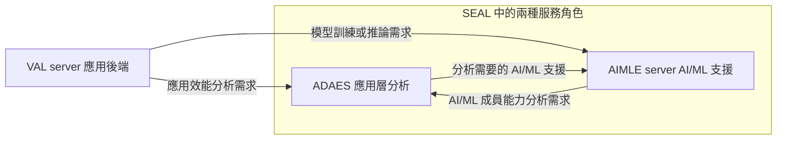

# Release 20 ADAES 與 AIMLE 的關係

ADAES 與 AIMLE 都是 SEAL 架構中的應用支援服務角色。
ADAES 提供應用層分析，AIMLE 提供模型訓練、推論及參與端管理等 AI/ML 支援。
應用可以分別使用它們；兩者也能互相使用服務，並沒有固定的前台與後台關係。

本文件先說明服務責任，再用規格支持的請求與協作例子說明差異。
可先讀前兩節，再逐節閱讀協作、API 與服務發現。
本文以本地 Release 20 的 Stage 2 規格為主要依據；引用外部 Stage 3 時另列版本。
說明情境不代表已選定的研究方向。

## 1 先分清 SEAL 與兩種服務角色

SEAL 是 Service Enabler Architecture Layer for Verticals，提供產業應用可共用的支援能力。
VAL client／server 表示應用本身的功能；SEAL client／server 表示提供支援服務的功能。
ADAE 與 AIMLE 是其中兩種服務，並非兩個上下排列的架構層。

本文以 **ADAES** 指 ADAE server，以 **AIMLE** 指 AI/ML 支援服務，
需要指明服務提供者時使用 **AIMLE server**。
TS 23.436 §3.2 將 ADAES 展開為 Application Data Analytics Enabler Server；
文件標題中的 Application Data Analytics Enablement Service 則是服務名稱。

| 名稱 | 功能定位 | 容易理解的對應 |
| --- | --- | --- |
| VAL server | 應用本身的伺服器端功能 | 提出應用需求、使用結果的應用後端 |
| ADAES／ADAE server | 提供應用層資料分析的 SEAL server 角色 | 提供特定分析項目的統計或預測 |
| AIMLE server | 提供 AI/ML 支援的 SEAL server 角色 | 處理模型與 AI/ML 任務、協調參與端 |

這些名稱描述功能責任。它們不指定必須有幾台機器或幾個獨立程式。
AIMLE client、ADAE client 則是對應服務的客戶端功能，詳細定位可接續閱讀
[基本名詞與概念](Release%2020%20基本名詞與概念.md)。

依據：[TS 23.434 §6.4](../../../specs/Rel-20/TS%2023.434/6%20Generic%20functional%20model%20for%20SEAL%20services/6.4%20Functional%20entities%20description.md)、[TS 23.436 §1](../../../specs/Rel-20/TS%2023.436/1%20Scope.md)、[§3.2](../../../specs/Rel-20/TS%2023.436/3%20Definitions%20of%20terms%20and%20abbreviations.md)、[§5.4.3](../../../specs/Rel-20/TS%2023.436/5%20Application%20architecture%20for%20ADAES.md)、[TS 23.482 §1](../../../specs/Rel-20/TS%2023.482/1%20Scope.md)、[§5.2.1.1 與 §5.2.3](../../../specs/Rel-20/TS%2023.482/5%20Application%20architecture%20for%20enabling%20AI%20and%20ML%20services.md)。

## 2 主要差別是請求哪一種標準服務

向 ADAES 請求分析時，消費者指定分析項目與目標，例如某個應用使用指定切片時的效能。
ADAES 負責產生該分析項目的結果。向 AIMLE server 請求訓練或推論時，
消費者指定 AI/ML 操作需要的模型資訊或需求、資料等資訊，取得該操作的回應或結果。

| 規格中的實際操作 | 誰向誰請求 | 請求與結果的重點 |
| --- | --- | --- |
| `slice_performance_analytics_subscribe` | VAL server → ADAES | 訂閱指定切片下的應用效能分析；先收到訂閱回覆，後續收到分析通知 |
| `Aimles_MLModelTraining_Request` | VAL server → AIMLE server | 請求模型訓練；帶入資料集識別碼、模型資訊或模型需求等，先取得回應，後續通知訓練成果或錯誤 |
| `Aimles_MLModelInference_Request` | VAL server → AIMLE server | 請求模型推論；帶入模型資訊或推論需求，以及資料、資料位置或資料描述，取得推論回應 |

表中名稱是 Stage 2 的操作名稱。必要欄位、條件及傳輸格式要再看各操作的資訊流與 Stage 3。

**不能用「能不能預測」劃出絕對界線。** ADAES 可以提供預測，AIMLE 推論也可能產生預測。
依本文件查閱的條文，較準確的區分是對外提供哪種服務契約：
應用效能分析，或模型訓練／推論等 AI/ML 操作。
這是對規格的定位解讀，不是標準宣告兩者的運算能力互斥。

依據：[TS 23.436 §9.2.4](../../../specs/Rel-20/TS%2023.436/9%20ADAE%20layer%20APIs/9.2%20ADAE%20server%20APIs.md)、[TS 23.482 §9.2.3](../../../specs/Rel-20/TS%2023.482/9%20AIMLE%20APIs/9.2%20AIMLE%20server%20APIs/9.2.3%20ML%20model%20training%20API.md)、[§8.3](../../../specs/Rel-20/TS%2023.482/8%20Procedures%20and%20information%20flows/8.3%20ML%20model%20training.md)、[§9.2.30](../../../specs/Rel-20/TS%2023.482/9%20AIMLE%20APIs/9.2%20AIMLE%20server%20APIs/9.2.30%20ML%20model%20inference%20API.md)、[§8.36](../../../specs/Rel-20/TS%2023.482/8%20Procedures%20and%20information%20flows/8.36%20ML%20model%20inference.md)。

## 3 ADAES 可以使用 AIMLE 的服務

可以用「應用後端需要應用效能預測」理解這種協作。
例如，應用希望知道指定切片下、指定區域與未來時間範圍內的端到端延遲。
TS 23.436 §8.3.2 確實支持這類分析，並描述 ADAES 結合 OAM 資料、
NWDAF 分析與 VAL session 效能分析來產生結果。

如果這項分析需要 ML 支援，§5.2.4 另外允許 ADAES 使用 AIMLE 的服務，
例如為指定 analytics ID 所需的模型請求訓練。
此時，各角色的責任可依架構理解為：

1. VAL server 向 ADAES 提出應用層分析需求。
2. ADAES 使用所需資料與分析，必要時消費 AIMLE 的模型訓練等支援。
3. AIMLE server 提供相應的 AI/ML 支援；ADAES 提供應用層分析結果。

以上是把 §8.3 的分析例子與 §5.2.4 的協作能力放在一起解讀。
**§8.3 並未規定每次切片效能分析都必須呼叫 AIMLE。**
架構中的 `AIML-X` 表示 ADAES 消費 AIMLE 服務的互動參考點；
它本身不等於一條 HTTP URL 或完整的 JSON schema。

另外，TS 23.482 §9.2.3 的模型訓練 API 表列消費者是 VAL server。
不能只憑 ADAES 可消費 AIMLE 的架構描述，就認定這張 API 表已明確列出 ADAES，
或把同一條 HTTP API 直接指定為所有 `AIML-X` 互動的實作。
具體映射仍需對照相應的 Stage 3 與消費者角色。

依據：[TS 23.436 §5.2.4 與 §5.4.3](../../../specs/Rel-20/TS%2023.436/5%20Application%20architecture%20for%20ADAES.md)、[§8.3.2](../../../specs/Rel-20/TS%2023.436/8%20Procedures%20and%20information%20flows/8.3%20Procedure%20on%20support%20for%20slice-specific%20application%20performance%20analytics.md)、[TS 23.482 §9.2.3](../../../specs/Rel-20/TS%2023.482/9%20AIMLE%20APIs/9.2%20AIMLE%20server%20APIs/9.2.3%20ML%20model%20training%20API.md)。

## 4 AIMLE 也可以使用 ADAES 的分析

反方向的規格例子是 **Application Layer AI/ML Member Capability Analytics**。
AIMLE server 可以向 ADAES 請求或訂閱 AI/ML 成員能力分析，
取得成員可用性與能力的統計或預測，用來支援 FL 成員選擇或重新選擇。

例如，AIMLE server 想了解成員 A、B 在某段時間的可用性與通訊能力，
可以呼叫 `AIML_member_capability_analytics_get`：

| 步驟 | 執行者 | 內容 |
| --- | --- | --- |
| 提出請求 | AIMLE server | 指定成員 ID、分析項目、統計或預測類型、要分析的能力屬性等 |
| 產生或取得分析 | ADAES | 依程序使用 ADAE client、A-ADRF 等來源的資料／分析 |
| 回覆結果 | ADAES → AIMLE server | 各成員的可用性與能力統計或預測；規格例子包含最大／最小可支援的啟用連線數 |

A、B 是解說用名稱；上述操作、來源與輸出屬性有 §8.16、§9.2.15 支持。
Get 程序以已有分析資料為前提，並允許依程序再次取得分析；
也可選用 subscribe／notify 模式。
這項分析可支援選擇決策，但回覆分析並不等於 ADAES 已完成 AIMLE client 選擇。

依據：[TS 23.436 §6.12](../../../specs/Rel-20/TS%2023.436/6%20ADAE%20layer%20Functional%20Description.md)、[§8.16.2 與 §8.16.3.8–§8.16.3.9](../../../specs/Rel-20/TS%2023.436/8%20Procedures%20and%20information%20flows/8.16%20Procedure%20for%20Application%20Layer%20AI%20and%20ML%20Member%20Capability%20Analytics.md)、[§9.2.15](../../../specs/Rel-20/TS%2023.436/9%20ADAE%20layer%20APIs/9.2%20ADAE%20server%20APIs.md)。

## 5 用一張圖理解直接使用與雙向協作

下圖只表示服務需求的方向，省略回應、通知、資料來源與客戶端。
不同箭頭來自不同規格程序，不代表每個任務都要依序經過所有角色。

圖中關係分別依據前述 TS 23.436 §5.2.4、§8.3、§8.16 與 TS 23.482 §8.3、§8.36。

**應用可以直接使用 AIMLE server。** 例如 §8.36 的推論程序，
消費者可以是 VAL server 或 AIMLE client，不要求先經過 ADAES。
若應用已有指定模型，或有足以選擇模型的需求資訊，且所需推論服務可用，
就能依該程序請求推論。

**ADAES 的分析也不必一律使用 AIMLE。** §5.2.4 使用「may consume」描述協作，
§8.3 的基本分析程序也未把 AIMLE 列為必經角色。
這支持兩者沒有一律綁定的理解；不代表所有分析或所有 AIMLE 任務都沒有其他依賴。

**能直接呼叫 AIMLE，不等於已完整取代 ADAES。**
若應用自行使用模型推論來產生分析，還需要自行承擔該分析服務所需的工作，
例如資料與分析結果的組織、分析項目語意及訂閱通知。
這是依服務契約做的實作推論；規格沒有宣告 AIMLE 推論 API 等同於所有 ADAE 分析 API。

## 6 兩者都能處理需求但請求必須符合操作定義

不能把兩者理解成「AIMLE 接受高階需求，ADAES 要求使用者先拆好所有步驟」。
TS 23.436 §8.16.2.1 明確描述 ADAES 把 analytics event ID 映射為資料收集事件與資料來源，
映射可以預先配置，也可由 ADAES 依分析類型與來源資訊決定。

AIMLE 也能依需求選擇模型。TS 23.482 §8.36.2 允許在只有模型推論需求時選擇適合模型，
未提供資料或資料位置時，也可依資料需求取得相應資料。
因此，不能把它理解成永遠只執行呼叫方已備妥的模型與資料。

兩者的彈性都受選用操作的欄位與條件約束。
例如，模型訓練請求仍需資料集識別碼；
模型推論請求需模型資訊或推論需求，並依規定提供資料、資料位置或資料描述。
「提出需求」不代表任意一句自然語言都會自動被轉成可執行任務。

依據：[TS 23.436 §8.16.2.1](../../../specs/Rel-20/TS%2023.436/8%20Procedures%20and%20information%20flows/8.16%20Procedure%20for%20Application%20Layer%20AI%20and%20ML%20Member%20Capability%20Analytics.md)、[TS 23.482 §8.3.3.1](../../../specs/Rel-20/TS%2023.482/8%20Procedures%20and%20information%20flows/8.3%20ML%20model%20training.md)、[§8.36.2–§8.36.3.1](../../../specs/Rel-20/TS%2023.482/8%20Procedures%20and%20information%20flows/8.36%20ML%20model%20inference.md)。

## 7 操作名稱與實際傳輸 schema 要分開看

Stage 2 定義功能、角色、流程與資訊元素；Stage 3 進一步定義 HTTP 操作、
資料型別、回應及通知等傳輸契約。規格定義服務能力與互動方式，內部演算法與軟體仍需實作。

目前已查閱的對應 Stage 3 為下列 **Release 19** 版本：

| 規格及已查版本 | 本文確認的範圍 |
| --- | --- |
| [TS 24.559 V19.4.1](https://www.etsi.org/deliver/etsi_ts/124500_124599/124559/19.04.01_60/ts_124559v190401p.pdf) | ADAES 協定與 API；Annex A 提供 OpenAPI，部分 schema 引用其他 YAML |
| [TS 29.482 V19.1.1](https://www.etsi.org/deliver/etsi_ts/129400_129499/129482/19.01.01_60/ts_129482v190101p.pdf) | AIMLE server／ML repository 服務 API，包含模型訓練的 OpenAPI |
| [TS 24.560 V19.2.0](https://www.etsi.org/deliver/etsi_ts/124500_124599/124560/19.02.00_60/ts_124560v190200p.pdf) | AIMLE 協定，包含 client 註冊、參與及 HFL 訓練等 API／OpenAPI |

例如，TS 29.482 §6.1.8、Annex A.19 把模型訓練定義為
`POST {apiRoot}/aimles-trn/v1/request-train`。
JSON 請求 schema 為 `TrainRequest`，成功回應為 `200 OK` 與 `MlModelTrainResp`，
後續通知使用 `MlModelTrainNotif`。取得初始成功回應不等於整個訓練已完成。

這些已查版本不代表最新版本，也不能直接覆蓋本地 Release 20 的所有新增操作。
本地目前沒有上述三份 Stage 3 與配套 YAML；
每一項 Release 20 操作的傳輸對應與 schema 依賴，仍需逐項核對。

## 8 找到彼此需要服務發現或已知入口

同屬 SEAL 不會讓兩個 server 自動知道彼此地址。
需要分清楚「找到 API 的地址」與「選出適合任務的 AIMLE server」。

**API 發現可使用 CAPIF。** CAPIF 是 Common API Framework，
其中的 CAPIF Core Function（CCF）保存服務提供方透過 API publishing function 發布的 API 資訊。
已完成接入登錄（onboarding）的呼叫方（API invoker）可以查詢 CCF，依權限與條件取得服務 API 資訊，
或取得指定 API 的介面地址，例如 IP、port、URI。
CCF 在提供 API 目錄這一點上可類比 NRF，但這是幫助理解的類比，並非同一種網元角色。

依據：[TS 23.222 V19.8.0 §8.3、§8.7](https://www.etsi.org/deliver/etsi_ts/123200_123299/123222/19.08.00_60/ts_123222v190800p.pdf)。
TS 23.436 §5.4.3 明確讓 ADAE server 扮演 CAPIF 的 API exposing function，
§5.5 的 ADAE-S 條文將該參考點對應到 CAPIF-2；
這些角色與參考點本身不表示已完成 API 發布或發現部署。

**AIMLE server discovery 是另一種任務導向的查詢。**
TS 23.482 §8.34 先假定消費者已有一個 AIMLE server URI，例如預先配置，
再向該 server 請求符合位置、任務、模型或處理能力等條件的其他 AIMLE servers。
回應包含候選 server 的 endpoint；同節也明確區分 CAPIF 用於發現暴露的 service API。

依據：[TS 23.436 §5.4.3 與 ADAE-S 條文](../../../specs/Rel-20/TS%2023.436/5%20Application%20architecture%20for%20ADAES.md)、[TS 23.482 §8.34](../../../specs/Rel-20/TS%2023.482/8%20Procedures%20and%20information%20flows/8.34%20AIMLE%20server%20discovery.md)。

此處尚未確認一套專供 ADAES 與 AIMLE server 初次互相發現的完整程序。
§8.34 的消費者例子是 AIMLE client、VAL server，且對 ML repository 的發現用法仍標為尚待研究（FFS）。
不能把它改寫成兩者已共同採用的通用註冊中心，或宣稱已解決所有初始入口問題。

## 主要規格版本

| 來源 | 本地版本 | 本文用途 |
| --- | --- | --- |
| [TS 23.434](../../../specs/Rel-20/TS%2023.434/README.md) | V20.1.0 | SEAL、VAL 與功能實體的定位 |
| [TS 23.436](../../../specs/Rel-20/TS%2023.436/README.md) | V20.2.0 | ADAES 功能、AIMLE 協作及成員能力分析 |
| [TS 23.482](../../../specs/Rel-20/TS%2023.482/README.md) | V20.3.0 | AIMLE 功能、訓練、推論與 server discovery |

外部 Stage 3 與 CAPIF 的已查版本已在相關段落標明。
本文件是規格解讀，並不直接構成目前 Release 18 實作需求。
