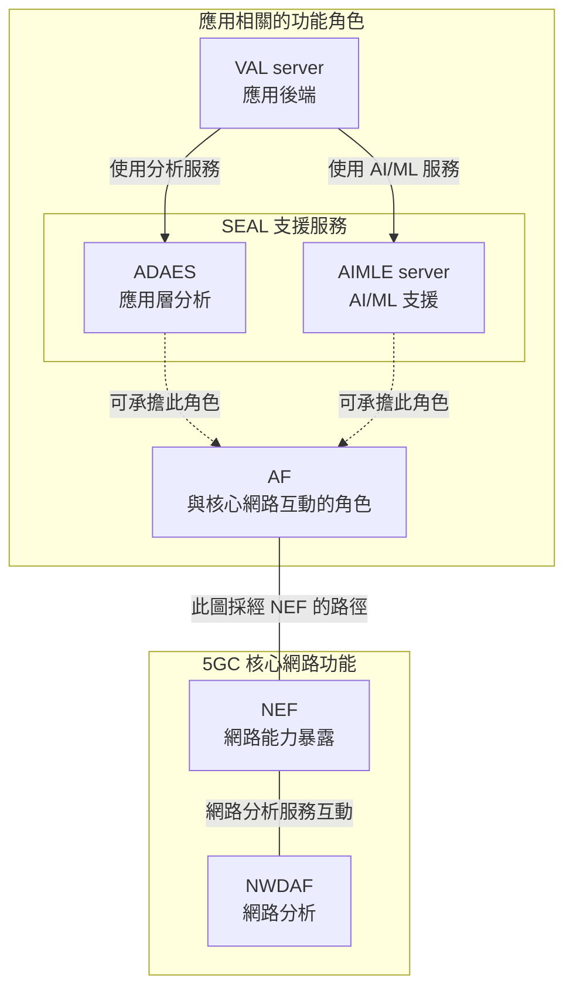
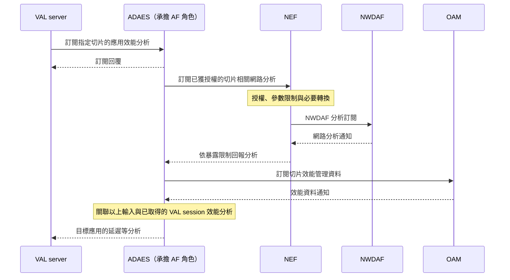
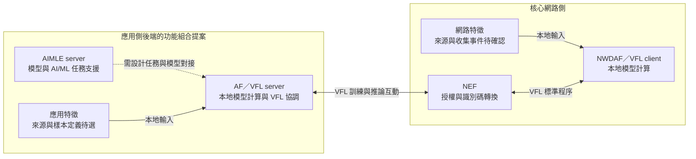

# Release 20 NWDAF 與應用層互動會議筆記

NWDAF 是 5GC 的網路分析功能。外部應用可以由應用側承擔 AF 角色，透過標準定義的程序使用 NWDAF 的服務；ADAES、AIMLE 則進一步定義應用側的分析與 AI/ML 支援分工。

本文依據本地 Release 20 Stage 2 規格。例子用於說明功能，不代表已選定產業應用或研究方案。

## 1. NWDAF 與外部應用的互動入口

外部應用若要使用 NWDAF 的分析能力，可以由應用側承擔 AF，也就是 Application Function 的角色，透過標準定義的程序請求或訂閱分析。依相應程序、信任關係與授權，網路互動可以直接進行，或經由 NEF。

AF 描述的是應用與核心網路互動時的功能角色，不一定是一個獨立程式。 ADAES、AIMLE 是應用側提供分析與 AI/ML 支援的功能實體；它們與網路互動時，也可以承擔 AF 角色。

NEF 是 Network Exposure Function，負責網路能力暴露、授權、限制與必要的轉換。使用 NWDAF 的分析，需要對方支援所需 Analytics ID，且該應用有權取得相應結果。這個入口概念不表示所有 NWDAF 服務都對任意外部應用開放。

規格支持的角色例子如下：

- TS 23.436 §5.2.2 明確描述 ADAE server 可以作為 AF 與 5GC 互動。
- TS 23.482 §8.14.2.5.2 明確描述 AIMLE server 作為 AF 向 NEF 請求輔助資訊，並允許向 NWDAF 請求或訂閱分析。

以上支持它們可承擔 AF 角色；是否具備特定 AF 服務，例如 VFL，仍需依各服務的能力與契約確認。

依據：[TS 23.288 §4][nwdaf-architecture]、[§6.1.1][analytics-exposure]、[TS 23.436 §5.2.2][adae-architecture]、[TS 23.482 §8.14.2.5.2][aimle-assistance]。

## 2. 應用側的角色與定位

### 2.1. SEAL 提供應用可共用的支援服務

SEAL 是 **Service Enabler Architecture Layer for Verticals**，是支援產業應用的架構框架。它把多種應用可共用的支援功能定義成服務，例如位置管理、群組管理與應用資料分析。

**VAL（Vertical Application Layer，產業應用層）** 代表應用本身的功能； VAL 使用 SEAL 的服務來支援自身功能。 SEAL 的各項服務由相應的 client 與 server 功能提供，終端側的 client 可以整合進應用使用的軟體。

依據：[TS 23.434 §1][seal-scope]、[§3.1–3.2][seal-definitions]、[§6.4.2][seal-roles]、[§8.3.1][seal-deployment]。

### 2.2. 從 SDK 理解 client 與 server 的分工

具體而言，SEAL 提供者可以把終端側的支援功能做成 SDK，讓應用整合使用。 SDK 是 **Software Development Kit（軟體開發套件）**； UE 是 **User Equipment（使用者設備）**，例如執行應用的手機或其他終端。 TS 23.434 §8.3.1 明確描述：

> SEAL provider may provide SEAL Client(s) as UE SDK on top of UE OS.

以這種實作為例，終端應用整合 UE 作業系統之上的 SDK，其中的 SEAL client 負責相應的支援功能，並與 SEAL server 互動。應用本身的終端邏輯是 VAL client，應用後端的業務邏輯是 VAL server。因此可把 VAL client／server 類比為一般應用的前端與後端，而 SEAL client／server 則提供這個應用所使用的支援功能。

依據：[TS 23.434 §8.3.1][seal-deployment]、[§6.4.2.2–6.4.2.5][seal-roles]。

本文關注兩種 SEAL 支援服務，各自有相應的 client 與 server：

- **ADAE（Application Data Analytics Enablement，應用資料分析支援）**：提供應用層的統計或預測等分析。
- **AIMLE（AI/ML Enablement，人工智慧／機器學習支援）**：支援模型訓練、推論與參與端管理等操作。AI 是 Artificial Intelligence（人工智慧），ML 是 Machine Learning（機器學習）。

ADAE 的兩個功能實體另有縮寫：

- **ADAEC（Application Data Analytics Enabler Client，應用資料分析支援客戶端）**：即 ADAE client。
- **ADAES（Application Data Analytics Enabler Server，應用資料分析支援伺服器）**：即 ADAE server。

| 功能定位 | 終端側 client | 服務端 server |
| --- | --- | --- |
| 應用本身 | **VAL client**：應用操作、結果呈現等終端邏輯 | **VAL server**：應用後端的業務邏輯、需求與結果使用 |
| 應用資料分析支援 | **ADAE client（ADAEC）**：支援應用資料收集等功能，與 ADAES 互動 | **ADAE server（ADAES）**：提供應用層統計或預測等分析 |
| AI/ML 支援 | **AIMLE client**：使用或參與 AI/ML 操作，與 AIMLE server 互動 | **AIMLE server**：提供模型訓練、推論、參與端管理等支援 |

這些 client／server 都是 functional entity（功能實體），表示功能責任，不指定必須是一台機器或一個獨立程式。例如 AIMLE client 可以整合在 VAL client 中；同一後端也可以承擔多種功能角色。 SDK 是終端側 client 的一種提供方式；服務端功能仍由相應的 SEAL server 提供。

server 的部署位置也有彈性。SEAL server 可位於營運者、VAL 服務提供者，或獨立 SEAL 提供者的網域。因此「應用側」描述的是功能定位，不等於一定部署在營運者網域之外。

依據：[TS 23.434 §6.4.1–6.4.2][seal-roles]、[§8.2–8.3][seal-deployment]、[TS 23.436 §1][adae-scope]、[§3.2][adae-definitions]、[§5][adae-architecture]、[TS 23.482 §3.3][aimle-definitions]、[§5.2][aimle-architecture]。

### 2.3. 應用支援服務與 NWDAF 的角色關係

**NWDAF（Network Data Analytics Function，網路資料分析功能）** 是 5GC（5G Core，5G 核心網路）中的 NF（Network Function，網路功能）； ADAE server 與 AIMLE server 則是應用層支援功能實體（SEAL server）。

後者需要使用網路能力時，可以承擔 **AF（Application Function，應用功能）** 角色，與 NWDAF 等網路功能互動。圖中採用經由 **NEF（Network Exposure Function，網路能力暴露功能）** 的路徑，由 NEF 處理授權、暴露限制與必要的轉換。

**圖 1 伺服器側的角色與網路互動入口**

VAL server 使用 ADAES 或 AIMLE 提供的支援；這些支援功能與網路互動時，可以承擔 AF 的角色，再使用 NWDAF 等網路功能的能力。 AF 方框是同一功能的另一種角色視角，不要求額外部署一台 AF 伺服器。

圖中虛線表示角色關係，無箭頭的線表示互動關係；請求與結果方向在圖 2 說明。這是功能分類圖，不是部署圖，也不是必須依序經過所有服務的流程。為便於閱讀，圖中只畫伺服器側，並選用經 NEF 的網路路徑。

依據：[TS 23.434 §6.4][seal-roles]、[§8.2][seal-deployment]、[TS 23.436 §5][adae-architecture]、[TS 23.482 §5.2][aimle-architecture]、[§8.14.2.5.2][aimle-assistance]。

## 3. 規格中的情境與互動流程

以下兩個例子分別呈現 ADAES 與 AIMLE 如何使用 NWDAF 的網路分析。它們是規格程序的簡化說明，不代表已選定的研究應用。

### 3.1. ADAES 提供指定切片的應用延遲分析

假設應用後端想知道，在指定區域與未來時間內，使用某個網路切片時的端到端延遲。 TS 23.436 §8.3.2 描述的互動可簡化為：

1. **VAL server → ADAES**：訂閱指定切片的應用效能分析，提供目標切片、區域與時間等條件。
2. **ADAES → NWDAF**：訂閱相應的切片負載或服務體驗分析，接收統計或預測結果。
3. **ADAES → OAM／NSCE**：取得切片效能管理資料；ADAES 也取得並篩選目標切片上的 VAL session 效能分析。
4. **ADAES → VAL server**：關聯以上輸入，提供目標應用的分析結果，例如預測端到端延遲。

OAM 是 Operation, Administration and Maintenance（操作、管理與維護）； NSCE 是 Network Slice Capability Enablement（網路切片能力支援），可協助 ADAES 取得 OAM 資料。規格中的結果例子包含最小、平均、最大預測 RTT 或端到端延遲。 RTT 是 Round-Trip Time，一次來回通訊所需的時間。

程序以 ADAEC 已連接 ADAES 為前提，並需取得切片、區域、時間與應用 session 的對應資訊。網路分析的取得也需符合相應的授權與暴露限制；下面的圖選用經 NEF 的路徑。

**圖 2 分析請求與結果的方向**

請求從應用側往網路側發出，網路分析反方向回來。 ADAES 再提供應用層的結果；因此應用分析不只是把 NWDAF 的通知原樣轉送。

此圖將 TS 23.436 §8.3 的應用效能分析，與 TS 23.288 §6.1.1.2 的 AF 經 NEF 分析暴露路徑組合解說。它不是單一條文的原圖；前提是所需 Analytics ID 與參數已獲授權。圖中省略網路側的訂閱回覆、取消與錯誤流程；不同來源的資料取得也不要求依圖中的先後次序執行。§8.3 並未要求這項分析一定使用 AIMLE。

依據：[TS 23.436 §8.3.2][adae-slice]、[TS 23.288 §6.1.1.2][analytics-exposure]。

### 3.2. AIMLE 選擇適合參與模型訓練的終端

假設 VAL server 準備進行模型訓練，需要找出具有所需資料與能力的 AIMLE clients。這裡採用 TS 23.482 §8.9.1 的 AIMLE server selection 模式，由 AIMLE server 依條件選擇參與端。§8.9.2.1 描述的互動可簡化為：

1. **VAL server → AIMLE server**：請求選擇參與端，提供篩選條件與所需 client 數量。
2. **AIMLE server → ML repository**：完成請求者的授權檢查後，取得 client 能力資料，找出符合條件的候選者。
3. **AIMLE server 使用 NWDAF 分析**：可使用 UE mobility analytics 輔助候選者篩選，例如配合請求中的位置條件。
4. **AIMLE server → 候選 AIMLE clients**：執行參與確認程序，確認哪些 client 同意參與。
5. **AIMLE server → VAL server**：符合所需參與條件時，回覆選擇結果與 AIMLE client set identifier（參與端集合識別碼），供後續訓練使用。

此程序以 AIMLE clients 已註冊、AIMLE server 可取得其能力資料為前提。使用 NWDAF 也需有 client 與 UE 的識別碼對應，以及取得網路分析的權限。若請求指定最低參與數量，而同意參與的 clients 不足，規格要求回覆失敗，且不分配集合識別碼。

移動分析由 NWDAF 提供，候選者篩選與參與確認由 AIMLE 處理。這項流程產生可參與的 client 集合，模型訓練則是後續操作。

依據：[TS 23.482 §8.9.1–8.9.2.1][aimle-selection]。

## 4. ADAES 與 AIMLE 的服務分工

ADAES 與 AIMLE 依對外提供的服務責任區分，兩者都可以涉及預測。

ADAES 接受特定應用分析需求，提供該分析項目的統計或預測。 AIMLE 提供模型訓練、推論、參與端選擇等支援；服務消費者需要依各操作提供模型、資料或任務需求。 VAL server 可以分別使用它們，兩者也可以協作，沒有固定的前台與後台關係。

例如 ADAES 可使用 AIMLE 的模型訓練等服務支援 ML-enabled analytics； AIMLE 也可使用 ADAES 的 AI/ML 成員能力分析輔助成員選擇。這些可選協作不等於每個分析請求都必須同時經過兩者。

NWDAF 的 AnLF／MTLF 與 ADAES／AIMLE 並非一對一對應。 AnLF 是 NWDAF 產生分析的能力，MTLF 是其模型訓練能力；與應用層服務有部分工作相似，但服務契約與角色不同。

依據：[TS 23.288 §5.1][nwdaf-general]、[TS 23.436 §5.2.4][adae-architecture]；成員能力分析的條文與操作見[ADAES 與 AIMLE 的關係第 4 節](Release%2020%20ADAES%20與%20AIMLE%20的關係.md#4-aimle-也可以使用-adaes-的分析)。

## 5. NWDAF 在應用分析與聯合模型計算中的參與方式

應用使用 NWDAF 的分析結果，與 NWDAF 實際參與聯合模型計算，是不同的參與方式。

| 參與方式 | NWDAF 做什麼 | 應用側做什麼 |
| --- | --- | --- |
| 使用既有分析 | 提供支援且允許暴露的網路分析 | 把分析用於應用預測、AI/ML 參與端選擇或其他決策 |
| 參與 VFL | 擔任 VFL server 或 client，依程序進行本地模型計算與交換中間結果 | AF 擔任相應 VFL 角色，與 NWDAF 協作 |

VFL 是 Vertical Federated Learning，垂直聯邦學習。不同資料域對齊樣本，使用各自持有的特徵共同訓練與推論，並交換程序所需的中間結果。它不要求把所有原始資料集中上傳到一處。

TS 23.288 §6.2H 定義 NWDAF／AF 的 VFL；AF 作為 VFL server 時，參與的 VFL clients 是 NWDAFs。 client 訓練本地模型並回報中間結果，server 協調與組合結果；訓練後各端的本地模型以 VFL correlation ID 關聯後續推論。

外部應用也可經 AF 提供資料給 NWDAF，供其分析使用，這另有 UE application 資料收集程序。資料收集、分析暴露與 VFL 是不同互動，不能只用「外部呼叫 NWDAF」概括所有工作。

依據：[TS 23.288 §6.2H.1][vfl-general]、[§6.2H.2.3][vfl-training]、[§6.2H.2.4][vfl-inference]、[§6.2.8.2][ue-app-collection]。

## 6. AIMLE 與 NWDAF 協作的研究構想

標準已定義 NWDAF／AF VFL 程序；AIMLE 如何與這套程序對接，仍需要設計與驗證。

可提出的候選研究問題是：由 AIMLE server 同時承擔 AF／VFL server 功能，使應用側與網路側的特徵參與同一個聯合模型，支援應用相關的訓練與推論。這是討論用構想，尚未指定應用、資料集或實作方案。

### 圖 3 研究構想與標準程序的邊界

此圖選用 untrusted AF 經 NEF 的 VFL 路徑。 AF 與 NWDAF 的 VFL 互動有標準程序支持；虛線則表示尚需研究的 AIMLE 任務對接。同一後端承擔兩種角色，以及兩側特徵的使用，是提案的設計假設，並非標準已定義好的 AIMLE／NWDAF VFL 架構。

TS 23.288 §6.2H.2.1.2 NOTE 2 明確允許 AF 使用非標準 Analytics ID 啟動 VFL 訓練或推論，前提是參與的 NWDAFs 支援該 ID，且營運者確保其在 PLMN 內唯一；NEF 仍依政策檢查權限。這個註解位於 untrusted AF 程序中。trusted AF 也有 VFL 程序，但不能因註解的位置就推論 trusted AF 被禁止使用非標準 ID，或宣稱已找到同樣明確的允許條文。

目前查閱的 TS 23.482 §8.18，描述 AIMLE 支援 UE 上的 AIMLE clients，以及 VAL servers 之間的 VFL 樣本對齊與啟動；沒有直接定義 AIMLE server 與 NWDAF 的 VFL 對接。因此有 AF 能力，不等於自動支援 NWDAF／AF VFL。

研究需要進一步確認：

- **任務與模型對接：** AIMLE 的任務、Analytics ID、VFL correlation ID 與各端模型狀態如何關聯，兩側如何理解中間結果與失敗狀態。
- **資料與樣本對齊：** 誰提供特徵與標籤、如何取得資料、如何對應 UE 與樣本，以及時間範圍、授權與同意條件。
- **實驗價值：** 相較只用應用資料、使用 NWDAF 既有分析，或一般 AF 協作，加入 AIMLE 與 VFL 是否帶來增益，以及通訊與計算成本。

這些問題尚未解決，因此本圖不是可直接實作的端到端設計；研究創新性也仍需文獻比較。

依據：[TS 23.288 §6.2H.2.1][vfl-discovery]、[§6.2H.2.2][vfl-preparation]、[TS 23.482 §8.18][aimle-vfl]。

## 延伸閱讀與規格版本

- [基本名詞與概念](Release%2020%20基本名詞與概念.md)：client／server 定位與具體操作例子。
- [ADAES 與 AIMLE 的關係](Release%2020%20ADAES%20與%20AIMLE%20的關係.md)：服務契約、可選協作、傳輸 schema 與服務發現。
- [NWDAF 與應用支援服務的關聯與互動](Release%2020%20NWDAF%20與應用支援服務的關聯與互動.md)：資料收集、分析暴露與 VFL 的詳細路徑。

本筆記使用 TS 23.288 V20.2.0、TS 23.434 V20.1.0、TS 23.436 V20.2.0、TS 23.482 V20.3.0 的本地 TS 文字。圖中的操作描述用於 Stage 2 解說，未指定完整 HTTP 路徑或傳輸 schema；實作時仍需對照相應 Stage 3。

[nwdaf-architecture]: ../../../specs/Rel-20/TS%2023.288/4%20Reference%20Architecture%20for%20Data%20Analytics.md
[nwdaf-general]: ../../../specs/Rel-20/TS%2023.288/5%20Network%20Data%20Analytics%20Functional%20Description/5.1%20General.md
[analytics-exposure]: ../../../specs/Rel-20/TS%2023.288/6%20Procedures%20to%20Support%20Network%20Data%20Analytics/6.1%20Procedures%20for%20analytics%20exposure/6.1.1%20Analytics%20Subscribe%20and%20Unsubscribe.md
[seal-scope]: ../../../specs/Rel-20/TS%2023.434/1%20Scope.md
[seal-definitions]: ../../../specs/Rel-20/TS%2023.434/3%20Definitions,%20symbols%20and%20abbreviations.md
[seal-roles]: ../../../specs/Rel-20/TS%2023.434/6%20Generic%20functional%20model%20for%20SEAL%20services/6.4%20Functional%20entities%20description.md
[seal-deployment]: ../../../specs/Rel-20/TS%2023.434/8%20Application%20of%20functional%20model%20to%20deployments.md
[adae-scope]: ../../../specs/Rel-20/TS%2023.436/1%20Scope.md
[adae-definitions]: ../../../specs/Rel-20/TS%2023.436/3%20Definitions%20of%20terms%20and%20abbreviations.md
[adae-architecture]: ../../../specs/Rel-20/TS%2023.436/5%20Application%20architecture%20for%20ADAES.md
[adae-slice]: ../../../specs/Rel-20/TS%2023.436/8%20Procedures%20and%20information%20flows/8.3%20Procedure%20on%20support%20for%20slice-specific%20application%20performance%20analytics.md
[aimle-architecture]: ../../../specs/Rel-20/TS%2023.482/5%20Application%20architecture%20for%20enabling%20AI%20and%20ML%20services.md
[aimle-definitions]: ../../../specs/Rel-20/TS%2023.482/3%20Definitions%20of%20terms,%20symbols%20and%20abbreviations.md
[aimle-assistance]: ../../../specs/Rel-20/TS%2023.482/8%20Procedures%20and%20information%20flows/8.14%20Support%20for%20Split%20AI%20and%20ML%20Operation/8.14.2%20Procedure/8.14.2.5%20Split%20operation%20event%20subscription.md
[aimle-selection]: ../../../specs/Rel-20/TS%2023.482/8%20Procedures%20and%20information%20flows/8.9%20AIMLE%20client%20selection.md
[ue-app-collection]: ../../../specs/Rel-20/TS%2023.288/6%20Procedures%20to%20Support%20Network%20Data%20Analytics/6.2%20Procedures%20for%20Data%20Collection/6.2.8%20Data%20Collection%20from%20the%20UE%20Application/6.2.8.2%20Procedure%20for%20data%20collection%20from%20the%20UE%20Application.md
[vfl-general]: ../../../specs/Rel-20/TS%2023.288/6%20Procedures%20to%20Support%20Network%20Data%20Analytics/6.2H%20Vertical%20Federated%20Learning%20among%20NWDAFs%20and%20AFs/6.2H.1%20General.md
[vfl-discovery]: ../../../specs/Rel-20/TS%2023.288/6%20Procedures%20to%20Support%20Network%20Data%20Analytics/6.2H%20Vertical%20Federated%20Learning%20among%20NWDAFs%20and%20AFs/6.2H.2%20Procedures/6.2H.2.1%20Registration%20and%20Discovery%20procedure%20for%20Vertical%20Federated%20Learning.md
[vfl-preparation]: ../../../specs/Rel-20/TS%2023.288/6%20Procedures%20to%20Support%20Network%20Data%20Analytics/6.2H%20Vertical%20Federated%20Learning%20among%20NWDAFs%20and%20AFs/6.2H.2%20Procedures/6.2H.2.2%20Preparation%20procedure%20for%20Vertical%20Federated%20Learning.md
[vfl-training]: ../../../specs/Rel-20/TS%2023.288/6%20Procedures%20to%20Support%20Network%20Data%20Analytics/6.2H%20Vertical%20Federated%20Learning%20among%20NWDAFs%20and%20AFs/6.2H.2%20Procedures/6.2H.2.3%20Training%20Procedure%20for%20Vertical%20Federated%20Learning.md
[vfl-inference]: ../../../specs/Rel-20/TS%2023.288/6%20Procedures%20to%20Support%20Network%20Data%20Analytics/6.2H%20Vertical%20Federated%20Learning%20among%20NWDAFs%20and%20AFs/6.2H.2%20Procedures/6.2H.2.4%20Inference%20procedure%20for%20vertical%20federated%20learning.md
[aimle-vfl]: ../../../specs/Rel-20/TS%2023.482/8%20Procedures%20and%20information%20flows/8.18%20Support%20Vertical%20FL.md
