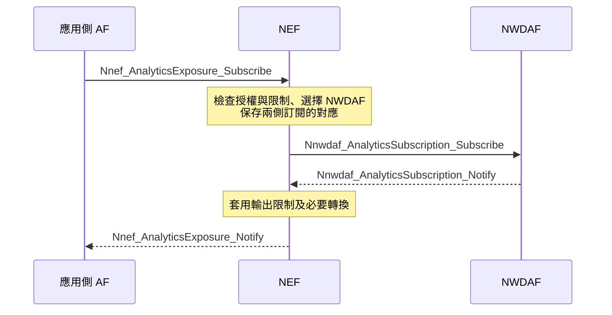

# Release 20 NWDAF 與應用支援服務的關聯與互動

NWDAF 是 5G 核心網路中的分析功能；ADAES 與 AIMLE 是 SEAL 架構中的應用支援服務。它們可以交換資料或使用彼此提供的能力，但沒有固定的上下級關係。應用可以使用 NWDAF 的網路分析，也可以經 AF 提供應用資料給 NWDAF，或在特定條件下與 NWDAF 共同訓練及執行模型。

本文件先對照角色，再分別說明四種互動。可以先讀第 1、2 節建立定位，再逐節閱讀例子與限制。所有例子只用於解釋規格，不代表已選定的研究方向。本文依據本地 Release 20 Stage 2 規格；不代表目前專案已實作這些能力。

## 1. 這些名稱分別代表什麼

| 名稱 | 它是什麼 | 在這裡負責什麼 |
| --- | --- | --- |
| NWDAF | 5GC 的網路功能（NF） | 收集資料、產生網路分析，並依其能力提供模型訓練等服務 |
| VAL client／server | 產業應用的功能角色 | 執行應用邏輯、提出需求或使用結果；例如 App 與應用後端 |
| SEAL | 應用支援的架構框架 | 定義共用支援服務及其 client／server 互動 |
| ADAES | ADAE server，一種 SEAL server 角色 | 結合應用資料、網路資料或既有分析，提供應用層分析 |
| ADAE client（ADAEC） | UE 側的 ADAE 支援功能 | 與 ADAES 互動，支援應用側資料收集等功能 |
| AIMLE server | 提供 AI/ML 支援的 SEAL server 角色 | 提供模型訓練、推論、參與端選擇等服務 |
| AIMLE client | UE 側的 AIMLE 支援功能 | 與 AIMLE server 互動，依能力參與本地訓練、推論等操作 |
| AF | Application Function，應用與 5GC 互動時的功能角色 | 向網路請求能力、提供應用相關資訊，或參與 NWDAF／AF 聯合學習 |

**AF 不一定是另一台伺服器。** 例如 TS 23.436 明確描述 ADAES 可以作為 AF 與 5GC 互動。同一個實作可以同時承擔應用支援服務與 AF 的責任；但具有 ADAES 或 AIMLE 名稱，不表示它自動具備所有 AF 服務、權限及聯合學習能力。

「應用側」也不等於「一定部署在營運者網路之外」。 SEAL server 可以部署於 PLMN 營運者、VAL 服務提供者或獨立 SEAL 提供者的網域。角色分工與實體部署位置應分開理解。

依據：[TS 23.288 §4、§4.2][nwdaf-architecture]、[§5.1][nwdaf-general]、[TS 23.434 §6.4][seal-roles]、[§8.2][seal-deployment]、[TS 23.436 §5.2.2、§5.4.3][adae-architecture]、[TS 23.482 §5.2][aimle-architecture]。

### NWDAF 的 AnLF 和 MTLF 是否對應 ADAES 和 AIMLE

概念上有部分相似：AnLF 使用模型等方法產生分析，MTLF 負責模型訓練； ADAES 提供應用層分析，AIMLE 提供 AI/ML 支援。但是它們的服務對象、操作、識別碼與程序不同，不能直接一對一替換。

AnLF 與 MTLF 是 NWDAF 的功能能力，一個 NWDAF 可以具備其中一種或兩種。 ADAES 與 AIMLE 是另外定義的 SEAL 服務角色。**相似的是部分工作內容，標準並沒有把它們定義成同一套服務。**

依據：[TS 23.288 §5.1][nwdaf-general]；ADAES 與 AIMLE 的服務差別見[關係文件](Release%2020%20ADAES%20與%20AIMLE%20的關係.md)。

## 2. 先用四種互動建立整體定位

| 互動 | 資料或結果主要往哪裡走 | 最後用途 | 規格例子 |
| --- | --- | --- | --- |
| 網路分析供應用分析使用 | NWDAF → ADAES → VAL server | 產生應用層效能分析 | TS 23.436 §8.3 |
| 網路分析輔助 AI/ML 任務 | NWDAF → AIMLE server | 協助選擇 AI/ML 參與端 | TS 23.482 §8.9.2.1 |
| 應用資料供網路分析使用 | UE application → AF → NWDAF | 增加 NWDAF 分析所需的輸入 | TS 23.288 §6.2.8.2 |
| 網路與應用共同執行 VFL | NWDAF ↔ AF | 使用不同資料域的特徵共同訓練、推論 | TS 23.288 §6.2H |

表中箭頭表示資料或結果方向，並非全部請求方向，也省略了可能位於中間的 NEF。例如 ADAES 要取得 NWDAF 分析時，請求由 ADAES 發出，分析結果才反方向回來。這四種互動可分別存在，不要求 VAL、ADAES、AIMLE、NWDAF 每次都依序出現。

下面先用一條實際規格中的路徑說明。

## 3. ADAES 使用 NWDAF 分析應用效能

**需求例子：應用後端想知道，使用某個網路切片時，未來一段時間的端到端延遲。** 網路切片可先理解為具有特定網路能力的一個邏輯網路；此例用其識別碼限定分析範圍。

TS 23.436 §8.3.2 描述的分工如下：

1. VAL server 向 ADAES 訂閱切片相關的應用效能分析，提供目標切片、區域、時間範圍等資訊。
2. ADAES 向 NWDAF 訂閱相關網路分析，例如切片負載或該切片的服務體驗分析。
3. ADAES 也取得 OAM 的效能管理資料，以及目標切片下的 VAL session 效能分析。
4. ADAES 將這些資料與分析關聯，產生目標應用的效能分析，再通知 VAL server。

規格給出的結果例子包含：目標 VAL application／server 使用指定切片時，在指定區域內的最小、平均、最大預測 RTT 或端到端延遲。 RTT 是一次來回通訊所需的時間。

| 誰提供什麼 | 內容 | 誰使用它 |
| --- | --- | --- |
| NWDAF 提供網路分析 | 切片／切片實例的統計或預測、每個切片實例的服務體驗分析 | ADAES |
| OAM 提供網路效能資料 | 目標切片／切片實例的效能管理資料 | ADAES，可依程序經其他服務取得 |
| 應用 session 相關分析 | 實際 VAL session 的效能，依目標切片與區域篩選 | ADAES |
| ADAES 提供應用層分析 | 關聯以上輸入，得到目標應用的延遲等分析 | VAL server |

**NWDAF 不必自己理解完整的應用業務。** 在這個程序中， ADAES 負責將網路分析放回目標應用的情境中。切片、區域、時間與應用 session 的對應，是關聯分析所需的資訊，不能僅憑一份網路預測自行補出。§8.3 並未要求這個過程一定使用 AIMLE。

依據：[TS 23.436 §8.3.2、§8.3.3][adae-slice]。

## 4. AIMLE 使用 NWDAF 協助選擇參與端

**需求例子：應用需要一組具有合適資料與能力、能參與模型訓練的端點。** AIMLE client 是端點上的 AI/ML 支援功能；在此程序中，AIMLE server 負責選擇參與者。

TS 23.482 §8.9.2.1 明確允許 AIMLE server 使用 NWDAF 的能力，例如 UE mobility analytics，協助選擇 AIMLE clients。 UE mobility analytics 是 UE 移動情況的統計或預測。

1. VAL server 向 AIMLE server 提出 client 選擇條件，或直接提供候選 client 清單。
2. AIMLE server 使用已註冊的 client profile 與 ML repository 中的資訊尋找候選者。
3. AIMLE server 可使用 NWDAF 的 UE mobility analytics 等資訊輔助篩選。
4. AIMLE server 與候選 client 確認參與，形成符合條件的 client set，回覆請求者。

「利用移動預測判斷某個端點是否適合參與」是這項能力的說明用解讀；規格並未在此指定一套固定的篩選演算法。 NWDAF 提供移動分析，**不是 NWDAF 直接管理 AIMLE client set**。若實際同意參與的 client 少於請求的最低數量，程序不會配置 client set identifier，並回覆失敗。

這條路徑需要能把 AIMLE client 對應到相關 UE，並具有取得其分析的權限。 AIMLE client ID 不等於 SUPI／GPSI 等網路 UE 識別碼；本段條文不足以單獨決定所有部署中的識別碼映射與暴露方式。

依據：[TS 23.482 §8.9.2.1][aimle-selection]、[TS 23.288 §6.7.2][ue-mobility]。

## 5. 外部應用如何取得 NWDAF 分析

以上程序說明「為什麼使用分析」。實際網路邊界則要看消費者角色與信任關係。 TS 23.288 定義直接消費 NWDAF 分析的程序，也定義 AF 經 NEF 取得分析的程序。 NEF 是網路能力暴露功能，負責授權、限制與必要的參數／識別碼轉換，不能當作透明轉送器。

以下使用 **AF 經 NEF 訂閱分析** 的標準程序；例如 ADAES 承擔 AF 角色時，可依此理解其取得網路分析的路徑。這是網路服務存取路徑，並非 §8.3 規定唯一的部署方式。

圖只呈現訂閱與分析通知的方向，省略訂閱回覆、修改及取消。若只需要一次查詢，AF 可使用 `Nnef_AnalyticsExposure_Fetch`， NEF 再向 NWDAF 發出 `Nnwdaf_AnalyticsInfo_Request`，依限制回傳結果。

AF 需要配置適當的 NEF、允許的 Analytics ID 及參數限制。 NEF 保存 AF 與 NWDAF 兩側請求的對應；未授權的訂閱不進入後續流程。若收到分析終止要求，依程序傳遞並處理訂閱取消。因此「應用可以使用 NWDAF」不表示任意 App 都能直接呼叫所有 NWDAF 分析。

依據：[TS 23.288 §6.1.1.1、§6.1.1.2][analytics-subscription]、[§6.1.2.2][analytics-request]、[TS 23.436 §5.2.2][adae-architecture]。

## 6. 應用資料也可以反方向提供給 NWDAF

**需求例子：NWDAF 所需的某項輸入來自 UE application，而不是完全由 AMF、SMF 等 NF 提供。** TS 23.288 §6.2.8.2 定義 UE application 資料收集程序，AF 是應用資料與 NWDAF 之間的接點。

| 階段 | 方向 | 內容 |
| --- | --- | --- |
| 建立應用側資料路徑 | UE application → AF，必要時經 application server | 應用依配置建立 user plane 連線，提供所需資料 |
| 請求資料 | NWDAF → AF，或 NWDAF → NEF → AF | 使用資料收集事件、目標與篩選條件訂閱 |
| 回報資料 | AF → NWDAF，或 AF → NEF → NWDAF | AF 依所需事件與條件收集、處理並通知資料 |
| 使用資料產生分析 | NWDAF → 分析消費者 | NWDAF 使用收集到的資料產生所需分析；程序中的消費者可以是 NF |

trusted AF 可與 NWDAF 直接互動；untrusted AF 經 NEF。這些稱呼描述網路的信任與存取關係，不是對應用品質的評價。 trusted AF 的服務可直接向 NRF 註冊；untrusted AF 的相關能力由 NEF 路徑登錄與暴露。

AF 依約定的事件與條件處理資料，可能包含匿名化、彙整或正規化。此程序也包含依政策與規定進行的使用者同意檢查；未取得所需同意時不繼續收集。 UE application 的 IP 位址與 SUPI／GPSI 的對應另有程序，不能直接假定應用 ID 就是網路 ID。相關 user plane 連線結束時，對應資訊也有移除程序。

**這是一條受事件與資料契約約束的收集路徑。** 它不等於 NWDAF 提供任意照片、文字或資料集的通用上傳與推論 API。也不要求應用必須先經 ADAES 或 AIMLE；如果這些服務要提供資料，還需確認其 AF 角色與支援的資料事件。

依據：[TS 23.288 §6.2.8.2.1 至 §6.2.8.2.4][ue-app-collection]。

## 7. NWDAF 與 AF 可以共同訓練及推論

前面是交換資料或完整分析結果。**VFL（Vertical Federated Learning，垂直聯邦學習）** 則讓不同資料域對齊樣本，使用各自持有的特徵共同訓練及推論。交換的是程序要求的中間結果，與「把全部應用原始資料交給 NWDAF」不同。

TS 23.288 §6.2H 定義 NWDAF 與 AF 的 VFL。VFL server 是協調訓練／推論的角色， VFL client 是參與本地計算的角色，與一般服務的請求者／提供者不能直接畫上等號。

| VFL server | 本程序支援的 VFL clients | 意義 |
| --- | --- | --- |
| NWDAF | 其他 NWDAFs、AFs | 網路側協調，結合其他網路或應用資料域的本地計算 |
| AF | NWDAFs | 應用側協調，讓支援所需能力的 NWDAF 參與本地計算 |

例如，可以用「AF 持有應用特徵，NWDAF 持有網路特徵」理解兩域協作。具體特徵、標籤與任務必須另有一致定義；以下只是程序結構的解說，沒有指定某項產業模型：

1. 發現支援所需 Analytics ID、VFL 角色與互通能力的參與者。
2. 依準備程序確認可用特徵、樣本對齊與其他要求；無法滿足要求的參與者可以拒絕。
3. 各端使用本地資料與模型進行訓練，交換中間結果及更新所需資訊。
4. 訓練後各端保存相關本地模型，以 VFL correlation ID 關聯後續推論。
5. 推論時，各端產生中間結果，由 VFL server 組合為結果。

AF 作為 VFL server 時，推論可以由 AF 內部服務邏輯觸發，不一定要先有 5GC NF 發出的分析請求。但這仍需要完成相應準備與模型／參與端管理；不是一次任意模型呼叫就能完成。

依據：[TS 23.288 §6.2H.1][vfl-general]、[§6.2H.2.1][vfl-discovery]、[§6.2H.2.2][vfl-preparation]、[§6.2H.2.3][vfl-training]、[§6.2H.2.4][vfl-inference]。

### Analytics ID 是否限制了所有應用側任務

一般分析服務需要使用對方支援且允許暴露的 Analytics ID。但不能因此斷言「NWDAF 參與的所有任務都只能使用既有標準網路 Analytics ID」。

在 **untrusted AF 作為 VFL server** 的程序中， TS 23.288 §6.2H.2.1.2 NOTE 2 明確允許 AF 使用非標準的 Analytics ID 觸發 VFL 訓練或推論。參與的 NWDAF VFL clients 必須支援該 ID，營運者也必須確保它在 PLMN 內具有唯一性。 NEF 另依政策檢查 AF 是否有權為該 ID 請求參與端。

因此，**規格保留了應用側擴充任務、由 NWDAF 參與的路徑**。這是有條件的 VFL 能力，不表示只命名一個新 ID，就能讓任意 NWDAF 支援新模型或任務。

依據：[TS 23.288 §6.2H.2.1.2 NOTE 2 與步驟 5][vfl-discovery]。

### 這和 AIMLE 的 VFL 是同一件事嗎

兩者使用相似的學習概念，但定義了不同角色與程序。 TS 23.482 §8.18.2 描述 AIMLE server 協調 UE 上的 AIMLE clients；§8.18.2b 另外描述 AIMLE 支援 VAL servers 之間的樣本對齊與任務啟動。它們不能直接視為 TS 23.288 的 NWDAF／AF VFL 服務。§8.18.2 也註明，AIMLE server 如何協調成員執行 VFL 訓練不在此 Release 的範圍內。

**可能的實作組合，尚非這些條文明定的通用對接：** 同一後端可以考慮承擔 AIMLE server 與 AF 的功能，再依各自契約與 NWDAF 協作。但必須確認能力、樣本／特徵 ID、模型與中間結果格式、 ML task identity／VFL correlation ID 的關係，以及授權與任務失敗的處理。目前不能把這種組合當成已完成標準映射或可直接互通的設計。

依據：[TS 23.482 §8.18.2、§8.18.2b][aimle-vfl]，對照 [TS 23.288 §6.2H][vfl-general]。

## 8. 可以如何組合以及目前的確認範圍

若應用需要「使用網路情況產生應用分析」，已有 ADAES 消費 NWDAF 的具體程序。若需要「依網路資訊挑選 AI/ML 參與者」，已有 AIMLE client selection 的具體依據。若需要「應用資料補充網路分析」，可檢視 AF／UE application 資料收集程序。若需要「資料留在不同域、共同執行模型」，才進一步檢視 NWDAF／AF VFL 的能力與條件。

ADAES 也可依架構使用 AIMLE 支援 ML-enabled analytics。所以「ADAES 使用 NWDAF 分析，再視需要使用 AIMLE 模型支援」是一種可由架構理解的組合。但 §8.3 沒有定義一條必須同時呼叫三者的完整程序，具體 API 與消費者映射仍需逐項確認。相關差異與限制見[ADAES 與 AIMLE 的關係](Release%2020%20ADAES%20與%20AIMLE%20的關係.md)。

本文件的互動依據是 Stage 2 的角色、操作與資訊流。若要落實傳輸，需要相應 Release／版本的 Stage 3、OpenAPI 與 schema；不能把此處的操作名稱直接當成 HTTP 路徑。仍需依選定路徑確認 UE／應用識別碼對應、支援的 Analytics ID／事件、授權與部署信任關係。 VFL 還需確認互通能力、特徵／樣本對齊及模型狀態管理。

服務發現也應分開看：NWDAF 的能力與核心網路發現使用 NRF；上述 trusted AF 與 VFL 程序也明確涉及 NRF，untrusted AF 則透過 NEF 路徑。 SEAL API 的 CAPIF 發現與 AIMLE server 發現是另外的服務程序，不能以「SEAL 有自己的發現」推論其不會在網路側使用 NRF／NEF。

依據：[TS 23.436 §5.2.4][adae-architecture]、[TS 23.288 §5.1][nwdaf-general]、[§6.2.8.2][ue-app-collection]、[§6.2H.2.1][vfl-discovery]；SEAL 發現細節見[關係文件第 8 節](Release%2020%20ADAES%20與%20AIMLE%20的關係.md#8-找到彼此需要服務發現或已知入口)。

## 規格來源

本文使用本地 TS 23.288 V20.2.0、TS 23.434 V20.1.0、TS 23.436 V20.2.0、TS 23.482 V20.3.0。來源為轉錄的 TS 文字；未以其他 Release 的 API schema 代替 Release 20 的傳輸契約。新增版本或 Stage 3 對照時，應再核對操作、角色與欄位是否一致。

[nwdaf-architecture]: ../../../specs/Rel-20/TS%2023.288/4%20Reference%20Architecture%20for%20Data%20Analytics.md
[nwdaf-general]: ../../../specs/Rel-20/TS%2023.288/5%20Network%20Data%20Analytics%20Functional%20Description/5.1%20General.md
[seal-roles]: ../../../specs/Rel-20/TS%2023.434/6%20Generic%20functional%20model%20for%20SEAL%20services/6.4%20Functional%20entities%20description.md
[seal-deployment]: ../../../specs/Rel-20/TS%2023.434/8%20Application%20of%20functional%20model%20to%20deployments.md
[adae-architecture]: ../../../specs/Rel-20/TS%2023.436/5%20Application%20architecture%20for%20ADAES.md
[aimle-architecture]: ../../../specs/Rel-20/TS%2023.482/5%20Application%20architecture%20for%20enabling%20AI%20and%20ML%20services.md
[adae-slice]: ../../../specs/Rel-20/TS%2023.436/8%20Procedures%20and%20information%20flows/8.3%20Procedure%20on%20support%20for%20slice-specific%20application%20performance%20analytics.md
[aimle-selection]: ../../../specs/Rel-20/TS%2023.482/8%20Procedures%20and%20information%20flows/8.9%20AIMLE%20client%20selection.md
[ue-mobility]: ../../../specs/Rel-20/TS%2023.288/6%20Procedures%20to%20Support%20Network%20Data%20Analytics/6.7%20UE%20related%20analytics/6.7.2%20UE%20mobility%20analytics.md
[analytics-subscription]: ../../../specs/Rel-20/TS%2023.288/6%20Procedures%20to%20Support%20Network%20Data%20Analytics/6.1%20Procedures%20for%20analytics%20exposure/6.1.1%20Analytics%20Subscribe%20and%20Unsubscribe.md
[analytics-request]: ../../../specs/Rel-20/TS%2023.288/6%20Procedures%20to%20Support%20Network%20Data%20Analytics/6.1%20Procedures%20for%20analytics%20exposure/6.1.2%20Analytics%20Request.md
[ue-app-collection]: ../../../specs/Rel-20/TS%2023.288/6%20Procedures%20to%20Support%20Network%20Data%20Analytics/6.2%20Procedures%20for%20Data%20Collection/6.2.8%20Data%20Collection%20from%20the%20UE%20Application/6.2.8.2%20Procedure%20for%20data%20collection%20from%20the%20UE%20Application.md
[vfl-general]: ../../../specs/Rel-20/TS%2023.288/6%20Procedures%20to%20Support%20Network%20Data%20Analytics/6.2H%20Vertical%20Federated%20Learning%20among%20NWDAFs%20and%20AFs/6.2H.1%20General.md
[vfl-discovery]: ../../../specs/Rel-20/TS%2023.288/6%20Procedures%20to%20Support%20Network%20Data%20Analytics/6.2H%20Vertical%20Federated%20Learning%20among%20NWDAFs%20and%20AFs/6.2H.2%20Procedures/6.2H.2.1%20Registration%20and%20Discovery%20procedure%20for%20Vertical%20Federated%20Learning.md
[vfl-preparation]: ../../../specs/Rel-20/TS%2023.288/6%20Procedures%20to%20Support%20Network%20Data%20Analytics/6.2H%20Vertical%20Federated%20Learning%20among%20NWDAFs%20and%20AFs/6.2H.2%20Procedures/6.2H.2.2%20Preparation%20procedure%20for%20Vertical%20Federated%20Learning.md
[vfl-training]: ../../../specs/Rel-20/TS%2023.288/6%20Procedures%20to%20Support%20Network%20Data%20Analytics/6.2H%20Vertical%20Federated%20Learning%20among%20NWDAFs%20and%20AFs/6.2H.2%20Procedures/6.2H.2.3%20Training%20Procedure%20for%20Vertical%20Federated%20Learning.md
[vfl-inference]: ../../../specs/Rel-20/TS%2023.288/6%20Procedures%20to%20Support%20Network%20Data%20Analytics/6.2H%20Vertical%20Federated%20Learning%20among%20NWDAFs%20and%20AFs/6.2H.2%20Procedures/6.2H.2.4%20Inference%20procedure%20for%20vertical%20federated%20learning.md
[aimle-vfl]: ../../../specs/Rel-20/TS%2023.482/8%20Procedures%20and%20information%20flows/8.18%20Support%20Vertical%20FL.md
