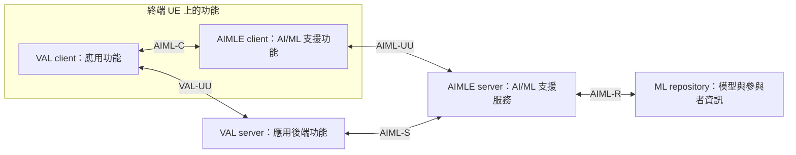

# Release 20 基本名詞與概念

本文件整理理解 NWDAF 與外部產業應用關係所需的五個基本概念。
依據本地 TS 23.434 V20.1.0、TS 23.436 V20.2.0 與 TS 23.482 V20.3.0 的定義及架構描述，
依序從產業應用、應用角色、共用支援層，帶入分析與 AI/ML 能力。
文中的產業應用例子僅用於解釋名詞，不代表已選定的研究方向或規格要求的實作。

每節先說明「它是什麼、用來做什麼」，再分開說明功能角色與規格中的互動例子。
可以先讀各節開頭，遇到 client／server 的分工疑問時，再閱讀對應的小節。

## 先看一個具體例子：設備巡檢 App

假設有一套設備巡檢系統：人員拿著有相機的終端，拍下設備照片，
App 請 AI 判斷照片中的設備是否有外觀異常，也能向後端查詢以前的巡檢紀錄。
這裡先假設辨識模型與推論服務已可用；如何準備模型，後面再用訓練例子說明。

**情境設定與規格依據分開看：** 設備巡檢、畫面操作、「外觀異常」這種辨識目標，
都是為了理解角色而設定的例子，不是規格指定的應用，也不代表研究方向。
TS 23.482 §8.36 則確實描述服務消費者請求模型推論，
並在 §8.36.3.1 列出影像輸入與影像辨識這類推論需求。
以下把這些規格支持的互動放進巡檢情境中解釋。

### 先把名稱對應到看得見的軟體功能

| 例子中的東西 | 對應的規格角色 | 為什麼這樣對應 |
| --- | --- | --- |
| 終端上的巡檢 App 功能：拍照、查詢紀錄、呈現結果 | VAL client | 它負責巡檢應用本身的客戶端功能 |
| 巡檢後端功能：處理巡檢紀錄的查詢等需求 | VAL server | 它負責巡檢應用本身的伺服器端功能 |
| App 使用的 AI/ML 支援模組 | AIMLE client | 它協助 App 使用 AI/ML 服務，與 AIMLE server 互動 |
| 提供模型推論等支援的服務功能 | AIMLE server | 它提供應用可使用的 AI/ML 支援服務 |

表中的 App 業務功能是情境設定；角色與互動的對應依據 TS 23.482 §5.2.1。
這四種功能不代表四個獨立程式或四台設備。
例如，規格允許把 AIMLE client 做成 VAL client 的一部分，
所以使用者可能只看到一個 App，規格卻把其中的兩種責任分開命名。

### 一張照片如何取得辨識結果

在這個例子中，選擇由終端上的 AIMLE client 請求伺服器推論。
可以依下列順序理解；表中的 App 操作是情境設定，中間的推論請求與回覆依據 §8.36。

| 步驟 | 誰做什麼 | 交給下一方的內容 |
| --- | --- | --- |
| 1 | VAL client 取得照片，使用 AIMLE client 的支援功能 | 照片與辨識需求 |
| 2 | AIMLE client 向 AIMLE server 發出推論請求 | 推論資料，以及模型資訊或模型需求 |
| 3 | AIMLE server 檢查授權，依請求使用指定模型或選擇適合模型，執行推論 | 推論結果 |
| 4 | AIMLE server 回覆 AIMLE client | 成功時的結果，例如本情境設定的「疑似外觀異常」；失敗時回覆失敗資訊 |
| 5 | 終端應用使用取得的結果 | 在巡檢 App 中呈現結果，具體畫面由應用決定 |

這樣就能看出兩種責任：**VAL client 負責讓人完成巡檢工作；
AIMLE client 負責支援該應用使用 AI/ML 服務。**
它們可以整合在同一個 App 中，但名稱分別描述應用功能與 AI/ML 支援功能。

這次推論由 AIMLE client 發起，因此 VAL server 沒有被放進推論請求路徑。
它仍可以處理巡檢紀錄等應用工作；規格也允許 VAL server 自己作為推論服務消費者。
哪些需求走哪條路徑，要依選用的程序及應用設計判斷。

來源：[TS 23.482 §5.2.1](../../../specs/Rel-20/TS%2023.482/5%20Application%20architecture%20for%20enabling%20AI%20and%20ML%20services.md)、[§8.36.1–§8.36.3](../../../specs/Rel-20/TS%2023.482/8%20Procedures%20and%20information%20flows/8.36%20ML%20model%20inference.md)。

## 先分清楚名詞的層次

以下是依規格功能架構整理的定位解讀。「架構層」「服務能力」「功能實體」
用來區分閱讀時的層次，不是本文件新增的標準角色。

| 名詞 | 它是什麼樣的東西 |
| --- | --- |
| Vertical application | 應用的類型，指服務特定產業需求的應用 |
| VAL | 描述應用本身所處位置的架構層 |
| VAL client／VAL server | 應用端與伺服器端的功能角色，可落實為應用軟體功能 |
| SEAL | 組織共用支援服務的架構層與框架 |
| SEAL client／SEAL server | 提供特定 SEAL 服務端側與伺服器端功能的實體 |
| ADAE | 應用資料分析的支援能力與相關服務 |
| ADAEC | 提供 ADAE 客戶端功能、支援終端應用的功能實體 |
| ADAES | 提供 ADAE 能力的伺服器端功能實體 |
| AIMLE | AI/ML 支援能力與服務的集合 |
| AIMLE client／AIMLE server | 承擔 AIMLE 端側與伺服器端功能的功能實體 |

「功能實體」先描述責任與互動，再由實作落實為軟體。
TS 23.434 §6.4.1 對通用功能實體、TS 23.482 §5.2.3.1 對 AIMLE 功能實體明確說明：
“does not imply a physical entity”。因此，看到 client 或 server，
應先辨認其功能角色，再看具體條文是否規定部署或軟體組成。

定位依據：[TS 23.434 §3.1](../../../specs/Rel-20/TS%2023.434/3%20Definitions,%20symbols%20and%20abbreviations.md)、[§6.4](../../../specs/Rel-20/TS%2023.434/6%20Generic%20functional%20model%20for%20SEAL%20services/6.4%20Functional%20entities%20description.md)、[§19.1](../../../specs/Rel-20/TS%2023.434/19%20Application%20Data%20Analytics%20Enablement.md)、[§20.1](../../../specs/Rel-20/TS%2023.434/20%20AIML%20Enablement.md)、[TS 23.436 §5.2 與 §5.4](../../../specs/Rel-20/TS%2023.436/5%20Application%20architecture%20for%20ADAES.md)、[TS 23.482 §5.2.1、§5.2.1.1 與 §5.2.3](../../../specs/Rel-20/TS%2023.482/5%20Application%20architecture%20for%20enabling%20AI%20and%20ML%20services.md)。

## 1. Vertical application：特定產業的應用

TS 23.434 §3.1 將 vertical application 定義為服務特定 vertical 的應用。
可先把 vertical 理解為產業領域；這是一種應用分類，具體應用可以由軟體系統提供。
同一節對 vertical domain 的定義引用 TS 22.104；本文不進一步展開其分類。

以一般應用為例，應用狀態或服務使用紀錄可能是分析的輸入，
使用分析結果提供服務的程式或後端功能則屬於應用本身。
先區分「資料」與「使用資料完成任務的應用」，後續才能理解分析服務在其中的用途。

以上是入門解釋與例子。規格透過 VAL 與支援服務的角色描述應用的架構位置。
參考：[TS 23.434 §3.1](../../../specs/Rel-20/TS%2023.434/3%20Definitions,%20symbols%20and%20abbreviations.md)、[TS 23.436 §5.2.1](../../../specs/Rel-20/TS%2023.436/5%20Application%20architecture%20for%20ADAES.md)。

**對照巡檢例子：** 設備巡檢是服務特定產業需求的應用情境，
因此可用來理解 vertical application。照片是輸入資料，
「拍照、取得辨識結果並用來完成巡檢」則是應用提供的功能。

## 2. VAL：實際應用所在的層

VAL 全名為 Vertical Application Layer，代表產業應用本身所在的層。
Vertical application 描述應用的類型；VAL 則描述這類應用在功能架構中的位置。

### 2.1 VAL client：應用的客戶端功能

VAL client 是提供 vertical application 客戶端功能的角色。
在通用 on-network 架構中，它位於 UE，也就是終端設備上，
與 VAL server 互動，並可使用 SEAL client 提供的支援功能。
入門時可以把它想成「終端上負責應用本身的軟體功能」。
這是依架構做的解釋，並不指定某種程式語言、介面畫面或軟體套件。

**對照巡檢例子：** 巡檢 App 中取得照片、查詢巡檢紀錄、呈現辨識結果的應用功能，
在這個例子裡屬於 VAL client。這些具體業務功能是例子設定，並非 TS 23.434 要求的功能清單。

### 2.2 VAL server：應用的伺服器端功能

VAL server 是提供特定 VAL service 伺服器端應用功能的角色。
它與 VAL client 互動，也可使用 SEAL server 提供的支援服務。
入門時可以把它想成「應用後端的功能」：它從應用需求出發，
決定需要哪些支援服務，再使用這些服務的結果。

**對照巡檢例子：** 處理巡檢紀錄查詢的後端功能，在這個例子裡屬於 VAL server。
若後端需要更新辨識模型，它也可以向 AIMLE server 提出訓練需求。
「管理巡檢紀錄」是情境設定，「VAL server 請求訓練支援」有下述規格依據。

**規格支持的例子：** TS 23.482 §5.2.1 描述 VAL client 與 VAL server 的互動，
同時描述 VAL server 與 AIMLE server 的互動。
在 §6.2 的模型訓練情境中，VAL server 可以向 AIMLE server 提出訓練需求。
這讓 VAL server 的定位更具體：它代表應用提出需求並使用支援服務；
VAL 則是描述這些應用角色所在位置的架構層。

VAL service 指 VAL provider 向 VAL users 提供的應用服務。
VAL client／server 的詳細功能依特定 vertical 而定；
TS 23.434 §6.4.2.2 與 §6.4.2.3 明確將其詳細內容列在通用規格範圍之外。
因此，這裡能確認應用角色與支援服務的關係，不能據此指定所有應用的業務流程。

參考：[TS 23.434 §3.1](../../../specs/Rel-20/TS%2023.434/3%20Definitions,%20symbols%20and%20abbreviations.md)、[§6.4.2.2 與 §6.4.2.3](../../../specs/Rel-20/TS%2023.434/6%20Generic%20functional%20model%20for%20SEAL%20services/6.4%20Functional%20entities%20description.md)、[TS 23.482 §5.2.1](../../../specs/Rel-20/TS%2023.482/5%20Application%20architecture%20for%20enabling%20AI%20and%20ML%20services.md)、[§6.2](../../../specs/Rel-20/TS%2023.482/6%20AIMLE%20Functional%20Description.md)。

## 3. SEAL：應用共用的支援層

TS 23.434 的 SEAL 全名為 Service Enabler Architecture Layer for Verticals，
是提供產業應用支援能力的架構層。
可先把 enabler 理解為「協助應用完成某類工作、可被應用使用的支援能力」。
TS 23.434 §3.1 將 SEAL service 定義為可供多個 vertical application 使用的共用服務，
例如位置管理或群組管理。§6.2 描述 SEAL 向 VAL 提供這些服務的通用架構。

### 3.1 SEAL client：終端上的共用服務支援功能

SEAL client 提供某一項 SEAL 服務的客戶端功能，支援 VAL client，
並與提供該服務的 SEAL server 互動。
它讓終端應用能使用共用服務；應用本身的客戶端功能仍由 VAL client 表示。
這兩個名稱描述不同責任，可以先分開理解其角色，再看實作如何組合。

**規格支持的軟體例子：** TS 23.434 §8.3.1 允許 SEAL provider
以 UE SDK 的形式，在 UE OS 之上提供 SEAL client。
SDK 可先理解為讓其他軟體使用某項功能的開發套件。
這說明 SEAL client 可以落實為終端應用使用的軟體套件；這是規格允許的一種提供方式。

### 3.2 SEAL server：提供共用服務的伺服器端功能

SEAL server 提供某一項 SEAL 服務的伺服器端功能，
支援 VAL server 使用該服務，也與相應的 SEAL client 互動。
所以 SEAL server 是通用的角色名稱；具體負責哪種工作，要看它提供的服務。

TS 23.434 §19.1 明確將 ADAE 列為 SEAL service，並把細節交由 TS 23.436 定義；
§20.1 同樣將 AIMLE 列為 SEAL service，並把細節交由 TS 23.482 定義。

**規格支持的例子：** 在 TS 23.482 §5.2.1.1 的架構中，
ADAES 與 AIMLE server 都以 SEAL server 的身分提供各自的服務。
可把 SEAL 理解為組織這些服務的框架，把 ADAES 與 AIMLE server 理解為其中的功能實體。
這是依架構做的定位解讀，具體部署仍需看各服務的規格及實作。

**對照巡檢例子：** 當 App 使用 AIMLE client 的支援模組，
後端使用 AIMLE server 提供的服務時，就是在使用一項 SEAL 共用支援服務。
SEAL 是組織這類服務的框架名稱；例子裡執行推論等工作的功能實體叫 AIMLE server。

### 3.3 兩側如何互動

TS 23.434 §6.2 用三種關係描述這些角色：

| 互動雙方 | 用途 | 參考點 |
| --- | --- | --- |
| VAL client ↔ SEAL client | 終端應用使用端側支援功能 | SEAL-C |
| SEAL client ↔ SEAL server | 共用服務的客戶端與伺服器端互動 | SEAL-UU |
| VAL server ↔ SEAL server | 應用後端使用共用服務 | SEAL-S |

「參考點」是規格命名的一組功能互動關係；具體 API 與資訊交換需再讀對應條文。
這裡的三條關係分別描述不同互動，不代表每個請求都必須依序經過全部角色。

參考：[TS 23.434 §3.1](../../../specs/Rel-20/TS%2023.434/3%20Definitions,%20symbols%20and%20abbreviations.md)、[§6.2](../../../specs/Rel-20/TS%2023.434/6%20Generic%20functional%20model%20for%20SEAL%20services/6.2%20On-network%20functional%20model%20description.md)、[§6.4.2.4 與 §6.4.2.5](../../../specs/Rel-20/TS%2023.434/6%20Generic%20functional%20model%20for%20SEAL%20services/6.4%20Functional%20entities%20description.md)、[§8.3.1](../../../specs/Rel-20/TS%2023.434/8%20Application%20of%20functional%20model%20to%20deployments.md)、[§19.1](../../../specs/Rel-20/TS%2023.434/19%20Application%20Data%20Analytics%20Enablement.md)、[§20.1](../../../specs/Rel-20/TS%2023.434/20%20AIML%20Enablement.md)、[TS 23.482 §5.2.1.1](../../../specs/Rel-20/TS%2023.482/5%20Application%20architecture%20for%20enabling%20AI%20and%20ML%20services.md)。

## 4. ADAE、ADAEC 與 ADAES：應用資料分析能力與兩側角色

ADAE 指 Application Data Analytics Enablement，即應用資料分析支援能力。
ADAES 指提供這項能力的 server，負責蒐集所需資料並提供應用層分析。
可以先把它理解為：應用提出分析需求，由 ADAES 取得相關輸入並產生分析結果。
因此，ADAE 是能力與服務的名稱，ADAES 則是承擔分析工作及對外互動的功能實體。

### 4.1 ADAEC：支援終端應用使用分析服務的客戶端功能

ADAEC 指 Application Data Analytics Enabler Client，即 ADAE 的客戶端功能實體。
它透過 ADAE-C 向 VAL client 提供分析支援功能，並透過 ADAE-UU 與 ADAES 互動。
它也能協助提供終端上的應用使用情況，讓伺服器取得只看應用後端未必能知道的資訊。

**規格支持的例子：** TS 23.436 §8.9.2.1 描述 ADAE client
根據 VAL client 提供的資訊，整理服務體驗報告，例如端到端回應時間、連線頻寬或請求速率。
在該節的間接回報程序中，ADAEC 將報告送給 ADAES，
ADAES 回覆結果並使用報告推導 VAL server 的效能分析。
該節也描述可重用 TS 26.531 機制的直接回報方式；這裡僅以間接回報說明兩側分工。

來源：[TS 23.436 §3.2](../../../specs/Rel-20/TS%2023.436/3%20Definitions%20of%20terms%20and%20abbreviations.md)、[§5.2.2 與 §5.4.2](../../../specs/Rel-20/TS%2023.436/5%20Application%20architecture%20for%20ADAES.md)、[§8.9.2.1](../../../specs/Rel-20/TS%2023.436/8%20Procedures%20and%20information%20flows/8.9%20Procedure%20on%20Service%20experience%20to%20support%20application%20performance%20analytics.md)。

**具體例子：巡檢紀錄查詢變慢。** 現在看同一個 App 的另一項工作：
向巡檢後端查詢紀錄。假設三個終端量到的回應時間如下，數字僅為解說設定。

| 終端 | VAL client 提供的觀測資訊 | ADAEC 的工作 |
| --- | --- | --- |
| A | 查詢巡檢後端的端到端回應時間為 200 ms | 根據 App 資訊整理並回報服務體驗 |
| B | 同類查詢的回應時間為 1,500 ms | 同上 |
| C | 同類查詢的回應時間為 1,400 ms | 同上 |

在 §8.9 的間接回報方式下，各終端的 ADAEC 向 ADAES 回報這些資訊，
ADAES 再用於應用效能分析。可以先用「B、C 的體驗比 A 慢」理解收到的觀測，
再研究問題是否集中在部分終端。規格描述這類比較與進一步收集資料的可能性，
但這三筆數字本身不足以判定原因。

在這裡，**VAL client 是應用觀測資訊的來源，ADAEC 協助回報，ADAES 使用資料做分析。**
這次量的是巡檢後端，也就是 VAL server 的服務體驗；它與前面照片推論的任務分開理解。
服務體驗回報的內容與流程有 §8.9 支持，三個終端及其數值則是例子設定。

### 4.2 ADAES：取得輸入並提供應用層分析的伺服器端功能

輸入可來自應用、終端、網路或其他支援服務，實際來源依分析類型與程序而定。
規格明確描述的分析例子包括應用效能、位置準確度與碰撞偵測。
「應用層分析」也涵蓋網路對特定應用效能的影響，例如連線延遲或封包遺失，
因此仍可能使用網路資料及 NWDAF 的分析結果。

**規格支持的例子：** TS 23.436 §8.3.2 描述分析服務的消費者向 ADAES 訂閱分析，
ADAES 接收 NWDAF 的切片相關分析，
並可結合應用連線的效能分析等資訊，產生目標 VAL 應用使用指定切片時的效能分析，
例如預測延遲，再把結果通知消費者。這裡的消費者是使用分析服務的功能實體，
並不直接代表操作應用的人。
其中，ADAES 是接收訂閱、處理輸入並通知結果的功能實體；
應用效能分析則是它提供的 ADAE 服務。
特定應用所需的分析輸出、資料格式與流程，仍需依規格逐項確認。

**對照巡檢例子：** 若應用後端想知道「使用某個網路切片時，
接下來一段時間的應用端到端延遲可能是多少」，可用上面的切片特定應用效能分析程序理解。
ADAES 結合對應的 OAM 資料、NWDAF 切片相關分析與應用會話效能資訊，
產生針對該應用的分析。這個程序有 §8.3.2 支持；把消費者設為巡檢後端是情境設定。
應用要如何使用結果，例如是否顯示提示，仍屬於應用設計。

縮寫需區分：TS 23.436 §3.2 將 ADAES 展開為 Application Data Analytics Enabler Server，
TS 23.482 §3.3 使用 Application Data Analytics Enablement Server；兩者都指 server。

參考：[TS 23.436 §3.2](../../../specs/Rel-20/TS%2023.436/3%20Definitions%20of%20terms%20and%20abbreviations.md)、[§5.3 與 §5.4.3](../../../specs/Rel-20/TS%2023.436/5%20Application%20architecture%20for%20ADAES.md)、[§6.1、§6.4 與 §6.10](../../../specs/Rel-20/TS%2023.436/6%20ADAE%20layer%20Functional%20Description.md)、[§8.3.2](../../../specs/Rel-20/TS%2023.436/8%20Procedures%20and%20information%20flows/8.3%20Procedure%20on%20support%20for%20slice-specific%20application%20performance%20analytics.md)、[TS 23.482 §3.3](../../../specs/Rel-20/TS%2023.482/3%20Definitions%20of%20terms,%20symbols%20and%20abbreviations.md)。

## 5. AIMLE：應用側的 AI/ML 支援能力

AIMLE 指 AI/ML Enablement，提供協助應用執行 AI/ML 操作的服務。
名稱本身指能力與服務集合；AIMLE client 與 AIMLE server 才是承擔相應功能的實體。
可以先理解為：應用提出 AI/ML 需求，AIMLE 提供取得模型、安排訓練、執行推論等支援。

### 5.1 AIMLE 提供哪些基本支援

- **模型訓練**：使用資料調整模型參數，使模型學習如何完成指定任務。
- **模型推論**：使用模型處理輸入，得到預測或其他推論結果。
- **模型管理**：保存及查找模型資訊，支援後續取得與使用模型。
- **參與端管理**：登錄參與端的能力、找出適合執行任務的參與端，並確認其參與意願。

這些是入門解釋，分別對應 TS 23.482 §6.1、§6.2、§6.6–§6.10 與 §6.34。
各項操作需要的資料、模型與執行位置，仍由對應程序決定。

**對照巡檢例子：** 使用既有模型判讀一張新照片，是「推論」；
使用已備妥的照片訓練資料調整模型，是「訓練」；
保存或查找辨識模型資訊，是「模型管理」。三者是不同操作，
不需要每拍一張照片都重新訓練模型。

### 5.2 AIMLE client：終端應用的 AI/ML 支援功能

**定位：** AIMLE client 是支援 AIMLE 服務的客戶端功能實體。
在 TS 23.482 §5.2.1 的 on-network 架構中，它位於 UE，
向同一終端上的 VAL client 提供 AI/ML 支援功能，並與 AIMLE server 互動。
可以把它想成「終端應用使用 AI/ML 服務、或參與 AI/ML 任務時所用的支援軟體功能」。

**具體功能：** 依參與的程序，它可以：

- **註冊能力**：向 AIMLE server 登錄支援的模型類型、AI/ML 操作及運算等能力，
  讓 server 後續能找出適合參與任務的 client（§8.7）。
- **回覆是否能參與**：依任務資訊回覆參與意願，或評估訓練能力及可用性（§6.9、§6.18）。
- **在終端執行訓練**：在 HFL 訓練程序中，依配置使用已準備的本地資料訓練，
  再向 AIMLE server 通知訓練結果或錯誤（§8.12.2.1）。
- **使用推論服務**：作為服務消費者，向 AIMLE server 請求模型推論並接收回覆（§8.36）。

以上是規格支持的功能例子，並不表示每個 AIMLE client 在每項任務中都必須執行全部工作。
尤其「client」也可以負責本地運算：在 HFL 例子中，本地訓練由 client 執行。

**與 VAL client 的分工：** VAL client 表示應用本身的客戶端功能；
AIMLE client 表示協助該應用使用或參與 AI/ML 操作的支援功能。
例如，前者使用 AI/ML 支援完成應用需求，後者處理相應的 AIMLE 互動與任務。
這是依功能架構做的分工解讀。

**規格支持的軟體組成例子：** TS 23.482 §5.2.1 的 NOTE 明確允許兩種方式：

- AIMLE client 實作為獨立軟體，透過 API 向 VAL client 提供功能。
- AIMLE client 實作為 VAL client 的一部分。

所以，同一個應用軟體可以同時包含 VAL client 與 AIMLE client 的功能。
這是規格明確允許的組成方式，說明功能角色可以分開描述，再整合到同一份軟體中。

**對照巡檢例子：** 開發者可以把 AIMLE client 做成 App 內的支援模組。
使用者按下辨識按鈕後，App 使用該模組的功能，
由模組向 AIMLE server 發出推論請求。使用者只看到一個 App，
而規格把「巡檢應用功能」與「AI/ML 支援功能」分別稱為 VAL client 與 AIMLE client。
「按鈕」與「模組」是具體解說方式；兩種角色可整合在同一軟體中的依據是 §5.2.1 的 NOTE。

來源：[TS 23.482 §5.2.1 與 §5.2.3.2](../../../specs/Rel-20/TS%2023.482/5%20Application%20architecture%20for%20enabling%20AI%20and%20ML%20services.md)、[§6.9 與 §6.18](../../../specs/Rel-20/TS%2023.482/6%20AIMLE%20Functional%20Description.md)、[§8.7](../../../specs/Rel-20/TS%2023.482/8%20Procedures%20and%20information%20flows/8.7%20AIMLE%20client%20registration.md)、[§8.12.2.1](../../../specs/Rel-20/TS%2023.482/8%20Procedures%20and%20information%20flows/8.12%20HFL%20training.md)、[§8.36](../../../specs/Rel-20/TS%2023.482/8%20Procedures%20and%20information%20flows/8.36%20ML%20model%20inference.md)。

### 5.3 AIMLE server：提供與協調 AI/ML 支援服務的伺服器端功能

**定位：** AIMLE server 是提供 AIMLE 服務的伺服器端功能實體。
它與 AIMLE client、VAL server、3GPP 網路及其他 SEAL 服務互動。
入門時可以把它想成「應用取得 AI/ML 支援服務的伺服器端角色」。
在 SEAL 架構中，它以 SEAL server 的身分提供這類服務。

**具體功能：** 依對應程序，它可以：

- **處理應用的訓練需求**：接受 VAL server 的模型訓練請求，
  訓練指定模型，或協助 VAL server／client 執行訓練（§6.2）。
- **管理與選擇參與端**：處理 AIMLE client 註冊，
  根據任務條件尋找、選擇 client，並確認其參與（§6.6–§6.9）。
- **安排多端訓練**：在 HFL 程序中配置 client 的訓練排程、接收各端結果，
  在成功時聚合模型參數，並視排程安排下一輪（§8.12.2.1）。
- **提供模型與推論服務**：透過 ML repository 支援模型取得、模型資訊管理，
  或依請求執行模型推論並回覆結果（§6.1、§6.10、§6.34）。

**與實體設備的關係：** 這個名稱先描述功能責任。
TS 23.482 §5.2.3.1 明確說明功能實體不等於指定實體設備；
具體軟體組成與部署要再看部署條文及實作。

**ML repository 的定位：** 它是保存應用層模型相關資訊、
登錄 ML／FL 參與者資訊的邏輯實體，由 AIMLE server 存取。
因此，AIMLE server 負責提供及協調服務，repository 負責保存相關資訊，兩者的責任不同。
此定義來自 §5.2.3.4，不指定必須使用哪種資料庫產品。

**對照巡檢例子：** 接收照片推論請求並執行模型的支援服務功能，是 AIMLE server。
巡檢後端若提出訓練需求，同一角色也能提供訓練支援。
模型資訊可由 ML repository 保存；「處理巡檢紀錄」則仍是本情境的 VAL server 工作。
即使實作把這些功能放在同一台主機，仍可用不同角色名稱辨認各自責任。

來源：[TS 23.482 §5.2.1.1 與 §5.2.3](../../../specs/Rel-20/TS%2023.482/5%20Application%20architecture%20for%20enabling%20AI%20and%20ML%20services.md)、[§6.1、§6.2、§6.6–§6.10 與 §6.34](../../../specs/Rel-20/TS%2023.482/6%20AIMLE%20Functional%20Description.md)、[§8.12.2.1](../../../specs/Rel-20/TS%2023.482/8%20Procedures%20and%20information%20flows/8.12%20HFL%20training.md)。

### 5.4 從互動關係看四個角色

下圖依 TS 23.482 §5.2.1 與 §5.2.4 簡化，只表示 on-network 架構中的功能角色及互動關係。
方框不代表必須分開部署的設備，連線也不代表某個請求必須走過的完整順序。

VAL client／server 描述應用本身；AIMLE client／server 描述 AI/ML 支援功能。
在此架構中，應用後端可直接向 AIMLE server 請求支援，
終端上的 AIMLE client 也可與 AIMLE server 互動。

來源：[TS 23.482 §5.2.1 與 §5.2.4](../../../specs/Rel-20/TS%2023.482/5%20Application%20architecture%20for%20enabling%20AI%20and%20ML%20services.md)。

### 5.5 規格中的例子：多個終端一起參與模型訓練

TS 23.482 §8.12.2.1 的 HFL（Horizontal Federated Learning，水平聯邦學習）程序，
可以用來看清楚各角色如何分工。這裡只解讀該程序的基本過程，
HFL／VFL 的資料差異留待專門的主題紀錄。

程序的前提包括已完成 client 發現與選擇，以及各 client 已備妥訓練資料集。
在這些前提下，基本流程為：

1. **VAL server 提出需求**：請 AIMLE server 支援模型訓練。
2. **AIMLE server 安排任務**：若判定使用 HFL，取得模型、確認參與 client，
   檢查其能力與參與情況，並配置訓練排程。
3. **AIMLE client 執行本地訓練**：使用指定模型、參數與已準備的本地資料，
   完成後通知 AIMLE server；無法訓練或發生錯誤時，回報相應狀態。
4. **AIMLE server 整理訓練成果**：成功時聚合各 client 的模型參數，
   視排程重複訓練；完成後按配置保存模型，並向 VAL server 通知結果。

在這個例子中，VAL server 是提出應用需求的一方，
AIMLE server 是安排與協調訓練的一方，AIMLE client 是執行終端本地訓練的一方。

**把程序放進巡檢情境：** 假設 A、B、C 三個終端各自已備妥可供訓練的照片資料集，
並具備訓練能力，應用後端希望用這些資料更新一個共同的設備辨識模型。
終端數量、照片內容與辨識目標是解說設定；以下角色分工對應上述 HFL 程序。

| 角色 | 在這次訓練中具體做什麼 | 產出或交給下一方的內容 |
| --- | --- | --- |
| VAL server：巡檢後端 | 提出更新辨識模型的訓練需求 | 模型訓練請求 |
| AIMLE server：AI/ML 支援服務 | 決定採用 HFL、確認參與端及能力，安排訓練 | 給各端的模型、參數與排程等訓練配置 |
| A、B、C 的 AIMLE client | 各自用已準備的本地照片資料執行訓練 | 各端更新的模型參數或錯誤通知 |
| AIMLE server | 成功時聚合各端模型參數，依排程安排後續輪次，並通知應用後端 | 聚合後的模型及訓練通知；按配置保存模型 |

本地照片是 client 訓練使用的資料；在這個 HFL 程序中，
client 回報給 server 用於聚合的是模型參數。
「照片的判讀結果」則是前面推論例子的輸出，與這次訓練回報的「模型參數」不同。
訓練程序支持這種資料與參數的分工，不代表整個應用系統的所有流程都禁止傳送照片。

還需要區分 **AIMLE client／server** 與 **FL client／server**：
前者是 AIMLE 架構中的功能角色，後者是聯邦學習任務中的角色。
TS 23.482 §3.1 明確允許 FL client 功能由具備該能力的 AIMLE client 或 AIMLE server 承擔。
因此，不能把所有 AIMLE client 都視為 FL client，
也不能認為 AIMLE server 在所有情境下都只負責 FL 聚合。

來源：[TS 23.482 §8.12.2.1](../../../specs/Rel-20/TS%2023.482/8%20Procedures%20and%20information%20flows/8.12%20HFL%20training.md)、[§3.1](../../../specs/Rel-20/TS%2023.482/3%20Definitions%20of%20terms,%20symbols%20and%20abbreviations.md)。

### 5.6 AIMLE 與 ADAES 如何分工

ADAES 負責提供應用層分析；若分析需要 ML 支援，可以使用 AIMLE server 的服務。
例如，TS 23.436 §5.2.4 描述 ADAES 依 VAL 的 ML-enabled analytics 需求，
使用 AIMLE 的模型訓練等服務，以產生應用層分析。
ADAES 也可經由 AIMLE server 使用 ML repository 中的模型或參與者資訊。

這是規格描述的協作方式，是否使用取決於分析需求。
在這項互動中，ADAES 是 AIMLE 服務的消費者。

來源：[TS 23.436 §5.2.4](../../../specs/Rel-20/TS%2023.436/5%20Application%20architecture%20for%20ADAES.md)。

## 基本關係

先建立「應用需求 → 支援服務 → 分析或模型操作」的角色關係。
這是閱讀順序，完整部署、介面與資料流仍需依個別規格程序逐步查證。
