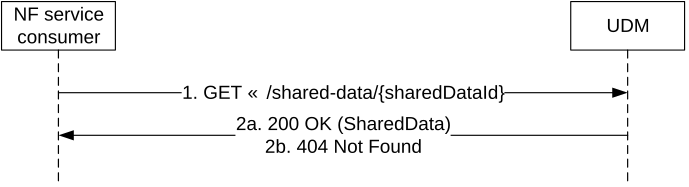

# 5.2.2.2.21 Individual Shared Subscription Data Retrieval

Figure 5.2.2.2.21-1 shows a scenario where the NF service consumer (e.g. AMF) sends a request to the UDM to receive the individual shared subscription data indicated by the sharedDataId. The request contains the type of the requested information (/shared-data/{sharedDataId} and query parameters (supported-features)).

Figure 5.2.2.2.21-1: Requesting shared data

1\. The NF service consumer (e.g. AMF) sends a GET request to the resource representing the individual SharedData indicated by the sharedDataId.

2a. On success, the UDM responds with "200 OK" with the message body containing the individual SharedData.

2b. If there is no valid individual SharedData indicated by the sharedDataId, HTTP status code "404 Not Found" shall be returned including additional error information in the response body (in the "ProblemDetails" element).

On failure, the appropriate HTTP status code indicating the error shall be returned and appropriate additional error information should be returned in the GET response body.
