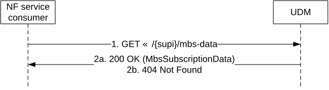

# 5.2.2.2.23 5MBS Subscription Data Retrieval

Figure 5.2.2.2.23-1 shows a scenario where the NF service consumer (e.g. SMF) sends a request to the UDM to receive the UE's 5MBS Subscription Data. The request contains the UE's identity (/{supi}), the type of the requested information (/mbs-data) and query parameters (supported-features).

Figure 5.2.2.2.23-1: Requesting a UE's 5MBS Subscription Data

1\. The NF service consumer (e.g. SMF) sends a GET request to the resource representing the UE's 5MBS Subscription Data, with query parameters indicating the supported-features.

2a. On Success, the UDM responds with "200 OK" with the message body containing the UE's 5MBS Subscription Data as relevant for the requesting NF service consumer.

On failure, the appropriate HTTP status code indicating the error shall be returned and appropriate additional error information should be returned in the GET response body.
