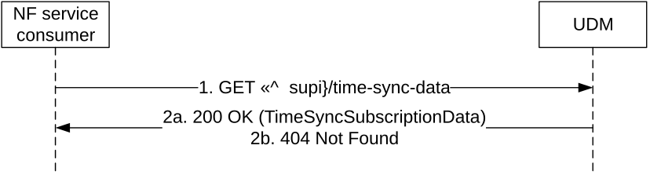

# 5.2.2.2.26 Time Synchronization Subscription Data Retrieval

Figure 5.2.2.2.26-1 shows a scenario where the NF service consumer (e.g. TSCTSF) sends a request to the UDM to receive the UE's Time Synchronization Subscription Data (see also clause 5.27.1.11 of TS 23.501 \[2\] and TS 23.502 \[3\] figure 4.28.3.1-1 step 3).

Figure 5.2.2.2.26-1: Requesting a UE's Time Synchronization Subscription Data

1\. The NF service consumer (e.g. TSCTSF) sends a GET request to the resource representing the UE's subscribed Time Synchronization Subscription Data.

2a. On success, the UDM responds with "200 OK" with the message body containing the UE's Time Synchronization Subscription Data.

2b. If there is no valid subscription data for the UE, HTTP status code "404 Not Found" shall be returned including additional error information in the response body (in the "ProblemDetails" element).

On failure, the appropriate HTTP status code indicating the error shall be returned and appropriate additional error information should be returned in the GET response body.
