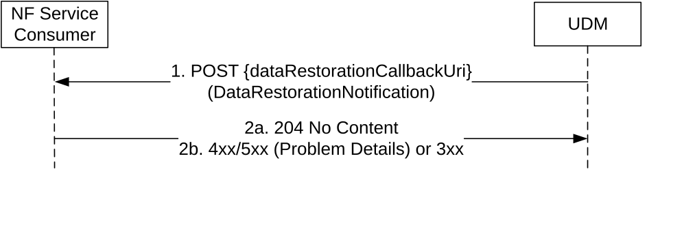

# 5.3.2.12 DataRestorationNotification

## 5.3.2.12.1 General

The following procedure using the DataRestorationNotification service operation is supported:

\- UDR-initiated Data Restoration

## 5.3.2.12.2 UDR-initiated Data Restoration

Figure 5.3.2.12.2-1 shows a scenario where the UDM notifies the NF Service Consumer (e.g., a registered AMF, SMF, SMSF) about the need to restore subscription-data due to a potential data-loss event occurred at the UDR. The request contains identities representing those UEs potentially affected by such event.

Figure 5.3.2.12.2-1: UDR-initiated Data Restoration

1\. The UDM (after receiving a notification from UDR about a potential data-loss event) sends a POST request to the dataRestorationCallbackUri; such callback URI may be provided by the NF service consumer during the registration, or dynamically discovered by UDM by querying the NRF for the NF Profile of the NF Service Consumer.

2a. On success, the NF Service Consumer responds with "204 No Content".

2b. On failure or redirection, one of the appropriate HTTP status codes listed in Table 6.2.5.3-3 shall be returned. For a 4xx/5xx response, the message body may contain appropriate additional error information.
