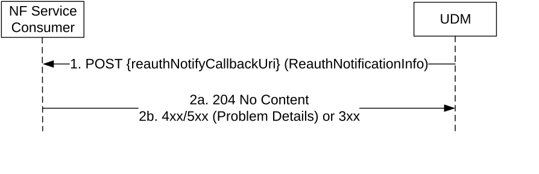

# 5.3.2.15 Re-AuthenticationNotification

## 5.3.2.15.1 General

The following procedure using the Re-AuthenticationNotification service operation is supported:

\- Reauthentication Notify

## 5.3.2.15.2 Reauthentication Notify

Figure 5.3.2.15.2-1 shows a scenario where the UDM notifies the NF Service Consumer (registered AMF) about the need to initiate primary UE authentication. The request contains the ReauthNotificationInfo.

Figure 5.3.2.15.2-1: Reauthentication Notify

1\. The UDM sends a POST request to the reauthNotifyCallbackUri; such callback URI may be provided by the NF service consumer during the registration, or dynamically discovered by UDM by querying the NRF for the NF Profile of the NF Service Consumer.

2a. On success, the NF Service Consumer responds with "204 No Content".

2b. On failure or redirection, one of the appropriate HTTP status codes listed in Table 6.2.5.6-3 shall be returned. For a 4xx/5xx response, the message body may contain appropriate additional error information.
