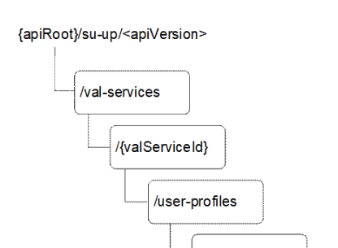

# C.2 Resource representation and APIs for VAL user profile

## C.2.1 SU_UserProfile API

### C.2.1.1 API URI

The CoAP URIs used in CoAP requests from SCM-C towards the SCM-S shall have the Resource URI structure as defined in clause C.1.1 with the following clarifications:

\- the \<apiName\> shall be "su-up";

\- the \<apiVersion\> shall be "v1"; and

\- the \<apiSpecificSuffixes\> shall be set as described in clause C.2.1.2.

### C.2.1.2 Resources

#### C.2.1.2.1 Overview

Figure C.2.1.2.1-1: Resource URI structure of the SU_UserProfile API

Table C.2.1.2.1-1 provides an overview of the resources and applicable CoAP methods.

Table C.2.1.2.1-1: Resources and methods overview

| Resource name           | Resource URI                                              | CoAP method | Description                                                                                       |
|-------------------------|-----------------------------------------------------------|-------------|---------------------------------------------------------------------------------------------------|
| User Profiles           | /val-services/{valServiceId}/user-profiles                | GET         | Retrieve VAL user or VAL UE's user profiles for a given VAL service, according to query criteria. |
|                         |                                                           | POST        | Create user profile.                                                                              |
| Individual User Profile | /val-services/{valServiceId}/user-profiles/{profileDocId} | GET         | Retrieve an individual user profile.                                                              |
|                         |                                                           | PUT         | Update an individual user profile.                                                                |
|                         |                                                           | DELETE      | Delete an individual user profile.                                                                |

#### C.2.1.2.2 Resource: User Profiles

##### C.2.1.2.2.1 Description

The User Profiles resource allows a SCM-C to retrieve all the user profiles of a VAL user or a VAL UE for a specific VAL service that are available at a given SCM-S, or allows to create a new user profile.

##### C.2.1.2.2.2 Resource Definition

Resource URI: **{apiRoot}/su-up/\<apiVersion\>/val-services/{valServiceId}/user-profiles**

This resource shall support the resource URI variables defined in the table C.2.1.2.2.2-1.

Table C.2.1.2.2.2-1: Resource URI variables for this resource

| Name         | Data Type | Definition                   |
|--------------|-----------|------------------------------|
| apiRoot      | string    | See clause C.1.1             |
| apiVersion   | string    | See clause C.2.1.1           |
| valServiceId | string    | Identifier of a VAL service. |

##### C.2.1.2.2.3 Resource Standard Methods

###### C.2.1.2.2.3.1 GET

This operation retrieves VAL user or VAL UE profile information satisfying the filter criteria.

This method shall support the URI query parameters specified in table C.2.1.2.2.3.1-1.

Table C.2.1.2.2.3.1-1: URI query parameters supported by the GET Request on this resource

|            |             |     |             |                             |
|------------|-------------|-----|-------------|-----------------------------|
| Name       | Data type   | P   | Cardinality | Description                 |
| val-tgt-ue | ValTargetUe | M   | 1           | Identifies a VAL target UE. |

This method shall support the response data structures and response codes specified in table C.2.1.2.2.3.1-2.

Table C.2.1.2.2.3.1-2: Data structures supported by the GET Response payload on this resource

<table>
<colgroup>
<col style="width: 16%" />
<col style="width: 9%" />
<col style="width: 14%" />
<col style="width: 19%" />
<col style="width: 39%" />
</colgroup>
<tbody>
<tr class="odd">
<td>Data type</td>
<td>P</td>
<td>Cardinality</td>
<td>
Response

codes
</td>
<td>Description</td>
</tr>
<tr class="even">
<td>array(ProfileDoc)</td>
<td>M</td>
<td>0..N</td>
<td>2.05 Content</td>
<td>List of VAL user / VAL UE profile documents. This response shall include user profile information matching the query parameters provided in the request.</td>
</tr>
<tr class="odd">
<td colspan="5">NOTE: The mandatory CoAP error status codes for the GET Request listed in table C.1.3-1 shall also apply.</td>
</tr>
</tbody>
</table>

###### C.2.1.2.2.3.2 POST

This operation creates a VAL user or VAL UE profile information at the SCM-S for a given VAL service.

This method shall support the request data structures specified in table C.2.1.2.2.3.2-1, the response data structures and response codes specified in table C.2.1.2.2.3.2-2, and the response options specified in table C.2.1.2.2.3.2-3.

Table C.2.1.2.2.3.2-1: Data structures supported by the POST Request payload on this resource

|            |     |             |                                                                   |
|------------|-----|-------------|-------------------------------------------------------------------|
| Data type  | P   | Cardinality | Description                                                       |
| ProfileDoc | M   | 1           | The user profile document to be created for a VAL user or VAL UE. |

Table C.2.1.2.2.3.2-2: Data structures supported by the POST Response payload on this resource

<table>
<colgroup>
<col style="width: 16%" />
<col style="width: 9%" />
<col style="width: 14%" />
<col style="width: 19%" />
<col style="width: 39%" />
</colgroup>
<tbody>
<tr class="odd">
<td>Data type</td>
<td>P</td>
<td>Cardinality</td>
<td>
Response

codes
</td>
<td>Description</td>
</tr>
<tr class="even">
<td>ProfileDoc</td>
<td>O</td>
<td>0..1</td>
<td>2.01 Created</td>
<td>
The user profile was created successfully.

The "profileDocId" of the created resource shall be returned in the "Location-Path" option.
</td>
</tr>
<tr class="odd">
<td colspan="5">NOTE: The mandatory CoAP error status codes for the POST method listed in table C.1.3-1 shall also apply.</td>
</tr>
</tbody>
</table>

Table C.2.1.2.2.3.2-3: Options supported by the 2.01 Response Code on this resource

<table>
<colgroup>
<col style="width: 16%" />
<col style="width: 14%" />
<col style="width: 4%" />
<col style="width: 11%" />
<col style="width: 52%" />
</colgroup>
<tbody>
<tr class="odd">
<td>Name</td>
<td>Data type</td>
<td>P</td>
<td>Cardinality</td>
<td>Description</td>
</tr>
<tr class="even">
<td>Location-Path</td>
<td>string</td>
<td>M</td>
<td>1</td>
<td>
Contains the location path of the newly created resource relative to the request URI.

It contains the profileDocId segment of the complete resource URI according to the structure: {apiRoot}/su-up/&lt;apiVersion&gt;/val-services/{valServiceId}/user-profiles/{profileDocId}
</td>
</tr>
</tbody>
</table>

#### C.2.1.2.3 Resource: Individual User Profile

##### C.2.1.2.3.1 Description

The Individual User Profile resource represents an individual user profile that is created at the SCM-S for a given VAL service. This resource is observable.

##### C.2.1.2.3.2 Resource Definition

Resource URI: **{apiRoot}/su-up/\<apiVersion\>/val-services/{valServiceId}/user-profiles/{profileDocId}**

This resource shall support the resource URI variables defined in the table C.2.1.2.3.2-1.

Table C.2.1.2.3.2-1: Resource URI variables for this resource

| Name         | Data Type | Definition                                      |
|--------------|-----------|-------------------------------------------------|
| apiRoot      | string    | See clause C.1.1                                |
| apiVersion   | string    | See clause C.2.1.1                              |
| valServiceId | string    | Identifier of a VAL service.                    |
| profileDocId | string    | Represents an individual user profile resource. |

##### C.2.1.2.3.3 Resource Standard Methods

###### C.2.1.2.3.3.1 GET

This operation retrieves the user profile document.

This method shall support the request options specified in table C.2.1.2.3.3.1-1, the response data structures and response codes specified in table C.2.1.2.3.3.1-2, and the response options specified in table C.2.1.2.3.3.1-3.

Table C.2.1.2.3.3.1-1: Options supported by the GET Request on this resource

<table>
<colgroup>
<col style="width: 16%" />
<col style="width: 14%" />
<col style="width: 4%" />
<col style="width: 11%" />
<col style="width: 52%" />
</colgroup>
<tbody>
<tr class="odd">
<td>Name</td>
<td>Data type</td>
<td>P</td>
<td>Cardinality</td>
<td>Description</td>
</tr>
<tr class="even">
<td>Observe</td>
<td>Uinteger</td>
<td>O</td>
<td>0..1</td>
<td>
When set to 0 (Register) it extends the GET request to subscribe to the changes of this resource.

When set to 1 (Deregister) it cancels the subscription.
</td>
</tr>
<tr class="odd">
<td colspan="5">NOTE: Other request options also apply in accordance with normal CoAP procedures.</td>
</tr>
</tbody>
</table>

Table C.2.1.2.3.3.1-2: Data structures supported by the GET Response payload on this resource

<table>
<colgroup>
<col style="width: 0%" />
<col style="width: 16%" />
<col style="width: 9%" />
<col style="width: 14%" />
<col style="width: 19%" />
<col style="width: 39%" />
</colgroup>
<tbody>
<tr class="odd">
<td colspan="2">Data type</td>
<td>P</td>
<td>Cardinality</td>
<td>
Response

codes
</td>
<td>Description</td>
</tr>
<tr class="even">
<td colspan="2">ProfileDoc</td>
<td>M</td>
<td>1</td>
<td>2.05 Content</td>
<td>The User profile information based on the request from the SCM-C.</td>
</tr>
<tr class="odd">
<td colspan="5">NOTE: The mandatory CoAP error status codes for the GET Request listed in table C.1.3-1 shall also apply.</td>
<td></td>
</tr>
</tbody>
</table>

Table C.2.1.2.3.3.1-3: Options supported by the 2.05 Response Code on this resource

|                                                                                    |           |     |             |                                      |
|------------------------------------------------------------------------------------|-----------|-----|-------------|--------------------------------------|
| Name                                                                               | Data type | P   | Cardinality | Description                          |
| Observe                                                                            | Uinteger  | O   | 0..1        | Sequence number of the notification. |
| NOTE: Other response options also apply in accordance with normal CoAP procedures. |           |     |             |                                      |

###### C.2.1.2.3.3.2 PUT

This operation updates the user profile document.

This method shall support the request data structures specified in table C.2.1.2.3.3.2-1 and the response data structures and response codes specified in table C.2.1.2.3.3.2-2.

Table C.2.1.2.3.3.2-1: Data structures supported by the PUT Request payload on this resource

|            |     |             |                                               |
|------------|-----|-------------|-----------------------------------------------|
| Data type  | P   | Cardinality | Description                                   |
| ProfileDoc | M   | 1           | Updated details of the user profile document. |

Table C.2.1.2.3.3.2-2: Data structures supported by the PUT Response payload on this resource

<table>
<colgroup>
<col style="width: 16%" />
<col style="width: 9%" />
<col style="width: 14%" />
<col style="width: 19%" />
<col style="width: 39%" />
</colgroup>
<tbody>
<tr class="odd">
<td>Data type</td>
<td>P</td>
<td>Cardinality</td>
<td>
Response

codes
</td>
<td>Description</td>
</tr>
<tr class="even">
<td>ProfileDoc</td>
<td>O</td>
<td>0..1</td>
<td>2.04 Changed</td>
<td>The user profile document updated successfully and the updated user profile document may be returned in the response.</td>
</tr>
<tr class="odd">
<td colspan="5">NOTE: The mandatory CoAP error status codes for the PUT method listed in table C.1.3-1 shall also apply.</td>
</tr>
</tbody>
</table>

###### C.2.1.2.3.3.3 DELETE

This operation deletes the user profile document.

This method shall support the response data structures and response codes specified in table C.2.1.2.3.3.3-1.

Table C.2.1.2.3.3.3-1: Data structures supported by the DELETE Response payload on this resource

<table>
<colgroup>
<col style="width: 16%" />
<col style="width: 9%" />
<col style="width: 14%" />
<col style="width: 19%" />
<col style="width: 39%" />
</colgroup>
<tbody>
<tr class="odd">
<td>Data type</td>
<td>P</td>
<td>Cardinality</td>
<td>
Response

codes
</td>
<td>Description</td>
</tr>
<tr class="even">
<td>n/a</td>
<td></td>
<td></td>
<td>2.02 Deleted</td>
<td>The individual User profile document matching the profileDocId is deleted.</td>
</tr>
<tr class="odd">
<td colspan="5">NOTE: The mandatory CoAP error status codes for the DELETE method listed in table C.1.3-1 shall also apply.</td>
</tr>
</tbody>
</table>

### C.2.1.3 Data Model

#### C.2.1.3.1 General

Table C.2.1.3.1-1 specifies the data types defined specifically for the SU_UserProfile API service.

Table C.2.1.3.1-1: SU_UserProfile API specific Data Types

| Data type     | Section defined | Description                                                                | Applicability |
|---------------|-----------------|----------------------------------------------------------------------------|---------------|
| ProfileDoc    | C.2.1.3.2.1     | Profile information associated with VAL user ID or VAL UE ID.              |               |
| ProfileInfo   | C.2.1.3.2.2     | Profile information including profile configurations.                      |               |
| ProfileConfig | C.2.1.3.2.3     | Profile configuration including configuration data.                        |               |
| ConfigType    | C.2.1.3.3.1     | Specifies type of features for which the configuration data is applicable. |               |
| ValTargetUe   | C.2.1.3.2.4     | Information identifying a VAL user ID or VAL UE ID.                        |               |

#### C.2.1.3.2 Structured data types

##### C.2.1.3.2.1 Type: ProfileDoc

Table C.2.1.3.2.1-1: Definition of type ProfileDoc

<table>
<colgroup>
<col style="width: 17%" />
<col style="width: 17%" />
<col style="width: 4%" />
<col style="width: 11%" />
<col style="width: 34%" />
<col style="width: 14%" />
</colgroup>
<thead>
<tr class="header">
<th>Attribute name</th>
<th>Data type</th>
<th>P</th>
<th>Cardinality</th>
<th>Description</th>
<th>Applicability</th>
</tr>
</thead>
<tbody>
<tr class="odd">
<td>profileDocId</td>
<td>string</td>
<td>O</td>
<td>0..1</td>
<td>
Contains the profileDocId of the complete resource URI of this user profile document according to the structure: {apiRoot}/su-up/&lt;apiVersion&gt;/val-services/{valServiceId}/user-profiles/{profileDocId}

This attribute shall be provided by the SCM-S in CoAP responses.
</td>
<td></td>
</tr>
<tr class="even">
<td>profileInformation</td>
<td>ProfileInfo</td>
<td>M</td>
<td>1</td>
<td>Profile information associated with a VAL user or a VAL UE as specified in valTgtUe.</td>
<td></td>
</tr>
<tr class="odd">
<td>valTgtUe</td>
<td>ValTargetUe</td>
<td>M</td>
<td>1</td>
<td>Unique identifier of a VAL user or a VAL UE.</td>
<td></td>
</tr>
</tbody>
</table>

##### C.2.1.3.2.2 Type: ProfileInfo

Table C2.1.4.2.2-1: Definition of type ProfileInfo

| Attribute name  | Data type            | P   | Cardinality | Description                                                                    | Applicability |
|-----------------|----------------------|-----|-------------|--------------------------------------------------------------------------------|---------------|
| profileName     | string               | O   | 0..1        | Name of the user profile.                                                      |               |
| status          | boolean              | M   | 1           | Indicates whether the user profile is enabled or disabled.                     |               |
| profileConfigs) | Array(ProfileConfig) | O   | 1..N        | List of profile configurations.                                                |               |
| isDefault       | boolean              | O   | 0..1        | Indicates whether the user profile is the default profile for VAL user or not. |               |

##### C.2.1.3.2.3 Type: ProfileConfig

Table C.2.1.3.2.3-1: Definition of type ProfileConfig

| Attribute name | Data type  | P   | Cardinality | Description                                      | Applicability |
|----------------|------------|-----|-------------|--------------------------------------------------|---------------|
| configType     | ConfigType | M   | 1           | Indicates the type of the profile configuration. |               |
| configData     | string     | M   | 1           | Actual user profile configuration data.          |               |

##### C.2.1.3.2.4 Type: ValTargetUe

Table C.2.1.3.2.4-1: Definition of type ValTargetUe

| Attribute name                                          | Data type | P   | Cardinality | Description                      | Applicability |
|---------------------------------------------------------|-----------|-----|-------------|----------------------------------|---------------|
| valUserId                                               | string    | O   | 0..1        | Unique identifier of a VAL user. |               |
| valUeId                                                 | string    | O   | 0..1        | Unique identifier of a VAL UE.   |               |
| NOTE: Either "valUserId" or "valUeId" shall be present. |           |     |             |                                  |               |

#### C.2.1.3.3 Simple data types and enumerations

##### C.2.1.3.3.1 Enumeration: ConfigType

Table C.2.1.3.3.1-1: Enumeration ConfigType

| Enumeration value | Description                                                            | Applicability |
|-------------------|------------------------------------------------------------------------|---------------|
| COMMON            | Indicates VAL service specific configuration for common features.      |               |
| ON_NETWORK        | Indicates VAL service specific configuration for on-network features.  |               |
| OFF_NETWORK       | Indicates VAL service specific configuration for off-network features. |               |

### C.2.1.4 Error Handling

General error responses are defined in clause C.1.3.

### C.2.1.5 CDDL Specification

#### C.2.1.5.1 Introduction

The data model described in clause C.2.1.3 shall be binary encoded in the CBOR format as described in IETF RFC 8949 \[17\].

Clause C.2.1.5.2 uses the Concise Data Definition Language described in IETF RFC 8610 \[18\] and provides corresponding representation of the SU_UserProfile API data model.

#### C.2.1.5.2 CDDL document

;;; ProfileDoc

;;+ Represents user profile information associated with a VAL user ID or a VAL UE ID.

ProfileDoc = {

? profileDocId: tstr

profileInformation: ProfileInfo

valTgtUe: ValTargetUe

\* tstr =\> any

}

;;; ValTargetUe

;;+ Represents information identifying a VAL user ID or a VAL UE ID.

ValTargetUe = {

(

valUserId: tstr ; Unique identifier of a VAL user.

//

valUeId: tstr ; Unique identifier of a VAL UE.

)

}

;;; ProfileInfo

;;+ User profile information.

ProfileInfo = {

? profileName: tstr ; Name of the profile

status: bool ; Indicates whether the user profile is enabled or disabled.

? profileConfigs: \[+ ProfileConfig\]

? isDefault: bool ; Indicates whether the user profile is the default profile for VAL user or not.

\* tstr =\> any

}

;;; ProfileConfig

;;+ Profile configuration.

ProfileConfig = {

configType: ConfigType

configData: tstr ; Actual user profile configuration data.

\* tstr =\> any

}

;;; ConfigType

;;+ Indicates the type of the configuration.

ConfigType = "COMMON" / "ON_NETWORK" / "OFF_NETWORK" / tstr ; tstr value provides forward-compatibility with future extensions to the enumeration but is not used to encode content defined in the present version of this API.

### C.2.1.6 Media Type

The media type for a user profile document shall be "application/vnd.3gpp.seal-user-profile-info+cbor".

### C.2.1.7 Media Type registration for application/vnd.3gpp.seal-user-profile-info+cbor

Type name: application

Subtype name: vnd.3gpp.seal-user-profile-info+cbor

Required parameters: none

Optional parameters: none

Encoding considerations: Must be encoded as using IETF RFC 8949 \[17\]. See 3GPP TS 24.546 clause C.2.1.3 for details.

Security considerations: See Section 10 of IETF RFC 8949 \[17\] and Section 11 of IETF RFC 7252 \[12\].

Interoperability considerations: Applications must ignore any key-value pairs that they do not understand. This allows backwards-compatible extensions to this specification.

Published specification: 3GPP TS 24.546 "Configuration management - Service Enabler Architecture Layer for Verticals (SEAL); Protocol specification", available via http://www.3gpp.org/specs/numbering.htm.

Applications that use this media type: Applications supporting the SEAL configuration management procedures as described in the published specification.

Fragment identifier considerations: Fragment identification is the same as specified for "application/cbor" media type in IETF RFC 8949 \[17\]. Note that currently that RFC does not define fragmentation identification syntax for "application/cbor".

Additional information:

Deprecated alias names for this type: N/A

Magic number(s): N/A

File extension(s): none

Macintosh file type code(s): none

Person & email address to contact for further information: \<MCC name\>, \<MCC email address\>

Intended usage: COMMON

Restrictions on usage: None

Author: 3GPP CT1 Working Group/3GPP_TSG_CT_WG1@LIST.ETSI.ORG

Change controller: \<MCC name\>/\<MCC email address\>
