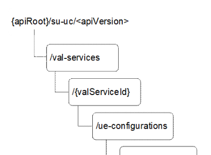

# C.3 Resource representation and APIs for UE configuration

## C.3.1 SU_UeConfig API

### C.3.1.1 API URI

The CoAP URIs used in CoAP requests from SCM-C towards the SCM-S shall have the Resource URI structure as defined in clause C.1.1 with the following clarifications:

\- the \<apiName\> shall be "su-uc";

\- the \<apiVersion\> shall be "v1"; and

\- the \<apiSpecificSuffixes\> shall be set as described in clause C.3.1.2.

### C.3.1.2 Resources

#### C.3.1.2.1 Overview

Figure C.3.1.2.1-1: Resource URI structure of the SU_UeConfig API

Table C.3.1.2.1-1 provides an overview of the resources and applicable CoAP methods.

Table C.3.1.2.1-1: Resources and methods overview

| Resource name               | Resource URI                                                   | CoAP method | Description                                                                      |
|-----------------------------|----------------------------------------------------------------|-------------|----------------------------------------------------------------------------------|
| UE Configurations           | /val-services/{valServiceId}/ue-configurations                 | GET         | Retrieve UE configurations for a given VAL service, according to query criteria. |
|                             |                                                                | POST        | Create UE configuration.                                                         |
| Individual UE Configuration | /val-services/{valServiceId}/ue-configurations/{ueConfigDocId} | GET         | Retrieve an individual UE configuration.                                         |
|                             |                                                                | PUT         | Update an individual UE configuration.                                           |
|                             |                                                                | DELETE      | Delete an individual UE configuration.                                           |

Editor's note: Whether any changes required in the API along with its data model based on limitations of constrained devices is FFS.

#### C.3.1.2.2 Resource: UE Configurations

##### C.3.1.2.2.1 Description

The UE Configurations resource allows a SCM-C to retrieve all the UE configurations of a VAL service domain (e.g. based on device type, device vendor, device number, etc) for a specific VAL service that are available at a given SCM-S.

##### C.3.1.2.2.2 Resource Definition

Resource URI: **{apiRoot}/su-uc/\<apiVersion\>/val-services/{valServiceId}/ue-configurations**

This resource shall support the resource URI variables defined in the table C.3.1.2.2.2-1.

Table C.3.1.2.2.2-1: Resource URI variables for this resource

| Name         | Data Type | Definition                   |
|--------------|-----------|------------------------------|
| apiRoot      | string    | See clause C.1.1             |
| apiVersion   | string    | See clause C3.1.1            |
| valServiceId | string    | Identifier of a VAL service. |

##### C.3.1.2.2.3 Resource Standard Methods

###### C.3.1.2.2.3.1 GET

This operation retrieves UE configurations satisfying the query criteria.

This method shall support the URI query parameters specified in table C.3.1.2.2.3.1-1.

Table C.3.1.2.2.3.1-1: URI query parameters supported by the GET Request on this resource

|           |                    |     |             |                            |
|-----------|--------------------|-----|-------------|----------------------------|
| Name      | Data type          | P   | Cardinality | Description                |
| ue-vendor | string             | O   | 0..1        | Identity of the UE vendor. |
| ue-type   | TypeAllocationCode | O   | 0..1        | Type of the UE.            |
| ue-snr    | SerialNumber       | O   | 0..1        | Serial number of the UE.   |
| ue-uri    | Uri                | O   | 0..1        | URI of the UE.             |

This method shall support the response data structures and response codes specified in table C.3.1.2.2.3.1-2.

Table C.3.1.2.2.3.1-2: Data structures supported by the GET Response payload on this resource

<table>
<colgroup>
<col style="width: 16%" />
<col style="width: 9%" />
<col style="width: 14%" />
<col style="width: 19%" />
<col style="width: 39%" />
</colgroup>
<tbody>
<tr class="odd">
<td>Data type</td>
<td>P</td>
<td>Cardinality</td>
<td>
Response

codes
</td>
<td>Description</td>
</tr>
<tr class="even">
<td>array(UeConfigDoc)</td>
<td>M</td>
<td>0..N</td>
<td>2.05 Content</td>
<td>List of UE configuration documents matching any of the query parameters provided in the request. If no query parameters are given, all the UE configuration documents are returned.</td>
</tr>
<tr class="odd">
<td colspan="5">NOTE: The mandatory CoAP error status codes for the GET Request listed in table C.1.3-1 shall also apply.</td>
</tr>
</tbody>
</table>

###### C.3.1.2.2.3.2 POST

This operation creates a UE configuration at the SCM-S for a given VAL service.

This method shall support the request data structures specified in table C.3.1.2.2.3.2-1, the response data structures and response codes specified in table C.3.1.2.2.3.2-2, and the response options specified in table C.3.1.2.2.3.2-3.

Table C.3.1.2.2.3.2-1: Data structures supported by the POST Request payload on this resource

|             |     |             |                                     |
|-------------|-----|-------------|-------------------------------------|
| Data type   | P   | Cardinality | Description                         |
| UeConfigDoc | M   | 1           | The UE configuration to be created. |

Table C.3.1.2.2.3.2-2: Data structures supported by the POST Response payload on this resource

<table>
<colgroup>
<col style="width: 16%" />
<col style="width: 9%" />
<col style="width: 14%" />
<col style="width: 19%" />
<col style="width: 39%" />
</colgroup>
<tbody>
<tr class="odd">
<td>Data type</td>
<td>P</td>
<td>Cardinality</td>
<td>
Response

codes
</td>
<td>Description</td>
</tr>
<tr class="even">
<td>UeConfigDoc</td>
<td>O</td>
<td>0..1</td>
<td>2.01 Created</td>
<td>
The UE configuration was created successfully.

The "ueConfigDocId" of the created resource shall be returned in the "Location-Path" option.
</td>
</tr>
<tr class="odd">
<td colspan="5">NOTE: The mandatory CoAP error status codes for the POST method listed in table C.1.3-1 shall also apply.</td>
</tr>
</tbody>
</table>

Table C.3.1.2.2.3.2-3: Options supported by the 2.01 Response Code on this resource

<table>
<colgroup>
<col style="width: 16%" />
<col style="width: 14%" />
<col style="width: 4%" />
<col style="width: 11%" />
<col style="width: 52%" />
</colgroup>
<tbody>
<tr class="odd">
<td>Name</td>
<td>Data type</td>
<td>P</td>
<td>Cardinality</td>
<td>Description</td>
</tr>
<tr class="even">
<td>Location-Path</td>
<td>string</td>
<td>M</td>
<td>1</td>
<td>
Contains the location path of the newly created resource relative to the request URI.

It contains the ueConfigDocId segment of the complete resource URI according to the structure: {apiRoot}/su-uc/&lt;apiVersion&gt;/val-services/{valServiceId}/ue-configurations/{ueConfigDocId}
</td>
</tr>
</tbody>
</table>

#### C.3.1.2.3 Resource: Individual UE Configuration

##### C.3.1.2.3.1 Description

The Individual UE Configuration resource represents an individual UE configuration stored at the SCM-S for a given VAL service. This resource is observable.

##### C.3.1.2.3.2 Resource Definition

Resource URI: **{apiRoot}/su-uc/\<apiVersion\>/val-services/{valServiceId}/ue-configurations/{ueConfigDocId}**

This resource shall support the resource URI variables defined in the table C.3.1.2.3.2-1.

Table C.3.1.2.3.2-1: Resource URI variables for this resource

| Name          | Data Type | Definition                                          |
|---------------|-----------|-----------------------------------------------------|
| apiRoot       | string    | See clause C.1.1                                    |
| apiVersion    | string    | See clause C.2.1.1                                  |
| valServiceId  | string    | Identifier of a VAL service.                        |
| ueConfigDocId | string    | Represents an individual UE configuration resource. |

##### C.3.1.2.3.3 Resource Standard Methods

###### C.3.1.2.3.3.1 GET

This operation retrieves the UE configuration document.

This method shall support the request options specified in table C.3.1.2.3.3.1-1, the response data structures and response codes specified in table C.3.1.2.3.3.1-2, and the response options specified in table C.3.1.2.3.3.1-3.

Table C.3.1.2.3.3.1-1: Options supported by the GET Request on this resource

<table>
<colgroup>
<col style="width: 16%" />
<col style="width: 14%" />
<col style="width: 4%" />
<col style="width: 11%" />
<col style="width: 52%" />
</colgroup>
<tbody>
<tr class="odd">
<td>Name</td>
<td>Data type</td>
<td>P</td>
<td>Cardinality</td>
<td>Description</td>
</tr>
<tr class="even">
<td>Observe</td>
<td>Uinteger</td>
<td>O</td>
<td>0..1</td>
<td>
When set to 0 (Register) it extends the GET request to subscribe to the changes of this resource.

When set to 1 (Deregister) it cancels the subscription.
</td>
</tr>
<tr class="odd">
<td colspan="5">NOTE: Other request options also apply in accordance with normal CoAP procedures.</td>
</tr>
</tbody>
</table>

Table C.3.1.2.3.3.1-2: Data structures supported by the GET Response payload on this resource

<table>
<colgroup>
<col style="width: 16%" />
<col style="width: 9%" />
<col style="width: 14%" />
<col style="width: 19%" />
<col style="width: 39%" />
</colgroup>
<tbody>
<tr class="odd">
<td>Data type</td>
<td>P</td>
<td>Cardinality</td>
<td>
Response

codes
</td>
<td>Description</td>
</tr>
<tr class="even">
<td>UeConfigDoc</td>
<td>M</td>
<td>1</td>
<td>2.05 Content</td>
<td>The UE configuration based on the request from the SCM-C.</td>
</tr>
<tr class="odd">
<td colspan="5">NOTE: The mandatory CoAP error status codes for the GET Request listed in table C.1.3-1 shall also apply.</td>
</tr>
</tbody>
</table>

Table C.3.1.2.3.3.1-3: Options supported by the 2.05 Response Code on this resource

|                                                                                    |           |     |             |                                      |
|------------------------------------------------------------------------------------|-----------|-----|-------------|--------------------------------------|
| Name                                                                               | Data type | P   | Cardinality | Description                          |
| Observe                                                                            | Uinteger  | O   | 0..1        | Sequence number of the notification. |
| NOTE: Other response options also apply in accordance with normal CoAP procedures. |           |     |             |                                      |

###### C.3.1.2.3.3.2 PUT

This operation updates the UE configuration document.

This method shall support the request data structures specified in table C.3.1.2.3.3.2-1 and the response data structures and response codes specified in table C.3.1.2.3.3.2-2.

Table C.3.1.2.3.3.2-1: Data structures supported by the PUT Request payload on this resource

|             |     |             |                                                   |
|-------------|-----|-------------|---------------------------------------------------|
| Data type   | P   | Cardinality | Description                                       |
| UeConfigDoc | M   | 1           | Updated details of the UE configuration document. |

Table C.3.1.2.3.3.2-2: Data structures supported by the PUT Response payload on this resource

<table>
<colgroup>
<col style="width: 16%" />
<col style="width: 9%" />
<col style="width: 14%" />
<col style="width: 19%" />
<col style="width: 39%" />
</colgroup>
<tbody>
<tr class="odd">
<td>Data type</td>
<td>P</td>
<td>Cardinality</td>
<td>
Response

codes
</td>
<td>Description</td>
</tr>
<tr class="even">
<td>UeConfigDoc</td>
<td>O</td>
<td>1</td>
<td>2.04 Changed</td>
<td>The UE configuration document updated successfully and the updated UE configuration document may be returned in the response.</td>
</tr>
<tr class="odd">
<td colspan="5">NOTE: The mandatory CoAP error status codes for the PUT method listed in table C.1.3-1 shall also apply.</td>
</tr>
</tbody>
</table>

###### C.3.1.2.3.3.3 DELETE

This operation deletes the UE configuration document.

This method shall support the response data structures and response codes specified in table C.3.1.2.3.3.3-1.

Table C.3.1.2.3.3.3-1: Data structures supported by the DELETE Response payload on this resource

<table>
<colgroup>
<col style="width: 16%" />
<col style="width: 9%" />
<col style="width: 14%" />
<col style="width: 19%" />
<col style="width: 39%" />
</colgroup>
<tbody>
<tr class="odd">
<td>Data type</td>
<td>P</td>
<td>Cardinality</td>
<td>
Response

codes
</td>
<td>Description</td>
</tr>
<tr class="even">
<td>n/a</td>
<td></td>
<td></td>
<td>2.02 Deleted</td>
<td>The individual UE configuration document matching the ueConfigDocId is deleted.</td>
</tr>
<tr class="odd">
<td colspan="5">NOTE: The mandatory CoAP error status codes for the DELETE method listed in table C.1.3-1 shall also apply.</td>
</tr>
</tbody>
</table>

### C.3.1.3 Data Model

#### C.3.1.3.1 General

Table C.3.1.3.1-1 specifies the data types defined specifically for the SU_UeConfig resource representation.

Table C.3.1.3.1-1: SU_UeConfig API specific data types

| Data type          | Section defined | Description                                    | Applicability |
|--------------------|-----------------|------------------------------------------------|---------------|
| UeConfigDoc        | C.3.1.3.2.1     | UE configuration document.                     |               |
| UeConfig           | C.3.1.3.2.2     | UE configuration including configuration data. |               |
| ValUeIds           | C.3.1.3.2.3     | VAL UE identifiers.                            |               |
| ImeiRange          | C.3.1.3.2.4     | Range of IMEIs.                                |               |
| SnrRange           | C.3.1.3.2.5     | Range of UE serial numbers.                    |               |
| SerialNumber       | C.3.1.3.3.1     | Serial number of a UE.                         |               |
| TypeAllocationCode | C.3.1.3.3.1     | Type allocation code.                          |               |

Table C.3.1.3.1-2 specifies data types re-used by the SU_UeConfig API service:

Table C.3.1.3.1-2: Reused data types

| Data type  | Reference   | Comments                     | Applicability |
|------------|-------------|------------------------------|---------------|
| ConfigType | C.2.1.3.3.1 | Configuration type.          |               |
| Uri        | C.1.4.3     | Unified resource identifier. |               |

#### C.3.1.3.2 Structured data types

##### C.3.1.3.2.1 Type: UeConfigDoc

Table C.3.1.3.2.1-1: Definition of type UeConfigDoc

<table>
<colgroup>
<col style="width: 17%" />
<col style="width: 16%" />
<col style="width: 4%" />
<col style="width: 11%" />
<col style="width: 35%" />
<col style="width: 14%" />
</colgroup>
<thead>
<tr class="header">
<th>Attribute name</th>
<th>Data type</th>
<th>P</th>
<th>Cardinality</th>
<th>Description</th>
<th>Applicability</th>
</tr>
</thead>
<tbody>
<tr class="odd">
<td>ueConfigDocId</td>
<td>string</td>
<td>O</td>
<td>0..1</td>
<td>
Contains the ueConfigDocId of the complete resource URI of this UE configuration document according to the structure: {apiRoot}/su-uc/&lt;apiVersion&gt;/val-services/{valServiceId}/ue-configurations/{ueConfigDocId}

This attribute shall be provided by the SCM-S in CoAP responses.
</td>
<td></td>
</tr>
<tr class="even">
<td>configName</td>
<td>string</td>
<td>O</td>
<td></td>
<td>Displayable name of the UE configuration document.</td>
<td></td>
</tr>
<tr class="odd">
<td>valServiceDomain</td>
<td>string</td>
<td>M</td>
<td>1</td>
<td>Domain name of the VAL service for which the configuration document is applicable.</td>
<td></td>
</tr>
<tr class="even">
<td>valServiceId</td>
<td>string</td>
<td>O</td>
<td>0..1</td>
<td>VAL service identity for which the configuration document is applicable.</td>
<td></td>
</tr>
<tr class="odd">
<td>valUeIds</td>
<td>ValUeIds</td>
<td>O</td>
<td>0..1</td>
<td>Defines a set of VAL UE IDs for which the configuration document is applicable.</td>
<td></td>
</tr>
<tr class="even">
<td>ueConfigs</td>
<td>array(UeConfig)</td>
<td>O</td>
<td>1..N</td>
<td>List of UE configurations of different configuration types, i.e. there shall not be 2 configuration with the same value of configType.</td>
<td></td>
</tr>
</tbody>
</table>

##### C.3.1.3.2.2 Type: UeConfig

Table C.3.1.3.2.2-1: Definition of type UeConfig

| Attribute name                                                                           | Data type         | P   | Cardinality | Description                                 | Applicability |
|------------------------------------------------------------------------------------------|-------------------|-----|-------------|---------------------------------------------|---------------|
| configType                                                                               | ConfigType (NOTE) | M   | 1           | Indicates the type of the UE configuration. |               |
| configData                                                                               | string            | M   | 1           | Actual UE configuration data.               |               |
| NOTE: Only the values COMMON and ON_NETWORK are applicable in the present specification. |                   |     |             |                                             |               |

##### C.3.1.3.2.3 Type: ValUeIds

Table C.3.1.3.2.3-1: Definition of type ValUeIds

| Attribute name | Data type        | P   | Cardinality | Description                                                | Applicability |
|----------------|------------------|-----|-------------|------------------------------------------------------------|---------------|
| uris           | array(Uri)       | O   | 1..N        | List of VAL UE identities, each identity defined by a URI. |               |
| imeiRanges     | array(ImeiRange) | O   | 1..N        | List of IMEI ranges.                                       |               |

##### C.3.1.3.2.4 Type: ImeiRange

Table C.3.1.3.2.4-1: Definition of type ImeiRange

| Attribute name | Data type           | P   | Cardinality | Description                      | Applicability |
|----------------|---------------------|-----|-------------|----------------------------------|---------------|
| tac            | TypeAllocationCode  | M   | 1           | Type allocation code of the UEs. |               |
| snrs           | array(SerialNumber) | O   | 1..N        | List of UE serial numbers.       |               |
| snrRange       | SnrRange            | O   | 0..1        | Range of UE serial numbers.      |               |

##### C.3.1.3.2.5 Type: SnrRange

Table C.3.1.3.2.5-1: Definition of type SnrRange

| Attribute name | Data type    | P   | Cardinality | Description                                                               | Applicability |
|----------------|--------------|-----|-------------|---------------------------------------------------------------------------|---------------|
| low            | SerialNumber | M   | 1           | First UE serial number identifying the start of a UE serial number range. |               |
| high           | SerialNumber | M   | 1           | Last UE serial number identifying the end of a UE serial number range.    |               |

#### C.3.1.3.3 Simple data types and enumerations

##### C.3.1.3.3.1 Simple data types

Table C.3.1.3.3.1-1: Simple data types

<table>
<colgroup>
<col style="width: 20%" />
<col style="width: 20%" />
<col style="width: 59%" />
</colgroup>
<tbody>
<tr class="odd">
<td>Type Name</td>
<td>Type Definition</td>
<td>Description</td>
</tr>
<tr class="even">
<td>TypeAllocationCode</td>
<td>string</td>
<td>
Type Allocation Code (TAC) of the UE, comprising the initial eight-digit portion of the 15-digit IMEI and 16-digit IMEISV codes. See clause 6.2 of 3GPP TS 23.003 [26].

Pattern: '^[0-9]{8}$'
</td>
</tr>
<tr class="odd">
<td>SerialNumber</td>
<td>string</td>
<td>
Serial number of the UE, comprising the six-digit portion of the 15-digit IMEI and 16-digit IMEISV codes. See clause 6.2 of 3GPP TS 23.003 [26]. Leading 0s may be excluded.

Pattern: '^[0-9]{1,6}$'
</td>
</tr>
</tbody>
</table>

### C.3.1.4 Error Handling

General error responses are defined in clause C.1.3.

### C.3.1.5 CDDL Specification

#### C.3.1.5.1 Introduction

The data model described in clause C.3.1.3 shall be binary encoded in the CBOR format as described in IETF RFC 8949 \[17\].

Clause C.3.1.5.2 uses the Concise Data Definition Language described in IETF RFC 8610 \[18\] and provides corresponding representation of the SU_UeConfig API data model.

#### C.3.1.5.2 CDDL document

;;; UeConfigDoc

;;+ Represents UE configuration information associated with a VAL service.

UeConfigDoc = {

? UeConfigDocId: tstr

? configName: tstr ; Name of the config

valServiceDomain: tstr

? valServiceId: tstr

? valUeIds: ValUeIds

? ueConfigs: \[+ UeConfig\]

\* tstr =\> any

}

;;; UeConfig

;;+ UE configuration.

UeConfig = {

configType: ConfigType

configData: tstr ; Actual UE configuration data.

\* tstr =\> any

}

;;; ConfigType

;;+ Indicates the type of the UE configuration.

ConfigType = "COMMON" / "ON_NETWORK" / tstr ; tstr value provides forward-compatibility with future extensions to the enumeration but is not used to encode content defined in the present version of this API.

;;; ValUeIds

;;+ VAL UE identities for which the UE configuration is applicable.

ValUeIds = {

? uris: \[+ Uri\]

? imeiRanges: \[+ ImeiRange\]

\* tstr =\> any

}

;;; ImeiRange

;;+ Defines a range of IMEIs.

ImeiRange = {

tac: TypeAllocationCode

? snrs: \[+ SerialNumber\]

? snrRange: SnrRange

\* tstr =\> any

}

;;; SnrRange

;;+ Defines a range of SerialNumbers.

SnrRange = {

low: SerialNumber

high: SerialNumber

}

;;; TypeAllocationCode

;;+ Type Allocation Code.

TypeAllocationCode = tstr .regexp "\[0-9\]{8}"

;;; SerialNumber

;;+ Serial Number.

SerialNumber = tstr .regexp "\[0-9\]{1,6}" ;

;;; Uri

;;+ URI

Uri = tstr ; formatted according to RFC 3986

### C.3.1.6 Media Type

The media type for a user profile document shall be "application/vnd.3gpp.seal-ue-config-info+cbor".

### C.3.1.7 Media Type registration for application/vnd.3gpp.seal-ue-config-info+cbor

Type name: application

Subtype name: vnd.3gpp.seal-ue-config-info+cbor

Required parameters: none

Optional parameters: none

Encoding considerations: Must be encoded as using IETF RFC 8949 \[17\]. See 3GPP TS 24.546 clause C.3.1.3 for details.

Security considerations: See Section 10 of IETF RFC 8949 \[17\] and Section 11 of IETF RFC 7252 \[12\].

Interoperability considerations: Applications must ignore any key-value pairs that they do not understand. This allows backwards-compatible extensions to this specification.

Published specification: 3GPP TS 24.546 "Configuration management - Service Enabler Architecture Layer for Verticals (SEAL); Protocol specification", available via http://www.3gpp.org/specs/numbering.htm.

Applications that use this media type: Applications supporting the SEAL configuration management procedures as described in the published specification.

Fragment identifier considerations: Fragment identification is the same as specified for "application/cbor" media type in IETF RFC 8949 \[17\]. Note that currently that RFC does not define fragmentation identification syntax for "application/cbor".

Additional information:

Deprecated alias names for this type: N/A

Magic number(s): N/A

File extension(s): none

Macintosh file type code(s): none

Person & email address to contact for further information: \<MCC name\>, \<MCC email address\>

Intended usage: COMMON

Restrictions on usage: None

Author: 3GPP CT1 Working Group/3GPP_TSG_CT_WG1@LIST.ETSI.ORG

Change controller: \<MCC name\>/\<MCC email address\>
