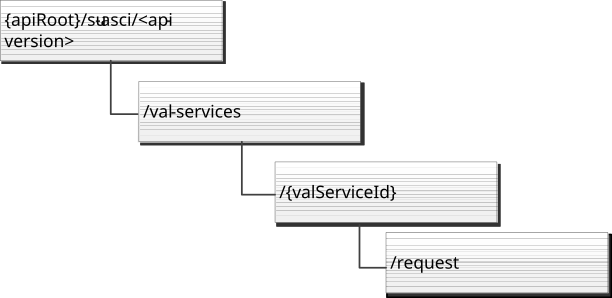

# C.4 Resource representation and APIs for application satellite coverage information

## C.4.1 SU_ASCI API provided by SCM-S

### C.4.1.1 API URI

The CoAP URIs used in CoAP requests from the SCM-S towards the SCM-C shall have the Resource URI structure as defined in clause C.1.1 with the following clarifications:

\- The \<apiName\> shall be "su-asci".

\- The \<apiVersion\> shall be "v1".

\- The \<apiSpecificSuffixes\> shall be set as described in clause C.4.1.2.

### C.4.1.2 Resources

#### C.4.1.2.1 Overview

Figure C.4.1.2.1-1: Resource URI structure of the SU_ASCI provided by SCM-S

Table C.4.1.2.1-1 provides an overview of the resources and applicable CoAP methods.

Table C.4.1.2.1-1: Resources and methods overview

| Resource name | Resource URI                           | CoAP method | Description                                                                                                                          |
|---------------|----------------------------------------|-------------|--------------------------------------------------------------------------------------------------------------------------------------|
| provision     | /val-services/{valServiceId}/provision | PUT         | Provisions the application satellite coverage information for a particular location and time when the VAL UE accesses the satellite. |

#### C.4.1.2.2 Resource: Provision

##### C.4.1.2.2.1 Description

The provision resource allows the SCM-C to request the SCM-S for satellite coverage availability information for a particular location and time when the VAL UE accesses the satellite.

##### C.4.1.2.2.2 Resource Definition

Resource URI: **{apiRoot}/su-asci/\<apiVersion\>/val-services/{valServiceId}/provision**

This resource shall support the resource URI variables defined in the table C.4.1.2.2.2-1.

Table C.4.1.2.2.2-1: Resource URI variables for this resource

| Name         | Data Type | Definition                   |
|--------------|-----------|------------------------------|
| apiRoot      | string    | See clause C.1.1             |
| apiVersion   | string    | See clause C.4.1.1           |
| valServiceId | string    | Identifier of a VAL service. |

##### C.4.1.2.2.3 Resource Standard Methods

###### C.4.1.2.2.3.1 PUT

This operation requests the application satellite coverage information for a particular location and time when the VAL UE accesses the satellite.

This method shall support the request data structures specified in table C.4.1.2.2.3.1-1, the response data structures and response codes specified in table C.4.1.2.2.3.1-2.

Table C.4.1.2.2.3.1-1: Data structures supported by the PUT Request payload on this resource

|           |     |             |                                                                                                                                      |
|-----------|-----|-------------|--------------------------------------------------------------------------------------------------------------------------------------|
| Data type | P   | Cardinality | Description                                                                                                                          |
| Provision | M   | 1           | Provisions the application satellite coverage information for a particular location and time when the VAL UE accesses the satellite. |

Table C.4.1.2.2.3.1-2: Data structures supported by the PUT Response payload on this resource

<table style="width:100%;">
<colgroup>
<col style="width: 17%" />
<col style="width: 4%" />
<col style="width: 13%" />
<col style="width: 23%" />
<col style="width: 41%" />
</colgroup>
<tbody>
<tr class="odd">
<td>Data type</td>
<td>P</td>
<td>Cardinality</td>
<td>
Response

codes
</td>
<td>Description</td>
</tr>
<tr class="even">
<td>Provision</td>
<td>O</td>
<td>0..1</td>
<td>2.01 Created</td>
<td>
The application satellite coverage information was created successfully.

The "satelliteId" of the created resource may be returned.
</td>
</tr>
</tbody>
</table>

### C.4.1.3 Data Model

#### C.4.1.3.1 General

Table C.4.1.3.1-1 specifies the data types defined specifically for the SU_ASCI API service provided by SCM-S.

Table C.4.1.3.1-1: SU_ASCI API specific data types

| Data type | Section defined | Description                                                                                                                          | Applicability |
|-----------|-----------------|--------------------------------------------------------------------------------------------------------------------------------------|---------------|
| Provision | C.4.1.3.2.1     | Provisions the application satellite coverage information for a particular location and time when the VAL UE accesses the satellite. |               |

#### C.4.1.3.2 Structured data types

##### C.4.1.3.2.1 Type: Provision

Table C.4.1.3.2.1-1: Definition of type Provision

| Attribute name | Data type     | P   | Cardinality | Description                                                                           | Applicability |
|----------------|---------------|-----|-------------|---------------------------------------------------------------------------------------|---------------|
| satCoverage    | array(SatCov) | M   | 1..N        | List of the application satellite coverage information for different satellite id(s). |               |

### C.4.1.4 Error Handling

General error responses are defined in clause C.1.3.

### C.4.1.5 CDDL Specification

#### C.4.1.5.1 Introduction

The data model described in clause C.4.1.3 shall be binary encoded in the CBOR format as described in IETF RFC 8949 \[17\].

Clause C.4.1.5.2 uses the Concise Data Definition Language described in IETF RFC 8610 \[18\] and provides corresponding representation of the SU_UserProfile API data model.

#### C.4.1.5.2 CDDL document

;;; Provision

;;+ Represents a list of the application satellite coverage information for different satellite id(s).

Provision = {

satCoverage: \[+ SatCov\]

\* tstr =\> any

}

;;; SatCov

;;+ Represents information identifying a satellite coverage.

SatCov = {

satelliteId: Uint

? geographicArea: GeographicArea

? timeWindow: \[\* ScheduledCommunicationTime\]

? ratType: RatType

\* tstr =\> any

}

;;; GeographicArea

;;+ Geographic area specified by different shape.

GeographicArea = Point / PointUncertaintyCircle / PointUncertaintyEllipse / Polygon / PointAltitude / PointAltitudeUncertainty / EllipsoidArc

;;; GADShape

;;+ Common base type for GAD shapes.

GADShape = {

shape: SupportedGADShapes

? extensions: { \* tstr =\> any } ; Open extension map for future or vendor extension

}

;;; Point

;;+ Ellipsoid Point.

Point = GADShape & {

point: GeographicalCoordinates

? extensions: { \* tstr =\> any } ; Open extension map for future or vendor extension

}

;;; PointUncertaintyCircle

;;+ Ellipsoid point with uncertainty circle.

PointUncertaintyCircle = GADShape & {

point: GeographicalCoordinates

uncertainty: Uncertainty

? extensions: { \* tstr =\> any } ; Open extension map for future or vendor extension

}

;;; PointUncertaintyEllipse

;;+ Ellipsoid point with uncertainty ellipse.

PointUncertaintyEllipse = GADShape & {

point: GeographicalCoordinates

uncertaintyEllipse: UncertaintyEllipse

confidence: Confidence

? extensions: { \* tstr =\> any } ; Open extension map for future or vendor extension

}

;;; Polygon

;;+ Polygon.

Polygon = GADShape & {

pointList: PointList

? extensions: { \* tstr =\> any } ; Open extension map for future or vendor extension

}

;;; PointAltitude

;;+ Ellipsoid point with altitude.

PointAltitude = GADShape & {

point: GeographicalCoordinates

altitude: Altitude

? extensions: { \* tstr =\> any } ; Open extension map for future or vendor extension

}

;;; PointAltitudeUncertainty

;;+ Ellipsoid point with altitude and uncertainty ellipsoid.

PointAltitudeUncertainty = GADShape & {

point: GeographicalCoordinates

altitude: Altitude

uncertaintyEllipse: UncertaintyEllipse

uncertaintyAltitude: Uncertainty

confidence: Confidence

? extensions: { \* tstr =\> any } ; Open extension map for future or vendor extension

}

;;; EllipsoidArc

;;+ Ellipsoid Arc.

EllipsoidArc = GADShape & {

point: GeographicalCoordinates

innerRadius: InnerRadius

uncertaintyRadius: Uncertainty

offsetAngle: Angle

includedAngle: Angle

confidence: Confidence

? extensions: { \* tstr =\> any } ; Open extension map for future or vendor extension

}

;;; GeographicalCoordinates

;;+ Geographical coordinates.

GeographicalCoordinates = {

lon: -180.0..180.0

lat: -90.0..90.0

? extensions: { \* tstr =\> any } ; Open extension map for future or vendor extension

}

;;; UncertaintyEllipse

;;+ Ellipse with uncertainty.

UncertaintyEllipse = {

semiMajor: Uncertainty

semiMinor: Uncertainty

orientationMajor: Orientation

? extensions: { \* tstr =\> any } ; Open extension map for future or vendor extension

}

;;; PointList

;;+ List of points.

PointList = \[3\*15 GeographicalCoordinates\]

;;; Altitude

;;+ Indicates value of altitude.

Altitude = -32767.0..32767.0

;;; Angle

;;+ Indicates value of angle.

Angle = 0..360

;;; Uncertainty

;;+ Indicates value of uncertainty.

Uncertainty = float .ge 0

;;; Orientation

;;+ Indicates value of orientation angle.

Orientation = 0..180

;;; Confidence

;;+ Indicates value of confidence.

Confidence = 0..100

;;; InnerRadius

;;+ Indicates value of the inner radius.

InnerRadius = 0..327675

;;; SupportedGADShapes

;;+ Indicates supported GAD shapes.

SupportedGADShapes = "POINT" / "POINT_UNCERTAINTY_CIRCLE" / "POINT_UNCERTAINTY_ELLIPSE" / "POLYGON" / "POINT_ALTITUDE" / "POINT_ALTITUDE_UNCERTAINTY" / "ELLIPSOID_ARC" / "LOCAL_2D_POINT_UNCERTAINTY_ELLIPSE" / "LOCAL_3D_POINT_UNCERTAINTY_ELLIPSOID" / tstr ; tstr value provides forward-compatibility with future extensions to the enumeration but is not used to encode content defined in the present version of this API.

;;; ScheduledCommunicationTime

;;+ Represents an offered scheduled communication time.

ScheduledCommunicationTime = {

? daysOfWeek: \[1\*6 DayOfWeek\] ; Identifies the day(s) of the week. If absent, it indicates every day of the week.

? timeOfDayStart: TimeOfDay

? timeOfDayEnd: TimeOfDay

\* tstr =\> any

}

;;; DayOfWeek

;;+ integer between and including 1 and 7 denoting a weekday. 1 shall indicate Monday, and the subsequent weekdays shall be indicated with the next higher numbers. 7 shall indicate Sunday.

DayOfWeek = 1..7

;;; TimeOfDay

;;+ String with format partial-time or full-time as defined in clause 5.6 of IETF RFC 3339. Examples, 20:15:00, 20:15:00-08:00 (for 8 hours behind UTC).

TimeOfDay = tstr

;;; RatType

RatType = "NR_LEO" / "NR_MEO" / "NR_GEO" / "NR_OTHER_SAT" / tstr ; tstr value provides forward-compatibility with future extensions to the enumeration

## C.4.2 SU_ASCI API provided by SCM-C

### C.4.2.1 API URI

The CoAP URIs used in CoAP requests from the SCM-C towards the SCM-S shall have the Resource URI structure as defined in clause C.1.1 with the following clarifications:

\- The \<apiName\> shall be "su-asci".

\- The \<apiVersion\> shall be "v1".

\- The \<apiSpecificSuffixes\> shall be set as described in clause C.4.1.2.

### C.4.2.2 Resources

#### C.4.2.2.1 Overview

Figure C.4.2.2.1-1: Resource URI structure of the SU_ASCI provided by SCM-C

Table C.4.2.2.1-1 provides an overview of the resources and applicable CoAP methods.

Table C.4.2.2.1-1: Resources and methods overview

| Resource name | Resource URI                         | CoAP method | Description                                                                                                                       |
|---------------|--------------------------------------|-------------|-----------------------------------------------------------------------------------------------------------------------------------|
| request       | /val-services/{valServiceId}/request | GET         | Retrive the application satellite coverage information for a particular location and time when the VAL UE accesses the satellite. |

#### C.4.2.2.2 Resource: Request

##### C.4.2.2.2.1 Description

The Request resource allows a SCM-S to provision the availability of coverage for a particular location and time when the VAL UE accesses the satellite.

##### C.4.2.2.2.2 Resource Definition

Resource URI: **{apiRoot}/su-asci/\<apiVersion\>/val-services/{valServiceId}/request**

This resource shall support the resource URI variables defined in the table C.4.2.2.2.2-1.

Table C.4.2.2.2.2-1: Resource URI variables for this resource

| Name         | Data Type | Definition                   |
|--------------|-----------|------------------------------|
| apiRoot      | string    | See clause C.1.1             |
| apiVersion   | string    | See clause C.4.2.1           |
| valServiceId | string    | Identifier of a VAL service. |

##### C.4.2.2.2.3 Resource Standard Methods

###### C.4.2.2.2.3.1 GET

This operation provision the application satellite coverage information for a particular location and time when the VAL UE accesses the satellite.

This method shall support the URI query parameters specified in table C.4.2.2.2.3.1-1.

Table C.4.2.2.2.3.1-1: Data structures supported by the GET request payload on this resource

|           |     |             |                                                                              |
|-----------|-----|-------------|------------------------------------------------------------------------------|
| Data type | P   | Cardinality | Description                                                                  |
| Request   | M   | 1           | Indicates the VAL UE request the application satellite coverage information. |

This method shall support the response data structures and response codes specified in table C.4.2.2.2.3.1-2.

Table C.4.2.2.2.3.1-2: Data structures supported by the GET Response payload on this resource

<table>
<colgroup>
<col style="width: 17%" />
<col style="width: 4%" />
<col style="width: 13%" />
<col style="width: 23%" />
<col style="width: 41%" />
</colgroup>
<thead>
<tr class="header">
<th>Data type</th>
<th>P</th>
<th>Cardinality</th>
<th>
Response

codes
</th>
<th>Description</th>
</tr>
</thead>
<tbody>
<tr class="odd">
<td>Response</td>
<td>M</td>
<td>1</td>
<td>2.05 Content</td>
<td>The application satellite coverage information for a particular location and time when the VAL UE accesses the satellite.</td>
</tr>
</tbody>
</table>

### C.4.2.3 Data Model

#### C.4.2.3.1 General

Table C.4.2.3.1-1 specifies the data types defined specifically for the SU_ASCI API service provided by SCM-C.

Table C.4.2.3.1-1: SU_ASCI API specific data types

| Data type | Section defined | Description                                                                                                                           | Applicability |
|-----------|-----------------|---------------------------------------------------------------------------------------------------------------------------------------|---------------|
| Response  | C.4.1.3.2.1     | Response to the application satellite coverage information for a particular location and time when the VAL UE accesses the satellite. |               |

#### C.4.2.3.2 Structured data types

##### C.4.2.3.2.1 Type: Response

Table C.4.2.3.2.1-1: Definition of type Response

| Attribute name | Data type     | P   | Cardinality | Description                                                                           | Applicability |
|----------------|---------------|-----|-------------|---------------------------------------------------------------------------------------|---------------|
| satCoverage    | array(SatCov) | M   | 1..N        | List of the application satellite coverage information for different satellite id(s). |               |

### C.4.2.4 Error Handling

General error responses are defined in clause C.1.3.

### C.4.2.5 CDDL Specification

#### C.4.2.5.1 Introduction

The data model described in clause C.4.2.3 shall be binary encoded in the CBOR format as described in IETF RFC 8949 \[17\].

Clause C.4.2.5.2 uses the Concise Data Definition Language described in IETF RFC 8610 \[18\] and provides corresponding representation of the SU_UserProfile API data model.

#### C.4.2.5.2 CDDL document

;;; Response

;;+ Represents a response to the application satellite coverage information for a particular location and time when the VAL UE accesses the satellite.

Response = {

satCoverage: \[+ SatCov\]

\* tstr =\> any

}

;;; SatCov

;;+ Represents information identifying a satellite coverage.

SatCov = {

satelliteId: Uint

? geographicArea: GeographicArea

? timeWindow: \[\* ScheduledCommunicationTime\]

? ratType: RatType

\* tstr =\> any

}

;;; GeographicArea

;;+ Geographic area specified by different shape.

GeographicArea = Point / PointUncertaintyCircle / PointUncertaintyEllipse / Polygon / PointAltitude / PointAltitudeUncertainty / EllipsoidArc

;;; GADShape

;;+ Common base type for GAD shapes.

GADShape = {

shape: SupportedGADShapes

? extensions: { \* tstr =\> any } ; Open extension map for future or vendor extension

}

;;; Point

;;+ Ellipsoid Point.

Point = GADShape & {

point: GeographicalCoordinates

? extensions: { \* tstr =\> any } ; Open extension map for future or vendor extension

}

;;; PointUncertaintyCircle

;;+ Ellipsoid point with uncertainty circle.

PointUncertaintyCircle = GADShape & {

point: GeographicalCoordinates

uncertainty: Uncertainty

? extensions: { \* tstr =\> any } ; Open extension map for future or vendor extension

}

;;; PointUncertaintyEllipse

;;+ Ellipsoid point with uncertainty ellipse.

PointUncertaintyEllipse = GADShape & {

point: GeographicalCoordinates

uncertaintyEllipse: UncertaintyEllipse

confidence: Confidence

? extensions: { \* tstr =\> any } ; Open extension map for future or vendor extension

}

;;; Polygon

;;+ Polygon.

Polygon = GADShape & {

pointList: PointList

? extensions: { \* tstr =\> any } ; Open extension map for future or vendor extension

}

;;; PointAltitude

;;+ Ellipsoid point with altitude.

PointAltitude = GADShape & {

point: GeographicalCoordinates

altitude: Altitude

? extensions: { \* tstr =\> any } ; Open extension map for future or vendor extension

}

;;; PointAltitudeUncertainty

;;+ Ellipsoid point with altitude and uncertainty ellipsoid.

PointAltitudeUncertainty = GADShape & {

point: GeographicalCoordinates

altitude: Altitude

uncertaintyEllipse: UncertaintyEllipse

uncertaintyAltitude: Uncertainty

confidence: Confidence

? extensions: { \* tstr =\> any } ; Open extension map for future or vendor extension

}

;;; EllipsoidArc

;;+ Ellipsoid Arc.

EllipsoidArc = GADShape & {

point: GeographicalCoordinates

innerRadius: InnerRadius

uncertaintyRadius: Uncertainty

offsetAngle: Angle

includedAngle: Angle

confidence: Confidence

? extensions: { \* tstr =\> any } ; Open extension map for future or vendor extension

}

;;; GeographicalCoordinates

;;+ Geographical coordinates.

GeographicalCoordinates = {

lon: -180.0..180.0

lat: -90.0..90.0

? extensions: { \* tstr =\> any } ; Open extension map for future or vendor extension

}

;;; UncertaintyEllipse

;;+ Ellipse with uncertainty.

UncertaintyEllipse = {

semiMajor: Uncertainty

semiMinor: Uncertainty

orientationMajor: Orientation

? extensions: { \* tstr =\> any } ; Open extension map for future or vendor extension

}

;;; PointList

;;+ List of points.

PointList = \[3\*15 GeographicalCoordinates\]

;;; Altitude

;;+ Indicates value of altitude.

Altitude = -32767.0..32767.0

;;; Angle

;;+ Indicates value of angle.

Angle = 0..360

;;; Uncertainty

;;+ Indicates value of uncertainty.

Uncertainty = float .ge 0

;;; Orientation

;;+ Indicates value of orientation angle.

Orientation = 0..180

;;; Confidence

;;+ Indicates value of confidence.

Confidence = 0..100

;;; InnerRadius

;;+ Indicates value of the inner radius.

InnerRadius = 0..327675

;;; SupportedGADShapes

;;+ Indicates supported GAD shapes.

SupportedGADShapes = "POINT" / "POINT_UNCERTAINTY_CIRCLE" / "POINT_UNCERTAINTY_ELLIPSE" / "POLYGON" / "POINT_ALTITUDE" / "POINT_ALTITUDE_UNCERTAINTY" / "ELLIPSOID_ARC" / "LOCAL_2D_POINT_UNCERTAINTY_ELLIPSE" / "LOCAL_3D_POINT_UNCERTAINTY_ELLIPSOID" / tstr ; tstr value provides forward-compatibility with future extensions to the enumeration but is not used to encode content defined in the present version of this API.

;;; ScheduledCommunicationTime

;;+ Represents an offered scheduled communication time.

ScheduledCommunicationTime = {

? daysOfWeek: \[1\*6 DayOfWeek\] ; Identifies the day(s) of the week. If absent, it indicates every day of the week.

? timeOfDayStart: TimeOfDay

? timeOfDayEnd: TimeOfDay

\* tstr =\> any

}

;;; DayOfWeek

;;+ integer between and including 1 and 7 denoting a weekday. 1 shall indicate Monday, and the subsequent weekdays shall be indicated with the next higher numbers. 7 shall indicate Sunday.

DayOfWeek = 1..7

;;; TimeOfDay

;;+ String with format partial-time or full-time as defined in clause 5.6 of IETF RFC 3339. Examples, 20:15:00, 20:15:00-08:00 (for 8 hours behind UTC).

TimeOfDay = tstr

;;; RatType

RatType = "NR_LEO" / "NR_MEO" / "NR_GEO" / "NR_OTHER_SAT" / tstr ; tstr value provides forward-compatibility with future extensions to the enumeration

## C.4.3 Media Type

The media type for a user profile document shall be "application/vnd.3gpp.seal-asci+cbor".

## C.4.4 Media Type registration for application/vnd.3gpp.seal-asci+cbor

Type name: application

Subtype name: vnd.3gpp.seal-asci+cbor

Required parameters: none

Optional parameters: none

Encoding considerations: Must be encoded as using IETF RFC 8949 \[17\]. See 3GPP TS 24.546 clause C.4 for details.

Security considerations: See Section 10 of IETF RFC 8949 \[17\] and Section 11 of IETF RFC 7252 \[12\].

Interoperability considerations: Applications must ignore any key-value pairs that they do not understand. This allows backwards-compatible extensions to this specification.

Published specification: 3GPP TS 24.546 "Configuration management - Service Enabler Architecture Layer for Verticals (SEAL); Protocol specification", available via http://www.3gpp.org/specs/numbering.htm.

Applications that use this media type: Applications supporting the SEAL application satellite coverage information procedures as described in the published specification.

Fragment identifier considerations: Fragment identification is the same as specified for "application/cbor" media type in IETF RFC 8949 \[17\]. Note that currently that RFC does not define fragmentation identification syntax for "application/cbor".

Additional information:

Deprecated alias names for this type: N/A

Magic number(s): N/A

File extension(s): none

Macintosh file type code(s): none

Person & email address to contact for further information: \<MCC name\>, \<MCC email address\>

Intended usage: COMMON

Restrictions on usage: None

Author: 3GPP CT1 Working Group/3GPP_TSG_CT_WG1@LIST.ETSI.ORG

Change controller: \<MCC name\>/\<MCC email address\>
