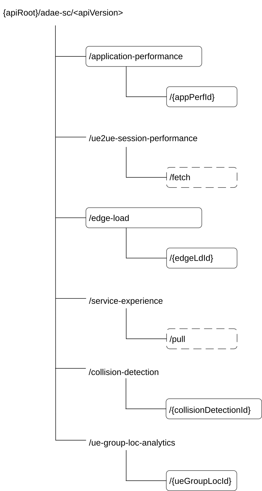

# 7.1.3.1 Overview

This clause describes the structure for the Resource URIs and the resources and methods used for the service.

Figure 7.1.3.1-1 depicts the resource URI structure of the ADAE_ServiceConfiguration API.

Figure 7.1.3.1-1: Resource URI structure of the ADAE_ServiceConfiguration API

Table 7.1.3.1-1 provides an overview of the resources and applicable HTTP methods.

Table 7.1.3.1-1: Resources and methods overview

<table>
<colgroup>
<col style="width: 23%" />
<col style="width: 28%" />
<col style="width: 15%" />
<col style="width: 32%" />
</colgroup>
<thead>
<tr class="header">
<th>Resource name</th>
<th>Resource URI</th>
<th>HTTP method</th>
<th>Description</th>
</tr>
</thead>
<tbody>
<tr class="odd">
<td>Application performance event subscription</td>
<td>/application-performance</td>
<td>POST</td>
<td>Subscription to the VAL performance analytics event.</td>
</tr>
<tr class="even">
<td>Individual application performance event subscription</td>
<td>/application-performance/{appPerfId}</td>
<td>DELETE</td>
<td>Deletes an individual VAL performance analytics event.</td>
</tr>
<tr class="odd">
<td>UE-to-UE session performance analytics</td>
<td>/ue2ue-session-performance/fetch</td>
<td>
fetch

(POST)
</td>
<td>Request for the UE-to-UE session performance analytics.</td>
</tr>
<tr class="even">
<td>Edge load event subscription</td>
<td>/edge-load</td>
<td>POST</td>
<td>Subscription to the edge load data collection event.</td>
</tr>
<tr class="odd">
<td>Individual edge load event subscription</td>
<td>/edge-load/{edgeLdId}</td>
<td>DELETE</td>
<td>Deletes an individual edge load data collection subscription.</td>
</tr>
<tr class="even">
<td>Service experience</td>
<td>/service-experience/pull</td>
<td>
pull

(POST)
</td>
<td>Pull a service experience information report.</td>
</tr>
<tr class="odd">
<td>Collision detection analytics subscriptions</td>
<td>/collision-detection</td>
<td>POST</td>
<td>Creates an individual collision detection analytics subscription.</td>
</tr>
<tr class="even">
<td>Individual collision detection analytics subscription</td>
<td>/collision-detection/{collisionDetectionId}</td>
<td>DELETE</td>
<td>Removes the individual collision detection analytics subscription.</td>
</tr>
<tr class="odd">
<td>Location-related UE group analytics subscriptions</td>
<td>/ue-group-loc-analytics</td>
<td>POST</td>
<td>Creates an individual location-related UE group analytics subscription.</td>
</tr>
<tr class="even">
<td>Individual location-related UE group analytics subscription</td>
<td>/ue-group-loc-analytics/{ueGroupLocId}</td>
<td>DELETE</td>
<td>Removes the individual location-related UE group analytics subscription.</td>
</tr>
</tbody>
</table>
