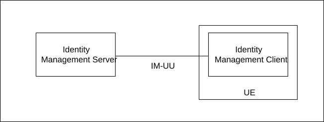
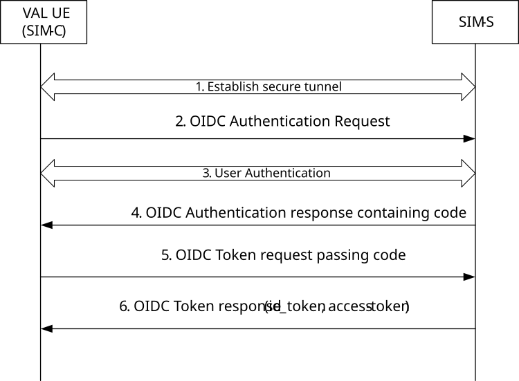
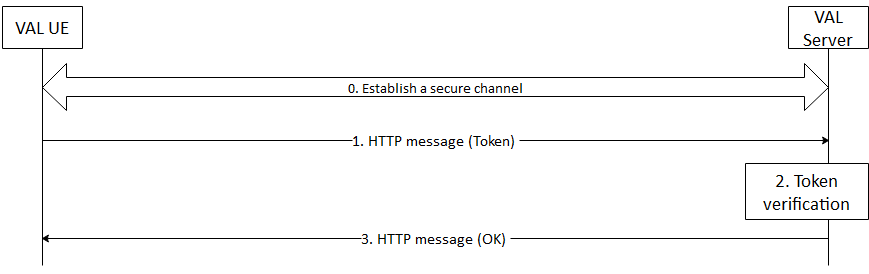

# 5.2 User authentication and authorization

## 5.2.1 VAL user authentication

Figure 5.2.3-1 shows the Identity Management functional model which consists of the SEAL Identity Management Server (SIM-S) and SEAL Identity Management Client (SIM-C) of the UE. The IM-UU reference point between the SIM-S and SIM-C shall provide the interface for user authentication and shall support OpenID Connect 1.0 \[5\] and OAuth 2.0 \[9, 10\] when using HTTPS to obtain an access token for the VAL UE.

## 5.2.2 SEAL service authorization

SEAL Service Authorization procedure shall validate the VAL user to access the SEAL services. In order to gain access to SEAL services, the SEAL client shall present an access token to the SEAL server for each service of interest. If the access token is valid, then the client shall be granted to use the service.

## 5.2.3 Identity management functional model

The SEAL Identity Management Server (SIM-S) and the SEAL Identity Management Client (SIM-C) provide the endpoints for VAL user authentication as shown in the SEAL Identity Management functional model in figure 5.2.3-1.

The reference point IM-UU utilizes Uu reference point as described in 3GPP TS 23.401 \[7\] and 3GPP TS 23.501 \[8\]. IM-UU shall support OpenID Connect 1.0 \[5\] and OAuth 2.0 \[9\] for VAL user authentication when using HTTPS.

Figure 5.2.3-1: Functional model for SEAL Identity Management

In order to support VAL user authentication, the SIM-S shall be provisioned with the VAL user ID and VAL service IDs (usage of VAL user ID and VAL service ID is described in clause 7 of TS 23.434 \[2\]). A mapping between the VAL user ID and VAL service ID(s) shall be created and maintained in the SIM-S. When a VAL user wishes to authenticate for the VAL services, the VAL user ID and credentials are provided via the UE Identity management client to the SIM-S as per OpenID Connect 1.0 \[5\] when using HTTPS. The SIM-S receives and shall verify the VAL user ID and credentials. If verification is successful, then the SIM-S returns an ID token, refresh token and access token to the UE Identity management client. The SIM-C shall learn the user's VAL service ID(s) from the ID token. Table 5.2.3-1 shows the SEAL specific tokens and their usage. These tokens are further defined in clause A.2.

Table 5.2.3-1: VAL UE authentication token

| Token Type    | Consumer of the Token         | Description                                                                                                                                            |
|---------------|-------------------------------|--------------------------------------------------------------------------------------------------------------------------------------------------------|
| ID token      | VAL UE client(s)              | Contains the VAL service ID for at least one authorized VAL service.                                                                                   |
| Access token  | SKM-S, SEAL service server(s) | Short-lived token (definable in the SIM-S) that conveys the UE's identity. This token contains the VAL service ID for at least one authorized service. |
| Refresh token | SIM-S (Authorization Server)  | Allows VAL UE to obtain a new access token without forcing user to log in again.                                                                       |

To support the VAL service identity functional model, the VAL service ID(s):

\- Shall be provisioned into the SEAL Identity management database and mapped to VAL UE IDs.

\- Shall be provisioned into the SEAL Key management server (SKM-S) and mapped to UE specific key material.

## 5.2.4 Authentication framework

Figure 5.2.4-1 describes the VAL Authentication Framework using the OpenID Connect protocol. when using HTTPS It describes the steps by which a VAL UE authenticates to the SIM-S, resulting in a set of credentials delivered to the UE uniquely identifying the VAL service ID(s). The authentication framework supports extensible user authentication solutions based on the VAL service provider policy (shown as step 3). User authentication methods in support of step 3 (e.g. biometrics, secureID, etc.) are possible but not defined here.

Figure 5.2.4-1: OpenID Connect (OIDC) flow supporting VAL user authentication

Step 1: VAL UE establishes a secure tunnel with the SIM-S.

Step 2: VAL UE sends an OpenID Connect Authentication Request to the SIM-S. The request may contain an indication of authentication methods supported by the UE.

Step 3: User Authentication is performed between VAL UE and the SIM-S.

NOTE: The primary credentials for user authentication (e.g. biometrics, secureID, OTP, username/password) are based on VAL service provider policy. The method chosen by the VAL service provider for authentication and authorization is neither defined nor limited by the present document, it depends on the Vertical services and authentication and authorization methods supported by it.

Step 4: SIM-S sends an OpenID Connect Authentication Response to the UE containing an authorization code.

Step 5: UE sends an OpenID Connect Token Request to the SIM-S, passing the authorization code.

Step 6: SIM-S sends an OpenID Connect Token Response to the UE containing an ID token and an access token (each which uniquely identify the user of the VAL service or key management service). The ID token is consumed by the UE to personalize the VAL client for the VAL user, and the access token is used by the UE to communicate and authorize the identity of the VAL user to the VAL server(s) and the VAL services.

## 5.2.5 Authorization framework

Authorization framework when using HTTP is shown in figure 5.2.5-1. A secure HTTP tunnel using HTTPS between VAL UE and VAL server shall be established before VAL service authorization. Subsequent VAL service authorization messaging make use of this tunnel. The service clients in the VAL UE present the access tokens to the VAL server over HTTP. The VAL server authorizes the user for the requested services only if the access token is valid. The procedures may be repeated as necessary to obtain additional VAL user authorizations.

Figure 5.2.5-1: VAL User Service Authorization

After the VAL UE establishing a secure connection with the VAL server, the VAL UE sends an HTTP message containing the access token to the VAL server where service authorization is requested. The VAL server receives the message and validates the access token. If the access token is valid, The VAL server positively acknowledges the request. The VAL server may provide service related information to the VAL UE at this time.

## 5.2.6 VAL service authorization

The VAL service authorization procedure shall validate the VAL user authorized to access the VAL services.  In order to gain access to VAL services, the VAL client shall present an access token to the VAL server for each VAL service of interest (see clause 5.2.5). If the access token is valid, then the VAL client shall be granted use of the requested VAL service.
