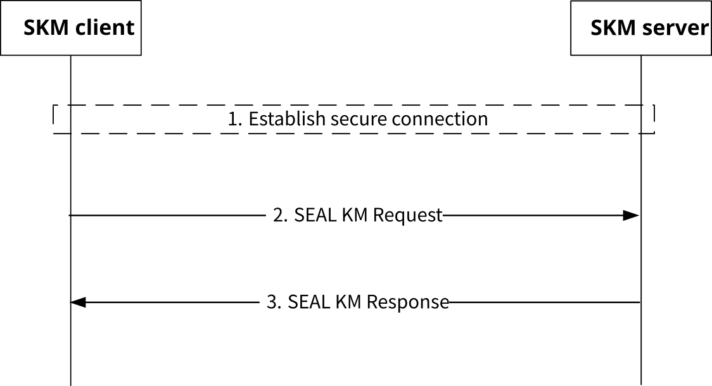

# 5.3 SEAL key management procedure

## 5.3.1 General

To enable security for VAL services, a SEAL KM client (located in either a VAL UE or VAL server) may request key material applicable to a particular VAL service, VAL client or user.

Prior to making a key management request to the SEAL KMS (SKM-S), the VAL client or VAL user shall be authenticated by the SEAL identity management service (clause 5.2). In addition, secure connections shall be established between the SEAL client and the SKM-S (reference point KM-UU) and the VAL server and the SKM-S (reference point KM-S) prior to any associated key management requests.

As a result of the SEAL identity management authentication procedure, an access token scoped for key management services is provisioned to the SEAL UE. This access token is provided with each and every key management request to the SKM-S.

A VAL server is provisioned with an access token scoped for SEAL key management services and is provided with each and every key management request to the SKM-S. The method for provisioning this access token into the VAL server is out of scope of the present document.

Figure 5.3.1-1 shows the SEAL key management procedure. A SKM client may send a SEAL KM Request message to the SKM-S. The SKM-S validates and processes the request and responds with a SEAL KM Response message. The response contains key management material specific to the SEAL service or the VAL server request, or alternatively, an error code if the SKM-S encounters a failure condition.

Figure 5.3.1-1: SEAL key management procedure

The procedure in figure 5.3.1-1 is described here:

1\. The SKM-C establishes a secure connection, using the mechanism specified in clause 5.1.1.4, to the SKM-S. Steps 2 and 3 are within this secure connection.

2\. The SKM-C sends a SEAL KM Request message to the SKM-S. The request contains the authorization credentials obtained during authentication and message content specified in clause 5.3.2.

3\. The SKM-S authorizes the request and if valid, sends a SEAL KM Response message containing the requested key material (or error code) as specified in clause 5.3.3.

As a successful result of this procedure, the VAL UE or VAL Server has securely obtained service specific key material for use within the VAL system.

## 5.3.2 SEAL KM Request message

A SKM-C may send a SEAL KM Request message to the SKM-S. This request shall be protected (using the mechanism specified in clause 5.1.1.4) and shall contain the access token acquired during the SEAL identity management authentication procedure (clause 5.2).

The content of the SEAL KM Request is shown in table 5.3.2-1.

Table 5.3.2-1: Contents of a SEAL KM Request

| Name                                                                                 | Description                                                                                                               |
|--------------------------------------------------------------------------------------|---------------------------------------------------------------------------------------------------------------------------|
| Version                                                                              | The version number of the SEAL key management request.                                                                    |
| SKmsUri                                                                              | The URI of the SKM-S to which the request is sent.                                                                        |
| ServiceID                                                                            | A string representing the VAL service/application related to the VAL client request.                                      |
| ClientID                                                                             | (Optional) A string representing the client. (see NOTE)                                                                   |
| DeviceID                                                                             | (Optional) A string representing the device. (see NOTE).                                                                  |
| UserID                                                                               | (Optional) A string representing the user. (see NOTE)                                                                     |
| Date/Time                                                                            | The Date and Time of the request. This number represents the number of seconds from 1970-01-01T0:0:0Z as measured in UTC. |
| NOTE: Only one of these fields may be present in any given SEAL KMS Request message. |                                                                                                                           |

The identities listed in table 5.3.2-1 map to SEAL identities defined in 3GPP TS 23.434 \[2\]. Namely, the ServiceID maps to the VAL service identity (VAL service ID), the ClientID maps to the VAL client or client on the VAL server, the DeviceID maps to the VAL UE identity (VAL UE ID), and the UserID maps to the VAL user identity (VAL user ID).

The 'Version' field identifies the version of the SEAL KM Request message. The current version is defined as "1.0.0".

The 'Date/Time' field is used primarily as an anti-replay mechanism for SEAL key management requests and responses. If the 'Date/Time' field is significantly out of range (more than a few seconds), this could indicate a replay attack.

Upon receipt of a SEAL KM Request message, the SKM-S shall verify that:

\- the access token is valid;

\- the signature is valid;

\- the SKmsUri is the SKM-S URI of the target SEAL KMS where the key information is stored; and

\- the Date/Time is within a recent time window (e.g. 5 seconds).

If valid, the request is accepted and processed by the SKM-S. A standalone ServiceID, or a ServiceID in combination with a ClientID, DeviceID, or UserID may be present in the SEAL KM Request message. This combination may be used by the KMS to identify a specific key material record. Each key management record may be unique to a VAL application or VAL service. The format and content of a key management record is defined and securely provisioned into the SEAL KMS by the VAL application or VAL service owner/operator.

A SEAL KM client (SKM-C) located in the VAL server may use the SEAL key provisioning procedure described in clause 5.8 to provision the VAL service or VAL application key material into the KMS.

The method used to organize, manage, and maintain VAL service or VAL application key material within the KMS is out of scope of the present document.

## 5.3.3 SEAL KM Response message

The SEAL KM Response message is sent to the SKM-C in response to a SEAL KM Request message.

A successful SEAL key management procedure results in a SEAL KM Response message, which typically includes a payload containing key management information uniquely applicable to the requested service, client or user. If an error occurs, an error code may be returned in the SEAL KM Response message.

The SEAL KM Response message shall be protected in transit using the mechanism specified in clause 5.1.1.4. The Payload within a SEAL KM Response message may be protected end-to-end between the SKM-C and SKM-S depending on the applicability of the underlying VAL service making the request. The method for securing a Payload end-to-end between the SKM-C and the SKM-S is outside the scope of the present document. The key material contents provided in a Payload are defined by the underlying VAL service and are outside the scope of the present document.

The content of a SEAL KM Response message is shown in table 5.3.3-1.

Table 5.3.3-1: Contents of a SEAL KM Response message

| Name                                                                                                                                                        | Description                                                                                                                                             |
|-------------------------------------------------------------------------------------------------------------------------------------------------------------|---------------------------------------------------------------------------------------------------------------------------------------------------------|
| UserUri                                                                                                                                                     | URI of the user for which the response is intended.                                                                                                     |
| SKmsUri                                                                                                                                                     | The URI of the SKM-S sending the response.                                                                                                              |
| ServiceID                                                                                                                                                   | A string representing the VAL service/application related to the VAL client request. This is the same field as received in the SEAL KM Request message. |
| SKmsID                                                                                                                                                      | (Optional) The ID of the SKM-S providing the response message.                                                                                          |
| ClientID                                                                                                                                                    | (Optional) A string representing the client (see NOTE)                                                                                                  |
| DeviceID                                                                                                                                                    | (Optional) A string representing the device (see NOTE)                                                                                                  |
| UserID                                                                                                                                                      | (Optional) A string representing the user. (see NOTE)                                                                                                   |
| Date/Time                                                                                                                                                   | The Date and Time of the response. This number represents the number of seconds from 1970-01-01T0:0:0Z as measured in UTC.                              |
| ErrorCode                                                                                                                                                   | (Optional) Reason code indicating the failure of the requested action. If not present, the key management request is assumed to be successful.          |
| Payload                                                                                                                                                     | (Optional) Key management payload specific to the VAL user, client or application. This field is not be present if an error occurs .                    |
| NOTE: If this field is present in the SEAL KM Request message then this field shall be present in the SEAL KM Response message and shall be the same value. |                                                                                                                                                         |

The identities listed in table 5.3.3-1 are described in clause 5.3.2.

If the SKM-S does not encounter an error during processing of the SEAL KM Request message, the SEAL KM Response message carries a set of security parameters contained in the "Payload" field.

If the SKM-S encounters an error while processing the SEAL KM Request message, an error value described in table 5.3.3-2 shall be returned in the 'ErrorCode' field of the SEAL KM Response message and the 'Payload' field shall not be present.

In the event of an error, the user and/or the operator of the VAL service, UE, or client may be notified.

Table 5.3.3-2: 'ErrorCode' values

| ErrorCode | Description                                                                  | Maps To                                                                                |
|-----------|------------------------------------------------------------------------------|----------------------------------------------------------------------------------------|
| 01        | Unspecified error                                                            | "500 Internal Server Error" as described in Table 5.2.6-1 of TS 29.122 \[17\]          |
| 02        | Key Information not available for specified service, client, device or user. | "404 Not Found" as described in Table 5.2.6-1 of TS 29.122 \[17\]                      |
| 03        | Request rejected                                                             | "401 Unauthorized" as described in Table 5.2.6-1 of TS 29.122 \[17\]                   |
| 04        | Unable to validate request                                                   | "400 Bad Request" or "403 Forbidden" as described in Table 5.2.6-1 of TS 29.122 \[17\] |
| 05-FF     | Reserved                                                                     | N/A                                                                                    |

The selection of the key material returned in the Payload of a SEAL KM Response message is determined by the ServiceID and (optionally) the ClientID, DeviceID or UserID. The combination of the ServiceID with the ClientID, DeviceID or UserID allows the VAL service to request a more specific set of key material.

For example, if a ClientID is included in the SEAL KM Request message, the KMS may return a Payload that contains a set of client specific key material applicable to the ClientID within the requesting VAL service (ServiceID). If the DeviceID is included, the KMS may return a Payload that contains device specific key material applicable to the DeviceID within the requesting VAL service (ServiceID). If the UserID is included, the KMS may return a Payload that contains user specific key material applicable to that UserID within the requesting VAL service (ServiceID).
