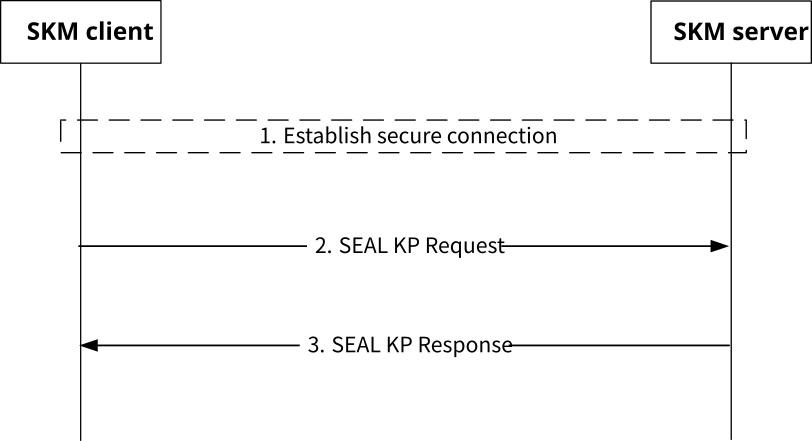

# 5.8 SEAL key provisioning procedure

## 5.8.1 General

The SEAL key provisioning procedure may be used by a SEAL KM client (SKM-C) located in a VAL server to provision key information applicable to a particular VAL service, VAL client, VAL device, or VAL user.

A VAL server shall be provisioned with an access token scoped for SEAL key provisioning services. The method for provisioning this access token into the VAL server is out of scope of the present document. The VAL server using the SKM-C shall provide this access token with every key provisioning request made to the SKM-S. In addition, a secure connection shall be established between the SKM-C and the SKM-S prior to any associated key provisioning requests.

The KMS shall authenticate and validate the presented access token (i.e. verifying that the SKeyProv parameter defined in clause A.2.2.3 is provided and correct), and shall validate that the requesting SKM-C has the authorization to perform key provisioning.

Figure 5.8.1-1 shows the SEAL key provisioning procedure. A SKM-C may send a SEAL Key Provisioning Request message to the SKM-S. The SKM-S shall validate and process the request and respond with a SEAL KP Response message. The request contains key information specific to a particular VAL service, VAL client, VAL device, or VAL user. The SEAL KP Response message provides either an acknowledgement or an error code (if the SKM-S encounters a failure condition).

Figure 5.8.1-1: SEAL key provisioning procedure

The procedure in figure 5.8.1-1 is described here:

1\. The SKM-C establishes a secure connection to the SKM-S using the mechanism specified in clause 5.1.1.4. Steps 2 and 3 are within this secure connection.

2\. The SKM-C sends a SEAL KP Request message to the SKM-S. The request contains the authorization credentials (i.e. access token) and message content specified in clause 5.8.2.

3\. The SKM-S validates the credentials and verifies that the requesting SKM-C is an authorized key provisioning client. Upon authorization, the SKM-S processes the request and returns a SEAL KP Response message to the SKM-C containing an acknowledgement (or error code) as specified in clause 5.8.3.

As a successful result of this procedure, the VAL Server has securely provisioned specific key information for use within the VAL system for a particular VAL service, VAL device, VAL client, or VAL user.

## 5.8.2 SEAL KP Request message

An authorized SKM-C may send a SEAL KP Request message to the SKM-S. This request shall be protected (using the mechanism specified in clause 5.1.1.4) and shall contain the access token scoped for SEAL key provisioning (clause A.2).

The content of the SEAL KM Request is shown in table 5.8.2-1.

Table 5.8.2-1: Contents of a SEAL KP Request

| Name                                                                                | Description                                                                                                               |
|-------------------------------------------------------------------------------------|---------------------------------------------------------------------------------------------------------------------------|
| Version                                                                             | The version number of the SEAL key provisioning request.                                                                  |
| SValClientUri                                                                       | The URI of the SKM-C (hosted in the VAL server) making the request.                                                       |
| SKmsUri                                                                             | The URI of the SKM-S to which the request is sent.                                                                        |
| ServiceID                                                                           | A string representing the VAL service/application related to the VAL client request.                                      |
| ClientID                                                                            | (Optional) A string representing the client related to the key material in the Payload. (see NOTE)                        |
| DeviceID                                                                            | (Optional) A string representing the device related to the key material in the Payload. (see NOTE)                        |
| UserID                                                                              | (Optional) A string representing the user related to the key material in the Payload. (see NOTE)                          |
| Date/Time                                                                           | The Date and Time of the request. This number represents the number of seconds from 1970-01-01T0:0:0Z as measured in UTC. |
| KP PayloadID                                                                        | (Optional) A string identifier representing the Payload.                                                                  |
| KP Payload                                                                          | Key provisioning payload specific to the identified VAL ServiceID, UserID, ClientID, or DeviceID.                         |
| NOTE: Only one of these fields may be present in any given SEAL KP Request message. |                                                                                                                           |

The identities listed in table 5.8.2-1 map to SEAL identities defined in 3GPP TS 23.434 \[2\], and identify the endpoints targets of the key information (Payload). Namely, the ServiceID maps to the VAL service identity (VAL service ID), the ClientID maps to the VAL client or client on the VAL server, the DeviceID maps to the VAL UE identity (VAL UE ID), and the UserID maps to the VAL user identity (VAL user ID).

The 'Version' field identifies the version of the SEAL KP Request message. The current version is defined as "1.0.0".

The 'Date/Time' field is primarily as an anti-replay mechanism for SEAL key provisioning requests and responses. If the 'Date/Time' field is significantly out of range (more than a few seconds), this could indicate a replay attack.

Upon receipt of a SEAL KP Request message, the SKM-S shall verify that:

\- the access token is valid and contains the SKeyProv field;

\- the signature is valid;

\- the requesting SKM-C is authorized for key provisioning;

\- the SKmsUri is the SKM-S URI of the target SEAL KMS where the key information shall be stored; and

\- the Date/Time is within a recent time window (e.g. 5 seconds).

If valid, the request is accepted and processed by the SKM-S. A standalone ServiceID, or a ServiceID in combination with a ClientID, DeviceID, or UserID may be present in the SEAL KP Request message. This combination may be used by the KMS to map the key material in the Payload with a specific client, device, or user. The format and content of a key provisioning Payload is defined by the VAL application or VAL service owner/operator and is out of scope of this document. For example, such content may include VAL specific keys, additional tokens, credentials, or other important security related information.

The method used to organize, manage, and maintain VAL service or VAL application key material within the KMS is out of scope of the present document.

## 5.8.3 SEAL KP Response message

The SEAL KP Response message is sent by the SKM-S to the SKM-C in response to a SEAL KP Request message.

A successful SEAL key provisioning procedure results in the KMS sending a SEAL KP Response message containing an acknowledgement indicating the KMS successfully received and processed the SEAL KP Request message. If the KMS is unable to successfully process the SEAL KP Request message, the KMS may instead return an error code in the SEAL KP Response message.

The SEAL KP Response message shall be protected in transit using the mechanism specified in clause 5.1.1.4.

The content of a SEAL KP Response message is shown in table 5.8.3-1.

Table 5.8.3-1: Contents of a SEAL KP Response message

| Name                                                                                                                                                        | Description                                                                                                                                                    |
|-------------------------------------------------------------------------------------------------------------------------------------------------------------|----------------------------------------------------------------------------------------------------------------------------------------------------------------|
| SValKmcUri                                                                                                                                                  | URI of the VAL SKM-C client for which the response is intended.                                                                                                |
| SKmsUri                                                                                                                                                     | The URI of the SKM-S sending the response.                                                                                                                     |
| ServiceID                                                                                                                                                   | A string representing the VAL service/application related to the VAL client request. This is the same field as received in the SEAL KM Request message.        |
| SKmsID                                                                                                                                                      | (Optional) The ID of the SKM-S providing the response message.                                                                                                 |
| ClientID                                                                                                                                                    | (Optional) A string representing the client (see NOTE)                                                                                                         |
| DeviceID                                                                                                                                                    | (Optional) A string representing the device (see NOTE)                                                                                                         |
| UserID                                                                                                                                                      | (Optional) A string representing the user. (see NOTE)                                                                                                          |
| Date/Time                                                                                                                                                   | The Date and Time of the response. This number represents the number of seconds from 1970-01-01T0:0:0Z as measured in UTC.                                     |
| KP PayloadID                                                                                                                                                | (Optional) A string representing the received Payload. (see NOTE)                                                                                              |
| ErrorCode                                                                                                                                                   | (Optional) Reason code indicating the failure of the requested action. If this field is not present, the key provisioning request is assumed to be successful. |
| NOTE: If this field is present in the SEAL KP Request message then this field shall be present in the SEAL KP Response message and shall be the same value. |                                                                                                                                                                |

The identities listed in table 5.8.3-1 are described in clause 5.8.2.

If the SKM-S encounters an error while processing the SEAL KP Request message, an error value described in table 5.8.3-2 should be returned in the 'ErrorCode' field of the SEAL KP Response message.

In the event of an error, the user and/or the operator of the VAL service may be notified.

Table 5.8.3-2: 'ErrorCode' values

| ErrorCode | Description                                            | Maps To                                                                                |
|-----------|--------------------------------------------------------|----------------------------------------------------------------------------------------|
| 01        | Unspecified error                                      | "500 Internal Server Error" as described in Table 5.2.6-1 of TS 29.122 \[17\]          |
| 02        | Referenced client, device, user, or service not found. | "404 Not Found" as described in Table 5.2.6-1 of TS 29.122 \[17\]                      |
| 03        | Request rejected                                       | "401 Unauthorized" as described in Table 5.2.6-1 of TS 29.122 \[17\]                   |
| 04        | Unable to validate request                             | "400 Bad Request" or "403 Forbidden" as described in Table 5.2.6-1 of TS 29.122 \[17\] |
| 05-FF     | Reserved                                               | N/A                                                                                    |
