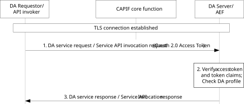
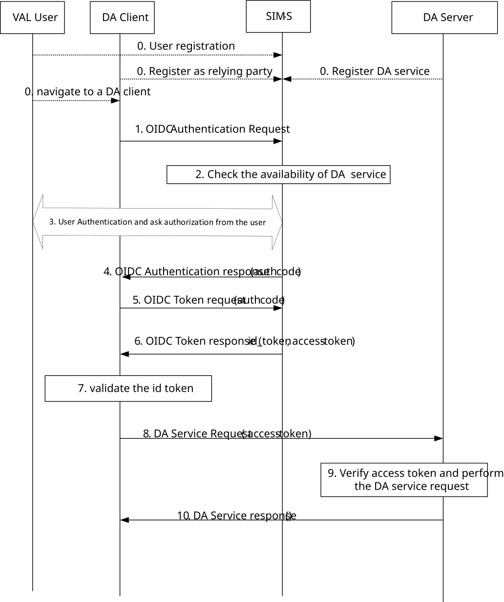
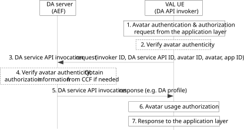
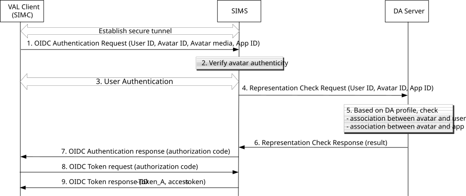
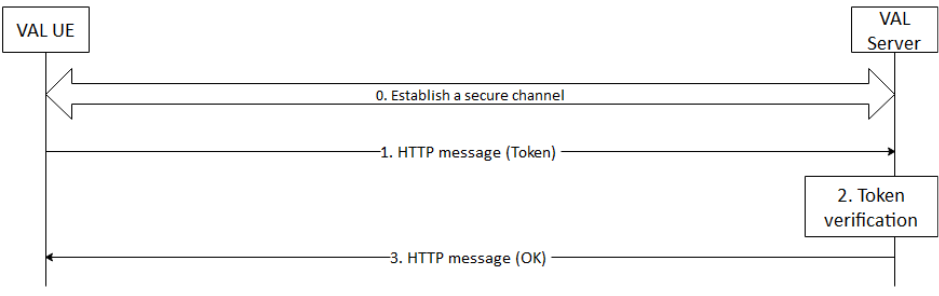
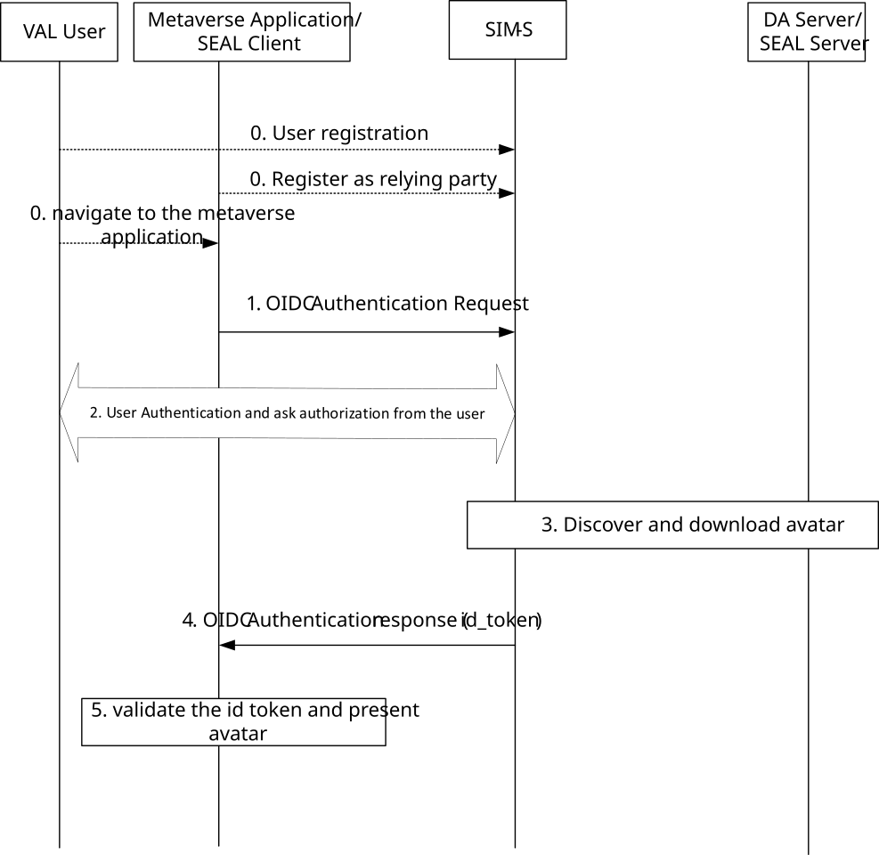

# 6 Security procedures for mobile metaverse services

## 6.1 Authentication and authorization for spatial localization services

### 6.1.1 Authentication and authorization for spatial anchor/map services when CAPIF is used

When CAPIF is used as specified in TS 23.434 \[2\], the security mechanism for CAPIF specified in TS 33.122 \[29\] is referred to protect interfaces between spatial anchors (SAn) client and spatial anchors server specified in TS 23.437 \[34\], between VAL server and spatial anchors server, between spatial map (SM) client and spatial map server specified in TS 23.437 \[34\], VAL server and spatial map server. Spatial anchors client, spatial map client and VAL server take role of API Invoker in CAPIF. Spatial anchors server and spatial map server take role of AEF in CAPIF.

The authentication and authorization mechanisms specified for CAPIF-2e reference point in TS 33.122 \[29\] clause 6.5.2 shall be followed for authenticating and authorizing a SAn/SM client to access the spatial anchor/map services defined in TS 23.437 \[34\] clauses 8 and 9.

If the owner of the spatial anchor or spatial map is provided in the spatial anchor/map service request, authentication and authorization for RNAA specified in clause 6.5.3 of TS 33.122 \[29\] are followed to authenticate and authorize a SAn/SM client to access the spatial anchor/map of a specific owner.

NOTE 1: When applying authentication and authorization for RNAA, the owner of the spatial anchor/map has to be a UE subscriber.

NOTE 2: How CAPIF RNAA supports service operation level and resource level authorization using access token is specified in TS 33.122 \[29\].

### 6.1.2 Authentication and authorization for spatial anchor/map services when CAPIF is not used

Security for the SEAL-C, SEAL-UU and SEAL-S interfaces as specified in clause 5.1.1 is applied for protection of SAn/SM-C, SAn/SM-UU and SAn/SM-S interfaces defined in TS 23.437 \[34\] respectively.

The SEAL Identity Management service specified in clause 5.2.4 is utilized to authenticate the spatial anchors (SAn)/spatial map (SM) client. In support for spatial localization authorization, the access token issued by the SIM server and provisioned to the SAn/SM client during the authentication is used to gain services for SAn client or SM client.

In order to gain access to SEAL spatial anchor/map services, the SAn/SM client shall present an access token to the SAn/SM server for each spatial localization service of interest. The SAn/SM server performs authorization based on the access token by verifying the SIM-S signature using the SIM-S’ certificate. If the access token is valid, then the SAn/SM client shall be granted to use the service.

Editor’s Note: The clarification on how existing procedures can be utilized is FFS.

## 6.2 Authentication and authorization for digital asset services

### 6.2.1 Authentication and authorization for digital asset services when CAPIF is used

When CAPIF is used as specified in TS 23.434 \[2\], the security mechanism for CAPIF specified in TS 33.122 \[29\] is referred to protect interfaces between digital asset client and digital asset server specified in TS 23.438 \[35\], between VAL server and digital asset server. The digital asset (DA) requestor (e.g. digital asset client or VAL server) takes the role of API Invoker in CAPIF. Digital asset server takes role of AEF in CAPIF.

Authentication and authorization for RNAA specified in clause 6.5.3 of TS 33.122 \[29\] shall be followed for the DA server to authorize the DA requestor to access the DA service API allowed by the DA owner. In addition to verifying the access token, the DA server shall further check the access control list in the DA profile.

Figure 6.2.1-1: Procedure for DA requestor authorization to access DA services with token

1\. The DA requestor sends the DA service request (e.g. DA create/retrieve/update/delete request) to the DA server. The access token received from the CCF is sent along with the DA service request. The DA owner identity, e.g. GPSI if the DA is owned by a UE subscriber, is included in the access token, as per the procedure in TS 33.122 \[29\] clause 6.5.3.

2\. Upon receiving the request with an access token, the DA server validates the integrity of the token using the CCF’s certificate. If validation of the token is successful, the DA server further verifies the DA service request against the authorization claims in the token.

In case the access token does not contain sufficient claims for authorizing the DA service API invocation, the DA server further checks its local DA profile for finer level authorization if needed. For example, if the DA profile contains the information of owner(s) or allowed operation(s) for resource level authorization, the DA server checks if the DA owner in the access token matches the owner(s) in the DA profile, and if the servie operation in the access token matches the allowed operation(s) in the DA profile.

3\. If the DA service API invocation is successfully authorized by the DA server, it executes the service logic for the invoked DA service API and returns the DA service response as a result of the DA service API invocation.

NOTE 1: The assumption is that the user behind the digital asset client is the owner of the digital asset.

NOTE 2: How CAPIF RNAA supports service operation level and resource level authorization is specified in TS 33.122 \[29\].

### 6.2.2 Authentication and authorization for digital asset services when CAPIF is not used

When CAPIF is not used, security for the SEAL interfaces, especially SEAL-S, SEAL-UU, specified in clause 5.1.1 is applied for protection of digital asset management interfaces such as DA-S, DA-UU as specified in TS 23.438 \[35\].

SEAL identity management service is used to support authentication of VAL user and authorization for DA services. Prior to making a DA service request to the DA server, the VAL user behind the DA client shall be authenticated using the SEAL identity management service as in clause 5.2.

In order to gain access to digital asset services, the digital asset client shall present an access token to the digital asset server for digital asset service of interest. If the access token is valid, then the digital asset client is granted to use the service.

The procedure to authenticate a VAL user and authorize the digital asset client to access digital asset is shown in figure 6.2.2-1.

Figure 6.2.2-1. Procedure to authorize the digital asset client to access digital asset

0\. DA client registers to SIM-S as Relying Party and delegates identity management and user authentication to the SIM-S, which takes the role of OpenID Provider. The DA service is registered to the SIM-S either by DA server or O&M. The VAL User registers to the SIM-S with user profile and gets User ID from the SIM-S. The VAL User navigates to a DA client with the User ID.

NOTE 1: The step 0 is implementation dependent and out of 3GPP scope.

1\. With the User ID, the DA client sends OIDC authentication request to the SIM-S, including User ID, and response type. The Scope is set to open id and DA service, the response type is set to auth code.

2\. The SIM-S checks if the DA service is available. In addition, the SIM-S may check if the DA client is allowed to access the DA service according to local policy.

3\. The SIM-S triggers user authentication towards the VAL User and gets authorization from the VAL User to allow the DA client to access the DA service.

4\. The SIM-S sends OIDC response to the DA client with an auth code.

5\. The DA client sends token request to the SIM-S with auth code.

6\. The SIM-S sends token response to the DA client. The response includes an ID token and an Access Token. The ID token includes issuer set to the SIM-S, audience set to the DA client, subject set to the User ID and expiration time. The Access Token includes issuer set to the SIM-S, audience set to the DA server, subject set to the User ID or VAL User ID, scope set to DA service and expiration time.

NOTE 2: The expiration time in the access token should be shorter than the one in the ID Token. I.e., the client should not be able to use the access token after the user has log-out.

7\. The DA client validates the ID token to authenticate the VAL User.

Prior to any associated DA service requests, secure connections shall be established between the DA client and the DA server (reference point DA-UU).

8\. The DA client sends DA service request to the DA server, including the Access Token obtained in step 6.

9\. Upon receiving the request with an access token, the DA server verifies the Access Token and retrieve User ID from the subject claim of the Access Token. DA server further checks if the User ID matches one of the owners or one of the uses in the DA profile of the accessed DA. If does, the DA server further checks if the requested operation is allowed by this user based on access control list of the DA profile of the accessed DA. If does, DA server perform requested operation on the accessed DA. Otherwise, DA server rejects the DA service request.

NOTE 3: Access Token verification includes verifying digital signature of the Access Token, checking if issuer is the SIM-S, audience is the DA server, client id matches the DA client, scope is DA service, and the token is not expired.

10\. After successful authorization by the DA server, the DA server sends response to the DA client, which may include the DA profile or DA media.

## 6.3 Authentication and authorization of digital representation

### 6.3.1 Authentication and authorization of digital representation when CAPIF is used

When CAPIF is used as specified in TS 23.434 \[2\], the metaverse application client in VAL UE shall act as the API invoker and the DA server shall act as the AEF.

As the digital asset profile and media are created in the DA server according to TS 23.438 \[y\], the created avatar shall be digitally signed by the DA server to ensure the authenticity of the avatar.

For authenticating the avatar and authorizing its usage by the user, the API invoker in the VAL UE shall invoke the DA service API for retrieving DA profile from the AEF (i.e. DA server). Based on the validation of avatar authenticity and the retrieved DA profile containing the association between avatar and user, the VAL UE determines whether the avatar can represent the user in the metaverse application and whether the user is allowed to use the avatar in the application. The detailed procedure is depicted in Figure 6.XY.1-1.

Figure 6.3.1-1: Avatar authentication and usage authorization

1\. The metaverse application in the VAL UE triggers for avatar authentication and authorization by passing at least the avatar ID and corresponding avatar (media), VAL user ID, app ID.

2\. If the certificate of DA server is locally available in the VAL UE, it verifies the avatar authenticity by verifying the digital signature of the avatar signed by the DA server. Only when the avatar is verified as authentic, the VAL UE then proceeds with the following steps.

3\. The API invoker in the VAL UE sends a DA service API invocation request to the DA server, including at least the invoker ID, identifier of DA service API (i.e. SS_DAProfileManagement_Retrieve in TS 23.438 \[y\]), avatar ID and optionally application ID. If the VAL UE is not able to verify the avatar authenticity (e.g. no DA server certificate) in step \#2, it also sends the received avatar to the DA server for verification.

4\. If avatar is included in the request, the DA server first verifies the avatar authenticity, and then checks the application ID if received. Only when the avatar is verified as authentic and allowed to be used in the application, the DA server then accepts the DA service API invocation request. Otherwise, the DA server returns a failure response to the VAL UE. If needed, the DA server may obtain more authorization information from the CCF before responding.

5\. The DA server sends the DA service API invocation response to the VAL UE, which contains the requested DA profile.

6\. If the requested DA profile is received, it implies that the avatar is successfully authenticated. The VAL UE then determines whether the authentic avatar can be used to represent the VAL user or whether the VAL user is allowed to use the avatar, by checking the association between the avatar and VAL user in the DA profile.

NOTE: Tthe VAL user is assumed to be a UE subscriber.

7\. The metaverse application in the UE proceeds only if the avatar authentication and authorization is successful.

### 6.3.2 Authentication and authorization of digital representation when CAPIF is not used

#### 6.3.2.1 General

When CAPIF is not used, SEAL identity management service defined in clause 5.2 is used to authenticate the VAL user using an avatar to represent him/her in a metaverse service.

There are two cases an avatar is used in metaverse applications. One case is that the VAL client downloads an avatar before requesting metaverse services, which can be used in one or more metaverse applications. Then the VAL client requests metaverse services using the downloaded avatar to represent him/her. The other case is that, the metaverse application triggers to download from the DA server an authentic avatar to be used to represent the VAL user navigated to the metaverse application.

#### 6.3.2.2 The case where avatar is downloaded and present by the VAL client

##### 6.3.2.2.1 VAL user authentication supporting avatar authentication and authorization

During the SEAL identity management authentication procedure, the avatar authenticity shall be validated by the SIM server. As a result of the SEAL identity management authentication procedure, an access token is issued by the SIM server based on the information from the DA server.

**Figure 6.3.2.2.1-1: VAL user authentication supporting avatar authentication and authorization**

1\. When the user on the VAL UE starts to request a metaverse service using an avatar to represent him/her, the VAL client sends to the SIM-S an OpenID Connect Authentication Request, which contains the VAL client ID, user ID, avatar ID, the signed avatar media, and application ID.

2\. The SIM-S verifies the avatar authenticity using the DA server’s certificate.

3\. If avatar authenticity is validated, step \#3 in clause 5.2.4 is performed. Otherwise, an OpenID Connect Authentication Response is returned to the VAL client, indicating the avatar is unauthentic.

4\. If the VAL user is authenticated, the SIM-S sends a Representation Check Request to the DA server, which contains the user ID, avatar ID and application ID.

5\. Based on the received user ID, avatar ID and application ID, the DA server determines whether the avatar is allowed to be used by the user and whether the avatar is allowed to be used in the application, by checking against the DA profile.

6\. The DA server returns the Representation Check Response with the check result.

7\. If the check result is positive, step \#4 in clause 5.2.4 is performed. Otherwise, the OpenID Connect Authentication Response indicates the mismatch between the avatar and user or between the avatar and application.

8-9. The same steps as steps \#5 & \#6 in clause 5.2.4. The access token is issued by the SIM-S based on the check result from the DA server. The details of access token refer to step \#1 in clause 6.3.b.2.2.

##### 6.3.2.2.2 Authorization procedure for metaverse service access by an avatar

The access token provisioned to the VAL client is included in the metaverse service request to the metaverse VAL server, which checks the avatar authenticity and its usage by the user based on the token.

Figure 6.3.2.2.2-1: Authorization procedure for metaverse service access by an avatar

1\. The VAL UE sends an HTTP message to the VAL server containing the user ID, avatar ID, avatar media, application ID, and access token. The access token contains the standard claims as defined in A.2.2.2, as well as additional VAL claims, such as a claim for the association between avatar and user and a claim for the signed avatar media. The standard scope claim contains the application information indicated by the application ID.

2\. The VAL server validates the access token as follows:

\- check the integrity of the token using the SIM-S’ certificate;

\- check whether the application ID in the request matches the information in the standard scope claim;

\- check whether the user ID and avatar ID in the request matches the VAL claim for the association between avatar and user;

\- check whether the avatar media in the request matches the VAL claim for avatar media.

If the access token is successfully verified, the VAL server determines that the avatar present by the VAL client is authentic and allowed to be used by the user in the requested metaverse service.

NOTE: When the avatar ID is not integrated into the avatar media, the avatar media needs to be included in the access token.

3\. The VAL server responds the request with OK/failure or with the service information requested by the VAL client.

#### 6.3.2.3 Case where avatar is downloaded and present by the application

A VAL User is authorized to use an avatar in a mobile metaverse service if the User ID is matched with one of list of owners in the DA profile of the corresponding avatar, and the association between the avatar and the VAL User is identified by the metaverse application based on the ID token got from SIM-S after user authentication.

The procedure to authorize a VAL user to use the avatar in metaverse service and identify the association between the avatar and the VAL User by the metaverse application is shown in figure 6.3.2.3-1.

The metaverse application plays the role of SEAL Client, and DA Server plays the role of SEAL server.

Figure 6.3.2.3-1. Procedure to authorize a VAL user to use the avatar in metaverse service

0\. DA client registers to SIM-S as Relying Party and delegates identity management and user authentication to the SIM-S, which takes the role of OpenID Provider. The VAL User registers to the SIM-S with user profile including name and gets User ID from the SIM-S. The VAL User navigates to a metaverse application with the User ID.

NOTE 1: The step 0 is implementation dependent and out of 3GPP scope.

NOTE 2: As central identity management server, SIM-S is trusted by VAL User, metaverse application and DA server, and the SIM-S is authorized to retrieve avatar of the VAL user from the DA server. Security for the SEAL-E specified in TS 33.434 \[4\] is applied for protection of interface between SIM-S and DA server, which including mutual authentication, confidentiality and integrity protection.

1\. With the User ID, the metaverse application sends OIDC authentication request to the SIM-S, including User ID and response type. The Scope is set to open id, name and avatar, the response type is set to id_token.

2\. The SIM-S triggers user authentication towards the VAL User and gets authorization from the VAL User to allow the SIM-S to download his/her avatar and send to the metaverse application.

3\. The SIM-S discovers an avatar for the VAL User in the metaverse application and downloads the avatar from the DA server.

4\. The SIM-S sends authentication response to the metaverse application. The response includes an ID token which comprises of issuer set to the SIM-S, audience set to the metaverse application, subject set to the User ID, and name claim set to the name of the VAL User, and additional claims set to avatar media of the VAL User, and optional avatar ID and avatar name.

5\. The metaverse application validates the ID token to authenticate the VAL User, and retrieves the name and avatar of the user from the ID token and displays the information.

## 6.4 Privacy protection for user information exposure

When CAPIF is used as specified in TS 23.434 \[2\], during exposure of user specific information (e.g. user identity, user location) in localized mobile metaverse services through the application enabler layer, the RNAA framework defined in TS 33.122 \[29\] is used for for privacy protection of user information. The user information is only exposed if CCF obtains permission from the resource owner as specified in TS 33.122 \[29\].

When CAPIF is not used, the user information is only exposed if SIM-S obtains authorization decision from the VAL user after the SIM-S authenticates the VAL user based on OpenID connection (OIDC) procedure referred in TS 33.434 \[4\].

NOTE 1: The above procedures are only applicable to the case where the resource owner is same to the VAL user.

NOTE 2: How CAPIF RNAA supports service operation level and resource level authorization is specified in TS 33.122 \[29\].
