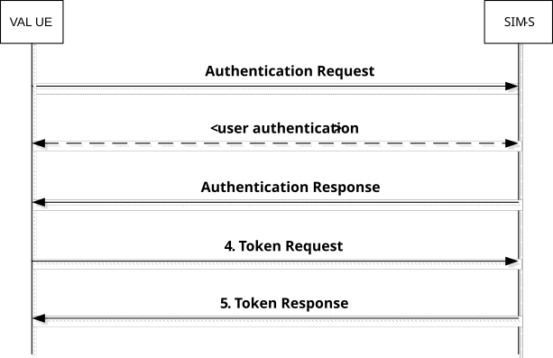
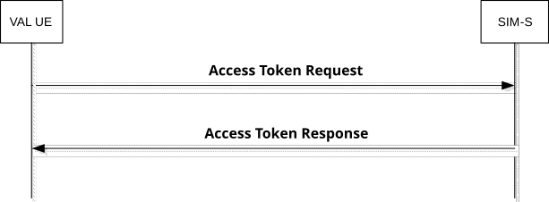

# Annex A (normative): OpenID connect profile for VAL

## A.1 General

The information in this annex provides a normative description of the Authentication and Authorization framework based on the OpenID Connect 1.0 standard. Characterization of the ID token, access token, how to obtain tokens, how to validate tokens, and how to use the refresh token is explained.

The OpenID Connect 1.0 standard provides the source of the information contained in this annex. This annex profiles the OpenID Connect standard and includes the ID token and the access token, as well as the definition of VAL specific scopes for key management, VAL services, configuration management, and group management. This profile is compliant with OpenID Connect.

## A.2 VAL tokens

### A.2.1 ID token

#### A.2.1.1 General

The ID Token shall be a JSON Web Token (JWT) and contain the following standard and VAL token claims. Token claims provide information pertaining to the authentication of the VAL client by the SIM-S as well as additional claims. The following clause profiles the required standard and VAL claims for the VAL Connect profile.

#### A.2.1.2 Standard claims

These standard claims are defined by the OpenID Connect 1.0 specification and are REQUIRED for VAL implementation. Other claims defined by OpenID Connect are optional. The standards-based claims for a VAL Connect ID token are shown in table A.2.1.2-1.

Table A.2.1.2-1: ID token standard claims

| Parameter | Description                                                                                                                                                                   |
|-----------|-------------------------------------------------------------------------------------------------------------------------------------------------------------------------------|
| Iss       | REQUIRED. The URL of the SIM-S.                                                                                                                                               |
| Sub       | REQUIRED. A case-sensitive, never reassigned string (not to exceed 255 bytes), which uniquely identifies the VAL user within the VAL server provider's domain.                |
| Aud       | REQUIRED. The Oauth 2.0 client_id of the SIM-C                                                                                                                                |
| Exp       | REQUIRED. Implementers MAY provide for some small leeway, usually no more than a few minutes, to account for clock skew (not to exceed 30 seconds)                            |
| iat       | REQUIRED. Time at which the ID Token was issued. Its value is a JSON number representing the number of seconds from 1970-01-01T0:0:0Z as measured in UTC until the date/time. |

#### A.2.1.3 VAL claims

The VAL Connect profile extends the OpenID Connect standard claims with the additional claims based on the VAL service.

### A.2.2 Access token

#### A.2.2.1 Introduction

The access token is opaque to VAL clients and is consumed by the VAL resource servers. The access token shall be encoded as a JSON Web Token as defined in IETF RFC 7797 \[11\]. The access token shall include the JSON web digital signature profile as defined in IETF RFC 7515 \[12\].

#### A.2.2.2 Standard claims

VAL access tokens shall convey the following standards-based claims as defined in IETF RFC 7662 \[13\].

Table A.2.2.2-1: Access token standard claims

| Parameter | Description                                                                                                                                                                                                                    |
|-----------|--------------------------------------------------------------------------------------------------------------------------------------------------------------------------------------------------------------------------------|
| Exp       | REQUIRED. Implementers MAY provide for some small leeway, usually no more than a few minutes, to account for clock skew (not to exceed 30 seconds).                                                                            |
| Scope     | REQUIRED. A JSON string containing a space-separated list of the authorization scopes associated with this token. The scope(s) contained here reflect the requested scope(s) from the Authentication Request (clause A.4.2.2). |
| client_id | REQUIRED. The identifier of the SIM-C making the API request as previously registered with the SIM-S.                                                                                                                          |

#### A.2.2.3 VAL claims

The VAL profile extends the standard claims defined in IETF RFC 7662 \[13\] with the additional claims based on the VAL service and those shown in table A.2.2.3-1.

Table A.2.2.3-1: Access token VAL claims

| Parameter | Description                                                                                                                            |
|-----------|----------------------------------------------------------------------------------------------------------------------------------------|
| SKeyProv  | OPTIONAL for SEAL. The SKeyProv parameter shall be present when the VAL Server SKM-C is authorized to provide key material to the KMS. |

## A.3 SIM-C registration

Before a SIM-C can obtain ID tokens and access tokens (required to access VAL resource servers) it shall first be registered with the SIM-S of the service provider as required by OpenID Connect 1.0. The method by which this is done is not specified by this profile. For native SIM-C, the following information shall be registered:

\- The client is issued a client identifier. The client identifier represents the client's registration with the authorization server, and enables the SIM-S to reference parameters associated with that client's registration when being requested for an access token by the SIM-C.

\- Registration of the client's redirect URIs.

Other information about the SIM-C such as (for example): application name, website, description, logo image, legal terms to be consented to, may optionally be registered.

## A.4 Obtaining tokens

### A.4.1 General

Once a SIM-C has been successfully registered with the SIM-S of the VAL service provider, the SIM-C may request ID tokens and access tokens (as required to access VAL service servers). Only native SIM-C are defined here. The exact method in which a SIM-C requests the access token depends upon the client profile. The SIM-C profiles, along with steps required from them to obtain OAuth access tokens, are explained below.

### A.4.2 Native SIM-C

#### A.4.2.1 General

This conforms to the Native Application profile of OAuth 2.0 as per IETF RFC 6749 \[3\].

SIM-C fitting the Native application profile utilize the authorization code grant type with the PKCE extension for enhanced security as shown in figure A.4.2.1-1.

Figure A.4.2.1-1: Authorization Code flow

#### A.4.2.2 Authentication request

As described in OpenID Connect 1.0, the SIM-C constructs a request URI by adding the following parameters to the query component of the authorization endpoint's URI using the "application/x-www-form-urlencoded" format, redirecting the user's web browser to the authorization endpoint of the SIM-S. The standard parameters shown in table A.4.2.2-1 are required by this Connect profile. Other parameters defined by the OpenID Connect specification are optional.

Table A.4.2.2-1: Authentication Request standard required parameters

<table>
<colgroup>
<col style="width: 25%" />
<col style="width: 74%" />
</colgroup>
<thead>
<tr class="header">
<th>Parameter</th>
<th>Values</th>
</tr>
</thead>
<tbody>
<tr class="odd">
<td>response_type</td>
<td>REQUIRED. For native SIM-C the value shall be set to "code".</td>
</tr>
<tr class="even">
<td>client_id</td>
<td>REQUIRED. The identifier of the SIM-C making the API request. It shall match the value that was previously registered with the SIM-S of the VAL service provider.</td>
</tr>
<tr class="odd">
<td>Scope</td>
<td>
REQUIRED. Scope values are expressed as a list of space-delimited, case-sensitive strings which indicate which VAL resource servers the client is requesting access to. If authorized, the requested scope values will be bound to the access token returned to the client.

The scope value "openid" is defined by the OpenID Connect standard and is mandatory, to indicate that the request is an OpenID Connect request, and that an ID token should be returned to the SIM-C.

NOTE: Additional VAL service specific scopes need to be defined by VAL service specification and it is out of scope of the present document.
</td>
</tr>
<tr class="even">
<td>redirect_uri</td>
<td>REQUIRED. The URI of the SIM-C to which the SIM-S will redirect the SIM-C's user agent in order to return the authorization code to the SIM-C. The URI shall match the redirect URI registered with the SIM-S during the client registration phase.</td>
</tr>
<tr class="odd">
<td>State</td>
<td>REQUIRED. An opaque value used by the SIM-C to maintain state between the authorization request and authorization response. The SIM-S includes this value in its authorization response back to the SIM-C.</td>
</tr>
<tr class="even">
<td>acr_values</td>
<td>REQUIRED. Space-separated string that specifies the acr values that the SIM-S is being requested to use for processing this authorization request, with the values appearing in order of preference. For minimum interoperability requirements, a password-based ACR value is mandatory to support. "3gpp:acr:password".</td>
</tr>
<tr class="odd">
<td>code_challenge</td>
<td>REQUIRED. The base64url-encoded SHA-256 challenge derived from the code verifier that is sent in the authorization request, to be verified against later.</td>
</tr>
<tr class="even">
<td>code_challenge_method</td>
<td>REQUIRED. The hash method used to transform the code verifier to produce the code challenge. This profile current requires the usage of "S256"</td>
</tr>
<tr class="odd">
<td colspan="2">NOTE: The order in which they are expressed does not matter.</td>
</tr>
</tbody>
</table>

#### A.4.2.3 Authentication response

The authorization endpoint running on the SIM-S issues an authorization code and delivers it to the SIM-C. The authorization code is used by the SIM-C to obtain an ID token, access token and refresh token from the SIM-S. The authorization code is added to the query component of the redirection URI using the "application/x-www-form-urlencoded" format. The authorization code standard parameters are shown in table A.4.2.3-1.

Table A.4.2.3-1: Authentication Response standard required parameters

| Parameter | Values                                                                                                                                                                                                                                                                                                                               |
|-----------|--------------------------------------------------------------------------------------------------------------------------------------------------------------------------------------------------------------------------------------------------------------------------------------------------------------------------------------|
| Code      | REQUIRED. The authorization code generated by the authorization endpoint and returned to the SIM-C via the authorization response.                                                                                                                                                                                                   |
| State     | REQUIRED. The value shall match the exact value used in the authorization request. If the state does not match exactly, then the NGMI API client is under a Cross-site request forgery attack and shall reject the authorization code by ignoring it and shall not attempt to exchange it for an access token. No error is returned. |

#### A.4.2.4 Access token request

In order to exchange the authorization code for an ID token, access token and refresh token, the SIM-C makes a request to the authorization server's token endpoint by sending the following parameters using the "application/x-www-form-urlencoded" format, with a character encoding of UTF-8 in the HTTP request entity-body. Note that client authentication is REQUIRED for native applications (using PKCE) in order to exchange the authorization code for an access token. Assuming that client secrets are used, the client secret is sent in the HTTP Authorization Header. The access token request standard parameters are shown in table A.4.2.4-1.

Table A.4.2.4-1: Access token request standard required parameters

| Parameter     | Values                                                                                                                                                                                                                                         |
|---------------|------------------------------------------------------------------------------------------------------------------------------------------------------------------------------------------------------------------------------------------------|
| grant_type    | REQUIRED. The value shall be set to "authorization_code".                                                                                                                                                                                      |
| code          | REQUIRED. The authorization code previously received from the SIM-S as a result of the authorization request and subsequent successful authentication of the VAL user.                                                                         |
| client_id     | REQUIRED. The identifier of the client making the API request. It shall match the value that was previously registered with the OAuth Provider during the client registration phase of deployment, or as provisioned via a development portal. |
| redirect_uri  | REQUIRED. The value shall be identical to the "redirect_uri" parameter included in the authorization request.                                                                                                                                  |
| code_verifier | REQUIRED. A cryptographically random string that is used to correlate the authorization request to the token request.                                                                                                                          |

#### A.4.2.5 Access token response

If the access token request is valid and authorized, the SIM-S returns an ID token, access token and refresh token to the SIM-C in an access token response message; otherwise it will return an error.

The access token response standard parameters are shown in table A.4.2.5-1.

Table A.4.2.5-1: Access token response standard parameters

| Parameter     | Values                                                 |
|---------------|--------------------------------------------------------|
| access_token  | REQUIRED. This is the issued access token.             |
| token_type    | REQUIRED. This field shall be "bearer"                 |
| expires_in    | REQUIRED. The lifetime in seconds of the access token. |
| Id_token      | OPTIONAL. This is the issued id token.                 |
| Refresh_token | OPTIONAL. This is the issued refresh token.            |

The SIM-C may now validate the user with the ID token and configure itself for the user (e.g. by extracting the VAL service ID from the ID Token). The SIM-C then uses the access token to make authorized requests to the SIM resource servers on behalf of the end user.

## A.5 Refreshing an access token

### A.5.1 General

To protect against leakage or other compromise, access token lifetimes are typically short lived (though it is ultimately a matter of security policy & configuration by the service provider). Some client types can be issued longer-lived refresh tokens, which enable them to refresh the access token and avoid having to prompt the user for authentication again when the access token expires. Refresh tokens are available only to clients utilizing the authorization code grant type. Figure A.5.1-1 shows how Native SIM-C can use the refresh token as a grant type to obtain new access tokens.

Figure A.5.1-1: Requesting a new access token

### A.5.2 Access token request

To obtain an access token from the SIM-S using a refresh token, the SIM-C makes an access token request to the token endpoint of the SIM-S. The SIM-C does this by adding the following parameters using the "application/x-www-form-urlencoded" format, with a character encoding of UTF-8 in the HTTP request entity-body. The access token request standard parameters are shown in table A.5.2-1.

Table A.5.2-1: Access token request standard required parameters

| **Parameter** | **Values**                                                                                                                                                                                                                                              |
|---------------|---------------------------------------------------------------------------------------------------------------------------------------------------------------------------------------------------------------------------------------------------------|
| grant_type    | REQUIRED. The value shall be set to "refresh_token".                                                                                                                                                                                                    |
| Scope         | Space-delimited set of permissions that the SIM-C requests. Note that the scopes requested using this grant type shall be of equal to or lesser than scope of the original scopes requested by the SIM-C as part of the original authorization request. |

If the SIM-C was provided with client credentials by the SIM-S, then the client shall authenticate with the token endpoint of the SIM-S utilizing the client credential (shared secret or public-private key pair) established during the client registration phase.

### A.5.3 Access token response

In response to the access token request (above) the token endpoint on the SIM-S will return an access token to the SIM-C, and optionally another refresh token in an access token response message.

The access token response standard parameters are shown in table A.5.3-1.

Table A.5.3-1: Access token response standard parameters

| **Parameter** | **Values**                                             |
|---------------|--------------------------------------------------------|
| access_token  | REQUIRED. This is the issued access token.             |
| token_type    | REQUIRED. This field shall be "bearer"                 |
| expires_in    | REQUIRED. The lifetime in seconds of the access token. |
| Id_token      | OPTIONAL. This is the issued id token.                 |
| Refresh_token | OPTIONAL. This is the issued refresh token.            |

It is possible to configure the SIM-S to confirm that the user account is still valid each time the refresh token is presented, and to revoke the refresh token if not. This security practice is RECOMMENDED.

## A.6 Using the token to access VAL resource servers

Connect for VAL shall initially support the bearer access token type. Access tokens of type "bearer" shall be communicated from the VAL or SEAL Clients in UE to VAL resource servers by including the access token in the HTTP Authorization Header, per IETF RFC 6750 \[4\].

The access token is opaque to the VAL or SEAL Clients in UE, meaning that the client does not have any knowledge of the access token itself. The client will be given some metadata corresponding to the access token, such as its expiration time, so that it does not send an expired access token to VAL resource servers. If the access token is presented to a VAL resource server and the scope is invalid or the token is expired or revoked, the VAL resource server should return an error message indicating such to the VAL or SEAL Clients in UE.

## A.7 Token validation

### A.7.1 ID token validation

The VAL or SEAL Clients in UE shall validate the ID token as per clause 3.1.3.7 of the OpenID Connect 1.0 specification \[5\].

### A.7.2 Access token validation

VAL resource servers shall validate access tokens received from the VAL or SEAL Clients in UE according to IETF RFC 7797 \[11\].

## A.8 Token revocation

In order to limit the time validity of a token, the "exp" and "expires_in" parameters may be used as a method of access token revocation. If either the "exp" or "expires_in" parameter is used as a method of access token revocation, then the following applies:

Within the standard claims of an access token, the "exp" parameter shall be used by the authorising server to determine whether or not the token is valid. If the current time is beyond the time specified by the "exp" parameter, the associated token shall no longer be considered valid and any requests made with an expired token shall be rejected by the authorising server.

Within the standard claims of an access token response, token exchange response or token response message, the "expires_in" parameter shall be used by the UE client(s) to determine validity of the associated token. If the current time is beyond the time specified by the "expires_in" parameter, the associated token shall no longer be considered valid and no client requests shall be made using the expired token. A refresh token may be used per clause A.5 to obtain a new access token.

## A.9 SIM-S interface security

The support of Transport Layer Security (TLS) between the SIM-C in the VAL UE and the SIM-S is mandatory. The profile for TLS implementation and usage shall follow the provisions given in 3GPP TS 33.310 \[6\], annex E.

If PSK TLS based authentication is supported, the SIM-C in the VAL UE and the SIM-S shall support the TLS version, PSK ciphersuites and TLS Extensions as specified in the TLS profile given in 3GPP TS 33.310 \[6\], annex E. The usage of pre-shared key ciphersuites for TLS is specified in the TLS profile given in 3GPP TS 33.310 \[6\], annex E.
