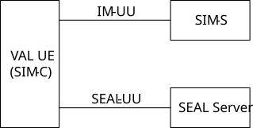
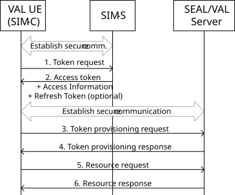

# Annex B (normative): Security mechanisms for LWP interfaces

## B.1 General

This annex specifies communication security, authentication and authorization mechanisms for protocol realizations of the light-weight protocol (LWP) in the signalling control plane.

## B.2 Communication security for CoAP

CoAP messages \[18\] shall be protected and deploy the security enhancements of \[22\]. When (D)TLS is used, the (D)TLS and certificate profiling shall follow TS 33.210 \[14\] and TS 33.310 \[6\]. When OSCORE is used, the mandatory to implement provisions given by RFC 8613 \[23\] shall be followed.

## B.3 Authentication and authorization mechanism on CoAP

### B.3.1 General

When CoAP is used for the LWP, Authentication and authorization for Constrained Environments (ACE) using OAuth 2.0 Framework (ACE-OAuth) as specified in \[19\] shall be supported.

Figure B.3.1-1 shows the functional model which consists of the SEAL Identity Management Server (SIM-S), SEAL Identity Management Client (SIM-C) and SEAL server. The IM-UU reference point between the SIM-S and the SIM-C and the SEAL-UU reference point between SEAL server and SIM-C shall support ACE-OAuth \[19\] and OAuth 2.0 \[9\] with COSE \[20\].

Figure B.3.1-1: Functional model for SEAL Identity management client, server and SEAL server

The SIM-S, the SIM-C and a SEAL server respectively play the roles of the Authorization Server, the Client and the Resource Server in the ACE-OAuth framework.

For authentication of SIM-S, the security enhancements of CoAP specified in \[22\] shall be followed. When (D)TLS is used, the (D)TLS and certificate profiling shall follow TS 33.210 \[14\] and TS 33.310 \[6\]. When OSCORE is used, authentication shall be based on pre-shared secrets. The authentication method and credentials of the VAL-UE are out of scope of this specification.

### B.3.2 VAL user authentication

VAL user authentication is executed by the SIM-S before providing access token for the VAL UE.

NOTE 1: The primary method and credentials for VAL user authentication are based on VAL service provider policy. The method chosen by the VAL service provider for authentication and authorization is neither defined nor limited by the present document.

NOTE 2: VAL user may refer to the user or the device depending on the setting.

### B.3.3 SEAL service authorization

SEAL Service Authorization procedure shall validate the VAL user to access the SEAL services. In order to gain access to SEAL services, the SEAL client shall present an access token to the SEAL server for each service of interest. If the access token is valid, then the client shall be granted to use the service.

### B.3.4 Authorization framework

Authorization framework is shown in figure B.3.4-1. The ACE-OAuth \[19\] framework is followed. The SIM-S and SIM-C shall perform mutual authentication as specified in B.3.1. After successful authentication, the SIM-C shall request and receive an access token from the SIM-S over CoAP as described in clause 5.8 of \[19\] indicated in steps 1 and 2 in the figure. Before providing the access token, SIM-S shall authorize the VAL UE for the requested service. The procedures may be repeated as necessary to obtain additional VAL UE authorizations.

Figure B.3.4-1: VAL UE Service Authorization

After the VAL UE received an access token it shall establish a secure connection with the SEAL/VAL server as specified in B.2. The VAL UE shall send a CoAP message containing the access token to the SEAL/VAL server in a service authorization request as described in clause 5.10 of \[19\] indicated in steps 3 and 4 in the figure. On receiving the service authorization message, the SEAL/VAL server shall validate the access token. If the access token is valid, the SEAL/VAL server shall provide service-related information according to the rights granted to the VAL UE in response to subsequent requests indicated in steps 5 and 6.

The messages sent for the authorization shall be protected. When (D)TLS is used, the (D)TLS and certificate profiling shall in addition to \[22\] follow also TS 33.210 \[14\] and TS 33.310 \[6\]. When the VAL UE is authenticating directly to the SEAL/VAL server, then the DTLS or TLS profile of ACE \[21,25\] may be used. In order to authorize clients and protect communication across proxies, the OSCORE profile of ACE \[24\] shall be used.

### B.3.5 VAL service authorization

The VAL service authorization procedure shall validate the VAL user authorized to access the VAL services.  In order to gain access to VAL services, the VAL client shall present an access token to the VAL server for each VAL service of interest (see clause B.3.4). If the access token is valid, then the VAL client shall be granted use of the requested VAL service.

### B.3.6 Access token

#### B.3.6.1 Introduction

The access token is opaque to VAL clients and is consumed by the VAL resource servers. The access token shall be encoded as a CBOR Web Token as defined in IETF RFC 8392 \[26\]. Depending on whether the CWT is signed, MACed or encrypted, the corresponding COSE object shall be used as defined in IETF RFC 8392 \[26\].

#### B.3.6.2 Standard claims

VAL access tokens shall convey the following standards-based claims as specified in ACE-OAuth \[19\].

Table B.3.6.2-1: Access token standard claims

| Parameter | Description                                                                                                                                                                                                                                                                                                                    |
|-----------|--------------------------------------------------------------------------------------------------------------------------------------------------------------------------------------------------------------------------------------------------------------------------------------------------------------------------------|
| exp       | REQUIRED. Implementers MAY provide for some small leeway, usually no more than a few minutes, to account for clock skew (not to exceed 30 seconds).                                                                                                                                                                            |
| scope     | REQUIRED. Text or byte string. The text string contains a space-separated list of the authorization scopes associated with this token. The byte string allows compact encoding of complex scopes. The scope(s) contained here reflect the requested scope(s) from the Token Request (clause B.3.4).                            |
| cnf       | REQUIRED. The "cnf" (confirmation) claim declares that the SEAL client possesses a particular key and that the SEAL service can cryptographically confirm that the SEAL client has possession of that key. The value of the "cnf" claim is a CBOR map and the members of that map identify the proof-of-possession key \[27\]. |
| audience  | OPTIONAL. This field indicates the targeted SEAL servers/resources for the access token \[19\].                                                                                                                                                                                                                                |

#### B.3.6.3 VAL claims

The VAL profile extends the standard claims specified in ACE-OAuth \[19\] with the additional claims based on the VAL service.

### B.3.7 Obtaining access tokens

#### B.3.7.1 Access token request

In order to obtain an access token (and optionally a refresh token) the SEAL client makes a CoAP request to the authorization server's token endpoint by sending the following parameters using the "application/ace+cbor" Content-format, with a CBOR map in the CoAP payload. Note that mutual authentication is REQUIRED between SEAL client and SEAL server. The access token request standard parameters are shown in table B.3.7.1-1.

Table B.3.7.1-1: Access token request standard required parameters

| Parameter | Values                                                                                                                                    |
|-----------|-------------------------------------------------------------------------------------------------------------------------------------------|
| scope     | OPTIONAL. This field requests authorization scopes for the access token.                                                                  |
| audience  | OPTIONAL. This field requests specific SEAL servers/resources for the access token \[19\].                                                |
| cnonce    | REQUIRED and only used if a client-nonce was provided in response to an unauthorized resource request to a SEAL server/resource \[19\].   |
| req_cnf   | OPTIONAL. This field contains information about the key the SEAL client wants to bind to the access token for proof-of-possession \[28\]. |

#### B.3.7.2 Access token response

If the access token request is valid and authorized, the SEAL server returns an access token (and optionally a refresh token) to the SEAL client in an access token response message; otherwise, it will return an error.

The access token response standard parameters are shown in table B.3.7.2-1.

Table B.3.7.2-1: Access token response standard parameters

| Parameter     | Values                                                                                                                                                                            |
|---------------|-----------------------------------------------------------------------------------------------------------------------------------------------------------------------------------|
| access_token  | REQUIRED. This is the issued access token.                                                                                                                                        |
| expires_in    | REQUIRED. The lifetime in seconds of the access token.                                                                                                                            |
| refresh_token | OPTIONAL. This is the issued refresh token.                                                                                                                                       |
| ace_profile   | REQUIRED. This field indicates the IETF ACE profile the SEAL client shall use towards the SEAL server/resource \[19\].                                                            |
| cnf           | OPTIONAL. This field is REQUIRED for symmetric key usages unless the secret key is known to the SEAL client (e.g. in case of update of access rights) \[27\].                     |
| rs_cnf        | OPTIONAL. This field is REQUIRED for asymmetric key usages unless the public key of the SEAL server is known to the SEAL client (e.g. in case of update of access rights) \[28\]. |

The SEAL client may now use the access token to make protected and authorized requests to the SEAL server.
