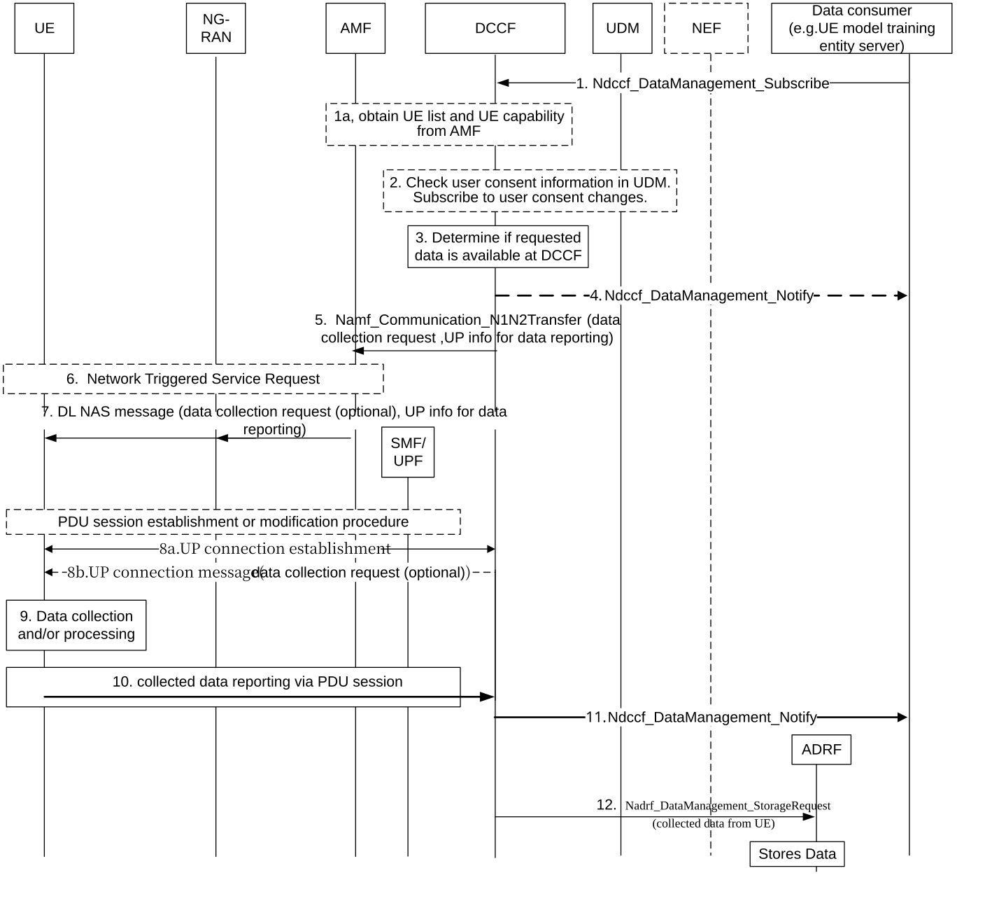

# 6.1 Solution \#1: UE data collection via DCCF in CN over UP

## 6.1.1 High level principles

In this solution, there are some high level principles as follows:

\- DCCF is utilized to support data transferring from UE to data consumer e.g. UE model training entity server.

\- When DCCF receives the request from data consumer, it performs UE selection, generates data collection request and provides UP information and sends to UE via AMF with NAS message.

\- Based on the UP information, UE may establish UP connection for data transferring via a PDU session, which is selected or established based on URSP. The URSP can be enhanced to include some dedicated parameters in Traffic descriptor and Route Selection Descriptor for UE data collection traffic.

\- The UE transfer the data for AI training via UP connection to DCCF and DCCF transfer data to UE model training entity server.

\- After receiving the collected data from UE, the DCCF can notify the data to the data consumer, and may store the data to ADRF.

\- During data collection and transfer process, UE is aware of what the standardized data to be transferred to participate AI training.

## 6.1.2 Description

This solution is for Key Issue#1 for UE data collection over UP.

Since Rel-17 onwards, the DCCF has been introduced to CN as an intermediate entity to collect data for AI related usages, wherein the data consumer can be NWDAF, the data source can be CN NFs, AF and OAM. The data collection related signalling is interacted between data consumer and data source(s) via DCCF and the collected data is reported from the data source(s) to the data consumer via DCCF or MFAF, the detailed procedures are defined in clauses 5A.3 and 6.2.6.3 of TS 23.288 \[5\].

In this Release, the DCCF can also be used to collect data from UE according to data consumer's request, wherein the data consumer could be UE model training entity server to train UE-side ML model. The DCCF receives data collection request from the data consumer indicating the target of reporting is some specific UE, group of UE or any UE, then the DCCF sends the data collection request to the target UE via AMF over NAS, UP information for data reporting can also be sent to indicate the UE to utilize user plane for data reporting. The UE selects or established PDU session for this data reporting and then reports the collected data via the UP connection to the DCCF. The UP information includes the target address to report data and port number, wherein the target address to report data points to DCCF who will receive the data from UE(s). The data collection request includes the data reporting area, in which UE shall send collected data to DCCF.

## 6.1.3 Procedures

### 6.1.3.1 UE data collection via DCCF in CN over UP

Figure 6.1.3.1-1: UE side data transferring via a User Plane Connection

Editor's note: How to support MNO's controllability and visibility in solution is FFS.

1\. Data consumer (e.g. UE model training entity server) requests UE data collection to DCCF by invoking Ndccf_DataManagement_Subscribe, including Target of UE data collection (i.e. UE(s), group of UE or any UE) and Notification Target Address and optionally with Time Window, AOI, etc.

If the UE model training entity server is an untrusted AF, the data collection request should be transferred to the DCCF via NEF.

Before step 1, the data consumer may discover the DCCF via NRF, which supports to collect data from UE via UP plane.

1a. The DCCF subscribes to the AMF(s) to retrieve the list of SUPIs located in the AOI and optionally the UE capability of data collection requested by DCCF and capability of data reporting over UP.

2\. The DCCF check the user consent by retrieving the user consent information from UDM using Nudm_SDM_Get. If user consent is not granted, DCCF does not collect data from the UE, the data collection stops here. If the user consent is granted, the DCCF subscribes to UDM to notifications of changes on subscription data type "User consent" for this user using Nudm_SDM_Subscribe.

Editor's note: How to select the target UEs for data collection by DCCF is FFS.

3\. The DCCF determines whether the data requested in step 1 are already being collected, if yes, step 4 is performed. Otherwise, step 5 to 11 are performed.

4\. \[Conditional\] The DCCF uses Ndccf_DataManagement_Notify to send the UE related data to notification endpoint indicated in step 1.

5\. \[Conditional\] The DCCF sends data collection request to the corresponding AMF(s) by invoking Namf_Communication_N1N2Transfer service operation, with optional data information and UP information for data reporting. The UP information for data reporting indicates the UE to utilize user plane for data reporting. The UP information for data reporting includes the target address to report data and port number, wherein the target address to report data points to DCCF who will received the data from UE(s). The data collection request includes the data reporting area, in which UE shall send collected data to DCCF.

NOTE 1: If MFAF is deployed by MNO to receive and forward data under the control of the DCCF, then the target address to report data points to the MFAF. The DCCF gets MFAF’s address by operator configuration or requesting from the MFAF.

NOTE 2: The data collection request and UP information for data reporting can be transferred to the UE in two separated steps.

The requested data information includes collected data's service type (e.g. AI service), case information (e.g. CSI or beam management), data type, and optionally with data collection instruction (e.g. time, area. periodicity), data processing instruction (e.g. anonymization), deferred indication which indicates the UP connection is allowed to be set up later.

6\. \[Conditional\] For idle UE(s) the AMF triggers service request procedure.

Editor's note: Whether data collection from UEs in idle is required would need to be checked with RAN.

7\. The AMF forwards the data collection request and UP information for data reporting to the UE(s) via DL NAS message.

8a. To the UP information, the UE will establish a UP connection with DCCF for data reporting over a proper PDU session. This selected PDU session may be an existing one which has been set up before step 7, or if there is no applicable PDU session for this UE data reporting over the user plane, then the UE establishes the PDU session first. The UE may use the URSP received from PCF to select or establish the PDU session for this UP connection with DCCF, the URSP can be enhanced to include:

\- Traffic descriptor components:

\- Target address to report data pointing to DCCF or MFAF.

\- UE data collection type.

\- Route Selection Descriptor components: (UE data collection dedicated PDU session parameters):

\- DNN.

\- S-NSSAI.

8b. \[optional\] If the requested data information is not included in step 5 and 7, then the DCCF can send data collect request in this step via the UP connection.

9\. According to data collection request from DCCF, the UE collects the requested data.

10\. When the UE is inside the data reporting area received from the data collection request, the UE reports the collected data via the UP connection over PDU session to the DCCF. When the UE leaves the data reporting area received from the data collection request, the UE stops sending the collected data to DCCF and terminates the established UP connection. The UE may start data transfer when certain condition is met e.g. the related measurement has been accomplished and the requested data is available.

11\. The DCCF uses Ndccf_DataManagement_Notify to send the UE related data to notification endpoint indicated in step 1.

12\. The DCCF may store the collected data from UE to ADRF by invoking Nadrf_DataManagement_StorageRequest as defined in TS 23.288 \[5\].

## 6.1.4 Impacts on services, entities and interfaces

**DCCF:**

\- Sends data collection request to selected UEs via AMF over NAS to collect UE side model training data. Or sends data collection request to UE via UP connection.

\- Allocates and sends UP information for data reporting to the UE via AMF over NAS.

\- Receives data collected by the UE via UP connection from the UE and transfers collected data to data consumer.

\- Stores the collected data from UE to ADRF.

**UE:**

\- Receives UP information for data reporting originated from DCCF and establishes UP connection with the DCCF to report data.

\- Receives data collection request originated from DCCF and collects corresponding data.

\- Reports the collected data via the UP connection to the DCCF.

\- \[optional\] Reports to AMF about UE capability of data collection requested by DCCF and capability of data reporting over UP.

**AMF:**

\- The AMF transfer the UP information received from DCCF to UE via NAS connection.

\- \[optional\] receives UE capability of data collection requested by DCCF and capability of data reporting over UP, and informs them to the DCCF.

**PCF:**

\- \[optional\] Enhances URSP to include some UE data collection dedicated parameters in Traffic descriptor and Route Selection Descriptor.
