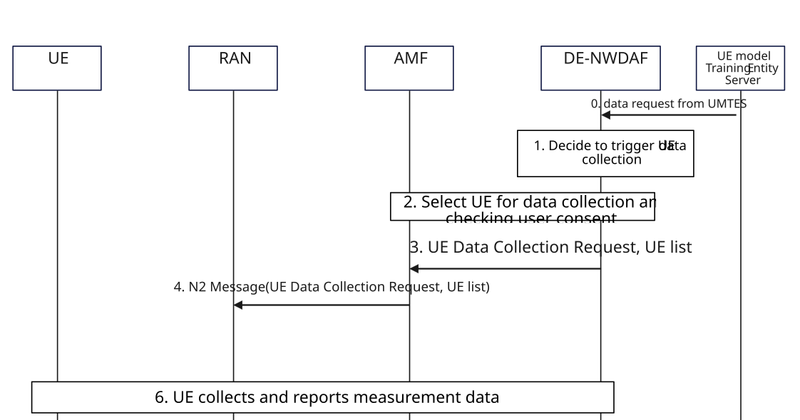

# 6.10 Solution \#10: RAN assist UE data collection

## 6.10.1 High level principles

The high-level principles of the solution are:

\- RAN triggers UE data measurement and collection by core network request.

\- RAN triggers data measurement and collection with UE.

\- A dedicated NWDAF (DE-NWDAF) is responsible for UE data collection in the core network.

\- UE setup UP connection with DE-NWDAF to transfer data for UE-side model training.

## 6.10.2 Description

For 5G Core assistance in data transfer from UE to UMTES, we assume that it will be a dedicated NWDAF with UE data exposure capability that collect data from UE. In this solution, the NWDAF with UE data exposure capability is called Data-Exposure NWDAF (DE-NWDAF).

It is also assumed that UE gets UP connection information, e.g. DE-NWDAF address, security related parameters, with UE policy parameters in the UE registration procedure.

This solution proposes RAN assists UE data collection in the following scenario: Core Network informs RAN to initiate UE data collection. RAN send data collection request to the UE and optionally participate in UE selection.

## 6.10.3 Procedures

### 6.10.3.1 Procedure of CN informing RAN to initiate UE data collection

Figure 6.10.3.1-1: Procedure of CN informing RAN to initiate UE data collection

0\. UE Model Training Entity Server (UMTES) sends data collection request to the DE-NWDAF. The request may include UE list, data context ID, AoI and other parameters.

NOTE: The detail of the data request to the DE-NWDAF will be addressed in other solutions.

Editor's note: Whether DE-NWDAF functionality is within an NWDAF or a logical different function is FFS.

1\. DE-NWDAF determines to collect UE data based on data request from UMTES.

2\. If no UE list is provided by UMTES, DE-NWDAF determines the UE list for data collection based on data collection requirement and UE information (e.g. User consent, UE location, PEI).

If UMTES provides UE list, then DE-NWDAF checks user consent for those UE with UDM.

3\. DE-NWDAF sends UE data collection request to AMF. DE-NWDAF selects AMF based on the selected UE list. DE-NWDAF provides UE list (the selected UE who is served by the AMF), Data context ID, time window to AMF in order to inform AMF what UE data should be collected at which area during which time window.

Editor's note: What AMF service to be used for serving the UE data collection request from DE-NWDAF is FFS.

4\. AMF informs RAN to initiate UE data collection in NGAP message. AMF chooses RAN based on UE list from the DE-NWDAF. AMF informs RAN Data context ID, time window and UE list.

Editor's note: The details of message between RAN and AMF, as well as when RAN/UE starts the data collection are FFS and need to be discussed with RAN WG3.

5\. RAN triggers data measurement and collection with UE.

Editor's note: Details about how RAN sends data measurement and collection request to UE, e.g. in RRC message is up to RAN WG2.

6\. UE collects data and reports to DE-NWDAF over the UP connection. If no UP connection between UE and DE-NWDAF has been establishment, UE will initiate UP connection establishment.

Editor's note: The detailed information and parameters exchanged between UE and DE-NWDAF over UP connection are FFS.

Editor's note: Whether and how the network (e.g. DE-NWDAF) can be aware whether the data collected from the UE is the same from the one measured by the UE is FFS and maybe coordinated with SA WG3.

## 6.10.4 Impacts on services, entities and interfaces

**RAN:**

\- Receive UE data collection request from AMF.

**AMF:**

\- Receives UE data collection request from DE-NWDAF.

\- Send UE data collection request to RAN.

\- Support UE selection for data collection: transfer selected UE list from RAN and provides updated UE list based on user consent.

**UE:**

\- Perform and report new measurement.

\- Establish a new application layer connection with DE-NWDAF.

**DE-NWDAF functionality:**

\- Establish user plane connection with UE.

\- Collect and optionally store UE data from UE for UE-side model training.

\- Provide UE data to UMTES directly or via NEF.

\- Decide UE list for training data collection.
