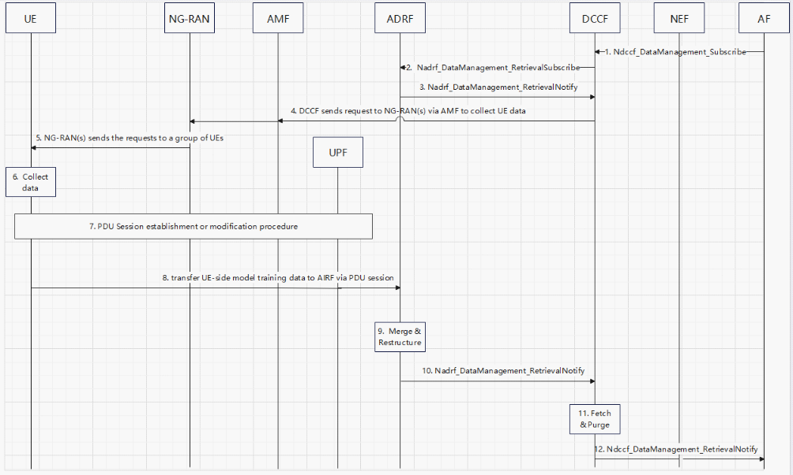

# 6.11 Solution \#11: UE-Side model training data collection via DCCF and ADRF in CN over UP

## 6.11.1 High level principles

The following principles for this solution are proposed as below:

\- New ADRF (AI data Repository Function) is introduced to store UE-side model training data.

\- The 5GC-centric variant is used:

\- AF requests UE-side model training data from DCCF.

\- DCCF checks whether the requested UE collected data is already stored in ADRF or not. If the requested UE collected data is available in ADRF, DCCF exposes the data from ADRF to AF. If the requested UE collected data is not available in ADRF, DCCF sends requests to UEs to collect data.

\- DCCF informs UE(s) the ADRF address. UEs establish the UP connection via UPF to ADRF.

\- UE(s) collects UE-side model training data and sends them to ADRF.

\- ADRF sends the received data(together with historical collected data if available) to DCCF, DCCF further sends to AF.

## 6.11.2 Description

This solution is for Key Issue#1 for UE data collection over UP.

The DCCF has been introduced to 5GC since R17. The Data Consumer may use an NRF to perform NF discovery and selection to find a DCCF that can coordinate data collection (DCCF discovery principles are defined in clause 6.3.19 of TS 23.501 \[2\]).

In this release, a new functionality ADRF is introduced, together with DCCF to collect and store UE-side model training data from UE according to data consumer's request, wherein the data consumer could be entity in CN or AF to train UE-side ML model. Data consumer requests UE-side model training data from DCCF, if the AF is an untrusted AF, the data collection request should be transferred to the DCCF via NEF. The DCCF check whether the UE-side model training data is available in ADRF, if the UE-side model training data is available in ADRF, DCCF retrieves the data from ADRF and sends the data to the data consumer. If the UE-side model training data is not available in ADRF, then DCCF starts to collect data from UEs, UEs collect and send collected data to ADRF through user plane, ADRF may send the data to DCCF after the required data is ready, DCCF purges and sends the UE-side model training data to the data consumer.

Editor's note: How visibility is fulfilled is FFS.

## 6.11.3 Procedures

### 6.11.3.1 UE-side model training data collection via DCCF and ADRF in CN over UP

Figure 6.11.3.1: UE-side model training data collection via DCCF and ADRF in CN over UP

1\. The Data consumer (AF) requests UE training data from DCCF, if the AF is an untrusted AF, the data collection request should be transferred to the DCCF via NEF. The Data Consumer may use an NRF to perform NF discovery and selection to find a DCCF that can coordinate data collection. The data consumer requests data via the DCCF, using Ndccf_DataManagement_Subscribe service operation.

2\. The DCCF sends a request to the ADRF, using Nadrf_DataManagement_RetrievalSubscribe (UE-side model training data Specification, Notification Target Address=DCCF) service operation.

3\. The ADRF responds to the DCCF with an Nadrf_DataManagement_RetrievalNotify response indicating whether the ADRF can supply the UE-side model training data. If the UE-side model training data can be provided, the procedure continues with step 11, otherwise step 4 to 10 is performed.

4\. The DCCF sends request to NG-RAN(s) via AMF to collect UE-side model training data.

5\. NG-RAN(s) sends the requests to the UEs which have the capability to collect the UE-side model training data or all UEs in the cell.

6\. UEs collect UE-side model training data.

7\. UEs establish PDU session(s).

8\. UEs utilize user plane with the established PDU session(s) to transfer UE-side model training data to ADRF.

9\. The ADRF verifies whether the collected UE-side model training data is standardized data or not, if the collected UE-side model training data is standardized data, the ADRF merges and restructures and stores UE-side model training data together with historically collected UE-side model training data, otherwise the ADRF discards the collected UE-side model training data.

10\. The ADRF sends the DCCF with an Nadrf_DataManagement_RetrievalNotify response indicating the ADRF can supply the UE-side model training data is ready.

11\. The DCCF fetches the UE-side model training data from ADRF, performs purging (e.g. anonymizing) to clean the UE label and other sensitive information and verify whether it matches with the request from AF or not before sending them to AF.

12\. The DCCF sends the purged UE training data to notification endpoint (data consumer) via Ndccf_DataManagement_Notify.

## 6.11.4 Impacts on services, entities and interfaces

**DCCF:**

\- Sends data collection request to NG-RAN via AMF to collect UEs data.

\- Allocates and sends UP information for data collection to NG-RAN via AMF.

\- DCCF purges the UE training data to clean the UE label and other sensitive information.

\- DCCF sends the data to data consumer.

**ADRF:**

\- Receives data collected by the UEs via UP connection from the UEs and stores the collected data in ADRF.

\- ADRF merges, restructures and stores UE training data together with historically collected UE training data.

**AMF:**

\- Receives request(s) including data type, UP information from DCCF and send the request(s) to NG-RAN.

**NG-RAN:**

\- Receives request(s) including data type, UP information from AMF and sends the requests to a group of UEs or all UEs in the cell.

**UE:**

\- Receives UP information for data reporting originated from DCCF and establishes UP connection with the DCCF to report data.

\- Receives data collection request originated from DCCF and collects corresponding data.

\- Sends the collected data via the UP connection to the DCCF.
