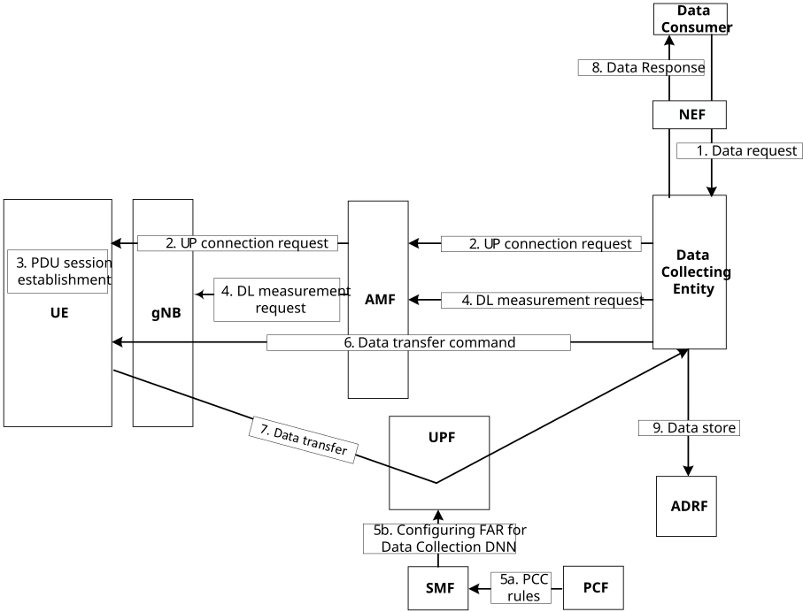
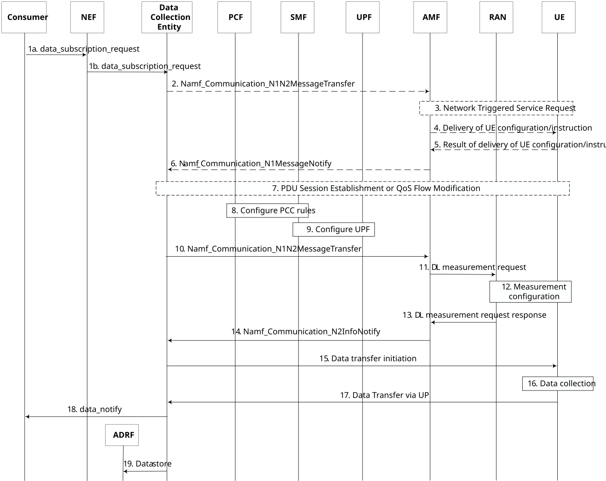

# 6.12 Solution \#12: UP-based UE data collection

## 6.12.1 High level principles

The high-level principles of the proposed solution are as follows:

\- To take the "futureproof and extendable solutions" requirement by RAN WGs, a new network function is proposed as the "first termination entity" to fulfil the MON's controllability and visibility requirements.

\- The UE data collection entity is deployed as a dedicated DNNI in the 5GC and it is configured to receive traffic from the user plane. Using the existing mechanisms, the SMF configures the UPF(s) to forward the traffic from UE(s) to the DNNI via the User Plane to the UE data collection entity. The PCF is also configured to provide the appropriate PCC rules for usage monitoring of the traffic to the DNNI.

\- The UE data collection entity manages (including initiating and terminating) the data transfer process based on operator's policy and considering the consumer (e.g. the UE model training entity server) request (which is already authorized by the NEF). It also provides visibility for the MNO via i) keep track of all the standardized data requests sent to the UE and UE response, ii) match data received from UE with respect to the standardized data format requested from the UE, iii) providing data content visibility based on operator's request.

\- A new NAS message is introduced to control the data transfer. It includes the information of the data collection entity as termination point (including DNNI, IP, port).

\- Based on the information received by the NAS message, the UE may stablish/release QoS Flow (and PDU session) to the data collection entity.

\- The data collection entity requests the gNB to initiate DL reference signal transmission for UE data collection. The gNB determines whether to initiate DL measurements and responds to the data collection entity accordingly.

Editor's note: How the data collection entity interacts with gNB for DL measurement in UE data collection needs coordination with RAN WG.

\- The data collection entity exchanges messages with the UE over an established PDU session. These messages include a list of standardized data to be transferred and data transfer control information (e.g. start or stop indication).

## 6.12.2 Description

In the solution, data collection and transfer from UE is realized via:

\- Control plane signalling to manage the user plane connection via providing the information about data collection entity deployed in the 5GC (e.g. DNN, FQDN, Port \#, etc.).

\- User plane control messages to manage the initiation, modification, and termination of data transfer

\- User plane data transfer from the UE to the data collection entity in the 5GC.

The solution is composed of three main phases:

\- The data collection entity (e.g. a new NF) is deployed in the MNO's network with a FQDN and with a dedicated DNN which is reachable to UPFs. During the PDU session establishment process, the SMF configures the UPFs to forward the traffic targeted to the specified FQDN and/or DNN to the data collection entity. Moreover, the PCF provides the appropriate PCC rules for usage monitoring of the traffic to differentiate the traffic of UE data collection from the regular UE traffic.

\- For the UEs that support data collection and also subject to UE consent (which may be extended to consider air interface data collection), the data collection entity sends the end point information (including IP address, port, etc.) of the data collection entity deployed in 5GC to the UE via existing "UE Policy Container" update mechanism or a dedicated NAS message.

\- Based on the information and the instruction received from the network, UE establishes a dedicated PDU session, if it is not already established and requests a QoS flow to the specified data collection entity. The data collection entity can then instruct the UE on what standardized data to collect and when to collect it over the established user plane connection. Then UE subsequently starts collecting and transferring the data via the UP path.

An example realization of the proposed solution is depicted in Figure 6.12.2-1.

Figure 6.12.2-1: An example of proposed solution

When there is request for UE data, e.g. UE model training server needs training data, the consumer requests the data from the data collection entity in step 1. In the case of external data consumer, NEF authorizes the request and applies the operator's policies on the data collection. The data collection entity, in step 2, triggers the user plane connection establishment via AMF.

Based on the configuration/instruction received, the UE may stablish a PDU session and a QoS Flow to the specified FQDN/DNN in step 4 using the existing procedures wherein the SMF configures UPF (considering the PCC rules provided by the PCF) in step 5. Also, DCF should coordinate the downlink measurements with gNB for the data collection before data collection in step 4. Once the user plane connection establishment and the downlink measurement coordination are done, the data collection entity can trigger UE to collect data and transfer it to the data collection entity in step 6. The collected data is transferred to the data collection entity via the UP connection. Consequently, the data collection entity sends the data to the consumer (in step 8) and may also optionally store it in ADRF in step 9.

## 6.12.3 Procedures

The procedure of the proposed solution is shown in Figure 6.12.3-1.

Figure 6.12.3-1: CP-managed UP-based UE data Transfer Procedure

1\. The consumer (e.g. UE model training entity server) subscribes to the data collection entity for the UE data via NEF. The request is authorized and the appropriate data collection entity is discovered/selected by the NEF.

2\. \[optional\] The data collection entity checks the UE consent for data collection. If the consent is granted and if needed (e.g. UE has not already established a data transfer PDU session or QoS flow), it prepares the appropriate UP connection configuration that includes the data collection entity end point information for U-plane connection establishment. Then it requests AMF to deliver it to the UE via invoking Namf_Communication_N1N2MessageTransfer.

3\. \[optional\] If the UE is not reachable, AMF performs the existing Network Triggered Service Request procedure.

Editor's note: Whether data collection from UEs in Idle state is required would need to be checked with RAN.

4\. \[optional\] The AMF though the RAN delivers the configuration/instruction message to the UE via a dedicated NAS message.

5\. \[optional\] The UE responds to the result of the request to the AMF.

6\. \[optional\] The AMF notifies the data collection entity about the UE's response to the data collection request

7\. \[optional\] The UE establishes a PDU session and a QoS flow to transfer the data according to the information received from AMF.

8\. During the PDU session establishment process, the SMF may contact to PCF and the PCF provides the appropriate PCC rules to differentiate the data collection traffic.

9\. During the PDU session establishment process, The SMF configures the UPF to forward the UE data on this dedicated PDU session to the data collection entity.

10\. The data collection entity generates a request for the downlink measurement initiation/update and requests the AMF to deliver it to the NG-RAN.

11\. The AMF forwards the request to the NG-RAN.

12\. The NG-RAN determines whether to accept or reject the request for the downlink measurement initiation/update and responds to the data collection entity accordingly. If the request is accepted, the NG-RAN initiates the downlink measurements as requested. If the request is rejected, the NG-RAN responds with the appropriate error to the data collection entity.

13\. The NG-RAN provides measurement configuration to the UE via RRC signaling.

14\. AMF forwards the response of request for the downlink measurement initiation/update to the data collection entity.

15\. Data collection entity sends the instruction on data transfer, where the instruction includes ID of standardized data to be transferred and the indication on the data transfer start.

16\. UE collects the needed standardized data specified in the request from the network based on RAN instructions if it is not collected already.

17\. UE sends the standardized data via the established PDU session/QoS Flow to the data collection entity.

18\. The data collection entity sends the request data to the consumer.

19\. The data collection entity stores data in the ADRF.

## 6.12.4 Impacts on existing services, entities and interfaces

The solution has the following impacts:

The data collection entity (a new NF):

\- Support service operations to be used by the consumers to request UE data.

\- Support providing appropriate configuration/instruction messages for the UE for data collection.

\- Support data reception via user plane.

\- Support coordination with RAN on downlink measurements for data collection

\- Support data content check whether the data received from UE matches the requested standardized data format. and, if necessary, processing the received data.

Editor's note: How to provide full data visibility is FFS.

\- Support data transfer controllability (e.g. configuration of data transfer including allowed data to transfer, data collection period, etc.).

**NG-RAN:**

\- Support coordination with the data collection entity regarding downlink measurements for data collection

**UE:**

\- Understand the configuration/instructions received the network and perform the required action (e.g. establish a PDU session or QoS Flow, start/stop/pause data collection, etc.).

\- Support air interface data collection and transfer via UP.

**AMF:**

\- Support delivery of new NAS messages to the UE to for data transfer configuration information.

**PCF:**

\- Providing PCC rules for usage monitoring of UE data collection traffic.

\- Providing configuration/instruction to the UE in the UE registration process (optional).

**UDM:**

\- Extension of user consent to control "air interface data collection".

Editor's note: Whether and how to extend user consent needs coordination with SA WG3.
