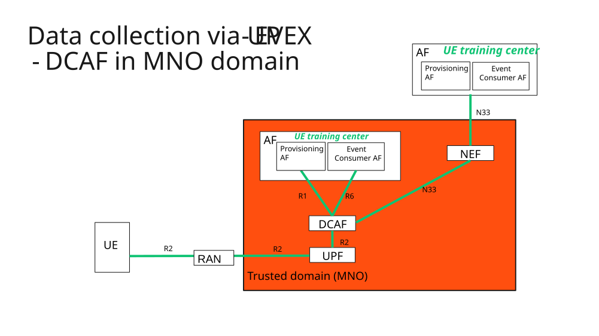
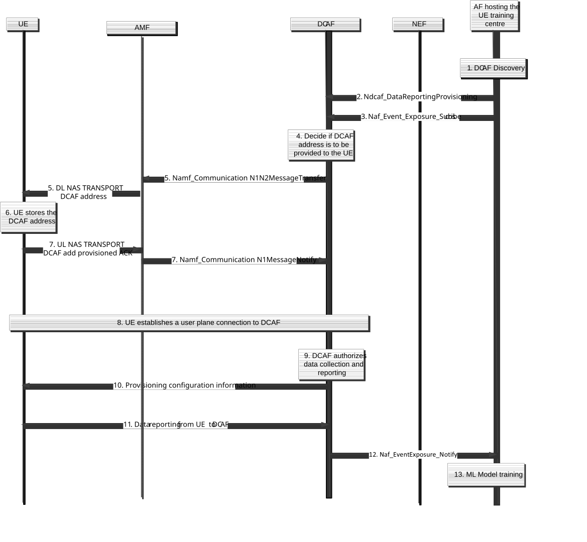

# 6.13 Solution \#13: User Plane solution for Data collection for UE-side model training

## 6.13.1 High-level solution principles

The solution follows the following principles:

\- Reuses the generic architecture for collecting and exposing the collected UE data, via an intermediate Application Function defined in clause 6.2.8 of TS 23.288 \[5\] and in TS 26.531 \[12\].

\- Reuses the generic architecture for provides events to the event consumer using the event exposure service, defined in clause 6.2.8 of TS 23.288 \[5\] and in TS 26.531 \[12\]. This allows for the MNO controllability and MNO visibility of the data with minor changes in the 3GPP specifications.

\- The intermediate Application Function, i.e. DCAF is always located in the operator's domain.

The UE is configured by DCAF via user plane and the UE reports to DCAF the collected data via user plane. The DCAF configures the UE with the DCAF address or FQDN via NAS.

\- Differentiation of the traffic for model training for charging purposes, traffic differentiation is achieved either by associating this traffic to a PDU Session to a dedicated DNN and S-NSSAI or if this traffic runs in a PDU Session that is not dedicated to the traffic for model training using PCC Rules that assigns a separate Charging Key to the traffic from/to the UE from/to the DCAF.

Editor's note: It is FFS Whether this solution fulfils the architectural requirements to study UP Data Collection (for Option 2) are as documented in RAN LSs RP-243316 and RP-242389.

Editor's note: Whether this solution addresses option 1b or option 2 needs to be checked with RAN before reaching conclusions.

NOTE 1: User consent aspects are out of the scope of this solution

NOTE 2: The interface between the client in the UE and the chipset is not covered in this solution as it is out of the scope of 3GPP.

## 6.13.2 Description

This solution is addressing KI#1: Data collection over user plane for UE side model training.

This solution reuses the generic architecture for collecting and exposing the collected UE data, via an intermediate Application Function that provides events to the event consumer using the event exposure service, defined in clause 6.2.8 of TS 23.288 \[5\] and in TS 26.531 \[12\] with the following considerations:

\- The intermediate Application Function, i.e. DCAF:

\- is always located in the MNO to fulfil the requirements on visibility and controllability of the data collection procedure.

\- Receives configuration data from the UE training centre per each of the EventIDs.

\- Receives request to collect input data from the UE for model training, via existing Naf_EventExposure service.

\- Decides whether and when to initiate and terminate the data collection from the UE, e.g. the DCAF may use e.g. PDTQ to determine when to start or whether to terminate data collection or the RAN, or take decisions when requests from multiple UE training centres are received.

\- The UE training centre:

\- may be located in the trusted MNO domain or in an untrusted MNO domain.

\- provides configuration information to DCAF.

\- Triggers the request for data collection towards the DCAF.

\- Checks user consent before requesting data from DCAF.

\- The UE:

\- request configuration information from DCAF.

\- performs data collection and provides it to the DCAF as indicated in the configuration information provided per EventID, as such the UE (e.g. DCAF client would need enhancements to report the EventID)

\- How the data collected is secured and how data integrity and confidentiality for that data is ensured is described in clause 4.5 of TS 26.531 \[12\], Information security model, whether additional requirements are foreseen will be discussed by SA WG3.

\- It is assumed that the UE receives configuration information from DCAF, then the UE requests resources and configuration information from gNB, as such no requirements exists in SA WG2, it is rather between RAN and the UE when it comes to "SA WG2 can assume that the gNB is involved in providing radio measurement configuration (if needed) for beam management use case and LMF is involved in providing PRS measurement configuration (if needed).

The figure below schematically shows the solution for data collection from the UE via user plane, based on the reference architecture defined in clause 4.2 of TS 26.531 \[12\]. Note that the interface between the UE Application and the Direct Data collection that is defined in TS 26.531 \[12\] is internal to the UE, as such this solution considers the UE only with no distinction between both. Interactions at R8 reference point are out the scope of 3GPP, according to clause 4.3 of TS 26.531 \[12\], therefore not shown in the figure below. R8 interface is not used in this solution.

Figure 6.13.2-1: Data Collection from the UE and transfer to the UE training centre for Model training

## 6.13.3 Procedure for collecting UE data and reporting to the UE training centre

This procedure follows clause 6.2.8 of TS 23.288 \[5\] and TS 26.531 \[12\] and for data collection from the UE and reporting the data collected to the UE training centre. Figure 6.13.3-1 shows how the procedure is applied for collecting input data for training a ML Model.

Figure 6.13.3-1: UE training centre triggers data collection from the UE, UE provisioning and UE reporting via user plane

1\. The UE training centre determines that data collection is needed for training an AI/ML Model, then discovers and selects the DCAF that provides data collection (based on the DCAF profiles registered in NRF). The DCAF profile is extended to indicate the new EventIDs that DCAF supports include CSI compression data, CSI prediction data, Beam management, or UE Positioning or combinations of those.

2\. The UE training centre provides configuration information per Event ID to the DCAF, this includes information to enable the UE to collect the input data per Event ID, how data is to be sampled by the UE (e.g. sampling frequency, location filter) and how to report the required input data for ML Model training to the UE training centre (e.g. reporting probability, reporting frequency, reporting format, data packaging strategy). This information is defined in TS 26.531 \[12\]. The DCAF stores the provisioning data until it decides to start the data collection.

3\. The UE training centre subscribes to the DCAF for UE data collection, possibly via NEF, using Naf_EventExposure Subscribe including the Target for Event Reporting (i.e. any UE), both Event ID(s), Event reporting information including the type of measurements to be collected, Event Filters such as UE location (to enable to collect data in certain areas only) listed in clause 5.2.19.2.1 of TS 23.502 \[3\]. The DCAF stores the provisioning data until the UE needs to train the model. The DCAF accepts request for measurements only to those UEs that are in the scope of the UE Training centre, e.g. mapping an Application Id provided by the UE training centre into a list of SUPIs in the scope of the UE training centre and support providing data for model training and those UEs that support ML Model training and reporting input data.

4\. The DCAF contacts the AMF covering that area of interest to find the list of SUPIs registered in that area using Namf_EventExposure including EventID "UEs in an area of interest" and include as Event Filter those UEs that support AI/ML Model training and reporting input data. Note that the UE reports its UE capabilities in the Registration procedure where the support for this feature is indicated.

5\. The DCAF decides when to provision its own address or FQDN to those UEs provided by AMF that consent to data collection, via Namf_CommunicationN1N2MessageTransfer. The provisioning of the DCAF address or FQDN is an indication that the UE requests configuration information to start data reporting.

6\. The UE stores the DCAF address or FQDN.

7\. The UE sends a confirmation that the DCAF address or FQDN is stored in the UE using Namf_CommunicationN1N2MessageNotify. The provisioning of the DCAF address is used by the UE as an indication that to establish a user plane connection to start the data collection to train the model.

8\. The UE establishes a user plane connection to retrieve the provisioning information and report collected measurements to the DCAF. The user plane connection may be established via an existing PDU Session or the UE may establish a PDU Session, this is decided by the UE using the provisioned URSP Rules by the PCF.

9\. The DCAF authorizes the UE request, as such the UE that requests the establishment to a user plane connection is matched with those UEs that the AMF provided in step 4.

10\. The DCAF provides provisioning information to indicate to the UE to report measurements, the DCAF may include a time if the data reporting to DCAF needs to take place at a certain time, i.e. when the timer expires.

11\. When the UE receives the provisioning information from DCAF, the UE starts data collection and reporting to DCAF, when the timer expires.

NOTE: The UE requests the gNB for radio resources, then gNB provides reference signals and necessary configuration to the UE for data collection. When the UE gets radio resources and configuration information then the UE can start measurement. The UE reports to DCAF according to the instruction from DCAF.

Editor's note: The UE and the gNB behaviour would need to be checked with RAN WG2.

12\. The DCAF verifies that the data collected is according to the data requested by the UE training centre, if it is so the DCAF may perform grouping of the UE data before reporting to the UE training centre the collected data.

13\. The UE training centre trains the ML Model with the input data provided by DCAF.

**Other aspects:**

\- How to differentiate the traffic for UE data collection from the UE regular traffic in the 5GC for charging purposes. The following options are possible, a) the traffic for data collection is sent over the same PDU Session as traffic not related to data collection, as such not sent to DCAF, a PCC Rule can be used to assign a different charging key to the traffic sent to/from the UE to the DCAF, b) a URSP Rules associates the traffic sent to the DCAF to a dedicated DNN,S-NSSAI.

## 6.13.4 Aspects for further consideration

\- What information is sent in the provisioning request to the UE.

\- RAN requirements on User data privacy and anonymity are FFS.

\- Relation with the LCS privacy profile when requesting positioning data.

## 6.13.5 Impacts on services, entities and interfaces

**DCAF:**

\- Extensions to the AF exposure service with new EventIDs and configuration parameters from the UE training centre, including registration in NRF and subscription and notify service operations.

\- Determines when to start and terminate the data collection, notifies the UE about the data to be collected and when the data collection and reporting to the UE training centre starts.

\- Determines what information to configure to the UE based on the provisioning request from the UE training centre.

**UE:**

\- Reports support for ML Model training and reporting input data during registration.

\- Receive provisioning information for the new EventIDs and collects and report the collected data for an EventID.

\- May receive a timer to indicate that reporting the data collected should start when the timer expires.

**UE training centre:**

\- Provide provisioning information for the new EventIDs.

\- Subscribe to the reporting of measurements for training a model.

\- May use AF influence on traffic routing to enable sending URSP Rules to their UEs.

**AMF:**

\- Stores the UE capabilities to train a ML Model and to report data for training.
