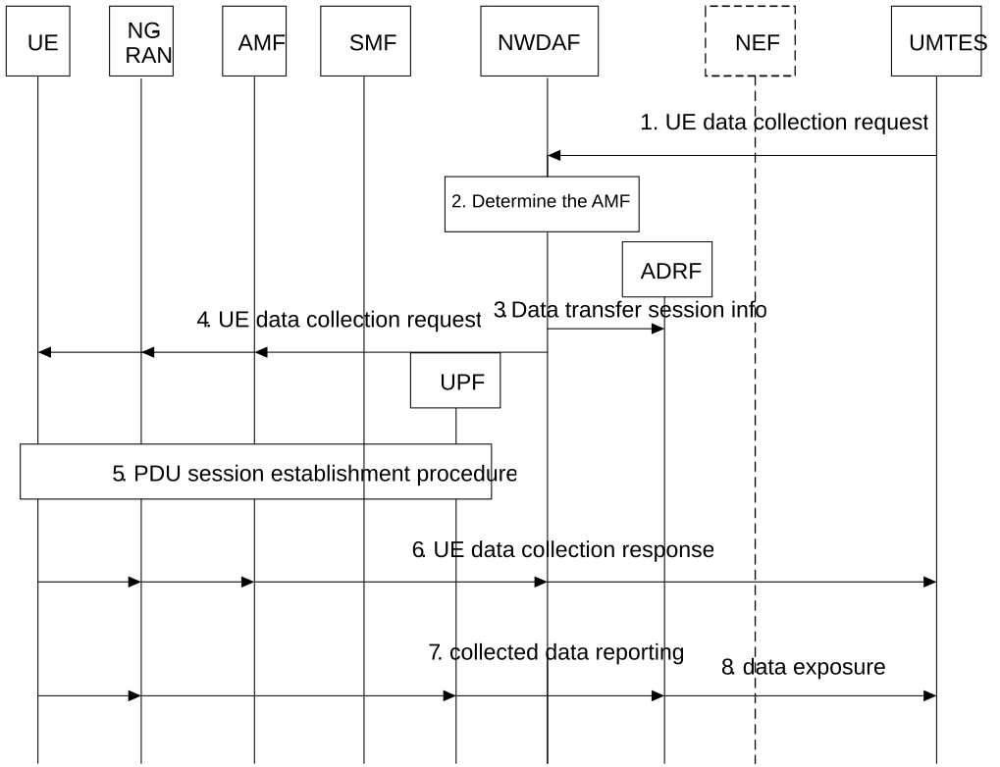

# 6.14 Solution \#14: UE data collection over the user plane

## 6.14.1 High level principles

The high level principles of the solution are:

\- The NWDAF validates UMTES requests, checks UE consent, and provides UE data collection indicator to UE via AMF to support initiation or modification of a PDU session dedicated to UE data collection.

\- ADRF receives the collected UE related data from UPF via N6 or N9 interface.

\- The UE may establish or modify a dedicated PDU session for data collection, guided by URSP rules and the UE data collection request provided by NWDAF.

## 6.14.2 Description

This solution is to address Key Issue#1 for UE data collection over UP.

## 6.14.3 Procedures

Figure 6.14.3-1: Procedure for UE data collection over user plane

1\. The UMTES (UE Model Training Entity Server) sends the UE data collection request including parameters such as UE ID(s) (SUPI(s), group or any UE), area of interest and time duration to 5GC functions, e.g. NWDAF via the NEF. The request is authorized by the NEF for the untrusted AF.

2\. The NWDAF checks the UE consent for data collection for these UE ID(s) and if it is granted, the NWDAF stores the UE ID(s) (SUPI(s), group or any UE), area of interest and time duration and determines the serving AMF(s) via UDM based on the UE ID or the UE ID list.

3\. NWDAF provides information about data transfer session to ADRF including expected data formats for verification and storage identifiers and the UMTES address information.

4\. The NWDAF sends the UE data collection request to the UE via the AMF, NG-RAN, SMF and PCF including UE data collection indicator, data type, reporting area, UP configuration (e.g., ADRF IP address/FQDN) and URSP guidance.

5\. UE evaluates URSP rules and initiates or modify a PDU session via NG-RAN, AMF, SMF and UPF using dedicated S-NSSAI/DNN, indicating to the 5GC the PDU session is used only for UE data collection, With such indication, for example, 5GC may charge the user differently for the traffic associated with this PDU session as compared to traffic associated with other PDU sessions.

6\. After PDU session establishment, the UE sends the UE data collection response to NWDAF and NWDAF responses to UMTES via the NEF.

7\. The UE performs UE data collection and sends the collected data over the established PDU Session to UPF. UPF matches data against PDRs and forwards to ADRF via configured routing.

8\. Based on the UMTES address information proved by NWDAF in step 3, the ADRF exposes the data to UMTES optionally via the NEF for the untrusted AF.

## 6.14.4 Impacts on services, entities and interfaces

**NWDAF:**

\- Supports to handle signalling of the data collection request by UMTES and provides information for AMF/SMF to support PDU session establishment/modification.

\- Sends the UE data collection request to UE via the AMF, NG-RAN, SMF and PCF including UE data collection indicator, data type, reporting area, UP configuration (e.g., ADRF IP address/FQDN) and URSP guidance.

**ADRF:**

\- Supports to perform UE data collection, data storage, data processing, data exposure, etc.

\- Receives the UE data from UPF via N6 or N9 interface and stores the data.

\- Exposes the data to UMTES via the NEF.

**UE:**

\- Initiate a PDU session establishment procedure or modify an existing PDU session based on UE data collection indicator.

\- Performs UE data collection and sends the uplink data to ADRF.
