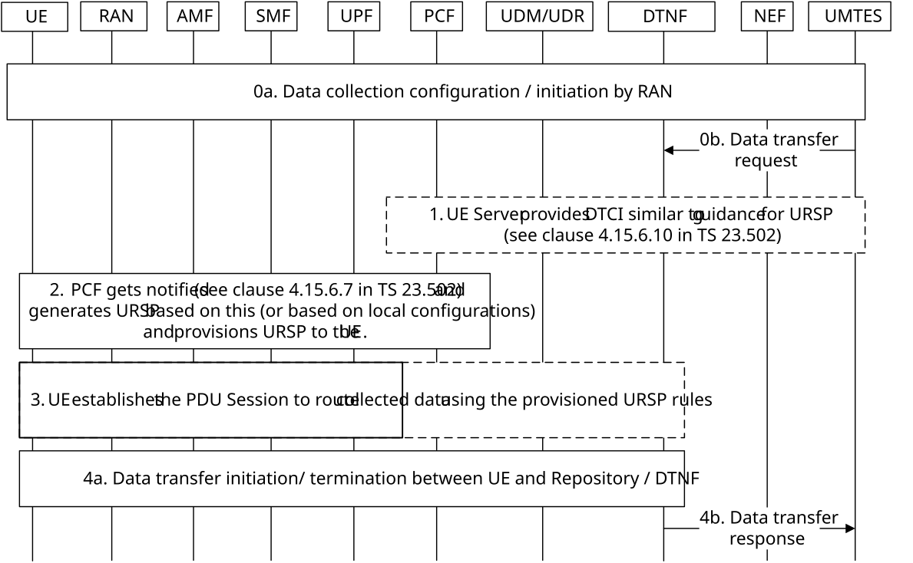

# 6.15 Solution \#15: UE data transfer over UP based on guidance for URSP

## 6.15.1 High level principles

The high level principles of this solution are:

\- The solution leverages existing guidance for URSP procedure from TS 23.502 \[3\] to configure Data Transfer Configuration Information on the UE (e.g. from a trusted UMTES in MNO domain). Alternatively, URSP can be generated based on input from Data Transfer Network Function or MNO local configurations (e.g. for an UMTES outside MNO domain).

\- The UE establishes UP PDU Session based on above to the data repository (managed by Data Transfer Network Function).

\- The data transfer initiation/ termination occurs in-band over UP PDU session based on data transfer request/ response between UMTES (via NEF, e.g. in the case of an UMTES outside MNO domain) and the data repository (managed by Data Transfer Network Function).

## 6.15.2 Description

This is a solution to address KI#1 based on principles described in clause 6.15.1 and terminology described in clause 6.15.2.1.

### 6.15.2.1 Terminology

*Data collection initiation* refers initiation/ request of data collection on the UE. This step can be via (1) UE request or (2) via a UE Server, i.e. the Server for data collection for UE-side model training or the UMTES.

*Data collection configuration* refers to AS-level configurations required by UE to perform measurements. This step is fully in remit of RAN WGs.

*Data collection* refers to the UE collecting data that involves the UE performing measurements (e.g. radio measurements). Note UE may report collected data periodically, event-based and on-demand to RAN. This step is fully in remit of RAN WGs.

*Data transfer request* refers to request to transfer the collected data from the UE to Server for data collection for UE-side model training (or any associated UMTES).

*Data transfer configuration* refers to CN/NAS-level or RAN-level configurations required by UE/ RAN node to transfer the collected data to the associated Server for data collection for UE-side model training. The CN/ NAS-level configurations are in remit of SA WG2.

NOTE: Data Collection configuration and data transfer configuration can be integrated or handled as separate steps.

*Data transfer* refers to the sending/transfer of the collected data from the UE to Server for data collection for UE-side model training or any associated UMTES.

## 6.15.3 Procedures

The procedure to transfer collected data from UE is described in Figure 6.15.3-1.

Figure 6.15.3-1: Procedure to transfer collected data from UE

0a. UMTES triggers data collection. This leads to data collection and related configuration procedure on the UE to be initiated by RAN. The data is being logged in the UE.

NOTE 1: Step 0a is out of the scope of SA WG2 and is in RAN remit.

0b. The data transfer request is triggered from UMTES to Data Transfer Network Function, DTNF (via NEF e.g. in case of an UMTES outside MNO domain). The request may include standardized data types that can be processed by DTNF.

1\. \[Conditional\] If UMTES is within MNO trusted domain, UMTES provides Data Transfer Configuration Information (DTCI) following a procedure similar to clause 4.15.6.10 of TS 23.502 \[3\]. The DTCI includes at least the address (e.g. FQDN), associated DNN and S-NSSAI of the data repository within CN where the UE logged data to be transferred to.

NOTE 2: DTNF can be hosted by an existing network function like DCCF. The data repository can be hosted by an existing network function like ADRF. DTNF manages the data repository (e.g. triggers data transfer request via data repository including any requested standardized data types based on data transfer request from UMTES).

2\. If UMTES is within MNO trusted domain, PCF gets notified in a procedure similar to clause 4.15.6.7 of TS 23.502 \[3\] and generates a URSP including DTCI and provisions that to the UE. Otherwise, PCF generates URSP (incl. FQDN, associated DNN and S-NSSAI) based on DTCI provided from DTNF or MNO local configurations. This step would ensure traffic for UE data collection is differentiated from the UE regular traffic in the 5GC.

NOTE 3: Steps 1, 2 can be supported based on existing URSP and no new impact is expected.

3\. UE establishes a UP PDU session to the UPF towards the data repository (managed by DTNF) based on configuration information provided in step 2. The data transfer starts after this step as long as UE has the data collected.

4a. A Secure TLS connection (e.g. via TLS handshake) is set-up between UE and data repository (managed by DTNF).

DTNF (via the data repository) conveys the data transfer request from step 0b (including any requested standardized data types) to UE over the Secure TLS connection.

UE pre-processes (collected data in step 0a) based on requested standardised data types. UE initiates the data transfer to the data repository (managed by DTNF) on TLS connection over the UP PDU session.

The data repository verifies the data from UE.

The TLS connection terminates securely when data transfer is completed and DTNF is notified on data ready within repository.

4b. DTNF (via NEF e.g. in case of an UMTES outside MNO domain) responds to UMTES on the data file transfer to be completed (i.e. ready within the data repository).

The UMTES fetches data from the data repository in UP by using file transfer protocols.

NOTE 4: How UMTES fetches data from the data repository i.e. file transfer protocols is not in the scope of SA WG2.

## 6.15.4 Impacts on services, entities and interfaces

**DTNF:**

\- supports data transfer request/ response from/ to UMTES.

\- supports data transfer initiation/ termination over UP PDU session from UE.

\- manages the data repository.

**UE:**

\- optionally interprets DTCI as part of URSP to establish a PDU session.

\- supports data transfer initiation /termination over UP PDU session to the data repository (managed by DTNF).
